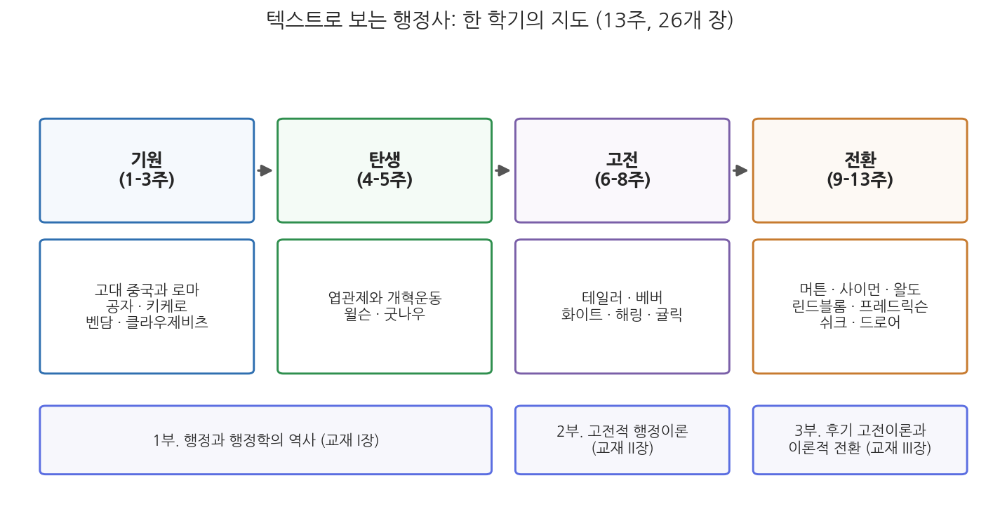
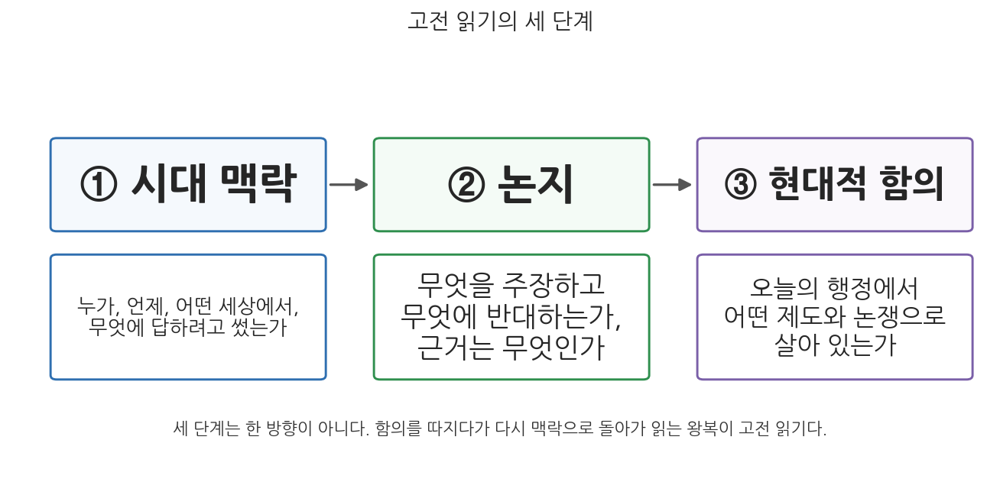

# 1주차 1차시. 강의의 문: 텍스트로 행정사를 읽는다는 것

> 세계사는 공공 행정 제도가 일어서고 무너져 온 역사로도 읽을 수 있다.
> (샤프리츠·하이드 편, 『행정학 고전선집』 I부 해설)

## 이 장에서 배우는 것

행정학과 신입생이 흔히 품는 의문 하나에서 시작하자. "행정학은 지금 여기의 정부를 다루는 학문인데, 왜 2,500년 전 공자와 2,000년 전 키케로(Marcus Tullius Cicero)까지 읽어야 하는가?"

이 의문에 답하기 위해 가까운 예를 하나 보자. 해마다 수십만 명이 응시하는 공무원 공개채용 시험이다. 우리는 이 제도를 당연하게 여기지만, 곰곰이 따져 보면 당연하지 않은 약속들이 여러 개 전제되어 있다. 공직은 특정 가문이나 정파의 전리품이 아니라 누구에게나 열려 있어야 한다는 약속, 사람을 고를 때는 연줄이 아니라 시험으로 확인한 능력을 기준으로 삼는다는 약속, 뽑힌 사람은 사사로운 주인이 아니라 공공에 봉사한다는 약속이다. 첫 번째와 두 번째 약속의 원형은 시험으로 관료를 뽑아 2천 년 가까이 제국을 운영한 중국의 과거제에 있고, 세 번째 약속은 로마와 근대 유럽에서 온 "공복(public servant)"이라는 말에 담겨 있다. 오늘 우리가 쓰는 제도는 과거의 질문에 대한 과거의 대답이 누적된 결과다. 행정사는 그 누적 과정을 거슬러 살피며 "왜 지금 이런 모양인가"를 묻는 공부다.

이 과목의 또 하나의 특징은 공부하는 방식에 있다. 우리는 교과서의 요약이 아니라 고전 원전(text)을 직접 읽는다. 공자의 『논어』, 키케로의 『의무론』, 우드로 윌슨(Woodrow Wilson)의 「행정학 연구」, 막스 베버(Max Weber)의 「관료제」를 발췌한 텍스트가 매주 우리 앞에 놓인다. 이 첫 장은 그 과정의 출발점이다. 구체적으로 다음을 배운다.

- 행정사를 왜 배우는가: 제도의 역사적 누적, 반복되는 질문, 이론과 시대의 상호작용
- 요약본이 아니라 고전 원전을 직접 읽는 이유
- 이 교재 전체의 구성: 기원, 탄생, 고전, 전환의 네 국면
- 고전을 읽는 방법: 시대 맥락, 논지, 현대적 함의의 세 단계

<strong>이 장의 로드맵</strong> 
이 장은 하나의 질문을 따라 전개된다. <em>"현재의 행정을 이해하는 데 왜 옛 텍스트가 필요하며, 그 텍스트를 어떻게 읽어야 하는가?"</em>  
<strong>1.1</strong> 행정사를 배우는 세 가지 이유를 본다 →
<strong>1.2</strong> 요약이 아니라 원전을 읽는 이유를 따진다 →
<strong>1.3</strong> 한 학기 전체의 구성을 살펴본다 (기원 → 탄생 → 고전 → 전환) →
<strong>1.4</strong> 고전 읽기의 세 단계를 익히고, 1부의 개요와 첫 대목으로 연습해 본다.

## 1.1 행정사를 왜 배우는가

### 현재의 제도는 역사가 누적된 결과다

행정학은 흔히 젊은 학문이라 불린다. 독립된 학문으로서의 행정학은 1887년 윌슨의 논문 「행정학 연구(The Study of Administration)」를 기점으로 잡는 것이 관례이니, 아직 150년이 되지 않았다. 그러나 행정 그 자체는 전혀 젊지 않다. 세금을 걷고, 창고를 관리하고, 도로를 놓고, 관리를 뽑고, 문서를 남기는 일은 문자의 발명만큼 오래되었다. 뒤에서(1주차 2차시) 자세히 보겠지만, 고대 이집트와 바빌로니아 사람들은 이미 관리와 행정의 기법에 관한 조언을 문서로 남겼다. 학문은 젊고 대상은 오래된 것이다.

이 간격이 행정사를 배워야 할 첫 번째 이유를 만든다. 오늘의 행정 제도는 어느 한 시점에 한꺼번에 설계된 것이 아니라, 서로 다른 시대가 남긴 대답들이 누적된 결과물이기 때문이다. 필기시험으로 공무원을 뽑는 제도 뒤에는 중국의 과거제와 1883년 미국 펜들턴법(Pendleton Act)의 실적주의가 있다. 계층제와 문서주의로 움직이는 정부 조직 뒤에는 베버가 이념형으로 정리한 근대 관료제가 있다. 사업의 능률을 따지는 성과관리 뒤에는 20세기 초 프레더릭 테일러(Frederick Taylor)의 과학적 관리가 있고, 예산서를 사업 단위로 묶는 방식 뒤에는 1960년대 예산개혁 논쟁이 있다. 제도의 겉모습만 보면 기술적 절차로 보이는 것들이, 형성 과정을 따져 보면 저마다 어떤 문제에 대응한 결과다. 그 과정을 모르는 사람은 제도를 주어진 것으로 받아들이지만, 그 과정을 아는 사람은 제도가 하나의 선택이었음을 알고, 따라서 바꿀 수 있는 것임을 안다.

<strong>정의 · 행정사</strong> 
<strong>행정사</strong>(history of public administration)는 행정의 역사적 전개를 다루는 분야로, 두 갈래를 포함한다. 하나는 <strong>제도의 역사</strong>다. 관료제, 인사제도, 예산제도 같은 통치의 장치들이 어떻게 생겨나고 변형되어 왔는가를 본다. 다른 하나는 <strong>사상의 역사</strong>다. 좋은 행정이란 무엇이며 국가는 무엇을 위해 존재하는가에 대한 생각들이 어떻게 이어지고 충돌해 왔는가를 본다. 이 과목은 두 갈래를 함께 다루되, 사상가들이 남긴 텍스트를 통로로 삼는다.

### 행정의 핵심 질문은 오래되었고, 반복된다

두 번째 이유는 질문의 반복성이다. 행정학이 다루는 근본 질문들은 대부분 새것이 아니다. 통치할 자격은 누구에게 있는가. 공직자는 사익과 공익이 충돌할 때 어떻게 행동해야 하는가. 정부의 목적은 무엇이며, 그 목적을 달성했는지는 무엇으로 판단하는가. 관료에게 재량을 얼마나 주어야 하며, 그 재량은 누구에게 책임을 지는가. 능률적인 행정과 민주적인 행정은 양립하는가.

이 질문들은 오늘날 인사청문회에서, 감사원 감사 결과를 둘러싼 공방에서, 규제 개혁 논쟁에서 매일 다시 제기된다. 그리고 놀랄 만큼 오래전에 이미 정면으로 다루어졌다. 공직자의 도덕적 자격은 기원전 5세기 공자의 문답에서, 공익과 사익의 충돌은 기원전 44년 키케로가 아들에게 쓴 『의무론(De Officiis)』에서, 정부의 목적을 행복의 총량으로 재자는 제안은 18세기 제러미 벤담(Jeremy Bentham)에게서, 재량과 책임의 긴장은 1930년대 뉴딜기의 논쟁에서 다루어졌다. 물론 옛 대답을 그대로 오늘에 이식할 수는 없다. 그러나 같은 질문을 오래 다룬 기록을 읽은 사람은, 오늘의 논쟁에서 무엇이 정말 새로운 쟁점이고 무엇이 되풀이되는 쟁점인지 구별할 수 있게 된다.

### 이론은 시대의 산물이다: 가치 전환을 보는 안목

세 번째 이유는 이론과 시대의 상호작용이다. 이 과목에서 읽을 텍스트들은 시대와 무관하게 나온 것이 아니다. 윌슨의 행정학은 엽관제의 부패와 가필드 대통령 암살이라는 충격 속에서, 테일러의 과학적 관리는 산업화와 도시화에 따른 비능률 속에서, 신행정학의 사회적 형평성은 1960년대 미국의 인종 갈등과 도시 폭동 속에서 나왔다. 시대가 바뀌면 행정이 중시하는 중심 가치도 바뀌었다. 크게 보면 이 교재가 다루는 100년 남짓한 행정학의 역사는 도덕에서 능률로, 능률에서 합리성으로, 합리성에서 형평으로 중심 가치가 옮겨 온 역사이기도 하다(14주차에서 이 궤적 전체를 다시 조망한다).

이 상호작용을 볼 줄 알면 두 가지 안목이 생긴다. 하나는 이론을 상대화하는 안목이다. 어떤 이론도 모든 시대의 정답이 아니라 특정 시대의 문제에 대한 응답임을 알게 된다. 다른 하나는 현재를 상대화하는 안목이다. 지금 우리가 자명하게 여기는 가치, 예컨대 성과와 효율 중심의 행정관 역시 영원한 상식이 아니라 언젠가 등장했고 언젠가 도전받을 하나의 시대적 대답임을 알게 된다. 이 과목의 목표를 한 문장으로 줄이면 이것이다. 행정학의 사상적 기초와 이론적 발전을 역사적 맥락 속에서 비판적으로 검토하고, 이를 통해 행정의 공공성, 합리성, 대표성, 윤리성 같은 핵심 가치를 성찰하는 지적 기반을 만드는 것이다.

## 1.2 고전 원전을 직접 읽는 이유

### 요약과 원전은 무엇이 다른가

행정학 개론 교과서는 이 과목이 다룰 사상가들을 대개 한두 문장으로 처리한다. "윌슨은 정치와 행정의 분리를 주장하였다." "베버는 관료제의 이념형을 제시하였다." "사이먼은 고전적 조직 원리를 격언에 불과하다고 비판하였다." 틀린 문장들은 아니다. 그러나 이런 요약만 읽는 것은 결론만 확인하고 그 저작을 다 읽었다고 말하는 것과 같다. 요약은 결론을 주지만, 그 결론이 무엇에 반대하며, 어떤 불안 속에서, 어떤 근거에서 나왔는지는 주지 않는다.

원전을 펼치면 다른 것이 보인다. 1887년의 윌슨을 직접 읽으면, "헌법을 운영하는 것이 헌법을 만드는 것보다 어렵다"는 문장 뒤에 있는 젊은 학자의 초조함이 보인다. 남북전쟁 이후 부패한 엽관제 정부를 눈앞에 두고, 행정을 정쟁에서 떼어 놓으려는 절박함이 논문 전체에 나타난다. 그 맥락을 보고 나면 "정치행정이원론"이라는 교과서 용어가 무미건조한 분류표가 아니라 하나의 시대적 처방이었음을 알게 되고, 그 처방이 반세기 뒤에 왜 무너지는지(9주차의 해링, 11주차의 왈도)도 하나의 이야기로 이해된다.

원전 읽기의 이점을 정리하면 네 가지다.

- **사고의 과정을 본다.** 요약은 완성된 답만 보여 주지만, 원전은 저자가 답에 이르는 추론, 망설임, 반론 처리까지 보여 준다. 학문의 훈련에서 답보다 값진 것이 이 과정이다.
- **맥락이 복원된다.** 원전에는 그 시대의 상황이 담겨 있다. 저자가 누구를 설득하려 했고 무엇을 두려워했는지가 문장에 그대로 남아 있다.
- **요약의 왜곡을 교정한다.** 교과서의 요약은 여러 손을 거치며 단순해지고, 때로 원저자가 하지 않은 말이 덧붙는다. 원전을 읽은 사람만이 "그 사람이 정말 그렇게 말했는가"를 판별할 수 있다.
- **읽는 능력이 길러진다.** 길고 낯선 텍스트에서 논지를 추려 내는 능력은 행정가의 일상 역량이기도 하다. 법령, 판례, 계획서, 감사보고서를 읽는 일이 곧 그것이다.

<strong>왜 행정학 선집이 공자와 키케로까지 거슬러 올라가는가?</strong> 
이 과목의 원전 텍스트 다수는 샤프리츠와 하이드가 엮은 『행정학 고전선집(Classics of Public Administration)』 계열 선집에 바탕을 둔다. 이 선집은 오랫동안 1887년 윌슨의 논문을 첫 장으로 삼았다. 행정학의 "원년"을 그렇게 잡아 온 것이다. 그런데 8판(2017)에 이르러 편자들은 공자의 『논어』와 키케로의 『의무론』 등 고대 텍스트를 책의 맨 앞에 새로 실었다. 행정학이라는 학문은 19세기 말의 발명품이지만, 행정이라는 실천과 그것을 둘러싼 사유는 국가 형성(state-building)의 역사만큼 오래되었다는 판단이었다. 이 교재의 1-3주가 고대와 근대 초의 텍스트에서 출발하는 것도 같은 이유에서다.

### 원전은 완결된 결론이 아니라 논쟁의 기록이다

한 가지 오해를 미리 바로잡자. 고전을 읽는다는 것은 위인의 어록을 경청하고 암기하는 일이 아니다. 이 과목에서 읽을 저자들은 서로 반박하고, 후대에 반박당하고, 때로는 스스로 틀린다. 굿나우가 정교하게 다듬은 이원론은 해링에 의해 현실과 맞지 않는다고 비판받고, 귤릭이 집대성한 조직 원리는 사이먼에 의해 "격언"으로 격하되며, 능률을 최고 가치로 삼은 정통 교리는 왈도와 프레드릭슨에 의해 민주주의와 형평의 이름으로 비판받는다. 고전은 결론의 목록이 아니라 긴 논쟁의 기록이며, 읽는 우리는 그 논쟁을 지켜보기만 하는 것이 아니라 뒤늦게 참여하는 토론자다. 각 장 끝의 토론 문제가 항상 "당신의 판단"을 묻는 것은 그래서다.

## 1.3 이 교재의 구성: 기원, 탄생, 고전, 전환

### 네 국면으로 보는 한 학기

이제 한 학기 전체의 구성을 살펴보자. 이 교재는 3부, 13개 주, 26개 장으로 구성되며, 내용의 흐름은 네 국면으로 요약된다. 기원, 탄생, 고전, 전환이다.

그림 1-1을 읽는 법은 이렇다. 위 줄의 네 상자가 내용의 네 국면이고, 각 상자 아래에 그 국면에서 만날 사상가들이 있으며, 맨 아래 줄은 이들이 이 교재의 3부 구성과 어떻게 대응하는지 보여 준다. 이 그림에서 알 수 있는 것은 두 가지다. 첫째, 행정학이라는 학문이 태어나기(탄생) 전에 긴 전사(기원)가 있다. 둘째, 학문이 자리 잡은 뒤의 역사는 고전이 세워지고(고전) 그 고전이 비판받는(전환) 변증법적 과정이다.

**표 1-1. 한 학기의 구성**

| 국면 | 주차 | 만나는 텍스트와 사상가 | 중심 질문 |
|------|------|------|------|
| 기원 | 1-3주 | 고대 중국과 로마, 공자 『논어』, 키케로 『의무론』, 벤담 『공리의 원리』, 클라우제비츠 『전쟁론』 | 통치할 자격은 무엇이며, 국가의 목적은 무엇인가 |
| 탄생 | 4-5주 | 엽관제와 개혁운동, 윌슨 「행정학 연구」, 굿나우 『정치와 행정』 | 행정을 어떻게 독자적 연구 대상으로 세우는가 |
| 고전 | 6-9주 | 도시행정의 문제, 테일러의 과학적 관리, 베버의 관료제, 화이트의 교과서, 해링의 공익론, 귤릭의 조직이론 | 능률적인 행정의 원리는 무엇인가 |
| 전환 | 10-14주 | 머튼, 사이먼, 왈도, 린드블롬, 프레드릭슨, 쉬크, 드로어, 그리고 종합 | 고전적 원리는 과연 옳았는가, 행정은 누구를 위한 것인가 |

네 국면이 바뀌는 지점마다 중요한 사건이 있다는 점도 미리 말해 둔다. 기원에서 탄생으로 넘어가는 시기에는 대통령 암살(1881년 가필드)과 공무원제도 개혁이 있고, 고전에서 전환으로 넘어가는 시기에는 대공황과 뉴딜, 제2차 세계대전이 있다. 행정사의 전환점은 언제나 시대의 전환점과 맞물려 있었다.

### 다음 차시부터 다룰 내용

바로 다음 차시(1주차 2차시)에서 우리는 기원의 첫 부분을 다룬다. 세계사를 행정 제도의 흥망사로 읽는 관점을 배우고, 최초의 행정국가 중국과 최초의 행정제국 로마를 만난다. 2주차에는 공자의 『논어』를, 2주차 후반과 3주차에는 키케로, 벤담, 클라우제비츠를 원전으로 읽는다. 이 고대와 근대 초의 텍스트들은 행정학이 태어나기 전에 이미 행정학의 의제, 곧 통치의 자격, 공직의 윤리, 국가의 목적, 수단의 합리성을 거의 다 담고 있다. 4주차부터 시작되는 "행정학의 탄생" 이야기는 그 오래된 의제 위에서만 제대로 이해된다.

## 1.4 고전 읽기의 방법: 시대 맥락, 논지, 현대적 함의

### 세 단계 읽기

고전은 아무렇게나 읽어서 읽히는 텍스트가 아니다. 이 과목은 매주 같은 세 단계를 반복한다.

그림 1-2가 그 틀이다. 첫째 단계는 **시대 맥락**이다. 텍스트를 열기 전에 묻는다. 누가, 언제, 어떤 세상에서, 무엇에 답하려고 이 글을 썼는가. 『의무론』이 내전으로 공화정이 무너져 가는 로마에서 쓰였다는 사실, 「행정학 연구」가 엽관제 개혁 직후의 미국에서 쓰였다는 사실을 모르면 두 텍스트의 절반은 이해할 수 없다. 둘째 단계는 **논지**다. 텍스트 안으로 들어가 묻는다. 저자는 무엇을 주장하고, 무엇에 반대하며, 근거는 무엇인가. 특히 "무엇에 반대하는가"가 중요하다. 모든 고전은 가상의 또는 실재하는 논적을 향해 쓰였고, 논적을 찾으면 논지가 선명해진다. 셋째 단계는 **현대적 함의**다. 텍스트 밖으로 나와 묻는다. 이 주장은 오늘의 행정에서 어떤 제도, 어떤 논쟁으로 살아 있는가. 공자의 인사론을 실적주의와, 키케로의 공익론을 이해충돌방지법과, 베버의 관료제를 우리 정부 조직과 잇대어 보는 일이다.

그림에서 보듯 세 단계는 한 방향으로만 진행되는 절차가 아니다. 함의를 따지다가 해석이 막히면 다시 맥락으로 돌아가고, 논지를 다시 검토하는 왕복이 실제의 읽기다.

<strong>유의 · 시대착오의 두 함정</strong> 
고전을 현대와 잇는 셋째 단계에는 함정이 둘 있다. 하나는 <strong>과잉 동일시</strong>다. "공자가 말한 것이 바로 오늘의 성과관리다"처럼 옛 개념을 현대 제도와 곧바로 등치하면, 두 시대의 차이가 지워지고 해석은 견강부회가 된다. 다른 하나는 <strong>과잉 단절</strong>이다. "군주정 시대의 이야기니 민주국가와는 무관하다"고 잘라 버리면 고전에서 배울 것이 남지 않는다. 좋은 읽기는 그 사이에 있다. 질문의 연속성은 인정하되, 대답의 시대적 조건을 함께 따지는 것이다.

### 연습: 1부의 개요 읽기

방법을 배웠으니 바로 연습해 보자. 대상은 우리가 앞으로 다섯 주 동안 읽을 1부("행정과 행정학의 역사")의 개요다. 개요는 1부의 과제를 이렇게 요약한다. 행정과 행정학의 역사적 전개를 개관하면서, 행정이 어떤 통치기술과 제도적 실천으로 형성되고 변형되어 왔는지를 분석한다는 것이다. 그러기 위해 고대에서 근대까지 쌓여 온 행정사상의 기원을 검토해 "국가목적이 어떻게 정당화되고 공적 권위가 어떤 논리로 조직되었는지"를 밝히고, 국가목적의 설정과 집행에서 합리성이 무엇을 뜻했는지, 그 합리성이 "효율성, 정당성, 책임성과 어떤 긴장관계"를 이루는지 논의한 뒤, 근대 국가의 팽창과 함께 행정학이 독자적 학문으로 출현한 배경을 추적하겠다고 예고한다.

이 짧은 개요는 1부(1-5주)의 구성을 세 부분으로 제시하는 셈이다. 첫째 부분은 행정사상의 기원이다. 국가의 목적을 무엇으로 정당화하고 공적 권위를 어떤 논리로 조직했는가를 고대까지 거슬러 올라가 본다(1-2주). 둘째 부분은 국가목적과 합리성이다. 목적을 세우고 집행할 때 "합리적"이라는 말이 무엇을 뜻했는지를 벤담과 클라우제비츠를 통해 본다(3주). 셋째 부분은 행정학의 탄생이다. 근대 국가가 팽창하면서 행정이 독자적 학문의 대상이 되는 과정을 본다(4-5주).

눈여겨볼 대목은 합리성이 효율성, 정당성, 책임성과 "긴장관계"에 있다는 구절이다. 이 한 구절이 사실상 한 학기 전체의 주제를 압축한다. 능률(효율성)을 앞세운 고전 이론, 그 능률이 민주적 정당성과 충돌한다는 왈도의 비판, 완전한 합리성이 애초에 불가능하다는 사이먼과 린드블롬의 반론, 능률 대신 형평을 세우자는 신행정학까지, 우리가 읽을 논쟁의 대부분이 이 긴장에서 나온다.

편저자 샤프리츠와 하이드가 쓴 I부 해설의 첫 대목도 같은 방식으로 읽어 보자. 도입은 행정에 관한 저술이 고대 문명까지 거슬러 올라간다는 사실에서 출발한다. 고대 이집트인과 바빌로니아인은 관리와 행정의 기법에 관해 상당한 조언을 남겼고, 중국, 그리스, 로마 문명도 마찬가지였다. 현대적 관리 기법의 계보는 알렉산더 대왕의 참모 활용에서 베네치아 병기창의 조립 라인 방식으로, 마키아벨리의 리더십 이론에서 애덤 스미스의 분업 옹호로 이어진다. 일하는 사람("생명 있는 기계")도 생명 없는 기계 못지않게 세심히 돌보아야 한다고 주장한 로버트 오언, "경영의 기본 원리"가 존재한다고 본 찰스 배비지까지 오면 목록은 근대에 이른다.

요컨대 관리와 행정에 대한 지혜는 특정 시대, 특정 문명의 발명품이 아니다. 피라미드를 쌓고 관개 수로를 관리하던 고대의 서기관부터 공장의 작업 방식을 설계한 근대의 기업가까지, "사람과 자원을 조직해 큰일을 해내는 법"에 대한 사유는 끊긴 적 없이 이어져 왔다. 이 계보는 1.1절에서 말한 "학문은 젊고 대상은 오래되었다"는 명제의 증거 목록이며, 그대로 다음 차시의 출발점이 된다. 조언을 남기는 수준을 넘어, 행정 제도 그 자체로 국가의 운명을 갈랐던 두 문명, 중국과 로마의 이야기다.

## 요약

행정사를 배우는 이유는 셋이다. 첫째, 현재의 행정 제도는 역사 속에서 누적된 결과여서, 그 형성 과정을 알아야 제도가 자연물이 아니라 선택의 산물임을 알게 된다. 둘째, 공직의 자격, 공익과 사익, 재량과 책임 같은 행정의 핵심 질문은 오래되었고 반복되므로, 옛 논쟁의 기록은 오늘의 논쟁을 이해하는 기준이 된다. 셋째, 이론은 시대의 산물이어서, 이론과 시대의 상호작용을 보면 이론도 현재도 상대화할 수 있는 비판적 안목이 생긴다. 이 과목은 요약본 대신 원전을 직접 읽는데, 원전은 결론만이 아니라 사고의 과정과 시대의 상황을 보여 주고, 요약의 왜곡을 교정하며, 긴 텍스트를 읽는 능력을 길러 주기 때문이다. 한 학기의 과정은 기원(1-3주), 탄생(4-5주), 고전(6-9주), 전환(10-14주)의 네 국면으로 이어지며, 매주의 읽기는 시대 맥락, 논지, 현대적 함의의 세 단계를 왕복한다. 1부 개요가 예고하듯, 이 과정 전체를 관통하는 긴장은 합리성과 효율성, 정당성, 책임성 사이의 긴장이다.

## 토론·복습 문제

**1-1. (서술형 연습)** "행정학은 19세기 말에 태어났지만, 행정은 문명과 함께 태어났다"는 명제를 설명하고, 이 간격이 행정사를 공부해야 할 이유가 되는 까닭을 논의하시오.

**1-2. (원전 구절 해석)** 1부 개요는 국가목적의 설정과 집행에서의 합리성이 "효율성, 정당성, 책임성과 긴장관계"를 이룬다고 말한다. 이 구절이 뜻하는 바를 자신의 말로 풀고, 세 가치가 실제로 충돌한 최근 한국 행정의 사례를 하나 들어 어느 가치가 우선되었는지 평가해 보시오.

**1-3.** 여러분이 잘 아는 행정 제도를 하나 골라(예: 공무원 공개채용 시험, 국정감사, 주민등록), 그 제도가 어떤 역사적 질문에 대한 대답으로 만들어졌을지 추론해 보시오. 그리고 그 대답이 오늘날에도 유효한지 따져 보시오.

**1-4.** 교과서의 한 줄 요약("베버는 관료제의 이념형을 제시하였다" 등)만 읽는 공부와 원전을 직접 읽는 공부의 차이를, 1.2절의 네 가지 이점을 활용해 설명하시오. 또한 원전 읽기에서 빠지기 쉬운 두 가지 시대착오의 함정(과잉 동일시, 과잉 단절)을 예를 들어 설명하시오.
