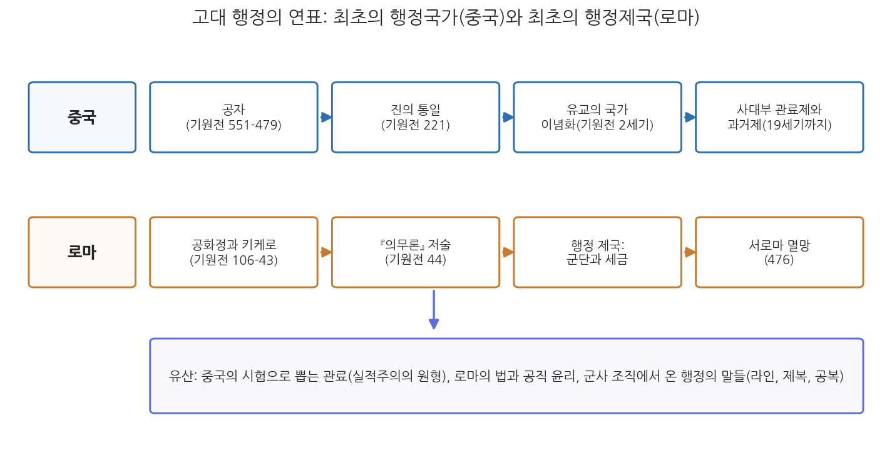
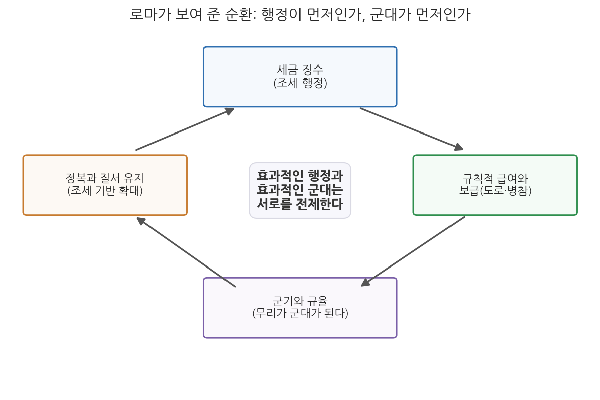

# 1주차 2차시. 행정의 기원 (1): 고대 문명과 행정 국가

> 전쟁의 힘줄은 무한한 돈이다.
> (키케로의 말로 전해지는 격언, 교재 I장 1절에서)

## 이 장에서 배우는 것

세계사 수업의 기억을 떠올려 보자. 우리가 배운 세계사는 대개 전쟁과 영웅의 역사다. 알렉산더의 원정, 한니발의 코끼리, 카이사르의 루비콘강. 그런데 이 이야기들에는 늘 보이지 않는 주인공이 있다. 수만 명의 병사가 낯선 땅에서 몇 년씩 싸우려면 누군가 곡식을 모으고, 도로를 닦고, 급여를 셈하고, 장부를 맞춰야 한다. 전투는 하루지만 보급은 매일이다. 그 "누군가"가 바로 행정관이며, 그들의 성패가 제국의 성패였다.

1차시에서 우리는 행정사를 배우는 이유와 고전을 읽는 방법을 익혔고, 교재 I장 1절의 문 앞까지 왔다. 이번 차시에는 그 문을 열고 들어간다. 세계사를 행정 제도의 흥망사로 읽는 관점을 배우고, 그 관점으로 두 고대 문명을 살핀다. 시험으로 뽑은 관료들이 2천 년 넘게 대륙 규모의 국가를 운영한 중국, 그리고 군단과 세금의 정교한 결합으로 지중해 세계를 지배한 로마다. 구체적으로 다음을 배운다.

- 세계사를 행정 제도의 흥망사로 보는 관점과 그 근거
- 최초의 행정국가 중국: 사대부 관료제의 형성 (후쿠야마와 발라즈의 분석)
- 최초의 행정제국 로마: 군단을 떠받친 세금과 보급, 그리고 몰락의 행정적 원인
- 군사 조직이 행정의 언어와 제도에 남긴 흔적 (제복, 공복, 라인)
- 키케로와 공화정의 유산, 그리고 2주차 원전 강독으로 이어지는 길

<strong>이 장의 로드맵</strong> 
이 장은 하나의 질문을 따라 전개된다. <em>"제국을 일으키고 무너뜨린 것은 무엇이었는가, 칼인가 장부인가?"</em>  
<strong>2.1</strong> 세계사를 행정 제도의 흥망사로 읽는 관점을 세운다 →
<strong>2.2</strong> 최초의 행정국가 중국에서 사대부 관료제의 탄생을 본다 →
<strong>2.3</strong> 최초의 행정제국 로마에서 군단과 세금의 순환, 그리고 군사와 행정의 오랜 동거를 본다 →
<strong>2.4</strong> 키케로와 공화정의 유산을 확인하고 다음 주 원전 강독을 준비한다.

## 2.1 세계사는 행정 제도의 흥망사다

### 용맹은 흔하고 행정은 귀하다

1차시 끝에서 읽었듯이, 행정에 관한 저술은 고대 이집트와 바빌로니아까지 거슬러 올라간다. 그러나 교재 I장 1절이 제시하는 관점은 거기서 한 걸음 더 나아간다. 행정은 문명의 부산물이 아니라 문명의 조건이었다는 것이다.

<strong>원전 읽기 · 샤프리츠·하이드 편, 『행정학 고전선집』 I부 해설(2017)</strong> 
"세계사는 공공 행정 제도가 일어서고 무너져 온 역사로도 읽을 수 있다. 고대의 제국들이 일어나 오래 유지된 것은 경쟁자보다 나은 행정 제도를 가졌기 때문이다. 용감한 병사야 어느 사회에나 넘쳐났다. 그러나 그들을 먹이고 급여를 줄 행정관이 없으면 그 용맹도 끝내 소용이 없었다. 로마의 웅변가 키케로는 '전쟁의 힘줄은 무한한 돈이다'라는 말을 처음 남긴 사람으로 흔히 알려져 있다."

**무슨 말인가.** 제국의 흥망을 가른 희소 자원은 용맹이 아니라 행정이었다는 주장이다. 용맹한 병사는 어느 사회에나 있었다. 차이를 만든 것은 그 병사들을 조직하고, 먹이고, 제때 급여를 주는 능력, 곧 조세와 보급과 인사의 제도였다. "전쟁의 힘줄은 돈"이라는 격언은 이를 한 문장으로 압축한다. 힘줄(sinews)이 없으면 근육이 아무리 커도 몸을 움직일 수 없듯이, 재정과 행정이 없으면 군사력은 움직이지 않는다.

**왜 중요한가.** 이 관점은 역사를 보는 렌즈를 바꾼다. 전쟁사의 렌즈로 보면 승패는 장군의 천재성과 병사의 용맹으로 설명된다. 행정사의 렌즈로 보면 같은 승패가 조세 기반, 보급로, 관료의 훈련 수준으로 설명된다. 이 교재 전체가 채택하는 렌즈는 후자다. 그리고 이 렌즈는 현대에도 유효하다. 오늘날 국가의 역량을 비교할 때 국제기구들이 군사력보다 정부 효과성(government effectiveness), 곧 정책을 실제로 집행해 내는 행정 능력을 주요 지표로 삼는 것은 이 오래된 통찰의 현대판이다.

관리 지혜의 계보가 알렉산더의 참모진에서 베네치아 병기창을 거쳐 애덤 스미스와 배비지로 이어진다는 1차시의 인용도 이 관점 위에서 다시 읽힌다. 그 계보는 교양의 목록이 아니라 생존의 목록이다. 각 시대는 저마다의 규모 문제, 곧 "많은 사람과 많은 자원으로 큰일을 해내는 문제"에 부딪혔고, 그때마다 행정의 기술을 갱신해야 했다.

이 장에서 살필 두 문명을 연표로 미리 조망해 두자.

그림 1-3을 읽는 법은 이렇다. 위 줄이 중국, 아래 줄이 로마의 흐름이며, 왼쪽에서 오른쪽으로 시간이 흐른다. 이 그림에서 알 수 있는 것은 두 가지다. 첫째, 공자(기원전 551-479)와 키케로(기원전 106-43)는 각각 자기 문명의 행정 전통이 제도로 굳어지기 전, 그 원리를 사유한 사람들이다. 우리가 2주차에 두 사람의 원전을 읽는 이유다. 둘째, 두 문명의 운명은 갈렸다. 중국의 관료제는 왕조가 바뀌어도 살아남아 19세기까지 이어진 반면, 로마의 행정 체계는 제국과 함께 무너졌다. 이 대비가 2.2절과 2.3절의 주제다.

<strong>정의 · 행정국가</strong> 
<strong>행정국가</strong>(administrative state)는 넓은 뜻으로, 상비적인 행정 조직(관료제)이 통치의 중심 기구로 자리 잡은 국가를 가리킨다. 20세기 행정학에서는 행정부의 역할이 팽창한 현대 국가를 가리키는 용어로 쓰이지만(10주차 왈도), 이 장에서는 더 근본적인 뜻으로 쓴다. 통치가 정복자 개인의 역량이 아니라 훈련된 관료들의 지속적인 제도에 의해 이루어지는 국가라는 뜻이다. 이 기준으로 최초의 행정국가가 중국이고, 최초의 행정제국이 로마다.

## 2.2 최초의 행정국가, 중국: 사대부 관료제

### 전쟁이 관료제를 낳다

진정한 의미에서 최초의 고전적 행정국가는 중국이었다. 이 판단은 이 교재의 것만이 아니다. 국가 형성의 비교역사를 쓴 정치학자 프랜시스 후쿠야마(Francis Fukuyama)의 결론이기도 하다.

<strong>원전 읽기 · 프랜시스 후쿠야마, 『정치 질서의 기원(The Origins of Political Order)』(2011)</strong> 
"중국은 하나의 기준으로 짜인 다층적 행정 관료제를 만들어 냈다. 그리스와 로마에서는 끝내 일어나지 않은 일이다."(92쪽) "중국 국가 형성의 주된 동인은 전쟁, 그리고 전쟁이 요구한 조건들이었다. 그 압력 속에서 1만여 개의 정치 단위가 1,800년에 걸쳐 하나의 국가로 통합되었고, 훈련된 관료와 행정가들이 그 과정을 움직였다."(94쪽)

**무슨 말인가.** 두 가지 주장이 담겨 있다. 첫째는 비교의 주장이다. 그리스와 로마가 정치사상, 법, 군사 조직에서 눈부신 유산을 남겼지만, 전국을 하나의 기준으로 관리하는 다층적 관료제만큼은 만들지 못했다. 그것을 처음 만든 문명은 중국이다. 둘째는 인과의 주장이다. 그 관료제를 낳은 힘은 평화로운 설계가 아니라 전쟁이었다. 춘추전국시대의 수백 년에 걸친 생존 경쟁 속에서, 더 많은 세금을 걷고 더 많은 병사를 동원하고 더 정확하게 호구를 파악하는 나라가 살아남았다. 관료제는 그 경쟁의 승자가 갖춘 무기였고, 기원전 221년 진(秦)의 통일은 그 경쟁의 종착점이었다.

**왜 중요한가.** 행정 제도의 발전이 반드시 좋은 의도에서 나오지는 않는다는 것을 보여 주기 때문이다. 교재는 이 중국 국가가 "엄청나게 전제적"이었다고 지적한다. 그럼에도 그 중앙집권적 관료제는 세계 인구의 거의 4분의 1을 2천 년 넘게 하나의 정치 공동체로 묶어 두었다. 억압성과 지속성이 공존한 것이다. 행정사는 이런 불편한 조합을 자주 만나게 되는데, 성급한 찬양도 성급한 단죄도 아닌 분석의 자세가 필요하다.

### 붓을 든 지배자: 사대부 관료

전쟁이 관료제의 뼈대를 만들었다면, 그 뼈대에 살을 붙인 것은 독특한 인간형이었다. 헝가리 출신의 프랑스 중국학자 에티엔 발라즈(Étienne Balazs, 1905-1963)는 이를 세계사에 유례가 없는 계급의 탄생으로 설명한다.

<strong>원전 읽기 · 에티엔 발라즈, 『중국의 문명과 관료제(Chinese Civilization and Bureaucracy)』(1964)</strong> 
"중국은 '사대부 관료(scholar-officials)'라는 계급을 처음으로 만들어 냈다. 이들은 교육을 장악함으로써 최초의 관료 엘리트가 되었고, 통치 그 자체를 본업으로 삼는 일반 행정가로 기능했다." 발라즈는 그 정당화의 논리를 중국 고전에서 찾아 『맹자』를 인용한다. "대인은 그에 합당한 일이 있고 소인에게는 그에 합당한 일이 있다. … 마음으로 수고하는 자는 남을 다스리고, 힘으로 수고하는 자는 남에게 다스림을 받는다."

**무슨 말인가.** 사대부(士大夫)는 칼이 아니라 붓으로, 혈통이 아니라 학식으로 지배한 엘리트다. 고대의 다른 문명에서 지배층은 대개 전사 귀족이거나 세습 사제였다. 중국에서는 경전을 공부하고 시험을 통과한 사람이 다스렸다. 인용된 맹자의 구절은 그 체제의 정당화 논리를 보여 준다. 정신노동(마음으로 수고함)과 육체노동(힘으로 수고함)의 분업을 자연스러운 질서로 제시하고, 통치를 정신노동의 몫으로 배정하는 것이다.

**왜 중요한가.** 여기서 행정학의 관점에서 결정적인 연결이 만들어진다. "교육을 장악했다"는 발라즈의 관찰이 그것이다. 유교 경전이 시험 과목이 되고 시험이 관직의 관문이 되면서, 지식, 시험, 관직이 하나의 사슬로 묶였다. 학식으로 자격을 증명한 사람에게 공직을 준다는 원리, 곧 오늘날 실적주의(merit system)라 부르는 것의 원형이 여기서 만들어졌다. 다만 그 정당화 논리가 분업의 위계, 곧 다스리는 자와 다스림을 받는 자의 구분 위에 서 있었다는 점도 함께 기억해야 한다. 실적주의의 씨앗과 신분 질서의 논리가 한 몸이었던 것이다.

### 이념이 된 유교: 권위의 발판이자 책임의 근거

공자(기원전 551-479)는 이 사대부 전통이 우러르는 스승이다. 그러나 공자의 사상이 처음부터 국가의 공식 이념이었던 것은 아니다. 마이클 슈만(Michael Schuman)의 2015년 저서 『공자(Confucius: And the World He Created)』에 대한 한 서평은 2천 년에 걸친 공자의 영향력을 이렇게 요약한다.

> 아마도 그의 영향력에 가장 놀랄 사람은 정작 공자 자신일 것이다. 살아 있는 동안 그의 제자는 많지 않았고, 그의 사상이 자리를 잡기까지는 사후로도 한동안 시간이 걸렸다. 그러나 기원전 2세기 무렵 유교는 강력한 제국 통치를 떠받치는 이념적 발판으로 높이 평가되었고, 국가 과거시험 제도의 기반으로 채택되었다. 이 지위는 19세기까지 이어졌다. 권위와 깊이 결부되어 있었음에도, 중국 역사의 여러 국면에서 성인의 말씀은 통치자에게 책임을 요구하는 근거로도 인용되었다.

이 짧은 평가에 유교 통치 전통의 양면이 압축되어 있다. 한 면에서 유교는 권위의 이념이었다. 황제의 지배와 사대부의 특권을 하늘의 질서로 정당화했다. 그러나 다른 면에서 유교는 책임의 언어이기도 했다. 통치자는 백성에게 도덕적 모범을 보여야 하고, 백성을 부유하게 하고 가르쳐야 하며, 그 책무를 저버린 권력은 정당성을 잃는다는 요구가 같은 경전에서 나왔다. 권위주의적 안정과 민주적 긴장이 한 사상 안에 공존한 셈이다. 2주차에 『논어』를 직접 읽으며 이 양면을 텍스트로 확인하게 된다.

<strong>왜 한국의 공무원 시험 이야기부터 시작했는가?</strong> 
1차시 도입에서 공무원 공개채용 시험을 "역사의 지층"의 예로 들었다. 이제 그 지층의 가장 깊은 층이 드러났다. 시험으로 관료를 뽑는다는 발상 자체가 중국 과거제에서 왔고, 과거제의 철학적 기반이 유교였으며, 조선은 그 제도를 500년간 운영한 사회였다. 물론 오늘의 공무원 시험은 신분제 사회의 과거제와 다르다. 응시 자격이 신분과 성별에 매이지 않고, 시험 과목이 경전이 아니며, 관료가 군주가 아니라 헌법과 국민에게 책임을 진다. 그러나 "연줄이 아니라 시험으로 확인한 능력"이라는 핵심 원리의 계보는 뚜렷하다. 서구에서 이 원리가 제도화된 것은 훨씬 늦어서, 4주차에 보게 될 미국 펜들턴법이 1883년이다.

## 2.3 최초의 행정제국, 로마: 군단과 세금

### 군단을 떠받친 것

중국이 최초의 행정국가였다면, 로마는 분명 최초의 행정제국이었다. 로마는 이집트와 페르시아 등 앞선 제국들처럼 고대 세계의 넓은 영역을 정복했다. 그 바탕에는 조직 교리(organizational doctrine)가 있었다. 편제, 훈련, 지휘 체계를 표준화한 로마 군단은 같은 수의 어떤 경쟁 세력보다 효과적으로 싸웠다. 그러나 이 교재의 렌즈로 보면 더 중요한 것은 그 군단의 등 뒤에 있었다. 군단은 정기적인 세금, 늘 공정하지는 않았으나 어쨌든 일정하게 걷히는 세금에 기반을 둔 정교한 행정적 보급 체계 위에서 움직였다.

로마의 몰락 역시 같은 렌즈로 설명된다.

<strong>원전 읽기 · 샤프리츠·하이드 편, 『행정학 고전선집』 I부 해설(2017)</strong> 
"로마 제국이 몰락한 것은 군단이 용병 집단으로 타락하고 조세와 보급의 기반이 부패했기 때문이다. 나폴레옹은 틀렸다. 군대는 그의 말처럼 '배를 채워야' 행군하는 것이 아니다. 군대는 세금 징수관들의 어깨 위에서, 관리들이 닦은 도로 위에서 행군한다. 급여가 규칙적으로 나와야 군기가 유지된다. 엄격한 규율이 있어야 무리가 군대가 된다. 국가 지도자에게 복종하는 규율 잡힌 군대는 문명의 전제조건이다. 이것은 고전적인 '닭이 먼저냐 달걀이 먼저냐'의 문제다. 효과적인 행정이 먼저인가, 효과적인 군대가 먼저인가. 고대 로마의 흥망은 둘 중 어느 것도 홀로는 존재할 수 없다는 사실을 보여 주었다."

**무슨 말인가.** "군대는 배로 행군한다(밥을 먹어야 싸운다)"는 나폴레옹의 격언은 보급의 중요성을 말한 것으로 유명하다. 이 글은 그 격언을 한 겹 더 파고든다. 그 밥은 어디서 오는가. 세금에서 온다. 그 세금은 누가 걷고, 병사들이 행군할 도로는 누가 닦는가. 관리들이다. 결국 군대를 움직이는 최종 동력은 위장이 아니라 행정이라는 것이다. 규칙적인 급여가 군기를 만들고 규율이 무리를 군대로 만든다는 구절은 그 인과를 사슬로 잇는다. 재정이 무너지면 급여가 끊기고, 급여가 끊기면 군기가 풀리며, 군기가 풀린 군대는 다시 무리로 돌아간다. 로마 말기의 군단이 충성의 대상을 국가에서 돈을 주는 자로 바꾼 용병 집단이 된 과정이 바로 이 사슬의 역진이었다.

**왜 중요한가.** 행정과 군대의 관계가 일방향이 아니라 순환이라는 통찰 때문이다. 세금이 군대를 만들지만, 군대가 지키는 질서가 있어야 세금을 걷을 수 있다. 어느 한쪽이 "먼저"라고 말할 수 없는 상호 전제의 구조다.

그림 1-4가 이 순환을 보여 준다. 조세 행정이 급여와 보급을 가능하게 하고, 급여와 보급이 군기와 규율을 만들며, 규율 잡힌 군대가 정복과 질서 유지로 조세 기반을 넓히고, 넓어진 조세 기반이 다시 조세 행정으로 돌아온다. 이 그림에서 알 수 있는 것은 순환의 강점이자 약점이다. 잘 돌면 제국이 일어서지만, 어느 한 고리만 부패해도 전체가 역방향으로 무너진다. 로마의 흥망은 이 순환의 정방향과 역방향을 모두 보여 준 역사적 실험이었다.

### 행정의 말 속에 남은 군대: 제복, 공복, 라인

군사와 행정의 오랜 동거는 제도만이 아니라 언어에도 흔적을 남겼다. 우리가 무심코 쓰는 행정의 용어들 속에 로마 군단의 그림자가 있다.

<strong>원전 읽기 · 샤프리츠·하이드 편, 『행정학 고전선집』 I부 해설(2017)</strong> 
"고대 로마와 근대 유럽 초기의 관료들은 군복과 비슷한 제복을 입었다. 반대로 군주의 가신들은 전통적으로 문장이 새겨진 옷(livery)을 입었는데, 이는 입은 사람이 자유인이 아니라 다른 이에게 매인 종속자임을 나타냈다. 오늘날에도 정부 관료는 이런 의미에서 '종속된 자(servant)'로 여겨진다. 그들이 '공복(public servants)'이라 불리는 것은, 그들 역시 완전히 자유롭지는 않은 의무를 받아들였기 때문이다. … 원래 '라인(line)'이란 전투에서 적과 맞서는 전열을 뜻했다. 오늘날에도 '라인 오피서(line officer)'는 조직의 본래 기능을 수행하는 사람을 가리킨다. 로마의 백인대장(centurion)에서 오늘의 소방서장, 병원장, 학교장으로 이어지는 직접적인 계보다. 전열 위의 삶은 여전히 날마다의 투쟁이다."

**무슨 말인가.** 세 개의 어원 이야기가 겹쳐 있다. 첫째, 제복. 관료가 군인과 비슷한 제복을 입은 것은 그들이 군대처럼 규율과 위계에 복무하는 존재였음을 보여 준다. 실제로 20세기 초까지 유럽의 많은 민간 관료, 특히 외교관은 규정된 제복을 입어야 했다. 둘째, 공복. 공무원을 뜻하는 "public servant"의 servant는 겸양의 수사가 아니라, 사적 자유의 일부를 내려놓고 공적 의무에 매인 자라는 지위의 표현이다. 오늘날 공무원에게 일반 시민보다 무거운 의무(정치적 중립, 품위 유지, 영리 겸직 금지)를 지우는 것은 이 오래된 관념의 현대적 형태다. 셋째, 라인. 조직의 핵심 기능을 맡은 부서를 계선(line)이라 부르고 지원 기능을 참모(staff)라 부르는 조직론의 기본 용어가 전투 대형에서 왔다. 적과 직접 맞서는 전열이 라인이었듯, 시민과 직접 맞서는(마주하는) 일선이 오늘의 라인이다.

**왜 중요한가.** 어원은 사소해 보이지만, 행정이라는 제도의 출생 배경을 증언한다. 근대 행정은 상당 부분 군사 조직의 원리(위계, 규율, 제복, 명령 계통)를 민간 통치에 이식하며 만들어졌다. 이 군사적 유산은 8주차에 읽을 귤릭의 조직 원리(명령통일, 통솔범위)에서 이론의 형태로 다시 나타나고, 9주차 이후의 텍스트들에서 비판의 표적이 된다. 또한 이 글은 승리한 군인과 성공한 관리가 닮은꼴임을 지적한다. 둘 다 국가와 조직의 목표를 위해 경력을, 때로는 몸의 일부까지 걸어야 하는 위험 부담자이며, 그래서 남다른 존경과 보상을 받곤 한다는 것이다. 위험과 보상의 형태는 달라도 구조는 같다.

<strong>유의 · 군사 모형의 유혹</strong> 
군사 조직이 행정의 원형 가운데 하나라는 사실에서, 행정이 군대처럼 움직여야 한다는 결론이 나오지는 않는다. 군대의 목표(전투에서 이기는 것)는 단일하고 측정하기 쉽지만, 행정의 목표(공익)는 복수이고 서로 다툰다. 명령과 복종의 원리는 전장에서는 미덕이지만, 시민을 상대하는 행정에서는 경직성과 책임 회피의 원인이 되기도 한다. 군사적 유산을 "행정의 기원에 대한 사실"로 이해하는 것과 "행정의 이상에 대한 처방"으로 받아들이는 것은 전혀 다른 일이다. 후반부(9-13주)의 텍스트들이 바로 이 구분을 다룬다.

## 2.4 키케로와 공화정의 유산

### 로마가 남긴 또 하나의 것: 공직의 철학

로마의 유산이 군단과 세금뿐이었다면, 로마는 정복 기계로만 기억되었을 것이다. 교재는 로마의 다른 얼굴을 보여 주는 인물로 우리를 안내한다.

<strong>원전 읽기 · 샤프리츠·하이드 편, 『행정학 고전선집』 I부 해설(2017)</strong> 
"로마가 공공 행정과 국가 건설에 기여한 것은 우월한 군사력과 공학 기술만이 아니었다. 로마는 정부와 시민권의 사회적, 법적 원칙을 정의하고 토론했다. 로마라는 국가는 정의, 사회적 책임, 도덕성, 정당성에 깊은 관심을 두었다. 역사는 로마의 황제들에 주목하지만, 정치학자와 행정학자는 키케로에 주목한다. 전직 집정관이자 아마도 로마 최고의 철학자이며 교육자였던 그의 저술과 연설은 전설이 되었다. 대화편 『국가론(De Republica)』은 정치 조직의 역할과 목적, 사회에서 정의가 필요한 이유, 국가의 사무를 맡은 이들에게 요구되는 의무를 탐구하고 옹호했다. 또 하나의 위대한 저술 『법률론(De Legibus)』은 자연법의 원칙들을 해설했다."

**무슨 말인가.** "역사는 황제들에 주목하지만 행정학자는 키케로에 주목한다"는 대비가 핵심이다. 황제는 권력의 화신이지만, 키케로는 권력을 어떻게 정당하게 쓸 것인가를 물은 사람이다. 그는 통치의 힘이 아니라 통치의 원칙, 곧 정의, 책임, 도덕성, 정당성을 로마의 유산으로 만들었다. 인용문에 나오는 『국가론』과 『법률론』은 각각 국가의 목적과 법의 근거를 다룬 저술로, 정치 공동체에 대한 그리스 철학의 사유를 로마의 공적 경험과 결합한 것이다.

**왜 중요한가.** 여기서 서양 행정 전통의 다른 한 축이 놓이기 때문이다. 중국이 "누가 다스릴 것인가"에 대해 학식과 덕성으로 답하는 전통을 세웠다면, 로마의 공화정은 "다스리는 자는 무엇에 매이는가"에 대해 법과 공적 의무로 답하는 전통을 세웠다. 공화정(republic)의 어원인 res publica는 "공공의 것"이라는 뜻이다. 국가가 통치자의 사유물이 아니라 공공의 것이라면, 국가의 사무를 맡은 사람은 주인이 아니라 수탁자다. 이 발상이 공직 윤리라는 사유의 출발점이다.

### 『의무론』: 한 공화주의자의 마지막 편지

키케로(기원전 106-43)의 저술 가운데 우리가 2주차 2차시에 원전으로 읽을 텍스트는 『의무론(De Officiis)』이다. 이 책이 쓰인 사정부터가 하나의 드라마다. 기원전 44년, 카이사르가 암살되고 공화정의 운명이 갈림길에 선 해에, 키케로는 아테네에서 유학 중인 아들에게 보내는 편지의 형식으로 이 책을 썼다. 공적 행위의 이상과 시민의 책임, 특히 국가의 사무를 맡은 공직자의 의무를 설명하고 옹호하는 마지막 시도였다. 그는 이 책을 완성한 이듬해인 기원전 43년, 안토니우스의 명령으로 살해당했다. 공화정을 지키려는 글을 쓰다가 공화정과 함께 죽은 셈이다. 『의무론』이 공적 생활의 도덕과 의무에 대한 그의 최종 결산으로 읽히는 이유다.

『의무론』의 내용, 곧 공익 우선의 원칙, 신의, 품위, 이익과 도덕이 충돌하는 듯 보일 때의 판단법은 2주차 2차시에서 원문으로 읽는다. 여기서는 이 텍스트의 자리만 확인해 두자. 공자가 통치자의 도덕적 자격을 물었다면, 키케로는 공직자의 구체적 의무를 물었다. 두 질문은 오늘날 공직가치와 공직윤리, 이해충돌 방지 제도의 사상적 뿌리에 해당한다.

### 두 문명이 남긴 대차대조표

이 장을 닫으며 두 문명의 유산을 정리해 보자.

**표 1-2. 중국과 로마: 고대 행정의 두 유산**

| 구분 | 중국 (최초의 행정국가) | 로마 (최초의 행정제국) |
|------|------|------|
| 행정의 핵심 장치 | 사대부 관료제, 시험에 의한 선발 | 군단을 떠받친 조세·보급 체계, 법 |
| 정당화의 언어 | 유교: 덕성과 학식, 도덕적 모범 | 공화주의: 법, 공공의 것(res publica), 공직의 의무 |
| 대표 사상가 | 공자 (2주차 1차시 강독) | 키케로 (2주차 2차시 강독) |
| 지속성 | 왕조 교체를 넘어 19세기까지 존속 | 행정 기반의 부패와 함께 제국도 몰락 |
| 오늘에 남은 것 | 실적주의의 원형, 공직자 자격론 | 공복 관념, 공직 윤리, 법치의 언어 |

표의 마지막 두 줄이 이 장의 결론이다. 행정 제도는 국가보다 오래 살 수도 있고(중국), 행정의 부패가 국가의 수명을 끝낼 수도 있다(로마). 그리고 두 문명 모두 제도만이 아니라 질문을 남겼다. 통치할 자격은 무엇인가, 공직자는 무엇에 매이는가. 다음 주부터 우리는 그 질문들에 대한 두 사람의 육성을 원전으로 읽는다.

## 요약

세계사는 공공 행정 제도가 일어서고 무너져 온 역사로도 읽을 수 있다. 용감한 병사는 어느 사회에나 있었으나 그들을 먹이고 급여를 줄 행정관은 귀했고, "전쟁의 힘줄은 무한한 돈"이라는 격언대로 제국의 성패는 재정과 행정의 성패였다. 최초의 행정국가는 중국이다. 후쿠야마에 따르면 전쟁의 압력 속에서 1만여 개의 정치 단위가 1,800년에 걸쳐 통합되며 균일하고 다층적인 관료제가 만들어졌고, 발라즈에 따르면 교육을 장악한 사대부 관료라는 세계사에 유례없는 계급이 그 관료제를 운영했다. 유교는 기원전 2세기부터 19세기까지 이 체제를 떠받친 이념으로, 권위를 정당화하는 발판인 동시에 통치자에게 책임을 요구하는 근거이기도 했다. 최초의 행정제국은 로마다. 로마 군단의 힘은 조세와 보급의 행정 체계에서 나왔고, 그 기반이 부패하자 제국도 무너졌다. 행정과 군대는 서로를 전제하는 순환 관계에 있으며, 그 오랜 동거는 제복, 공복(public servant), 라인(line) 같은 행정의 언어에 흔적을 남겼다. 그러나 로마의 유산은 군단과 세금만이 아니다. 키케로로 대표되는 공화정의 전통은 정의와 정당성, 공직의 의무를 사유의 유산으로 남겼고, 그의 마지막 저술 『의무론』(기원전 44년 저술)은 2주차에 우리가 직접 읽을 텍스트다.

## 토론·복습 문제

**2-1. (서술형 연습)** "세계사는 공공 행정 제도의 흥망사로도 읽을 수 있다"는 관점을 설명하고, 중국과 로마의 사례를 들어 이 관점의 설득력과 한계를 논의하시오.

**2-2. (원전 구절 해석)** "나폴레옹은 틀렸다. 군대는 '배를 채워야' 행군하는 것이 아니라, 세금 징수관들의 어깨 위에서, 관리들이 닦은 도로 위에서 행군한다"는 구절이 있다. 이 구절이 나폴레옹의 격언을 어떻게 수정하고 있는지 설명하고, 그림 1-4의 순환 구조를 이용해 로마 몰락의 과정을 재구성해 보시오.

**2-3.** 발라즈가 말한 사대부 관료제와 오늘날 한국의 공무원 제도를 비교해 보시오. 시험에 의한 선발이라는 공통점 외에, 정당화 논리(무엇이 그들의 지배 또는 봉사를 정당하게 만드는가)에서 어떤 차이가 있는지 논의하시오.

**2-4.** 공무원을 "공복(public servant)"이라 부르는 관행의 역사적 유래를 설명하고, 이 호칭에 담긴 "완전히 자유롭지 않은 의무"가 현대 한국의 공무원 제도에서 어떤 규범(예: 정치적 중립, 품위 유지 의무)으로 나타나는지 예를 들어 보시오.
