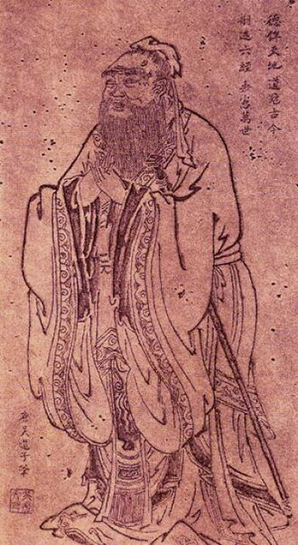
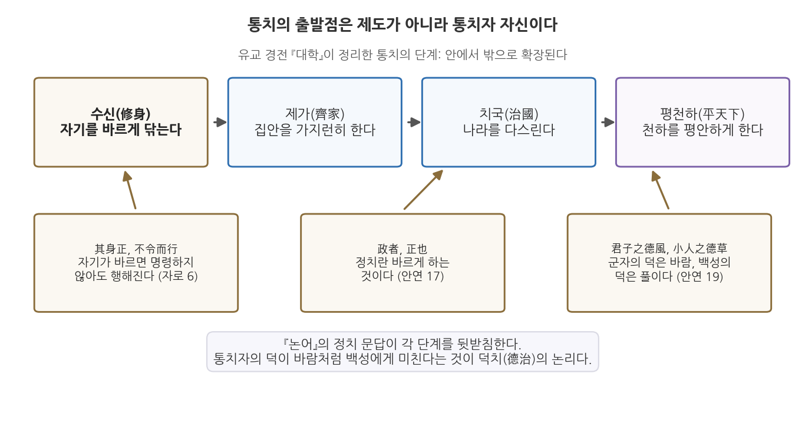

# 2주차 1차시. 행정의 기원 (2): 공자의 논어: 덕치와 통치의 자격

> 政者, 正也. 정치란 바르게 한다는 것입니다.
> (공자, 『논어』 안연편)

## 이 장에서 배우는 것

1주차 2차시에서 우리는 중국이 "최초의 고전적 행정 국가"였다는 사실을 보았다. 균일하고 다층적인 관료제가 세계 인구의 4분의 1을 2천 년 넘게 하나로 묶었고, 그 중심에는 교육을 통해 길러진 사대부 관료(scholar-officials)가 있었다. 그렇다면 그 관료들은 무엇을 배웠는가. 그들이 외우고 시험 보고 평생 곱씹은 텍스트가 바로 이 장에서 읽을 『논어』다.

상황을 하나 상상해 보자. 지금으로부터 약 2,500년 전, 노나라의 실권자 계강자가 나라에 도둑이 들끓는 것을 걱정하며 한 늙은 스승에게 대책을 묻는다. 오늘날로 치면 치안 대책, 즉 순찰 강화나 처벌 강화 같은 답을 기대했을 것이다. 그런데 스승의 답은 뜻밖이다. "당신부터 욕심을 버리시오. 그러면 상을 준다 해도 백성은 도둑질하지 않을 것이오." 대책을 물었더니 통치자 자신을 고치라고 답한 것이다. 이 스승이 공자이고, 이런 문답의 기록이 『논어』다.

이 답이 순진하게 들릴 수도 있다. 그러나 2,500년 뒤의 행정학이 "조직의 윤리는 최고위층의 태도에서 결정된다"는 명제를 다시 발견했다는 점을 생각하면, 이 오래된 문답은 그렇게 간단히 웃어넘길 것이 아니다. 이 장에서는 다음을 배운다.

- 공자와 유교 통치론의 핵심 논리 (덕치)
- 『논어』의 정치 문답 여섯 대목을 원문과 함께 읽는 법
- 통치의 자격을 제도나 혈통이 아니라 수신(修身)에서 찾는 도덕적 자격론
- 이 사상이 현대의 공직 윤리, 그리고 시험으로 관료를 뽑는 실적주의와 어떻게 이어지는지

<strong>이 장의 로드맵</strong> 
이 장은 하나의 질문을 따라 전개된다. <em>"다스릴 자격은 누구에게 있으며, 그 자격은 어떻게 얻는가?"</em>  
<strong>1.1</strong> 공자와 그의 시대, 유교 통치론의 기본 구조를 본다 →
<strong>1.2</strong> 『논어』의 정치 문답을 원문으로 읽는다 (원전 강독) →
<strong>1.3</strong> 수신과 통치를 잇는 도덕적 자격론을 정리한다 →
<strong>1.4</strong> 공직 윤리와 실적주의라는 현대적 유산을 확인한다.

## 1.1 공자와 유교의 통치론: 왕위 없는 왕

<strong>인물 · 공자(孔子, 기원전 551-479)</strong> 
기원전 551년 노나라 추읍(지금의 산둥성 취푸)에서 태어났다. 본명은 공구(孔丘), 자는 중니(仲尼)다. 세 살 무렵 아버지를 여의고 어머니 밑에서 가난하게 자랐으며, 젊어서는 창고와 가축을 관리하는 하급 실무직을 맡았다. 기원전 501년 노나라에서 관직에 올라 형벌과 치안을 관장하는 대사구(大司寇)에 이르렀으나, 실권을 쥔 대부 가문을 누르려던 시도가 좌절되자 기원전 497년 나라를 떠났다. 이후 14년 동안 위, 송, 진, 채 등 여러 나라를 돌며 자신을 등용할 군주를 찾았지만 뜻을 이루지 못했다. 기원전 484년 예순여덟에 노나라로 돌아온 뒤로는 제자 교육과 옛 문헌 정리에 전념했고, 3천 명을 가르쳐 그중 일흔 명 남짓이 뛰어난 제자로 꼽혔다고 전한다. 기원전 479년 일흔을 넘긴 나이에 세상을 떠나 취푸에 묻혔으며, 그 무덤 일대는 후대 왕조를 거치며 공림(孔林)으로 넓어졌다. 
대표 문헌: 『논어(論語)』(사후에 제자들이 엮은 어록), 후대에 그가 정리했다고 전해지는 『시경』, 『서경』, 『춘추』 
그림: 당나라 오도자(吳道子) 전칭 공자 초상, 위키미디어 공용 (퍼블릭 도메인)

### 무너진 질서의 시대

공자(孔子, Confucius, 기원전 551-479)는 지금의 산둥성에 있던 작은 나라 노(魯)에서 태어났다. 그가 산 시대는 춘추시대, 곧 주(周) 왕실의 권위가 무너지고 제후국들이 서로 싸우던 시대였다. 명목상의 천자는 있으되 아무도 그 말을 듣지 않았고, 제후의 나라 안에서도 신하 가문이 군주를 능가하는 하극상이 일상이었다. 공자가 만난 계강자도 노나라 임금이 아니라 임금을 제치고 실권을 쥔 대부 가문의 수장이었다.

공자는 이 혼란을 힘으로 제압할 군대도, 제도를 뜯어고칠 관직도 갖지 못했다. 그는 노나라에서 잠시 벼슬을 지냈으나 뜻을 펴지 못했고, 십수 년 동안 여러 나라를 떠돌며 자신을 써 줄 군주를 찾았지만 끝내 얻지 못했다. 대신 그는 제자들을 가르쳤다. 그의 말은 생전에 책으로 정리되지 않았다. 제자들과 그 후학들이 스승과의 문답을 모아 엮은 어록이 『논어(論語)』이며, 그 내용은 사후 중국 고전 속에서 수집되고 편집되고 재해석되었다.

이런 뜻에서 공자는 예로부터 "왕위 없는 왕"으로 불렸다. 권력 없이 가르침만으로 이후 2천 년 동안 동아시아의 통치 언어를 지배했기 때문이다.

### 유교 통치론의 기본 구조: 사람이 곧 정부다

공자의 정치사상은 개인 도덕의 연장선에 있지만, 개인의 수양에 머물지 않았다. 그가 그리던 목표는 천하가 평화롭고 안정된 상태에 이르는 것이었고, 그는 이 목표를 손바닥 들여다보듯 쉽게 이룰 수 있다고 기대했다. 무엇이 있으면 되는가. 공자의 답은 제도가 아니라 사람이다. 그는 사람에게 본래 다스림을 받아들일 준비가 된 성향이 있다고 보았다. 올바른 행정가만 있다면 "정부의 성장은 땅에서 식물이 자라듯 빠르고, 갈대가 무성하게 퍼지듯 쉽게 나타날 것"이라고 했다.

맹자도 같은 생각을 즐겨 말했다. 그는 한 제후에게 이렇게 물었다. 칠팔월 가뭄에 말라붙은 곡식이 큰비를 만나면 단숨에 되살아나는데, 그때 누가 그것을 막을 수 있겠는가. 백성이 참된 목자를 만났을 때의 반응이 꼭 이와 같다는 것이다. 억압이 아니라 도덕적 감화가 복종을 낳는다는 이 논리가 유교 통치론의 첫째 원리다.

둘째 원리는 관계의 윤리다. 공자에 따르면 다스림을 받아들일 준비는 보편적 의무에서 나온다. 사람은 태어나면서부터 군주와 신하, 아버지와 아들, 남편과 아내, 형과 아우, 친구라는 다섯 관계 속에 놓이며, 각 관계에는 서로에 대한 의무가 따른다. 이 관계의 의무를 저마다 충실히 지키면 천하의 평화는 저절로 선다. 통치의 기반을 법률과 강제가 아니라 도덕적 의무와 사회적 관계망에서 찾는 것이다.

셋째 원리는 복고다. 공자는 새 제도의 설계자가 되려 하지 않았다. 법과 제도, 행정의 구체적 장치는 이미 "옛 성군들의 기록"에 다 있으므로, 필요한 것은 옛 법도를 따르고 옛 기준을 되살리는 일뿐이라고 보았다. 그는 이렇게 말했다. "문왕과 무왕의 정부는 목간과 죽간의 기록에 남아 있다. 사람이 있다면 정부는 번성할 것이며, 사람이 없다면 정부는 쇠퇴하고 사라진다." 제도는 이미 있다. 관건은 그것을 살려 낼 사람이다. 유교 통치론을 한 문장으로 줄이면 "사람이 곧 정부다"가 된다.

<strong>정의 · 덕치</strong> 
<strong>덕치</strong>(德治)는 형벌과 강제가 아니라 통치자의 도덕적 모범과 교화로 백성을 다스려야 한다는 유교의 통치 원리다. 통치자가 먼저 바르면 백성은 명령하지 않아도 따르고, 통치자가 바르지 못하면 아무리 명령해도 따르지 않는다는 논리 위에 서 있다. 힘에 의한 지배가 아니라 자발적 복종을 낳는 도덕적 정당성이 핵심이다.

이 구조를 그림으로 정리해 두자.

그림 2-1을 읽는 법은 이렇다. 위쪽의 네 상자는 유교 경전 『대학(大學)』이 정리한 통치의 단계, 곧 수신(修身), 제가(齊家), 치국(治國), 평천하(平天下)다. 자기를 닦는 데서 시작해 집안, 나라, 천하로 다스림이 안에서 밖으로 확장된다. 아래쪽의 갈색 상자들은 이 단계를 뒷받침하는 『논어』의 구절이다. 여기서 알 수 있는 것은 유교 통치론의 방향이다. 통치의 출발점은 조직도나 법전이 아니라 통치자 자신이며, 통치자의 덕은 바람이 풀을 눕히듯 백성에게 미친다. 이 장 전체가 이 그림 하나의 해설이라고 보아도 좋다.

## 1.2 원전 강독: 논어의 정치 문답

이제 원전을 직접 읽는다. 『논어』의 정치론은 논문이 아니라 문답이다. 제후와 대부, 제자들이 "정치란 무엇입니까"라고 묻고 공자가 짧게 답한다. 같은 질문에도 묻는 사람이 누구냐에 따라 답이 달라진다는 점이 『논어』 읽기의 묘미다. 아래 네 대목은 안연편과 자로편에 실린 정치 문답 가운데 유교 통치론의 핵심을 가장 잘 보여 주는 것들이다. 한문 원문과 국역을 함께 싣는다. 원문을 소리 내어 읽을 필요는 없지만, 국역이 어느 구절에서 나왔는지 눈으로 짚어 가며 읽어 보기를 권한다.

### 강독 1: 임금이 임금다워야 한다

<strong>원전 읽기 · 『논어』 안연편 11장</strong> 
齊景公問政於孔子. 孔子對曰, "君君, 臣臣, 父父, 子子." 公曰, "善哉! 信如君不君, 臣不臣, 父不父, 子不子, 雖有粟, 吾得而食諸?"  
제나라 경공이 공자에게 정치에 대하여 묻자, 공자께서 말씀하셨다. "임금은 임금답고 신하는 신하다우며, 아버지는 아버지답고 아들은 아들다워야 합니다."  
경공이 말하였다. "훌륭하십니다! 진실로 만일 임금이 임금답지 못하고 신하가 신하답지 못하여 아버지가 아버지답지 못하고 아들이 아들답지 못하다면, 비록 곡식이 있은들 제가 그것을 얻어먹을 수 있겠습니까?"

무슨 말인가. 여덟 글자의 답, "군군신신 부부자자"는 각자가 자기 이름에 걸맞은 역할을 다하라는 요구다. 임금이라는 이름을 가졌으면 임금다운 책임을 지고, 신하라는 이름을 가졌으면 신하다운 도리를 다하라는 것이다. 이름(名)과 실제(實)가 일치해야 질서가 선다는 이 생각을 정명(正名), 곧 이름을 바로잡는다는 원리라고 부른다. 자로편 3장에서 공자는 이 원리를 연쇄 논법으로 전개한다. 명분이 바르지 못하면 말이 사리에 맞지 않고, 말이 맞지 않으면 일이 이루어지지 않으며, 일이 이루어지지 않으면 예악이 서지 않고, 예악이 서지 않으면 형벌이 적절함을 잃어, 끝내 백성은 살아갈 방도를 잃는다는 것이다.

왜 중요한가. 정명은 행정학의 언어로 옮기면 직위와 직무의 일치, 명칭과 기능의 일치 문제다. 조직의 개념과 용어가 흐트러지면 정책의 설계, 집행, 평가가 연쇄적으로 무너진다. 이름만 있고 기능은 없는 위원회, 문서 위에만 존재하는 직책을 떠올려 보면, 이 여덟 글자가 조직 진단의 언어로도 읽힌다는 것을 알 수 있다.

### 강독 2: 정치란 바르게 하는 것이다

<strong>원전 읽기 · 『논어』 안연편 17장</strong> 
季康子問政於孔子. 孔子對曰, "政者, 正也. 子帥以正, 孰敢不正?"  
계강자가 공자에게 정치에 대하여 묻자, 공자께서 말씀하셨다. "정치란 바르게 한다[正]는 것입니다. 선생께서 바른 도리로써 이끌어 주신다면 누가 감히 바르지 않은 일을 하겠습니까?"

무슨 말인가. 정치를 뜻하는 정(政)과 바름을 뜻하는 정(正)이 같은 소리라는 데 착안한 답이다. 정치의 본질은 권력의 행사가 아니라 바로잡음이며, 그 바로잡음은 남이 아니라 통치자 자신에서 시작한다. 이 장의 도입에서 본 도둑 문답이 바로 다음 장(안연편 18장)에 이어진다. 도둑을 걱정하는 계강자에게 공자는 "진실로 선생께서 욕심을 가지지 않으시면, 비록 상을 준다 하더라도 백성들은 도둑질을 하지 않을 것"이라고 답한다. 계강자가 무도한 자를 죽여 기강을 세우면 어떻겠냐고 묻자(19장) 공자는 정치에 어찌 죽이는 방법을 쓰냐고 반문하며 저 유명한 비유를 남긴다. 군자의 덕은 바람이고 소인의 덕은 풀이니, 풀 위에 바람이 불면 풀은 반드시 눕는다.

왜 중요한가. 계강자는 세 번 모두 백성을 통제할 기술을 물었고, 공자는 세 번 모두 통치자 자신의 상태를 답했다. 문제의 원인을 다스림의 대상이 아니라 다스리는 자에게서 찾는 이 관점의 전환이 덕치론의 핵심이다. 처벌과 유인 설계로 행동을 바꾸려는 통치와, 모범과 감화로 마음을 바꾸려는 통치의 대비이기도 하다.

### 강독 3: 먼저 하고, 몸소 애쓰라

<strong>원전 읽기 · 『논어』 자로편 1장</strong> 
子路問政. 子曰, "先之勞之." 請益. 曰, "無倦."  
자로가 정치에 대하여 여쭙자, 공자께서 말씀하셨다. "먼저 앞장서서 솔선수범하고 몸소 열심히 일하거라." 좀더 설명해 주기를 청하자 말씀하셨다. "게을리 함이 없어야 한다."

무슨 말인가. 선지로지(先之勞之), 네 글자다. 백성보다 먼저 하고(先之), 백성을 위해 몸소 수고하라(勞之). 더 가르쳐 달라는 제자에게 보탠 말은 단 두 글자, 무권(無倦), 게으르지 말라는 것뿐이다. 안연편 14장에서 자장이 같은 질문을 했을 때의 답도 같은 취지다. 자리에 있을 때는 게을리하지 말고, 일을 처리할 때는 진실된 마음으로 하라.

왜 중요한가. 통치를 거창한 기획이 아니라 성실한 노동으로 정의하고 있기 때문이다. 공자의 정치론에서 지도자는 명령하는 사람이기 전에 먼저 움직이는 사람이다. 화려한 비전 선포보다 꾸준함이 앞선다는 이 답은, 뒤에서 볼 "빨리 성과를 보려 하지 말라"(자로편 17장)는 경고와 함께, 행정을 단기간의 성과가 아니라 지속성의 문제로 보는 관점을 담고 있다.

### 강독 4: 소송이 없게 하는 것

<strong>원전 읽기 · 『논어』 안연편 13장</strong> 
子曰, "聽訟, 吾猶人也. 必也使無訟乎!"  
공자께서 말씀하셨다. "송사를 듣고 판결하는 것은 나도 남들과 다를 게 없겠지만, 반드시 해야 할 것은 송사가 없게 하는 것이다."

무슨 말인가. 공자는 재판을 잘하는 것을 자랑하지 않는다. 판결은 누구나 할 수 있는 일이고, 정작 힘써야 할 일은 애초에 다툼이 생기지 않는 공동체를 만드는 것이라고 말한다. 무송(無訟), 소송 없는 상태가 통치의 목표다.

왜 중요한가. 여기에는 좋은 행정이 무엇인가에 대한 근본적인 관점이 들어 있다. 분쟁을 빠르고 공정하게 처리하는 행정은 좋은 행정이다. 그러나 더 좋은 행정은 분쟁의 원인 자체를 줄이는 행정이다. 오늘날의 말로 옮기면 사후 처리보다 예방을, 대증요법보다 근본 원인의 관리를 앞세우는 것이다. 민원 처리 속도를 높이는 일과 민원이 생기지 않도록 제도를 고치는 일 가운데 어느 쪽이 근본적인가라는 질문은, 2,500년 전에 이미 던져져 있었다.

## 1.3 수신과 통치: 도덕적 자격론

### 다스릴 자격은 어디서 오는가

네 대목을 관통하는 물음은 결국 하나다. 다스릴 자격은 어디서 오는가. 춘추시대의 상식적 답은 혈통이었다. 제후의 아들이 제후가 되고, 대부의 아들이 대부가 된다. 공자의 답은 다르다. 자격은 타고나는 것이 아니라 닦는 것이다. 그 닦음이 수신(修身), 곧 자기를 바르게 하는 공부다. 다음 두 구절이 이 자격론을 가장 압축적으로 보여 준다.

<strong>원전 읽기 · 『논어』 자로편 6장·13장</strong> 
子曰, "其身正, 不令而行, 其身不正, 雖令不從."  
공자께서 말씀하셨다. "자기 자신이 올바르면 백성들은 명령을 내리지 않아도 자발적으로 행하고, 자기 자신이 올바르지 않으면 백성들은 명령을 내려도 따르지 않는다."  
子曰, "苟正其身矣, 於從政乎何有? 不能正其身, 如正人何?"  
공자께서 말씀하셨다. "진실로 그 자신을 바르게 한다면 정치를 하는 데 무슨 문제가 있겠는가? 그 자신을 바르게 하지 못한다면 어떻게 남을 바르게 하겠는가?"

무슨 말인가. 명령의 효력은 명령의 내용이 아니라 명령하는 사람의 사람됨에서 나온다는 주장이다. 바르지 못한 상관의 지시는 문서상 유효할지 몰라도 조직을 실제로 움직이지 못한다. 반대로 스스로 바른 사람은 명령서를 쓰기 전에 이미 조직을 움직이고 있다.

왜 중요한가. 이것은 권위의 원천에 대한 이론이기 때문이다. 강제할 수 있는 힘(권력)과 따르고 싶게 만드는 힘(권위)을 구분한다면, 공자는 후자가 전자를 결정한다고 본 셈이다. 현대 조직론이 말하는 "최고위층의 기풍(tone at the top)", 곧 지도부의 규범적 모범이 조직문화 전체를 결정한다는 명제와 정확히 겹친다. 7주차에 읽을 베버가 지배의 정당성을 유형화하며 같은 질문을 다시 던진다는 점도 미리 기억해 두자.

### 무엇을 닦는가: 통달과 명성의 구분

그렇다면 수신이란 구체적으로 무엇을 기르는 일인가. 자장과의 문답이 좋은 단서를 준다.

<strong>원전 읽기 · 『논어』 안연편 20장</strong> 
子張問, "士何如斯可謂之達矣?" 子曰, "何哉, 爾所謂達者?" 子張對曰, "在邦必聞, 在家必聞." 子曰, "是聞也, 非達也. 夫達也者, 質直而好義, 察言而觀色, 慮以下人. 在邦必達, 在家必達. 夫聞也者, 色取仁而行違, 居之不疑. 在邦必聞, 在家必聞."  
자장이 여쭈었다. "선비(관료)는 어떻게 하면 통달했다고 할 수 있습니까?"  
공자께서 말씀하셨다. "네가 말하는 통달이란 것이 무엇이냐?"  
자장이 대답하였다. "나라 안에서도 반드시 명성이 있고 집안에서도 반드시 명성이 있는 것입니다."  
공자께서 말씀하셨다. "이는 명성이 있는 것이지 통달한 것이 아니다. 통달한다는 것은 본바탕이 곧고 의로움을 좋아하며, 남의 말을 잘 헤아리고 모습을 잘 살피며, 자신을 남보다 낮추어 생각하여, 나라 안에서도 반드시 통달하고 집안에서도 반드시 통달하는 것이다. 명성이 있다는 것은 겉모습은 인(仁)을 취하면서도 행실은 인에 어긋나고, 그렇게 살면서도 의심조차 없어서, 나라 안에서도 명성이 있고 집안에서도 명성이 있는 것이다."

무슨 말인가. 자장은 통달(達)을 명성(聞)으로 이해했다. 이름이 알려지면 성공한 관료라는 것이다. 공자는 둘을 갈라놓는다. 명성은 평판의 문제이고 통달은 사람됨의 문제다. 통달한 사람의 요건으로 공자가 꼽는 것은 곧은 바탕, 의로움에 대한 사랑, 상대의 말과 표정을 헤아리는 민감함, 그리고 자신을 낮추는 태도다. 겉으로 어진 모습을 꾸미면서 행실은 어긋나는 사람도 명성은 얼마든지 얻을 수 있다는 경고가 뒤따른다.

왜 중요한가. 관료의 평가 기준에 대한 물음이기 때문이다. 눈에 보이는 평판과 실적 지표는 측정하기 쉽지만, 그것이 곧 좋은 관료의 증거는 아니다. 이미지 관리에 능한 사람과 실제로 통달한 사람을 어떻게 구별할 것인가는 오늘날의 인사행정이 여전히 다루고 있는 문제다. 공자는 여기에 더해 실무 능력도 요구했다. 『시경』의 시 삼백 편을 다 외워도 정치를 맡기면 해내지 못하고 사신으로 가서 독자적으로 대응하지 못하면 그 많은 지식이 무슨 소용이냐고 물은 것(자로편 5장)이다. 암기된 교양이 아니라 일을 해내는 능력, 겉으로 드러난 평판이 아니라 실제로 갖춘 사람됨이 기준이다. 공자가 제시한 관료상은 의외로 실용적이다.

한 가지 더 짚어 둘 것이 있다. 공자에게 통치의 과제는 도덕 교화만이 아니었다. 위나라로 가는 길에 백성이 많은 것을 본 공자는 제자 염유와 문답을 나누며 통치의 순서를 제시한다. 백성이 많아지면 부유하게 해 주고(富之), 부유해진 다음에 가르치라(敎之)는 것이다(자로편 9장). 도덕의 설교가 먹고사는 문제를 대신할 수 없으며, 물적 토대가 갖춰져야 교육과 교화가 효과를 낸다는 순서 감각이다. 덕치론이 경제행정을 무시한 이상론이 아니었음을 보여 주는 대목이다.

<strong>왜 공자는 법과 형벌을 앞세우지 않았나?</strong> 
공자가 법과 형벌의 존재 자체를 부정한 것은 아니다. 그가 반대한 것은 법과 형벌을 통치의 <em>중심</em>에 두는 것이다. 형벌로 다스리면 백성은 처벌을 피하는 법만 배우고 부끄러움을 모르게 되지만, 덕과 예로 이끌면 부끄러움을 알아 스스로 바르게 된다는 것이 그의 논리다. 처벌 회피의 행동과 내면화된 규범의 행동은 겉으로 같아 보여도 질이 다르다. 안연편 13장의 무송(無訟)이 바로 이 이상의 표현이다. 반면 전국시대의 법가(法家)는 사람의 덕에 기대는 통치야말로 불안정하다고 보고 상벌의 제도 설계를 앞세웠다. 덕치와 법치의 이 오래된 논쟁은 "좋은 사람"과 "좋은 제도" 중 무엇을 먼저 확보할 것인가라는 형태로 현대 행정학에도 이어지고 있다.

## 1.4 현대적 함의: 공직 윤리와 실적주의의 원형

### 공직 윤리의 오래된 기준

『논어』의 정치 문답은 공직 윤리의 기준을 놀랄 만큼 구체적으로 담고 있다. 요왈편 2장에서 공자는 정치에 종사하는 사람이 높여야 할 다섯 가지 미덕과 물리쳐야 할 네 가지 악덕을 정리한다. 미덕은 이렇다. 은혜를 베풀되 낭비하지 않고, 일을 시키되 원망을 사지 않으며, 뜻을 이루고자 하되 탐욕을 부리지 않고, 넉넉하되 교만하지 않으며, 위엄이 있되 사납지 않아야 한다. 악덕은 이렇다. 가르쳐 주지 않고서 잘못했다고 처벌하는 것(학대), 미리 주의를 주지 않고 결과만으로 판단하는 것(포악), 명령은 태만히 내리고 기한만 재촉하는 것(해침), 마땅히 나누어 줄 것을 인색하게 내주는 것(옹졸한 벼슬아치)이다.

이 목록을 현대어로 옮겨 보면 그대로 행정윤리 교과서의 항목이 된다. 재정을 쓰되 낭비하지 말라는 것은 예산의 효율성이고, 가르치지 않고 처벌하지 말라는 것은 예측 가능성과 적법절차의 정신이며, 명령을 태만히 하고 기한만 재촉하지 말라는 것은 책임 전가의 금지다. 위엄이 있되 사납지 않아야 한다는 것은 권위와 강압의 구분이다. 백성이 이롭게 여기는 것을 따라 이롭게 해 준다는 미덕의 첫 항목은, 행정의 기준을 행정기관의 편의가 아니라 시민의 필요에 두라는 요구로 읽힌다.

수신의 요구는 오늘날 공직자에게 사생활 관리의 부담으로 남아 있는 것이 아니라, 공직이라는 직업의 본질에 대한 관점으로 남아 있다. 공직자의 사적인 처신이 곧 공적 신뢰의 바탕이라는 생각, 지도부의 태도가 조직 전체의 윤리 수준을 결정한다는 생각이 그것이다. 거꾸로 정명(正名)의 관점에서 한국 행정을 진단해 볼 수도 있다. 이름과 실제가 어긋나는 곳, 예컨대 설치만 되고 열리지 않는 위원회, 직함과 실제 권한이 일치하지 않는 자리, 정책의 수사와 집행 성과 사이의 괴리는 모두 "임금이 임금답지 못한" 상태의 현대적 형태다.

### 실적주의의 원형: 시험으로 관료를 뽑는다는 생각

유교 통치론의 자격론은 제도사에 큰 흔적을 남겼다. 다스릴 자격이 혈통이 아니라 배움과 사람됨에서 온다면, 관료는 낳는 것이 아니라 골라 뽑아야 한다. 그렇다면 어떻게 고를 것인가. 중국의 답이 시험이었다. 유교는 기원전 2세기 무렵부터 제국 통치의 이념적 발판이 되었고, 국가 시험 제도의 기반으로 채택되어 그 지위를 19세기까지 유지했다. 1주차에서 본 사대부 관료 계급이 바로 이 시험을 통해 재생산되었다. 유교 경전에 대한 시험으로 관료를 선발하는 과거제는 한반도에도 이식되어, 고려 광종 9년(958년)에 중국 후주 출신 쌍기의 건의로 도입된 뒤 조선 말까지 이어졌다.

시험 선발의 논리는 근대 서구의 공무원제 개혁으로도 이어졌다. 선교사와 상인, 외교관들이 중국의 시험 선발 제도를 유럽에 소개했고, 영국이 1854년 노스코트-트레벨리언 보고서(Northcote-Trevelyan Report)를 통해 정실 임용 대신 공개경쟁시험에 의한 임용을 채택할 때 중국의 사례가 실제로 참조되었다. 당시 영국 의회의 논쟁에서는 공개경쟁시험이 중국에서 먼저 시행된 제도라는 점이 거론되기도 했다. 연줄과 후원이 아니라 능력의 증명으로 공직을 배분한다는 원칙, 곧 실적주의(merit system)의 원형이 유교적 시험 관료제에 이미 들어 있었던 셈이다.

다만 원형이 있었다는 것과 제도로 확립되었다는 것은 다른 문제다. 4주차에서 자세히 보겠지만, 미국에서 실적주의가 제도화된 것은 엽관제의 폐해와 대통령 암살이라는 충격을 거친 1883년 펜들턴법에 이르러서다. 그 역사를 읽을 때, 시험으로 관료를 뽑는다는 생각 자체는 서구의 발명품이 아니라는 사실을 기억해 두면 시야가 넓어진다.

<strong>유의 · 덕치론의 한계</strong> 
덕치론을 읽을 때는 두 가지를 경계해야 한다. 첫째, 통치의 성패를 통치자의 사람됨에 거는 사고는 뒤집으면 <em>사람에 의존하는 통치</em>의 위험이 된다. 성군을 만나면 태평성대이지만 폭군을 만나면 견제 장치가 없다. 좋은 사람을 기다리는 것과 나쁜 사람이 와도 견디는 제도를 설계하는 것 가운데 근대 행정학은 대체로 후자를 택했다. 둘째, 중국인의 질서와 복종의 성향이 공자의 가르침 때문에 생긴 것이 아니라, 오히려 그런 민족적 성격이 공자의 체계를 형성했다는 해석도 있다. 사상이 현실을 만들기도 하지만, 현실이 사상을 만들기도 한다. 고전을 읽을 때는 텍스트와 그 배경을 함께 보아야 한다.

한 가지 균형을 잡아 두자. 그렇다면 제도 설계가 정답이고 덕치는 낡은 이야기인가. 여기서는 좀 더 신중한 결론을 택한다. 단기적으로는 제도의 설계가 필요하지만, 장기적으로는 지도자의 도덕성과 본보기가 그 제도의 실효성을 좌우한다는 것이다. 아무리 정교한 이해충돌 방지 규정도 지도부가 그것을 우회하는 조직에서는 작동하지 않는다. 공자가 옳았던 지점과 부족했던 지점을 가려 읽는 것, 그것이 이 텍스트를 2,500년 뒤에 다시 읽는 이유다.

## 요약

공자는 주 왕실의 권위가 무너진 춘추시대를 살며, 혼란의 해법을 새 제도가 아니라 올바른 사람에게서 찾았다. 유교 통치론은 세 가지 원리로 이루어진다. 통치자의 덕이 바람처럼 백성을 감화시킨다는 덕치, 다섯 가지 인간관계의 의무가 질서의 기반이 된다는 관계의 윤리, 그리고 옛 성군의 기준을 되살리면 된다는 복고의 태도다. 원전 강독에서 읽은 정치 문답은 이 통치론을 압축한다. 각자 이름값을 하라는 정명(군군신신), 바로잡음은 통치자 자신에서 시작한다는 정자정야, 먼저 움직이고 몸소 애쓰라는 선지로지, 그리고 소송 없는 공동체를 지향하는 무송이다. 통치의 자격은 혈통이 아니라 수신에서 오며, 참된 관료의 기준은 명성이 아니라 통달이다. 이 자격론은 시험으로 관료를 뽑는 과거제로 제도화되어 19세기 영국의 공무원제 개혁에까지 참조되었고, 실적주의의 원형이 되었다. 동시에 덕치론은 사람에 의존하는 통치의 위험을 안고 있어, 제도 설계를 앞세운 근대 행정학과의 긴장 속에서 읽어야 한다.

## 토론·복습 문제

**2-1. (서술형 연습)** 덕치(德治)의 논리를 『논어』의 구절을 두 개 이상 인용하여 설명하고, 이 통치론이 현대 행정에 주는 의의와 한계를 각각 논의하시오. (힌트: 의의는 공직 윤리와 "최고위층의 기풍", 한계는 사람에 의존하는 통치의 위험을 중심으로)

**2-2. (원전 해석)** 다음 구절을 읽고 물음에 답하시오. "聽訟, 吾猶人也. 必也使無訟乎!(송사를 듣고 판결하는 것은 나도 남들과 다를 게 없겠지만, 반드시 해야 할 것은 송사가 없게 하는 것이다.)" 공자가 말하는 무송(無訟)의 상태는 어떤 상태이며, 이 관점을 오늘날의 민원 행정이나 규제 행정에 적용하면 어떤 정책 우선순위가 도출되는지 설명하시오.

**2-3. (개념 적용)** 정명(正名)의 원리에 비추어, 이름과 실제 기능이 어긋나 있다고 생각되는 우리나라 행정의 사례를 하나 찾아 제시하고, 그 어긋남이 어떤 문제를 낳는지 자로편 3장의 연쇄 논법(명분이 바르지 못하면 말이 사리에 맞지 않고…)을 활용하여 분석해 보시오.

**2-4. (역사 연결)** 유교적 시험 관료제(과거제)가 실적주의의 원형이라고 평가되는 이유를 설명하고, 그럼에도 과거제와 근대 실적주의 사이에 남는 차이가 무엇일지 생각해 보시오. (4주차에서 배울 펜들턴법과 비교하게 된다.)
