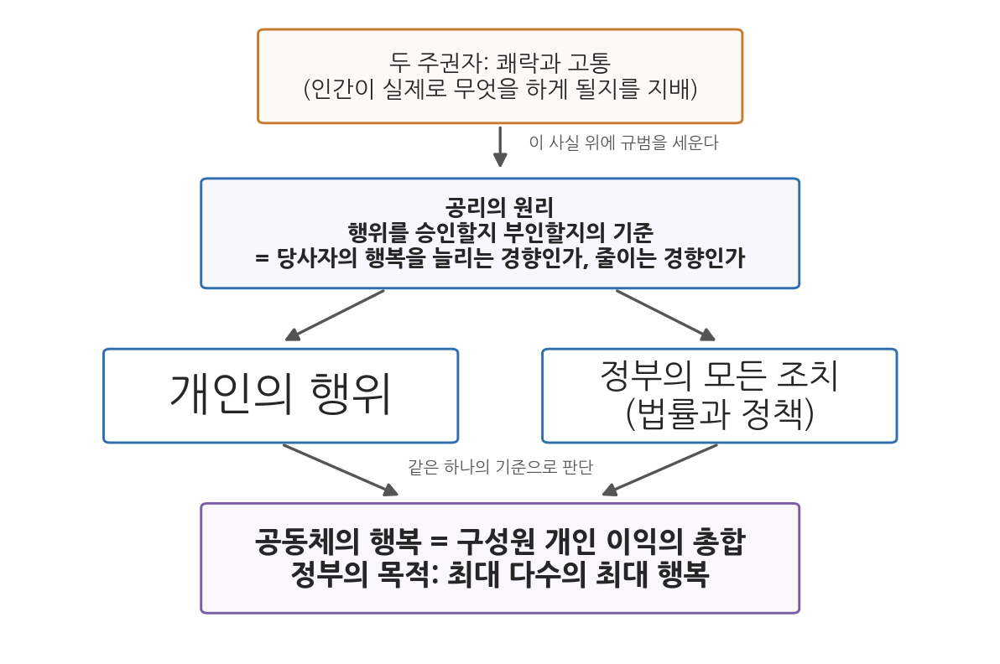
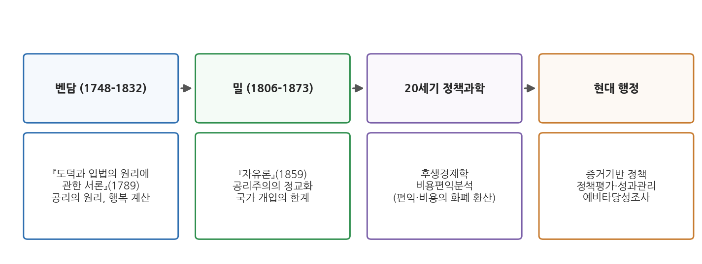

# 3주차 1차시. 국가목적과 합리성 (1): 벤담의 공리의 원리

> 자연은 인류를 고통과 쾌락이라는 두 주권자의 지배 아래 두었다.
> (제러미 벤담, 『도덕과 입법의 원리에 관한 서론』)

## 이 장에서 배우는 것

어느 구청 회의실에서 예산 심의가 열리고 있다고 하자. 남은 예산으로 근린공원을 만들자는 안과 공영주차장을 짓자는 안이 맞서 있다. 공원파는 "주민의 삶의 질"을 말하고, 주차장파는 "고질적인 주차난"을 말한다. 둘 다 그럴듯하다. 이때 누군가 이렇게 묻는다면 어떨까. "두 안이 각각 얼마나 많은 주민에게, 얼마나 큰 이득을 주는지 따져 봅시다. 더 큰 쪽을 고르면 됩니다."

이 물음은 오늘날 너무 당연하게 들려서, 누군가 이것을 처음으로 체계화했다는 사실이 오히려 낯설다. 그 사람이 18세기 영국의 철학자 벤담이다. 2주차에서 읽은 공자와 키케로는 "통치자가 어떤 사람이어야 하는가"를 물었다. 공자는 덕을, 키케로는 공직자의 의무를 말했다. 벤담은 질문의 방향을 바꾼다. 통치자가 어떤 사람인지가 아니라, 정부의 행위가 어떤 결과를 낳는지를 보라는 것이다. 정부가 하는 일의 옳고 그름을 판정하는 단 하나의 저울, 곧 공리의 원리(principle of utility)가 이 장의 주제다.

이 장에서는 구체적으로 다음을 배운다.

- 공리주의가 등장한 시대적 배경 (계몽주의와 산업혁명기 영국)
- 『도덕과 입법의 원리에 관한 서론』의 핵심 논증 (두 주인, 공리의 원리, 공동체 이익의 의미)
- "최대 다수의 최대 행복"이 정부의 목적으로서 무엇을 뜻하는지
- 벤담의 사상이 오늘날의 비용편익분석과 증거기반 정책으로 이어지는 경로

<strong>이 장의 로드맵</strong> 
이 장은 하나의 질문을 따라 전개된다. <em>"정부가 하는 일이 잘한 일인지 못한 일인지, 무엇을 기준으로 판단할 것인가?"</em>  
<strong>1.1</strong> 벤담과 그의 시대를 본다 (계몽주의, 산업혁명기 영국) →
<strong>1.2</strong> 원전을 읽는다 (『도덕과 입법의 원리에 관한 서론』 제1장 발췌 다섯 대목) →
<strong>1.3</strong> "최대 다수의 최대 행복"과 정부의 목적을 정리한다 →
<strong>1.4</strong> 현대 행정에의 함의를 본다 (비용편익분석, 증거기반 정책).

## 1.1 공리주의의 등장 배경: 계몽주의와 산업혁명기 영국

### 낡은 제도와 새로운 사회

벤담(Jeremy Bentham, 1748-1832)이 살았던 18세기 후반의 영국은 두 개의 시간이 겹쳐 있는 사회였다. 한쪽에서는 산업혁명이 진행 중이었다. 공장이 서고, 사람들이 도시로 몰려들고, 부가 전에 없던 속도로 만들어지고 있었다. 다른 한쪽에는 중세 이래의 낡은 제도가 그대로 남아 있었다. 법은 수백 년간 쌓인 판례와 관행의 퇴적물이어서 전문가조차 전모를 알기 어려웠고, 형벌은 가혹하면서도 자의적이었으며, 공직과 특권은 신분과 연줄을 따라 흘렀다.

이 어긋남을 정면으로 문제 삼은 지적 흐름이 계몽주의(Enlightenment)다. 계몽주의자들은 제도가 오래되었다는 것 자체는 아무런 정당화가 되지 못한다고 보았다. 전통이나 관습이 아니라 이성의 빛으로 제도를 다시 심사하고, 시험을 통과하지 못하는 제도는 고쳐 쓰자는 것이다. 벤담은 이 흐름의 한복판에 있었다. 그는 영국 경험주의 철학과 볼테르를 비롯한 프랑스 계몽사상에 매료되었고, 거기서 얻은 확신을 법과 정부라는 가장 완고한 영역에 들이댔다.

### 법정을 떠나 책상으로 간 법률가

벤담의 생애는 짧게 훑어볼 만하다. 그는 런던의 법률가 집안에서 태어난 신동이었다. 세 살에 라틴어를 배우기 시작했고, 열두 살에 옥스퍼드에 입학해 열여섯에 졸업했으며, 스물한 살에 변호사 자격을 얻었다. 집안은 그가 법조계에서 출세하기를 기대했다. 그러나 벤담은 법정에서 일하는 대신, 그 법 자체를 심판대에 올리는 길을 택했다. 그가 본 당대의 법조 관행은 자의적이고 부패해 있었다. 벤담은 법과 정책이 투명하고 합리적인 기준 위에 서야 한다고 믿었고, 그 기준을 세우는 데 남은 생애를 바쳤다. 궁핍과 사교적 서투름 속에서도 하루 평균 열다섯 쪽을 썼고, 세상을 떠날 무렵 남긴 원고는 6만여 장에 이르렀다.

그의 개혁 제안은 당대 기준으로 급진적이었다. 노예제와 사형제의 폐지, 여성 참정권과 이혼청구권의 인정, 동성애 처벌 반대, 언론의 자유, 보통·비밀선거. 오늘날에는 상식이 된 것들이 많지만, 18세기 말에는 하나하나가 논쟁적인 주장이었다. 이 제안들을 관통하는 논리는 한 가지였다. 어떤 제도가 사람들의 행복을 늘리는가, 줄이는가. 그것만이 기준이라는 것이다.

이 기준을 체계적으로 정리한 책이 『도덕과 입법의 원리에 관한 서론(An Introduction to the Principles of Morals and Legislation)』이다. 1780년에 인쇄를 마쳤으나 출간은 1789년에야 이루어졌다. 이 장에서 읽는 발췌는 이 책의 첫머리, "공리의 원리에 대하여"라는 제1장에서 온 것이다.

<strong>왜 행정사 수업에서 철학책을 읽는가?</strong> 
『도덕과 입법의 원리에 관한 서론』은 행정학 책이 아니다. 그런데도 행정학의 고전 선집들이 이 글을 앞자리에 두는 이유가 있다. 벤담은 "정부가 어떤 공공정책을 추구해야 하며, 어떻게 정책을 골라야 하는가"라는 물음에 하나의 대답 틀을 마련했기 때문이다. 뒤에서 보겠지만 그 틀은 정책의 효과를 따지고, 누가 혜택을 보는지 밝히고, 그것을 측정하라고 요구한다. 오늘날의 정책분석과 정책평가가 서 있는 자리가 바로 여기다.

## 1.2 원전 강독: 공리의 원리

이제 원전을 직접 읽는다. 아래 발췌는 『도덕과 입법의 원리에 관한 서론』 제1장에서 다섯 대목을 고른 것이다. 벤담의 문장은 18세기 논설 특유의 단정적이고 도발적인 어조를 지녔다. 그 목소리를 살리며 읽어 보자.

### 두 주인: 쾌락과 고통

<strong>원전 읽기 · 벤담, 『도덕과 입법의 원리에 관한 서론』 제1장 (1789)</strong> 
"자연은 인류를 고통과 쾌락이라는 두 주권자의 지배 아래 두었다. 우리가 무엇을 해야 하는지, 그리고 실제로 무엇을 하게 될지는 오직 이 두 주인이 가리킨다. 옳고 그름의 기준도, 원인과 결과의 사슬도 이 두 주인의 왕좌에 매여 있다. 고통과 쾌락은 우리가 행하는 모든 것, 말하는 모든 것, 생각하는 모든 것을 지배한다. 이 지배에서 벗어나려고 아무리 애써도, 그 몸부림은 오히려 우리가 종속되어 있음을 드러내고 확인해 줄 뿐이다. 말로는 그 권세를 부정할 수 있으나, 실제로는 여전히 그 지배 아래 머무른다. 공리의 원리는 이 종속을 인정하고, 그 위에서 이성과 법의 손으로 행복의 구조물을 세우고자 한다. 이 원리를 부정하는 체계는 이성 대신 변덕을, 빛 대신 어둠을 내세울 뿐이다."

**무슨 말인가.** 책의 첫 문단인데, 벤담은 논증이 아니라 선언으로 시작한다. 인간은 쾌락을 좇고 고통을 피하는 존재다. 이것은 좋고 싫음의 문제가 아니라 자연의 사실이라는 것이다. 주목할 것은 두 주인이 두 가지를 동시에 지배한다는 대목이다. 인간이 실제로 무엇을 하게 될지(사실)와 무엇을 해야 하는지(당위)가 모두 쾌락과 고통에 매여 있다. 벤담은 이 사실을 한탄하거나 극복하자고 하지 않는다. 오히려 그 위에 "이성과 법의 손으로" 행복의 구조물을 세우자고 한다. 인간 본성을 있는 그대로 받아들이고, 그 본성 위에 제도를 설계하자는 것이다.

**왜 중요한가.** 이 선언은 통치론의 출발점을 바꾼다. 공자와 키케로에게 통치의 출발점은 통치자의 수양과 덕이었다. 벤담에게 출발점은 평범한 인간의 본성이다. 사람들이 성인군자가 되기를 기다리는 대신, 쾌락과 고통에 반응하는 보통 사람들을 전제로 법과 정책을 설계한다. 통치자의 자질에서 제도의 설계로 무게중심이 옮겨 가는 순간이다.

### 공리의 원리란 무엇인가

<strong>원전 읽기 · 벤담, 『도덕과 입법의 원리에 관한 서론』 제1장 (1789)</strong> 
"공리의 원리는 이 책의 기초이므로, 먼저 그 뜻을 분명히 밝혀 두는 것이 옳다. 공리의 원리란 모든 행위를, 이해당사자의 행복을 늘리는 경향이 있는가 줄이는 경향이 있는가에 따라 승인하거나 부인하는 원리를 말한다. 여기서 모든 행위란 개인의 행위만이 아니라 정부의 모든 조치를 포함한다. 공리란 어떤 사물이 이익, 유익, 쾌락, 선, 행복을 낳거나, 반대로 재해, 고통, 악, 불행을 막아 주는 성질을 말한다."

**무슨 말인가.** 공리의 원리의 공식 정의다. 어떤 행위를 승인할지 부인할지는 그 행위가 당사자의 행복을 늘리는 경향이 있는가, 줄이는 경향이 있는가에 달려 있다. 행위자의 신분도, 의도의 순수함도, 전통과의 부합도 기준이 아니다. 오직 행복에 미치는 효과만이 기준이다. 그리고 벤담은 짧지만 결정적인 한마디를 덧붙인다. "모든 행위"에는 정부의 모든 조치가 포함된다.

**왜 중요한가.** 바로 이 한마디가 철학책을 행정학의 고전으로 만든다. 개인의 행위와 정부의 조치가 같은 저울에 오른다. 법률 하나, 정책 하나가 모두 심사 대상이며, 심사 기준은 단일하다. 왕의 권위나 종교적 정당화, 유서 깊은 관행 같은 전통적 근거가 모두 힘을 잃고, "그 정책이 사람들의 행복에 무슨 효과를 내는가"라는 경험적 질문이 그 자리에 들어선다.

<strong>정의 · 공리와 공리의 원리</strong> 
<strong>공리</strong>(utility)는 어떤 대상이 이익·쾌락·선·행복을 낳거나 손해·고통·악·불행을 막아 주는 성질이다. 흔히 쓰는 "공공의 이익"이라는 뜻의 공리(公利)가 아니라, 효용을 뜻하는 공리(功利)임에 주의하자. 
<strong>공리의 원리</strong>(principle of utility)는 개인의 행위든 정부의 조치든, 이해당사자의 행복을 늘리는 경향이 있으면 승인하고 줄이는 경향이 있으면 부인하는 판단 원리다. 이 원리에 기초한 윤리·정치 사상을 <strong>공리주의</strong>(utilitarianism)라 부른다.

### 공동체의 이익이란 무엇인가

<strong>원전 읽기 · 벤담, 『도덕과 입법의 원리에 관한 서론』 제1장 (1789)</strong> 
"공동체의 이익이라는 말은 도덕 담론에서 가장 흔히 쓰이는 표현이지만, 그 뜻은 자주 잊힌다. 뜻이 있다면 이것이다. 공동체란 그 구성원인 개인들로 이루어진 하나의 허구적 집단이다. 그렇다면 공동체의 이익이란 무엇인가. 구성원 각자의 이익을 모두 더한 것이다. 개인의 이익이 무엇인지 이해하지 못한 채 공동체의 이익을 말하는 것은 헛된 일이다. 어떤 것이 한 사람의 쾌락을 더해 주거나 고통을 덜어 줄 때, 우리는 그것이 그의 이익에 부합한다고 말한다."

**무슨 말인가.** "공동체의 이익", "국익", "공공의 이익" 같은 말은 예나 지금이나 가장 흔한 정치 언어다. 벤담은 이 말의 거품을 뺀다. 공동체는 개인들 위에 따로 존재하는 신비한 실체가 아니라, 개인들의 집합에 붙인 이름, 곧 허구적 집단이다. 따라서 공동체의 이익도 개인 이익의 총합 이상도 이하도 아니다. 개인 단위로 셈할 수 없는 "공동체의 이익"은 내용 없는 수사에 불과하다는 것이다.

**왜 중요한가.** 이 대목은 공익이라는 말의 오남용을 겨냥한 해독제다. 역사에서 "국가의 이익"이나 "민족의 대의"는 종종 특정 집단의 이익을 가리는 가면으로 쓰였다. 벤담의 기준을 들이대면 가면이 벗겨진다. 그 정책으로 정확히 누구의 쾌락이 늘고 누구의 고통이 늘어나는가. 이 질문에 답하지 못하는 공익 주장은 공허하다. 뒤에서 보겠지만, 정책의 수혜자와 부담자를 명시하라는 현대 정책분석의 요구가 여기서 싹튼다.

### 정부의 조치도 같은 저울에 오른다

<strong>원전 읽기 · 벤담, 『도덕과 입법의 원리에 관한 서론』 제1장 (1789)</strong> 
"어떤 행위가 공동체 전체의 행복을 늘리는 경향이 줄이는 경향보다 크다면, 그 행위는 공리의 원리에 부합한다고 말할 수 있다. 정부의 조치 또한 특정한 행위일 뿐이다. 공동체의 행복을 늘리는 경향이 줄이는 경향보다 크다면, 그 조치는 공리의 원리에 따라 정당화될 수 있다. 공리의 원리에 합치하는 행위는 마땅히 해야 할 행위이거나, 적어도 해서는 안 될 행위가 아니다. '옳다', '그르다', '해야 한다'라는 말은 이렇게 해석될 때 비로소 의미를 갖는다."

**무슨 말인가.** 앞의 정의를 정부에 적용한 결론부다. 두 가지를 눈여겨보자. 첫째, 기준은 총량의 비교다. 어떤 정책이든 누군가에게는 이득을, 누군가에게는 부담을 준다. 그러므로 "아무에게도 피해가 없는가"가 아니라 "늘리는 경향이 줄이는 경향보다 큰가"를 묻는다. 둘째, 벤담은 도덕 언어 자체를 재정의한다. "옳다"는 말은 공리의 원리에 비추어 해석될 때에만 의미가 있다. 행복 계산과 무관하게 그 자체로 옳거나 그른 것은 없다는 뜻이다.

**왜 중요한가.** "늘리는 경향이 줄이는 경향보다 큰가"라는 물음은 오늘날 정책분석의 기본 문법이 되었다. 편익이 비용을 넘는가. 이 물음의 구조가 바로 여기서 나왔다. 그림 3-1이 지금까지의 논증을 한눈에 보여 준다.

그림 3-1은 위에서 아래로 읽는다. 맨 위의 상자는 자연의 사실(인간은 쾌락과 고통의 지배를 받는다)이고, 벤담은 그 사실 위에 규범인 공리의 원리를 세운다(둘째 상자). 이 원리는 개인의 행위와 정부의 조치를 같은 기준으로 심사하며(셋째 줄), 그 귀결이 맨 아래의 상자, 곧 구성원 이익의 총합으로서의 공동체 행복과 "최대 다수의 최대 행복"이라는 정부의 목적이다. 이 그림에서 알 수 있는 것은 벤담 사상의 짜임새다. 첫 문단의 선언(두 주인)부터 정부의 목적까지가 하나의 사슬로 이어져 있다.

### 증명할 수도, 반박할 수도 없다

<strong>원전 읽기 · 벤담, 『도덕과 입법의 원리에 관한 서론』 제1장 (1789)</strong> 
"이 원리를 직접 증명할 수 있는가. 그럴 수 없다. 다른 모든 것을 증명하는 데 쓰이는 원리는 자기 자신을 증명할 수 없다. 모든 증명의 사슬은 어딘가에서 출발해야 하기 때문이다. 그러나 세상에 숨 쉬는 사람치고, 아무리 어리석고 완고한 사람이라도, 살아오는 동안 많은 순간 이 원리에 따르지 않은 사람은 없다. 누군가 이 원리에 도전할 때조차, 그는 자신도 모르게 바로 이 원리에서 논거를 끌어온다. 그의 논증은 원리가 틀렸음을 증명하는 것이 아니라, 원리가 잘못 적용되었음을 보여 줄 뿐이다. 지구를 움직이려 하면서 먼저 발 디딜 또 하나의 지구를 찾는 것과 같다."

**무슨 말인가.** 예상되는 반론에 대한 벤담의 응수다. "당신의 원리는 증명되었는가"라는 물음에 그는 순순히 "증명할 수 없다"고 답한다. 그러나 그것은 결함이 아니라고 한다. 다른 모든 것을 재는 자(尺)는 그 자신을 잴 수 없다. 증명의 사슬은 어딘가에서 출발해야 하고, 공리의 원리가 바로 그 출발점이라는 것이다. 나아가 벤담은 공격을 되받는다. 공리의 원리를 비판하는 사람도 결국 "그 원리를 따르면 나쁜 결과가 나온다"는 식으로, 즉 결과의 좋고 나쁨을 따지는 방식으로 논증한다. 비판자조차 이 원리의 문법 안에서 말하고 있다는 것이다.

**왜 중요한가.** 이 대목은 공리의 원리가 어떤 종류의 주장인지 보여 준다. 그것은 경험적 발견이 아니라 판단의 제1원리, 곧 모든 정치적 논증이 딛고 설 공통의 발판으로 제안된 것이다. 정책 토론에서 벤담의 제안이 갖는 힘이 여기 있다. 각자의 직관이나 감정("나는 그 정책이 싫다")은 논증이 될 수 없고, 행복에 미치는 효과라는 공통 기준 위에서만 찬반이 겨루어질 수 있다. 벤담이 보기에 다른 원리를 내세우는 것은 결국 변덕이나 사적 감정을 기준으로 삼는 일이며, 그것은 독재적이거나 무정부적인 귀결로 흐른다.

## 1.3 최대 다수의 최대 행복과 정부의 목적

### 하나의 구호, 두 가지 요구

벤담의 사상을 요약하는 구호로 흔히 "최대 다수의 최대 행복(the greatest happiness of the greatest number)"이 인용된다. 이 표현은 그의 첫 출판물인 『정부론 단편(A Fragment on Government)』(1776) 서문에 나온다. 옳고 그름의 척도는 최대 다수의 최대 행복이라는 것이다. 앞 절에서 읽은 논증을 따라오면 이 구호는 자연스러운 귀결이다. 공동체의 행복이 개인 이익의 총합이라면, 정부가 할 일은 그 총합을 가능한 한 크게 만드는 것이다.

중요한 것은 이 구호가 정부에 들이대는 두 가지 실무적 요구다. 첫째, 정책은 누가 혜택을 보는가를 밝혀야 한다. 행복의 총합은 개인별 셈의 합산이므로, 어느 집단의 행복이 늘고 어느 집단의 행복이 줄어드는지를 명시하지 않으면 계산 자체가 성립하지 않는다. 불평등이 큰 사회일수록 이 요구는 무거운 정치적 함의를 지닌다. 둘째, 정책은 효과의 실제 측정을 요구받는다. 어떤 정책을 좋아하거나 싫어한다는 것, 특히 정치적 성향 때문에 그렇게 판단한다는 것은 근거가 되지 못한다. 그 정책이 다른 대안들보다 고통보다 쾌락을, 불행보다 행복을 더 많이 산출하는지에 대한 판정이 있어야 한다. 정책은 의도가 얼마나 선한가가 아니라 효과가 얼마나 큰가로 평가된다.

### 행복을 계산한다: 행복 계산법

그렇다면 행복을 실제로 어떻게 재는가. 벤담은 쾌락과 고통을 여러 기준으로 뜯어서 셈하는 행복 계산법(felicific calculus)을 제안했다. 표 3-1이 그 일곱 가지 기준이다.

**표 3-1. 행복 계산법의 일곱 기준**

| 기준 | 묻는 것 |
|------|------|
| 강도 | 그 쾌락(고통)이 얼마나 강한가 |
| 지속성 | 얼마나 오래가는가 |
| 확실성 | 실제로 생길 것이 얼마나 확실한가 |
| 근접성 | 얼마나 가까운 시일에 생기는가 |
| 생산성 | 같은 종류의 쾌락이 뒤따라 생기는가 |
| 순수성 | 반대 감각(고통)이 섞여 따라오지 않는가 |
| 범위 | 얼마나 많은 사람에게 미치는가 |

장 첫머리의 공원 대 주차장 사례로 돌아가 보자. 일곱 기준 중 범위 하나만 적용해 봐도 두 안의 차이가 드러난다. 공원은 어린이부터 노인까지 누구나 이용할 수 있지만, 주차장의 혜택은 주로 차량 소유자에게 돌아간다. 이를테면 공원의 범위를 5점, 주차장의 범위를 3점으로 매기는 식으로 기준마다 점수를 주고, 일곱 기준의 총합이 높은 대안을 고르는 것이 행복 계산법의 발상이다. 점수 매기기 자체는 거칠지만, 발상의 핵심을 놓치지 말자. 정책 선택을 수사의 대결에서 계산의 비교로 바꾸려는 것이다.

### 입법자의 네 가지 목표

벤담은 이 계산이 지향할 방향도 제시했다. 입법자는 생계, 풍요, 평등, 안전보장의 증진을 목표로 제도를 설계해야 한다는 것이다. 국가의 목적을 신의 뜻이나 왕조의 영광이 아니라 구성원의 삶의 조건으로 규정한 셈이다. 이 과목의 제목에 있는 "국가목적"이라는 말로 되짚으면, 벤담의 대답은 분명하다. 국가는 그 자체가 목적이 아니다. 국가는 구성원의 행복을 늘리기 위한 도구이며, 국가의 모든 조치는 그 목적에 비추어 심사받는다.

<strong>왜 밀이 뒤를 이었는가?</strong> 
벤담의 작업은 공리주의라는 흐름의 출발점이 되었고, 다음 세대의 존 스튜어트 밀(John Stuart Mill, 1806-1873)이 이를 더욱 정교하게 다듬었다. 밀의 대표작 『자유론(On Liberty)』(1859)은 국가가 사회의 이름으로 개인에게 정당하게 행사할 수 있는 통제의 한계를 논한다. 흥미로운 긴장이 여기 있다. 벤담의 원리를 기계적으로 밀고 나가면 다수의 행복을 위해 개인의 자유를 누르는 결론도 나올 수 있는데, 밀은 같은 공리주의의 틀 안에서 개인의 자유를 지키는 논리를 세우려 했다. 공리주의가 하나의 완결된 교리가 아니라 계속 다듬어져 온 전통임을 보여 주는 대목이다.

## 1.4 현대적 함의: 비용편익분석과 증거기반 정책의 사상적 뿌리

### 행복 계산법에서 비용편익분석으로

벤담의 행복 계산법을 오늘의 언어로 옮기면 곧바로 떠오르는 것이 비용편익분석(cost-benefit analysis)이다. 어떤 사업이 사회 구성원들에게 주는 편익과 비용을 각각 화폐 단위로 환산해 합산하고, 편익의 총합이 비용의 총합을 넘는지, 여러 대안 중 어느 쪽의 순편익이 큰지를 따지는 기법이다. 쾌락과 고통을 점수로 매겨 총합을 비교하자던 벤담의 발상과 구조가 같다. 재는 단위가 점수에서 화폐로 바뀌고, 추정 기법이 정교해졌을 뿐이다.

한국 행정에서 이 계보의 대표적 제도가 예비타당성조사다. 대규모 재정이 드는 공공사업을 시작하기 전에 그 사업의 경제성, 곧 편익과 비용을 분석해 타당성을 미리 검증하는 절차다. 도로를 놓을지, 철도를 깔지, 공항을 지을지를 둘러싼 논쟁에서 "비용 대비 편익(B/C)이 얼마인가"가 표준 언어가 된 지 오래다. 18세기 철학자의 계산법이 21세기 한국의 예산 심사장에서 작동하고 있는 셈이다.

증거기반 정책(evidence-based policy)도 같은 뿌리에서 자란다. 정책을 직관·관행·정치적 선호가 아니라 데이터와 분석 결과에 기대어 설계하고 평가하자는 이 흐름은, "좋아하고 싫어하는 것만으로는 부족하고 효과에 대한 판정이 있어야 한다"는 벤담의 요구를 데이터 시대의 방법으로 실행하는 것이다. 행복의 총합을 수치로 확인하려는 노력은 오늘날 성과지표와 정책평가, 대규모 행정데이터 분석으로 이어지고 있다.

그림 3-2는 왼쪽에서 오른쪽으로, 시간 순서로 읽는다. 벤담이 공리의 원리와 행복 계산의 발상을 세우고, 밀이 이를 정교화하면서 국가 개입의 한계를 논하며, 20세기에 후생경제학과 비용편익분석이 계산의 기법을 갖추고, 현대 행정의 증거기반 정책·정책평가·예비타당성조사로 이어진다. 이 그림에서 알 수 있는 것은, 오늘날 행정 실무의 표준 도구들이 갑자기 생겨난 기술이 아니라 두 세기 반에 걸친 사상의 유산이라는 점이다.

### 총합의 저울이 놓치는 것

다만 벤담의 저울을 물려받은 현대 행정은 그 저울의 한계도 함께 물려받았다. 원전에서 보았듯 벤담의 기준은 총합의 비교다. 그런데 총합은 분배를 가린다. 100명 중 90명의 행복이 크게 늘고 10명의 고통이 그보다 작게 늘어난다면, 총합의 저울로는 좋은 정책이다. 그 10명이 늘 같은 사람들이라면 어떤가. 벤담 자신이 "누가 혜택을 보는가"를 물으라고 했지만, 총합 극대화라는 목적과 분배의 형평이라는 요청 사이의 긴장은 공리주의가 남긴 숙제로 남아 있다.

<strong>유의 · 계산할 수 있다는 것과 계산이 전부라는 것</strong> 
비용편익분석의 실무에서는 생명의 가치, 경관의 가치, 공동체의 유대 같은 것까지 화폐로 환산해야 하는 순간이 온다. 환산이 어렵다는 이유로 계산에서 빠진 가치는 마치 없는 것처럼 취급되기 쉽다. "측정할 수 있는 것만 중요해진다"는 함정이다. 벤담의 유산을 쓰되, 저울에 오르지 못한 것이 무엇인지 항상 되묻는 것까지가 분석가의 일이다. 이 긴장은 12주차(신행정학과 사회적 형평성)에서 정면으로 다시 다룬다.

벤담이 남긴 것은 결국 하나의 질문 형식이다. 그 정책은 누구의 행복을 얼마나 늘리는가. 다음 차시에는 질문이 한 단계 내려간다. 목적이 정해졌다고 하자. 그 목적을 이루는 수단은 어떤 논리로 움직이는가. 프로이센의 군인 클라우제비츠가 전쟁이라는 극한의 사례를 통해 이 질문에 답한다.

## 요약

1.1절에서는 공리주의가 등장한 배경을 보았다. 산업혁명으로 사회가 바뀌는데 법과 제도는 중세의 유산에 머물러 있던 18세기 영국에서, 벤담은 계몽주의의 확신을 이어받아 전통이 아니라 이성으로 제도를 심사하려 했다. 1.2절에서는 『도덕과 입법의 원리에 관한 서론』 제1장을 다섯 대목으로 나누어 읽었다. 인간은 쾌락과 고통이라는 두 주인의 지배를 받으며(사실), 공리의 원리는 그 사실 위에 세워진 판단 기준으로서 개인의 행위와 정부의 조치를 같은 저울로 심사한다. 공동체는 개인들의 허구적 집단이므로 공동체의 이익은 개인 이익의 총합이고, 행복을 늘리는 경향이 줄이는 경향보다 큰 행위만이 옳다고 불릴 수 있다. 이 원리는 직접 증명할 수 없지만, 벤담은 비판자조차 이 원리에서 논거를 끌어온다고 응수한다. 1.3절에서는 "최대 다수의 최대 행복"이 정부에 요구하는 두 가지, 곧 수혜자의 명시와 효과의 측정을 정리하고, 행복 계산법의 일곱 기준과 입법자의 네 목표(생계·풍요·평등·안전보장)를 보았다. 1.4절에서는 이 사상이 비용편익분석(예비타당성조사)과 증거기반 정책의 뿌리임을 확인하고, 총합의 저울이 분배와 측정 불가능한 가치를 가릴 수 있다는 한계를 짚었다.

## 토론·복습 문제

**3-1. (서술형 연습)** 벤담의 공리의 원리를 설명하고, 그것이 "최대 다수의 최대 행복"이라는 정부의 목적으로 이어지는 논리를 원전의 논증 순서(두 주인 → 공리의 원리 → 공동체 이익의 정의)에 따라 서술하시오. 그리고 이 사상이 현대의 비용편익분석과 어떤 점에서 닿아 있고 어떤 점에서 다른지 논의하시오.

**3-2. (원전 해석)** 다음 구절을 읽고 물음에 답하시오. "공동체란 그 구성원인 개인들로 이루어진 하나의 허구적 집단이다. 공동체의 이익이란 구성원 각자의 이익을 모두 더한 것이다." 벤담이 공동체를 굳이 "허구적" 집단이라고 부른 의도는 무엇인가. 이 관점이 "국익을 위해 일부의 희생은 불가피하다"는 주장을 만났을 때 어떤 질문을 던지게 되는지 설명하시오.

**3-3. (비교)** 2주차에서 읽은 공자·키케로와 벤담은 "좋은 통치"를 판단하는 기준이 다르다. 세 사상가가 각각 통치의 무엇(통치자의 덕, 공직자의 의무, 행위의 결과)을 보는지 비교하고, 오늘날 공직자 평가와 정책 평가에서 세 기준이 각각 어떤 장면에 살아 있는지 예를 들어 보시오.

**3-4. (적용)** 여러분이 사는 지역의 실제 쟁점 사업 하나를 골라, 표 3-1의 일곱 기준 가운데 세 개 이상을 적용해 대안 두 개를 비교해 보시오. 그리고 그 계산에서 점수로 매기기 어려웠던 가치가 무엇이었는지, 그것을 어떻게 다루어야 할지 서술하시오.
