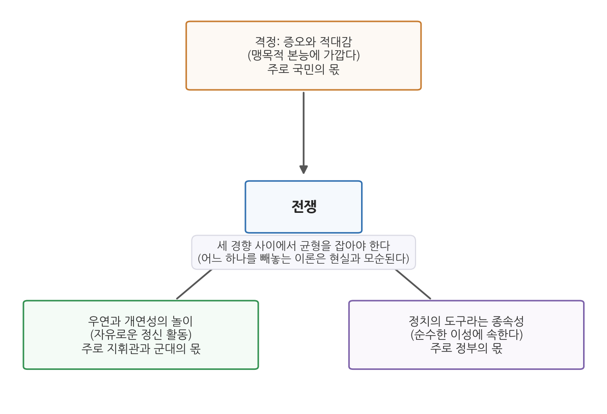
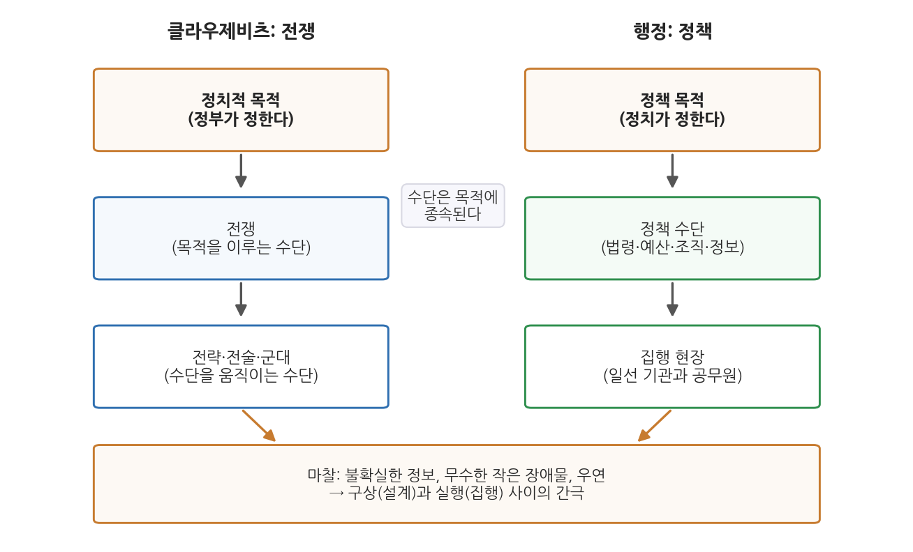

# 3주차 2차시. 국가목적과 합리성 (2): 클라우제비츠의 전쟁론

> 정치적 견해가 목적이고 전쟁은 수단이며, 수단은 목적 없이는 결코 생각될 수 없다.
> (카를 폰 클라우제비츠, 『전쟁론』)

## 이 장에서 배우는 것

행정사 교재에서 전쟁 이론서를 읽는다니 의아할 수 있다. 그러나 이런 장면을 떠올려 보자. 어느 부처가 야심 찬 정책을 설계했다. 목표는 분명하고, 계획서는 빈틈없어 보인다. 그런데 시행 첫 달부터 일이 어긋난다. 현장에서 올라오는 보고는 서로 모순되고, 일선 기관마다 사정이 달라 지침이 그대로 먹히지 않으며, 예상치 못한 사건 하나가 일정 전체를 뒤흔든다. 설계할 때는 그토록 단순해 보이던 일이 왜 실행에서는 이렇게 어려운가.

이 질문을 가장 깊이 파고든 고전이 클라우제비츠의 『전쟁론』이다. 전쟁은 국가가 벌이는 사업 중 가장 크고 가장 위험한 것이다. 그래서 전쟁을 다룬 이 책은, 국가가 목적을 세우고 수단을 움직여 그것을 이루려 할 때 무슨 일이 벌어지는지에 대한 가장 밀도 높은 기록이기도 하다. 1차시에서 벤담은 정부의 목적(최대 다수의 최대 행복)을 물었다. 이번 차시의 클라우제비츠는 그다음 질문, 곧 목적과 수단의 관계를 묻는다. 그의 대답이 저 유명한 명제다. 전쟁은 다른 수단에 의한 정치의 연속이다.

이 장에서는 구체적으로 다음을 배운다.

- 클라우제비츠의 생애와 나폴레옹 전쟁 이후의 프로이센이라는 배경
- 『전쟁론』의 핵심 명제들 (전쟁의 정의, 정치의 연속, 삼위일체, 정보의 불확실성, 마찰)
- 수단-목적 합리성이라는 사고 틀과 그것이 행정에 대해 갖는 의미
- 정책수단론과 집행론, 그리고 군사행정과 관료제의 연결

<strong>이 장의 로드맵</strong> 
이 장은 하나의 질문을 따라 전개된다. <em>"목적이 정해졌을 때, 그 목적을 이루는 수단은 어떤 논리로 움직이며, 왜 구상대로 실행되지 않는가?"</em>  
<strong>2.1</strong> 클라우제비츠와 그의 시대를 본다 (나폴레옹 전쟁과 프로이센) →
<strong>2.2</strong> 원전을 읽는다 (『전쟁론』 발췌 여섯 대목) →
<strong>2.3</strong> 수단-목적 합리성과 행정의 관계를 정리한다 →
<strong>2.4</strong> 현대적 함의를 본다 (정책수단론, 집행의 마찰, 군사행정과 관료제).

## 2.1 클라우제비츠와 나폴레옹 전쟁 이후의 프로이센

### 구체제의 군대가 무너진 날

클라우제비츠(Carl von Clausewitz, 1780-1831)는 프로이센의 군인이자 군사이론가로, 근대 전쟁과 전략에 관한 가장 저명한 사상가로 꼽힌다. 그의 사상을 이해하려면 그가 겪은 시대의 충격부터 보아야 한다. 1806년, 프로이센군은 예나에서 나폴레옹의 군대에 참패했다. 프리드리히 대왕의 영광을 물려받았다고 자부하던 유럽 유수의 군대가 한 번의 회전에서 무너진 것이다. 프랑스혁명이 만들어 낸 새로운 전쟁, 곧 국민 전체가 동원되고 격정이 전쟁을 밀고 가는 시대의 전쟁 앞에서, 용병과 귀족 장교로 짜인 구체제의 군대는 상대가 되지 못했다.

이 패배는 프로이센에 뼈아픈 자기반성을 강요했고, 군대와 국가 기구 전반의 개혁 운동으로 이어졌다. 샤른호르스트와 그나이제나우가 이끈 군 개혁이 그 중심에 있었다. 낡은 조직을 뜯어고치고, 장교단을 신분이 아니라 능력으로 충원하며, 전쟁을 학문적으로 연구하는 흐름이 이때 만들어졌다. 『전쟁론』은 이 반성과 재건의 시대가 낳은 책이다.

### 패전과 망명, 그리고 미완의 대작

클라우제비츠 자신이 이 격동의 한복판을 살았다. 그는 프로이센의 중류층 가정에서 태어났다. 집안은 대대로 목사 가문이었고, 할아버지는 신학 교수였다. 이 학문적 전통은 훗날 『전쟁론』의 철학적 사유와 서술 방식에 흔적을 남긴다. 그는 열두 살에 군문에 들어가 소년병으로 전쟁을 처음 겪었고, 베를린의 군사학교에서 개혁가 샤른호르스트에게 배우며 왕자의 교육을 맡을 만큼 두각을 나타냈다. 예나 전투에서는 프랑스군의 포로가 되었고, 귀국 후 군 개혁에 참여했다. 1812년 프로이센이 나폴레옹과 동맹을 맺고 러시아 원정에 동참하자, 그는 이에 반발해 군을 떠나 러시아군에 합류했다. 정면 대결로 나폴레옹의 군대를 이긴 세력이 없으니, 나폴레옹의 군대 그 자체보다 그 군대의 유지를 상대해야 한다는 판단 아래 지연전과 소모전이 수행되던 전장이었다.

1815년 프로이센으로 돌아온 그는 그나이제나우의 참모장을 지냈고, 베를린의 군사학교 교장으로 일하며 『전쟁론(Vom Kriege)』을 집필했다. 그러나 책을 완성하지 못한 채 1831년 콜레라로 세상을 떠났다. 51세였다. 원고를 정리해 이듬해인 1832년 책으로 펴낸 사람은 부인 마리였다. 『전쟁론』은 이렇게 미완성 유고로 출간되었고, 철학적이고 난해한 서술 탓에 제대로 읽은 사람은 드물고 오독은 많은 책이 되었다. 끝까지 읽은 사람은 적어도 누구나 아는 책, 그것이 고전(classic)의 운명이다.

<strong>유의 · 『전쟁론』은 전쟁 예찬서가 아니다</strong> 
"전쟁은 정치의 연속"이라는 명제는 종종 전쟁을 정당화하는 말로 오독되어 왔다. 본문에서 확인하겠지만 명제의 뜻은 반대에 가깝다. 전쟁은 그 자체로 목적이 될 수 없고 언제나 정치적 목적에 종속되는 수단일 뿐이라는 것, 따라서 정치가 통제하지 못하는 전쟁은 이성을 잃은 폭력이라는 것이 요지다. 클라우제비츠는 원전에서 전쟁을 "얼마나 쉽게 무너져 우리를 그 잔해 속에 파묻을 수 있는지" 모를 위험한 건물에 비유한다. 전쟁의 위험과 어려움을 냉정하게 응시하는 것이 이 책의 기조다.

## 2.2 원전 강독: 전쟁론

이제 원전을 읽는다. 앞의 네 대목은 『전쟁론』 제1권 제1장 "전쟁이란 무엇인가"에서, 뒤의 두 대목은 우리 강독 교재에 수록된 제1권 제6장 "전쟁에서의 정보"와 제7장 "전쟁에서의 마찰"에서 가져왔다.

### 전쟁이란 무엇인가

<strong>원전 읽기 · 클라우제비츠, 『전쟁론』 1권 1장 (1832)</strong> 
"전쟁이란 확대된 결투에 지나지 않는다. 전쟁을 이루는 무수한 결투를 하나로 묶어 생각하려면 두 명의 씨름꾼을 떠올리는 것이 가장 좋다. 각자는 물리적 힘으로 상대를 자기 의지에 굴복시키려 하고, 상대를 쓰러뜨려 더는 저항하지 못하게 만들려 한다. 그러므로 전쟁은 상대에게 우리의 의지를 강요하기 위한 폭력 행위다."

**무슨 말인가.** 클라우제비츠는 학자들의 현학적 정의를 제쳐 두고 사태의 핵심 요소에서 출발한다. 전쟁의 원형은 결투, 곧 두 씨름꾼의 맞붙음이다. 여기서 세 가지 요소가 추려진다. 폭력이라는 수단, 상대의 저항을 꺾는다는 당면 목표, 그리고 우리의 의지를 관철한다는 궁극 목적이다. 전쟁의 본질을 화려한 명분이 아니라 "의지의 강요"로 규정하는 이 차가운 정의가 책 전체의 출발점이다.

**왜 중요한가.** 정의 안에 이미 목적과 수단의 구분이 들어 있다는 점을 보아야 한다. 폭력은 수단이고, 의지의 관철이 목적이다. 그렇다면 그 "의지"의 내용은 어디서 오는가. 군대 자신이 아니라 국가, 곧 정치가 정한다. 다음 대목이 그 귀결이다.

### 전쟁은 다른 수단에 의한 정치의 연속이다

<strong>원전 읽기 · 클라우제비츠, 『전쟁론』 1권 1장 (1832)</strong> 
"전쟁은 단순히 정치적 행위에 그치지 않고 진정한 정치의 도구이며, 다른 수단으로 이어 가는 정치적 교섭의 연속이다. 전쟁에만 고유한 것이 있다면, 그것은 오직 전쟁이 쓰는 수단의 특수한 성질에 관련될 뿐이다. 정치적 견해가 목적이고 전쟁은 수단이며, 수단은 목적 없이는 결코 생각될 수 없다."

**무슨 말인가.** 『전쟁론』에서 가장 유명한 명제다. 전쟁은 평화로운 시기의 외교와 협상, 곧 정치적 교섭이 수단만 바꾸어 계속되는 것이다. 포성이 울리는 순간 정치가 끝나고 전쟁의 논리가 시작되는 것이 아니라, 전쟁이 진행되는 내내 정치적 목적이 전쟁을 지휘해야 한다. 전쟁에 고유한 것은 수단의 성질(폭력)뿐이며, 무엇을 위해 싸우는지는 처음부터 끝까지 정치가 답할 문제다. 마지막 문장이 이 장 전체의 열쇠다. 수단은 목적 없이는 생각될 수조차 없다.

**왜 중요한가.** 이 명제는 국가 활동 일반에 대한 사고 틀을 담고 있다. 국가가 동원하는 수단 가운데 가장 극단적인 것이 전쟁인데, 그 전쟁조차 독자적 목적을 가질 수 없고 정치에 종속된다면, 국가의 다른 모든 수단은 말할 것도 없다. 군대가 정치의 통제를 벗어나 전쟁 자체를 목적으로 삼을 때 무슨 일이 벌어지는지를 20세기의 역사가 보여 주었다. 행정으로 옮기면, 집행 기구가 정책 목적을 잊고 수단의 논리(조직의 관성, 절차 그 자체)에 갇히는 순간에 대한 경고로 읽을 수 있다.

### 정치적 목적이 척도다

<strong>원전 읽기 · 클라우제비츠, 『전쟁론』 1권 1장 (1832)</strong> 
"정치적 목적은 전쟁을 불러낸 본래의 동기이므로, 군사 행동이 도달해야 할 목표를 정하는 척도이자 거기에 쏟을 노력의 크기를 정하는 척도가 된다. 우리가 상대에게 요구하는 희생이 작을수록 상대가 동원할 저항 수단도 작으리라 기대할 수 있고, 상대의 준비가 작을수록 우리의 준비도 작아도 된다. 또한 우리의 정치적 목적이 작을수록 우리는 그것에 낮은 가치를 매기게 되고, 그만큼 더 쉽게 그것을 포기하게 된다."

**무슨 말인가.** "정치의 연속" 명제를 실무의 언어로 구체화한 대목이다. 정치적 목적은 전쟁의 방향만 정하는 것이 아니라 규모까지 정한다. 목적이 크면 큰 노력이, 목적이 작으면 작은 노력이 합리적이다. 작은 목적에 큰 희생을 쏟는 것은 비합리이고, 목적의 가치보다 비용이 커지면 그 목적은 포기하는 것이 합리적이다. 목적이 수단의 종류와 양, 나아가 중단의 시점까지 지배하는 것이다.

**왜 중요한가.** 여기서 우리는 합리성의 한 정의를 얻는다. 주어진 목적에 비추어 수단의 종류와 크기를 조율하는 것, 이것이 수단-목적 합리성이다. 이 계산법은 정책의 세계에서 그대로 통한다. 정책 목표의 크기에 맞는 예산과 조직을 투입하고 있는가. 목표가 달성되었거나 목표의 가치보다 비용이 커졌는데도 사업이 관성으로 계속되고 있지는 않은가. 클라우제비츠의 척도는 오늘의 사업 평가에서도 날이 서 있다.

### 전쟁의 삼위일체

<strong>원전 읽기 · 클라우제비츠, 『전쟁론』 1권 1장 (1832)</strong> 
"전쟁은 카멜레온과 같아서 경우마다 그 성질을 조금씩 바꾼다. 그러나 전체로 보면, 전쟁은 그 안의 지배적 경향들에 비추어 하나의 놀라운 삼위일체를 이룬다. 첫째는 맹목적 본능이라 할 증오와 적대감이라는 원초적 폭력이고, 둘째는 전쟁을 자유로운 정신 활동으로 만드는 우연과 개연성의 놀이이며, 셋째는 전쟁을 순수한 이성의 영역에 속하게 하는, 정치의 도구라는 종속적 성질이다. 첫째는 주로 국민에게, 둘째는 주로 지휘관과 그의 군대에, 셋째는 주로 정부에 관련된다. 이 세 경향 가운데 어느 하나를 무시하거나 그들 사이의 관계를 자의로 고정하려는 이론은, 그 즉시 현실과 모순에 빠져 그것만으로도 무너진다."

**무슨 말인가.** 전쟁의 전체 모습을 그린 대목이다. 전쟁 안에는 서로 다른 세 힘이 함께 작동한다. 국민의 격정(증오와 적대감), 지휘관과 군대가 상대하는 우연과 개연성, 그리고 정부가 대표하는 이성(정치적 목적)이다. 전쟁이 "정치의 도구"라는 앞의 명제는 이 삼위일체의 셋째 꼭짓점일 뿐이다. 이성이 격정과 우연을 완전히 통제할 수 있다는 보장은 어디에도 없으며, 세 경향 중 하나라도 빼놓는 이론은 현실 앞에서 무너진다.

그림 3-3은 가운데의 전쟁을 세 상자가 둘러싼 모양으로 읽는다. 위가 국민의 격정, 왼쪽 아래가 지휘관과 군대의 우연·개연성, 오른쪽 아래가 정부의 이성이다. 이 그림에서 알 수 있는 것은 클라우제비츠의 균형 감각이다. 그는 전쟁을 순수한 이성의 계산으로 환원하지도(그러면 격정과 우연이 사라진다), 순수한 폭력으로 환원하지도(그러면 정치적 목적이 사라진다) 않는다.

**왜 중요한가.** 삼위일체는 정책의 세계에도 그대로 겹쳐 볼 수 있다. 정책에는 이성적 설계(정부의 계획)만 있는 것이 아니다. 여론의 감정과 지지(국민), 집행 현장의 우연과 재량(일선 기관)이 함께 작동한다. 설계도만 보고 정책의 성패를 예측할 수 없는 이유, 그리고 세 요소 사이의 균형을 잃은 정책이 무너지는 이유를 이 틀이 설명해 준다.

### 전쟁에서의 정보: 모든 판단의 흔들리는 토대

이제 강독 교재에 수록된 두 장으로 넘어간다. 여기서 클라우제비츠는 이성(정치적 목적)이 현실에서 부딪히는 두 개의 벽, 곧 정보의 불확실성과 마찰을 해부한다.

<strong>원전 읽기 · 클라우제비츠, 『전쟁론』 1권 6장 "전쟁에서의 정보" (1832)</strong> 
"정보란 적과 적국에 대해 우리가 가진 모든 지식을 가리킨다. 정보는 사실상 우리의 모든 사고와 행위의 토대다. 그런데 이 토대가 얼마나 믿을 수 없고 변화무쌍한 것인지 잠시만 생각해 보면, 전쟁이라는 건물이 얼마나 위험한지, 그것이 얼마나 쉽게 무너져 우리를 그 잔해 속에 파묻을 수 있는지 곧 느끼게 된다. 전쟁에서 얻는 정보의 상당 부분은 서로 모순되고, 그보다 더 많은 부분은 거짓이며, 의심스러운 것이 압도적으로 많다. 장교에게 요구되는 것은 일종의 분별력인데, 이는 인간과 사물에 대한 지식과 건전한 판단력만이 줄 수 있다. 확률의 법칙이 그의 길잡이가 되어야 한다. 요컨대 대부분의 보고는 거짓이고, 인간의 소심함은 거짓과 허위를 배가하는 요인으로 작용한다."

**무슨 말인가.** 판단의 토대인 정보 자체가 흔들린다는 진단이다. 보고는 서로 모순되고, 거짓이 섞이며, 나쁜 소식은 사람들의 불안을 타고 부풀려진다. 클라우제비츠는 "확실한 정보만 믿으라"는 교과서의 격언을 보잘것없는 위안이라고 잘라 말한다. 확실한 정보를 기다릴 수 있는 사치가 현실에는 없기 때문이다. 남는 길은 확률의 법칙을 길잡이 삼는 분별력, 곧 불확실성을 전제로 한 판단이다. 그는 이어지는 대목에서, 잘못된 보고들이 서로를 확인하고 과장하는 가운데 긴급한 필요에 쫓겨 내린 결정이 어리석음으로 드러나는 경우가 많다고 경고하고, 최고 지휘관은 "파도의 격노가 헛되이 부서지는 바위처럼" 자신의 더 나은 확신에 의지해 서 있어야 한다고 쓴다.

**왜 중요한가.** 완전한 정보 위에서 최선의 대안을 고르는 교과서적 합리성이 현실에서 성립하지 않는다는 것, 이것이 이 장의 행정학적 의미다. 정책결정 역시 불완전한 정보 위에 세워진다. 100년 뒤 허버트 사이먼이 인간의 인지 한계에서 출발해 제한된 합리성 개념으로 정식화하는 문제(9주차), 린드블롬이 점증주의로 응답하는 문제(11주차)를, 클라우제비츠는 전장이라는 극한 상황에서 이미 마주하고 있었다. 위기 상황에서 잘못된 보고가 연쇄적으로 증폭되어 성급한 결정을 낳는 위험은 오늘날 재난행정이 씨름하는 문제 그대로다.

### 전쟁에서의 마찰: 단순한 것이 어려운 이유

<strong>원전 읽기 · 클라우제비츠, 『전쟁론』 1권 7장 "전쟁에서의 마찰" (1832)</strong> 
"전쟁에서 모든 것은 매우 단순하다. 그러나 가장 단순한 것조차 어렵다. 이 어려움들이 쌓여 일종의 마찰을 만들어 내는데, 전쟁을 직접 보지 못한 사람은 그것을 정확히 상상할 수 없다. 무수히 많은 자질구레한 상황들, 서류 위에서는 도저히 짚어 낼 수 없는 상황들의 영향으로 일은 기대에 미치지 못하고, 우리는 목표에 도달하지 못하게 된다. 군대라는 기계와 거기 속한 모든 것은 사실 단순해서 다루기 쉬워 보인다. 그러나 그 어느 부분도 한 덩어리가 아니라는 점을 기억해야 한다. 군대는 오로지 개별 인간들로 이루어져 있고, 그 하나하나가 저마다의 마찰을 일으킨다. 하찮아 보이는 개인 하나가 우연히 지연이나 무질서를 일으킬 수 있다. 이 마찰이야말로 전쟁에서 겉보기에 쉬워 보이는 것을 실제로는 어렵게 만드는 것이다."

**무슨 말인가.** 마찰(friction)은 클라우제비츠가 물리학에서 빌려 온 은유로, 책 속의 전쟁과 실제 전쟁을 가르는 개념이다. 그는 저녁까지 두 구간만 더 가면 되는 여행자의 예를 든다. 아무것도 아닌 일정이지만, 역에 말이 없고, 길은 언덕이고, 날은 저물어, 여행자는 끝내 초라한 숙소에 만족해야 한다. 계획을 무너뜨리는 것은 하나의 큰 장애물이 아니라 무수한 작은 어려움의 누적이다. 마찰은 몇몇 지점에 몰려 있지 않고 어디에나 있으며, 늘 우연과 맞닿아 있다. 안개가 포격을 막고, 비가 행군을 늦추듯이. 그리고 조직은 한 덩어리의 기계가 아니라 개인들의 집합이므로, 각자가 마찰의 발생원이 된다.

**왜 중요한가.** 이 장은 행정학이 훗날 집행(implementation)이라는 이름으로 발견하는 문제의 예고편이다. 제도와 계획은 서류 위에서 명쾌해 보이지만, 집행 현장에는 서류에 없는 작은 장애물들이 무수히 깔려 있다. 클라우제비츠는 두 가지 처방을 덧붙인다. 첫째, 마찰에 대한 지식은 이론만으로 배울 수 없고 경험으로 체득된다. 훌륭한 장군은 마찰을 알기에 그것에 위축되지도, 기대할 수 없는 정밀한 결과를 요구하지도 않는다. 둘째, 강한 의지는 마찰을 짓밟아 극복할 수 있지만 그 과정에서 기계(조직) 또한 함께 부서진다. 목표 달성을 밀어붙이는 리더십의 비용까지 계산에 넣은 것이다.

<strong>정의 · 전장의 안개와 마찰</strong> 
<strong>전장의 안개</strong>(fog of war)는 전쟁에서 정보가 불확실하고 모순되며 거짓에 오염되는 상태를 가리키는 표현으로, 『전쟁론』의 정보 논의에서 유래했다. 아는 것이 참인지 알 수 없고, 그 위에서 내리는 판단을 믿어도 되는지도 알 수 없는 이중의 불확실성을 뜻한다. 
<strong>마찰</strong>(friction)은 계획과 실행 사이에서 발생하는 무수한 작은 어려움의 누적으로, 서류 위의 전쟁과 실제 전쟁을 구별해 주는 개념이다. 정책학에서 설계와 집행의 간극을 설명할 때 빌려 쓰는 은유가 되었다.

## 2.3 수단-목적 합리성과 행정: 정책 목적에 종속되는 수단의 논리

### 두 개의 합리성 질문

이제 두 차시를 잇는 자리에 섰다. 벤담과 클라우제비츠는 얼핏 무관해 보이지만, 국가의 합리성이라는 하나의 문제를 양쪽에서 파고든다. 벤담의 질문은 목적의 합리성이다. 정부는 무엇을 위해 존재하는가. 무엇이 좋은 정책인가. 그의 대답이 최대 다수의 최대 행복이라는 목적 기준이었다. 클라우제비츠의 질문은 수단의 합리성이다. 목적이 정해졌을 때 수단은 어떻게 선택되고 통제되어야 하는가. 그의 대답이 "수단은 목적에 종속되며, 목적이 수단의 종류와 크기의 척도"라는 것이었다.

이 두 번째 사고방식을 수단-목적 합리성이라 부른다.

<strong>정의 · 수단-목적 합리성</strong> 
<strong>수단-목적 합리성</strong>(means-ends rationality)은 주어진 목적을 달성하는 데 가장 적합한 수단을 골라 쓰는 사고방식이다. 여기서 합리성의 심사 대상은 목적 자체가 아니라 목적과 수단의 관계다. 목적에 비해 과도하거나 부족한 수단, 목적을 잊고 스스로 목적이 되어 버린 수단은 비합리로 판정된다. 도구적 합리성(instrumental rationality)이라고도 하며, 뒤에 7주차에서 만날 베버의 관료제 이론과 9주차 사이먼의 행정 연구가 이 개념 위에 서 있다.

### 행정, 정치라는 목적에 봉사하는 수단

이 틀로 행정을 보면 행정학의 오래된 자화상 하나가 떠오른다. 정치가 목적(정책 목표)을 정하고, 행정은 그 목적을 이루는 수단의 체계라는 그림이다. 그림 3-4가 이 대응을 보여 준다.

그림 3-4는 두 기둥을 나란히 놓고 읽는다. 왼쪽 기둥에서 정치적 목적은 전쟁이라는 수단을 지휘하고, 전쟁은 다시 전략·전술이라는 하위 수단을 지휘한다. 오른쪽 기둥에서 정책 목적은 법령·예산·조직·정보 같은 정책 수단을 지휘하고, 정책 수단은 일선의 집행 현장에서 실행된다. 두 기둥 모두 아래로 내려갈수록 클라우제비츠가 말한 마찰 지대(맨 아래 상자)에 가까워진다. 이 그림에서 알 수 있는 것은 두 가지다. 위계의 논리(수단은 목적에 종속된다)와, 그 위계가 현장에서 마주치는 저항(구상과 실행의 간극)이다.

다만 이 그림은 규범이지 현실의 기술이 아니라는 점을 원전 자체가 가르쳐 준다. 클라우제비츠가 삼위일체와 마찰로 보여 주었듯, 이성이 격정과 우연을 지휘한다는 보장은 없다. 위계는 목표이고, 마찰은 일상이다. 목적-수단의 위계가 규범으로서 왜 필요한지(수단의 폭주를 막는다)와, 그것이 현실에서 왜 그대로 관철되지 않는지(정보의 불확실성과 마찰)를 함께 쥐고 있어야 클라우제비츠를 제대로 읽은 것이다.

여기에 이 사고 틀의 한계에 대한 질문도 예고되어 있다. 정치와 행정을 목적과 수단으로 깔끔하게 나눌 수 있는가. 4주차와 5주차에서 읽을 윌슨과 굿나우는 바로 이 분리를 행정학의 초석으로 삼았고, 행정학의 이후 역사는 상당 부분 그 분리가 무너지는 과정이었다. 클라우제비츠의 마찰 개념은 그 붕괴를 미리 보여 준다. 집행 현장의 재량과 우연이 정책의 내용을 실질적으로 바꾸어 놓는다면, 수단은 이미 순수한 수단이 아니기 때문이다.

## 2.4 현대적 함의: 정책수단론, 집행의 마찰, 군사행정과 관료제

### 정책수단론: 수단의 선택도 정치다

"정치적 견해가 목적이고 전쟁은 수단"이라는 명제를 행정학은 정책수단론(policy instruments)이라는 분야로 발전시켰다. 정부가 목적을 이루기 위해 동원할 수 있는 수단은 다양하다. 규제와 법령, 보조금과 조세 같은 재정 수단, 공공조직의 직접 수행, 정보 제공과 홍보. 같은 목적이라도 어떤 수단을 고르느냐에 따라 비용과 효과, 부담의 분배, 국민이 체감하는 정부의 얼굴이 달라진다. 클라우제비츠가 정치적 목적의 크기에 맞는 군사적 노력의 크기를 계산했듯, 정책설계자는 목표의 성격에 맞는 수단의 조합을 계산한다. 그리고 전쟁이라는 수단의 선택이 가장 무거운 정치적 결정이듯, 정책수단의 선택 역시 기술적 결정이 아니라 정치적 결정이다.

### 집행론: 마찰의 재발견

『전쟁론』의 마찰 개념은 1970년대 정책학이 집행 문제를 발견했을 때 이미 준비된 어휘였다. 정책이 결정만 되면 집행은 따라오리라는 가정이 깨지고, 프레스먼과 윌다브스키를 비롯한 연구자들이 집행 과정에서 정책이 지연되고 변형되고 좌초하는 메커니즘을 파고들었다. 집행이 거쳐야 하는 수많은 결정 지점과 거부점에서 작은 지연이 누적되어 큰 실패가 되는 과정은, 클라우제비츠의 여행자가 겪은 저녁길 그대로다.

한국의 최근 경험도 이 렌즈로 읽을 수 있다. 코로나19 초기의 마스크 공급 대란에서 정부는 수요와 공급의 불균형이라는 마찰에 부딪혔고, 출생연도 요일제라는 수단을 임시로 도입했다가 수급이 안정되자 폐지하는 단계적 조정을 거쳤다. 긴급재난지원금은 전 국민 지급으로 시작했으나 형평성 논란과 재정 부담이라는 마찰에 부딪혀 선별 지원으로 조정되었다. 확진자 동선 공개도 전면 공개 원칙에서 출발했다가 사생활 침해 문제가 제기되자 시간·장소 중심 공개로 수정되었다. 사전에 설계된 매뉴얼이 그대로 관철된 것이 아니라, 집행 과정의 마찰을 반영한 피드백과 적응적 학습이 대응의 성패를 갈랐다. 마찰을 아는 장군이 정밀한 결과를 요구하지 않듯, 마찰을 아는 정책설계자는 계획의 완벽함보다 조정의 여지를 설계에 넣는다.

### 군사행정과 관료제: 오래된 동행

마지막으로, 이 장이 군인의 책으로 국가와 행정을 이야기할 수 있었던 배경을 짚어 두자. 근대 공공행정의 전개와 군사 제도의 발전 사이의 연계는 행정사의 중요한 주제다. 상비군을 유지하려면 징집과 징세, 보급과 회계라는 거대한 행정이 필요했고, 근대 국가의 관료 기구는 상당 부분 이 필요 속에서 자라났다. 클라우제비츠가 복무한 프로이센은 그 전형이었다. 예나의 패전 이후 군 개혁은 능력에 따른 충원, 체계적인 교육, 참모 조직의 정비로 나아갔는데, 이는 곧 실적에 따른 임용과 전문 교육, 계서적 조직이라는 근대 관료제의 원리이기도 하다. 1주차에서 세계사를 행정 제도의 흥망사로 읽었던 시각을 되살리면, 군대는 가장 오래된 대규모 행정조직이며, 7주차에 읽을 베버의 관료제 이념형에서 우리는 이 동행의 이론적 정리를 만나게 된다.

<strong>왜 100년 뒤의 문제를 미리 만났는가?</strong> 
클라우제비츠가 다룬 정보의 불확실성과 구상-실행의 간극은, 100년 뒤 사이먼과 린드블롬이 의사결정자가 감당할 수 있는 정보량의 문제로 다시 만나는 주제다. 전쟁은 불확실성·시간 압박·집행의 어려움이 극한으로 응축된 활동이어서, 평시의 행정에서는 서서히 드러나는 문제들이 전장에서는 즉각 생사의 문제로 나타난다. 극한 사례가 일반 이론을 앞질러 발견하게 만든 셈이다. 구상과 실행 사이의 거대한 간극이라는 그의 통찰은 빅데이터와 AI의 시대에 좁아지기는커녕 더욱 넓어지고 있다. 데이터가 많아져도 그것이 참인지, 그 위에서 내린 판단을 믿어도 되는지의 문제는 사라지지 않기 때문이다.

## 요약

2.1절에서는 클라우제비츠의 생애와 시대를 보았다. 1806년 예나의 패전은 프로이센에 군과 국가 기구의 개혁을 강요했고, 소년병에서 군사학교 교장에 이른 클라우제비츠의 이력은 그 개혁의 역사와 겹친다. 『전쟁론』은 그가 완성하지 못한 채 부인 마리가 1832년에 펴낸 유고작이다. 2.2절에서는 원전 여섯 대목을 읽었다. 전쟁은 상대에게 의지를 강요하는 폭력 행위이고(정의), 정치적 교섭을 다른 수단으로 잇는 정치의 연속이며(종속 명제), 정치적 목적이 군사적 노력의 목표와 크기를 재는 척도가 된다(합리성의 척도). 전쟁 전체는 국민의 격정, 군의 우연·개연성, 정부의 이성이 이루는 삼위일체이며, 이성의 지휘는 불확실한 정보(전장의 안개)와 무수한 작은 어려움의 누적(마찰)이라는 두 벽에 부딪힌다. 2.3절에서는 벤담의 목적 기준과 클라우제비츠의 수단 논리를 수단-목적 합리성이라는 틀로 묶고, 정치가 목적을 정하고 행정이 수단으로 봉사한다는 위계가 규범으로서 필요하되 현실에서는 마찰로 흔들린다는 점을 정리했다. 2.4절에서는 이 유산이 정책수단론과 집행론으로 이어졌음을 보고, 코로나19 대응의 조정 과정을 마찰과 적응적 학습의 사례로 읽었으며, 군사행정과 근대 관료제의 역사적 동행을 확인했다.

## 토론·복습 문제

**3-5. (서술형 연습)** "전쟁은 다른 수단에 의한 정치의 연속"이라는 클라우제비츠의 명제를 설명하고, 이 명제에 담긴 수단-목적 합리성의 논리가 현대 행정에서 정책 목적과 정책 수단의 관계에 어떻게 적용될 수 있는지 논의하시오. 아울러 삼위일체와 마찰 개념이 이 위계의 관철을 어떻게 제약하는지 함께 서술하시오.

**3-6. (원전 해석)** 다음 구절을 읽고 물음에 답하시오. "전쟁에서 모든 것은 매우 단순하다. 그러나 가장 단순한 것조차 어렵다. 이 어려움들이 쌓여 일종의 마찰을 만들어 낸다." 클라우제비츠가 말하는 마찰이 무엇인지 여행자의 비유를 이용해 설명하고, 여러분이 알고 있는 정책 사례 하나에서 마찰에 해당하는 요소들을 찾아보시오.

**3-7. (비교)** 벤담과 클라우제비츠는 각각 국가의 목적과 수단이라는 다른 층위에서 합리성을 논한다. 두 사상가의 질문과 대답을 비교하고, "좋은 정책"이 되기 위해 두 층위의 합리성이 모두 필요한 이유를 사례를 들어 설명하시오.

**3-8. (적용)** 최고 지휘관은 흔들리는 보고 속에서도 "바위처럼" 자신의 확신에 의지해야 한다고 클라우제비츠는 말한다. 그러나 확신이 지나치면 잘못된 계획을 고집하는 독선이 된다. 정책결정자가 "근거 없는 압력에 흔들리지 않는 것"과 "새로운 증거에 따라 계획을 수정하는 것"을 어떻게 구별할 수 있을지, 2.2절의 정보 논의를 바탕으로 토론해 보시오.
