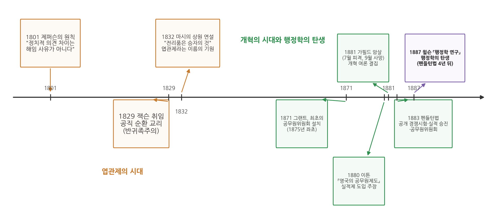

# 4주차 1차시. 행정학의 탄생 (1): 엽관제의 시대와 개혁 운동

> 공직에 대한 가장 확실하고 정당한 자격은 후보자 개인의 실적이다.
> (도먼 이튼, 『영국의 공무원제도』, 1880)

## 이 장에서 배우는 것

1881년 7월 2일 아침, 미국 워싱턴의 한 기차역. 취임한 지 넉 달이 된 제임스 가필드(James A. Garfield) 대통령이 여름 휴가를 떠나려고 플랫폼을 걷고 있었다. 그때 찰스 기토(Charles Guiteau)라는 남자가 다가와 등 뒤에서 권총을 두 발 쏘았다. 기토는 지난 대선에서 자신이 가필드의 당선을 도왔으므로 그 보상으로 관직을 받아야 한다고 믿었고, 몇 달 동안 백악관과 국무부를 드나들며 자리를 요구하다 번번이 거절당한 인물이었다. 훗날 교과서들이 그를 부르는 이름은 "낙심한 구직자(disappointed office seeker)"다.

대통령을 쏜 사람이 왜 하필 구직자였을까. 이 물음에 답하려면 당시 미국의 공직이 어떻게 채워졌는지를 보아야 한다. 19세기 미국에서 연방정부의 수많은 관직은 시험이나 경력이 아니라 선거의 전리품으로 배분되었다. 정권이 바뀌면 우체국장부터 세관원까지 대대적으로 물갈이되었고, 승리한 정당의 지지자들이 그 자리를 차지했다. 이것이 엽관제(spoils system)다. 기토의 총알은 한 개인의 망상에서 나왔지만, 그 망상을 키운 것은 "선거를 도우면 관직을 받는다"는 제도였다. 그리고 이 죽음은 미국 공무원제도의 역사를 바꾸었다.

3주차에서 우리는 벤담에게서 정부의 목적(최대 다수의 최대 행복)을, 클라우제비츠에게서 목적을 이루는 수단의 조직화라는 문제를 읽었다. 이번 주에는 무대를 19세기 미국으로 옮긴다. 정부가 무엇을 해야 하는가라는 물음 곁에서, 정부의 일을 누가, 어떤 자격으로 맡을 것인가라는 물음이 어떻게 하나의 학문(행정학)을 낳게 되었는지를 두 차시에 걸쳐 본다. 이 장에서는 구체적으로 다음을 배운다.

- 엽관제가 어떤 민주주의적 논리에서 출발했고 어떤 폐해로 귀결되었는지
- 가필드 암살(1881)이 어떻게 펜들턴법(1883)으로 이어졌는지
- 실적주의 공무원제의 핵심 원리와 그 확산·한계
- 공무원제도 개혁이 왜 행정학이라는 학문이 태어날 토양이 되었는지

<strong>이 장의 로드맵</strong> 
이 장은 하나의 질문을 따라 전개된다. <em>"공직은 누구의 것인가. 승리한 정당의 것인가, 자격을 갖춘 시민의 것인가?"</em>  
<strong>1.1</strong> 엽관제의 탄생과 논리를 본다 (제퍼슨의 원칙에서 잭슨의 공직 순환으로) →
<strong>1.2</strong> 개혁 운동과 가필드 암살, 그리고 펜들턴법(1883)을 본다 →
<strong>1.3</strong> 진보주의 시대에 실적주의가 확산되는 과정과 그 한계를 본다 →
<strong>1.4</strong> 이 제도 개혁이 어떻게 행정학의 토양이 되었는지 확인하고 2차시(윌슨)로 넘어간다.

## 1.1 잭슨 민주주의와 엽관제

### 제퍼슨의 원칙: 의견이 다르다고 해임하지 않는다

미국의 공무원제도 개혁은 흔히 남북전쟁(1861-1865) 이후에 시작되었다고 이야기되지만, 문제의 정치적 뿌리는 훨씬 이전인 공화국 초창기까지 거슬러 올라간다. 교재의 제3절 도입은 이 역사를 하나의 투쟁으로 요약한다. 미국의 공공행정이 처음부터 실적(merit)에 기반한 공직제도를 창안했던 것은 아니며, 현대적 의미의 행정 국가를 세우기 위한 첫 실질적 조치는 남북전쟁 이후에야 나왔다. 문제의 핵심은 정당에 충성한 사람들에게 정부 일자리를 전리품으로 나누어 주는 관행(엽관제)을 제한할 것인가, 아니면 임용과 재직이 실적에 따라 결정되는 공무원제도를 세울 것인가였다.

그 투쟁의 첫 장면에 토머스 제퍼슨이 있다. 제퍼슨은 자신에게 철학적으로 적대적인 관료제 문제를 처음으로 마주한 대통령이었다. 그는 연방당 소속 관료들을 해임하고 자기 지지자들로 바꾸라는 강한 압박을 받았지만, 정치적 이유만으로는 관료를 해임하지 않겠다고 결심했다. 1801년 윌리엄 핀들리에게 보낸 편지에서 그는 직무상의 비행(malconduct)은 정당한 해임 사유이지만 단순한 정치적 의견 차이는 해임 사유가 될 수 없다고 썼다.

요컨대 초대 정부 시기의 미국에서도 정권이 바뀔 때 반대파 관료를 쫓아내라는 요구는 있었다. 제퍼슨(제3대 대통령, 재임 1801-1809)은 그 요구를 원칙으로 눌렀다. 공직자를 해임할 수 있는 사유는 일을 잘못했을 때(비행)이지, 대통령과 정치적 의견이 다를 때가 아니라는 것이다. 제퍼슨 자신도 가끔 이 원칙에서 벗어나긴 했지만, 교재는 이 정책이 앤드루 잭슨(Andrew Jackson) 행정부에 이르기까지 "예외라기보다 규범에 가까웠다"고 평가한다. 이 원칙은 오늘날 실적주의의 씨앗과 같은 생각, 곧 공직자의 신분이 정치적 승패에 따라 흔들려서는 안 된다는 생각을 담고 있다. 뒤에서 보겠지만, 미국은 이 원칙을 반세기 넘게 잊었다가 값비싼 대가를 치르고서야 법으로 되살리게 된다.

### 잭슨: 공직의 순환이라는 민주주의

1829년에 취임한 제7대 대통령 잭슨은 이 흐름을 바꾼 인물로 기록된다. 다만 원전의 평가는 통념보다 신중하다. "잭슨 대통령의 공직관에 관한 발언은 그의 실제 행정보다 훨씬 큰 영향력을 발휘했다." 잭슨이 실제로 갈아치운 관직의 규모는 비교적 절제된 수준이었고, 전리품 배분이 크게 확대된 것은 그의 후임자들에 이르러서였다는 것이다.

그렇다면 잭슨의 발언이란 무엇이었나. 잭슨은 새로 참정권을 얻어 자신을 대통령으로 만들어 준 보통 사람들이 공직에 참여할 기회를 동등하게 가져야 한다고 주장했다. 공직은 특별한 훈련이 없어도 상식을 갖춘 시민이라면 누구나 수행할 수 있는 일이며, 따라서 소수의 귀족 집단이 관직을 독점할 이유가 없다는 것이다. 이 논리 위에서 공직의 순환(rotation in office)이라는 교리가 자리를 잡았다. 관직은 한 사람이 평생 붙들고 있을 자리가 아니라, 선거 결과에 따라 시민들 사이를 돌아야 한다는 생각이다. 원전의 표현을 빌리면, 공직 순환의 교리는 "직위의 안정성이라는 초기 개념을 점차 대체해" 갔다.

"엽관제"라는 이름 자체는 1832년에 나왔다. 뉴욕주 상원의원 윌리엄 마시(William L. Marcy)가 상원 연설에서 잭슨 진영의 인사 관행을 옹호하며 "전리품은 승자의 것(to the victor belong the spoils)"이라고 말했고, 여기서 전리품 제도, 곧 엽관제라는 말이 굳어졌다.

<strong>정의 · 엽관제와 공직 순환</strong> 
<strong>엽관제</strong>(spoils system)는 선거에서 승리한 정당이 관직을 전리품처럼 자기 지지자들에게 나누어 주는 공직 임용 방식이다. 사냥(獵)에서 얻은 관직(官)이라는 뜻의 한자어다. 
<strong>공직 순환</strong>(rotation in office)은 관직을 특정인이 오래 점유하지 않고 선거 결과에 따라 시민들 사이에 돌게 해야 한다는 교리로, 잭슨 시대에 엽관제를 정당화하는 논리로 쓰였다.

<strong>왜 엽관제는 처음에 "개혁"이었나?</strong> 
오늘날 엽관제는 부패의 대명사처럼 들리지만, 등장할 당시에는 민주화의 논리를 업고 있었다. 관직을 소수 명망가 집안이 대물림하던 관행에 견주면, "선거에서 이긴 쪽의 보통 사람들이 관직을 맡는다"는 것은 공직 개방이자 반(反)귀족주의였다. 게다가 관직 임명은 갓 참정권을 얻은 대중을 정당으로 조직해 내는 강력한 유인이기도 했다. 문제는 이 민주주의의 논리가 정부 일의 전문성·연속성과 정면으로 충돌한다는 데 있었다. 제도의 명분과 실제 효과가 어긋나는 이 긴장을 기억해 두자. 이 교재에서 반복해서 만나게 될 주제다.

### 정당 기계와 후견주의: 엽관제의 폐해

엽관제가 수십 년 운영되자, 그 위에 정치 조직이 자라났다. 정당 기계(political machine)라 불리는 조직이다. 보스를 정점으로 충성심과 기율로 무장한 당원들이 기계 부품처럼 움직이는 수직적 조직으로, 선거 승리와 관직 배분을 맞바꾸는 후견주의(patronage) 네트워크가 그 동력이었다. 공직 배분을 정당 기계가 독점하면서 폐해가 쌓였다.

첫째, 전문성과 연속성의 상실이다. 정권이 바뀔 때마다 행정 실무가 통째로 물갈이되니, 일이 손에 익을 만하면 사람이 바뀌었다. 남북전쟁 이후 연방정부의 일은 급격히 팽창하고 있었다. 우편·교통·통신망 같은 대규모 연방 기능은 안정적이고 전문적인 인력을 요구했지만, 엽관제는 정반대 방향으로 작동했다.

둘째, 공직의 사유화와 정치화다. 관직이 정당의 보상 수단이 되면, 공직자는 국민이 아니라 자신을 임명해 준 정당과 보스를 바라보며 일하게 된다.

셋째, 돈의 문제다. 당시 정당들은 운영 자금을 거의 전적으로 공직자 급여에 대한 부과금(assessment)에 의존했다. 관직을 받은 사람이 급여의 일부를 정당에 상납하는 구조로, 관직 배분과 정당 재정이 한 몸으로 묶여 있었던 것이다. 이 구조는 뒤에서 보듯 개혁의 정치 지형에도 영향을 미친다.

이렇게 해서 1.1절 첫머리의 물음이 무르익는다. 전리품 배분을 유지할 것인가, 실적에 기반한 공무원제를 세울 것인가. 행정의 안정성에 대한 요구가 처음으로 제도 개혁의 압력으로 바뀌는 순간이었다.

## 1.2 가필드 암살과 펜들턴법

### 개혁 운동과 도먼 이튼

개혁의 첫 시도는 실패로 끝났다. 1871년 그랜트 대통령 시기에 최초의 연방 공무원위원회가 만들어졌지만, 의회의 지원을 얻지 못한 채 1875년에 별다른 성과 없이 활동을 멈췄다. 이 위원회에서 위원장을 지낸 인물이 개혁 운동의 초기 주창자 도먼 이튼(Dorman B. Eaton)이다. 이튼은 위원회가 좌초한 뒤 러더퍼드 헤이스 대통령의 요청으로 영국에 건너가 영국의 공무원제도를 연구했고, 그 보고서를 1880년 『영국의 공무원제도(Civil Service in Great Britain)』라는 책으로 펴내 미국에 실적제(merit system) 도입을 강력히 주장했다. 이 책에서 이튼이 열거한 공무원제도의 원칙을 읽어 보자.

<strong>원전 읽기 · 도먼 이튼, 『영국의 공무원제도』(1880)</strong> 
"공직은 신뢰와 의무의 관계다. 공직이 지닌 모든 권위와 영향력은 도덕의 기준, 헌법과 법률의 정신, 그리고 국민 공동의 이익에 온전히 부합하도록 행사되어야 한다. (중략) 공직에 사람을 앉힐 때, 국민은 공공의 복리를 위해 가장 훌륭한 시민을 그 자리에 둘 권리를 가진다. (중략) 공직에 대한 가장 확실하고 정당한 자격은 후보자 개인의 실적이다. (중략) 실적제는 정당정치와 정당의 건전한 활동을 없애자는 것이 아니다. 더 큰 역량과 더 높은 품성을 공직에 불러들임으로써 정당정치를 오히려 더 순수하고 효율적으로 만든다."

무슨 말인가. 네 개의 문장에 실적주의의 논리가 요약되어 있다. 첫째, 공직은 개인이나 정당의 소유물이 아니라 국민이 맡긴 신탁(trust)이다. 둘째, 그러므로 그 자리에 누구를 앉힐지는 임명권자의 은혜가 아니라 국민의 권리 문제다. 셋째, 그 권리를 실현하는 기준이 실적, 곧 자격과 능력이다. 넷째, 실적제는 정당정치의 적이 아니다. 정당에서 관직 장사를 떼어내면 정당은 오히려 본연의 기능(정책 경쟁)에 집중하게 된다는 것이다.

왜 중요한가. 2주차에 읽은 논어를 떠올려 보자. 공자는 통치할 자격을 도덕적 수양에서 찾았다. 이튼의 원칙은 같은 물음(공직의 자격은 무엇인가)에 근대 제도의 언어로 답한다. 자격은 혈통도, 정당 충성도 아닌 검증 가능한 실적이며, 그것을 검증하는 장치가 공개 경쟁시험이다. "가장 훌륭한 시민을 공직에"라는 오래된 이상이 시험과 임용 규정이라는 제도로 번역된 것이다.

### 1881년 여름: 대통령의 죽음

개혁 주장은 갖춰졌지만 입법의 문턱을 넘지 못하고 있었다. 문턱을 넘게 한 것은 이 장의 첫머리에서 본 총성이었다. 1881년 7월 2일 기토가 쏜 가필드 대통령은 여름 내내 병상에서 사경을 헤매다 80일 만인 9월 19일에 숨졌다. 관직을 요구하다 거절당한 남자가 대통령을 죽였다는 사실은, 엽관제의 폐해를 이보다 더 극적으로 보여 줄 수 없는 사건이었다. 개혁 여론이 결집했고, 공무원제도 개혁 운동은 마침내 입법적 성과를 낳게 된다.

### 펜들턴법(1883): 실적주의의 제도화

1883년 1월 16일, 가필드의 뒤를 이은 체스터 아서(Chester A. Arthur) 대통령이 펜들턴법(Pendleton Act)에 서명했다. 법안을 발의한 오하이오주 상원의원 조지 펜들턴(George H. Pendleton)의 이름을 딴 이 법의 핵심 문구를 마련하는 데는 이튼이 중요한 역할을 했다. 교재의 정리에 따르면, 이 법으로 실적에 기반한 연방 공무원제도가 만들어졌다. 법에 따라 공무원위원회가 설치되었고, 공개 경쟁시험으로 채용되어 실적에 따라 승진하고 재직을 보장받는 공무원 집단이 형성되었다. 다만 펜들턴법이 모든 연방 기관에 공무원제를 의무화한 것은 아니어서, 적용 범위는 1880년대의 약 10%에서 두 차례 세계대전 사이에 거의 70%까지 점차 넓어졌다.

정리하면 펜들턴법의 세 기둥은 공개 경쟁시험(누구나 응시할 수 있고 성적으로 뽑는다), 실적에 따른 승진과 재직 보장(정권이 바뀌어도 쫓겨나지 않는다), 그리고 이를 관리하는 독립 기구인 공무원위원회다. 주목할 것은 이 법이 하루아침에 엽관제를 없애지 않았다는 점이다. 처음 적용된 것은 연방 직위의 약 10%에 불과했고, 대통령이 적용 범위를 점차 넓힐 수 있게 설계되어 있었다. 개혁의 진전은 이후 수십 년 동안 "전체 연방 직원 중 실적제 적용을 받는 비율"이라는 숫자로 측정되었다.

펜들턴법은 인사 제도 하나를 고친 법이 아니다. "공직은 전리품이 아니라 신탁"이라는 원리를 법으로 못 박음으로써, 정당정치와 구분되는 직업적·전문적 행정이라는 영역을 미국에 처음으로 만들어 냈다. 반응성 높고 효율적인 근대 행정국가로 가는 통로가 이 법으로 열렸다고 평가되는 이유다. 그리고 다음 차시에서 보듯, 바로 이 지점에서 행정학이라는 학문의 물음이 시작된다.

그림 4-1은 이 장과 다음 장의 사건들을 하나의 연표로 정리한 것이다. 주황색 상자는 엽관제의 시대(제퍼슨의 원칙이 잭슨 시대 이후 공직 순환 교리로 대체되는 과정), 초록색 상자는 개혁의 시대(그랜트 위원회의 실패, 이튼의 보고서, 가필드 암살, 펜들턴법), 보라색 상자는 행정학의 탄생(윌슨의 논문)을 나타낸다. 연표에서 알 수 있는 것은 두 가지다. 첫째, 개혁은 사건 하나로 이루어지지 않았다. 1871년의 실패한 위원회부터 1883년 입법까지 십수 년의 축적이 있었고, 가필드 암살은 그 축적에 불을 붙인 계기였다. 둘째, 제도 개혁(1883)과 학문의 탄생(1887년 윌슨의 논문)이 겨우 4년 간격으로 붙어 있다. 행정학은 이 개혁의 한복판에서 태어났다.

## 1.3 진보주의 시대와 실적주의

### 실적제를 만든 세 가지 힘

실적제는 왜 하필 이 시기에 성립했을까. 교재는 하나의 원인 대신 세 갈래의 힘을 제시한다. 현대적 실적제도의 출현은 보는 관점에 따라 경제적 발전으로도, 정치적 발전으로도, 도덕적 발전으로도 이해할 수 있다는 것이다. 경제사학자들은 산업 확장의 요구, 이를테면 안정적인 우편 서비스와 쓸 만한 교통망이 실적 기반의 공무원제도를 필요하게 만들었다고 본다. 정치 분석가들은 참정권 확대와 민주주의의 언어가 연고주의를 실적으로 대체하라는 압력으로 작용했다고 설득력 있게 주장한다. 두 요인은 서로 긴밀히 얽혀 있어 어느 쪽이 실적제도의 참된 기원인지 단정할 수 없다. 도덕적 충동은 정의하기가 더 어렵다. 도덕적 동기는 경제적·정치적 동기를 가리는 외피가 되기 쉬워서 순수한 도덕적 관심만의 비중을 재기는 불가능하지만, 그 외피는 개혁 운동에 사회적 정당성을 실어 주었다.

풀어 보면 이렇다. 첫째 힘은 경제다. 철도와 우편으로 대표되는 산업 시대의 정부 기능은 아마추어의 순환 근무로는 감당할 수 없는 전문성과 지속성을 요구했다. 둘째 힘은 정치다. 참정권이 넓어지고 민주주의의 언어가 지배하게 되자, "연줄이 아니라 실력으로"라는 요구가 힘을 얻었다. 셋째 힘은 도덕이다. 청렴과 공공성의 담론이 개혁에 정당성의 옷을 입혔다. 교재가 조심스럽게 덧붙이는 대목이 흥미롭다. 도덕적 명분은 종종 경제적·정치적 이해관계를 가리는 외피이기도 했다는 것이다.

제도 변화를 설명할 때 "옳은 제도라서 채택되었다"는 설명은 대개 절반의 진실이다. 실적제라는 같은 결과를 두고도 경제적 필요, 정치적 압력, 도덕적 명분이라는 서로 다른 동인이 얽혀 있었고, 교재는 어느 하나로 환원하기를 거부한다. 이런 다원적 설명의 감각은 이 교재의 다른 제도들(관료제, 예산제도)을 볼 때도 그대로 쓸 수 있다.

### 기업은 왜 개혁을 지지했나

세 가지 힘의 얽힘을 잘 보여 주는 것이 기업계의 행보다. 최소한의 세금으로 최대한의 공공서비스를 얻으려는 동기에서, 기업계는 공무원제도 개혁을 환영했다. 그런데 여기에는 계산이 하나 더 있었다. 앞서 보았듯 당시 정당의 재정은 공직자 급여 부과금에 의존하고 있었다. 실적제 개혁으로 후견주의가 무너지면 정당은 새로운 돈줄을 찾아야 했고, 미국 기업들은 그 재정 부담을, 그리고 그에 따르는 영향력을 기꺼이 떠맡았다. 개혁으로 정치인의 권력이 줄어든 자리에 기업의 영향력이 들어선 것이다. 실적제 개혁은 행정 개혁인 동시에 권력과 재정 구조의 재편이기도 했다.

### 진보주의 시대: 개혁의 확산

공무원제도 개혁은 고립된 사건이 아니라 더 큰 흐름의 일부였다. 역사학자들이 진보주의 시대(Progressive Era)라 부르는 19세기 말에서 20세기 초의 시기에, 연방 차원의 개혁 운동과 주·지방정부 차원의 변화가 정치적·사회적 변화와 맞물려 진행되었다. 공무원제도 개혁은 더 반응성 높은 새로운 형태의 정부를 세우려는 국가적 노력의 핵심 상징이었고, 이튼의 말대로 "정치적 도덕성, 공적 의무, 평등권, 그리고 정부에서의 공동 정의"를 구현하는 원칙들로 여겨졌다.

개혁은 연방을 넘어 퍼져 나갔다. 지방정부에 공무원제를 의무화하는 법률을 통과시킨 주는 매사추세츠(1883), 뉴욕(1884), 오하이오(1902) 세 곳뿐이었지만, 제도 자체는 훨씬 넓게 확산되어 1930년대까지 200개가 넘는 도시가 실적제를 채택했다. 그 대다수는 주 차원의 의무 법률이 없는 주의 도시들이었다. 연방이나 주가 강제해서가 아니라 도시들이 스스로 채택했다는 뜻으로, 실적제(경쟁 채용)가 지방 행정 운영의 표준으로 자리 잡아 갔음을 보여 준다.

### 제도의 그늘, 그리고 현대의 반전

확산의 이면에는 구조적 한계도 있었다. 행정학자 프레더릭 모셔(Frederick Mosher)는 실적제 적용을 받는 공무원의 대다수가 초급 직위에 몰려 있었음을 지적했다. 더구나 "연방 공직 진입은 최하위 등급에서만 허용된다"는 규정이 의회에서 삭제되면서, 오늘날 수평적 채용(lateral entry)이라 부르는 방식, 곧 중간·고위 직위에 외부인을 바로 앉히는 길이 열려 있었다. 기관들은 초급 직원만 실적제로 뽑고 고위직은 재량껏 임명할 수 있었기에 실적제를 새 규범으로 받아들이기가 오히려 쉬웠다. 제도는 넓게 퍼졌지만, 권력의 핵심에 가까운 인사일수록 정치적 재량이 살아남았다는 것이다.

<strong>유의 · 개혁의 표적은 시대마다 바뀐다</strong> 
실적제 이야기는 1883년의 승리로 끝나지 않는다. 1996년 미국 조지아주는 신규 주 공무원에게 공무원제 신분보장을 적용하지 않는 법률을 통과시켰고, 플로리다·사우스캐롤라이나 등 여러 주가 뒤를 따랐다. 2006년의 한 조사에 따르면 50개 주 가운데 28개 주가 신분보장을 받지 않는 임의고용(at-will) 직원을 늘렸다. 19세기의 개혁이 후견주의의 부패를 표적으로 삼아 공정성과 신분보장을 강화했다면, 20세기 말의 개혁은 과잉보호와 경직성을 표적으로 삼아 유연성과 성과주의를 강화했다. 공공 인력을 어떻게 더 응답성 있고 생산적으로 만들 것인가라는 물음은 같지만, 답은 시대의 문제에 따라 정반대로 나왔다. 제도 설계에 언제나 통하는 정답은 없다는 것, 이것이 행정사가 주는 첫 번째 교훈 중 하나다.

한국의 독자에게도 이 이야기는 남의 일이 아니다. 대한민국 헌법 제7조는 공무원을 "국민 전체에 대한 봉사자"로 규정하고 그 신분과 정치적 중립성을 법률로 보장하도록 하고 있으며, 공개경쟁채용시험 중심의 임용 제도는 펜들턴법이 제도화한 실적주의 원리의 한국판이라 할 수 있다. 동시에 정무직·별정직 인사나 공공기관 임원 인사를 둘러싸고 되풀이되는 이른바 낙하산 논쟁은, 정치적 임명과 실적주의 사이의 경계선을 어디에 그을 것인가라는 19세기 미국의 질문이 지금도 살아 있음을 보여 준다.

## 1.4 행정학이 태어날 토양

이제 이 장의 마지막 질문이다. 공무원제도 개혁은 어떻게 행정학이라는 학문의 토양이 되었는가.

펜들턴법이 해결한 것은 사람을 어떻게 뽑을 것인가라는 문제였다. 그러나 정부 일이 잘 되려면 임용만으로는 부족하다. 뽑힌 사람들이 일하는 조직은 어떻게 짜야 하는가. 일하는 방법과 절차는 어떻게 개선하는가. 정부가 마땅히 해야 할 일의 범위는 어디까지인가. 당시의 개혁 의제는 "임용의 실적화에서 시작해 그곳에서 끝나는 경향"이 있었고, 이 물음들에는 아직 아무도 체계적으로 답하지 않고 있었다. 교재는 이 공백을 이렇게 기록한다. 알렉산더 해밀턴, 토머스 제퍼슨, 앤드루 잭슨 같은 공화국 초창기의 저명한 인물들도 국가의 행정 문제를 다루기는 했다. 그러나 행정학이 스스로를 자각하는 전문 분야가 되어야 한다는 본격적인 주장은 1887년에야 나온다. 우드로 윌슨의 유명한 1887년 논문 「행정학 연구(The Study of Administration)」가 그것이다. 발표 당시에는 큰 주목을 받지 못했지만, 오늘날 행정학이라는 학문의 기원을 이 논문으로 거슬러 올라가는 것이 관례가 되어 있다.

행정이라는 실천은 정부만큼 오래되었고, 미국 건국의 주역들도 행정 문제와 씨름했다. 그러나 행정을 그 자체로 연구할 가치가 있는 독자적 분야로 선언한 것은 1887년, 펜들턴법 4년 뒤에 나온 한 편의 논문이었다. 개혁이 인사에서 멈추던 바로 그 지점에서, 무명의 젊은 학자 우드로 윌슨(Woodrow Wilson)은 한 걸음 더 나아가 "정부 기관의 조직과 방법" 전반을 연구하자고 제안한다. 엽관제와의 투쟁이 만들어 낸 문제의식(공직을 정당정치에서 떼어내라)이 학문의 출발 선언으로 이어진 것이다.

다음 차시에서는 이 논문을 직접 읽는다. 윌슨이 왜 "이제는 헌법을 만드는 것보다 그것을 운영하는 것이 더 어려워지고 있다"고 썼는지, 행정 연구가 왜 2천 년이나 늦게 시작되었다고 진단했는지를 원문으로 확인할 것이다.

## 요약

미국의 공직 임용은 제퍼슨의 원칙(정치적 의견 차이는 해임 사유가 아니다)에서 출발했으나, 잭슨 시대 이후 공직 순환의 교리와 엽관제가 지배하게 되었다. 엽관제는 관직 개방이라는 민주주의의 논리를 업고 등장했지만, 정당 기계와 후견주의 아래에서 전문성 상실, 공직의 사유화, 부과금에 얽힌 정경유착이라는 폐해를 낳았다. 남북전쟁 이후 개혁 운동이 일어나 이튼이 영국 제도 연구(1880)로 실적제의 원칙을 정리했고, 1881년 가필드 대통령이 낙심한 구직자에게 암살되면서 개혁 여론이 결집해 1883년 펜들턴법이 제정되었다. 이 법은 공개 경쟁시험, 실적에 따른 승진·재직 보장, 공무원위원회를 도입해 실적주의를 제도화했고, 적용 범위는 약 10%에서 두 차례 세계대전 사이 약 70%까지 확대되었다. 실적제의 출현은 경제(산업 확장), 정치(참정권 확대), 도덕(청렴 담론)의 세 힘이 얽힌 결과였으며, 진보주의 시대에 주·지방으로 확산되었다. 그러나 실적제는 하위직에 집중되는 한계를 안고 있었고, 20세기 말에는 거꾸로 과잉보호가 개혁의 표적이 되어 임의고용이 확대되는 반전도 있었다. 개혁이 임용 문제에서 멈추던 지점에서, 1887년 윌슨의 「행정학 연구」가 조직과 방법 전반의 연구를 선언하며 행정학이 태어난다.

## 토론·복습 문제

**4-1. (서술형, 기말 대비)** 엽관제가 등장할 당시 지녔던 민주주의적 정당화 논리를 설명하고, 그것이 어떤 폐해로 귀결되어 펜들턴법(1883)의 제정에 이르렀는지 논의하시오. 답안에는 공직 순환, 정당 기계, 부과금, 공개 경쟁시험의 개념이 포함되어야 한다.

**4-2. (원전 해석형)** 이튼은 "실적제는 정당정치와 정당의 건전한 활동을 없애자는 것이 아니다. 더 큰 역량과 더 높은 품성을 공직에 불러들임으로써 정당정치를 오히려 더 순수하고 효율적으로 만든다"고 썼다. 이 구절에서 이튼이 반박하려 한 반대 논리는 무엇이었을지 추론하고, 실적제와 정당정치가 공존할 수 있다는 그의 주장이 성립하기 위한 조건을 설명해 보라.

**4-3. (토론형)** 원전은 실적제 출현의 동인으로 경제적·정치적·도덕적 요인을 제시하며 어느 하나로 환원하기를 거부한다. 세 요인 중 무엇이 가장 결정적이었다고 생각하는지 근거를 들어 토론해 보라. 또한 "도덕적 동기는 경제적·정치적 동기를 가리는 외피가 되기 쉽다"는 원전의 지적이 오늘날의 제도 개혁 논쟁에도 적용될 수 있는 사례를 하나 찾아보라.

**4-4. (적용형)** 1990년대 이후 미국 여러 주는 공무원 신분보장을 줄이고 임의고용을 확대했다. 19세기의 개혁(후견주의 척결)과 20세기 말의 개혁(경직성 척결)이 각각 어떤 문제를 겨냥했는지 비교하고, 한국의 공무원 인사제도 개혁 논의(성과주의 확대, 신분보장 완화 등)에 주는 시사점을 이야기해 보라.
