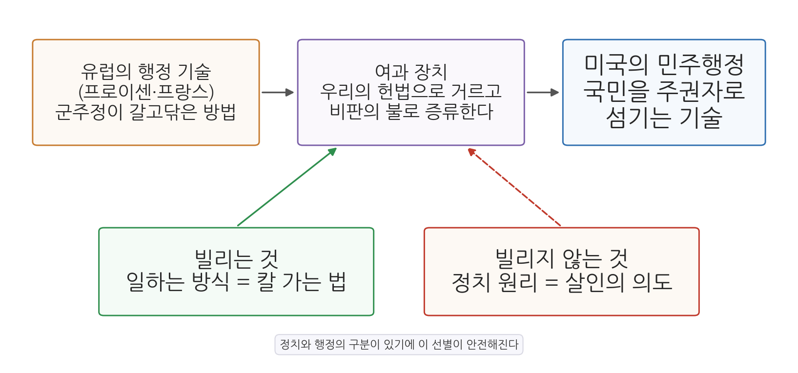
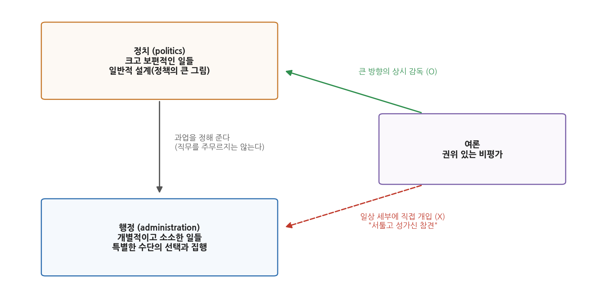

# 5주차 1차시. 행정학의 탄생 (3): 윌슨의 행정학 연구 II: 정치와 행정의 분리

> 행정의 문제는 정치의 문제가 아니다. 정치는 행정에 과업을 정해 주지만, 행정의 직무를 제멋대로 주무르도록 허용되어서는 안 된다.
> (우드로 윌슨, 「행정학 연구」)

## 이 장에서 배우는 것

4주차 2차시에서 우리는 우드로 윌슨(Woodrow Wilson)의 「행정학 연구」(1887) 전반부를 읽었다. 그때 윌슨은 세 가지 과제를 예고했다. 첫째, 행정 연구의 역사를 살필 것. 둘째, 그 연구의 대상이 무엇인지 밝힐 것. 셋째, 연구를 발전시킬 최선의 방법을 정할 것. 전반부는 첫째 과제, 곧 "왜 이제야 행정학이 필요해졌는가"에 대한 답이었다. 이번 차시에서 읽는 후반부는 남은 두 과제, 곧 연구의 대상(II절)과 방법(III절)을 다룬다.

후반부에는 윌슨의 고민 하나가 깔려 있다. 4주차에서 보았듯 그는 행정학이 유럽, 그중에서도 프로이센과 프랑스에서 발달한 "외국의 과학"이라고 진단했다. 그런데 프로이센의 행정은 절대군주가 갈고닦은 기술이다. 국민이 주권자인 미국이 군주의 하인들이 만든 기술을 배워도 되는가. 왕을 섬기던 도구를 들여오면 공화국의 피가 오염되지 않겠는가. 1880년대 미국의 애국적 독자라면 당연히 품었을 이 의심에 답하기 위해 윌슨이 꺼내 든 논리가 바로 이 장의 주제, 정치와 행정의 구분이다. 행정이 정치와 별개의 영역이라면, 군주정의 "정치"는 두고 "행정 기술"만 안전하게 빌려 올 수 있기 때문이다.

이 장에서는 다음을 배운다.

- 윌슨이 말하는 행정의 영역: 왜 행정은 "사업(business)"의 영역인가
- 정치와 행정을 가르는 기준: 일반적 설계와 특별한 수단
- 여론이 행정에서 맡아야 할 몫: "권위 있는 비평가"
- 유럽 행정 기술의 "미국화" 논리와 살인자의 칼 가는 법 비유
- 정치-행정 이원론이 남긴 유산과 그에 대한 현대의 논쟁

<strong>이 장의 로드맵</strong> 
이 장은 하나의 질문을 따라 전개된다. <em>"군주정이 갈고닦은 행정 기술을, 민주공화국이 어떻게 안심하고 배울 수 있는가?"</em>  
<strong>1.1</strong> 4주차와의 다리를 놓는다 (남은 두 질문) →
<strong>1.2</strong> 원전 강독 I: 행정은 정치의 고유 영역 밖에 있다 →
<strong>1.3</strong> 원전 강독 II: 여론은 권위 있는 비평가다 →
<strong>1.4</strong> 원전 강독 III: 칼 가는 법만 빌린다 (유럽 모델의 미국화) →
<strong>1.5</strong> 정치-행정 이원론의 논리를 한 장의 그림으로 정리한다 →
<strong>1.6</strong> 이원론의 유산과 현대의 재평가를 살핀다.

## 1.1 다시 만나는 윌슨: 남은 두 개의 질문

잠시 앞 장의 장면으로 돌아가 보자. 1887년의 미국은 가필드 대통령 암살(1881)의 충격 속에서 펜들턴법(1883)을 통과시켜 엽관제에 첫 제동을 건 직후였다(4주차 1차시). 서른 살의 젊은 정치학자 윌슨은 「행정학 연구」 전반부에서 이렇게 선언했다. 정부의 기능은 나날이 복잡해지는데 미국은 헌법 논쟁에만 매달려 왔다. "이제는 헌법을 만드는 것보다 그것을 운영하는 것이 더 어려워지고 있다." 그러므로 정부를 어떻게 잘 운영할지 연구하는 과학, 곧 행정학이 필요하다.

그런데 "행정학이 필요하다"는 선언만으로는 학문이 서지 않는다. 무엇을 연구하는 학문인지(대상), 어떻게 연구할지(방법)가 정해져야 한다. 후반부의 두 절이 바로 이 작업이다. 윌슨은 II절에서 행정 연구의 대상을 정치와 구별되는 집행의 영역으로 확정하고, III절에서 그 연구의 방법으로 비교연구, 곧 유럽 행정을 들여다보는 길을 제시한다. 그리고 두 절은 한 고리로 연결된다. 행정이 정치 밖의 영역이라는 II절의 구분이 있어야, 군주정 유럽을 연구해도 미국의 정치 원리가 오염되지 않는다는 III절의 안전장치가 성립하는 것이다.

## 1.2 원전 강독 I: 행정은 정치의 고유 영역 밖에 있다

### 행정의 영역은 사업의 영역이다

II절의 첫 대목에서 윌슨은 행정 연구의 대상을 한 문장으로 못 박는다.

<strong>원전 읽기 · 우드로 윌슨, 「행정학 연구」(1887)</strong> 
"행정의 영역은 사업(business)의 영역이다. 행정은 정치의 분주함과 다툼에서 떨어져 있으며, 대부분의 지점에서는 헌정 연구라는 논쟁 지대에서도 비켜서 있다. (중략) 행정 연구의 목적은 집행의 방법을 어지럽고 비용만 많이 드는 경험적 시행착오에서 건져 내어, 안정된 원칙 위에 깊이 뿌리내린 토대에 올려놓는 데 있다. 이런 까닭에 우리는 지금 단계의 공무원제도 개혁을 더 포괄적인 행정 개혁을 향한 서곡으로 보아야 한다. 지금 우리는 임용의 방식을 바로잡고 있다. (중략) 공무원제도 개혁은 이어질 개혁을 위한 도덕적 준비일 뿐이다."

무슨 말인가. 행정은 정당끼리 표를 다투고 이념을 겨루는 "정치의 분주함과 다툼"의 세계가 아니라, 회사가 일을 처리하듯 정해진 목표를 능률적으로 수행하는 사업의 세계에 속한다는 것이다. 그래서 행정 연구의 목표도 논쟁의 승패가 아니라, 주먹구구식 시행착오를 대신할 안정된 집행의 원칙을 찾는 데 있다.

왜 중요한가. 여기서 윌슨은 당시 진행 중이던 공무원제도 개혁(펜들턴법)의 위치를 다시 잡아 준다. 시험으로 공무원을 뽑는 개혁은 그 자체가 목적지가 아니라 서곡이다. 사람을 바르게 뽑는 것은 "도덕적 준비"일 뿐이고, 진짜 과제는 그 사람들이 일하는 조직과 방법을 개선하는 일이라는 것이다. 4주차 1차시에서 본 개혁 운동이 인사의 공정성에서 출발했다면, 윌슨은 그 시선을 조직과 운영 전체로 확장하고 있다.

### 정치는 과업을 주되, 직무를 주무르지 않는다

이어서 윌슨은 이 장 전체에서 가장 유명해진 문장을 쓴다.

<strong>원전 읽기 · 우드로 윌슨, 「행정학 연구」(1887)</strong> 
"무엇보다 중요한 사실은, 우리의 공무원제도 개혁가들이 그토록 자주, 그리고 다행히도 힘주어 말해 왔듯이, 행정이 정치의 고유한 영역 밖에 놓여 있다는 점이다. 행정의 문제는 정치의 문제가 아니다. 정치는 행정에 과업을 정해 주지만, 행정의 직무를 제멋대로 주무르도록 허용되어서는 안 된다. (중략) 블룬칠리는 행정을 정치로부터도, 법으로부터도 구별하라고 권한다. 그에 따르면 정치는 '크고 보편적인 일들'에서의 국가 활동이고, 행정은 '개별적이고 소소한 일들'에서의 국가 활동이다. 정책은 행정의 도움 없이는 아무 일도 하지 못한다. 그러나 그렇다고 행정이 정치가 되는 것은 아니다."

무슨 말인가. 정치와 행정은 하는 일의 종류가 다르다. 정치는 국가가 무엇을 할지 정하는 크고 보편적인 결정의 영역이고, 행정은 그 결정을 개별 사안에서 실행하는 영역이다. 정치가 행정에 과업을 "정해 주는" 것은 당연하다. 문제는 정치가 행정의 직무 하나하나를, 곧 누가 어느 자리에서 어떤 방식으로 일할지까지 "주무르는" 것이다. 윌슨이 인용하는 블룬칠리(Johann Caspar Bluntschli)는 당시 독일어권의 대표적 국가학자였다. 유럽 학계에서는 이 구별이 이미 상식이었다는 점을 보여 주기 위해 끌어온 것이다.

왜 중요한가. 이 구절이 겨냥하는 과녁은 엽관제다. 4주차 1차시에서 보았듯 엽관제 아래에서는 선거의 승리가 우체국장 자리까지 갈아치웠다. 정치가 행정의 직무를 통째로 주물렀던 것이다. "행정의 문제는 정치의 문제가 아니다"라는 선언은, 선거에서 어느 당이 이기든 우편은 배달되어야 하고 세금은 걷혀야 한다는 것, 그리고 그 일의 잘잘못은 정파적 잣대가 아니라 능률의 잣대로 평가되어야 한다는 요구였다.

<strong>정의 · 정치-행정 이원론</strong> 
<strong>정치-행정 이원론</strong>(politics-administration dichotomy)은 정치와 행정을 서로 다른 기능으로 구별하는 관점이다. 정치는 정책의 방향과 큰 원칙을 결정하는 기능이고, 행정은 그 결정을 전문적·능률적으로 집행하는 기능이다. 윌슨의 「행정학 연구」(1887)에서 그 고전적 표현이 나왔고, 다음 차시에 읽을 굿나우의 『정치와 행정』(1900)에서 체계적으로 이론화되었다. 행정학이 정치학에서 독립된 학문으로 서는 이론적 토대가 되었다.

### 행정가는 수동적 도구가 아니다: 설계와 수단, 권한과 책임

그런데 윌슨의 구분을 "정치는 생각하고 행정은 시키는 대로만 한다"로 읽으면 원전을 잘못 읽은 것이다. 윌슨 자신이 바로 그런 독해를 경계한다.

<strong>원전 읽기 · 우드로 윌슨, 「행정학 연구」(1887)</strong> 
"행정가는 자기 일을 이루기 위한 수단을 고를 때 그 나름의 의지를 가져야 하고, 실제로 갖고 있다. 행정가는 단순한 수동적 도구가 아니며, 그래서도 안 된다. 구분은 '일반적 설계'와 '특별한 수단' 사이에 있다. (중략) 나는 큰 권한과 제약 없는 재량이야말로 책임의 필수 조건이라고 확신한다. 권력이 위험해지는 것은 오직 그것이 책임지지 않을 때뿐이다. 권력이 쪼개져 여럿에게 흩어지면 권력은 가려지고, 가려진 권력은 책임을 지지 않는다. 반대로 권력이 조직의 수장과 각 부문의 수장에게 모이면, 그 권력은 쉽게 감시되고 책임을 물을 수 있다."

무슨 말인가. 정치와 행정의 경계선은 "의지가 있느냐 없느냐"가 아니라 "무엇에 대한 의지냐"에 있다. 정책의 큰 그림(일반적 설계)을 정하는 의지는 정치의 것이고, 그 그림을 실현할 구체적 방법(특별한 수단)을 고르는 의지는 행정의 것이다. 행정가는 설계 안에서 수단을 고르는 재량을 가진 판단의 주체다. 그리고 윌슨은 한 걸음 더 나아간다. 재량과 권한을 넉넉히 주는 것이 오히려 책임을 분명하게 만든다는 것이다. 권한이 잘게 쪼개져 있으면 일이 잘못되어도 누구 탓인지 가려지지 않지만, 권한이 책임자에게 집중되어 있으면 칭찬도 비난도 정확히 그 사람에게 향한다.

왜 중요한가. "권력이 위험해지는 것은 오직 그것이 책임지지 않을 때뿐이다"라는 문장은 미국 헌정 전통에 대한 도발이었다. 미국은 권력을 두려워하여 쪼개고 견제하는 데 온 힘을 쏟아 온 나라다. 윌슨은 그 전통이 행정에 적용되면 오히려 무책임을 낳는다고 지적한다. 오늘날 행정학이 다루는 책임성(accountability) 논의, 곧 권한과 책임을 어떻게 짝지어 설계할 것인가라는 문제의식이 여기서 이미 또렷하다.

## 1.3 원전 강독 II: 여론은 권위 있는 비평가다

행정을 정치에서 떼어 놓는다면 곤란한 질문이 하나 따라온다. 민주주의 국가에서 주권자는 국민이고, 국민의 뜻은 여론으로 나타난다. 행정이 정치 밖에 있다면, 여론은 행정에 대해 아무 말도 할 수 없다는 뜻인가. 윌슨은 이 질문을 정면으로 받는다.

<strong>원전 읽기 · 우드로 윌슨, 「행정학 연구」(1887)</strong> 
"이 연구 전체의 밑바탕에는 이런 물음이 놓여 있다. 여론은 행정의 수행에서 어떤 몫을 가져야 하는가? 올바른 답은, 여론이 권위 있는 비평가(authoritative critic)의 몫을 맡아야 한다는 것이다. (중략) 우리의 고질적 오류는 투표로 너무 많은 일을 하려 드는 오류다. 자치란 모든 일에 제 손을 얹는 것이 아니다. 살림을 잘한다는 것이 저녁밥을 반드시 제 손으로 지어야 한다는 뜻이 아닌 것과 같다. 요리사에게는 불과 오븐을 다룰 넉넉한 재량을 맡겨야 한다. (중략) 일상의 세부를 감독하고 일상의 수단을 고르는 데까지 직접 뻗치는 공적 비평은 서툴고 성가신 참견이다. 그러나 정치와 행정의 큰 방향을 상시로 감독하는 공적 비평은 전적으로 안전하고 유익하며, 없어서는 안 된다."

무슨 말인가. 여론의 자리는 주방이 아니라 식탁이다. 국민은 정부가 차려 낸 결과를 평가하고, 큰 방향을 감독하고, 잘못을 꾸짖는 비평가여야 한다. 그러나 요리사의 손놀림 하나하나, 곧 행정의 일상적 수단 선택에까지 여론이 개입하면 그것은 "서툴고 성가신 참견"이 된다. 자치(self-government)를 "모든 일을 국민이 직접 한다"로 오해하지 말라는 것이다.

왜 중요한가. 첫째, 이 구절은 이원론이 반민주적 발상이라는 오해를 미리 막아 준다. 윌슨은 여론을 배제하지 않는다. 오히려 여론의 감독을 "없어서는 안 된다"고 못 박는다. 다만 감독의 층위를 나눈다. 방향은 국민이, 수단은 전문가가 맡는 분업이다. 둘째, 윌슨은 이 대목에서 미국식 민주주의의 약점 하나를 짚는다. "투표로 너무 많은 일을 하려 드는 오류"다. 엽관제 시대의 미국은 판사, 보안관, 검시관까지 선거로 뽑았다. 모든 것을 투표에 부치는 관행이 오히려 행정의 전문성과 책임성을 갉아먹는다는 진단이다.

윌슨은 훈련된 전문 공무원단이 필요하다는 주장으로 이 논의를 잇는다. 보편적 정치교육은 정부의 "지적 비평가"를 늘릴 뿐 유능한 행정가를 만들지 못하므로, "기술적으로 교육된 공무원제"를 경쟁시험으로 세워야 한다는 것이다. 그러면 그런 전문 관료집단이 국민 위에 군림하는 관료주의로 굳어지지 않겠는가라는 우려에 대해, 윌슨은 자신이 강조하려는 원리를 다시 내세운다. "미국의 행정은 모든 지점에서 여론에 민감해야 한다." 훈련된 공무원단의 성실복무란 특정 정파가 아니라 여론에 책임지는 정치가들이 세운 정책에 대한 꾸준하고 성실한 충성이므로, 국민의 정치생활과 단절된 관료제와는 다르다는 답이다.

<strong>유의 · "분리"라는 말의 함정</strong> 
교과서들은 흔히 윌슨을 "정치와 행정의 분리"로 요약한다. 그러나 원전에서 확인했듯 윌슨의 행정가는 재량과 의지를 가진 판단 주체이고, 행정은 "모든 지점에서 여론에 민감해야" 한다. 윌슨이 끊어 내려 한 것은 정치와 행정의 모든 접촉이 아니라, 엽관제처럼 정파적 이해가 행정의 직무를 주무르는 간섭이다. 원전을 읽지 않고 "분리"라는 딱지만 외우면, 윌슨을 실제보다 훨씬 기계적인 사상가로 오해하게 된다.

## 1.4 원전 강독 III: 칼 가는 법만 빌린다 (유럽 모델의 미국화)

### 살인자의 칼 가는 법

III절에서 윌슨은 연구의 방법을 논한다. 미국은 자신을 자신과 비교해서는 스스로의 강점도 약점도 알 수 없으므로, 프랑스와 독일처럼 미국과 가장 다른 체제를 들여다보는 비교연구가 필요하다. 그러나 바로 그 지점에서 서두의 의심이 되살아난다. 군주정의 행정을 연구하다가 군주정의 사고방식까지 배어들면 어쩔 것인가. 윌슨의 답이 「행정학 연구」에서 가장 인상적인 비유로 남은 다음 구절이다.

<strong>원전 읽기 · 우드로 윌슨, 「행정학 연구」(1887)</strong> 
"살인의 뜻을 품은 자가 칼을 능숙하게 가는 모습을 본다고 하자. 나는 그 칼로 사람을 해치려는 의도는 빌리지 않으면서 칼 가는 법만 빌릴 수 있다. 마찬가지로 뼛속까지 군주주의자인 사람이 관청을 훌륭하게 꾸려 가는 모습을 본다면, 나는 내 공화주의 신념의 점 하나 바꾸지 않고 그의 일하는 방식만 배울 수 있다. 그는 왕을 섬기고, 나는 계속 국민을 섬길 것이다. 다만 나는 내 주권자를, 그가 자기 주권자를 섬기는 것만큼 잘 섬기고 싶을 뿐이다."

무슨 말인가. 기술과 의도는 분리해서 배울 수 있다. 칼 가는 솜씨는 살인자의 것이든 요리사의 것이든 같은 솜씨이고, 문서를 처리하고 세금을 걷고 조직을 꾸리는 행정 기술은 군주를 위해 쓰이든 국민을 위해 쓰이든 같은 기술이다. 누구를 섬기느냐(주권자가 누구인가)는 정치의 문제이고, 얼마나 잘 섬기느냐(방법이 얼마나 능률적인가)는 행정의 문제다. 앞의 II절에서 그어 놓은 정치와 행정의 구분이, 여기서 비교연구를 안전하게 만드는 보호막으로 쓰이고 있다.

왜 중요한가. 이 비유는 정치-행정 이원론이 왜 필요했는지를 가장 선명하게 보여 준다. 윌슨에게 이원론은 행정의 현실을 있는 그대로 묘사한 명제라기보다, 두 가지 실천적 목적을 위한 논리적 장치였다. 안으로는 엽관제의 정치 간섭에서 행정을 지키는 방패였고, 밖으로는 군주정 유럽의 행정 기술을 공화국이 배울 수 있게 하는 통행증이었다.

### 우리의 헌법으로 거르고, 비판의 불로 증류한다

그렇다고 윌슨이 유럽 제도의 수입을 무조건 허용한 것은 아니다. 빌려 온 기술은 반드시 미국의 원리로 소화되어야 한다.

<strong>원전 읽기 · 우드로 윌슨, 「행정학 연구」(1887)</strong> 
"우리가 이 과학을 쓰려면 겉만, 곧 언어만 미국화할 것이 아니라 사상과 원리와 목표에서 근본적으로 미국화해야 한다. 이 과학은 우리의 헌법을 통달해야 하고, 관료적 열병을 핏속에서 몰아내야 하며, 미국의 자유로운 공기를 듬뿍 들이마셔야 한다. (중략) 외국 제도를 그대로 옮겨 심으려는 시도를 나무라는 사람이야말로 눈먼 사람이다. 그런 이식은 애초에 불가능하다. (중략) 우리는 쌀을 빌려 왔지만 젓가락으로 먹지는 않는다. 정치 언어를 통째로 영국에서 빌려 왔지만, 그 가운데 왕과 귀족이라는 단어는 빼고 쓴다. 행정학이라는 과학도 우리의 헌법으로 걸러 내고, 비판이라는 약한 불에 올려 외국의 가스를 증류해 날려 버리기만 한다면, 안전하고도 유익하게 빌려 올 수 있다."

무슨 말인가. 제도의 통째 이식은 불가능하고, 걱정할 필요도 없다. 쌀이라는 재료를 들여오되 젓가락이라는 관습까지 따라 들여오지 않듯이, 유럽의 행정 기술을 들여오되 미국의 헌법과 습속이라는 여과기를 통과시키면 된다. "비판이라는 약한 불에 올려 외국의 가스를 증류"한다는 표현은, 유럽 제도에 배어 있는 집권적·관료제적 요소(외국의 가스)를 검토와 논쟁으로 날려 버리고 순수한 기술만 남긴다는 뜻이다.

그림 5-1은 이 차용의 논리를 정리한 것이다. 왼쪽에서 오른쪽으로 읽는다. 프로이센과 프랑스의 군주정이 갈고닦은 행정 기술은 그대로 미국에 이식되는 것이 아니라, 가운데의 여과 장치(헌법으로 거르고 비판으로 증류하는 과정)를 통과해 미국의 민주행정으로 다시 태어난다. 아래의 두 상자가 선별의 기준이다. 일하는 방식(칼 가는 법)은 빌리고, 정치 원리(살인의 의도)는 빌리지 않는다. 이 그림에서 알 수 있는 것은, 미국화 논리 전체가 정치와 행정의 구분 위에 서 있다는 점이다. 그 구분이 없다면 어느 것이 "기술"이고 어느 것이 "의도"인지 가려낼 기준 자체가 사라진다.

## 1.5 정치-행정 이원론의 논리 정리

이제 후반부 전체의 뼈대를 한 장의 그림으로 모아 보자.

그림 5-2를 읽는 법은 이렇다. 왼쪽 세로축이 정치와 행정의 관계다. 정치는 크고 보편적인 일들, 곧 정책의 일반적 설계를 맡고, 행정에 과업을 정해 준다(화살표). 그러나 행정의 직무를 주무르지는 않는다. 행정은 그 설계 안에서 특별한 수단을 골라 집행하며, 이때 행정가는 재량과 의지를 가진다. 오른쪽의 여론은 두 개의 화살표를 가진다. 큰 방향에 대한 상시 감독(실선, 권위 있는 비평가)은 안전하고 유익하며 불가결하다. 반면 일상 세부에 대한 직접 개입(점선)은 서툴고 성가신 참견으로 배제된다. 이 그림에서 알 수 있는 것은, 윌슨의 이원론이 단순한 두 칸 나누기가 아니라 과업 부여, 재량, 감독이라는 세 가지 관계의 설계라는 점이다.

이 설계에서 세 가지 명제를 추려 둘 수 있다.

첫째, 기능의 구별이다. 정치는 결정하고(무엇을 할 것인가), 행정은 집행한다(어떻게 할 것인가). 둘째, 간섭의 금지다. 정파적 정치가 행정의 인사와 직무를 주무르면 능률과 책임이 함께 무너진다. 엽관제가 그 증거였다. 셋째, 감독의 유지다. 행정은 정치 밖에 있지만 민주적 통제 밖에 있지 않다. 여론은 큰 방향의 권위 있는 비평가로 남는다.

<strong>왜 하필 "이원론"이 행정학의 출생증명서가 되었나?</strong> 
학문이 독립하려면 자기만의 연구 대상이 있어야 한다. 행정이 정치의 일부에 지나지 않는다면 행정 연구는 정치학의 한 귀퉁이로 충분하다. 그러나 행정이 정치와 구별되는 고유한 영역이라면, 그 영역을 다루는 독립된 과학이 성립한다. 정치-행정 이원론은 이렇게 행정학이 정치학에서 분가(分家)할 수 있는 이론적 근거였다. 행정학 교과서들이 1887년을 학문의 원년으로, 이 논문을 출생증명서로 부르는 이유다.

## 1.6 이원론의 유산과 논쟁: 현대의 재평가

### 이원론이 남긴 것

윌슨의 구분은 이후 반세기 동안 미국 행정학의 기본 틀이 되었다. 다음 차시에 읽을 프랭크 굿나우가 이를 정부의 두 기능 이론으로 정교화했고(5주차 2차시), 레너드 화이트의 최초 교과서(7주차 2차시)는 행정을 관리의 문제로 다루는 학문 체계를 세웠다. 실무에서도 이원론은 실적주의 인사제도, 전문 관료제, 그리고 정치인 시장 대신 전문 관리자에게 시정을 맡기는 시정관리관(city manager) 제도 같은 개혁의 논리적 뒷받침이 되었다. 행정을 정파 싸움에서 떼어 내 전문성과 능률의 영역으로 세운다는 발상은 진보주의 시대 개혁 운동의 공용어였다.

### 이원론에 대한 도전

그러나 행정국가가 커지면서 이원론은 현실 설명력에서 도전을 받는다. 1930년대 뉴딜 시기의 행정은 의회가 큰 틀만 정해 준 법률을 재량으로 채워 가며 사실상 정책을 만들고 있었다. 9주차 1차시에서 읽을 펜들턴 해링(Pendleton Herring)은 관료가 공익의 해석자로서 재량을 행사하는 현실을 정면으로 다루고, 뉴딜 행정의 한복판에서 일했던 폴 애플비(Paul Appleby)는 『정책과 행정』(1949)에서 행정이 곧 정책형성 과정의 일부라고 선언했다. 결정과 집행이 실제로는 뒤섞여 있다는 것이다. 집행 과정에서 내리는 무수한 선택이 사실상 정책을 다시 쓰고, 정책 결정은 집행 가능성의 계산 없이는 이루어지지 않는다. 이 흐름 속에서 이원론은 "현실과 동떨어진 교과서적 도식"이라는 비판을 받게 되었다.

### 다시 읽는 윌슨: 재평가

그런데 원전을 직접 읽은 우리는 이 비판을 한 겹 더 섬세하게 볼 수 있다. 비판이 무너뜨린 것은 "정치와 행정은 실제로 완전히 분리되어 있다"는 명제다. 그러나 이 장에서 확인했듯 윌슨 자신은 그런 명제를 주장한 적이 없다. 그의 행정가는 재량과 의지를 가지며, 행정은 모든 지점에서 여론에 민감해야 한다. 윌슨의 구분은 사실의 기술이라기보다 규범적 요구(정파적 간섭에서 행정을 지켜라)이자 방법론적 장치(유럽 기술을 안전하게 배워라)였다. 그래서 현대의 행정학은 이원론을 폐기된 학설로 치우기보다, "정치와 행정의 관계를 어떻게 설계할 것인가"라는 행정학의 영원한 질문을 처음 정식화한 출발점으로 다시 읽는다. 결정과 집행이 뒤섞이는 현대 거버넌스에서는 정치, 행정, 시민사회 사이의 명확한 경계보다 협력이 중요해졌지만, 그 협력을 설계할 때조차 우리는 "어디까지가 정치의 몫이고 어디부터가 행정의 몫인가"를 묻는다. 질문의 형식 자체가 윌슨의 유산이다.

### 한국 행정에서 만나는 윌슨의 질문

이 질문은 한국 헌법에도 새겨져 있다. 헌법 제7조는 "공무원은 국민전체에 대한 봉사자이며, 국민에 대하여 책임을 진다"(제1항), "공무원의 신분과 정치적 중립성은 법률이 정하는 바에 의하여 보장된다"(제2항)고 규정한다. 공무원이 정파가 아니라 국민 전체를 섬긴다는 제1항은 윌슨이 말한 "국민이라는 주권자를 섬기는" 행정이고, 신분보장과 정치적 중립을 규정한 제2항은 정치가 행정의 직무를 주무르지 못하게 하는 방벽이다. 정권이 바뀔 때마다 되풀이되는 논쟁들, 이를테면 어느 직위까지가 정무직(정치의 몫)이고 어디부터가 직업공무원(행정의 몫)인가, 대통령의 국정과제와 부처의 전문적 판단이 충돌할 때 공무원은 무엇에 충성해야 하는가 같은 물음은, 1887년 윌슨이 정식화한 질문이 오늘의 한국에서 반복되고 있음을 보여 준다.

## 요약

이 장에서는 「행정학 연구」의 후반부를 읽었다. 윌슨은 행정 연구의 대상을 정치와 구별되는 집행의 영역으로 확정한다. 행정의 영역은 사업의 영역이며, 정치는 행정에 과업을 정해 주되 그 직무를 주물러서는 안 된다. 그러나 이 구분은 행정가를 수동적 도구로 만드는 것이 아니다. 구분의 기준은 일반적 설계(정치)와 특별한 수단(행정)이며, 행정가는 수단 선택의 재량을 가지고, 큰 권한과 재량이 오히려 책임의 조건이 된다. 여론의 자리도 배제되지 않는다. 여론은 일상 세부의 참견꾼이 아니라 큰 방향을 상시 감독하는 권위 있는 비평가여야 한다. 이 구분 위에서 윌슨은 비교연구의 안전장치를 마련한다. 살인자에게서 칼 가는 법만 빌리듯, 군주정 유럽에서 정치 원리는 빌리지 않고 행정 기술만 빌리되, 그것을 미국의 헌법으로 거르고 비판으로 증류해 근본적으로 미국화한다는 것이다. 정치-행정 이원론은 이후 행정학 독립의 이론적 근거이자 실적주의 개혁의 논리가 되었고, 뉴딜 이후 결정과 집행이 뒤섞인 현실 앞에서 비판받았다. 그러나 원전의 윌슨은 완전한 분리를 주장한 적이 없으며, 현대 행정학은 이원론을 정치와 행정의 관계 설계라는 영원한 질문의 출발점으로 다시 읽는다.

## 토론·복습 문제

**5-1. (원전 구절 해석)** 다음 구절을 읽고 물음에 답하라. "살인의 뜻을 품은 자가 칼을 능숙하게 가는 모습을 본다고 하자. 나는 그 칼로 사람을 해치려는 의도는 빌리지 않으면서 칼 가는 법만 빌릴 수 있다." (1) 이 비유에서 "칼 가는 법"과 "살인의 의도"는 각각 무엇을 가리키는가. (2) 이 비유가 성립하려면 어떤 전제(이 장에서 배운 구분)가 필요한지 설명하라. (3) 기술과 의도가 그렇게 깨끗이 분리되지 않는 반례를 하나 생각해 보고, 그 반례가 윌슨의 논리에 어떤 도전이 되는지 토론해 보라.

**5-2. (기말 대비 서술형)** 윌슨의 정치-행정 이원론의 내용을 "기능의 구별, 간섭의 금지, 감독의 유지"라는 세 명제로 정리하여 설명하고, 뉴딜 이후 이원론이 받은 비판과 이에 대한 현대의 재평가를 논의하시오. 답안에는 원전의 구절을 최소 한 곳 인용할 것.

**5-3. (개념 적용)** 다음 각 사례가 윌슨의 틀에서 "정치의 정당한 과업 부여", "정치의 부당한 직무 간섭", "여론의 권위 있는 비평" 중 어디에 해당하는지 판정하고 이유를 밝혀라. (a) 국회가 법률로 새 복지급여의 대상과 예산을 정한다. (b) 집권당 인사가 산하기관의 실무직 채용에 특정 지지자를 앉히라고 요구한다. (c) 언론과 시민단체가 재난 대응 실패의 책임 소재를 따져 묻는다. (d) 주민들이 구청 민원처리 담당자의 업무 처리 순서를 하나하나 지정하라고 요구한다.

**5-4. (토론)** 윌슨은 "투표로 너무 많은 일을 하려 드는 오류"를 경계했다. 오늘날 한국에서 확대되고 있는 주민참여예산, 공론화위원회, 국민청원 같은 직접 참여 제도들은 이 경고에 비추어 어떻게 평가할 수 있는가. 여론이 "권위 있는 비평가"의 몫을 넘어 "간섭꾼"이 되는 경계선은 어디라고 생각하는지, 윌슨의 요리사 비유를 활용해 자신의 견해를 제시해 보라.
