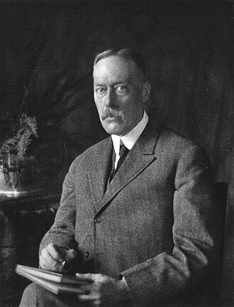
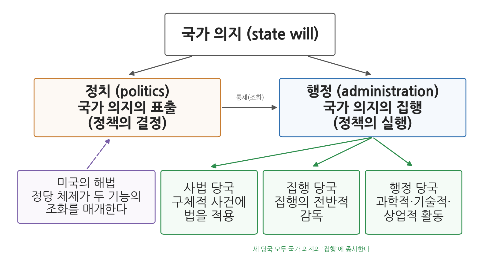
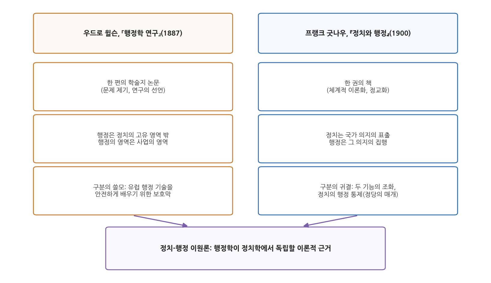

# 5주차 2차시. 행정학의 탄생 (4): 굿나우의 정치와 행정: 이원론의 정교화

> 정부에는 두 가지 구별되는 기능이 있다. 이 두 기능은 각각 정치와 행정이다. 정치는 국가 의지의 표출과 관련되고, 행정은 그 의지의 집행과 관련된다.
> (프랭크 굿나우, 『정치와 행정』)

## 이 장에서 배우는 것

앞 차시에서 우리는 윌슨의 「행정학 연구」 후반부를 읽으며 정치-행정 이원론의 원형을 만났다. 그런데 윌슨의 글은 한 편의 학술지 논문이었다. 행정이 정치 밖의 영역이라고 선언했지만, 그 경계선이 정확히 어디를 지나는지, 두 영역이 서로 어떤 관계를 맺어야 하는지는 체계적으로 따지지 않았다. 선언을 이론으로 바꾸는 일은 다른 사람의 몫으로 남았다.

그 일을 해낸 사람이 컬럼비아대학의 법학자 프랭크 굿나우(Frank Johnson Goodnow)다. 윌슨의 논문이 나오고 13년 뒤, 굿나우는 『정치와 행정(Politics and Administration)』(1900)이라는 책 한 권을 통째로 이 문제에 바쳤다. 그는 정치와 행정을 기관(누가 하는가)이 아니라 기능(무엇을 하는가)으로 다시 정의했다. 정치는 국가 의지를 표출하는 기능이고, 행정은 그 의지를 집행하는 기능이다. 그리고 윌슨보다 한 걸음 더 나아가, 두 기능이 분리로 끝나서는 안 되고 조화를 이루어야 하며, 그 조화를 위해 정치가 행정을 통제해야 한다고 논증했다. 이원론의 "정교화"란 바로 이 작업을 가리킨다.

이 장에서는 다음을 배운다.

- 굿나우는 누구이며, 행정학이 아직 독립 학회도 없던 시절 그가 차지한 자리
- 국가 의지의 표출(정치)과 집행(행정)이라는 두 기능의 구별
- 국가 의지의 집행에 종사하는 세 종류의 당국 (사법, 집행, 행정)
- 권력분립 원칙의 한계와 두 기능의 조화라는 문제
- 미국에서 그 조화를 떠맡은 뜻밖의 장치, 정당
- 기능 분리 이론의 한계와 현대적 재해석

<strong>이 장의 로드맵</strong> 
이 장은 하나의 질문을 따라 전개된다. <em>"정치와 행정을 구별한다면, 그 다음에는 둘을 어떻게 다시 이어야 하는가?"</em>  
<strong>2.1</strong> 굿나우와 초기 행정학의 풍경을 본다 →
<strong>2.2</strong> 원전 강독 I: 국가 의지의 표출과 집행 (두 기능의 구별) →
<strong>2.3</strong> 원전 강독 II: 권력분립의 한계와 두 기능의 조화 →
<strong>2.4</strong> 원전 강독 III: 미국의 해법, 정당 →
<strong>2.5</strong> 윌슨과 굿나우를 나란히 놓고 이원론의 정교화를 정리한다 →
<strong>2.6</strong> 한계와 현대적 재해석을 살핀다.

## 2.1 굿나우와 초기 행정학: 학회도 교과서도 없던 시절

<strong>인물 · 프랭크 굿나우(Frank J. Goodnow, 1859-1939)</strong> 
미국의 행정법학자. 미국정치학회 초대 회장(1903)과 존스홉킨스대학 총장(1914-29)을 지냈고, 1913-14년에는 중화민국 정부의 헌법 고문으로 초빙되기도 했다. 
대표 저술: 『비교행정법』(1893), 『정치와 행정』(1900) 
사진: 도리스 울먼 촬영 (퍼블릭 도메인)

### 미국 최초의 행정법 교수

프랭크 굿나우(1859-1939)는 뉴욕 브루클린에서 태어나 애머스트칼리지와 컬럼비아 로스쿨을 마치고, 유럽으로 건너가 파리정치학교와 베를린대학에서 공부했다. 앞 차시의 윌슨이 책으로만 유럽 행정학을 접했다면, 굿나우는 프랑스와 독일의 행정법학을 현지에서 배워 온 사람이다. 1884년부터 컬럼비아대학에서 가르치기 시작했고, 1891년 행정법 담당 정교수가 되었다. 미국 대학에 행정법(administrative law) 교수 자리가 생긴 것 자체가 이때가 처음이었다. 그는 『비교행정법』(1893)으로 미국 학계에 유럽식 행정법학을 이식했고, 『정치와 행정』(1900)으로 행정 연구의 이론적 기초를 놓았다. 후대의 행정학자들이 그를 "미국 행정학의 아버지"로 부르는 이유다.

굿나우가 활동한 시대의 풍경을 떠올려 보자. 행정학과도, 행정학 교과서도, 행정학회도 없었다. 미국 최초의 행정학 교과서(화이트, 7주차 2차시)는 1926년에야 나오고, 미국행정학회(American Society for Public Administration)는 1939년에야 창립된다. 행정 연구는 아직 정치학과 법학의 품 안에 있었다. 그 정치학조차 독립한 지 얼마 되지 않아서, 1903년 미국정치학회(American Political Science Association)가 창립될 때 초대 회장으로 추대된 사람이 바로 굿나우였다. 행정을 연구하는 사람이 정치학회의 첫 회장이 된 이 장면은, 당시 행정 연구가 정치학의 개척지 그 자체였음을 보여 준다. 굿나우는 이후 1914년 존스홉킨스대학 총장으로 자리를 옮겨 1929년까지 재직했다.

### 왜 법학자가 이원론을 정교화했는가

굿나우의 출발점이 행정"법"이었다는 사실은 우연이 아니다. 그는 유럽에서 배운 행정법학의 눈으로 미국을 보았고, 그때 보인 것이 낙차였다. 유럽 대륙은 행정을 다루는 정밀한 법리와 제도를 갖추었는데, 미국은 엽관제의 혼란 속에서 행정을 정당정치의 전리품으로 다루고 있었다(4주차 1차시). 이 낙차를 설명하고 처방하려면, 먼저 정부가 하는 일을 개념적으로 갈라 볼 도구가 필요했다. 윌슨이 개혁의 웅변가로서 구분을 선언했다면, 굿나우는 법학자의 엄밀함으로 그 구분을 정의하고, 분류하고, 논증했다. 이제 원전으로 들어가 그 작업을 직접 따라가 보자.

## 2.2 원전 강독 I: 국가 의지의 표출과 집행

### 정부의 두 기능

『정치와 행정』의 핵심 명제는 책의 첫 장에 나온다.

<strong>원전 읽기 · 프랭크 굿나우, 『정치와 행정』(1900)</strong> 
"정부에는 두 가지 구별되는 기능이 있다. (중략) 이 두 기능은 편의상 각각 정치(politics)와 행정(administration)이라 부를 수 있다. 정치는 정책, 곧 국가 의지의 표출과 관련되고, 행정은 그 정책의 집행과 관련된다. (중략) 모든 정부 체제에는 정부의 두 가지 근원적 기능, 곧 국가 의지의 표출과 그 의지의 집행이 있다. 그리고 모든 국가에는 저마다 이 두 기능 가운데 하나를 주로 수행하는 별도의 기관들이 있다."

무슨 말인가. 국가가 하는 모든 일은 결국 두 단계로 나뉜다. 먼저 국가가 무엇을 하겠다는 뜻을 정하고 밝히는 단계가 있고(의지의 표출), 그 뜻을 실제 행동으로 옮기는 단계가 있다(의지의 집행). 앞의 것이 정치이고 뒤의 것이 행정이다. 국회가 "일정 소득 이하 가구에 급여를 지급한다"는 법률을 만드는 것이 표출이라면, 행정기관이 대상자를 찾아 심사하고 지급하는 것이 집행이다.

왜 중요한가. 눈여겨볼 단어는 "기능"과 "주로"다. 굿나우는 정치와 행정을 기관의 이름이 아니라 기능의 이름으로 정의했다. 입법부가 정치를, 행정부가 행정을 전담한다고 말하지 않고, 각 기관이 두 기능 중 하나를 "주로" 수행할 뿐이라고 말한다. 실제로 그는 미국 입법부가 특별법을 통과시킬 때 행정의 기능을 수행하고, 미국 대통령이 거부권을 행사할 때 정치의 기능에 중대한 영향을 미친다고 지적한다. 기능의 구별은 명확하되, 그 기능을 기관에 배타적으로 배정하는 것은 불가능하다는 이 통찰이, 윌슨의 선언에는 없던 정교함이다.

<strong>정의 · 국가 의지의 표출과 집행</strong> 
<strong>국가 의지의 표출</strong>(expression of the will of the state)은 국가가 무엇을 할 것인지를 결정하여 정책과 법률의 형태로 밝히는 기능으로, 굿나우가 말하는 <strong>정치</strong>다. <strong>국가 의지의 집행</strong>(execution of the will of the state)은 그렇게 표출된 의지를 실제로 실행하는 기능으로, 굿나우가 말하는 <strong>행정</strong>이다. 이 구별은 기관(입법부·행정부)의 구별이 아니라 기능의 구별이다. 한 기관이 두 기능에 모두 관여할 수 있다.

굿나우는 자신이 쓰는 "정치"가 학자들의 고상한 용법이 아니라 보통 사람들의 일상 용법에 가깝다는 점도 굳이 밝혀 둔다. 그가 인용하는 『센추리 사전』의 정의에서 정치란 "여론에 영향을 미치고, 유권자를 끌어모으고 결집시키며, 공직의 후원을 얻고 나누어 주는 기술"까지 포함한다. 관념 속의 정치가 아니라 정당과 선거와 엽관이 굴러가는 현실의 정치를 놓고, 그것과 행정의 관계를 따지겠다는 예고다.

### 집행에 종사하는 세 종류의 당국

굿나우의 분류는 여기서 한 층 더 내려간다. 집행이라는 기능 안에도 서로 성격이 다른 일들이 섞여 있기 때문이다.

<strong>원전 읽기 · 프랭크 굿나우, 『정치와 행정』(1900)</strong> 
"어느 구체적인 정부든 그 조직을 분석해 보면, 국가 의지의 집행에 종사하는 세 종류의 당국이 있음을 발견한다. 첫째는 개인이나 공적 기관이 남의 권리를 침해하여 다툼이 생겼을 때 구체적 사건에 법을 적용하는 당국으로, 사법 당국(judicial authorities)이라 불린다. 둘째는 국가 의지의 집행을 전반적으로 감독하는 당국으로, 흔히 집행 당국(executive authorities)이라 불린다. 셋째는 정부의 과학적·기술적, 그리고 말하자면 상업적인 활동을 맡는 당국으로, 이런 활동이 두드러진 나라들에서는 행정 당국(administrative authorities)으로 알려져 있다."

무슨 말인가. 표출된 국가 의지를 실행하는 방식은 하나가 아니다. 법원이 개별 분쟁에 법을 적용하는 것도 집행이고(사법 당국), 대통령과 장관이 집행 전반을 지휘·감독하는 것도 집행이며(집행 당국), 세금을 걷고 우편을 나르고 통계를 내는 실무 조직의 활동도 집행이다(행정 당국). 굿나우는 정부가 복잡해질수록 이 세 당국이 점점 분화하며, 그중 사법 당국의 분화가 가장 빠르고 뚜렷해서 아예 별도의 "권력"으로 인정받게 되었다고 본다.

왜 중요한가. 이 분류는 우리가 일상에서 뭉뚱그리는 "행정부"를 해부한다. 대통령·장관처럼 정치와 맞닿아 국민 대표성과 연결되는 감독 기능(executive)과, 전문성과 능률을 기반으로 하는 실무 집행 기능(administrative)은 성격이 다르다. 오늘날의 용어로 옮기면 앞의 것은 정무직 리더십에, 뒤의 것은 직업관료제와 각종 전문 기관에 가깝다. 행정학이 연구 대상으로 삼는 좁은 의미의 행정이 바로 이 셋째 영역이다. 아울러 굿나우는 "행정(administration)"이라는 말이 기능을 가리키기도 하고 "행정부(the administration)"라는 기관을 가리키기도 해서 오해를 낳기 쉽다고 짚어 두는데, 이 용어 정리 역시 개념의 지도를 그리는 법학자다운 꼼꼼함이다.

그림 5-3이 지금까지의 구조를 한눈에 보여 준다. 맨 위의 국가 의지가 두 기능으로 갈라진다. 왼쪽의 정치는 국가 의지를 표출하고(정책의 결정), 오른쪽의 행정은 그 의지를 집행한다(정책의 실행). 행정 아래의 세 상자가 집행에 종사하는 세 당국, 곧 사법·집행·행정 당국이다. 가운데의 "통제(조화)" 화살표와 왼쪽 아래의 정당 상자는 다음 두 절에서 읽을 내용이다. 이 그림에서 알 수 있는 것은, 굿나우의 이원론이 단순한 좌우 대칭의 두 칸이 아니라, 기능의 구별 → 집행의 내부 분화 → 두 기능의 재연결(통제)로 이어지는 층위 있는 구조물이라는 점이다.

## 2.3 원전 강독 II: 권력분립의 한계와 두 기능의 조화

### 극단적 권력분립은 불가능하다

기능을 구별했으니 기관도 깨끗이 갈라놓으면 될 것 같다. 정치는 입법부에게, 행정은 행정부에게. 실제로 미국 헌법이 그렇게 설계되었다. 그러나 굿나우는 바로 이 지점에서 미국 헌정의 근본 원칙을 비판한다.

<strong>원전 읽기 · 프랭크 굿나우, 『정치와 행정』(1900)</strong> 
"정치의 기능은 국가 의지의 표출이다. 그러나 이 기능의 수행을 정부 안의 어느 한 당국에만 배타적으로 맡길 수는 없다. 또한 어느 당국도 그 기능만 수행하도록 묶어 둘 수 없다. 그러므로 권력분립의 원리는 그 극단적인 형태로는 어떤 구체적인 정치 조직의 기초가 될 수 없다. (중략) 법과 그 집행 사이에 조화가 없으면 정치적 마비가 온다. 행위의 준칙, 곧 표출된 국가 의지는 집행되지 않으면 사실상 아무것도 아니다. 그것은 헛된 위협(brutum fulmen)일 뿐이다."

무슨 말인가. 미국 헌법 제정자들은 권력분립이라는 정치이론을 경직된 법 원칙으로 만들어 놓았지만, 굿나우가 보기에 그 이론은 "불분명한 형태로는 매력적이었으나" 극단적으로 적용하는 순간 실현 불가능해진다. 두 기능은 애초에 기관별로 배타적으로 나눌 수 없기 때문이다. 더 나쁜 것은 분리가 성공하는 경우다. 표출과 집행이 정말로 따로 놀면, 법은 만들어지되 집행되지 않는다. 라틴어 브루툼 풀멘(brutum fulmen)은 소리만 요란하고 내리치지 않는 천둥, 곧 실행이 뒤따르지 않는 헛된 위협을 가리킨다. 집행되지 않는 법이 바로 그것이다.

왜 중요한가. 여기서 이원론의 무게중심이 이동한다. 윌슨에게 절실한 문제가 "어떻게 행정을 정치에서 떼어 낼 것인가"였다면, 굿나우에게 그에 못지않게 절실한 문제는 "떼어 낸 둘을 어떻게 다시 이을 것인가"였다. 구별은 분석의 출발이지 처방의 끝이 아니다. 정부가 굴러가려면 두 기능 사이에 조화(harmony)가 있어야 한다.

### 조화의 방법: 종속

그렇다면 조화는 어떻게 얻는가. 굿나우의 답은 냉정하다.

<strong>원전 읽기 · 프랭크 굿나우, 『정치와 행정』(1900)</strong> 
"국가 의지의 표출과 집행 사이에 조화가 이루어지려면, 의지를 표출하는 기관과 그것을 집행하는 기관 가운데 어느 한쪽의 독립성이 희생되어야 한다. 집행 당국이 표출 당국에 종속되거나, 표출 당국이 집행 당국의 통제 아래 놓여야 한다. 오직 이런 방식으로만 정부에 조화가 있을 것이다. (중략) 인민의 정부(popular government)는 집행 당국이 표출 당국에 종속될 것을 요구한다. 표출 당국이 그 본성상 집행 당국보다 훨씬 더 인민을 대표할 수 있기 때문이다."

무슨 말인가. 표출과 집행이 각자 완전히 독립적이면 조화는 우연에 맡겨진다. 조화가 필연이 되려면 한쪽이 다른 쪽을 따라야 한다. 논리적으로는 두 방향이 다 가능하다. 집행이 표출을 따르거나, 표출이 집행을 따르거나. 그러나 민주주의는 이 가운데 하나만 허용한다. 국민의 뜻을 대표하는 정도가 더 높은 쪽은 표출 당국(의회 등 정치 기관)이므로, 집행이 표출에 종속되어야 한다. 뒤집힌 경우, 곧 집행 당국이 국가 의지를 사실상 표출하는 경우는 관료가 주인 행세를 하는 정부다.

왜 중요한가. 이 대목이 굿나우 이원론의 요체다. 흔히 이원론을 "정치와 행정은 서로 간섭하지 말라"는 상호 불가침 선언으로 기억하지만, 굿나우의 결론은 반대로 정치의 행정 통제다. 정치는 행정에 대해 일정한 통제력을 가져야 하며, 그래야만 표출된 국가 의지가 집행이라는 몸을 얻고, 행정이 민주적 정당성 위에서 움직인다. 이원론은 행정의 치외법권 선언이 아니라, 민주주의 안에서 행정의 자리를 정하는 이론이었던 것이다.

<strong>왜 굿나우는 "분리"가 아니라 "조화"를 말했는가?</strong> 
윌슨의 적은 엽관제, 곧 정치의 과잉 간섭이었다. 그래서 그의 강조점은 "떼어 내기"에 있었다. 굿나우는 같은 엽관제를 보면서 한 가지를 더 보았다. 미국 헌법의 경직된 권력분립 때문에 정치가 행정을 통제할 정당한 공식 통로가 없고, 그 공백을 정당 머신의 사적이고 부패한 통제가 채우고 있다는 사실이다(다음 절). 통제 자체를 없앨 수는 없다. 문제는 통제의 존재가 아니라 통제의 방식이다. 그래서 굿나우의 처방은 "정치의 손을 자르라"가 아니라 "정당한 통제는 살리되, 행정의 세부에까지 뻗치는 부당한 간섭은 걷어 내라"가 된다. 앞 차시 윌슨의 "과업은 정해 주되 직무를 주무르지 말라"가 이론의 언어로 정교화된 셈이다.

## 2.4 원전 강독 III: 미국의 해법, 정당

두 기능의 조화가 필요하다는 일반 이론을 세운 굿나우는, 이제 미국이라는 구체적 사례로 눈을 돌린다. 공식 제도가 조화의 통로를 막아 놓으면 어떤 일이 벌어지는가.

<strong>원전 읽기 · 프랭크 굿나우, 『정치와 행정』(1900)</strong> 
"정치가 행정의 세부에까지 영향을 미치지 못하도록, 두 기능을 주로 맡는 기관들을 법으로 분리해 놓으려는 시도가 이루어지면, 꼭 필요한 통제는 법 바깥의 방식으로 자라나는 경향이 있다. 미국의 정치 체제가 바로 그런 경우다. (중략) 헌법이 행정 공무원들에게 부여한 독립적 지위 때문에, 정치가 행정을 통제하는 데 필요한 장치가 공식적인 정부 체계 안에서 발전할 수 없었다. 그리하여 그 통제는 정당 체제(party system) 안에서 발전했다. (중략) 이렇게 정당 체제는, 정부가 성공적으로 운영되려면 반드시 있어야 하는 정치와 행정 기능 사이의 조화를 확보한다."

무슨 말인가. 물길을 막으면 물은 딴 데로 샌다. 조화에 대한 요구는 정치체제의 필연인데, 미국 헌법은 권력분립으로 그 공식 통로를 막아 놓았다. 그러자 통제는 헌법 바깥의 조직, 곧 정당을 통해 자라났다. 미국의 정당은 의원 같은 정치직 선거만이 아니라 수많은 행정직·관리직의 선출과 임명에까지 관여하면서, 표출 기능과 집행 기능을 인적으로 묶어 사실상의 조화를 만들어 냈다는 것이다.

왜 중요한가. 이 분석은 엽관제에 대한 이해를 한 단계 끌어올린다. 4주차 1차시에서 엽관제는 극복해야 할 부패로 등장했다. 굿나우는 그 도덕적 평가 이전에 기능적 설명을 내놓는다. 엽관제와 정당 머신은 미국 헌법의 경직된 권력분립이 만들어 낸 공백을 메우는, 나름의 필연적 장치였다는 것이다. 필요한 기능(정치-행정의 조화)을 공식 제도가 감당하지 못하면 비공식 제도가 대신 떠맡는다. 이는 제도를 분석하는 일반적 통찰로서 오늘날에도 유효하다. 다만 정당을 통한 조화는 값비싼 대가를 치렀다. 정당이 행정의 세부 인사까지 장악하면서, 조화를 넘어 윌슨이 경계한 "직무 주무르기"가 일상이 된 것이다. 그래서 굿나우의 분석은 개혁의 방향을 시사한다. 정치의 통제를 큰 방향의 통제로 한정하고, 행정의 실무 영역은 정당의 손아귀에서 풀어 주는 것, 곧 실적주의와 행정의 전문화다.

<strong>유의 · 이원론은 현실의 묘사가 아니라 분석의 렌즈다</strong> 
굿나우 자신이 명시했듯, 두 기능을 서로 다른 기관에 배타적으로 배정하는 일은 "어떤 정치 체제에서도 드물게 일어나며, 특히 미국에서는 그렇지 않다". 입법부도 행정의 기능을 수행하고 행정부도 정치의 기능에 관여한다. 이원론을 "현실의 정부가 실제로 두 쪽으로 나뉘어 있다"는 사실 명제로 읽으면, 굿나우가 스스로 부정한 주장을 그에게 뒤집어씌우는 셈이 된다. 이원론은 뒤엉킨 현실을 분석하기 위한 기능의 렌즈이고, 동시에 "통제는 어디까지가 정당한가"를 판별하기 위한 규범의 잣대다.

## 2.5 기능 분리 이론의 정교화: 윌슨과 굿나우

이제 두 차시에 걸쳐 읽은 두 텍스트를 나란히 놓아 보자.

그림 5-4는 두 사람을 세 층위에서 비교한다. 글의 형식에서, 윌슨의 「행정학 연구」(1887)가 행정 연구의 필요성을 알린 한 편의 논문(선언)이라면, 굿나우의 『정치와 행정』(1900)은 그 구분을 정부 이론으로 세운 한 권의 책(체계화)이다. 구분의 방식에서, 윌슨이 행정을 "정치의 고유 영역 밖", "사업의 영역"이라는 공간의 은유로 갈랐다면, 굿나우는 국가 의지의 표출과 집행이라는 기능의 개념 쌍으로 갈랐다. 구분의 귀결에서, 윌슨의 구분이 유럽 행정 기술을 안전하게 배우기 위한 보호막으로 쓰였다면, 굿나우의 구분은 두 기능의 조화와 정치의 행정 통제라는 관계 이론으로 나아갔다. 이 그림에서 알 수 있는 것은, 두 텍스트가 경쟁 관계가 아니라 계승 관계라는 점이다. 아래의 상자가 보여 주듯 둘은 함께 정치-행정 이원론이라는 하나의 틀을 이루었고, 행정학이 정치학에서 독립할 이론적 근거가 되었다.

**표 5-1. 윌슨과 굿나우의 이원론 비교**

| 비교 항목 | 윌슨, 「행정학 연구」(1887) | 굿나우, 『정치와 행정』(1900) |
|------|------|------|
| 저자의 배경 | 정치학자 (역사·헌정 연구) | 법학자 (행정법, 유럽 유학) |
| 물음 | 왜, 무엇을, 어떻게 연구할 것인가 | 정부의 두 기능은 어떤 관계여야 하는가 |
| 구분의 언어 | 정치의 영역 밖, 사업의 영역 | 국가 의지의 표출 / 집행 |
| 구분의 단위 | 영역(sphere)의 은유 | 기능(function)의 개념 |
| 행정의 내부 | 행정가의 재량 (설계 안의 수단 선택) | 집행의 세 당국 (사법·집행·행정) |
| 정치-행정 관계 | 과업 부여는 하되 직무 간섭은 금지 | 조화 필요, 집행이 표출에 종속 (정치의 통제) |
| 민주적 통제 | 여론 = 권위 있는 비평가 | 인민 대표성이 높은 표출 당국이 우위 |
| 미국 진단 | 투표로 너무 많은 일을 하려는 오류 | 경직된 권력분립이 정당 지배를 낳음 |

표 5-1을 읽을 때 주의할 점이 있다. 두 사람의 차이는 결론의 대립이 아니라 강조점과 정교함의 차이다. 윌슨도 여론의 감독을 통해 행정을 민주주의에 묶어 두었고, 굿나우도 행정의 세부에 대한 정치의 간섭을 배격했다. 다만 굿나우에 이르러 이원론은 수사적 선언에서 검증 가능한 이론의 형태를 갖추었다. 기능을 정의하고, 집행을 분해하고, 조화의 조건을 명제로 만들고, 미국 사례로 논증하는 이 절차가 "정교화"의 실질이다.

## 2.6 한계와 현대적 재해석

### 이론의 한계

굿나우의 이론에도 한계는 뚜렷하다. 첫째, 표출과 집행의 경계는 이론만큼 깨끗하지 않다. 집행 과정의 무수한 선택, 이를테면 단속의 강도, 급여 심사의 엄격함, 예산 집행의 완급은 그 자체가 사실상 국가 의지를 다시 쓰는 일이다. 굿나우 자신이 집행 당국의 재량 문제를 인지했지만, 행정국가가 본격화하기 전의 이론은 행정입법과 위임입법이 정책결정의 중심 무대가 되는 20세기 중반 이후의 현실을 담기 어려웠다. 9주차에서 보게 될 뉴딜 시대의 행정은 표출과 집행의 경계선 위에서 움직였고, 펜들턴 해링(Pendleton Herring)은 관료를 공익의 해석자로 다시 정의하게 된다. 둘째, "표출 당국이 더 인민을 대표한다"는 전제도 도전을 받았다. 행정부 수반이 직선으로 뽑히는 대통령제에서는 집행 당국 역시 독자적 민주적 정당성을 주장하며, 그 결과는 종속이 아니라 두 표출 기관 사이의 경쟁이 되곤 한다. 셋째, 정치의 통제와 행정의 자율 사이 어디에 선을 그을지에 대해 이론은 일반 원칙 이상을 말해 주지 못한다. 그 선은 결국 각 나라가 제도와 관행으로 그려 나가야 했다.

### 현대적 재해석

그럼에도 굿나우의 질문 방식은 낡지 않았다. 현대 행정학이 그의 이론에서 살려 쓰는 것은 세 가지다.

첫째, 기능적 분석의 렌즈다. "이 기관은 무슨 부인가"가 아니라 "이 활동은 표출인가 집행인가"를 묻는 순간, 국회의 특별법 남발이나 행정부의 시행령 정치처럼 기관과 기능이 어긋나는 지점이 보인다. 둘째, 조화와 통제의 문제 설정이다. 오늘날 정치적 통제와 관료적 자율성의 균형이라는 행정학의 핵심 주제는 굿나우가 정식화한 문제의 연장선에 있다. 통제가 없으면 행정은 민주적 정당성을 잃고, 통제가 세부에까지 미치면 행정은 전문성과 능률을 잃는다. 셋째, 공식 제도와 비공식 제도의 상호작용이라는 통찰이다. 공식 구조가 필요한 기능을 막으면 비공식 장치가 그 기능을 대신 떠맡는다는 정당 분석은, 제도 개혁이 왜 자주 의도하지 않은 결과를 낳는지 설명하는 고전적 사례로 남아 있다.

한국의 제도에도 굿나우의 문제의식은 그대로 살아 있다. 정부가 바뀌면 대통령직인수위원회가 국정과제를 정하고(표출), 각 부처가 이를 집행 계획으로 옮긴다(집행). 장관·차관 등 정무직은 정치와 행정을 잇는 통제의 고리이고, 그 아래의 직업공무원은 신분이 보장된 전문 집행 조직이다. 어디까지를 정무직으로 하고 어디부터를 직업공무원으로 할 것인가, 청와대(대통령실)의 부처 인사 개입은 정당한 통제인가 부당한 간섭인가 같은 반복되는 논쟁은, 표출과 집행 사이에 조화의 선을 긋는 굿나우의 문제가 지금도 진행형임을 보여 준다.

<strong>왜 이원론 비판 이후에도 이원론을 배우는가?</strong> 
10주차의 허버트 사이먼(Herbert Simon)은 고전 행정학의 원리들을 "격언"에 불과하다고 공격하고, 11주차의 드와이트 왈도(Dwight Waldo)는 능률 중심 행정학의 정치철학적 전제를 해부한다. 그 비판의 표적 한가운데에 이원론이 있다. 그러나 표적이 되었다는 사실 자체가 이원론의 위상을 증명한다. 이후의 행정학은 이원론을 딛고, 이원론과 싸우며, 이원론을 수정하면서 전개되었다. 원전으로 이원론을 정확히 알아 두는 것은, 앞으로 읽을 모든 텍스트의 대결 상대를 알아 두는 일이다.

## 요약

이 장에서는 굿나우의 『정치와 행정』(1900)을 읽었다. 굿나우는 미국 최초의 행정법 교수이자 미국정치학회 초대 회장으로, 행정학이 독립 학회도 교과서도 갖기 전 시대에 유럽 행정법학의 훈련을 바탕으로 행정 연구의 이론적 기초를 놓았다. 그는 정부의 모든 활동을 두 기능, 곧 국가 의지의 표출(정치)과 집행(행정)으로 구별하고, 집행에 종사하는 당국을 사법·집행·행정의 셋으로 분해했다. 기능의 구별은 명확하지만 기능을 기관에 배타적으로 배정할 수는 없으므로, 극단적 권력분립은 어떤 정부의 기초도 될 수 없다. 표출과 집행 사이에 조화가 없으면 법은 집행되지 않는 헛된 위협이 되고 정부는 마비된다. 조화를 위해서는 한쪽의 종속이 필요하며, 인민의 정부에서는 더 대표성이 높은 표출 당국에 집행이 종속되어야 한다. 미국에서는 경직된 권력분립이 이 통제의 공식 통로를 막았기에 정당이 법 바깥에서 조화를 떠맡았고, 그 대가가 엽관제적 지배였다. 굿나우의 이원론은 윌슨의 선언을 기능 이론으로 정교화한 것으로, 상호 불가침이 아니라 정치의 정당한 행정 통제를 결론으로 삼는다. 표출과 집행의 경계가 실제로는 흐릿하다는 한계에도 불구하고, 기능적 분석, 통제와 자율의 균형, 공식-비공식 제도의 상호작용이라는 그의 문제 설정은 현대 행정학과 한국의 제도 논쟁 속에 살아 있다.

## 토론·복습 문제

**5-5. (원전 구절 해석)** 다음 구절을 읽고 물음에 답하라. "행위의 준칙, 곧 표출된 국가 의지는 집행되지 않으면 사실상 아무것도 아니다. 그것은 헛된 위협(brutum fulmen)일 뿐이다." (1) 이 구절이 굿나우의 논증에서 하는 역할은 무엇인가. 곧 어떤 주장을 뒷받침하기 위한 근거인가. (2) 법률은 통과되었으나 하위법령·예산·인력이 뒤따르지 않아 사실상 시행되지 못하는 현대 한국의 사례를 하나 찾아, 이 구절로 분석해 보라.

**5-6. (기말 대비 서술형)** 굿나우가 말하는 정부의 두 기능(국가 의지의 표출과 집행)의 내용을 설명하고, 그가 권력분립 원칙의 극단적 적용을 비판하면서 두 기능의 조화와 정치의 행정 통제를 주장한 논리를 서술하시오. 나아가 윌슨의 이원론과 비교하여 굿나우 이론의 정교화가 어떤 점에서 이루어졌는지 논의하시오.

**5-7. (개념 적용)** 굿나우의 세 당국(사법·집행·행정) 구분을 한국 정부에 적용해 보자. 다음 각각이 어느 당국의 활동에 가장 가까운지 판정하고 이유를 밝혀라. (a) 법원이 과징금 부과처분 취소소송에서 판결을 내린다. (b) 대통령이 국무회의에서 부처 업무보고를 받고 정책 집행 방향을 지시한다. (c) 국세청이 연말정산 환급금을 계산해 지급한다. (d) 통계청이 인구주택총조사를 실시한다.

**5-8. (토론)** 굿나우는 미국 정당이 정치와 행정의 조화를 확보하는 법 외적 장치였다고 분석했다. 오늘날 한국에서 정치와 행정의 조화(또는 통제)는 주로 어떤 통로로 이루어지는가. 공식 통로(국회의 입법·예산·국정감사, 대통령의 인사권)와 비공식 통로(정당, 언론, 여론)를 구분해 보고, 굿나우라면 현재 한국의 통제 방식 가운데 무엇을 "정당한 통제"로, 무엇을 "행정의 세부에 대한 간섭"으로 평가할지 논의해 보라.
