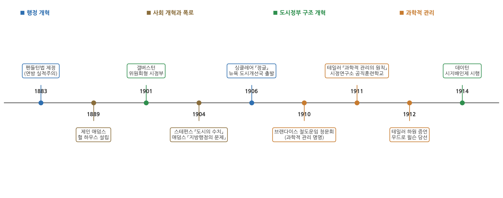
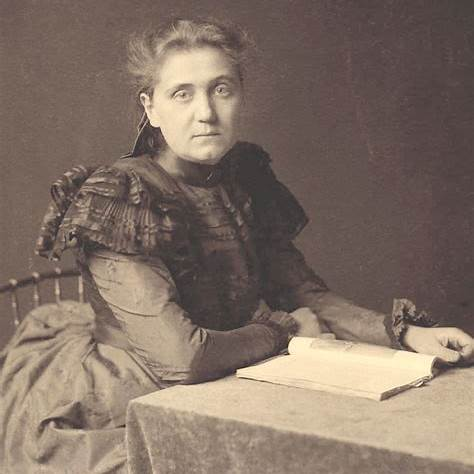
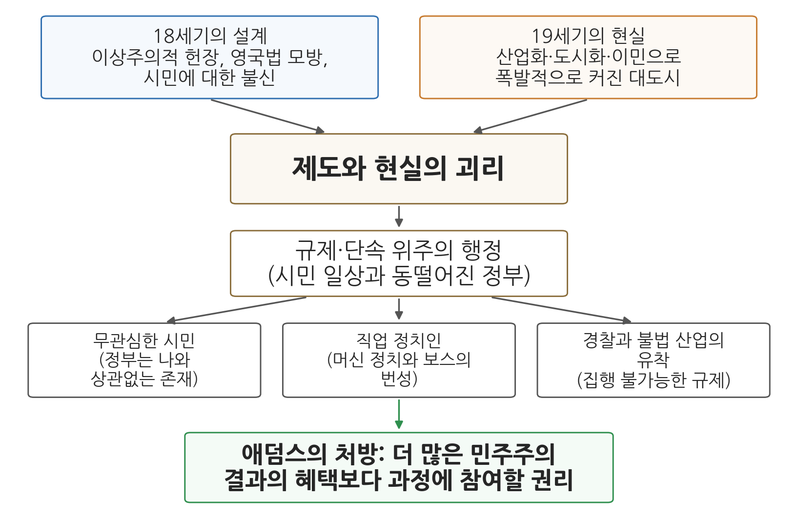

# 6주차 1차시. 도시문제와 과학적 관리론 (1): 도시행정의 문제

> 사실 시민들에게는 정책의 혜택보다 그 과정에 참여할 권리가 더 중요했습니다.
> (제인 애덤스, 「지방행정의 문제」, 1904)

## 이 장에서 배우는 것

1900년 무렵의 시카고를 상상해 보자. 반세기 전만 해도 호숫가의 작은 마을이던 이 도시에 이제 백만이 넘는 사람이 산다. 공장 굴뚝이 빽빽하게 들어서 있고, 부두와 도축장에는 폴란드어, 이탈리아어, 이디시어가 뒤섞여 들린다. 갓 대서양을 건너온 이민자 가족은 창문도 없는 공동주택 단칸방에서 살고, 골목에는 하수가 흐른다. 그런데 이 도시의 정부는 어떤가. 시의원은 자기 구역의 표를 관리하는 정당 조직의 "보스"가 사실상 임명하고, 경찰은 도박장에서 상납을 받고, 시청의 일자리는 선거를 도운 사람들에게 전리품처럼 돌아간다. 시민들이 낸 세금으로 움직이는 정부가 정작 시민의 삶과는 동떨어져 있다.

이러한 상황 한가운데에 이 장에서 다룰 인물이 있다. 시카고 빈민가에 정착해 이민자들과 함께 살았던 사회개혁가 제인 애덤스(Jane Addams)다. 애덤스는 도시 정부의 부패와 무능을 그저 나쁜 사람들 탓으로 돌리지 않았다. 그는 문제의 근본 원인이 제도의 설계 자체에 있다고 보았다. 100여 년 전 건국자들이 만든 정부의 틀이, 산업화와 이민으로 급격히 커진 19세기 말의 도시 현실과 맞지 않게 되었다는 것이다.

이번 주부터 2부, 곧 고전적 행정이론으로 들어간다. 4주차와 5주차에서 우리는 행정학이 엽관제 개혁의 흐름 속에서 등장하는 과정(펜들턴법), 그리고 윌슨과 굿나우가 정치와 행정을 구분하며 행정학의 자리를 마련하는 과정을 보았다. 이 장에서는 그렇게 태어난 행정학이 처음으로 맞닥뜨린 현장, 곧 미국 대도시의 문제를 본다. 구체적으로 다음을 배운다.

- 19세기 말에서 20세기 초 미국 도시가 겪은 산업화·도시화·이민의 충격
- 진보주의 개혁 운동이 무엇이었고 왜 일어났는지
- 애덤스의 「지방행정의 문제」가 진단한 도시행정 실패의 구조
- 머신 정치와 보스, 그리고 이에 맞선 도시정부 개혁운동(시정연구소와 행정조사운동)
- 애덤스의 통찰이 오늘날 한국 지방행정의 참여 제도, 복지 행정, 공직 윤리에 던지는 물음

<strong>이 장의 로드맵</strong> 
이 장은 하나의 질문을 따라 전개된다. <em>"급성장한 도시에서 정부는 왜 실패했고, 개혁가들은 어디에서 답을 찾았는가?"</em>  
<strong>1.1</strong> 산업화·도시화·이민의 시대와 진보주의 운동을 본다 (2부를 시작하며) →
<strong>1.2</strong> 애덤스의 「지방행정의 문제」에서 여섯 대목을 원전으로 읽는다 →
<strong>1.3</strong> 머신 정치에 맞선 도시정부 개혁운동을 본다 (구조 개혁, 시정연구소와 행정조사운동) →
<strong>1.4</strong> 오늘날의 지방행정과 도시 문제로 연결한다 (지방자치 개혁, 참여 제도, 복지 사각지대, 이해충돌 방지).

## 1.1 산업화·도시화·이민의 시대: 고전적 행정이론의 배경

### 2부를 시작하며: 도시문제에서 행정국가까지

2부(6-9주차)가 다루는 고전적 행정이론은 추상적 사고에서만 나온 이론이 아니다. 그것은 도시화와 산업화가 낳은 구체적인 문제들에 대한 응답이었다. 이 시기의 흐름을 미리 그려 보면 이렇다. 먼저 급성장한 도시에서 정부가 실패하고, 그 실패를 고치려는 개혁 운동 속에서 행정의 효율성과 운영의 합리성을 강조하는 과학적 관리론이 등장한다(6주차). 이어서 규칙, 위계, 전문성에 기반한 조직 원리인 관료제가 행정의 예측가능성과 책임성을 높이는 제도로 자리 잡고(7주차), 국가 기능이 확장되면서 행정국가가 제도화된다(9주차). 이 장은 그 첫 단계, 곧 도시의 위기에서 시작한다.

### 급격히 성장하는 도시

19세기 후반 미국 도시의 성장은 이전의 어떤 도시 성장과도 달랐다. 애덤스의 표현을 빌리면, 18세기의 도시가 하인살이, 가족 간의 정, 도제 관계처럼 인간적이고 점진적인 유대를 따라 시골 사람들을 끌어들였다면, 19세기의 도시는 산업과 상업의 집중이라는 순전히 비인격적인 이해관계가 수많은 사람을 갑자기 불러 모았다. 여기에 유럽 각지에서 온 이민자들이 물밀듯이 더해졌다. 이들은 고향의 오래된 사회적 관계와 전통을 끊고 낯선 대도시에 놓인 사람들이었다.

시카고의 인구 통계를 보면 그 속도를 실감할 수 있다. 시카고의 인구는 1850년 약 3만 명에서 1900년 약 170만 명으로 늘어, 반세기 만에 쉰 배 넘게 불어났다. 1890년 무렵에는 주민의 77.9퍼센트가 이민자이거나 이민자의 자녀였고, 새 이민의 다수는 폴란드, 이탈리아, 체코, 헝가리 같은 남유럽과 동유럽 출신이었다. 말과 종교와 생활 관습이 서로 다른 사람들이 한 도시에서 일자리와 집을 구해야 했던 것이다.

이 변화의 부담은 가난한 동네에 가장 무겁게 돌아갔다. 애덤스는 자서전에서 헐 하우스가 자리한 시카고 19구가 1902년 장티푸스 유행 때 시 전체 인구의 36분의 1이면서 시 전체 사망자의 6분의 1을 냈다고 기록했다. 상하수도, 쓰레기 수거, 주택 위생 같은 기본 서비스가 인구 증가를 따라가지 못하면 그 피해가 가장 가난한 주민의 생존 문제로 나타난다는 점을 이 기록은 보여 준다.

사람은 급증했는데 이들을 감당할 정부의 제도는 100여 년 전에 만들어진 그대로였다. 상하수도, 위생, 주택, 아동노동, 산업재해 같은 새로운 문제가 한꺼번에 늘어났지만, 도시의 헌장(charter, 도시 정부의 구성과 권한을 정한 기본 규범)은 이런 일을 정부가 할 일로 상정하지 않았다. 그 빈틈을 파고든 것이 다음 절에서 볼 머신 정치였고, 그 전체 상황을 고발한 말이 "미국 도시의 수치(the shame of the cities)"였다.

### 진보주의 운동: 좋은 정부는 가능하다

이 위기에 맞선 개혁의 흐름을 진보주의(progressivism) 운동이라 부른다. "진보"라는 말은 원래 인간의 조건은 무한히 개선될 수 있다는 종교적 관념에서 나왔는데, 19세기 말에 이르면 계층 사이의 상호 책임을 정부와 사회 제도를 통해 실현하려는 태도를 뜻하게 되었다.

진보주의는 크게 보아 사회진화론에 대한 반발이었다. 사회진화론은 다윈의 생물학적 진화 개념을 인간 사회와 경제정책에 적용한 사상으로, 정부 개입을 거부하고 가난한 사람은 스스로 살아남아야 한다는 입장이 그 한 갈래였다. 진보주의 운동은 이런 사고를 정면으로 부정했다. 빈곤과 부패는 자연의 법칙이 아니라 고칠 수 있는 제도의 문제라는 것이다. 이들은 과학적 지식과 전문성을 사회 개선에 적용할 수 있고 시민의 민주적 참여를 넓히면 통치 제도를 고칠 수 있다고 믿었으며, "좋은 정부는 가능하다", "민주주의의 문제를 치유하는 방법은 더 많은 민주주의다"라는 신념을 공유했다.

진보주의자들은 국가 차원에서 공무원제도 개혁, 직접 예비선거(direct primary), 국민발안(initiative), 국민투표(referendum), 소환제(recall)를 도입했고, 지방 차원에서는 위원회형 정부와 의회-시 관리자형(council-manager) 정부를 확산시켰다. 1912년에는 민주당의 우드로 윌슨이 대통령에 당선되었다. 우리가 4주차에서 만난 그 윌슨이다. 이러한 진보주의의 흐름이 신생 학문이던 행정학이 성장할 조건을 마련해 주었다.

개혁을 촉진한 또 하나의 세력은 "머크레이커(muckrakers)"라 불린 폭로 언론인들이었다. 링컨 스테펀스는 『도시의 수치(The Shame of the Cities)』(1904)에서 대도시의 부패를 고발했고, 업튼 싱클레어는 『정글(The Jungle)』(1906)에서 도축업의 불결한 실태를 폭로했다. 스테펀스가 문제 삼은 것은 부패 그 자체만이 아니라 부패에 익숙해진 시민의 태도였다. 필라델피아 편의 제목이 「부패했고 만족한다(Corrupt and Contented)」였다는 데서 이를 알 수 있다. 애덤스가 연설을 "미국 도시의 수치"라는 말로 시작한 것도 이 표현이 이미 널리 쓰이고 있었음을 보여 준다.

그림 6-1은 이 장과 다음 차시에 등장하는 사건들을 한 줄에 놓은 연표다. 색은 개혁의 갈래를 나타낸다. 파랑은 행정 개혁, 갈색은 사회 개혁과 폭로, 초록은 도시정부의 구조 개혁, 주황은 과학적 관리의 흐름이다. 읽는 법은 간단하다. 왼쪽 끝의 펜들턴법(1883, 4주차)에서 출발해 오른쪽으로 갈수록, 개혁의 초점이 "누가 공직에 앉는가"에서 "정부를 어떻게 운영하는가"로 옮겨 가는 것을 볼 수 있다. 1904년 애덤스의 연설과 스테펀스의 고발이 도시 문제를 공론장에 올렸고, 1906년 이후 시정연구소가, 1910년대에는 테일러의 과학적 관리가 그 답으로 떠올랐다. 이 장의 나머지와 다음 차시는 이 연표를 왼쪽에서 오른쪽으로 따라가며 살펴본다.

### 헐 하우스의 제인 애덤스

부패 통제가 공무원제 개혁과 도시 헌장 정비로 성과를 내는 동안, 빈민의 삶을 돌보는 개혁은 별도의 흐름으로 전개되었다. 영국에서 시작된 인보관 운동(settlement movement)이 그것이다. 상류층 개혁가들이 빈민 지역에 직접 들어가 살면서 주민들과 공동체 생활을 함께하는 방식인데, 미국에서는 제인 애덤스(1860-1935)가 1889년 시카고에 세운 헐 하우스(Hull House)가 대표적 모델이 되었다.

헐 하우스는 오늘날의 관점에서 보면 민간이 운영한 정책 실험 기관이었다. 이 지역 최초의 공원과 공공부엌을 만들고, 이민자를 위한 귀화 수업과 특수교육 수업을 열었으며, 소년법원과 직업 알선소 설립에도 기여했다. 애덤스는 이후 미국 사회사업을 이끄는 인물이 되었고 1931년 노벨평화상을 받았다.

헐 하우스의 활동은 자선에 그치지 않고 조사와 입법으로 이어졌다는 점에서 행정사적으로 의미가 크다. 헐 하우스 거주자 플로렌스 켈리(Florence Kelley)와 동료들은 주변 지역의 가구를 하나하나 조사해 국적별 거주 분포와 임금 수준을 지도로 그려 『헐 하우스 지도와 논문』(1895)으로 펴냈다. 빈민가의 실태를 감상이 아니라 자료로 보여 준 것이다. 켈리는 일리노이주가 1893년 제정한 공장법의 집행을 맡은 주 최초의 공장감독관이 되었고, 1899년 헐 하우스 맞은편에 문을 연 세계 최초의 소년법원인 쿡 카운티 소년법원의 구상도 헐 하우스 거주자 줄리아 래스롭(Julia Lathrop) 등의 생각에서 나왔다. 현장 조사가 문제를 드러내고, 그 자료가 입법을 이끌고, 새 법이 새로운 행정 기관을 만드는 이 경로는 뒤에서 볼 시정연구소의 방식과도 닮아 있다.

애덤스 자신도 직접 행정의 일선에 섰다. 1895년 그는 19구의 쓰레기 수거를 감독하는 위생감독관이 되었다. 정당 조직이 관리하던 공직이 실제로 주민의 위생을 돌보는 일로 바뀔 수 있다는 것을, 애덤스는 이론을 세우기 전에 실무 경험으로 먼저 확인한 셈이다. 우리가 이 장에서 읽을 텍스트는 그가 1904년에 발표하고 이듬해 학술지 American Journal of Sociology에 실린 연설 「지방행정의 문제(Problems of Municipal Administration)」다. 빈민가에서 15년을 산 사람이 도시 정부의 실패를 어떻게 진단했는지, 이제 원전으로 직접 읽어 보자.

## 1.2 원전 강독: 애덤스, 「지방행정의 문제」

<strong>인물 · 제인 애덤스(Jane Addams, 1860-1935)</strong> 
1860년 일리노이주 시더빌에서 제분업자이자 주 상원의원이던 아버지 아래 태어났다. 1881년 록퍼드 여자신학교를 마치고 여자의과대학에 진학했으나 건강 문제로 학업을 중단했다. 유럽 여행 중이던 1888년 런던의 인보관 토인비 홀을 보고 같은 시설을 미국에 세우기로 결심했고, 이듬해 엘런 게이츠 스타와 함께 시카고에 헐 하우스를 열었다. 1895년에는 19구의 위생감독관을 맡아 쓰레기 수거를 감독했고, 1905년 시카고 교육위원회 위원이 되었다. 1909년 전국자선교정회의 첫 여성 회장이 되었고, 1910년 예일대학이 여성에게 준 최초의 명예학위를 받았다. 제1차 세계대전기에는 반전 활동에 나서 1915년 여성평화당 회장과 1919년 국제여성평화자유연맹 초대 회장을 맡았다. 1931년 니컬러스 머리 버틀러와 함께 미국 여성으로는 처음으로 노벨평화상을 받았고, 1935년 시카고에서 세상을 떠났다. 
대표 저술: 『민주주의와 사회윤리(Democracy and Social Ethics)』(1902), 「지방행정의 문제」(1904 연설), 『새로운 평화의 이상(Newer Ideals of Peace)』(1907), 『헐 하우스에서의 20년(Twenty Years at Hull-House)』(1910) 
사진: 1890년대의 애덤스 (퍼블릭 도메인)

애덤스의 연설은 미국인들이 가장 존경하는 건국자 토머스 제퍼슨을 기리는 자리에서 시작한다. 그런데 그 존경의 대상을 향해 애덤스는 대담한 주장을 편다. 도시 정부 실패의 근본 원인이 바로 그 건국 세대의 설계에 있다는 것이다.

### 강독 1: 도시의 수치, 원인은 18세기의 이상에 있다

<strong>원전 읽기 · 제인 애덤스, 「지방행정의 문제」(1904)</strong> 
"오늘날 우리는 시 행정의 공공연한 실패, 이른바 '미국 도시의 수치'라 불리는 문제의 원인을 다른 곳에서 찾기 시작했습니다. 18세기의 이상이 시대에 맞지 않게 되었고, 그 이상이 만들어 낸 제도가 무너졌기 때문일 것입니다. 살아 숨 쉬며 성장하는 인간 사회를 다루면서 역사책에만 기대는 탁상공론에는 처음부터 한계가 있었던 것입니다. (…) 그들의 이상주의는 현실 경험을 두려워하는 이상주의였습니다. 그래서 미국 도시의 창건자들은 자치하는 시민이 겪을 수밖에 없는 어려움과 실수를 외면한 채, 시민이 오직 정의롭고 올바른 길만 걸으리라 믿어 의심치 않았습니다. (…) 그들은 소심하게도 영국법을 원형으로 삼았습니다. 영국법의 뿌리는 주권자와 신민, 곧 법을 만드는 자와 법의 통제를 받는 자 사이의 관계에 있으며, 민중의 자발적인 삶보다는 지배자의 특권과 재산권을 보호하는 데 치중해 왔습니다. 새로운 나라에는 왕도 귀족도 없었는데, 그들은 국왕의 압제에 맞선 귀족들의 투쟁이 새겨진 법과 관습을 태연하게 가져왔습니다."

무슨 말인가. 당시 사람들은 도시 정부의 부패를 나쁜 정치인, 무지한 이민자, 타락한 유권자 탓으로 돌리곤 했다. 애덤스는 원인의 방향을 뒤집어, 문제는 사람이 아니라 설계에 있다고 말한다. 논증은 세 단계로 이루어진다. 첫째, 건국 세대는 정부를 책에서 배운 원리로부터 연역해 냈다. 애덤스가 말하는 탁상공론은 경험으로 시험하지 않은 원리에서 제도를 곧바로 이끌어 내는 방식을 가리킨다. 둘째, 그렇게 만든 제도는 자치하는 시민이 겪을 시행착오를 처음부터 계산에 넣지 않았다. 시민이 오직 정의롭고 올바른 길만 걸으리라는 가정 위에서는 시민이 실수하면서 배울 여지가 설계에 들어올 수 없다. 셋째, 그래서 이 설계는 실제 도시가 겪는 문제를 담지 못하고 무너진다.

인용문의 둘째 대목은 그 설계가 어디서 왔는지를 설명한다. 건국 세대는 영국법을 원형으로 삼았는데, 영국법은 법을 만드는 지배자와 법의 통제를 받는 신민의 관계 위에서 지배자의 특권과 재산권을 지키는 방향으로 발달해 온 법이다. 왕도 귀족도 없는 나라가 왕을 견제하던 법을 가져왔으니, 그 법에는 시민을 자치의 주체로 믿는 정신이 아니라 시민을 통제 대상으로 의심하는 정신이 배어 있었다. 애덤스는 생략된 대목에서 이 불신이 이후의 개혁 방식에도 이어졌다고 덧붙인다. 낡은 정부가 새로운 사회적 요구를 감당하지 못할 때마다 미국인들은 민의를 더 불신하고 행정 관료에게 더 많은 권한을 주는 쪽으로 대응했고, 그 결과 정부는 시민을 억압하려고 만든 것은 아니었는데도 시민의 생생하고 조직된 의지를 담아내지 못하는 별개의 존재가 되었다는 것이다. 이 맥락에서 그가 지방자치의 핵심으로 꼽는 것이 "지역의 필요가 생길 때마다 그에 맞춰 지방 정부의 역할 범위를 스스로 결정할 권리"다. 건국 세대는 정부가 할 일과 해서는 안 될 일을 세심하게 구분하면서도 바로 이 권리를 놓쳤다는 것이 애덤스의 지적이다.

애덤스는 이 불신을 건국 세대의 인간관과 연결한다. 건국 세대는 대중을 제대로 알지도 못하면서 사랑한 인도주의자였고, 그 대중이 스스로의 길을 갈 권리는 인정하지 않은 채 자신들이 제시한 길을 순순히 따르기를 기대했다는 것이다. 부랑자에게 5센트를 쥐여 주는 친절한 부인에 빗댄 대목이 이를 가리킨다. 그 돈으로 술을 마실 수는 있어도 5센트로는 취할 수 없으리라 믿고 안심하는 마음, 곧 시민에게 권한을 주되 실수할 여지가 없을 만큼만 준다는 뜻이다. 이에 맞서 애덤스는 인간의 권리를 하늘이 내린 불가침의 것으로 보는 18세기의 관점 대신, 권리는 문명의 긴 과정을 거쳐 힘들게 쟁취한 것이고 인류는 서서히 진보한다는 "현대 진화론적 관점"을 내세운다.

이 대목에는 흔한 오독이 두 가지 있다. 하나는 애덤스가 건국 세대의 이상 자체를 부정했다는 읽기다. 그는 연설을 제퍼슨을 기리는 말로 시작하며, 비판하는 것은 이상이 시민에 대한 불신과 결합된 방식이다. 시민을 믿는다고 말하면서 시민의 시행착오를 허용하지 않는 제도는 자치의 경험을 쌓을 기회를 막는다. 다른 하나는 그의 진화론을 앞에서 본 사회진화론과 같은 것으로 읽는 오독이다. 사회진화론이 경쟁에서 진 사람은 도태되어도 어쩔 수 없다고 보았다면, 애덤스의 진화론은 시민이 경험을 통해 배우고 성장한다는 믿음이다. 그가 바라는 제도는 처음부터 완벽한 설계가 아니라 시민이 실수하면서 배울 수 있도록 열려 있는 설계다.

왜 중요한가. 이것은 행정 실패를 도덕의 문제("나쁜 사람들")가 아니라 제도의 문제("맞지 않는 설계")로 보는 관점의 전환이다. 도덕적 비난은 사람을 갈아치우는 데서 멈추지만, 제도 진단은 설계를 고치는 개혁으로 이어진다. 또한 제도는 수입될 때 그 제도가 형성된 역사적 맥락까지 함께 따라온다는 통찰은, 5주차에서 윌슨이 유럽의 행정 기술을 배우되 "미국화"해야 한다고 강조했던 문제의식과 만난다. 다른 시대, 다른 사회의 제도를 형식만 가져오면 새로운 사회의 현실과 어긋나기 때문이다. 이 관점의 전환은 이 시대 개혁 운동 전체, 나아가 행정학이라는 학문의 출발점에 놓여 있다.

### 강독 2: 단속하는 정부, 무관심한 시민, 그리고 보스

<strong>원전 읽기 · 제인 애덤스, 「지방행정의 문제」(1904)</strong> 
"그 결과 오늘날 미국의 시 행정은 각종 규제와 단속 위주의 행정으로 전락하고 말았습니다. 행정 관료를 가장 직접 마주치는 사람들은 단속이 필요한 범법자들, 절박한 도움이 필요한 가난하고 의존적인 사람들, 아니면 반대로 아무 열정도 불러일으키지 못하는 정부에 세금 내기를 아까워하며 이를 피하려는 사람들뿐입니다. 이런 기계적인 통치 방식과 민주주의의 자발적 충동이 어긋나면 본능적인 반발이 일어나고, 필연적으로 두 부류의 인간이 만들어집니다. 바로 '무관심한 시민'과 이른바 '직업 정치인'입니다. 앞의 사람은 자신이 범법자가 아니니 정부가 하는 일은 자신과 상관없다고 여기며 그저 간섭받지 않기만을 바랍니다. 뒤의 사람은 현실 모르는 탁상공론가들이 만든 규칙 따위는 가볍게 무시하고, 그 너머에 있는 대중의 진짜 욕망에 호소하며 상황에 쉽게 적응합니다. 그는 '민중의 친구'이자 그들의 '대변인'이 됩니다."

무슨 말인가. 이 대목은 제도와 현실의 괴리가 시민과 정부의 관계를 어떻게 바꾸는지를 단계별로 보여 준다. 첫째 단계에서 시민의 필요를 채우지 못하는 정부는 단속하고 규제하는 일만 하게 된다. 둘째 단계에서 평범한 시민이 정부를 만나는 경우는 범법자로서이거나 세금을 내는 사람으로서뿐이므로, 정부는 시민의 일상과 관계없는 존재가 된다. 셋째 단계에서 이 어긋남이 두 부류의 인간을 만든다. 정부가 자신과 무관하다고 여기며 간섭받지 않기만 바라는 무관심한 시민과, 규칙을 무시하고 대중의 욕망에 호소하는 직업 정치인이다. 직업 정치인이 곧 머신 정치의 보스다. 애덤스는 이 둘을 서로 별개의 문제가 아니라 같은 원인에서 나온 쌍으로 본다.

애덤스는 이어지는 대목에서 민중의 언어를 예리하게 포착한다. 평범한 사람들이 "그 사람들"이라 부르는 것은 통치는 하지만 자신들을 이해하지 못하는 높은 사람들이고, "그 사람"이라 부르는 것은 알아들을 수 없는 시청에서 자기 사정을 대변해 주는 시의원이라는 것이다. 공식 정부는 3인칭 복수의 남이고, 부패했다는 보스는 3인칭 단수의 내 편이다.

왜 중요한가. 머신 정치가 왜 그토록 오래 살아남았는지를 설명해 주기 때문이다. 흔한 오독은 보스가 유권자를 속이거나 매수해서 이겼다고 읽는 것이다. 애덤스는 반대로 읽는다. 보스는 정부가 외면한 필요(일자리, 급한 생계 지원, 관청 일 처리)를 실제로 채워 주었고, 부패는 수요가 있는 곳에 공급된 것이다. 애덤스가 보스는 대중의 마음을 이용하고 배신할 때가 많더라도 "적어도 대중의 마음이 존재한다는 사실은 알고 있다"고 쓴 것도 같은 맥락이다. 그렇다면 보스를 잡아넣는 것만으로는 문제가 풀리지 않고, 정부가 그 필요를 채우는 정부로 바뀌어야 한다. 이것이 애덤스 진단의 핵심 논리이며, 1.3에서 볼 구조 개혁과 시정연구소가 사람이 아니라 제도를 겨냥한 이유이기도 하다.

이 진단은 애덤스가 직접 겪은 패배에서 나온 것이기도 하다. 헐 하우스가 있던 19구의 시의원은 표를 사고 일자리를 나누어 주는 방식으로 구를 장악한 조니 파워스(Johnny Powers)였다. 1896년 선거에서 애덤스가 파워스의 상대 후보를 지지하자 파워스는 애덤스가 맡고 있던 위생감독관 자리를 없애 버렸고, 1898년 선거에서도 애덤스가 지원한 후보는 그를 꺾지 못했다. 보스가 이기는 이유를 유권자의 무지가 아니라 보스가 실제로 주민의 필요에 응답한다는 데서 찾는 강독 2의 논리는 이 선거 경험에서 다듬어진 것이다.

### 강독 3: 경찰과 범죄의 동맹

<strong>원전 읽기 · 제인 애덤스, 「지방행정의 문제」(1904)</strong> 
"군사 사회의 잔재인 억압적인 법률을 집행하는 일이, 민주주의 사회에서는 결국 정치적 '연줄'이나 '빽'으로 자리를 얻은 사람들의 손에 맡겨집니다. 법의 규제를 받아야 할 사람들과 같은 편이고 그들을 동정하는 사람들이 법을 집행해야 하는 것입니다. 이 모순은 거의 필연적으로 한 가지 결과를 낳습니다. 경찰 당국이 악과 범죄의 동맹으로 변질되는 것입니다. 미국 대도시 대부분에서 경찰과 도박을 비롯한 불법 산업의 관계를 보면 이를 쉽게 알 수 있습니다. (…) 결국 우리는 '악이 권력의 비호 아래 번성하는 비정상적인 상황'에 이르게 됩니다."

무슨 말인가. 여기서 애덤스는 부패의 메커니즘을 분석한다. 논증의 전제는 두 가지다. 하나는 건국 세대가 모방한 전통적 정부가 군 출신처럼 훈련된 관료를 통해 엄격한 법규를 집행했다는 것이고, 다른 하나는 민주주의 사회에서는 그 집행 책임자를 시민이 직접 뽑거나 선출된 사람이 임명한다는 것이다. 법규는 억압적 통치를 전제로 만들어졌는데 집행자는 친절함과 사교성으로 인기를 얻은 성품 좋은 사람이 되기 쉽다. 이렇게 법규의 성격과 집행자의 성격이 어긋나면, 법의 규제를 받아야 할 사람과 같은 편이고 그들을 동정하는 사람이 법을 집행하게 된다. 이 모순에서 경찰과 불법 산업의 동맹이 거의 필연적으로 나온다. 정치적 연줄로 자리를 얻은 집행자가 단속하는 자와 단속받는 자의 결탁에 끌려가는 것은 시간문제다. 부패는 개인의 일탈이 아니라 제도가 만들어 낸 균형 상태라는 것이다.

애덤스의 분석에서 특히 날카로운 부분은 그런 법이 어떻게 만들어지는가에 대한 관찰이다. 그는 경찰이 "도시의 양심적인 시민들이 강력하게 요구해서 통과된 조례"를 집행하는 것은 불가능하다는 말을 공공연히 듣는다고 썼다. 도덕적 열의를 가진 시민들은 엄격한 조례를 통과시키는 데서 만족하고, 경찰에게는 실제로 폭력과 절도 정도만 통제하라는 암묵적 기대가 주어진다. 그 결과 여론마저 위선을 띠게 되고, 법은 장부에 남아 있지만 집행되지 않는 상태가 된다. 애덤스는 최악의 경우 시 행정이 불법을 눈감아 주는 대가로 이익을 챙기는 일종의 공갈 행위까지 벌어진다고 경고한다. 문제를 만든 것은 부패한 경찰만이 아니라 집행 가능성을 따지지 않고 법을 만든 선량한 시민들이기도 하다는 지적이다.

흔한 오독은 이 대목을 경찰관 개인의 도덕성을 질타하는 글로 읽는 것이다. 애덤스가 문제 삼는 것은 지켜질 수 없는 규제를 만들고 그 집행을 연줄로 채운 자리에 맡기는 제도 전체이며, 규제를 요구한 선량한 시민도 그 일부다. 왜 중요한가. 이 분석은 4주차에서 본 엽관제 비판과 이어진다. 공직이 선거 승리의 전리품으로 배분되는 한 법 집행의 공정성은 구조적으로 불가능하다. 그래서 개혁가들은 두 방향으로 움직였다. 하나는 사람을 바꾸는 개혁, 곧 실적주의 임용이고, 다른 하나는 규범을 바꾸는 개혁, 곧 집행 가능한 규칙의 재설계다. 지켜질 수 없는 규제가 부패를 낳는다는 통찰은 오늘날 규제 개혁 논의에서도 그대로 유효하다.

애덤스의 경고는 그가 연설한 지 16년 뒤 미국 전체 규모로 다시 확인되었다. 1920년 1월 수정헌법 제18조가 발효되면서 미국 전역에서 술의 제조와 판매가 금지되었으나, 시카고 시민들은 직전인 1919년 술집을 닫는 지역 조례에 3대 1의 표차로 반대할 만큼 이 법에 동의하지 않았다. 수요가 그대로인 상품이 불법이 되자 밀주 사업은 조직범죄의 주요 수입원이 되었고, 알 카포네(Al Capone)의 조직은 경찰과 시 정치인을 매수해 단속을 피했다. 금주법은 1933년 수정헌법 제21조로 폐지되었다. 시민 다수의 생활과 동떨어진 엄격한 규제가 경찰과 범죄의 유착을 낳는다는 강독 3의 논리가 그대로 들어맞은 사례라 할 수 있다.

### 강독 4: 산업 문제를 외면하는 정부

애덤스의 진단은 시청과 경찰서 안에서 멈추지 않는다. 그는 도시 정부가 가장 외면하고 있는 영역으로 산업, 곧 기업과 노동의 문제를 지목한다.

<strong>원전 읽기 · 제인 애덤스, 「지방행정의 문제」(1904)</strong> 
"사실 정부는 타조가 모래에 머리를 박듯 산업 문제를 외면합니다. 그러나 정치적 의미를 띠지 않는 대규모 파업은 없으며, 정치적 개입이 시도되지 않는 파업도 없습니다. 거대 기업이나 유통 조합 가운데 시의원을 통째로 소유할 만큼 운이 좋지 않은 곳이라면, 시의회에 로비스트를 두지 않은 곳이 없습니다. 문제는 간단합니다. 산업과 정부의 관계를 바로잡고 통제할 수 있는 바로 그때 그것을 대중의 관심사로 공개 토론에 부칠 것입니까, 아니면 10년쯤 지난 뒤에야 잡지를 읽으며 기업이 어떻게 그토록 정치에 개입할 수 있었느냐고 놀랄 것입니까? 여기서 우리는 다시 한번, 자기 이론을 지키려고 현실을 외면하는 18세기의 탁상공론가와, 자기 이론이 흔들릴 수 있다는 이유로 현실을 외면하는 일을 경멸할 오늘날의 열린 과학자를 마주하게 됩니다."

무슨 말인가. 공식 헌장 위에서 도시 정부는 산업 문제를 자기 일이 아닌 것처럼 다루지만, 애덤스가 보기에 산업과 정부는 이미 깊이 얽혀 있다. 논증의 전제는 정치와 산업이 이미 분리될 수 없다는 관찰이다. 큰 파업에는 반드시 정치적 의미와 정치적 개입이 따르고, 큰 기업은 시의원을 사들이거나 적어도 시의회에 로비스트를 둔다. 관계가 없는 것이 아니라 보이지 않는 곳에 숨어 있을 뿐이다. 그렇다면 선택지는 산업에 개입할 것인가 말 것인가가 아니다. 이미 존재하는 관계를 지금 공개적으로 토론하고 통제할 것인가, 아니면 숨겨 두었다가 10년 뒤 잡지의 폭로 기사로 알게 될 것인가다. 마지막 문장의 대비는 강독 1의 비판을 이어받는다. 18세기의 탁상공론가는 자기 이론을 지키려고 현실을 외면하고, 열린 과학자는 이론이 흔들릴 수 있다는 이유로 현실을 외면하는 일을 경멸한다.

애덤스가 이 문제를 추상적으로 말한 것은 아니다. 1894년 시카고의 풀먼 철도차량 회사에서 일어난 파업이 그 배경에 있다. 1893년 공황 뒤 회사는 임금을 20-30퍼센트 깎으면서도 노동자들이 사는 회사 소유 마을의 집세와 상점 물건값은 내리지 않았고, 유진 뎁스(Eugene V. Debs)가 이끄는 미국철도노동조합의 운행 거부로 파업은 전국적 사태로 번졌다. 클리블랜드 대통령은 법원의 금지명령을 얻고 연방군을 투입했다. 애덤스는 그해 말 이 파업을 분석한 강연 「현대의 리어왕(A Modern Lear)」을 했는데, 이 강연은 회사 사장의 가부장적 태도를 비판하면서도 노사 양쪽의 행동을 함께 따졌다. 산업 갈등이 시정 전체를 흔드는 장면을 곁에서 지켜본 경험이 강독 4의 문장 뒤에 놓여 있다.

왜 중요한가. 첫째, 이 대목은 공개성을 행정 개혁의 원리로 제시한다. 이해관계가 정치에 영향을 미치는 것 자체를 막을 수는 없고, 막을 수 있는 것은 그 영향이 보이지 않는 곳에서 행사되는 것이다. 이 대목을 정부가 산업 규제를 늘려야 한다는 주장으로 읽는 것은 흔한 오독이다. 인용문의 요구는 개입의 방향을 정하기에 앞서 관계를 공개 토론에 부치라는 것이다. 오늘날의 로비 공개, 이해충돌 방지, 회의록 공개 같은 장치들이 겨냥하는 것도 같은 문제다. 둘째, 애덤스는 자신을 18세기의 탁상공론가와 대비되는 "열린 과학자"의 편에 세운다. 이론에 맞지 않는 현실을 외면하지 않고 그 현실에서 출발하겠다는 태도다. 이 점에서 애덤스는 뒤에서 볼 시정연구소의 사실 조사, 그리고 다음 차시 테일러의 측정과 같은 시대정신을 공유한다. 다만 애덤스가 마주하려는 현실에는 장부와 작업 공정만이 아니라 파업하는 노동자와 투표하는 시민이 포함된다는 점이 다르다.

### 강독 5: 경계선 너머의 평범한 시민

<strong>원전 읽기 · 제인 애덤스, 「지방행정의 문제」(1904)</strong> 
"현재 정부가 가장 빠르게 발전하고 있는 두 영역은 당연하게도 정부가 본연의 기능을 실제로 수행하는 두 곳, 곧 범죄자를 다루는 일과 가난하고 의존적인 사람들을 돌보는 일입니다. 우리는 곤경에 빠진 사람들을 위해 거대한 시립 병원과 구빈원을 짓습니다. 하지만 바로 그 경계선 너머에서 언제든 그 대열에 합류할 수 있는 수많은 대중을 위해서는 거의 아무것도 하지 않습니다. 결국 정부에게 외면당하는 것은 평범한 시민이며, 그들은 다른 조직을 통해 자신의 진짜 문제를 해결하면서도 선거일에 투표하지 않았다는 비난을 받습니다. 억누르려는 징벌적 관점이나 고통을 덜어 주려는 자선적 관점은 이해하기가 비교적 쉽습니다. 하지만 오늘날 우리의 평범한 삶에 맞는 시 정부를 만드는 일은 훨씬 더 어렵습니다."

무슨 말인가. 애덤스는 당시 도시 정부가 하는 일을 두 가지로 정리한다. 하나는 범죄자를 처벌하는 일이고, 다른 하나는 이미 쓰러진 빈민과 환자를 돌보는 일이다. 인용문에서 경계선은 쓰러진 사람과 아직 쓰러지지 않은 사람 사이의 선이다. 두 일 모두 문제가 터진 뒤에 대응하는 일이며, 대상은 사회의 예외적인 소수다. 경계선 너머에 있는 다수, 곧 실직이나 질병 한 번이면 구빈원에 들어갈 수 있는 노동자 가족을 위해서는 정부가 거의 아무것도 하지 않는다. 이들은 정부 대신 다른 조직, 예컨대 머신의 구역 조직, 같은 고향 출신끼리의 상조회, 노동조합에 기대어 생활 문제를 해결한다. 그러고 나서 선거 때가 되면 정치에 무관심하다는 비난을 듣는다.

이 대목은 강독 2의 "무관심한 시민"을 다른 각도에서 다시 설명한다. 강독 2에서는 단속 위주의 행정이 시민을 무관심하게 만든다고 했고, 강독 5는 그 무관심의 원인을 더 구체적으로 보여 준다. 평범한 시민의 생활 문제가 정부의 일로 다루어지지 않으니 시민도 정부를 자기 일로 여기지 않는 것이다. 무관심이 나쁜 정부를 만드는 것이 아니라, 평범한 시민을 외면하는 정부가 무관심을 만든다는 인과의 역전이다. 이 대목을 복지 지출을 늘리라는 요구로만 읽는 것은 오독이다. 애덤스가 지적하는 것은 지출의 크기가 아니라 정부가 상정하는 시민의 범위다. 징벌적 관점과 자선적 관점은 모두 문제가 생긴 사람을 대상으로 하는 데 비해, 평범한 삶에 맞는 정부는 아직 문제가 생기지 않은 다수의 일상을 대상으로 한다. 애덤스는 이어서 경제학자 마셜(Alfred Marshall)조차 개인의 창의성을 억누를까 두려워한 나머지 가난 때문에 일찍 노동에 내몰리는 아이들의 재능을 해마다 낭비하고 있다고 지적했다는 점을 상기시킨다. 예방하지 않은 비용은 결국 사회 전체가 치른다는 뜻이다.

왜 중요한가. 이 대목은 행정의 범위를 둘러싼 근본적인 물음, 곧 정부는 문제가 생긴 사람만 돕는가 아니면 문제가 생기지 않도록 다수의 일상적 필요를 돌보는가를 던진다. 헐 하우스가 공원과 공공부엌을 만들고 이민자를 위한 귀화 수업을 연 것은 바로 이 "경계선 너머"의 주민을 위한 일이었다. 애덤스가 말한 "평범한 삶에 맞는 시 정부"의 발상은 이후 공교육, 공중보건, 사회보험으로 정부의 기능이 넓어지는 흐름, 곧 9주차에서 볼 행정국가의 성장과 이어진다. 오늘날에도 복지 행정이 신청한 사람만 돕는 방식에서 위기에 놓인 사람을 먼저 찾아가는 방식으로 바뀌어야 한다는 논의가 되풀이되는데, 그 논리의 원형을 여기서 볼 수 있다. 한국의 구체적인 사례는 1.4에서 다시 살펴본다.

### 강독 6: 혜택보다 참여, 애덤스의 처방

<strong>원전 읽기 · 제인 애덤스, 「지방행정의 문제」(1904)</strong> 
"우리는 다양한 시 행정 서비스를 이룩해 왔습니다. 하지만 이는 임명된 위원회나 특별 권한을 받은 보건 위원회, 헌장의 한계를 넘어선 시장의 추진력 덕분에, 말하자면 은밀하게 달성된 것들입니다. 시민들은 이런 정책에 직접 투표한 적이 없고, 자유로운 토론을 통해 얻을 수 있었던 민주주의의 교육과 성장의 기회를 놓쳤습니다. 사실 시민들에게는 정책의 혜택보다 그 과정에 참여할 권리가 더 중요했습니다. (…) 시민의 힘을 억누르기보다 풀어주는, 낡은 유형의 정부와는 구별되는 진정한 민주 정부를 신뢰할 수 있다면, 우리는 비로소 민주주의가 무엇인지 알기 시작할 것입니다."

무슨 말인가. 애덤스 시대에도 좋은 행정 서비스가 없지는 않았다. 논증의 전제는 세 가지다. 첫째, 서비스는 실제로 이룩되었다. 둘째, 그 서비스는 임명된 위원회, 특별 권한을 받은 보건 위원회, 헌장의 한계를 넘어선 시장의 추진력으로 달성되었으므로 시민의 토론과 결정을 거치지 않고 유능한 소수의 손으로 "은밀하게" 이루어졌다. 셋째, 시민은 그 정책에 직접 투표한 적이 없으므로 자유로운 토론으로 얻을 수 있었던 민주주의의 교육과 성장의 기회를 놓쳤다. 애덤스에게 이것은 절반의 성공일 뿐이다. 시민이 과정에서 배제된 채 결과만 받는다면 민주주의를 배우고 익힐 기회를 통째로 잃기 때문이다. 이 대목을 효율적인 행정이 쓸모없다는 주장으로 읽는 것은 오독이다. 애덤스는 서비스의 성과를 부정하지 않고, 성과를 내는 방식이 시민을 배제한다고 지적한다. 그래서 그의 처방은 행정을 잘하는 소수를 세우는 것이 아니라 시민의 힘을 풀어 주는 정부, 곧 더 많은 민주주의다.

애덤스는 이 처방을 일련의 물음으로 구체화한다. 시민 스스로를 위한 개선의 창구는 어디에 있는가. 시민이 가장 절실한 필요를 자기 힘으로 바꾸어 나갈 넓은 기반이 마련되어 있는가. 가난한 사람들 사이의 따뜻한 마음과 상부상조의 정신을 국가의 자산으로 보존할 장치는 고안되었는가. 이 물음들은 시민을 서비스의 수혜자가 아니라 문제 해결의 주체로 보는 관점을 담고 있다. 애덤스는 생존 경쟁만 판치는 것처럼 보이는 도시 한복판에서도 소박한 사람들이 얼마 안 되는 생활비를 털어 서로 돕는다고 썼다. 그는 정부가 이 힘을 의심하고 억누를 것이 아니라 제도 안으로 끌어들여야 한다고 보았다.

연설의 마지막 부분에서 애덤스는 도시를 바라보는 시각도 바꾸자고 제안한다. 그는 컬럼비아 대학의 한 교수가 도시는 전통적으로 자유의 요람이었고 오늘날에는 급진주의의 중심지라고 말한 것을 인용하면서, 가장 혼잡한 곳에서 오히려 사회적 연대가 먼저 싹튼다고 말한다. 가장 활발한 정부 개혁 운동과 사회 복지 실험이 대도시에서 시작된 것은 우연이 아니라는 것이다. 도시는 부패와 빈곤의 장소이기만 한 것이 아니라 새로운 민주주의를 시험할 수 있는 장소이기도 하다. 연설 첫머리에서 "미국 도시의 수치"로 시작한 논의가 도시에 대한 기대로 끝나는 구성이다.

왜 중요한가. 이 대목은 이 장의 뒷부분에서 볼 또 다른 개혁 노선, 곧 전문가의 조사와 능률을 앞세운 시정연구소의 노선과 긴장을 이룬다. 행정을 좋게 만드는 길은 전문성인가 참여인가. 이 물음은 행정학 100년을 관통하며, 11주차의 왈도와 12주차의 신행정학에서 정면으로 다시 제기된다.

그림 6-2는 지금까지 읽은 대목들의 핵심 논지를 하나의 인과 구조로 정리한 것이다. 위에서 아래로 읽는다. 18세기의 설계(왼쪽 위)와 19세기의 현실(오른쪽 위)이 어긋나면서 제도와 현실의 괴리가 생기고, 그 괴리가 규제·단속 위주의 행정을 낳는다. 그 결과가 아래 세 상자, 곧 무관심한 시민, 머신 정치의 번성, 경찰과 불법 산업의 유착이다. 맨 아래 초록 상자가 애덤스의 처방이다. 이 그림에서 알 수 있는 것은 애덤스의 논증이 도덕적 비난이 아니라 원인과 결과의 연쇄로 이루어진 제도 진단이라는 점, 그리고 처방이 그 연쇄의 마지막 단계(부패 단속)가 아니라 첫 단계(제도와 현실의 괴리)를 겨냥한다는 점이다.

## 1.3 도시정부 개혁운동: 머신과 보스에서 시정연구소까지

### 머신 정치와 보스

애덤스가 "직업 정치인"이라 부른 존재를 당시 미국인들은 보스(boss)라 불렀고, 보스가 이끄는 정당 조직을 머신(machine), 곧 정치 기계라 불렀다. 머신은 그 이름처럼 조직적이고 정확하게 움직였다. 구역별 조직책이 이민자의 정착을 돕고, 일자리를 알선하고, 곤경에 빠진 가족에게 석탄과 빵을 보내고, 그 대가로 선거일에 표를 거두어들였다. 모인 표는 시청의 일자리와 이권 계약으로 바뀌어 조직을 다시 키웠다. 뉴욕의 태머니 홀(Tammany Hall)이 대표적인 머신이었고, 19세기 후반 이 조직을 이끌며 뉴욕시 재정을 조직적으로 빼돌린 보스 트위드(William M. Tweed)는 머신 정치의 악명을 상징하는 이름이 되었다.

트위드 일당의 수법은 머신이 시 재정을 어떻게 다루었는지 잘 보여 준다. 대표적인 예가 뉴욕 카운티 법원 청사 공사로, 처음 25만 달러로 잡혔던 공사비가 결국 약 1,300만 달러로 불어났다. 트위드 일당과 가까운 업체들이 청구서 금액을 부풀려 청구하고 그 차액이 일당에게 되돌아가는 방식이었다. 이 부패는 『뉴욕 타임스』와 시사만화가 토머스 내스트 등의 고발로 드러났고, 트위드는 1873년 유죄 판결을 받은 뒤 1878년 감옥에서 숨졌다.

트위드의 몰락이 머신 정치의 끝을 뜻하지는 않았다. 태머니 홀은 그 뒤에도 수십 년 동안 뉴욕 정치를 움직였고, 시카고의 조니 파워스처럼 구 단위의 보스들은 각 도시에서 계속 자리를 지켰다. 보스 한 사람을 처벌해도 그 자리를 만든 구조, 곧 강독 2와 5에서 본 정부가 비운 자리는 그대로 남았기 때문이다. 이 점이 개혁가들로 하여금 사람이 아니라 제도를 바꾸는 쪽으로 눈을 돌리게 했다.

주의할 점은 애덤스의 시각이 단순한 머신 규탄이 아니라는 것이다. 원전에서 보았듯 애덤스는 보스가 "적어도 대중의 마음이 존재한다는 사실은 알고 있다"고 썼다. 머신은 정부가 비운 자리를 채운 비공식 복지 기구였다. 따라서 머신을 없애려면 고발과 처벌만으로는 부족하고, 정부가 시민의 필요에 응답하는 구조를 만들어야 한다.

### 구조를 바꾸다: 위원회형 정부와 시지배인제

개혁가들이 첫 번째로 손댄 것은 도시 정부의 구조였다. 1900년 허리케인으로 도시가 무너진 텍사스주 갤버스턴은 1901년, 시장과 시의회 대신 소수의 위원이 입법과 집행을 함께 책임지는 위원회형(commission) 정부를 도입해 재건에 성공했고, 이 "갤버스턴 플랜"은 1910년대에 수백 개 도시로 확산되었다. 이어서 등장한 것이 의회-시 관리자형, 곧 시지배인제(council-manager plan)다. 선출된 시의회가 정책을 정하고, 행정 운영은 의회가 채용한 전문 경영인인 시지배인(city manager)에게 맡기는 방식이다. 1914년 오하이오주 데이턴이 이 제도를 시행한 첫 대도시가 되면서 전국적 모델로 자리 잡았다.

시지배인제의 발상을 뜯어보면 5주차에서 배운 정치-행정 이원론이 제도의 형태로 구현되어 있음을 알 수 있다. 정치(무엇을 할 것인가)는 선출된 의회가, 행정(어떻게 할 것인가)은 임용된 전문가가 맡는다. 윌슨과 굿나우의 이론이 강단의 주장에 그치지 않고 실제 도시 정부의 구성 원리가 된 것이다.

두 제도의 성격은 도입 과정에서도 드러난다. 갤버스턴의 첫 위원 다섯 명 가운데 셋은 주지사가 임명하고 둘만 시 전체 단위 선거로 뽑았다. 재건이라는 긴급한 과제 앞에서 개혁가들이 택한 것은 시민 참여의 확대보다 소수 책임자에게 권한을 모으는 방식이었다.

이 확산의 배경에는 전국 단위의 개혁 단체인 전국시정연맹(National Municipal League)이 있었다. 연맹은 1894년 필라델피아에서 결성되어 1900년 첫 「모범 도시 헌장(Model City Charter)」을 펴냈고, 1915년 개정판에서는 비정당 선거로 뽑힌 소규모 시의회가 전문 시지배인을 임명하는 의회-시지배인제를 표준 모델로 채택했다. 그 결과 1918년에서 1923년 사이에만 150개가 넘는 도시가 이 제도를 받아들였다.

<strong>유의 · 구조 개혁이 대표성을 줄이기도 했다</strong> 
위원회형 정부와 시지배인제는 흔히 머신을 무너뜨린 개혁으로 기억되지만, 그 수단에는 대가가 따랐다. 개혁가들은 머신의 기반인 구(ward) 단위 선거를 없애고 시 전체 단위 선거(at-large)와 정당 표시 없는 비정당 선거를 함께 도입하는 경우가 많았다. 그러자 특정 구에 모여 살던 이민자 집단은 자기 구에서 대표를 뽑을 근거를 잃었고, 시 전체 선거는 선거 비용이 많이 들어 재력 있는 후보에게 유리했다. 갤버스턴의 위원회형 정부도 시 전체 단위 선거를 택함으로써 흑인 유권자가 지역 선거에서 언제나 소수로 남게 만들었다는 비판을 받는다. 연구자들은 대체로 이러한 진보주의 개혁이 이민자의 지방선거 투표율을 낮추고 정치적 영향력을 토박이 중산층 쪽으로 옮겼다고 본다. 능률과 청렴을 높이려는 구조 개혁이 애덤스가 강조한 시민 참여와 충돌할 수 있다는 것을 보여 주는 사례다.

### 시정연구소와 행정조사운동

구조 개혁이 정부의 기본 틀을 바꾸는 일이었다면, 정부의 일하는 방식 자체를 과학적으로 뜯어보려는 흐름도 나타났다. 1906년 뉴욕에서 도시개선국(Bureau of City Betterment)으로 출발해 이듬해 정식 발족한 뉴욕시정연구소(New York Bureau of Municipal Research)가 그 중심이었다. 시정연구소는 시 정부의 예산, 회계, 인사, 사업 집행을 실지 조사로 확인하고 사실과 수치를 제시하는 방식으로 개혁을 압박했다. 분노나 웅변이 아니라 장부와 통계가 개혁의 근거였다. 1911년에는 공직훈련학교(Training School for Public Service)를 세워 행정 실무자를 체계적으로 길러 내기 시작했고, 이런 조사 기관이 미국 각 도시로 퍼져 나간 흐름을 행정조사운동(bureau movement)이라 부른다.

뉴욕시정연구소의 출발은 하나의 부패 사건과 맞물려 있다. 연구소를 세운 윌리엄 앨런, 헨리 브뤼에르, 프레더릭 클리블랜드(Frederick A. Cleveland) 세 사람은 이름 첫 글자를 따 "ABC"로 불렸다. 이들의 전신인 도시개선국은 1906년 태머니 홀의 지원을 받던 맨해튼 구청장 존 어헌(John F. Ahearn)의 행정을 조사해 보고서를 냈고, 보고서는 경쟁 입찰 없이 측근 업체에 몰아준 계약과 부풀린 급여 명부 등을 구체적으로 밝혔다. 이를 계기로 1907년 뉴욕 주지사가 어헌을 해임했다. 분노한 연설이 아니라 사실을 정리한 보고서가 공직자를 물러나게 한 이 사건은 조사 기관의 쓸모를 세상에 증명했다.

연구소가 특히 힘을 쏟은 분야는 예산이었다. 1907년 연구소는 뉴욕시 보건국의 예산을 기능별 계정과 사업 통계로 나누어 정리한 『시 예산 만들기(Making a Municipal Budget)』를 펴냈다. 돈이 어떤 일에 얼마나 쓰이는지를 시민과 의회가 읽고 따질 수 있게 하려는 시도였다. 이 경험은 곧 연방 정부로 옮겨 갔다. 1910년 태프트 대통령이 만든 경제·능률위원회의 위원장을 클리블랜드가 맡았고, 위원회가 제안한 연방 정부 최초의 통합 예산은 1921년 예산회계법(Budget and Accounting Act) 제정으로 연방 예산제도의 결실을 맺었다.

시정연구소는 사람을 길러 낸 곳이기도 하다. 1916년 공직훈련학교에 학생으로 들어온 사람 가운데 루서 귤릭(Luther Gulick)이 있었고, 그는 1920년부터 1962년까지 행정연구소를 이끌었다. 9주차에서 POSDCORB와 브라운로 위원회로 다시 만날 그 귤릭이다. 도시 개혁 현장에서 시작된 조사 기관이 다음 세대 행정학의 중심인물을 길러 냈다는 사실은, 행정조사운동이 행정학의 형성에서 차지하는 위치를 잘 보여 준다.

## 1.4 현대 행정에의 함의: 지방행정과 도시 문제

애덤스의 연설은 120년 전 미국 도시 이야기지만, 그 진단의 틀은 오늘날 한국의 지방행정에 대어 보아도 상당 부분 들어맞는다. 아래에서는 애덤스의 논점 네 가지를 차례로 짚고, 각 논점을 한국과 외국의 구체적인 사례에 비추어 본다.

### 제도와 현실의 간극: 지방자치의 형식과 실질

첫째, 제도와 현실의 간극이라는 문제다. 애덤스는 형식적으로는 훌륭한 헌장이 현실의 필요를 담지 못할 때 정부가 시민에게서 멀어진다고 보았다. 한국의 지방자치도 1991년 지방의회 부활 이후 30년 넘게 제도의 틀을 갖추어 왔지만, 제도가 있다는 것과 제도가 주민의 삶에 응답한다는 것은 다른 문제다. 조례와 위원회가 갖추어져 있어도 주민이 "그 사람들"의 일로 느낀다면, 애덤스가 본 무관심한 시민은 오늘의 낮은 지방선거 관심으로 다시 나타난다.

지방선거 투표율의 흐름은 주민의 관심이 고정된 것이 아니라 크게 오르내린다는 점을 보여 준다. 단체장까지 주민이 직접 뽑은 1995년 제1회 전국동시지방선거의 투표율은 68.4퍼센트였다. 그러나 1998년 제2회에는 52.4퍼센트, 2002년 제3회에는 48.9퍼센트로 떨어졌고, 2022년 제8회에도 50.9퍼센트에 머물렀다. 2026년 제9회 지방선거에서는 투표율이 61.0퍼센트로 올라 1995년 이후 가장 높은 수준을 기록했다. 투표율이 오르내리는 이유는 여러 가지이므로 이 숫자만으로 단정할 수는 없다. 다만 유권자의 절반 가까이가 지방정부를 뽑는 일에 참여하지 않은 선거가 여러 차례 있었다는 사실은, 지방정부가 주민에게 자기 생활과 직결된 정부로 여겨지고 있는가라는 애덤스식 물음을 던지게 한다.

제도를 현실에 맞추려는 시도도 이어졌다. 2020년 12월 국회를 통과해 2022년 1월 13일 시행된 지방자치법 전부개정은 1988년 이후 32년 만의 전면 개정이었다. 개정법은 지방의회의 인사권을 집행기관에서 독립시키고 의회에 정책지원 전문인력을 두게 했으며, 대도시에 특례시라는 지위를 부여할 근거를 마련했다. 같은 날 시행된 주민조례발안법은 주민이 지방자치단체장을 거치지 않고 지방의회에 직접 조례의 제정과 개정을 청구할 수 있게 했다. 지역의 필요에 맞추어 지방정부의 역할을 스스로 정할 권리가 지방자치의 핵심이라는 애덤스의 지적, 그리고 그 권리를 주민이 직접 행사해야 한다는 그의 처방과 같은 방향의 개혁이라 할 수 있다. 물론 법이 바뀌었다고 주민의 참여가 저절로 늘어나는 것은 아니다. 제도를 만드는 것과 그 제도가 실제로 쓰이게 하는 것 사이의 간극이야말로 애덤스가 경고한 문제이기 때문이다.

### 과정 참여의 가치: 주민참여예산과 공론화

둘째, 과정 참여의 가치다. "혜택보다 과정에 참여할 권리가 더 중요했다"는 애덤스의 문장은 오늘날 참여 제도의 이론적 원형이라 할 만하다. 주민이 예산 편성 과정에 직접 의견을 내는 주민참여예산제도, 시민들이 숙의를 거쳐 정책 권고를 내놓는 공론화(2017년 신고리 5·6호기 공론화가 대표적 사례다) 같은 장치들은, 결정의 질만이 아니라 결정 과정 자체의 민주적 가치를 겨냥한다는 점에서 애덤스의 처방과 같은 계보에 있다. 물론 참여 제도가 형식적 의견 수렴에 그친다면, 그것이야말로 애덤스가 비판한 "은밀하게 달성된" 행정의 현대판이 될 것이다.

주민참여예산제도의 출발점은 브라질의 포르투알레그리다. 1989년 이 도시에서 새로 집권한 노동자당 시 정부는 예산 일부의 쓰임새를 주민이 직접 정하도록 결정 방식을 바꾸었다. 급격한 도시 성장으로 기본 서비스조차 제공하지 못하던 도시가 그 대응으로 참여를 택했다는 점에서, 1900년 무렵의 시카고를 본 애덤스의 문제의식과 겹친다. 한국에서는 2004년 광주광역시 북구가 전국 최초로 주민참여예산 조례를 만들었고, 2005년 지방재정법 개정으로 운영 근거가 마련되었으며, 2011년 3월 지방재정법이 다시 개정되면서 모든 지방자치단체가 이 제도를 운영하도록 의무화되었다. 7년 사이에 한 기초자치단체의 실험이 전국의 제도가 된 것이다. 애덤스가 도시를 개혁의 실험장으로 본 시각이 제도의 확산 경로로 확인된 사례라 할 수 있다.

신고리 5·6호기 공론화는 국가 차원의 숙의 사례다. 2017년 7월 24일 출범한 공론화위원회는 89일 동안 전국 단위 여론조사와 세 차례의 숙의 조사를 진행했고, 전국에서 뽑힌 시민참여단 471명이 학습과 토론을 거쳐 최종 판단을 내렸다. 2017년 10월 20일 발표된 결과에서 건설 재개가 59.5퍼센트, 건설 중단이 40.5퍼센트였고, 정부는 이 권고를 받아들여 공사를 재개했다. 이 사례에서 애덤스의 관점으로 주목할 점은 결론 자체보다 과정이다. 원전 정책처럼 전문성이 높은 문제도 시민이 충분한 정보를 얻고 토론하면 판단을 내릴 수 있다는 것, 그리고 그 과정에 참여한 시민이 결과를 받아들이는 방식이 달라진다는 것이다. 애덤스가 말한 "자유로운 토론을 통해 얻을 수 있었던 민주주의 교육과 성장의 기회"가 제도로 구현된 모습이다.

### 단속 행정에서 서비스 행정으로: 복지 사각지대의 교훈

셋째, 단속 행정에서 서비스 행정으로의 전환이다. 애덤스는 규제와 단속 위주의 행정이 시민 다수를 정부에서 멀어지게 한다고 보았다. 복지 사각지대를 기다리지 않고 찾아 나서는 발굴 행정, 단속 실적이 아니라 문제 예방을 성과로 보는 관점의 전환은 이 진단의 연장선에 있다.

한국에서 이 전환을 이끈 계기는 비극적인 사건이었다. 2014년 2월 서울 송파구의 한 단독주택 지하에서 60대 어머니와 30대 두 딸이 숨진 채 발견되었다. 이들은 생활고를 겪으면서도 복지 급여를 받지 못했는데, 제도를 잘 알지 못했거나 복잡한 절차와 요건 때문에 도움에 닿지 못한 것으로 드러났다. 이 사건 뒤 2014년 12월 「사회보장급여의 이용·제공 및 수급권자 발굴에 관한 법률」이 제정되어 2015년 7월 1일부터 시행되었다. 신청한 사람에게만 급여를 주는 신청주의에서 벗어나, 행정기관이 위기 가구를 먼저 찾아낼 법적 근거를 마련한 것이다. 같은 달 서울시는 13개 자치구 80개 동에서 "찾아가는 동주민센터" 사업을 시작해 복지 공무원이 주민의 집을 직접 방문하도록 했고, 이 사업은 이후 서울의 모든 동으로 확대되었다. 강독 5에서 애덤스가 비판한, 쓰러진 사람만 돌보고 경계선 너머의 다수는 외면하는 정부에서 벗어나려는 시도다.

그러나 2022년 8월 경기도 수원시의 다세대주택에서 암과 희귀병으로 투병하던 60대 어머니와 40대 두 딸이 숨진 채 발견되면서, 발굴 체계에도 한계가 있다는 사실이 드러났다. 이 가족은 이웃과 교류가 거의 없어 위기를 알아챈 사람이 없었고, 공과금 체납 같은 위기 신호가 일정 기간 쌓여야 행정 시스템에 통보되는 구조에서 제때 발견되지 못했다. 정부는 2022년 9월 복지 사각지대 발굴·지원 체계 개선을 위한 전담팀을 꾸렸다. 이 사례는 애덤스의 통찰을 두 방향에서 확인해 준다. 하나는 정부가 평범한 시민의 생활 문제를 자기 일로 삼지 않으면 위기는 보이지 않는 곳에서 커진다는 점이다. 다른 하나는 정보 시스템과 공무원만으로는 부족하고, 애덤스가 국가의 자산으로 보존하자고 한 이웃 사이의 상부상조가 함께 작동해야 한다는 점이다.

### 집행 가능성과 투명성: 이해충돌 방지와 자치경찰

넷째, 집행 가능성과 투명성이다. 지켜질 수 없는 규제가 유착을 낳는다는 강독 3의 통찰, 그리고 산업과 정부의 관계를 감출수록 불신이 커진다는 강독 4의 경고는, 오늘날 규제 정비와 이해충돌 방지, 정책 과정 공개 제도가 왜 필요한지를 설명해 준다.

2021년의 한국토지주택공사(LH) 사태는 이 경고가 오늘날에도 유효하다는 것을 보여 준다. 2021년 3월 시민단체들은 LH 직원 10여 명이 3기 신도시 후보지인 경기도 광명·시흥지구에 100억 원대의 토지를 미리 사들였다는 의혹을 제기했다. 개발 정보를 다루는 공직자가 그 정보로 사익을 얻었다는 의혹이었다. 내부정보를 이용한 공직자의 부정한 이익 추구를 막아야 한다는 여론이 높아지면서 「공직자의 이해충돌 방지법」이 2021년 4월 29일 국회를 통과하고 1년의 준비 기간을 거쳐 2022년 5월 19일부터 시행되었다. 이 법은 약 1만 5천 개 기관의 공직자 약 200만 명에게 적용되며, 사적 이해관계가 있는 상대방에 대한 업무 처리, 공직자 가족의 채용이나 수의계약 체결, 내부정보를 이용한 재산 취득처럼 공정성이 의심되는 상황을 미리 막기 위한 10가지 행위기준을 담고 있다. 애덤스가 말한 대로 이해관계가 존재한다는 사실 자체를 없앨 수는 없다. 이 법의 방식은 이해관계를 드러내 공개적으로 관리하는 것이며, 이는 산업과 정부의 관계를 공개 토론에 부치라는 애덤스의 요구와 같은 방향이다.

경찰과 지방정치의 관계에 대한 애덤스의 경고는 한국의 자치경찰제를 읽는 데에도 참고가 된다. 2021년 7월 1일 전면 시행된 자치경찰제는 생활안전, 사회적 약자 보호, 교통안전처럼 지역 주민의 생활과 밀접한 치안 사무를 시·도가 맡게 한 제도다. 이 사무는 시·도지사가 직접 지휘하지 않고, 7명으로 구성된 합의제 행정기관인 시·도자치경찰위원회가 지휘·감독한다. 주민에게 가까운 치안을 실현하려는 제도이지만, 강독 3에서 본 것처럼 법 집행이 지역의 정치적 연줄에 휘둘리면 단속하는 쪽과 단속받는 쪽이 결탁할 위험이 생긴다. 지역 밀착과 정치적 중립을 함께 확보하는 설계가 필요하다는 점에서, 자치경찰위원회라는 완충 장치를 둔 것은 애덤스 시대의 교훈과 맞닿아 있다. 이 제도가 실제로 주민의 체감 치안을 높이고 있는지에 대해서는 평가가 엇갈리므로, 제도의 형식과 실질의 간극이라는 첫째 논점이 여기서도 다시 적용된다.

<strong>왜 참여와 능률은 자주 부딪히는가?</strong> 
이 장에서 본 사례들은 참여와 능률이 서로를 보완하기도 하지만 자주 충돌한다는 점을 보여 준다. 갤버스턴의 위원회형 정부는 재건을 빠르게 이끌었지만 시민 다수가 대표를 뽑을 기회를 줄였다. 신고리 공론화는 시민의 판단을 정책에 반영했지만 3개월 가까운 시간과 비용이 들었다. 참여는 결정을 느리게 하고, 능률은 결정에서 시민을 멀어지게 하기 쉽다. 애덤스가 은밀하게 달성된 좋은 행정을 절반의 성공이라 부른 것은 이 긴장을 알았기 때문이다. 그는 결정의 속도와 질만으로 행정을 평가하지 않고, 그 과정에서 시민이 무엇을 배우고 어떤 역량을 갖추게 되었는가를 함께 물었다. 오늘날 어떤 정책 결정에 어느 정도의 참여가 적절한지를 판단할 때에도 이 두 기준을 함께 놓고 보아야 한다.

정리하면, 애덤스가 남긴 물음은 이것이다. 좋은 지방정부란 시민을 잘 관리하는 정부인가, 시민의 힘을 풀어 주는 정부인가. 다음 차시에서 우리는 정반대 방향에서 출발한 대답, 곧 관리 그 자체를 과학으로 만들려 한 테일러를 만난다. 두 대답의 긴장은 이 과목이 끝날 때까지 계속된다.

## 요약

19세기 말에서 20세기 초 미국 대도시는 산업화·도시화·이민의 삼중 충격 속에서 심각한 행정 실패를 겪었고, 이는 "미국 도시의 수치"로 공론화되었다. 시카고의 인구는 1850년 약 3만 명에서 1900년 약 170만 명으로 늘었고 주민 대다수가 이민자와 그 자녀였으나, 도시 정부의 제도는 이 변화를 따라가지 못했다. 이에 맞선 진보주의 운동은 사회진화론에 대한 반발로서, 과학과 전문성 그리고 더 많은 민주주의로 좋은 정부를 만들 수 있다고 믿었으며, 머크레이커의 폭로와 인보관 운동이 그 흐름을 뒷받침했다. 헐 하우스는 주민 실태 조사, 공장법 집행, 세계 최초의 소년법원 설립으로 이어지는 개혁의 거점이었다.

헐 하우스를 세운 제인 애덤스는 「지방행정의 문제」(1904)에서 도시행정 실패의 원인을 사람의 타락이 아니라 제도의 설계에서 찾았다. 18세기의 이상주의적 헌장은 영국법을 모방해 시민을 불신하는 정신을 물려받았고, 지역의 필요에 맞추어 지방정부의 역할을 스스로 정할 권리를 담지 못했으며, 급격히 성장하는 19세기 도시의 필요를 감당하지 못했다. 그 괴리가 규제·단속 위주의 행정을 낳았고, 무관심한 시민과 직업 정치인(머신 정치), 경찰과 불법 산업의 유착이 그 결과였다. 애덤스는 또한 정부가 산업과 정치의 관계를 외면하지 말고 공개 토론에 부쳐야 하며, 범죄자와 빈민이라는 예외적 소수만이 아니라 경계선 너머의 평범한 시민 다수의 필요를 돌보아야 한다고 보았다. 그의 처방은 시민의 힘을 풀어 주는 더 많은 민주주의, 곧 혜택보다 과정에 참여할 권리였다. 지켜질 수 없는 규제가 유착을 낳는다는 그의 경고는 훗날 금주법 시대의 시카고에서 다시 확인되었다.

한편 개혁 운동은 위원회형 정부와 시지배인제 같은 구조 개혁, 그리고 뉴욕시정연구소가 이끈 행정조사운동으로 이어져 행정학의 실무적 토대를 놓았다. 시정연구소는 사실 조사로 부패한 구청장의 해임을 이끌었고, 근대적 예산 개혁을 시작해 1921년 연방 예산회계법으로 이어지는 흐름을 만들었으며, 귤릭 같은 다음 세대 행정학자를 길러 냈다. 다만 시 전체 단위 선거와 비정당 선거를 동반한 구조 개혁은 이민자와 소수자의 대표성을 줄이기도 했다. 참여를 앞세운 애덤스의 노선과 능률을 앞세운 시정연구소의 노선은 같은 진보주의 안의 두 갈래로, 그 긴장은 오늘날 한국 지방행정의 여러 장면에서 다시 나타난다. 2022년 지방자치법 전부개정과 주민조례발안법, 주민참여예산제도와 신고리 5·6호기 공론화는 참여의 문제를, 송파와 수원의 세 모녀 사건 이후의 복지 사각지대 발굴 정책은 단속에서 서비스로의 전환 문제를, LH 사태 이후 시행된 이해충돌방지법과 자치경찰제는 집행의 공정성과 투명성 문제를 각각 보여 준다.

## 토론·복습 문제

**6-1. (서술형 연습)** 애덤스가 진단한 미국 도시행정 실패의 원인을 "제도와 현실의 괴리"를 중심으로 설명하고, 그 진단이 머신 정치의 지속을 어떻게 설명해 주는지 논의하시오. (힌트: 18세기의 설계, 19세기의 현실, 단속 위주 행정, 보스가 채운 빈자리의 순서로 논지를 구성해 보라.)

**6-2. (원전 해석)** 다음 구절을 읽고 물음에 답하시오. "사실 시민들에게는 정책의 혜택보다 그 과정에 참여할 권리가 더 중요했습니다." 애덤스는 왜 좋은 결과를 "은밀하게" 달성하는 것으로 충분하지 않다고 보았는가. 이 구절이 전제하는 민주주의관을 설명하고, 오늘날의 참여 제도 한 가지를 골라 이 관점에서 평가해 보시오.

**6-3. (개념 비교)** 애덤스의 개혁 노선과 시정연구소(행정조사운동)의 개혁 노선을 목표, 방법, 시민의 역할이라는 세 기준에서 비교하시오. 두 노선이 충돌할 수 있는 상황의 예를 하나 들어 보시오.

**6-4. (현대 적용)** 애덤스는 규제·단속 위주의 행정이 "무관심한 시민"을 만든다고 보았다. 여러분이 사는 지역의 행정 서비스 가운데 주민이 정부를 "내 일상과 상관없는 존재"로 느끼게 만드는 사례와, 반대로 정부를 가깝게 느끼게 만드는 사례를 하나씩 찾고, 그 차이가 어디에서 오는지 애덤스의 논지로 설명해 보시오.
