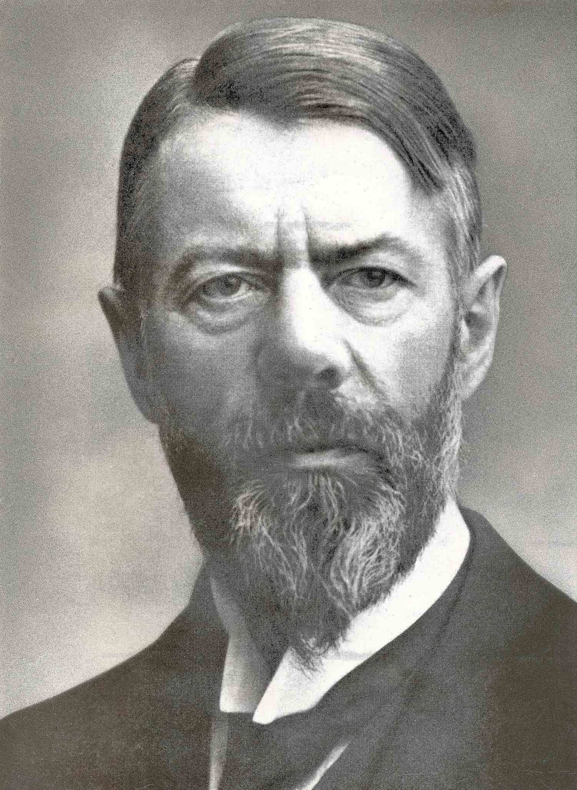
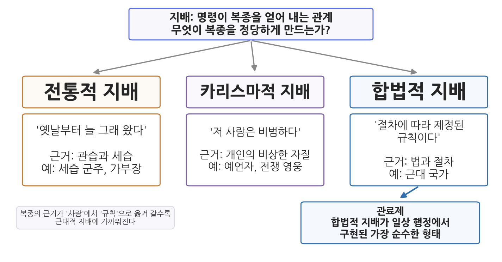
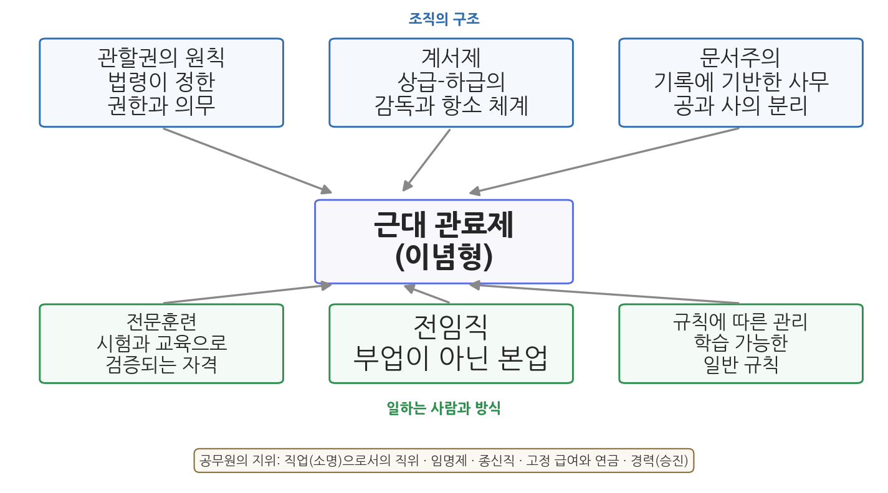

# 7주차 1차시. 관료제의 형성 (1): 베버의 관료제: 이념형과 지배의 정당성

> 직위에 취임한다는 것은 그 직위의 목적에 충실하겠다는 의무를 받아들이는 일이며, 그 대가로 안정된 지위를 보장받는다.
> (막스 베버, 『관료제』)

## 이 장에서 배우는 것

구청에서 건축 인허가를 신청해 본 사람의 경험담을 들어 보자. 담당 주무관은 신청인이 누구인지 묻지 않는다. 서류가 법령이 정한 요건을 갖추었는지만 본다. 요건이 맞으면 처리하고, 모자라면 보완을 요구한다. 처리 과정은 문서로 남고, 결정에 불만이 있으면 정해진 절차에 따라 이의를 제기할 수 있다. 주무관이 바뀌어도 일은 같은 방식으로 처리된다. 우리는 이것을 너무 당연하게 여기지만, 인류 역사의 대부분 동안 통치는 이렇게 이루어지지 않았다. 세리가 걷는 세금의 액수는 세리의 기분과 뇌물에 따라 달라졌고, 관직은 왕이 총애하는 신하에게 임의로 주어졌으며, 기록은 남지 않았다.

"누가 오든 같은 규칙으로 처리되는 행정"이 어떻게 가능해졌는가. 이 질문에 가장 깊이 파고든 사람이 독일의 사회학자 막스 베버(Max Weber)다. 6주차에서 우리는 프레더릭 테일러가 공장의 작업대에서 "가장 좋은 한 가지 방법"을 찾는 과정을 읽었다. 같은 시대에 베버는 전혀 다른 자리, 곧 수천 년 통치의 역사 속에서 근대 조직의 합리성을 추적하고 있었다. 테일러가 삽질하는 노동자를 관찰했다면, 베버는 고대 이집트의 서기관부터 프로이센의 관료까지를 관찰했다.

이 장에서는 구체적으로 다음을 배운다.

- 베버가 어떤 시대에 무엇을 물었는지 (합리화라는 화두)
- 사람들이 명령에 복종하는 세 가지 이유, 곧 전통적·카리스마적·합법적 지배
- 이념형이라는 분석 도구가 무엇이고 무엇이 아닌지
- 원전 강독: 근대 관료제의 여섯 가지 특징과 공무원의 지위
- 베버가 관료제를 예찬하지 않고 두려워한 이유 ("쇠우리")
- 한국 관료제가 이념형과 어디서 만나고 어디서 멀어지는지

<strong>이 장의 로드맵</strong> 
이 장은 하나의 질문을 따라간다. <em>"사람들은 왜 복종하며, 근대의 복종은 무엇이 다른가?"</em>  
<strong>1.1</strong> 베버라는 학자와 그의 시대를 만난다 →
<strong>1.2</strong> 지배의 세 유형과 이념형이라는 도구를 이해한다 →
<strong>1.3</strong> 원전에서 근대 관료제의 여섯 가지 특징을 읽는다 →
<strong>1.4</strong> 원전에서 공무원이라는 신분의 성격을 읽는다 →
<strong>1.5</strong> 합리화의 어두운 면, "쇠우리"를 생각한다 →
<strong>1.6</strong> 한국 관료제를 이념형에 비추어 본다.

## 1.1 베버와 그의 시대: 통치의 역사를 읽은 사회학자

<strong>인물 · 막스 베버(Max Weber, 1864-1920)</strong> 
1864년 에르푸르트에서 법률가이자 국민자유당 의원이던 아버지 아래 태어났다. 1882년 하이델베르크대학에서 법학을 시작해 베를린과 괴팅겐에서 공부했고, 1889년 중세 상사회사 연구로 박사학위를, 1891년 로마 농업사 연구로 교수자격을 얻었다. 1894년 프라이부르크대학 경제학 정교수를 거쳐 1896년 하이델베르크로 옮겼다. 1897년 아버지와 다툰 직후 그가 세상을 떠나자 심한 신경쇠약에 빠져 강의를 중단했고, 1903년 교수직에서 물러났다. 이후 저술에 전념해 1904년 『사회과학 및 사회정책 잡지』의 공동 편집자가 되었고, 같은 해 미국을 여행했다. 1918년 빈대학, 1919년 뮌헨대학 교수로 다시 강단에 섰고, 같은 해 베르사유 강화회의 대표단에 참여하며 바이마르 헌법 초안 작업에 자문했다. 1920년 뮌헨에서 폐렴으로 세상을 떠났고, 남긴 원고는 부인 마리안네가 정리해 출판했다. 
대표 저술: 『프로테스탄트 윤리와 자본주의 정신』(1904-05), 「직업으로서의 정치(Politik als Beruf)」(1919), 『경제와 사회(Wirtschaft und Gesellschaft)』(유고, 1922) 
사진: 1918년경의 베버 (퍼블릭 도메인)

막스 베버(1864-1920)는 독일에서 태어나 법학을 공부했고, 역사와 경제학을 넘나들며 베를린, 괴팅겐, 하이델베르크 등 여러 대학에서 학문 활동을 했다. 그가 살았던 시대의 독일은 뒤늦게 통일(1871)을 이루고 급속한 산업화를 겪던 나라였고, 동시에 프리드리히 대왕 이래 유럽에서 가장 정교하다는 평을 듣던 프로이센 관료제를 물려받은 나라였다. 공장과 관청이 함께 팽창하는 사회를 관찰하면서, 베버는 평생에 걸쳐 하나의 질문을 탐구했다. 근대 사회는 이전 사회와 무엇이 다른가.

베버의 답을 한 단어로 줄이면 합리화(rationalization)다. 근대 이전의 삶이 관습과 감정, 신앙에 따라 움직였다면, 근대의 삶은 점점 더 규칙과 계획, 계산에 따라 움직인다는 것이다. 대표작 『프로테스탄트 윤리와 자본주의 정신』에서 그는 금욕적 신앙이 어떻게 계산적인 경제 생활 방식으로 이어졌는지를 추적했고, 시야를 넓혀 법, 음악, 과학, 그리고 무엇보다 통치 조직에서 같은 합리화의 흐름을 확인했다. 관료제는 이 합리화가 조직의 세계에서 도달한 가장 완성된 형태였다.

베버의 관료제 분석은 그가 1920년에 세상을 떠난 뒤인 1922년에 처음 출판되었고, 1946년 이후에야 영어로 번역되어 널리 알려졌다. 그런데도 그 영향력은 매우 커서, 오늘날까지 관료제에 관한 모든 논의의 출발점으로 남아 있다. 흔히 현대 사회학의 아버지로 불리는 베버는 말년에 독일 바이마르 공화국의 헌법 작성에도 참여했다. 우리가 이 장에서 읽을 「관료제」는 영역본 선집 『From Max Weber: Essays in Sociology』(거스와 밀스 편, 1946)에 실린 바로 그 글이다.

여기서 6주차와의 연결을 짚어 두자. 테일러의 과학적 관리와 베버의 관료제 분석은 서로를 알지 못한 채 진행되었지만, 둘 다 "근대 조직은 어떻게 합리적으로 작동하는가"라는 물음에 답하고 있었다. 다만 방향이 달랐다. 테일러는 처방을 내렸다. 이렇게 관리하라는 것이다. 베버는 진단을 내렸다. 근대 조직은 이렇게 되어 있고, 이렇게 되어 갈 수밖에 없다는 것이다. 이 차이는 1.2절에서 살펴볼 이념형이라는 도구를 이해하는 데 중요하다.

## 1.2 지배의 세 유형: 사람들은 왜 복종하는가

### 지배와 정당성

베버의 관료제 분석은 더 큰 이론, 곧 지배사회학의 한 부분이다. 베버가 말하는 지배(Herrschaft)는 명령이 복종을 얻어 내는 관계다. 그런데 지배가 오래 지속되려면 힘만으로는 부족하다. 물리력으로 얻어 낸 복종은 그 힘이 사라지는 순간 끝난다. 지속되는 지배는 복종하는 사람들 스스로가 "이 명령에는 따를 만한 이유가 있다"고 믿을 때 성립한다. 이 믿음이 정당성(legitimacy)이다.

<strong>정의 · 지배와 정당성</strong> 
<strong>지배</strong>(Herrschaft, domination)는 특정한 명령이 특정 집단의 복종을 얻어 낼 가능성이 지속되는 관계다. 
<strong>정당성</strong>(legitimacy)은 피지배자가 그 지배를 "따를 만한 것"으로 받아들이는 믿음이다. 베버는 정당성의 근거가 무엇이냐에 따라 지배의 유형을 나누었다.

베버는 역사 속 지배를 정당성의 근거에 따라 세 가지 순수 유형으로 나누었다.

첫째, 전통적 지배는 "옛날부터 늘 그래 왔다"는 믿음에 기댄다. 세습 군주와 가부장의 권위가 여기에 속한다. 왕에게 복종하는 이유는 왕이 유능해서가 아니라, 그가 왕가의 핏줄이고 조상 대대로 왕에게 복종해 왔기 때문이다.

둘째, 카리스마적 지배는 "저 사람은 비범하다"는 믿음에 기댄다. 예언자, 전쟁 영웅, 혁명 지도자의 권위가 여기에 속한다. 추종자들은 규칙이나 관습이 아니라 지도자 개인의 비상한 자질에 헌신한다. 그래서 이 지배는 격렬하지만 불안정하다. 지도자가 죽거나 비범함을 증명하지 못하면 무너진다.

셋째, 합법적 지배는 "정해진 절차에 따라 제정된 규칙이다"라는 믿음에 기댄다. 근대 국가의 권위가 여기에 속한다. 우리가 세무서의 고지서에 따르는 이유는 세무서장이 명문가 출신이어서도, 인격이 비범해서도 아니다. 법률이 정한 절차에 따라 부과된 세금이기 때문이다. 복종의 대상은 사람이 아니라 규칙이며, 명령하는 사람 자신도 그 규칙에 묶여 있다.

그림 7-1은 세 유형을 복종의 근거에 따라 나란히 놓은 것이다. 왼쪽에서 오른쪽으로 갈수록 복종의 근거가 "사람"에서 "규칙"으로 옮겨 간다는 점을 눈여겨보자. 그리고 맨 오른쪽 아래에 관료제가 있다. 베버가 보기에 관료제는 합법적 지배가 일상 행정에서 구현된 가장 순수한 형태다. 근대 사회의 합리화란, 지배의 세계에서 보면 전통과 카리스마가 약화되고 합법적 지배와 그 집행 장치인 관료제가 중심이 되는 과정이었다.

### 이념형: 측정 기준으로 쓰는 개념

베버가 관료제를 분석할 때 쓴 도구가 이념형(ideal type, 이상형으로도 옮긴다)이다. 베버는 고대 이집트, 로마, 중국, 비잔틴 제국의 관료제와 18-19세기 유럽에서 등장한 근대 관료제를 두루 연구한 뒤, 현실의 사례들로부터 가장 완전히 발달한 관료제의 핵심 특징만을 추출해 하나의 순수한 모형으로 구성했다.

<strong>정의 · 이념형</strong> 
<strong>이념형</strong>(ideal type)은 현실의 여러 사례에서 어떤 현상의 핵심 특징들을 추출해 논리적으로 순수하게 구성한 개념 모형이다. 현실의 묘사가 아니고, 바람직하다는 규범적 선호의 진술도 아니다. 현실의 조직이 그 모형에 얼마나 가깝거나 먼지를 재는 측정 기준으로 쓰인다.

<strong>유의 · "이념형"은 칭찬이 아니다</strong> 
이념형의 "이념(ideal)"은 "이상적으로 좋다"는 뜻이 아니라 "관념적으로 순수하다"는 뜻이다. 베버의 「관료제」는 현실에 대한 묘사도 아니고 규범적 선호의 진술도 아니며, 관료제를 특징짓는 주요 변수들을 확인하는 작업이다. 따라서 어떤 조직에 그 특징들이 충분히 나타나지 않는다고 해서 그 조직이 비관료제라고 말할 수는 없다. 아직 덜 발달한, 미성숙한 관료제일 수 있다. 마찬가지로 일상어에서 "관료제적"이라는 말이 지닌 부정적 어감(느리다, 경직됐다)을 베버의 용어에 그대로 적용해 읽어서도 안 된다.

## 1.3 원전 강독 (1): 근대 관료제의 여섯 가지 특징

이제 원전을 읽는다. 베버는 근대 공무원 제도의 작동 방식을 여섯 개의 명제로 정리한다. 하나씩 읽고 풀이해 보자.

### 첫째, 관할권의 원칙

<strong>원전 읽기 · 막스 베버, 『관료제』(1922)</strong> 
"확고한 규칙, 곧 법률이나 행정 명령으로 정해진 공적 의무의 원칙이 있다. 첫째, 관료제가 관장하는 목적에 필요한 활동들은 공적 의무로서 일정하게 배분된다. 둘째, 이 의무의 수행을 명령하는 권한 역시 규칙으로 정해지며, 명령이 실제로 이행되도록 물리적·종교적, 그 밖의 강제 수단이 규칙을 뒷받침한다. 셋째, 이 의무가 정기적으로, 끊이지 않고 수행되도록, 일반적으로 규제된 자격을 갖춘 사람들이 배치된다. 공적·법적 정부에서는 이 세 요소가 '관료적 권위'를 이루며, 사적 경제에서는 이를 '관료적 경영'이라 부른다."

무슨 말인가. 관청이 무슨 일을 하고 누가 무엇을 명령할 수 있는지가 사람이 아니라 규칙으로 미리 정해져 있다는 것이다. 오늘날의 언어로 옮기면, 정부조직법이 각 부처의 소관 사무를 정하고, 직제와 위임전결규정이 누구에게 어떤 결재 권한이 있는지 정하는 것과 같다. 이것을 관할권(jurisdiction)의 원칙이라 부른다.

왜 중요한가. 베버는 이 대목에 바로 이어 이렇게 말한다. 고정된 의무를 지닌 영구적인 공적 권위는 정치의 역사에서 오히려 예외였다. 고대 오리엔트에서도, 게르만과 몽골의 제국에서도, 여러 봉건국가에서도 이런 제도는 없었다. 그곳의 통치자는 가장 중요한 일을 개인적 심복, 궁정 시종, 하인에게 맡겼고, 그들의 권한은 임시적이었으며 그때그때의 사안에 국한되었다. 다시 말해 왕의 총신이 오늘은 세금을 걷고 내일은 전쟁에 나가는 세계가 인류사에서 일반적이었고, "담당 업무가 정해진 관청"은 오랜 과정을 거쳐 이룬 제도라는 것이다.

### 둘째, 계서제의 원칙

<strong>원전 읽기 · 막스 베버, 『관료제』(1922)</strong> 
"직무의 계층과 권위의 등급이라는 원칙이 있다. 상급과 하급이 체계적으로 질서 지어져 있어 하급 기관은 상급 기관의 감독을 받으며, 동시에 피지배자가 하급 기관의 결정에 불복해 상급 기관에 항소할 수 있는 길이 정연하게 규정되어 있다. 이 유형이 완전히 발전하면 직무 계층은 하나의 정점 아래 단일하게(monocratically) 조직된다. (중략) 다만 관할권의 원칙이 철저히 지켜지는 곳에서는, 상급 기관이 하급 기관의 업무를 그저 가져다 처리할 수 있는 것이 아니다. 오히려 그 반대가 원칙이다. 일단 설치되어 임무를 맡은 기관은 존속하며, 자리가 비면 후임자가 충원된다."

무슨 말인가. 조직이 위아래의 층으로 짜여 있고, 감독은 위에서 아래로, 불복(항소)은 아래에서 위로 이루어진다는 것이다. 이것이 계서제(hierarchy), 곧 계층제다. 주의할 것은 마지막 문장이다. 계서제는 상급자가 무엇이든 마음대로 하는 체제가 아니다. 관할권의 원칙과 결합되어 있으므로, 상급 기관이라도 하급 기관의 소관 업무를 함부로 빼앗아 처리할 수 없다. 장관이 일선 주무관의 인허가 건을 직접 결재해 버리는 것은 이념형 관료제에서는 오히려 일탈이다.

왜 중요한가. 계서제는 단순한 복종의 구조가 아니라 통제와 구제의 구조다. 위로는 감독 책임이, 아래로는 항소의 권리가 함께 규정된다. 오늘날 행정심판과 행정소송, 상급 기관의 감사 제도는 모두 이 원리에서 비롯된 제도다.

### 셋째, 문서주의

<strong>원전 읽기 · 막스 베버, 『관료제』(1922)</strong> 
"현대의 사무는 원본이든 초안이든 보존되는 문서(파일)에 기반한다. (중략) 문서와 물적 설비, 그리고 그곳에서 일하는 사람들이 합쳐져 '관청(bureau)'을 이룬다. 현대의 공무원 제도는 원칙적으로 관청을 공무원의 사적 주거와 구분한다. 공적 활동은 사생활의 영역과 분리되고, 공금과 공공 물자는 공무원의 사유재산과 엄격히 구분된다."

무슨 말인가. 두 가지가 겹쳐 있다. 하나는 기록이다. 행정은 말이 아니라 문서로 이루어지고, 문서는 보존된다. 다른 하나는 공과 사의 분리다. 관청은 관료의 집이 아니고, 공금은 관료의 돈이 아니다. 베버는 이 분리가 오랜 발전의 결과라고 강조한다. 중세의 영주에게 영지의 수입과 자기 살림은 구분되지 않았다. 사무실과 안방, 법인 재산과 개인 재산이 나뉜 것은 근대의 성취다.

왜 중요한가. 문서는 조직이 지난 일을 확인하는 근거이자 권한의 증거다. 담당자가 바뀌어도 업무가 이어지는 것(행정의 연속성), 나중에 누가 왜 그렇게 결정했는지 따질 수 있는 것(책임성)은 모두 문서가 있기에 가능하다. 오늘날의 전자결재와 기록물 관리는 매체만 종이에서 서버로 바뀌었을 뿐, 이 원리를 따르고 있다.

### 넷째와 다섯째, 전문훈련과 전임직

<strong>원전 읽기 · 막스 베버, 『관료제』(1922)</strong> 
"사무의 관리는, 적어도 전문화된 사무의 관리는 철저하고 전문적인 훈련을 전제한다. 이는 국가의 공무원만이 아니라 현대 사기업의 경영자와 직원에게도 똑같이 해당한다. (중략) 사무가 완전히 발전할수록, 직무 활동은 공무원의 업무 역량 전부를 요구한다. 관청에 의무적으로 머물러야 하는 시간이 엄격히 정해져 있든 아니든 마찬가지다. (중략) 과거에는 정반대여서, 공적 업무는 부차적인 활동으로 수행되었다."

무슨 말인가. 관료의 일은 아무나 할 수 있는 일이 아니라 훈련으로 익혀야 하는 전문적인 일이며(전문훈련), 짬을 내서 하는 부업이 아니라 하루의 노동을 다 바치는 본업이라는 것이다(전임직). "과거에는 정반대였다"는 문장이 핵심이다. 근대 이전의 명사(名士) 행정에서 공직은 지역 유지가 명예로 겸하는 부업이었다. 영국의 치안판사가 그랬고, 조선의 향촌 사족이 맡던 일들이 그랬다. 통치가 복잡해지자 부업 행정은 한계에 부딪혔고, 온종일 그 일만 하는 훈련된 직업인이 필요해졌다.

왜 중요한가. 이 두 특징은 4주차에서 본 엽관제 비판과 곧장 연결된다. 선거 승리의 전리품으로 관직을 나누어 주는 체제는 "훈련된 전문가의 전임 근무"라는 요건과 정면으로 충돌한다. 펜들턴법 이후의 실적주의 개혁은, 베버의 언어로 말하면 미국 행정을 이념형 관료제에 가깝게 만든 사건이었다.

### 여섯째, 규칙에 따른 관리

<strong>원전 읽기 · 막스 베버, 『관료제』(1922)</strong> 
"사무의 관리는 일반적으로, 비교적 안정되고 포괄적이며 학습할 수 있는 규칙을 따른다. 이 규칙에 관한 지식은 법학, 행정학, 경영학의 지식을 필요로 하며, 공무원들은 전문적 학습을 통해 이를 익힌다."

무슨 말인가. 관료제의 일 처리 기준은 "배울 수 있는" 일반 규칙이라는 것이다. 배울 수 있다는 말은 특정 개인의 비법이나 감각이 아니라는 뜻이다. 베버는 이어서 흥미로운 대조를 덧붙인다. 근대 행정 이론은 관청이 개별 사안을 그때그때의 명령으로 처리하는 것이 아니라 추상적 규칙에 따라 처리해야 한다고 보는데, 이는 개인적 특권과 은혜 베풀기로 관계를 규율하던 가부장적 지배와 극명하게 대조된다는 것이다. 은혜의 통치에서 규칙의 통치로, 이것이 여섯 특징 전체를 관통하는 전환이다.

왜 중요한가. 규칙이 학습 가능하다는 사실이 바로 시험 선발과 행정학 교육의 근거가 된다. 관료의 지식이 배워서 익힐 수 있는 것이 아니라면, 시험으로 자격을 검증하는 일도, 대학에서 행정학을 가르치는 일도 성립하지 않는다. 다음 차시에 읽을 화이트의 교과서는 이 명제를 전제로 해서만 가능했던 기획이다.

그림 7-2는 여섯 특징을 한눈에 정리한 것이다. 가운데의 근대 관료제 이념형을 둘러싼 여섯 상자를 보면, 위쪽 세 개(관할권, 계서제, 문서주의)는 조직의 구조에 관한 것이고 아래쪽 세 개(전문훈련, 전임직, 규칙에 따른 관리)는 일하는 사람과 일하는 방식에 관한 것임을 알 수 있다. 여섯 가지는 서로 맞물려 있다. 관할권이 없으면 계서제가 설 자리가 없고, 문서가 없으면 규칙 준수를 확인할 수 없으며, 전문훈련이 없으면 규칙을 익힐 수 없다.

## 1.4 원전 강독 (2): 공무원이라는 신분

베버는 조직의 구조를 설명한 다음, 그 안에서 일하는 사람, 곧 공무원의 지위를 다룬다. 여기서 가장 유명한 명제가 나온다.

<strong>원전 읽기 · 막스 베버, 『관료제』(1922)</strong> 
"직위의 보유는 하나의 '직업(vocation)'이다. 그것은 규정된 교육 과정과, 대개는 고용의 전제 조건인 특별 시험을 요구한다. (중략) 직위는 중세에서 근대까지 흔히 그랬던 것처럼, 봉사의 대가로 지대나 보수를 받아 내는 수입원으로 소유되는 것이 아니다. 자유로운 고용계약처럼 노동을 맞바꾸는 거래로 여겨지지도 않는다. 직위에 취임한다는 것은 그 직위의 목적에 충실하겠다는 의무를 받아들이는 일이며, 그 대가로 안정된 지위를 보장받는다. 근대적 충성이 요구하는 것은 군주 같은 인격에 대한 충성이 아니라, 비인격적이고 기능적인 목적에 대한 헌신이다."

무슨 말인가. 관직을 바라보는 세 가지 낡은 관점이 차례로 기각된다. 관직은 재산이 아니다(중세의 매관매직처럼 사고팔거나 물려주는 수입원이 아니다). 관직은 단순한 일자리도 아니다(품삯을 받고 노동을 파는 계약이 아니다). 관직은 주인에 대한 개인적 봉사도 아니다(왕의 하인이 아니다). 관직은 직업, 베버의 표현으로는 소명(vocation)이며, 그 충성의 대상은 사람이 아니라 직무의 비인격적 목적이다.

왜 중요한가. 이 명제는 2주차에서 읽은 공자를 떠올리게 한다. 공자도 통치하는 자의 자격을 물었지만, 그 답은 통치자 개인의 덕(德)이었다. 베버의 근대 관료에게 요구되는 것은 덕성스러운 인격이라기보다 직무에 대한 비인격적 충실성이다. 도덕적 자격론에서 기능적 자격론으로의 이동, 이것이 근대 공직관의 핵심 전환이다. 물론 이 전환이 공직 윤리를 불필요하게 만드는 것은 아니다. 어느 쪽이 더 나은 공직자를 만드는가는 이 장 끝의 토론 문제로 남겨 둔다.

직업으로서의 직위라는 원칙에서 공무원의 구체적 지위가 따라 나온다. 베버가 열거하는 내용을 표로 정리하면 다음과 같다.

**표 7-1. 베버가 그린 공무원의 지위**

| 측면 | 내용 | 원전의 논거 |
|------|------|------|
| 사회적 존경 | 공무원은 피지배자보다 높은 사회적 존경을 얻으려 하며 대개 얻는다 | 훈련된 전문가에 대한 수요가 크고 신분 질서가 안정된 오래된 문명국가에서 존경이 가장 높다 |
| 임명제 | 순수 유형의 관료는 상급 권위가 임명한다 | 피지배자가 선출한 공무원은 더 이상 순수하게 관료적인 인물이 아니며, 경력이 정당 지도부에 좌우되면 전문성보다 정치적 봉사가 앞서게 된다 |
| 종신직 | 직위는 종신적인 것으로 여겨지며, 자의적 해임과 전보를 막는 법적 보장이 있다 | 다만 이는 직위의 소유권이 아니며, 신분 보장이 곧 높은 존경을 뜻하지도 않는다 |
| 고정 급여와 연금 | 보수는 성과급 임금이 아니라 직급과 근속에 따른 고정 급여이며, 노후는 연금이 보장한다 | 안정된 소득과 존경이 결합되어 공직을 매력적인 자리로 만든다 |
| 경력 | 하위직에서 출발해 승진하는 경력이 기대되며, 연공과 시험에 따른 등급 체계와 결합된다 | 공무원들은 승진과 급여 인상의 조건이 기계적으로 명확하게 정해져 있기를 선호한다 |

임명제 항목을 눈여겨보자. 베버는 선거로 뽑힌 공무원이 관료가 아니라고 말하면서, 당시 미국 대도시의 사례를 든다. 행정 수장과 하위 공무원까지 선거로 뽑는 방식은 전문가 확보와 계서제적 통제를 오히려 위태롭게 한다는 것이다. 4주차에서 본 엽관제의 폐해에 대한 유럽 학자의 진단인 셈이다. 다만 베버는 최고 정치 직위, 특히 장관직만은 예외로 남겨 둔다. 장관은 자격증이 아니라 정치적 판단으로 임명되는 자리다. 관료와 정치가의 경계선을 어디에 그을 것인가라는 이 문제는, 5주차에서 읽은 정치-행정 이원론과 정확히 같은 문제를 다루고 있다.

## 1.5 합리화의 명암: 쇠우리

여기까지 읽으면 베버가 관료제의 열렬한 옹호자처럼 보일 수 있다. 실제로 베버는 관료제가 순수하게 기술적인 면에서 다른 어떤 조직 형태보다 우월하다고 보았다. 정확성, 신속성, 명확성, 문서에 대한 정통함, 연속성, 통일성, 엄격한 복종, 마찰과 비용의 절감. 이 모든 면에서 훈련된 관료들의 단일 지배 조직을 따라올 조직은 없다는 것이다.

그러나 베버는 관료제를 예찬하는 데서 멈추지 않았다. 그는 이 가장 합리적인 조직 형태 안에 비인간성과 경직성의 위험이 함께 들어 있다고 보았고, 관료제의 지배가 불가피하다고 진단하면서도 그것이 개인과 사회의 자율성을 잠식하는 것을 경계했다. 훗날의 연구자들이 베버의 태도를 "불가피하지만 위험한 필연"으로 요약하는 이유다.

이 양가적 태도를 압축하는 이미지가 쇠우리(iron cage)다.

<strong>왜 "쇠우리"인가?</strong> 
이 표현은 『프로테스탄트 윤리와 자본주의 정신』의 결말부에서 나왔다. 베버에 따르면 초기의 금욕적 신앙인들에게 재화에 대한 관심은 "언제든 벗어 던질 수 있는 얇은 외투"여야 했다. 그러나 운명은 그 외투를 단단한 껍데기(영역본의 표현으로 iron cage, 쇠우리)로 만들어 버렸다. 처음에는 인간이 선택한 합리적 생활 방식이, 이제는 그 안에서 태어나는 모든 사람을 가두는 강철 구조물이 되었다는 것이다. 관료제도 같다. 인간이 목적을 이루려고 만든 가장 합리적인 도구가, 어느새 개인이 빠져나갈 수 없는 삶의 조건 자체가 된다. 규칙을 위한 규칙, 절차를 위한 절차 속에서 수단이 목적을 대체해 버리는 역설이다.

이 비판적 통찰은 이후 행정학과 조직 연구의 중요한 흐름으로 이어진다. 10주차에서 읽을 로버트 머튼은 규칙 준수가 목적을 잊게 만드는 "훈련된 무능"과 목표 대치를 분석하는데, 이는 베버가 남긴 경고를 구조적으로 분석한 작업이다. 베버의 이념형이 관료제 연구의 출발점이라면, 쇠우리는 관료제 비판의 출발점이다. 하나의 텍스트가 옹호와 비판 양쪽의 근거가 된 셈이다.

## 1.6 현대 행정에의 함의: 한국 관료제와 이념형의 거리

이념형은 측정 기준이라고 했다. 그 기준을 한국 관료제에 적용해 보자.

먼저 상당히 잘 들어맞는 부분이 있다. 정부조직법과 각 부처 직제가 소관 사무를 정하고(관할권), 9급에서 1급에 이르는 계급과 결재 라인이 감독 체계를 이루며(계서제), 모든 행정 행위가 전자문서로 기록·보존되고(문서주의), 공개경쟁채용시험으로 선발된(전문훈련의 검증) 공무원이 신분 보장과 연금 속에서(종신직·고정 급여) 승진 경력을 쌓아 간다(경력). 국가공무원법이 규정하는 직업공무원제는 사실상 베버의 목록을 법률 조항으로 옮겨 놓은 것에 가깝다. 한 세기 전 독일 학자가 추출한 이념형이 오늘의 세종청사를 이토록 잘 설명한다는 것 자체가, 이 텍스트가 고전인 이유다.

그러나 그 기준을 적용하면 어긋나는 부분도 보인다. 세 가지만 짚는다.

첫째, 전문훈련과 순환보직의 긴장이다. 이념형 관료제에서 관료는 특정 직무의 전문가로 훈련되고 그 직무에 머문다. 한국의 일반직 공무원은 시험으로 선발된 뒤 1-2년 단위로 보직을 옮기는 순환보직 관행 속에서 일하는 경우가 많다. 채용 시험이 검증하는 것도 특정 직무의 전문성이라기보다 일반적 학습 능력에 가깝다. 계급제와 순환보직이 만드는 일반행정가(generalist) 모형은, 직무 전문가를 전제하는 베버의 모형과 거리가 있다.

둘째, 비인격성과 연고의 긴장이다. 이념형 관료제는 "미움도 열정도 없이", 사람을 가리지 않고 규칙을 적용한다. 학연·지연·근무 인연 같은 연고가 인사와 업무 처리에 스며드는 현실은 이 원칙에서 멀어진 부분이다. 거꾸로 청탁금지법 같은 제도는 한국 행정을 비인격성의 이념형에 가깝게 만들려는 노력으로 이해할 수 있다.

셋째, 규칙 준수의 명암이다. 규칙에 따른 관리는 예측 가능성을 주지만, 규칙만 앞세우는 행정, 곧 적극적으로 판단하지 않고 절차만 채우는 행태로 굳어질 수도 있다. 이것은 한국만의 문제가 아니라 베버가 쇠우리로 경고한 바로 그 일반적 위험이며, 10주차에서 머튼과 함께 다시 다룬다.

요컨대 이념형은 한국 관료제가 "관료제냐 아니냐"를 판정하는 도구가 아니라, 어느 특징이 강하고 어느 특징이 약한지, 그 강약이 어떤 결과를 낳는지 따져 보게 하는 진단 도구다. 이것이 백 년 된 텍스트를 지금 읽는 실용적인 이유다.

## 요약

베버는 근대 사회의 특징을 합리화로 진단했고, 그 물음을 지배의 영역으로 가져가 사람들이 복종하는 근거를 전통적 지배, 카리스마적 지배, 합법적 지배의 세 순수 유형으로 나누었다. 관료제는 합법적 지배가 일상 행정에서 구현된 가장 순수한 형태다. 베버가 쓴 분석 도구인 이념형은 현실의 묘사도 규범적 선호도 아닌, 핵심 특징을 추출한 개념 모형이며 현실을 재는 측정 기준으로 쓰인다. 원전이 제시하는 근대 관료제의 특징은 관할권의 원칙, 계서제, 문서주의(공사 구분 포함), 전문훈련, 전임직, 규칙에 따른 관리의 여섯 가지로 정리되며, 그 안에서 일하는 공무원의 지위는 직업(소명)으로서의 직위, 임명제, 종신직, 고정 급여와 연금, 경력의 특징을 갖는다. 베버는 관료제의 기술적 우월성을 인정하면서도 합리화가 인간을 가두는 쇠우리가 될 위험을 경고했다. 한국의 직업공무원제는 이념형과 상당 부분 겹치지만, 순환보직과 일반행정가 모형, 연고주의, 규칙만 앞세우는 행정 등에서 이념형과의 거리가 관찰되며, 이념형은 바로 그 거리를 재는 진단 도구로 쓸 수 있다.

## 토론·복습 문제

**7-1. 지배의 세 유형 적용.** 다음 각 사례에서 복종의 정당성 근거가 전통적·카리스마적·합법적 지배 가운데 어디에 가장 가까운지 판별하고, 하나의 사례 안에 두 유형 이상이 섞여 있는 경우 그 혼합을 설명해 보라. (a) 종갓집 제사에서 종손의 결정에 따르는 문중, (b) 창업자의 비전에 헌신하는 스타트업 직원, (c) 국세청 고지서에 따라 세금을 내는 시민, (d) 선거로 뽑힌 대통령의 명령에 따르는 장관.

**7-2. 원전 구절 해석.** 다음 구절을 읽고 물음에 답하라. "직위에 취임한다는 것은 그 직위의 목적에 충실하겠다는 의무를 받아들이는 일이며, 그 대가로 안정된 지위를 보장받는다. 근대적 충성이 요구하는 것은 군주 같은 인격에 대한 충성이 아니라, 비인격적이고 기능적인 목적에 대한 헌신이다." (a) 여기서 "비인격적 목적에 대한 헌신"이 뜻하는 바를, 관직을 수입원으로 보는 관점 및 주인에 대한 개인적 봉사로 보는 관점과 대비하여 설명하라. (b) 공무원의 신분 보장(안정된 지위)이 이 충성 개념과 어떻게 맞교환 관계에 있는지 논하라.

**7-3. 기말 대비 서술형.** 베버의 이념형 관료제의 여섯 가지 특징을 서술하고, 그 가운데 두 가지를 골라 한국 관료제의 현실이 이념형과 가까운 점과 먼 점을 각각 논의하시오.

**7-4. 쇠우리 토론.** 베버는 가장 합리적인 조직 형태인 관료제가 인간을 가두는 쇠우리가 될 수 있다고 보았다. 여러분이 최근에 겪은 행정 절차(증명서 발급, 장학금 신청, 병역 관련 절차 등) 가운데 "규칙의 합리성"과 "규칙의 답답함"을 동시에 느낀 사례를 하나 들고, 그 답답함이 제거해야 할 비효율인지 아니면 공정성을 위해 감수해야 할 비용인지 자신의 기준을 세워 논해 보라.
