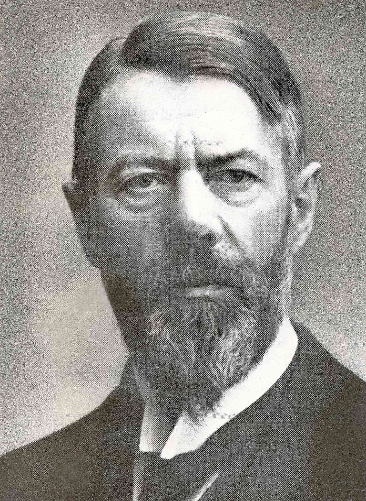
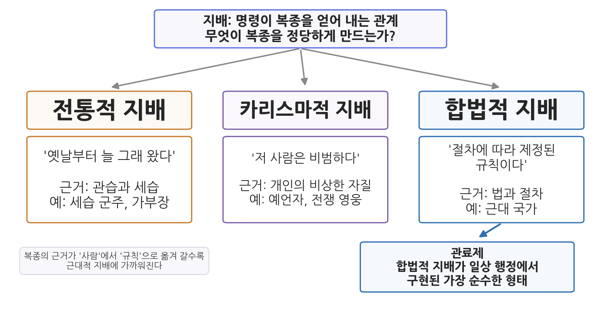
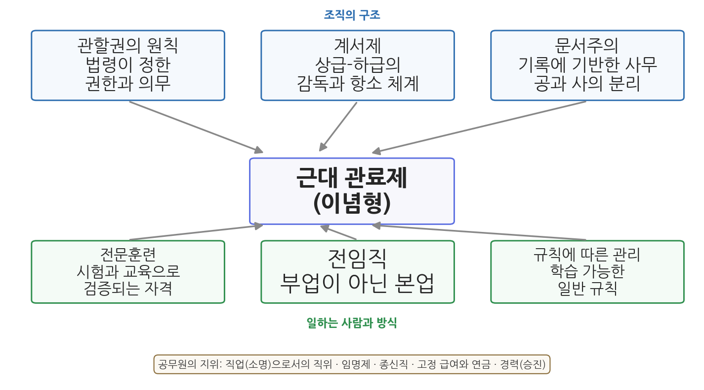

# 7주차 1차시. 관료제의 형성 (1): 베버의 관료제: 이념형과 지배의 정당성

> 직위에 취임한다는 것은 그 직위의 목적에 충실하겠다는 의무를 받아들이는 일이며, 그 대가로 안정된 지위를 보장받는다.
> (막스 베버, 『관료제』)

## 이 장에서 배우는 것

구청에서 건축 인허가를 신청해 본 사람의 경험담을 들어 보자. 담당 주무관은 신청인이 누구인지 묻지 않는다. 서류가 법령이 정한 요건을 갖추었는지만 본다. 요건이 맞으면 처리하고, 모자라면 보완을 요구한다. 처리 과정은 문서로 남고, 결정에 불만이 있으면 정해진 절차에 따라 이의를 제기할 수 있다. 주무관이 바뀌어도 일은 같은 방식으로 처리된다. 우리는 이것을 너무 당연하게 여기지만, 인류 역사의 대부분 동안 통치는 이렇게 이루어지지 않았다. 세리가 걷는 세금의 액수는 세리의 기분과 뇌물에 따라 달라졌고, 관직은 왕이 총애하는 신하에게 임의로 주어졌으며, 기록은 남지 않았다.

"누가 오든 같은 규칙으로 처리되는 행정"이 어떻게 가능해졌는가. 이 질문에 가장 깊이 파고든 사람이 독일의 사회학자 막스 베버(Max Weber)다. 6주차에서 우리는 프레더릭 테일러가 공장의 작업대에서 "가장 좋은 한 가지 방법"을 찾는 과정을 읽었다. 같은 시대에 베버는 전혀 다른 자리, 곧 수천 년 통치의 역사 속에서 근대 조직의 합리성을 추적하고 있었다. 테일러가 삽질하는 노동자를 관찰했다면, 베버는 고대 이집트의 서기관부터 프로이센의 관료까지를 관찰했다.

이 장에서는 구체적으로 다음을 배운다.

- 베버가 어떤 시대에 무엇을 물었는지 (합리화라는 화두와 독일 관료제의 경험)
- 사람들이 명령에 복종하는 세 가지 이유, 곧 전통적·카리스마적·합법적 지배
- 이념형이라는 분석 도구가 무엇이고 무엇이 아닌지
- 원전 강독: 근대 관료제의 여섯 가지 특징과 공무원의 지위, 그리고 각 특징이 역사 속에서 자리 잡은 과정
- 베버가 관료제를 예찬하지 않고 두려워한 이유 ("쇠우리")
- 한국 관료제가 이념형과 어디서 만나고 어디서 멀어지는지, 그리고 국내외의 구체적 제도와 사건

<strong>이 장의 로드맵</strong> 
이 장은 하나의 질문을 따라간다. <em>"사람들은 왜 복종하며, 근대의 복종은 무엇이 다른가?"</em>  
<strong>1.1</strong> 베버라는 학자와 그의 시대를 만난다 →
<strong>1.2</strong> 지배의 세 유형과 이념형이라는 도구를 이해한다 →
<strong>1.3</strong> 원전에서 근대 관료제의 여섯 가지 특징을 읽는다 →
<strong>1.4</strong> 원전에서 공무원이라는 신분의 성격을 읽는다 →
<strong>1.5</strong> 합리화의 어두운 면, "쇠우리"를 생각한다 →
<strong>1.6</strong> 한국 관료제를 이념형에 비추어 본다.

## 1.1 베버와 그의 시대: 통치의 역사를 읽은 사회학자

<strong>인물 · 막스 베버(Max Weber, 1864-1920)</strong> 
1864년 에르푸르트에서 법률가이자 국민자유당 의원이던 아버지 아래 태어났다. 1882년 하이델베르크대학에서 법학을 시작해 베를린과 괴팅겐에서 공부했고, 1889년 중세 상사회사 연구로 박사학위를, 1891년 로마 농업사 연구로 교수자격을 얻었다. 1894년 프라이부르크대학 경제학 정교수를 거쳐 1896년 하이델베르크로 옮겼다. 1897년 아버지와 다툰 직후 그가 세상을 떠나자 심한 신경쇠약에 빠져 강의를 중단했고, 1903년 교수직에서 물러났다. 이후 저술에 전념해 1904년 『사회과학 및 사회정책 잡지』의 공동 편집자가 되었고, 같은 해 미국을 여행했다. 1918년 빈대학, 1919년 뮌헨대학 교수로 다시 강단에 섰고, 같은 해 베르사유 강화회의 대표단에 참여하며 바이마르 헌법 초안 작업에 자문했다. 1920년 뮌헨에서 폐렴으로 세상을 떠났고, 남긴 원고는 부인 마리안네가 정리해 출판했다. 
대표 저술: 『프로테스탄트 윤리와 자본주의 정신』(1904-05), 「직업으로서의 정치(Politik als Beruf)」(1919), 『경제와 사회(Wirtschaft und Gesellschaft)』(유고, 1922) 
사진: 1918년경의 베버 (퍼블릭 도메인)

막스 베버(1864-1920)는 독일에서 태어나 법학을 공부했고, 역사와 경제학을 넘나들며 베를린, 괴팅겐, 하이델베르크 등 여러 대학에서 학문 활동을 했다. 그가 살았던 시대의 독일은 뒤늦게 통일(1871)을 이루고 급속한 산업화를 겪던 나라였고, 동시에 프리드리히 대왕 이래 유럽에서 가장 정교하다는 평을 듣던 프로이센 관료제를 물려받은 나라였다. 공장과 관청이 함께 팽창하는 사회를 관찰하면서, 베버는 평생에 걸쳐 하나의 질문을 탐구했다. 근대 사회는 이전 사회와 무엇이 다른가.

### 프로이센 관료제라는 배경

베버가 관료제를 깊이 연구할 수 있었던 데에는 그가 자란 나라의 역사가 크게 작용했다. 프로이센은 18세기부터 군대와 재정을 중심으로 중앙집권적 행정을 키워 온 나라였다. 18세기 중엽 프로이센의 국왕 프리드리히 2세(프리드리히 대왕)는 스스로를 "국가의 제1봉사자"로 여겼다고 전해진다. 군주조차 국가라는 비인격적 목적에 봉사하는 존재라는 이 자기 이해는, 뒤에서 읽을 베버의 원전에도 직접 등장한다. 왕의 개인 재산과 국가의 재정, 왕의 신하와 국가의 관리가 서서히 구분되기 시작한 과정이 바로 프로이센 관료제의 형성 과정이었다.

19세기 초의 개혁은 이 흐름을 한 단계 더 밀고 나갔다. 1806년 나폴레옹에게 패한 프로이센은 슈타인(Karl vom Stein)과 하르덴베르크(Karl August von Hardenberg)의 주도로 대대적인 국가 개혁에 나섰다. 1808년에는 지역별 부서와 업무별 부서가 뒤섞여 있던 옛 최고행정기구(총관리청)를 폐지하고 그 자리에 기능별로 조직된 부처를 두었으며, 사법과 행정을 분리했다. 지역이 아니라 업무의 성격에 따라 관청을 나누고 각 부처가 자기 소관 사무를 맡는 방식은, 1.3절에서 읽을 관할권의 원칙이 실제 제도로 나타난 사례다.

그러나 같은 관료제가 정치적 문제도 낳았다. 1871년 독일 통일을 이끈 재상 비스마르크는 자신이 중심이 되는 헌정 구조를 만들었고, 의회는 정부를 실질적으로 통제하지 못했다. 베버는 1917년 신문에 연재한 글 「재편된 독일의 의회와 정부」에서, 비스마르크의 체제가 의회를 무력하게 만들고 관료가 국정을 사실상 장악하는 상태를 남겼다고 비판했다. 그는 근대 사회에서 관료제는 피할 수 없지만, 바로 그 때문에 관료의 힘을 견제할 강한 의회와 책임 있는 정치 지도자가 필요하다고 주장했다. 관료제의 기술적 우수성을 누구보다 잘 알았던 학자가 동시에 관료제의 정치적 위험을 경고했다는 점은, 1.5절에서 다룰 베버의 양가적 태도를 이해하는 데 중요한 배경이다.

### 합리화라는 질문

베버의 답을 한 단어로 줄이면 합리화(rationalization)다. 근대 이전의 삶이 관습과 감정, 신앙에 따라 움직였다면, 근대의 삶은 점점 더 규칙과 계획, 계산에 따라 움직인다는 것이다. 대표작 『프로테스탄트 윤리와 자본주의 정신』에서 그는 금욕적 신앙이 어떻게 계산적인 경제 생활 방식으로 이어졌는지를 추적했고, 시야를 넓혀 법, 음악, 과학, 그리고 무엇보다 통치 조직에서 같은 합리화의 흐름을 확인했다. 관료제는 이 합리화가 조직의 세계에서 도달한 가장 완성된 형태였다.

합리화라는 말을 조금 더 구체적으로 풀어 보자. 베버가 말한 합리화는 사람들이 더 똑똑해졌다는 뜻이 아니다. 삶의 여러 영역에서 일을 처리하는 방식이 계산 가능하고 예측 가능한 규칙으로 바뀌어 간다는 뜻이다. 상인은 장부를 적어 손익을 계산하고, 법원은 판사의 개인적 감각이 아니라 성문 법전에 따라 판결하며, 관청은 군주의 그때그때 명령이 아니라 미리 정해진 절차에 따라 움직인다. 베버는 1917년 11월 뮌헨에서 한 강연(뒤에 「직업으로서의 학문」으로 출판되었다)에서 이 시대의 운명을 합리화와 주지화, 그리고 무엇보다 "세계의 탈주술화(disenchantment of the world)"로 특징지었다. 세계를 신비한 힘이 아니라 원리상 계산할 수 있는 대상으로 보게 되었다는 것이다. 관료제는 이 변화가 통치의 영역에서 나타난 형태였다.

### 관료제를 직접 운영해 본 학자

베버는 책상에서만 관료제를 연구한 학자가 아니었다. 1914년 8월 제1차 세계대전이 시작되자, 이미 쉰 살이었던 베버는 예비역 장교로 자원해 하이델베르크 예비군 병원위원회의 군 위원으로 배치되었다. 그는 1915년 9월 위원회가 해산될 때까지 이 지역의 예비군 병원 여러 곳을 세우고 운영하는 일을 맡았다. 전쟁 초기의 혼란 속에서 그는 준비되지 않은 시설, 쓸모없어진 납품 계약, 약속한 값에 물자를 대지 못하는 상인들을 상대해야 했다. 관료제를 이론으로 분석하던 학자가 전시의 급박한 조건에서 실제 행정 조직을 꾸려야 했던 셈이다.

전쟁 막바지와 패전 직후의 베버는 정치에도 깊이 관여했다. 1919년 1월 28일 그는 뮌헨에서 자유학생연맹의 초청으로 「직업으로서의 정치」를 강연했다. 이 강연에서 그는 국가를 "일정한 영역 안에서 정당한 물리적 폭력의 독점을 (성공적으로) 요구하는 인간 공동체"로 정의했고, 정치인과 관료가 서로 다른 윤리와 책임을 지닌다는 점을 강조했다. 정당한 폭력의 독점이라는 정의에는 이 장의 핵심어인 "정당성"이 이미 들어 있다. 국가가 힘을 쓴다는 사실보다, 그 힘이 정당한 것으로 받아들여진다는 사실이 국가를 국가로 만든다는 것이다.

### 관료제 분석의 출판과 전파

베버의 관료제 분석은 그가 1920년에 세상을 떠난 뒤인 1922년에 처음 출판되었고, 1946년 이후에야 영어로 번역되어 널리 알려졌다. 그런데도 그 영향력은 매우 커서, 오늘날까지 관료제에 관한 모든 논의의 출발점으로 남아 있다. 흔히 현대 사회학의 아버지로 불리는 베버는 말년에 독일 바이마르 공화국의 헌법 작성에도 참여했다. 우리가 이 장에서 읽을 「관료제」는 영역본 선집 『From Max Weber: Essays in Sociology』(거스와 밀스 편, 1946)에 실린 바로 그 글이다.

출판의 시차는 이 텍스트가 읽힌 방식에도 영향을 주었다. 베버가 이 글을 쓸 무렵 미국에서는 이미 윌슨과 굿나우가 행정 연구를 촉구한 뒤였고 테일러의 과학적 관리가 널리 퍼지고 있었지만, 베버의 관료제론은 독일어로만 존재했고 그나마 그의 사후에야 출판되었으므로 영어권 독자가 접하기 어려웠다. 베버의 이론이 영어권 행정학과 조직 연구의 공통 출발점이 된 것은 제2차 세계대전 이후의 일이다. 10주차의 머튼이 1940년에 쓴 논문이 베버의 이념형을 요약하는 데서 시작하는 것도, 이 무렵부터 베버가 미국 사회학의 필수 문헌으로 자리 잡아 갔음을 보여 준다.

### 6주차와의 연결

여기서 6주차와의 연결을 짚어 두자. 테일러의 과학적 관리와 베버의 관료제 분석은 서로를 알지 못한 채 진행되었지만, 둘 다 "근대 조직은 어떻게 합리적으로 작동하는가"라는 물음에 답하고 있었다. 다만 방향이 달랐다. 테일러는 처방을 내렸다. 이렇게 관리하라는 것이다. 베버는 진단을 내렸다. 근대 조직은 이렇게 되어 있고, 이렇게 되어 갈 수밖에 없다는 것이다. 이 차이는 1.2절에서 살펴볼 이념형이라는 도구를 이해하는 데 중요하다.

## 1.2 지배의 세 유형: 사람들은 왜 복종하는가

### 지배와 정당성

베버의 관료제 분석은 더 큰 이론, 곧 지배사회학의 한 부분이다. 베버가 말하는 지배(Herrschaft)는 명령이 복종을 얻어 내는 관계다. 그런데 지배가 오래 지속되려면 힘만으로는 부족하다. 물리력으로 얻어 낸 복종은 그 힘이 사라지는 순간 끝난다. 지속되는 지배는 복종하는 사람들 스스로가 "이 명령에는 따를 만한 이유가 있다"고 믿을 때 성립한다. 이 믿음이 정당성(legitimacy)이다.

<strong>정의 · 지배와 정당성</strong> 
<strong>지배</strong>(Herrschaft, domination)는 특정한 명령이 특정 집단의 복종을 얻어 낼 가능성이 지속되는 관계다. 
<strong>정당성</strong>(legitimacy)은 피지배자가 그 지배를 "따를 만한 것"으로 받아들이는 믿음이다. 베버는 정당성의 근거가 무엇이냐에 따라 지배의 유형을 나누었다.

베버는 역사 속 지배를 정당성의 근거에 따라 세 가지 순수 유형으로 나누었다.

첫째, 전통적 지배는 "옛날부터 늘 그래 왔다"는 믿음에 기댄다. 세습 군주와 가부장의 권위가 여기에 속한다. 왕에게 복종하는 이유는 왕이 유능해서가 아니라, 그가 왕가의 핏줄이고 조상 대대로 왕에게 복종해 왔기 때문이다.

둘째, 카리스마적 지배는 "저 사람은 비범하다"는 믿음에 기댄다. 예언자, 전쟁 영웅, 혁명 지도자의 권위가 여기에 속한다. 추종자들은 규칙이나 관습이 아니라 지도자 개인의 비상한 자질에 헌신한다. 그래서 이 지배는 격렬하지만 불안정하다. 지도자가 죽거나 비범함을 증명하지 못하면 무너진다.

셋째, 합법적 지배는 "정해진 절차에 따라 제정된 규칙이다"라는 믿음에 기댄다. 근대 국가의 권위가 여기에 속한다. 우리가 세무서의 고지서에 따르는 이유는 세무서장이 명문가 출신이어서도, 인격이 비범해서도 아니다. 법률이 정한 절차에 따라 부과된 세금이기 때문이다. 복종의 대상은 사람이 아니라 규칙이며, 명령하는 사람 자신도 그 규칙에 묶여 있다.

세 유형의 차이는 "명령하는 사람이 바뀌면 어떻게 되는가"라는 질문을 던져 보면 분명해진다. 전통적 지배에서 왕이 죽으면 정해진 혈통의 후계자가 자리를 잇고, 복종은 그대로 이어진다. 복종의 근거가 개인이 아니라 대대로 이어진 관습에 있기 때문이다. 카리스마적 지배에서 지도자가 죽으면 문제가 심각해진다. 복종의 근거가 바로 그 사람의 비범함이었으므로, 후계자는 자신도 비범하다는 것을 새로 증명해야 한다. 합법적 지배에서 장관이나 구청장이 바뀌면, 새 사람은 같은 법률과 같은 직제에 따라 같은 권한을 행사한다. 시민이 복종하는 대상은 처음부터 그 사람이 아니라 직위와 규칙이었기 때문이다. 이렇게 보면 합법적 지배는 세 유형 가운데 사람의 교체에 가장 영향을 덜 받는 유형이며, 이 안정성이 근대 국가가 대규모 행정을 지속할 수 있는 조건이 된다.

합법적 지배에서 "정해진 절차에 따라 제정되었다"는 조건이 왜 중요한지도 짚어 둘 필요가 있다. 대한민국 헌법은 조세의 종목과 세율을 법률로 정하도록 하고 있는데, 이를 조세법률주의라 부른다. 세금이 정당한 이유는 세무 공무원이 필요하다고 판단했기 때문이 아니라, 국민의 대표가 모인 의회가 정해진 입법 절차를 거쳐 법률로 정했기 때문이다. 그래서 합법적 지배에서는 명령의 내용만큼이나 명령이 만들어진 경로가 따져진다. 같은 금액의 세금이라도 법률에 근거가 없으면 공무원의 자의적 징수가 되고, 시민은 이에 따를 의무가 없다.

그림 7-1은 세 유형을 복종의 근거에 따라 나란히 놓은 것이다. 왼쪽에서 오른쪽으로 갈수록 복종의 근거가 "사람"에서 "규칙"으로 옮겨 간다는 점을 눈여겨보자. 그리고 맨 오른쪽 아래에 관료제가 있다. 베버가 보기에 관료제는 합법적 지배가 일상 행정에서 구현된 가장 순수한 형태다. 근대 사회의 합리화란, 지배의 세계에서 보면 전통과 카리스마가 약화되고 합법적 지배와 그 집행 장치인 관료제가 중심이 되는 과정이었다.

### 순수 유형은 섞여서 나타난다

세 유형은 순수 유형이므로, 현실의 지배는 대개 둘 이상이 섞인 형태로 나타난다. 오늘날의 민주국가를 예로 들어 보자. 대통령의 권한은 헌법과 법률에서 나오므로 기본적으로 합법적 지배다. 그러나 선거 운동에서 유권자를 움직이는 힘은 종종 후보 개인의 매력과 신념, 곧 카리스마적 요소다. 또 의회의 관행이나 국가 의례처럼 "오래전부터 그렇게 해 왔다"는 이유로 유지되는 부분에는 전통적 요소가 남아 있다. 베버가 세 유형을 나눈 목적은 현실의 지배를 셋 중 하나로 분류해 버리려는 것이 아니라, 하나의 지배 안에 어떤 정당성 근거들이 어떤 비율로 섞여 있는지를 분석하려는 데 있었다.

<strong>왜 카리스마는 오래가지 못하는가?</strong> 
베버는 카리스마적 지배가 그대로는 오래 지속될 수 없다고 보았고, 그 변화를 카리스마의 일상화(routinization of charisma)라고 불렀다. 지도자가 살아 있는 동안 추종자들은 지도자의 말 한마디에 따라 움직인다. 그러나 지도자가 사라지면 누가 뒤를 이을지, 조직의 재산은 어떻게 관리할지, 추종자들의 생계는 어떻게 보장할지 같은 일상의 문제가 남는다. 이 문제를 해결하려면 후계자를 정하는 규칙, 재정을 관리하는 절차, 직책과 위계가 필요하다. 그 결과 카리스마는 혈통에 따른 세습(전통적 지배 쪽으로의 변화)이나 직책과 규칙(합법적 지배 쪽으로의 변화)으로 바뀌어 간다. 창업자 한 사람의 비전으로 성장한 기업이 창업자가 물러난 뒤 이사회와 사내 규정과 인사 제도를 갖춘 조직으로 바뀌는 과정도 같은 구조로 이해할 수 있다. 이 개념은 관료제가 어떻게 생겨나는지를 설명하는 하나의 경로를 보여 준다. 관료제는 처음부터 설계되기도 하지만, 카리스마적 운동이 일상의 과제를 처리하는 과정에서 만들어지기도 한다.

### 이념형: 측정 기준으로 쓰는 개념

베버가 관료제를 분석할 때 쓴 도구가 이념형(ideal type, 이상형으로도 옮긴다)이다. 베버는 고대 이집트, 로마, 중국, 비잔틴 제국의 관료제와 18-19세기 유럽에서 등장한 근대 관료제를 두루 연구한 뒤, 현실의 사례들로부터 가장 완전히 발달한 관료제의 핵심 특징만을 추출해 하나의 순수한 모형으로 구성했다.

<strong>정의 · 이념형</strong> 
<strong>이념형</strong>(ideal type)은 현실의 여러 사례에서 어떤 현상의 핵심 특징들을 추출해 논리적으로 순수하게 구성한 개념 모형이다. 현실의 묘사가 아니고, 바람직하다는 규범적 선호의 진술도 아니다. 현실의 조직이 그 모형에 얼마나 가깝거나 먼지를 재는 측정 기준으로 쓰인다.

<strong>유의 · "이념형"은 칭찬이 아니다</strong> 
이념형의 "이념(ideal)"은 "이상적으로 좋다"는 뜻이 아니라 "관념적으로 순수하다"는 뜻이다. 베버의 「관료제」는 현실에 대한 묘사도 아니고 규범적 선호의 진술도 아니며, 관료제를 특징짓는 주요 변수들을 확인하는 작업이다. 따라서 어떤 조직에 그 특징들이 충분히 나타나지 않는다고 해서 그 조직이 비관료제라고 말할 수는 없다. 아직 덜 발달한, 미성숙한 관료제일 수 있다. 마찬가지로 일상어에서 "관료제적"이라는 말이 지닌 부정적 어감(느리다, 경직됐다)을 베버의 용어에 그대로 적용해 읽어서도 안 된다.

이념형을 측정 기준으로 쓴다는 것이 실제로 무슨 뜻인지 예를 들어 보자. 두 개의 조직을 비교한다고 하자. 한 지방자치단체에서는 담당 업무가 조례와 사무분장으로 명확히 정해져 있고, 모든 결정이 전자문서로 남으며, 직원은 공개경쟁시험으로 뽑힌다. 다른 작은 민간 단체에서는 대표가 그때그때 일을 나누어 주고, 중요한 결정도 구두로 이루어지며, 직원은 대표의 지인 가운데서 채용된다. 이념형을 기준으로 놓으면 앞의 조직이 관료제의 특징을 더 많이 갖추었다고 말할 수 있다. 그렇다고 앞의 조직이 더 좋은 조직이라는 결론이 자동으로 나오지는 않는다. 작은 단체에서는 유연한 운영이 더 효과적일 수도 있다. 이념형이 알려 주는 것은 어느 조직이 어느 특징을 얼마나 갖추었는가이며, 그것이 바람직한가는 별도로 따져야 할 문제다.

이념형이라는 방법은 행정학 연구에서 지금도 쓰인다. 한 나라의 공무원 제도가 얼마나 실적에 기초하는지, 정치적 임명이 얼마나 많은지, 공무원의 신분이 얼마나 보장되는지 같은 문항을 만들어 여러 나라를 비교하는 연구들은, 베버의 목록을 측정 항목으로 바꾼 작업이라 할 수 있다. 측정 항목이 되려면 기준이 먼저 분명해야 하며, 베버의 이념형은 그 기준을 제공한다.

## 1.3 원전 강독 (1): 근대 관료제의 여섯 가지 특징

이제 원전을 읽는다. 베버는 근대 공무원 제도의 작동 방식을 여섯 개의 명제로 정리한다. 하나씩 읽고 풀이해 보자.

### 첫째, 관할권의 원칙

<strong>원전 읽기 · 막스 베버, 『관료제』(1922)</strong> 
"확고한 규칙, 곧 법률이나 행정 명령으로 정해진 공적 의무의 원칙이 있다. 첫째, 관료제가 관장하는 목적에 필요한 활동들은 공적 의무로서 일정하게 배분된다. 둘째, 이 의무의 수행을 명령하는 권한 역시 규칙으로 정해지며, 명령이 실제로 이행되도록 물리적·종교적, 그 밖의 강제 수단이 규칙을 뒷받침한다. 셋째, 이 의무가 정기적으로, 끊이지 않고 수행되도록, 일반적으로 규제된 자격을 갖춘 사람들이 배치된다. 공적·법적 정부에서는 이 세 요소가 '관료적 권위'를 이루며, 사적 경제에서는 이를 '관료적 경영'이라 부른다."

무슨 말인가. 관청이 무슨 일을 하고 누가 무엇을 명령할 수 있는지가 사람이 아니라 규칙으로 미리 정해져 있다는 것이다. 오늘날의 언어로 옮기면, 정부조직법이 각 부처의 소관 사무를 정하고, 직제와 위임전결규정이 누구에게 어떤 결재 권한이 있는지 정하는 것과 같다. 이것을 관할권(jurisdiction)의 원칙이라 부른다.

왜 중요한가. 베버는 이 대목에 바로 이어 이렇게 말한다. 고정된 의무를 지닌 영구적인 공적 권위는 정치의 역사에서 오히려 예외였다. 고대 오리엔트에서도, 게르만과 몽골의 제국에서도, 여러 봉건국가에서도 이런 제도는 없었다. 그곳의 통치자는 가장 중요한 일을 개인적 심복, 궁정 시종, 하인에게 맡겼고, 그들의 권한은 임시적이었으며 그때그때의 사안에 국한되었다. 다시 말해 왕의 총신이 오늘은 세금을 걷고 내일은 전쟁에 나가는 세계가 인류사에서 일반적이었고, "담당 업무가 정해진 관청"은 오랜 과정을 거쳐 이룬 제도라는 것이다.

원전의 세 요소를 하나씩 떼어 보면 관할권의 원칙이 무엇으로 이루어지는지 더 분명해진다. 첫째 요소는 일의 배분이다. 조직이 해야 할 일이 미리 나뉘어 각 직위의 공적 의무로 정해진다. 둘째 요소는 명령 권한의 한정이다. 누가 누구에게 무엇을 명령할 수 있는지, 그리고 명령을 강제할 수단이 무엇인지도 규칙이 정한다. 셋째 요소는 자격을 갖춘 사람의 배치다. 의무가 정기적이고 지속적으로 수행되도록, 정해진 자격을 갖춘 사람이 그 자리에 앉는다. 세 요소 가운데 하나라도 빠지면 관할권은 성립하지 않는다. 일은 나뉘어 있어도 권한이 정해져 있지 않으면 담당자는 아무것도 강제할 수 없고, 권한은 있어도 자격 있는 사람이 없으면 일은 처리되지 않는다.

베버는 이 원칙이 국가에만 해당하지 않는다는 점도 지적한다. 원전의 표현으로 이 제도는 정치 공동체와 교회 공동체에서 출발해 근대 국가와 고도로 발달한 자본주의의 사기업에서 발전했다. 공기업과 대기업의 직제, 대학의 학칙이 부서별 업무를 정해 두는 것도 같은 원리다. 관료제를 정부에만 있는 현상으로 좁혀 읽지 않는 것이 베버를 읽을 때 유의할 점이다.

역사 속 사례를 보자. 1.1절에서 본 1808년 프로이센의 개혁은 지역별 부서와 업무별 부서가 뒤섞여 있던 행정 조직을 기능별 부처로 재편했다. 대한민국에서도 정부 수립과 함께 1948년 7월 17일 「정부조직법」이 법률 제1호로 공포되었다. 신생 국가가 가장 먼저 만든 법률 가운데 하나가 행정 기관의 설치와 소관 사무를 정하는 법이었다는 사실은, 관할권의 원칙이 근대 국가 행정의 출발 조건이라는 베버의 분석과 맞닿아 있다. 오늘날에도 정부 부처를 새로 만들거나 없애고 업무를 다른 부처로 옮기려면 정부조직법을 개정해야 한다. 정권이 바뀔 때마다 정부조직법 개정이 국회의 큰 쟁점이 되는 것은, 어느 기관이 어떤 일을 맡을지를 규칙으로 정하는 일이 곧 권한의 배분이기 때문이다.

### 둘째, 계서제의 원칙

<strong>원전 읽기 · 막스 베버, 『관료제』(1922)</strong> 
"직무의 계층과 권위의 등급이라는 원칙이 있다. 상급과 하급이 체계적으로 질서 지어져 있어 하급 기관은 상급 기관의 감독을 받으며, 동시에 피지배자가 하급 기관의 결정에 불복해 상급 기관에 항소할 수 있는 길이 정연하게 규정되어 있다. 이 유형이 완전히 발전하면 직무 계층은 하나의 정점 아래 단일하게(monocratically) 조직된다. (중략) 다만 관할권의 원칙이 철저히 지켜지는 곳에서는, 상급 기관이 하급 기관의 업무를 그저 가져다 처리할 수 있는 것이 아니다. 오히려 그 반대가 원칙이다. 일단 설치되어 임무를 맡은 기관은 존속하며, 자리가 비면 후임자가 충원된다."

무슨 말인가. 조직이 위아래의 층으로 짜여 있고, 감독은 위에서 아래로, 불복(항소)은 아래에서 위로 이루어진다는 것이다. 이것이 계서제(hierarchy), 곧 계층제다. 주의할 것은 마지막 문장이다. 계서제는 상급자가 무엇이든 마음대로 하는 체제가 아니다. 관할권의 원칙과 결합되어 있으므로, 상급 기관이라도 하급 기관의 소관 업무를 함부로 빼앗아 처리할 수 없다. 장관이 일선 주무관의 인허가 건을 직접 결재해 버리는 것은 이념형 관료제에서는 오히려 일탈이다.

왜 중요한가. 계서제는 단순한 복종의 구조가 아니라 통제와 구제의 구조다. 위로는 감독 책임이, 아래로는 항소의 권리가 함께 규정된다. 오늘날 행정심판과 행정소송, 상급 기관의 감사 제도는 모두 이 원리에서 비롯된 제도다.

구체적인 장면을 떠올려 보자. 어떤 시민이 구청의 영업정지 처분에 불복한다고 하자. 그는 처분을 내린 구청보다 상급의 행정기관에 설치된 행정심판위원회에 심판을 청구할 수 있고, 그래도 받아들여지지 않으면 법원에 행정소송을 낼 수 있다. 이 절차가 가능한 것은 처분을 내린 기관과 그 위의 기관, 그리고 각 기관의 권한이 규칙으로 정해져 있기 때문이다. 누가 처분했는지, 그 처분을 누가 다시 볼 수 있는지가 분명하지 않으면 불복할 곳도 정해질 수 없다. 베버가 원전에서 감독과 항소를 한 문장 안에 함께 놓은 이유가 여기에 있다.

원전의 "단일하게(monocratically)"라는 표현도 눈여겨볼 만하다. 완전히 발전한 관료제에서는 계층의 정점에 한 사람의 책임자가 있다는 뜻이다. 여러 사람이 동등한 권한으로 함께 결정하는 합의제 기구와 대비되는 개념이다. 정점이 하나이면 최종 책임이 누구에게 있는지가 분명해진다. 한국의 중앙행정기관 대부분이 장관 한 사람을 정점으로 하는 독임제 기관으로 조직되어 있는 것도 같은 원리다. 반면 위원회 조직은 여러 위원이 함께 결정하는 합의제 방식을 택하는데, 이는 신중함과 다양한 관점의 반영을 위해 단일 정점의 신속성과 명확성을 일부 포기한 설계라고 볼 수 있다.

베버는 계서제 원칙이 국가와 교회에만 있는 것이 아니라 대규모 정당 조직과 사기업에서도 발견된다고 덧붙인다. 그리고 마지막 문장에서 기관의 존속을 말한다. 일단 설치된 기관은 사람이 떠나도 남고, 빈자리는 후임자가 채운다. 기관이 담당자 개인이 아니라 직위의 체계로 존재한다는 것이다. 이것은 1.2절에서 본 합법적 지배의 안정성, 곧 사람이 바뀌어도 권한과 의무가 그대로 이어진다는 특성이 조직 구조에 나타난 모습이다.

### 셋째, 문서주의

<strong>원전 읽기 · 막스 베버, 『관료제』(1922)</strong> 
"현대의 사무는 원본이든 초안이든 보존되는 문서(파일)에 기반한다. (중략) 문서와 물적 설비, 그리고 그곳에서 일하는 사람들이 합쳐져 '관청(bureau)'을 이룬다. 현대의 공무원 제도는 원칙적으로 관청을 공무원의 사적 주거와 구분한다. 공적 활동은 사생활의 영역과 분리되고, 공금과 공공 물자는 공무원의 사유재산과 엄격히 구분된다."

무슨 말인가. 두 가지가 겹쳐 있다. 하나는 기록이다. 행정은 말이 아니라 문서로 이루어지고, 문서는 보존된다. 다른 하나는 공과 사의 분리다. 관청은 관료의 집이 아니고, 공금은 관료의 돈이 아니다. 베버는 이 분리가 오랜 발전의 결과라고 강조한다. 중세의 영주에게 영지의 수입과 자기 살림은 구분되지 않았다. 사무실과 안방, 법인 재산과 개인 재산이 나뉜 것은 근대의 성취다.

왜 중요한가. 문서는 조직이 지난 일을 확인하는 근거이자 권한의 증거다. 담당자가 바뀌어도 업무가 이어지는 것(행정의 연속성), 나중에 누가 왜 그렇게 결정했는지 따질 수 있는 것(책임성)은 모두 문서가 있기에 가능하다. 오늘날의 전자결재와 기록물 관리는 매체만 종이에서 서버로 바뀌었을 뿐, 이 원리를 따르고 있다.

한국에서 이 원리가 법률로 정비된 과정은 비교적 최근의 일이다. 1999년 「공공기관의 기록물 관리에 관한 법률」이 제정되어 2000년 1월 1일부터 시행되면서, 공공기관이 업무 과정에서 만든 기록물을 체계적으로 생산하고 보존할 의무가 법으로 정해졌다. 이어 2007년에는 「대통령기록물 관리에 관한 법률」이 제정되어, 대통령의 직무 수행과 관련해 생산된 기록도 개인의 소유가 아니라 국가가 관리하는 공공의 기록으로 다루어지게 되었다. 이 법을 만든 노무현 정부는 임기를 마치며 280여만 건의 대통령기록물을 국가기록원으로 이관했다. 대통령의 기록조차 대통령 개인의 것이 아니라는 원칙은, 베버가 말한 공적 활동과 사생활의 분리가 국가의 최고 직위에까지 적용된 사례다.

베버는 이 공사 분리가 국가에만 해당하는 원칙이 아니라는 점을 이어서 강조한다.

<strong>원전 읽기 · 막스 베버, 『관료제』(1922)</strong> 
"이러한 조건은 오랜 발전의 산물이며, 오늘날에는 사기업에서도, 심지어 최고 경영자에게서도 나타난다. 원칙은 사무가 가정과 구분되고, 사업이 사적 살림과 구분되며, 사업 자산이 개인 재산과 구분된다는 것이다. 근대적 경영이 발전할수록 이 분리는 더 일관되게 나타났고, 그 기원은 중세까지 거슬러 올라간다. 근대 기업가는 자신을 그 기업의 '제1관리자'로 처신하는데, 이는 특히 근대적인 관료제 국가의 군주가 스스로를 '국가의 제1봉사자'라고 말한 것과 같다. 국가의 관청 활동과 사기업의 사무 활동이 본질적으로 다르다는 생각은 유럽 대륙의 관념이며, 미국에서는 아주 낯선 생각이다."

무슨 말인가. 공과 사의 분리는 관청에서 먼저 나타났지만 기업에서도 똑같이 진행되었다는 것이다. 회사의 돈과 사장의 돈이 구분되고, 회사의 사무실과 사장의 집이 구분된다. 베버는 근대 기업가가 자신을 기업의 "제1관리자"로 여기는 태도를, 근대 국가의 군주가 자신을 "국가의 제1봉사자"로 부른 것과 나란히 놓는다. 1.1절에서 본 프로이센의 프리드리히 2세가 바로 그런 군주였다. 군주가 국가의 주인이 아니라 국가에 봉사하는 첫째 사람이라면, 사장도 회사의 주인으로서가 아니라 회사라는 조직의 첫째 관리자로서 일한다는 것이다.

왜 중요한가. 첫째, 이 대목은 관료제를 국가의 특수한 제도가 아니라 근대 조직 일반의 원리로 보는 베버의 관점을 보여 준다. 회사 대표가 회삿돈을 개인 용도로 쓰면 횡령이 되고, 법인 재산과 대주주의 재산을 섞으면 문제가 되는 오늘날의 기업 규율은 이 분리의 원리를 따른다. 둘째, 마지막 문장은 5주차와 6주차에서 본 미국 행정학의 흐름과 연결된다. 베버는 관청의 일과 기업의 일이 본질적으로 다르다는 생각이 유럽 대륙의 관념이며 미국인에게는 낯설다고 관찰했다. 5주차에서 읽은 윌슨이 "행정의 영역은 사업의 영역"이라고 말한 것, 6주차에서 본 것처럼 공장에서 나온 테일러의 과학적 관리가 곧 정부 개혁에도 적용된 것은, 공공 관청과 사기업의 사무를 같은 종류의 일로 보는 미국적 시각을 잘 보여 준다. 같은 관료제 현상을 놓고 유럽과 미국이 서로 다른 전통에서 출발했다는 점은 다음 차시에 화이트를 읽을 때도 기억해 둘 만하다.

### 넷째와 다섯째, 전문훈련과 전임직

<strong>원전 읽기 · 막스 베버, 『관료제』(1922)</strong> 
"사무의 관리는, 적어도 전문화된 사무의 관리는 철저하고 전문적인 훈련을 전제한다. 이는 국가의 공무원만이 아니라 현대 사기업의 경영자와 직원에게도 똑같이 해당한다. (중략) 사무가 완전히 발전할수록, 직무 활동은 공무원의 업무 역량 전부를 요구한다. 관청에 의무적으로 머물러야 하는 시간이 엄격히 정해져 있든 아니든 마찬가지다. (중략) 과거에는 정반대여서, 공적 업무는 부차적인 활동으로 수행되었다."

무슨 말인가. 관료의 일은 아무나 할 수 있는 일이 아니라 훈련으로 익혀야 하는 전문적인 일이며(전문훈련), 짬을 내서 하는 부업이 아니라 하루의 노동을 다 바치는 본업이라는 것이다(전임직). "과거에는 정반대였다"는 문장이 핵심이다. 근대 이전의 명사(名士) 행정에서 공직은 지역 유지가 명예로 겸하는 부업이었다. 영국의 치안판사가 그랬고, 조선의 향촌 사족이 맡던 일들이 그랬다. 통치가 복잡해지자 부업 행정은 한계에 부딪혔고, 온종일 그 일만 하는 훈련된 직업인이 필요해졌다.

왜 중요한가. 이 두 특징은 4주차에서 본 엽관제 비판과 곧장 연결된다. 선거 승리의 전리품으로 관직을 나누어 주는 체제는 "훈련된 전문가의 전임 근무"라는 요건과 정면으로 충돌한다. 펜들턴법 이후의 실적주의 개혁은, 베버의 언어로 말하면 미국 행정을 이념형 관료제에 가깝게 만든 사건이었다.

같은 시기 다른 나라에서도 비슷한 전환이 일어났다. 영국에서는 1853년 글래드스턴 정부의 의뢰를 받은 노스코트(Stafford Northcote)와 트리벨리언(Charles Trevelyan)이 공무원 제도 전반을 조사해 1854년 2월 보고서를 냈다. 이 보고서는 공개경쟁시험에 의한 실적 채용, 계급과 등급으로 짜인 위계 구조, 정실이나 매관이 아닌 실적에 따른 승진을 권고했다. 권고가 본격적으로 실행된 것은 1870년 6월 추밀원령으로 공개경쟁이 공무원 임용의 주된 경로로 확정되면서였다. 일본에서는 1887년 「문관시험시보 및 견습규칙」이 제정되어, 차관이나 국장, 지사처럼 자유롭게 임용하는 고위직을 제외한 관리를 시험으로 채용하는 원칙이 마련되었다. 19세기 후반 여러 나라가 거의 동시에 시험 채용과 직업 관료제로 이동했다는 사실은, 베버가 이것을 한 나라의 특수한 제도가 아니라 근대 국가의 일반적 경향으로 본 근거를 보여 준다.

여기서 흥미로운 차이 하나를 짚어 두자. 노스코트-트리벨리언 보고서는 신규 채용자가 특정 부처의 전문가가 아니라 폭넓은 일반 교육을 받은 사람이어야 하며, 부처 사이를 옮겨 다닐 수 있도록 통합된 공무원 조직에 채용되어야 한다고 권고했다. 베버가 강조한 "전문훈련"과는 결이 다른 설계다. 같은 실적주의라도 시험이 무엇을 검증하느냐에 따라 일반행정가를 기르는 제도가 될 수도 있고 직무 전문가를 기르는 제도가 될 수도 있다. 이 차이는 1.6절에서 한국의 순환보직을 다룰 때 다시 등장한다.

한국의 경우를 보면, 조선은 오랫동안 과거제로 관리를 뽑았고, 과거제는 1894년 갑오개혁 때 폐지되었다. 대한민국 수립 이후 1949년 8월 「국가공무원법」이 제정되면서 오늘날 공무원 시험 제도의 틀이 마련되었고, 이때 상위 직급을 뽑는 고등고시와 그 아래 직급을 뽑는 보통고시가 구분되었다. 이후 행정고등고시라는 이름을 거쳐 2011년부터는 5급 공채시험으로 불린다. 시험의 이름과 과목은 여러 번 바뀌었지만, 규정된 시험을 통과한 사람이 전업으로 공직에 종사한다는 원칙은 70여 년 동안 유지되어 왔다.

### 여섯째, 규칙에 따른 관리

<strong>원전 읽기 · 막스 베버, 『관료제』(1922)</strong> 
"사무의 관리는 일반적으로, 비교적 안정되고 포괄적이며 학습할 수 있는 규칙을 따른다. 이 규칙에 관한 지식은 법학, 행정학, 경영학의 지식을 필요로 하며, 공무원들은 전문적 학습을 통해 이를 익힌다."

무슨 말인가. 관료제의 일 처리 기준은 "배울 수 있는" 일반 규칙이라는 것이다. 배울 수 있다는 말은 특정 개인의 비법이나 감각이 아니라는 뜻이다. 베버는 이어서 흥미로운 대조를 덧붙인다. 근대 행정 이론은 관청이 개별 사안을 그때그때의 명령으로 처리하는 것이 아니라 추상적 규칙에 따라 처리해야 한다고 보는데, 이는 개인적 특권과 은혜 베풀기로 관계를 규율하던 가부장적 지배와 극명하게 대조된다는 것이다. 은혜의 통치에서 규칙의 통치로, 이것이 여섯 특징 전체를 관통하는 전환이다.

왜 중요한가. 규칙이 학습 가능하다는 사실이 바로 시험 선발과 행정학 교육의 근거가 된다. 관료의 지식이 배워서 익힐 수 있는 것이 아니라면, 시험으로 자격을 검증하는 일도, 대학에서 행정학을 가르치는 일도 성립하지 않는다. 다음 차시에 읽을 화이트의 교과서는 이 명제를 전제로 해서만 가능했던 기획이다.

"개별 명령"과 "추상적 규칙"의 차이를 예로 들어 보자. 가부장적 지배에서 영주는 마을 사람 갑에게는 세금을 감해 주고 을에게는 더 걷을 수 있었다. 각각의 결정이 그때그때의 은혜나 처벌이었기 때문이다. 근대 행정에서 관청은 "연 소득이 얼마 이하인 가구는 세금을 감면한다"처럼 조건을 일반적으로 정해 둘 수 있을 뿐, 특정인을 지목해 감면하거나 가중할 수 없다. 법적으로 명령권이 주어졌다고 해서 개별 사안마다 명령으로 규율할 수 있는 것이 아니라 추상적으로만 규율할 수 있다는 원전의 문장이 이 뜻이다. 다만 베버는 가부장적 지배에서도 신성한 전통이 관계를 고정해 둔 영역에서는 군주도 자의적으로 바꿀 수 없었다는 단서를 붙인다. 전통적 지배라고 해서 무제한의 자의가 허용된 것은 아니며, 그 한계가 규칙이 아니라 전통이었다는 점이 다르다.

한국 행정에서 이 원리가 일반법의 형태로 정리된 것이 「행정절차법」이다. 1996년 12월 제정되어 1998년 1월 1일부터 시행된 이 법은 처분의 기준을 미리 정해 공표하고, 불이익 처분을 하기 전에 당사자에게 미리 알리고 의견을 들으며, 처분할 때 그 이유를 제시하도록 정하고 있다. 처분의 기준을 공표하라는 것은 관청의 판단 기준이 담당자의 머릿속이 아니라 누구나 배우고 확인할 수 있는 규칙으로 존재해야 한다는 뜻이다. 베버가 말한 "학습할 수 있는 규칙"이 공무원만이 아니라 시민도 알 수 있는 규칙으로 확장된 것이라 할 수 있다.

그림 7-2는 여섯 특징을 한눈에 정리한 것이다. 가운데의 근대 관료제 이념형을 둘러싼 여섯 상자를 보면, 위쪽 세 개(관할권, 계서제, 문서주의)는 조직의 구조에 관한 것이고 아래쪽 세 개(전문훈련, 전임직, 규칙에 따른 관리)는 일하는 사람과 일하는 방식에 관한 것임을 알 수 있다. 여섯 가지는 서로 맞물려 있다. 관할권이 없으면 계서제가 설 자리가 없고, 문서가 없으면 규칙 준수를 확인할 수 없으며, 전문훈련이 없으면 규칙을 익힐 수 없다.

## 1.4 원전 강독 (2): 공무원이라는 신분

베버는 조직의 구조를 설명한 다음, 그 안에서 일하는 사람, 곧 공무원의 지위를 다룬다. 여기서 가장 유명한 명제가 나온다.

<strong>원전 읽기 · 막스 베버, 『관료제』(1922)</strong> 
"직위의 보유는 하나의 '직업(vocation)'이다. 그것은 규정된 교육 과정과, 대개는 고용의 전제 조건인 특별 시험을 요구한다. (중략) 직위는 중세에서 근대까지 흔히 그랬던 것처럼, 봉사의 대가로 지대나 보수를 받아 내는 수입원으로 소유되는 것이 아니다. 자유로운 고용계약처럼 노동을 맞바꾸는 거래로 여겨지지도 않는다. 직위에 취임한다는 것은 그 직위의 목적에 충실하겠다는 의무를 받아들이는 일이며, 그 대가로 안정된 지위를 보장받는다. 근대적 충성이 요구하는 것은 군주 같은 인격에 대한 충성이 아니라, 비인격적이고 기능적인 목적에 대한 헌신이다."

무슨 말인가. 관직을 바라보는 세 가지 낡은 관점이 차례로 기각된다. 관직은 재산이 아니다(중세의 매관매직처럼 사고팔거나 물려주는 수입원이 아니다). 관직은 단순한 일자리도 아니다(품삯을 받고 노동을 파는 계약이 아니다). 관직은 주인에 대한 개인적 봉사도 아니다(왕의 하인이 아니다). 관직은 직업, 베버의 표현으로는 소명(vocation)이며, 그 충성의 대상은 사람이 아니라 직무의 비인격적 목적이다.

왜 중요한가. 이 명제는 2주차에서 읽은 공자를 떠올리게 한다. 공자도 통치하는 자의 자격을 물었지만, 그 답은 통치자 개인의 덕(德)이었다. 베버의 근대 관료에게 요구되는 것은 덕성스러운 인격이라기보다 직무에 대한 비인격적 충실성이다. 도덕적 자격론에서 기능적 자격론으로의 이동, 이것이 근대 공직관의 핵심 전환이다. 물론 이 전환이 공직 윤리를 불필요하게 만드는 것은 아니다. 어느 쪽이 더 나은 공직자를 만드는가는 이 장 끝의 토론 문제로 남겨 둔다.

원전은 이 대목에 이어 두 가지를 덧붙인다. 하나는 비인격적 목적이 메마른 기술적 목표에 그치지 않는다는 점이다. 베버에 따르면 이런 목적은 국가, 교회, 공동체, 정당, 기업 같은 문화적 가치로부터 종종 이념적 권위를 부여받으며, 이 공동체들을 통해 실현된다. 공무원이 법령에 따라 서류를 처리하는 일도 공무원 자신에게는 "국가를 위한 일"이라는 의미를 가질 수 있다는 것이다. 2주차에서 읽은 키케로가 공직자의 의무를 공동체 전체의 이익과 연결한 것을 떠올리면, 근대 관료의 충성도 의미의 차원을 완전히 잃은 것은 아님을 알 수 있다.

다른 하나는 교회의 사례다. 베버는 완전히 발달한 근대 국가에서 정치 공무원이 통치자의 개인적 하인이 아니듯, 오늘날의 주교와 사제도 더 이상 개인적 위임에 묶인 카리스마적 인물이 아니라 기능적 목적에 봉사하는 관료가 되었다고 쓴다. 1.2절에서 본 카리스마의 일상화가 실제 조직에서 어떻게 나타나는지를 보여 주는 예다. 예언자의 개인적 권위에서 출발한 종교 공동체도 시간이 지나면 직위와 규칙을 갖춘 관료 조직이 된다.

직업으로서의 직위라는 원칙에서 공무원의 구체적 지위가 따라 나온다. 베버가 열거하는 내용을 표로 정리하면 다음과 같다.

**표 7-1. 베버가 그린 공무원의 지위**

| 측면 | 내용 | 원전의 논거 |
|------|------|------|
| 사회적 존경 | 공무원은 피지배자보다 높은 사회적 존경을 얻으려 하며 대개 얻는다 | 훈련된 전문가에 대한 수요가 크고 신분 질서가 안정된 오래된 문명국가에서 존경이 가장 높다 |
| 임명제 | 순수 유형의 관료는 상급 권위가 임명한다 | 피지배자가 선출한 공무원은 더 이상 순수하게 관료적인 인물이 아니며, 경력이 정당 지도부에 좌우되면 전문성보다 정치적 봉사가 앞서게 된다 |
| 종신직 | 직위는 종신적인 것으로 여겨지며, 자의적 해임과 전보를 막는 법적 보장이 있다 | 다만 이는 직위의 소유권이 아니며, 신분 보장이 곧 높은 존경을 뜻하지도 않는다 |
| 고정 급여와 연금 | 보수는 성과급 임금이 아니라 직급과 근속에 따른 고정 급여이며, 노후는 연금이 보장한다 | 안정된 소득과 존경이 결합되어 공직을 매력적인 자리로 만든다 |
| 경력 | 하위직에서 출발해 승진하는 경력이 기대되며, 연공과 시험에 따른 등급 체계와 결합된다 | 공무원들은 승진과 급여 인상의 조건이 기계적으로 명확하게 정해져 있기를 선호한다 |

표의 각 항목을 조금 더 풀어 보자. 첫째 항목인 사회적 존경에 대해 베버는 흥미로운 관찰을 남겼다. 공무원의 사회적 지위는 직급 질서의 규칙으로 보호되고, 정치 공무원은 공무원 모욕이나 국가 권위에 대한 경멸을 처벌하는 형법 조항으로 특별히 보호받는다. 그러나 존경의 수준은 나라마다 다르다. 훈련된 전문가에 대한 수요가 크고 사회 계층이 안정된 오래된 문명국가에서는 공무원에 대한 존경이 높고, 경제적 기회가 많고 계층 구조가 유동적인 신흥 정착지, 특히 미국에서는 낮다는 것이다. 공무원의 지위가 법만이 아니라 그 사회의 구조와 관습에 달려 있다는 지적이다.

셋째 항목인 종신직에는 베버의 날카로운 역설이 담겨 있다. 신분 보장은 공무원의 지위를 안정시키지만, 그것이 곧 사회적 존경을 높이지는 않는다는 것이다. 베버는 오히려 법적 보장이 없는 곳에서 공무원의 존경이 더 높았던 경우가 많았다고 쓴다. 주인의 임의적 권력에 더 엄격하게 종속될수록 오히려 공무원의 관습적 지위가 더 잘 유지되는 경우가 있었기 때문이다. 이 역설은 신분 보장이 무엇을 위한 장치인지를 다시 생각하게 한다. 신분 보장의 목적은 공무원에게 특권을 주려는 것이 아니라, 상급자나 정치인의 자의적인 해임 위협 없이 규칙에 따라 일할 수 있게 하려는 데 있다. 한국의 국가공무원법이 공무원은 형의 선고나 징계처분, 또는 법이 정한 사유가 아니면 본인의 의사에 반해 휴직, 강임, 면직을 당하지 않도록 규정한 것도 같은 취지다.

넷째 항목인 고정 급여와 연금은 공직을 하나의 평생 경력으로 만드는 장치다. 성과에 따라 그때그때 보수가 달라진다면 공무원은 눈앞의 실적에 매달리게 되고, 노후가 보장되지 않는다면 재직 중에 부수입을 찾으려는 유혹이 커진다. 한국에서는 1960년 1월 1일 「공무원연금법」이 제정되었는데, 이는 한국 최초의 공적연금 제도였다. 군인연금(1963), 사립학교교직원연금(1975), 국민연금(1988)이 그 뒤를 이었다. 국민 전체를 위한 연금보다 공무원 연금이 먼저 만들어졌다는 사실은, 근대 국가가 직업 관료제를 세우는 과정에서 공무원의 생애 소득 보장을 우선 과제로 여겼음을 보여 준다.

다섯째 항목인 경력에 대해 베버는 공무원들이 승진 조건, 적어도 급여 인상의 조건이 "기계적으로 명확하게" 정해져 있기를 선호한다고 관찰했다. 그는 이런 등급 체계가 직업적 정체성을 굳히고, 신분 집단의 폐쇄성을 강화하는 방향으로 작용한다고도 지적했다. 근속 연수에 따라 호봉이 오르는 보수 체계, 직급별로 승진에 필요한 최소 연수를 정해 두는 제도는 오늘날에도 익숙하다. 이런 장치는 공정하고 예측 가능하다는 장점이 있지만, 능력보다 연차가 앞서는 결과를 낳을 수도 있다. 베버의 서술은 이 양면을 모두 담고 있다.

이제 둘째 항목인 임명제를 원전으로 직접 읽어 보자. 이 대목은 정치와 행정의 관계를 다루고 있어 4주차와 5주차의 논의와 곧바로 이어진다.

<strong>원전 읽기 · 막스 베버, 『관료제』(1922)</strong> 
"순수한 유형의 관료는 상급 권위가 임명한다. 피지배자가 선출한 공무원은 더 이상 순수하게 관료적인 인물이 아니다. (중략) 원칙적으로 선출된 공무원은 위아래의 권위로부터 독립된 자율적 지위를 가진다고 여겨지지만, 실제로는 경력 전체가 정당 지도자들에게 달려 있다. 그래서 당 상층부에 대한 봉사가 기술적 전문성보다 앞서게 된다. (중략) 미국에서는 행정 전문가에 대한 수요가 높아지고 있지만, 대도시에서는 이민자들의 표가 동원되기 때문에 사실상 열린 여론이 존재하지 않는다. 따라서 대도시에서 행정 수장과 하위 공무원을 선거로 뽑는 방식은 오히려 전문가의 확보와 관료제의 효과적인 작동을 위태롭게 하며, 계서제적 통제도 약화시킨다."

무슨 말인가. 임명된 공무원과 선출된 공무원은 누구에게 의존하는가가 다르다. 임명된 공무원은 자신을 임명한 상급 권위와 그 권위를 규율하는 규칙에 의존한다. 선출된 공무원은 형식상 누구에게도 의존하지 않는 독립적 지위를 갖지만, 실제로는 공천을 쥔 정당 지도부에 의존한다. 그 결과 선출된 공무원에게는 전문성보다 정당에 대한 봉사가 더 중요해진다. 베버는 이 논리를 당시 미국 대도시에 적용한다.

왜 중요한가. 이 대목은 6주차 1차시에서 본 미국 도시의 머신 정치를 유럽 학자의 시선으로 진단한 것이다. 정당 조직이 이민자 유권자를 동원해 시정을 장악하던 미국 도시에서, 선거는 시민의 통제 수단이 아니라 정당 조직의 인사 수단으로 작동했다. 베버의 진단은 선거가 곧 민주적 통제를 보장하지는 않으며, 공무원을 어떤 경로로 뽑는가가 행정의 질을 좌우한다는 점을 보여 준다.

임명제 항목을 다시 정리하면 이렇다. 베버는 선거로 뽑힌 공무원이 관료가 아니라고 말하면서, 당시 미국 대도시의 사례를 든다. 행정 수장과 하위 공무원까지 선거로 뽑는 방식은 전문가 확보와 계서제적 통제를 오히려 위태롭게 한다는 것이다. 4주차에서 본 엽관제의 폐해에 대한 유럽 학자의 진단인 셈이다. 다만 베버는 최고 정치 직위, 특히 장관직만은 예외로 남겨 둔다. 장관은 자격증이 아니라 정치적 판단으로 임명되는 자리다. 관료와 정치가의 경계선을 어디에 그을 것인가라는 이 문제는, 5주차에서 읽은 정치-행정 이원론과 정확히 같은 문제를 다루고 있다.

## 1.5 합리화의 명암: 쇠우리

여기까지 읽으면 베버가 관료제의 열렬한 옹호자처럼 보일 수 있다. 실제로 베버는 관료제가 순수하게 기술적인 면에서 다른 어떤 조직 형태보다 우월하다고 보았다. 정확성, 신속성, 명확성, 문서에 대한 정통함, 연속성, 통일성, 엄격한 복종, 마찰과 비용의 절감. 이 모든 면에서 훈련된 관료들의 단일 지배 조직을 따라올 조직은 없다는 것이다.

이 우월성 주장은 무엇과 비교한 것인지를 알아야 정확히 이해된다. 베버가 비교한 대상은 1.3절에서 본 명사(名士) 행정, 곧 지역 유지가 명예직이나 부업으로 맡는 행정, 그리고 여러 사람이 동등한 권한으로 합의해 결정하는 합의제 행정이었다. 부업으로 일하는 명사는 본업이 바쁘면 행정을 미루고, 합의제 기구는 의견이 갈리면 결정이 늦어진다. 반면 전업으로 일하는 훈련된 관료는 정해진 규칙에 따라 정해진 시간 안에 같은 사안을 같은 방식으로 처리한다. 대량의 사안을 빠르고 일관되게 처리해야 하는 근대 국가와 대기업에서 이 차이는 결정적이었다. 1.1절에서 본 베버의 병원 행정 경험처럼, 전시에 수많은 부상병과 물자를 한꺼번에 처리해야 하는 상황을 떠올리면 그 의미를 실감할 수 있다.

베버는 같은 이유로 관료제가 한번 자리 잡으면 쉽게 없어지지 않는다고 보았다. 근대의 경제와 국가는 관료제가 제공하는 정확성과 연속성 없이는 작동하지 않으므로, 관료제를 없애면 사회 자체가 멈추게 된다. 혁명으로 정권이 바뀌어도 새 정부는 옛 관료 조직을 그대로 물려받아 쓰게 된다. 관료제는 누가 지배하든 그 지배를 집행하는 장치이기 때문이다. 베버에게 관료제화는 선택의 문제라기보다 근대의 조건이었다.

그러나 베버는 관료제를 예찬하는 데서 멈추지 않았다. 그는 이 가장 합리적인 조직 형태 안에 비인간성과 경직성의 위험이 함께 들어 있다고 보았고, 관료제의 지배가 불가피하다고 진단하면서도 그것이 개인과 사회의 자율성을 잠식하는 것을 경계했다. 훗날의 연구자들이 베버의 태도를 "불가피하지만 위험한 필연"으로 요약하는 이유다.

이 양가적 태도를 압축하는 이미지가 쇠우리(iron cage)다.

<strong>왜 "쇠우리"인가?</strong> 
이 표현은 『프로테스탄트 윤리와 자본주의 정신』의 결말부에서 나왔다. 베버에 따르면 초기의 금욕적 신앙인들에게 재화에 대한 관심은 "언제든 벗어 던질 수 있는 얇은 외투"여야 했다. 그러나 운명은 그 외투를 단단한 껍데기(영역본의 표현으로 iron cage, 쇠우리)로 만들어 버렸다. 처음에는 인간이 선택한 합리적 생활 방식이, 이제는 그 안에서 태어나는 모든 사람을 가두는 강철 구조물이 되었다는 것이다. 관료제도 같다. 인간이 목적을 이루려고 만든 가장 합리적인 도구가, 어느새 개인이 빠져나갈 수 없는 삶의 조건 자체가 된다. 규칙을 위한 규칙, 절차를 위한 절차 속에서 수단이 목적을 대체해 버리는 역설이다.

<strong>유의 · "쇠우리"는 번역어다</strong> 
베버가 독일어로 쓴 표현은 "stahlhartes Gehäuse"로, 직역하면 "강철처럼 단단한 껍데기(또는 집)"에 가깝다. 이것을 "iron cage"로 옮긴 사람은 1930년 『프로테스탄트 윤리와 자본주의 정신』을 영어로 번역한 미국 사회학자 탤컷 파슨스(Talcott Parsons)다. 이 번역어가 널리 퍼지면서 한국어로도 "쇠우리", "철창", "철장" 등으로 옮겨졌다. 학계에서는 이 번역이 원래의 뜻을 충분히 담지 못한다는 비판도 있다. 우리는 그 안에서 살아가지만 동시에 그 일부가 되어 버린 삶의 조건이라는 뜻이 "우리(cage)"라는 말로는 잘 드러나지 않는다는 것이다. 이 장에서는 널리 쓰이는 "쇠우리"를 쓰되, 그것이 번역어라는 점을 기억해 두자.

베버의 우려는 학술서의 결론에만 나타나지 않았다. 1909년 빈에서 열린 사회정책학회(Verein für Socialpolitik) 회의의 토론에서, 베버는 독일 사회의 관료제화를 경계하는 발언을 했다. 그는 관료적 에토스가 모든 것을 지배하는 상태와 이른바 "영혼의 분할"을 문제 삼으면서, 이런 흐름 속에서 인간성의 일부를 어떻게 지켜 낼 것인가를 물었다. 엄밀한 학술 문헌이 아니라 토론 발언이었기 때문에, 이 발언에는 관료제에 대한 베버의 개인적 감정이 학술서보다 더 직접적으로 드러나 있다.

그렇다면 베버는 어떤 대안을 생각했는가. 그는 관료제를 없애자고 주장하지 않았다. 앞에서 보았듯 관료제는 근대의 조건이기 때문이다. 대신 그는 관료제를 통제할 힘을 관료제 바깥에 세워야 한다고 보았다. 1.1절에서 본 1917년의 글에서 그가 강한 의회를 요구한 것, 1919년의 「직업으로서의 정치」에서 자기 결정에 책임을 지는 정치인의 역할을 강조한 것이 그 대안이다. 관료는 규칙에 따라 주어진 일을 충실하게 수행하는 사람이고, 무엇을 할 것인가를 결정하고 그 결과에 책임을 지는 것은 정치인의 몫이다. 관료가 정치인의 역할까지 차지하면 아무도 책임지지 않는 지배가 된다는 것이 베버의 경고였다. 5주차에서 읽은 굿나우의 정치-행정 이원론과 문제의식이 겹치는 대목이며, 베버는 그 경계선의 의미를 무엇보다 책임의 소재에서 찾았다.

이 비판적 통찰은 이후 행정학과 조직 연구의 중요한 흐름으로 이어진다. 10주차에서 읽을 로버트 머튼은 규칙 준수가 목적을 잊게 만드는 "훈련된 무능"과 목표 대치를 분석하는데, 이는 베버가 남긴 경고를 구조적으로 분석한 작업이다. 베버의 이념형이 관료제 연구의 출발점이라면, 쇠우리는 관료제 비판의 출발점이다. 하나의 텍스트가 옹호와 비판 양쪽의 근거가 된 셈이다.

## 1.6 현대 행정에의 함의: 한국 관료제와 이념형의 거리

이념형은 측정 기준이라고 했다. 그 기준을 한국 관료제에 적용해 보자.

### 이념형과 겹치는 부분

먼저 상당히 잘 들어맞는 부분이 있다. 정부조직법과 각 부처 직제가 소관 사무를 정하고(관할권), 9급에서 1급에 이르는 계급과 결재 라인이 감독 체계를 이루며(계서제), 모든 행정 행위가 전자문서로 기록·보존되고(문서주의), 공개경쟁채용시험으로 선발된(전문훈련의 검증) 공무원이 신분 보장과 연금 속에서(종신직·고정 급여) 승진 경력을 쌓아 간다(경력). 국가공무원법이 규정하는 직업공무원제는 사실상 베버의 목록을 법률 조항으로 옮겨 놓은 것에 가깝다. 한 세기 전 독일 학자가 추출한 이념형이 오늘의 세종청사를 이토록 잘 설명한다는 것 자체가, 이 텍스트가 고전인 이유다.

이 장에서 살펴본 제도들을 연대순으로 다시 놓아 보면, 한국이 베버의 목록을 하나씩 법률로 옮겨 온 과정이 보인다. 1948년 정부조직법이 관할권의 틀을 세웠고, 1949년 국가공무원법이 시험 채용과 직업공무원제의 틀을 마련했으며, 1960년 공무원연금법이 고정 급여와 노후 보장이라는 조건을 갖추었다. 1990년대 후반 이후에는 행정절차법(1996년 제정)이 학습 가능한 규칙에 따른 처분을, 공공기록물 관리법(1999년 제정)과 대통령기록물 관리법(2007년 제정)이 문서주의를 법률 수준에서 정비했다. 이념형의 특징들이 한꺼번에 도입된 것이 아니라 반세기 넘는 시간에 걸쳐 차례로 제도화되었다는 점은, 베버가 관료제의 특징 하나하나를 "오랜 발전의 산물"이라고 쓴 것과도 부합한다.

### 이념형과 어긋나는 부분

그러나 그 기준을 적용하면 어긋나는 부분도 보인다. 세 가지만 짚는다.

첫째, 전문훈련과 순환보직의 긴장이다. 이념형 관료제에서 관료는 특정 직무의 전문가로 훈련되고 그 직무에 머문다. 한국의 일반직 공무원은 시험으로 선발된 뒤 1-2년 단위로 보직을 옮기는 순환보직 관행 속에서 일하는 경우가 많다. 채용 시험이 검증하는 것도 특정 직무의 전문성이라기보다 일반적 학습 능력에 가깝다. 계급제와 순환보직이 만드는 일반행정가(generalist) 모형은, 직무 전문가를 전제하는 베버의 모형과 거리가 있다.

이 거리는 정부도 인식하고 있는 문제다. 공무원임용령은 공무원이 한 직위에 임용된 뒤 일정한 기간이 지나기 전에는 원칙적으로 다른 직위로 옮기지 못하도록 필수보직기간을 정해 두고 있다. 잦은 전보로 업무의 연속성과 전문성이 약해지는 것을 막으려는 장치다. 그런데 이런 규정을 따로 두어야 한다는 사실 자체가, 짧은 주기의 순환보직이 관행으로 자리 잡아 왔음을 보여 준다. 1.3절에서 본 영국의 노스코트-트리벨리언 보고서가 부처를 넘나드는 일반 교육을 받은 공무원을 권고했던 것처럼, 일반행정가 모형에도 넓은 시야와 부처 간 조정 능력이라는 장점이 있다. 문제는 어느 한쪽이 옳다는 것이 아니라, 직무의 성격에 따라 전문가와 일반행정가 가운데 무엇이 필요한지를 따져 보아야 한다는 점이다.

2006년 7월 도입된 고위공무원단 제도도 같은 맥락에서 이해할 수 있다. 이 제도는 중앙부처 실·국장급 공무원을 부처별 계급이 아니라 범정부적으로 관리하고, 그 일부 직위를 개방형 직위로 지정해 공직 내외의 경쟁을 거쳐 채우도록 했다. 공직 내부에서 연공에 따라 승진하는 폐쇄적 경력 구조에 외부 전문가의 진입과 성과 책임을 더하려는 시도다. 베버의 이념형에서 경력은 하위직에서 출발해 차례로 승진하는 것이었으므로, 개방형 임용은 이념형의 한 특징(내부 경력)을 일부 완화해 다른 특징(전문성)을 보강하려는 설계라고 볼 수 있다. 이념형의 여섯 특징이 언제나 서로를 강화하는 것은 아니며, 현실의 제도 설계는 특징들 사이에서 균형을 찾는 일이라는 점을 보여 준다.

둘째, 비인격성과 연고의 긴장이다. 이념형 관료제는 "미움도 열정도 없이", 사람을 가리지 않고 규칙을 적용한다. 학연·지연·근무 인연 같은 연고가 인사와 업무 처리에 스며드는 현실은 이 원칙에서 멀어진 부분이다. 거꾸로 청탁금지법 같은 제도는 한국 행정을 비인격성의 이념형에 가깝게 만들려는 노력으로 이해할 수 있다.

청탁금지법, 정식 명칭 「부정청탁 및 금품등 수수의 금지에 관한 법률」은 2015년 3월 27일 공포되어 1년 6개월의 유예 기간을 거쳐 2016년 9월 28일부터 시행되었다. 공무원뿐 아니라 공공기관 직원, 사립학교 교직원, 언론사 임직원까지 적용 대상으로 삼았고, 직무와 관련된 부정한 청탁과 일정 금액을 넘는 금품 수수를 금지했다. 이 법이 겨냥한 것은 "아는 사람의 부탁"이 행정 결정에 끼어드는 관행이다. 베버의 언어로 말하면, 피지배자를 사람으로서가 아니라 규칙이 정한 사안으로서 처리해야 한다는 비인격성의 원칙을 법적 의무로 만든 것이다.

공과 사의 분리라는 문서주의의 다른 측면도 최근 한국에서 큰 사건으로 문제가 되었다. 2021년 3월 2일 민주사회를위한변호사모임과 참여연대는 한국토지주택공사(LH) 임직원 10여 명이 3기 신도시로 지정된 경기 광명·시흥 지구의 토지를 신도시 지정 전인 2018-2020년에 미리 사들였다는 투기 의혹을 제기했다. 업무 과정에서 알게 된 개발 정보를 개인의 재산 증식에 이용했다는 의혹이었다. 베버는 근대 관료제가 공적 활동과 사생활을, 공적 자원과 공무원의 사유재산을 엄격히 분리한다고 썼다. 직무상 얻은 정보는 관청의 것이지 담당자의 것이 아니라는 원칙이 여기에 포함된다. LH 사태는 이 분리가 무너졌을 때 공공기관에 대한 신뢰가 얼마나 크게 흔들리는지를 보여 주었다.

이 사건을 계기로 오랫동안 국회에 머물러 있던 「공직자의 이해충돌 방지법」이 2021년 4월 29일 국회를 통과했고, 5월 18일 공포되어 1년의 준비 기간을 거쳐 2022년 5월 19일부터 시행되었다. 이 법은 공직자가 직무 수행 중 알게 된 비밀이나 미공개 정보를 이용해 재산상 이익을 얻는 것을 금지하고, 직무 관련자와 사적 이해관계가 있으면 이를 신고하고 회피하도록 하고 있다. 한 세기 전 베버가 근대 관료제의 조건으로 꼽은 공사 분리가 오늘의 한국에서는 별도의 법률로 다시 확인되어야 했다는 점에서, 이념형과 현실 사이의 거리를 재는 일이 지금도 계속되고 있음을 알 수 있다.

셋째, 규칙 준수의 명암이다. 규칙에 따른 관리는 예측 가능성을 주지만, 규칙만 앞세우는 행정, 곧 적극적으로 판단하지 않고 절차만 채우는 행태로 굳어질 수도 있다. 이것은 한국만의 문제가 아니라 베버가 쇠우리로 경고한 바로 그 일반적 위험이며, 10주차에서 머튼과 함께 다시 다룬다.

한국 정부가 이 문제에 대응해 내놓은 제도가 적극행정 제도다. 2019년 8월 적극행정 운영규정이 대통령령으로 제정되어, 공무원이 공공의 이익을 위해 창의성과 전문성을 바탕으로 적극적으로 업무를 처리하는 것을 적극행정으로 정의하고 이를 장려하는 체계를 갖추었다. 고의나 중대한 과실이 없는 적극행정의 결과에 대해서는 징계 책임을 면제하고, 반대로 부작위나 직무 태만으로 국민에게 불편을 주는 소극행정은 징계 대상으로 삼는다. 이 제도의 논리는 다음과 같다. 공무원이 규칙만 앞세우는 이유가 규칙을 벗어났을 때 개인이 지게 될 책임 때문이라면, 그 책임의 부담을 줄여 주어야 공무원이 스스로 판단할 수 있다는 것이다. 규칙에 따른 관리라는 베버의 원리를 버리는 것이 아니라, 규칙이 미처 정하지 못한 영역에서 공무원이 공익을 기준으로 판단할 여지를 제도로 보장하려는 시도다.

### 해외 사례: 임명제와 신분 보장을 둘러싼 미국의 논쟁

베버의 목록은 한 번 갖추어지면 영구히 유지되는 것이 아니다. 최근 미국의 사례는 임명제와 신분 보장이라는 두 특징이 정치적 논쟁의 대상이 될 수 있음을 보여 준다. 2020년 10월 21일 트럼프 대통령은 행정명령 13957호로 연방 공무원 가운데 정책 결정이나 정책 옹호의 성격을 지닌 직위를 새로운 분류인 "스케줄 F(Schedule F)"로 옮길 수 있게 했다. 이 분류로 옮겨진 공무원은 실적제 공무원이 누리던 해고 보호를 잃게 된다. 2021년 1월 22일 바이든 대통령은 행정명령 14003호로 이를 폐지했지만, 2025년 1월 20일 다시 취임한 트럼프 대통령은 행정명령 14171호로 이 제도를 "스케줄 정책/경력(Schedule Policy/Career)"이라는 이름으로 되살렸다. 미국 인사관리처는 2026년 2월 그 시행을 위한 최종 규칙을 공표했다.

이 논쟁을 베버의 원전에 비추어 보면 쟁점이 선명해진다. 베버는 관료의 신분 보장이 자의적 해임과 전보를 막는 법적 장치라고 했고, 동시에 장관 같은 최고 정치 직위는 자격이 아니라 정치적 판단으로 임명되는 예외로 남겨 두었다. 스케줄 F를 지지하는 쪽은 정책에 영향을 미치는 공무원이 선출된 대통령의 방침에 따르지 않을 때 책임을 물을 수 있어야 한다고 주장하고, 반대하는 쪽은 이것이 4주차에서 본 엽관제로 되돌아가는 길을 연다고 비판한다. 결국 쟁점은 정치적 임명의 영역과 직업 관료의 영역 사이의 경계선을 어디에 그을 것인가이며, 이는 베버가 장관직을 예외로 두면서 남겨 놓은 바로 그 문제다. 펜들턴법(1883)에서 시작된 미국 실적제의 역사가 한 세기 반 가까이 지난 지금도 이 경계선을 놓고 논쟁이 이어진다는 사실은, 이념형의 특징이 저절로 유지되는 것이 아니라 정치적 선택을 통해 지켜지거나 바뀐다는 점을 보여 준다.

### 진단 도구로서의 이념형

요컨대 이념형은 한국 관료제가 "관료제냐 아니냐"를 판정하는 도구가 아니라, 어느 특징이 강하고 어느 특징이 약한지, 그 강약이 어떤 결과를 낳는지 따져 보게 하는 진단 도구다. 이 절에서 본 사례들을 이념형의 특징별로 다시 묶으면 그 쓰임새가 분명해진다. 순환보직과 고위공무원단은 전문훈련과 경력의 문제이고, 청탁금지법과 이해충돌방지법은 비인격성과 공사 분리의 문제이며, 적극행정 제도는 규칙에 따른 관리의 문제이고, 미국의 스케줄 F 논쟁은 임명제와 종신직의 문제다. 개별 제도와 사건이 서로 무관해 보여도, 베버의 목록에 비추어 보면 각각이 관료제의 어느 특징을 강화하거나 약화하려는 시도인지 정리할 수 있다. 이것이 백 년 된 텍스트를 지금 읽는 실용적인 이유다.

## 요약

베버는 프로이센 이래의 직업 관료제와 비스마르크 체제의 관료 지배를 함께 겪은 독일에서, 근대 사회의 특징을 합리화로 진단했다. 그는 전시에 예비군 병원을 직접 운영했고, 패전 뒤에는 의회와 정치 지도자가 관료제를 통제해야 한다고 주장하며 현실 정치에도 관여했다. 그는 합리화의 물음을 지배의 영역으로 가져가 사람들이 복종하는 근거를 전통적 지배, 카리스마적 지배, 합법적 지배의 세 순수 유형으로 나누었다. 세 유형은 현실에서 섞여 나타나며, 카리스마적 지배는 시간이 지나면 일상화되어 전통이나 규칙의 형태로 바뀐다. 관료제는 합법적 지배가 일상 행정에서 구현된 가장 순수한 형태이며, 사람이 바뀌어도 권한과 의무가 이어진다는 안정성을 갖는다. 베버가 쓴 분석 도구인 이념형은 현실의 묘사도 규범적 선호도 아닌, 핵심 특징을 추출한 개념 모형이며 현실을 재는 측정 기준으로 쓰인다.

원전이 제시하는 근대 관료제의 특징은 관할권의 원칙, 계서제, 문서주의(공사 구분 포함), 전문훈련, 전임직, 규칙에 따른 관리의 여섯 가지로 정리된다. 각 특징은 1808년 프로이센의 기능별 부처 개편, 1854년 영국의 노스코트-트리벨리언 보고서와 1870년의 공개경쟁 확정, 1883년 미국의 펜들턴법, 1887년 일본의 시험 임용 규칙처럼 19세기 여러 나라의 개혁 속에서 제도로 자리 잡았다. 베버는 공사 분리가 국가만이 아니라 근대 기업에도 해당하는 원리라고 보았고, 관청과 기업의 사무를 다르게 보는 관념이 유럽 대륙적이며 미국에는 낯설다고 관찰했다. 공무원의 지위는 직업(소명)으로서의 직위, 임명제, 종신직, 고정 급여와 연금, 경력의 특징을 갖는다. 베버는 선출된 공무원이 정당 지도부에 의존하게 되어 전문성보다 정당에 대한 봉사가 앞선다고 보았고, 신분 보장이 곧 사회적 존경을 높이지는 않는다는 역설도 지적했다.

베버는 관료제의 기술적 우월성을 인정하면서도 합리화가 인간을 가두는 쇠우리(stahlhartes Gehäuse)가 될 위험을 경고했고, 그 대안을 관료제의 폐지가 아니라 강한 의회와 책임지는 정치인에서 찾았다. 한국의 직업공무원제는 정부조직법(1948), 국가공무원법(1949), 공무원연금법(1960), 행정절차법(1996), 기록물 관련 법률(1999, 2007)을 거치며 이념형과 상당 부분 겹치게 되었다. 그러나 순환보직과 일반행정가 모형, 연고주의와 공사 분리의 실패(LH 사태), 규칙만 앞세우는 행정 등에서 이념형과의 거리가 관찰되며, 고위공무원단, 청탁금지법, 이해충돌방지법, 적극행정 제도는 그 거리를 조정하려는 시도로 이해할 수 있다. 미국의 스케줄 F 논쟁은 임명제와 신분 보장의 경계가 지금도 정치적 선택의 대상임을 보여 준다. 이념형은 바로 이런 거리와 선택을 재는 진단 도구로 쓸 수 있다.

## 토론·복습 문제

**7-1. 지배의 세 유형 적용.** 다음 각 사례에서 복종의 정당성 근거가 전통적·카리스마적·합법적 지배 가운데 어디에 가장 가까운지 판별하고, 하나의 사례 안에 두 유형 이상이 섞여 있는 경우 그 혼합을 설명해 보라. (a) 종갓집 제사에서 종손의 결정에 따르는 문중, (b) 창업자의 비전에 헌신하는 스타트업 직원, (c) 국세청 고지서에 따라 세금을 내는 시민, (d) 선거로 뽑힌 대통령의 명령에 따르는 장관.

**7-2. 원전 구절 해석.** 다음 구절을 읽고 물음에 답하라. "직위에 취임한다는 것은 그 직위의 목적에 충실하겠다는 의무를 받아들이는 일이며, 그 대가로 안정된 지위를 보장받는다. 근대적 충성이 요구하는 것은 군주 같은 인격에 대한 충성이 아니라, 비인격적이고 기능적인 목적에 대한 헌신이다." (a) 여기서 "비인격적 목적에 대한 헌신"이 뜻하는 바를, 관직을 수입원으로 보는 관점 및 주인에 대한 개인적 봉사로 보는 관점과 대비하여 설명하라. (b) 공무원의 신분 보장(안정된 지위)이 이 충성 개념과 어떻게 맞교환 관계에 있는지 논하라.

**7-3. 기말 대비 서술형.** 베버의 이념형 관료제의 여섯 가지 특징을 서술하고, 그 가운데 두 가지를 골라 한국 관료제의 현실이 이념형과 가까운 점과 먼 점을 각각 논의하시오.

**7-4. 쇠우리 토론.** 베버는 가장 합리적인 조직 형태인 관료제가 인간을 가두는 쇠우리가 될 수 있다고 보았다. 여러분이 최근에 겪은 행정 절차(증명서 발급, 장학금 신청, 병역 관련 절차 등) 가운데 "규칙의 합리성"과 "규칙의 답답함"을 동시에 느낀 사례를 하나 들고, 그 답답함이 제거해야 할 비효율인지 아니면 공정성을 위해 감수해야 할 비용인지 자신의 기준을 세워 논해 보라.
