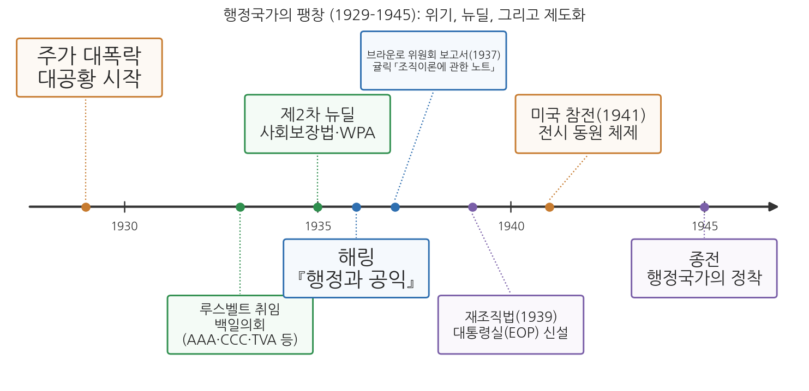
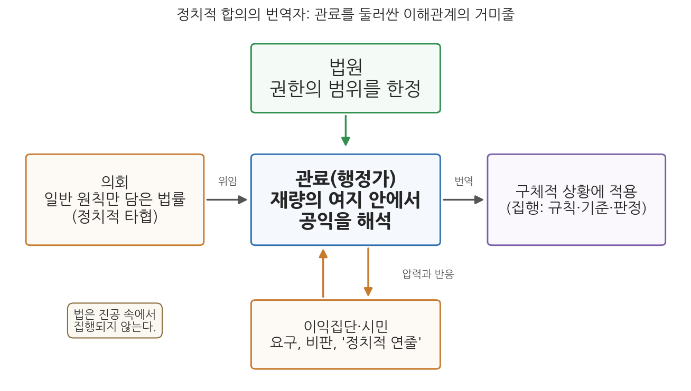

# 9주차 1차시. 행정국가의 제도화 (1): 해링의 관료제와 공익

> 공익은 법을 집행하는 행정가를 인도하는 기준이며, 행정에 통일성과 질서와 객관성을 들여오기 위해 고안된 언어적 상징이다. (펜들턴 해링, 『행정과 공익』)

## 이 장에서 배우는 것

어느 시청의 환경 담당 주무관을 상상해 보자. 의회가 만든 법에는 "사업장은 주변 환경에 현저한 피해를 주어서는 아니 된다"라고만 적혀 있다. 그런데 오늘 책상 위에는 정반대의 민원 두 장이 놓여 있다. 공장 주변 주민들은 "소음과 분진이 심하니 조업을 제한해 달라"고 요구하고, 공장 측은 "기준을 다 지켰는데 조업을 막으면 수십 명이 일자리를 잃는다"고 호소한다. 법조문 어디에도 "현저한 피해"가 데시벨 몇부터인지, 일자리와 조용한 밤 중 무엇이 먼저인지는 적혀 있지 않다. 결정은 주무관의 몫이다. 이 주무관은 지금 무엇을 기준으로 판단해야 하는가.

1936년, 미국의 정치학자 펜들턴 해링은 바로 이 상황이 현대 행정의 본질이라고 보았다. 의회가 만든 법률은 정치적 타협의 산물이라 일반 원칙만 담고 있고, 그 빈칸을 구체적 상황에서 메우는 일, 곧 재량의 행사는 관료에게 맡겨진다. 그렇다면 관료를 이끄는 기준은 무엇인가. 해링의 대답이 공익(public interest)이다. 그런데 그 대답은 뜻밖에도 정직하다. 공익은 측량할 수 없고, 각 공무원이 스스로 그 의미를 찾아내야 한다는 것이다. 7주차에서 베버의 이념형 관료제와 화이트의 관리 중심 행정학을 읽었다면, 이 장에서는 대공황과 뉴딜로 거대해진 행정국가 안에서 관료가 실제로 어떤 위치에 서게 되었는지를 읽는다.

이 장에서는 구체적으로 다음을 배운다.

- 대공황과 뉴딜이 행정국가를 어떻게 팽창시켰는지, 그리고 뉴딜 기관들이 실제로 어떤 재량을 행사했는지
- 해링이 말한 "정치적 합의의 번역자"로서의 관료의 위치
- 공익 개념의 기능과 그 주관성, 그리고 재량에 따르는 책임
- 관료가 이익집단과 어떤 관계를 맺어야 하는지에 대한 해링의 처방
- 윌슨과 굿나우의 정치-행정 이원론이 왜 유지되기 어려워졌는지
- 행정재량과 책임이라는 문제가 오늘날 한국과 미국의 제도와 사례에서 어떻게 나타나는지

<strong>이 장의 로드맵</strong> 
이 장은 하나의 질문을 따라 전개된다. <em>"법이 다 정해 주지 않는 곳에서, 관료는 무엇을 기준으로 판단해야 하는가?"</em>  
<strong>1.1</strong> 대공황과 뉴딜이 만든 행정국가의 팽창을 본다 →
<strong>1.2</strong> 펜들턴 해링이라는 사상가를 만난다 →
<strong>1.3</strong> 원전 강독 1: 정치적 합의를 번역하는 관료와 재량 →
<strong>1.4</strong> 원전 강독 2: 민주주의와 거대 관료제의 역설 →
<strong>1.5</strong> 원전 강독 3: 공익이라는 기준, 이해관계의 거미줄, 이익집단과의 협력 →
<strong>1.6</strong> 정치-행정 이원론의 붕괴와 행정법의 응답을 정리한다 →
<strong>1.7</strong> 행정재량과 책임이라는 현대적 함의를 한국과 미국의 사례로 짚는다.

## 1.1 대공황과 뉴딜: 행정국가는 왜 팽창했는가

### 1929년, 시장이 무너지다

1929년 10월 뉴욕 증권시장의 주가가 폭락했다. 은행이 연쇄적으로 문을 닫았고, 공장이 멈췄으며, 1933년 무렵에는 미국 노동자 네 명 중 한 명이 일자리를 잃은 상태였다. 4주차에서 보았듯 19세기 미국인은 "가장 적게 다스리는 정부가 가장 좋은 정부"라는 관념 속에 살았고, 연방정부는 작았다. 그러나 대공황은 이 관념의 설득력을 근본적으로 약화시켰다. 개인의 근면으로도, 자선단체의 구호로도, 주정부의 재정으로도 감당할 수 없는 규모의 재난 앞에서, 사람들은 연방정부가 나서기를 요구하기 시작했다.

1933년 3월 취임한 프랭클린 루스벨트 대통령은 뉴딜(New Deal)이라 불리는 일련의 개입 정책으로 응답했다. 당시 미국에는 연방 차원의 실업보험도 노령연금도 없었다. 취임 직후의 이른바 백일의회에서 농업조정청(AAA), 민간자원보존단(CCC), 테네시계곡개발공사(TVA) 같은 기관이 잇달아 만들어졌고, 1935년에는 사회보장법과 공공사업진흥청(WPA)이 뒤따랐다. 사람들은 머리글자 약칭으로 불리는 이 기관들을 "알파벳 기관(alphabet agencies)"이라 불렀다. 규제, 구호, 개발, 보험까지, 과거에 민간의 일이거나 아예 누구의 일도 아니었던 영역이 연방 행정의 일이 되었다.

기관이 늘었다는 사실보다 더 중요한 것은 이 기관들이 일하는 방식이었다. 농업조정청의 경우를 보자. 농산물 가격 폭락에 대응해 의회는 생산을 줄여 가격을 회복시킨다는 원칙을 정했다. 농업조정청은 농민과 자발적 계약을 맺어 경작 면적을 줄이게 하고 그 대가로 보상금을 지급했다. 그런데 어느 농가가 얼마를 줄이고 얼마를 받을지는 법률이 정할 수 없었다. 농업조정청은 주, 카운티, 지역 단위의 위원회를 두고 카운티 농업지도원과 농민 위원회가 사업을 운영하게 했다. 농민들이 직접 위원을 뽑았다. 법률의 일반 원칙이 현장의 수많은 개별 결정으로 바뀌는 과정, 그리고 그 과정에 이해 당사자인 농민 집단이 직접 들어와 있는 구조가 뉴딜 행정의 전형적인 모습이었다. 해링이 관찰한 것이 바로 이런 현실이다.

그림 9-1을 읽는 법은 이렇다. 가로축은 1929년부터 1945년까지의 시간이고, 기준선 위아래의 상자가 주요 사건이다. 주황색은 위기(대공황, 참전), 초록색은 뉴딜 정책, 파란색은 이번 주에 읽는 텍스트(해링 1936, 귤릭 1937), 보라색은 제도화의 결과(재조직법과 대통령실 신설, 행정국가의 정착)를 나타낸다. 여기서 알 수 있는 것은 순서다. 먼저 위기가 왔고, 정부 기능이 급격히 늘었으며, 그 다음에야 "이 거대해진 행정을 어떻게 이해하고 어떻게 조직할 것인가"라는 이론적·제도적 응답이 나왔다. 해링의 『행정과 공익』(1936)과 다음 차시에 읽을 귤릭의 조직이론(1937)은 바로 이 응답에 해당한다.

### 행정국가라는 새 현실

이렇게 정부의 역할이 입법·사법보다 행정을 중심으로 커지고, 국민 생활의 넓은 영역이 행정기관의 결정에 좌우되는 국가를 행정국가(administrative state)라 부른다. 행정국가에서 국민의 삶에 실제로 영향을 미치는 결정의 상당수는 의사당이 아니라 관청에서 내려진다. 어떤 농가가 보조금을 받을지, 어떤 방송국이 주파수를 받을지, 어떤 공장이 규제를 받을지를 정하는 것은 법률의 일반 조항이 아니라 그것을 적용하는 행정기관이기 때문이다.

### 의회는 얼마나 넘겨줄 수 있는가: 셰크터 판결(1935)

행정국가의 팽창은 의회가 입법권을 행정부에 어디까지 넘겨줄 수 있는가라는 헌법 문제를 낳았다. 1935년 연방대법원은 전국산업부흥법(NIRA, 1933)에 따른 업종별 공정경쟁 규약 조항을 이른바 "병든 닭 사건(sick chicken case)", 곧 셰크터 사건에서 만장일치로 위헌이라고 판결했다. 이 법이 어떤 업종에도 행위의 기준을 정해 주지 않고 규칙을 만들 권한을 그대로 넘겨주었으므로, 헌법이 의회에 맡긴 입법권을 행정부에 위헌적으로 위임한 것이라고 법원은 보았다.

이 판결은 이 장의 주제와 관련해 두 가지를 보여 준다. 첫째, 법원은 행정의 재량에 한계를 긋는 실제적인 힘이었다. 해링이 법원을 관료를 둘러싼 이해관계 속의 최종 결정자 가운데 하나로 꼽는 것도 이런 시대 상황과 맞물려 있다. 둘째, 그럼에도 위임 자체는 사라지지 않았다. 연방대법원이 위임의 한계를 넘었다는 이유로 법률을 무효로 한 것은 같은 해의 파나마 정유 판결과 이 판결, 단 두 번뿐이었고, 그 뒤 법원은 의회가 일반적 정책 방향과 그것을 적용할 기관, 위임 권한의 경계를 밝혀 두기만 하면 넓은 위임도 받아들였다. 남은 질문은 위임을 할 것인가가 아니라 위임받은 재량을 행정가가 어떻게 행사하는가였고, 해링의 책은 바로 이 질문을 다룬다.

### 이론의 공백: 집행이 곧 선택이 되다

헌법의 문제와 함께 이론의 문제도 있었다. 이 팽창이 기존의 행정학 이론과 잘 맞지 않았다는 점이다. 5주차에서 읽은 윌슨과 굿나우의 정치-행정 이원론을 떠올려 보자. 정치는 국가의지를 표출하고 행정은 그것을 집행할 뿐이라는 구도에서, 관료는 정해진 의지를 수행하는 중립적 도구였다. 그러나 알파벳 기관의 관료들은 "공익, 편의 또는 필요"라는 법조문 한 줄을 들고 누구에게 면허를 주고 누구를 규제할지 결정하고 있었다. 집행이 곧 선택이고, 선택이 곧 정치적 결과를 낳는 현실이 분명해진 것이다. 이 현실을 정면으로 이론화한 사람이 펜들턴 해링이다.

## 1.2 펜들턴 해링: 정치와 행정의 접점을 탐구한 학자

<strong>인물 · 펜들턴 해링(E. Pendleton Herring, 1903-2004)</strong> 
미국의 정치학자로, 1903년 볼티모어에서 의사의 아들로 태어났다. 존스홉킨스대학교에서 1925년 영문학 학사를, 1928년 정치학 박사학위를 받았고 프랭크 굿나우에게 헌법학을 배웠다. 1928년 가을 하버드대학교 정치학부에 들어갔고, 1936년 신설된 하버드 행정대학원의 간사를 맡아 교육과정을 만들었다. 『전쟁의 충격』(1941)을 계기로 페르디난드 에버스타트와 함께 군과 정보기관의 통합안을 설계했고, 그 공로로 1946년 해군 공로민간인상을 받았다. 1945년 하버드를 떠난 뒤 1948년부터 1968년까지 사회과학연구협의회 총재를 지내며 연구 지원 규모를 네 배로 키웠다. 1952-53년 미국정치학회 회장을 맡았고 이후 우드로윌슨재단 회장으로 국제학술센터 설립을 추진했다. 1979년 찰스 메리엄상과 1987년 제임스 매디슨상을 받았으며 2004년 프린스턴 자택에서 100세로 사망했다. 
대표 저술: 『의회 앞의 집단 대표(Group Representation Before Congress)』(1929), 『행정과 공익』(1936), 『민주주의의 정치(The Politics of Democracy)』(1940), 『전쟁의 충격(The Impact of War)』(1941)

해링은 1934년 논문 「사회 세력과 연방 관료제의 재조직」에 이어 1936년 『행정과 공익(Public Administration and the Public Interest)』을 내놓았다. 관료제의 재량, 조정, 정당성이라는 문제를 "공익"이라는 개념으로 수렴시킨 것이 이 책의 핵심 기여다.

해링의 첫 책이자 박사학위논문인 『의회 앞의 집단 대표』(1929)는 미국 이익집단에 관한 최초의 본격적인 학술 연구로 평가된다. 그는 이 책에서 의회를 상대로 활동하는 압력단체들을 분석하고, 일회적인 청탁을 넘어 더 상설적이고 정교한 방식으로 정책에 영향을 미치려는 집단 활동을 "새로운 로비(new lobbying)"라 불렀다.

『행정과 공익』이 나온 1936년에 그는 연방 규제위원회 위원들의 경력과 자격을 분석한 『연방 위원들(Federal Commissioners)』도 펴냈다. 두 책 모두 같은 질문을 향한다. 의회가 넘겨준 권한을 실제로 행사하는 사람들은 누구이며, 그들은 어떤 기준으로 판단하는가. 의회 앞에서 활동하는 이익집단을 연구하던 학자가, 이제 그 이익집단이 의회 다음으로 찾아가는 곳, 곧 행정기관으로 시선을 옮긴 것이다.

7주차에서 읽은 레너드 화이트의 『행정학 입문』(1926)과 비교하면 해링의 위치가 더 분명해진다. 화이트는 행정을 관리의 문제로 정의하면서 목적 형성의 문제를 의도적으로 정의 밖에 두었다. 그 결과 행정학은 정치학과 구별되는 제 영역을 얻었지만, 행정이 목적 형성에 참여하는 현실은 설명하지 않은 채 남겨 두었다. 해링은 바로 그 미뤄 둔 질문에서 출발한다.

해링의 출발점은 앞선 이론가들과 다르다. 윌슨과 굿나우가 정치와 행정을 나누는 데서 출발했고 테일러와 화이트가 관리의 능률에서 출발했다면, 해링은 이익집단이라는 정치의 현실에서 출발한다. 그가 본 미국 정치는 농민, 노동자, 기업, 소비자 같은 집단들이 저마다 정부를 자기편으로 끌어들이려 경쟁하는 영역이었다. 그리고 그 경쟁의 결과물인 법률이 집행 단계로 넘어가는 시점부터가 그의 관심사였다. 이제 원전을 직접 읽어 보자. 아래 발췌는 『행정과 공익』에서 뽑은 것이다.

## 1.3 원전 강독 1: 정치적 합의를 번역하는 관료

### 의회는 원칙을 만들고, 관료는 빈칸을 메우며 재량의 책임을 진다

<strong>원전 읽기 · 펜들턴 해링, 『행정과 공익』(1936)</strong> 
"입법 과정에서 도달한 경제적·사회적 타협을 실제로 작동하는 것으로 만들고, 집단 사이의 차이를 조정하는 부담의 큰 몫은 관료의 어깨에 놓여 있다. 의회는 일반 원칙을 선언한 법률을 만든다. 세부 사항은 추가 규정으로 메워야 한다. 그 법을 적용해야 할 조건이 무엇인지 판단하는 일은 관료에게 맡겨진다. 이 임무를 수행하는 데에는 관료가 입법자보다 유리한 자리에 서 있다. 관료의 일상 업무는 법이 겨냥하는 상황과 직접 맞닿아 있기 때문이다. (…) 행정 재량이 커지면 규칙을 구체적 상황에 더 사려 깊게 적용할 수 있다. 그러나 그만큼 행정가가 짊어지는 책무도 무거워진다. 법률의 문구는 행정가가 움직일 수 있는 범위를 한정하지만, 그 재량의 여지 안에서 행정가는 국가 목적에 대한 자신의 해석을 기록해야 한다."

무슨 말인가. 이 발췌는 세 단계의 논증으로 읽을 수 있다. 첫째 전제는 법률이 정치적 타협의 산물이라는 것이다. 여러 집단의 요구가 부딪히는 입법 과정에서 세부까지 합의하려 하면 법 자체가 통과되지 못하는 경우가 많으므로, 법률은 모두가 동의할 수 있을 만큼 일반적인 원칙에서 멈추고 해소되지 않은 갈등은 집행 단계로 넘어간다. 해링이 관료가 "집단 사이의 차이를 조정하는 부담"을 진다고 할 때 그 차이란 입법 과정에서 해소되지 못하고 남은 갈등을 가리킨다. 둘째, 그 갈등을 처리하려면 누군가 법을 적용할 조건을 판단해야 한다. "현저한 피해를 주어서는 아니 된다"는 문구가 현실에서 작동하려면 "이 사업장의 이 소음은 현저한 피해인가"를 판단하는 사람이 있어야 하고, 그 일이 관료에게 맡겨진다. 셋째, 관료가 그 일을 맡는 것은 일상 업무가 법이 겨냥하는 상황과 맞닿아 있어 현장 사정을 입법자보다 잘 알기 때문이다. 이 장의 도입 사례에서 주무관이 하던 일이 바로 이것이며, 해링의 표현을 빌리면 관료는 정치적 합의의 번역자다.

이 구조는 오늘날 한국의 법령 체계에서도 그대로 확인된다. 한국의 법률은 많은 사항을 "대통령령으로 정한다", "부령으로 정한다"고 하여 시행령과 시행규칙에 넘기고, 시행령과 시행규칙은 다시 세부 기준을 고시나 훈령 같은 행정규칙에 맡긴다. 국회가 정하는 것은 기본 원칙과 주요 사항이고, 실제로 국민에게 적용되는 숫자와 요건과 절차의 상당 부분은 행정부가 만든다. 행정학과 행정법학에서 이를 위임입법이라 부른다. 해링이 말한 "추가 규정으로 메워야 하는 세부 사항"이 바로 이것이다.

재량(discretion)은 법이 정해 주지 않은 부분에서 행정가가 스스로 판단할 수 있는 여지다. 해링은 재량의 양면을 함께 본다. 재량은 획일적 규칙을 기계적으로 적용할 때 놓치는 구체적 상황의 차이를 헤아린 적용을 가능하게 한다는 점에서 능력이고, 그 안에서 내리는 판단 하나하나가 국가의 목적이 무엇인가에 대한 행정가 자신의 해석을 기록으로 남긴다는 점에서 부담이다. 법률의 문구가 행정가의 움직임을 한정하더라도 그 범위 안의 선택은 여전히 행정가의 몫이다.

재량이 실제로 어떻게 작동하는지 일상의 예로 확인해 보자. 사회복지 담당 공무원이 생계 지원을 신청한 사람의 자격을 심사한다고 하자. 소득과 재산의 기준선은 법령에 숫자로 정해져 있다. 그러나 신청인이 일할 능력이 있는지, 가족이 실제로 부양을 하고 있는지, 서류에 드러나지 않는 사정이 있는지는 담당자가 상담과 현장 확인을 통해 판단해야 한다. 같은 기준을 가진 두 공무원이 같은 신청인을 두고 다른 결론에 이를 수 있다. 엄격하게 적용하면 예산은 아끼지만 도움이 필요한 사람이 빠질 수 있고, 너그럽게 적용하면 사각지대는 줄지만 형평성 시비가 생길 수 있다. 어느 쪽을 택하든 그 선택은 "이 제도는 무엇을 위해 있는가"에 대한 담당자의 해석을 드러낸다. 해링이 말한 "국가 목적에 대한 자신의 해석을 기록"하는 일이 창구에서 매일 일어나는 것이다.

왜 중요한가. 이 발췌는 "행정은 정해진 의지의 집행일 뿐"이라는 5주차 이원론의 구도를 안에서부터 무너뜨린다. 번역은 기계적 작업이 아니어서 어떤 단어를 고르느냐에 따라 뜻이 달라지듯, 관료가 빈칸을 어떻게 메우느냐에 따라 법의 실제 효과가 달라지기 때문이다. "자신의 해석을 기록해야 한다"는 구절은 관료의 판단이 사적인 의견으로 끝나지 않고 국가의 이름으로 집행되어 누군가의 권리와 생계를 바꾼다는 뜻이다. 판단하지 않는 것, 곧 집행하지 않는 것 역시 하나의 선택이므로 판단을 피할 길도 없다. 재량이 있는 곳에 책임의 문제가 따라온다는 이 통찰은 마지막 절에서 다시 다룬다. 이 발췌를 관료가 법을 자기 뜻대로 바꾼다는 주장으로 읽는 것은 흔한 오독이다. 해링은 법률의 문구가 행정가의 범위를 한정한다고 분명히 적었고, 재량이 법의 빈칸에서 생기며 그 빈칸을 메우는 일이 불가피하다는 구조를 서술했을 뿐이다. 7주차의 화이트가 목적 형성의 문제를 행정의 정의 밖에 둔 자리에서, 해링은 바로 그 빈칸이 집행 단계에서 채워진다고 말한다.

<strong>정의 · 기속행위와 재량행위</strong> 
행정법학은 법률이 행정에 판단의 여지를 얼마나 주는지에 따라 행정의 행위를 나눈다. <strong>기속행위</strong>는 법률의 요건이 충족되면 행정청이 반드시 법률이 정한 행위를 해야 하는 경우로, 행정청에게 선택의 여지가 없다. <strong>재량행위</strong>는 요건이 충족되더라도 행위를 할지 말지, 또는 여러 행위 가운데 무엇을 할지를 행정청이 선택할 수 있는 경우다. 법률이 "할 수 있다"고 규정하거나 "공익상 필요한 경우" 같은 불확정 개념을 쓰면 재량이 생기는 경우가 많다. 해링이 다루는 것은 이 가운데 재량행위의 영역이다.

이 구분을 알면 해링의 논점이 더 정확히 보인다. 윌슨과 굿나우의 이원론이 상정한 행정은 기속행위에 가까웠다. 정치가 의지를 정하면 행정은 그것을 확인해 적용한다는 구도이기 때문이다. 그러나 뉴딜 기관들의 업무는 대부분 재량행위의 영역에 속했다. 어떤 방송국에 주파수를 줄지, 어떤 업종의 규약을 승인할지, 어느 지역에 댐을 지을지는 법조문에서 기계적으로 도출할 수 없었다. 해링은 이 변화를 예외가 아니라 현대 행정의 기본 조건으로 받아들였다.

## 1.4 원전 강독 2: 민주주의와 거대 관료제의 역설

### 자유민주국가는 관료제가 떠받친다

<strong>원전 읽기 · 펜들턴 해링, 『행정과 공익』(1936)</strong> 
"민주주의는 적절한 행정 조직을 발전시켜야만 살아남을 수 있다. 따라서 우리는 민주국가의 목적이 집단 이익의 자유로운 조정이며, 이 목적을 이루려면 거대한 행정 기계를 발전시켜야 한다는 결론에 이른다. 제퍼슨식 민주주의자에게는 역설로 들리겠지만, 자유민주국가는 거대한 관료제가 떠받쳐야 한다. 그러나 이런 관점은 널리 받아들여지지 못했다."

무슨 말인가. 이 발췌의 논증은 세 단계다. 먼저 해링에게 민주국가의 목적은 농민과 기업, 노동과 자본 같은 집단 이익의 자유로운 조정이다. 다음으로 이 조정을 실행하려면 경찰과 공중위생에서 공영 사업과 대규모 구제 사업까지 막대한 공공 서비스가 필요하고, 그 서비스는 크고 전문화된 행정 조직 없이는 제공될 수 없다. 그러므로 거대한 관료제는 민주주의의 존립 조건이라는 결론이 나온다. 토머스 제퍼슨 이래 미국 민주주의의 통념은 정부가 작을수록 자유가 크다는 것이었으므로, 이 결론은 통념을 뒤집는 것이며 해링 스스로 "제퍼슨식 민주주의자에게는 역설로 들리겠지만"이라는 단서를 단다.

왜 중요한가. 이 명제는 관료제를 민주주의가 견제할 대상으로만 보는 통념에 맞선다. 해링은 정부가 어떤 일을 얼마나 할지는 특정 시점에 정부를 장악한 경제 집단의 성격에 따라 달라진다고 본다. 농민 세력이 강하면 농업 지원이, 노동 세력이 강하면 노동 보호가 늘어나는 식이다. 그러나 어떤 집단의 연합이 정부를 장악하든 우편 배달, 공중위생, 연금 지급처럼 정권 교체와 상관없이 이어져야 하는 책임이 남고, 거대한 행정 조직의 존재는 그 연속성을 요구한다. 그래서 그는 각 집단이 국가가 자기들의 즉각적 목적을 넘어서는 목적을 가진다는 점을 인정해야 한다고 말한다.

이 연속성의 논리는 직업공무원제의 근거와 직접 연결된다. 정권이 바뀔 때마다 공무원이 통째로 바뀌는 엽관제 아래에서는 행정의 연속성이 보장되지 않는다. 4주차에서 본 펜들턴법(1883) 이후 미국이 실적제를 확대해 온 것도, 한국 헌법 제7조가 "공무원은 국민전체에 대한 봉사자"라고 규정하고 공무원의 신분과 정치적 중립성을 법률로 보장하도록 한 것도, 같은 요청에 대한 제도적 응답이다. 해링의 논점은 여기서 한 걸음 더 나아간다. 관료제의 연속성은 단지 행정 능률의 문제가 아니라, 집단 간 이익 경쟁이 계속되는 민주주의가 국가로서의 일관성을 유지하는 조건이라는 것이다.

해링은 이 관점이 널리 받아들여지지 못한 이유를 시민의 이중성에서 찾는다. 시민들은 국가가 사적 영역에 개입한다고 비난하면서도 정작 자신들에게는 정부의 특별한 배려를 요구해 왔다. 도움은 청하되 통제는 거부하는 이 태도 탓에 연방 행정은 통합된 전체가 되지 못하고 서비스 기관, 독립 규제위원회, 균형이 맞지 않는 관서와 부처들의 "뒤범벅"이 되었고, 해법은 기관을 더 만드는 것이 아니라 기존의 것들을 재조직하는 데 있다고 그는 진단한다. 이 재조직이라는 과제는 다음 차시의 귤릭과 브라운로 위원회로 이어진다.

이 명제를 관료제 예찬으로 읽는 것은 흔한 오독이다. 해링은 권위가 기본적으로 여러 집단에서 나오므로 그 집단들이 합심해 반대할 때 관료제가 국가 목적을 내세워 버틸 수는 없다고 적는다. 관료제는 민주주의의 존립 조건이지만 민주주의 위에 군림하는 권력이 될 수는 없다는 것이다. 7주차에서 읽은 베버가 관료제의 기술적 우월성에 주목했다면, 해링은 이익집단 정치라는 미국의 현실 속에서 관료제가 어떻게 정당성을 얻을 수 있는지를 물은 것이다.

### 입법의 열기는 식고, 집행의 부담은 남는다

<strong>원전 읽기 · 펜들턴 해링, 『행정과 공익』(1936)</strong> 
"입법부는 일시적인 대중의 열기에 힘입어 법을 통과시키는 것으로 임무를 마치고, 다른 사안으로 관심을 돌린다. 그리하여 불만에 찬 집단을 상대로 그 법을 집행하는 일은 관료에게 맡겨진다. 입법 의지는 법이 바뀔 때까지 얼어붙어 있다. (…) 그러나 공무원의 법적 책임은 그대로 남으며, 공무원이 받는 비난은 자신의 명백한 임무를 수행한 대가가 된다."

무슨 말인가. 이 발췌는 법이 만들어지는 시간과 집행되는 시간이 어긋난다는 점을 짚는다. 법은 어떤 사건으로 여론이 높아졌을 때 그 관심 속에서 통과되지만, 열기가 식고 의회가 다음 사안으로 옮겨 가도 법은 개정되기 전까지 "얼어붙은" 채 남는다. 그동안 경제적·정치적 조건이 바뀌어 법에 대한 불신이 자라나더라도 개정이 자동으로 뒤따르지는 않으며, 관료는 상황이 바뀐 뒤에도 그 법을 규제받는 집단에게 계속 집행해야 한다. 그러므로 규제받는 집단의 원망은 법을 만든 의원이 아니라 법을 집행하는 공무원에게 쏟아진다.

왜 중요한가. 이 대목은 관료를 향한 비난의 구조를 드러낸다. 해링은 허먼 파이너의 말을 인용하며 대중이 어느 나라에서나 관리를 적대시한다고 인정한다. 관리는 "주러 오는 것이 아니라 빼앗으러 오는" 존재로 경험되기 때문이다. 여기에 식민지 시절부터 이어진 정부 불신의 전통과, 시민이 관료제에 맞서는 주된 수단이 여전히 "정치적 연줄(political pull)"이라는 미국 특유의 사정이 겹친다. 이 구절을 관료가 억울한 피해자라는 하소연으로 읽는 것은 오독이다. 해링이 겨냥하는 것은 입법 의지는 얼어붙고 법적 책임만 남는 구조이며, 이 구조 때문에 집행의 재량과 책임이 관료에게 쌓인다는 점이다.

이 발췌 앞에서 해링은 시민이 정부의 각 부분을 통제할 수 있는 경로를 비교한다. 선출된 대통령과 의회는 선거라는 정치적 경로로, 법원은 법치의 전통으로 신뢰를 얻는다. 실제로 법원은 관료 권력에 맞서 시민의 편을 드는 일이 잦고, 앞에서 본 1935년의 셰크터 판결이 그 사례다. 그러나 행정 작용의 방향에 영향을 미칠 경로는 분명하지 않다. 정부 활동이 자기 목표와 맞을 때 특별 이익집단은 아무 문제도 제기하지 않지만, 다른 방향을 향할 때는 "관료적 간섭"이라는 비난이 일어난다는 것이 해링의 관찰이다.

"얼어붙은 입법 의지"라는 해링의 표현은 오늘날 한국에서도 확인할 수 있다. 2019년 9월 충남 아산의 어린이보호구역에서 김민식 군이 교통사고로 숨진 뒤, 이른바 "민식이법"이 같은 해 12월 10일 국회 본회의를 통과해 2020년 3월 25일부터 시행되었다. 이 법은 두 법률의 개정으로 이루어졌다. 도로교통법 개정은 지방자치단체장이 어린이보호구역에 과속 단속 카메라와 신호기 같은 안전시설을 우선 설치하도록 했고, 특정범죄 가중처벌 등에 관한 법률 개정은 어린이보호구역에서 어린이를 사상케 한 운전자를 가중처벌하도록 했다. 법안은 사고 이후 높아진 여론 속에서 빠르게 처리되었고, 통과 직후부터 형량이 과도하다는 비판과 아이들의 안전을 위해 불가피하다는 반론이 맞섰다.

이 사례를 해링의 눈으로 보면, 법의 옳고 그름과는 별개로 집행의 구조가 보인다. 국회의 입법은 본회의 의결로 끝났지만, 단속 장비를 설치하고 운영하는 일은 지방자치단체와 경찰에게 넘어왔다. 단속을 받거나 처벌 가능성을 우려하는 운전자들의 불만은 법을 만든 국회보다 현장에서 단속하는 기관과 공무원을 먼저 향한다. 여론의 관심이 다른 사안으로 옮겨 간 뒤에도 공무원은 같은 법을 같은 기준으로 집행해야 한다. 해링이 1936년에 묘사한 구조, 곧 입법의 열기는 식어도 집행의 부담은 남는 구조가 90년 가까이 지난 지금도 반복되는 것이다. 이 사례는 법을 만드는 일과 그 법이 오랜 기간 현장에서 받아들여지게 하는 일이 서로 다른 과제라는 점을 보여 준다.

## 1.5 원전 강독 3: 공익이라는 기준과 이해관계의 거미줄

### 공익은 측량할 수 없는 언어적 상징이다

해링은 공익 개념을 꺼내기 전에 문제를 먼저 정리한다. 오늘날의 정부는 상당 부분 전문가가 수행하는 행정이며 행정부에는 점점 더 많은 권한과 재량이 주어지는데, 어떤 집단이 자기 목적을 자유롭게 추구할 권리와 공동체 전체의 더 넓은 목적이 충돌하는 지점은 개별 사안마다 판단해야 하고 공무원에게는 그 판단을 위한 명확한 행동 기준이 없다. 해링이 이 상황을 "막대한 권한을 쌓았지만 방향과 조정이 결여된" 관료제라고 요약한 다음 던지는 질문이 아래 발췌의 첫 문장이다.

<strong>원전 읽기 · 펜들턴 해링, 『행정과 공익』(1936)</strong> 
"행정가를 이끌 기준은 무엇인가? 법을 집행하는 행정가를 인도하는 기준은 공익이다. 공익은 행정에 통일성과 질서와 객관성을 들여오기 위해 고안된 언어적 상징이다. 이 개념은 사법부에서 '적법절차' 조항이 하는 역할을 관료제에서 맡는다. 추상적 의미는 모호하지만, 적용의 파급효과는 넓다. (…) 공익을 기준으로 내세우는 것은 측량할 수 없는 것을 내미는 일이다. 공익의 가치는 심리적인 것이어서, 책임 있는 공무원 각자가 그 말 속에서 스스로 찾아내는 의미를 넘어설 수 없다. 이 주관적 개념에 따라, 그리고 자신의 법정 권한의 한계 안에서, 관료는 눈앞의 특수 이익들 가운데 공식 승인을 부여할 조합을 고른다. 그래서 실천에서는 공익 개념이 특정 집단의 이익과 동일시되면서 비로소 실체를 얻는다. 공무원은 국민투표로 자신의 판단을 시험해 보는 위안도 없이, 공익에 따라 행동하려 애써야 한다. 눈앞의 함정을 밝혀 줄 빛이 거의 없는 채로, 자신의 별을 따라가야 하는 것이다."

무슨 말인가. 이 발췌는 재량의 여지 안에서 판단해야 하는 관료에게 법이 쥐여 주는 기준이 공익이라는 점과, 그 공익의 내용을 알 수 없다는 점을 잇달아 말한다. 먼저 공익은 언어적 상징(verbal symbol)이다. 미리 주어진 실체가 아니라 행정에 일관성과 객관성이라는 규율을 부여하기 위해 고안된 말이라는 뜻이다. 실제로 당시 미국 의회는 라디오위원회에 "공익, 편의 또는 필요"에 따라, 연방거래위원회에 "공익에 부합한다"고 판단할 때 법을 적용하라고 권한을 주었다.

라디오위원회의 사례는 이 모호한 기준이 어떻게 구체화되는지 보여 준다. 1927년 라디오법은 연방라디오위원회를 만들고 방송 면허를 받으려면 그 방송이 "공익, 편의 또는 필요"에 부합해야 한다고 정했지만, 무엇이 부합하는지는 정의하지 않았다. 캔자스주의 방송국 KFKB는 의사 존 브링클리가 청취자의 편지에 적힌 증상만으로 방송에서 약을 처방하던 곳이다. 위원회는 1930년 면허 갱신을 거부했고, 1931년 컬럼비아 특별구 항소법원은 이 결정을 지지했다. 법조문에 의료 상담 방송을 금지하는 규정이 없는데도 위원회는 공익이라는 일반 기준을 적용해 방송이 소유주의 사업 수단이 아니라 공적 성격을 가진다는 해석을 만들어 냈고, 법원이 그 해석을 받아들인 것이다. 해링이 공익을 "적법절차"에 견준 이유가 여기 있다. 적법절차의 내용이 개별 판결이 쌓이며 구체화되듯, 공익의 내용도 개별 행정 결정과 그에 대한 사법 심사가 쌓이며 구체화된다.

다음으로 해링은 이 상징의 내용을 누가 채우는지 묻는다. 공익은 객관적 측정 수단이 아니어서 상충하는 집단들의 요구를 비교해 우열을 가릴 기준이 되지 못하고, 그 내용은 판단하는 공무원 각자가 그 말 속에서 찾아내는 의미에 그친다. 해링이 공익의 가치를 "심리적인 것"이라 한 것은 그가 이익집단 정치의 관찰자였기 때문이다. 농민 보조금도, 기업 규제도, 규제 완화도 저마다 공익의 이름으로 요구되는 현실에서 모두가 공익을 말하는데 내용이 제각각이라면, 공익은 판단하는 사람의 마음속에서 구성되는 것으로 보는 편이 정직하다. 그래서 관료가 고른 조합은 실천에서 언제나 특정 집단들의 이익과 결합한 모습으로 나타난다. 해링은 여기서 루소를 끌어온다. 루소가 상정한 시민은 일반의지에 따라 투표하고, 개표 결과 자신이 소수임을 알면 일반의지를 잘못 짐작했음을 깨닫는다. 그러나 관료에게는 그런 개표가 없다. 자기 판단이 공익에 맞았는지 확인해 줄 "관료적 국민투표"의 위안 없이 자신의 별을 따라가야 한다.

왜 중요한가. 이 구절은 공익 개념에 대한 냉소가 아니라 공직이 놓인 조건에 대한 서술이다. 해링은 공익 기준을 버리자고 하지 않으며 버릴 수도 없다고 본다. 다만 그 기준이 판단을 대신해 주지 않고, 판단의 부담이 결국 개별 공무원의 해석에 놓인다는 사실을 직시하자는 것이다. 공익을 "상징"이라 부른 것도 공익을 깎아내리는 말이 아니라 공익이 실제로 작동하는 방식을 정확히 기술하려는 시도다. 공익이 주관적이라는 말을 여론이 곧 공익이라는 뜻으로 읽는 것은 흔한 오독이다. 루소의 시민은 투표로 확인받지만 관료에게는 그런 확인 절차가 없고, 다수의 일시적 선호가 곧 공익이라면 소수의 권리나 장래 세대의 이익처럼 당장 표로 드러나지 않는 이익을 고려할 근거가 사라진다. 여론은 공익 판단의 중요한 자료이지만 판단 자체를 대신하지는 못한다. 2주차에서 읽은 공자의 통치자 자격론이 "다스리는 자의 수신"을 물었다면, 해링은 2천 년 뒤의 관료제 안에서 같은 물음이 다시 제기되는 모습을 보여 준다.

공익을 둘러싼 행정학의 오랜 논쟁에는 두 입장이 있다. 공익 실체설은 사익의 단순한 합을 넘어서는 공익이 실제로 존재하며 정의, 공동체 전체의 복지, 인간의 존엄 같은 규범적 가치가 그 내용이라고 본다. 공익 과정설은 선험적 공익을 인정하지 않고, 공익이 여러 집단의 이익이 경쟁하고 타협하는 정당한 절차를 거쳐 나온 결과라고 보므로 그 절차가 공정하고 개방적인지를 중시한다. 해링은 공익이 실천에서 특정 집단들의 이익과 결합해야 실체를 얻는다고 말한다는 점에서 과정설에 가깝지만, 관료가 "자신의 별"을 따라야 하고 각 집단이 국가의 목적이 자기들의 즉각적 목적을 넘어선다는 점을 인정해야 한다고 말한다는 점에서 집단 이익의 합으로 설명되지 않는 무엇을 남겨 둔다. 그의 공익론은 두 입장 중 어느 하나로 분류되기보다 두 입장이 각각 붙잡은 현실을 함께 보여 준다.

### 법은 진공 속에서 집행되지 않는다

<strong>원전 읽기 · 펜들턴 해링, 『행정과 공익』(1936)</strong> 
"실제의 공공행정은, 법적 책임에 대한 자신의 해석에 따라 공적 지위에서 행동하는 한 사람이, 법적으로 종속된 위치에 있는 다른 사람에게 법률을 적용하는 과정이다. 이 과정에 '대중'은 관여하지 않는다. 법을 집행하는 공무원에게 대중은 추상일 뿐이다. (…) 법은 진공 속에서 집행되지 않는다. 그 법의 집행 또는 비집행에 이해를 가진 모든 사람들로 이루어진 환경 속에서 집행된다. 공무원은 이해관계의 거미줄에 둘러싸여 있다. 그리고 그 거미줄을 지배하는 거미는 종종 예측하기 어렵다. 최종 결정자는 법원일 수도, 입법부일 수도, 행정상의 상급자일 수도, 강력한 경제적 이해일 수도 있다. 행정가는 정치적·사회적·경제적 힘이 얽힌 복잡한 망 속의 한 가닥이다."

무슨 말인가. 행정을 아주 가까이에서 들여다보면, 그것은 "정부가 국민에게" 법을 적용하는 일이 아니라 "한 사람이 다른 사람에게" 법을 적용하는 일이다. 그 과정에 "대중"이라는 실체는 등장하지 않는다. 공무원이 실제로 마주하는 것은 민원인, 규제 대상 기업, 업계 단체처럼 뚜렷한 이해와 목소리를 가진 개인과 집단이고, "대중의 반응"이란 그런 개별 반응들 속에서 공무원이 읽어내기로 선택한 무엇일 뿐이다. 그래서 법 집행의 환경은 진공이 아니라 이해관계의 거미줄이며, 관료는 그 거미줄의 바깥에 선 심판이 아니라 그 안에 얽힌 한 가닥이다.

그림 9-2가 이 절의 내용을 한눈에 보여 준다. 가운데의 관료는 왼쪽의 의회로부터 일반 원칙만 담긴 법률을 위임받아, 오른쪽의 구체적 상황에 적용되는 규칙과 판정으로 번역한다. 그러나 이 번역은 진공에서 이루어지지 않는다. 위에서는 법원이 권한의 범위를 한정하고, 아래에서는 이익집단과 시민이 요구와 비판과 연줄로 압력을 가한다. 여기서 알 수 있는 것은 관료의 판단이 순수한 기술적 계산일 수 없다는 점이다. 관료는 정치적 힘들의 한복판에서 공익을 해석한다.

왜 중요한가. "대중은 추상"이라는 명제는 공익 논의가 마주해야 할 냉정한 현실이다. 공무원이 "국민 전체를 위해 일한다"고 말할 때 그 국민 전체는 창구에 나타나지 않고, 나타나는 것은 언제나 특정한 누군가다. 조직되지 않은 다수의 이익은 목소리가 없고 조직된 소수의 이익은 크게 들린다. 그렇다고 해링이 대중을 무시해도 좋다고 말한 것은 아니다. 그가 관료에게 "조직화가 덜 되었거나 덜 공격적인 집단의 의견에까지 손을 뻗을 수도 있다"고 적은 것은, 재량이 목소리가 큰 쪽의 요구를 받아들이는 데도 쓰이지만 들리지 않는 목소리를 찾아 나서는 데도 쓰일 수 있다는 뜻이다.

한국 헌법 제7조는 "공무원은 국민전체에 대한 봉사자이며, 국민에 대하여 책임을 진다"고 규정한다. 해링의 관점에서 보면 이 조항은 사실의 서술이 아니라 과제의 제시다. 국민 전체는 창구에 나타나지 않으므로, 공무원은 눈앞의 민원인과 이해관계자들을 상대하면서도 그 자리에 나타나지 않은 사람들의 이익을 의식적으로 고려해야 한다. 해링 자신도 어떤 공무원도 자기 부서가 접촉하는 집단들의 여론으로부터 격리되어 있다고 여길 수 없으며, 시민 역시 자신의 경험과 전문성이 통치 과정에서 자리를 차지한다고 느껴야 한다고 썼다. 그리고 그는 바로 이어서 "어떻게 상호 이익이 되는 연결을 만들 수 있을까"라고 묻는다. 이 물음에 대한 해링의 답이 다음 발췌다.

### 누구와 손잡을 것인가: 관료와 이익집단의 협력

<strong>원전 읽기 · 펜들턴 해링, 『행정과 공익』(1936)</strong> 
"행정가는 자기 정책을 지지할 기반을 쌓을 수 있고, 어느 정도는 상대할 집단을 고를 수도 있다. 이 선택은 매우 중대한 결과를 낳을 수 있다. 법을 엄격하게 해석하라고 요구하는 집단을 지지하면, 법을 느슨하게 해석하기를 바라는 집단과 협력할 때와는 전혀 다른 최종 결과가 나온다. 행정가는 조직화가 덜 되었거나 덜 공격적인 집단의 의견에까지 손을 뻗을 수도 있다. 이제 관료의 궁지가 분명해진다. 공공복지가 세워지는 토대를 제공하는 것이 바로 특별 이익집단의 관심사인 이상, 그들이 국가의 협의 과정에서 목소리를 내는 것을 부정할 수는 없다. 반면 국가의 목적을 이루려면 잘 조정되고 책임 있는 관료제가 꼭 필요하다. 자유민주국가의 해법은 관료와 특별 이익집단 사이에 실제로 작동하는 협력 관계를 세우는 데 있어야 한다. 관료는 국가 목적을 수행하고, 이익집단은 자기 목적을 실현할 수 있게 하는 관계다."

무슨 말인가. 해링은 재량이 법 해석의 문제에만 그치지 않는다고 말한다. 관료는 어떤 집단과 대화하고 어떤 집단의 지지를 받을지도 어느 정도 선택하며, 이 선택은 법의 실제 효과를 바꾼다. 같은 환경 규제법이라도 집행 기관이 환경단체와 긴밀히 협의하면 엄격하게, 업계와 주로 협의하면 느슨하게 집행될 가능성이 크다. 해링은 이 상황을 "관료의 궁지"라 부른다. 이익집단을 배제할 수는 없다. 공공복지는 농민, 노동자, 기업 같은 구체적 집단들의 이익 위에서 구성되기 때문이다. 그렇다고 이익집단에 끌려갈 수도 없다. 국가의 목적을 이루려면 조정되고 책임 있는 관료제가 있어야 하기 때문이다. 해링의 해법은 둘 중 하나를 고르는 것이 아니라, 관료와 이익집단이 각자의 역할을 하면서 함께 일하는 작동하는 협력 관계를 만드는 것이다.

해링은 이 협력이 미국에서 특히 어렵다고 덧붙인다. 전국의 조건이 지역마다 다르고, 연방 공무원은 강제 권한이 없는 문제에도 관여해야 하며, 많은 연방 서비스의 성공이 주와 지방 당국의 협력에 달려 있기 때문이다. 1.1절에서 본 농업조정청의 카운티 위원회가 이런 연계의 한 형태였다. 연방 기관이 법률의 목표를 정하고, 지역의 농업지도원과 농민들이 뽑은 위원회가 그것을 현장에서 집행했다.

왜 중요한가. 이 처방은 오늘날 거버넌스 논의의 핵심 질문을 미리 제기한다. 협력은 정책을 현실에 맞게 만드는 통로가 될 수도 있고 관료가 특정 집단에 포섭되는 경로가 될 수도 있다. 해링이 협력 관계의 조건으로 "책임 있는 관료제"를 함께 내세우고 조직화가 덜 된 집단에까지 손을 뻗을 가능성을 언급한 것은 그 때문이다. 협력의 상대를 고를 수 있다는 것은 목소리가 큰 집단만이 아니라 작은 집단을 협의 테이블로 불러올 책임도 관료에게 있다는 뜻이다. 따라서 이 발췌를 관료가 이익집단의 요구를 받아 주라는 권고로 읽는 것은 오독이다. 협력은 관료가 국가 목적을 수행한다는 조건 위에서만 성립한다.

이 협력이 어떤 결과를 낳는지는 해링 이후의 연구가 보여 준다. 사회학자 필립 셀즈닉(Philip Selznick)은 1942-43년 테네시계곡개발공사를 현지 조사해 1949년 『TVA와 풀뿌리(TVA and the Grass Roots)』를 펴냈다. 이 기관은 지역 주민과 기관이 사업에 적극 참여하는 분권적 행정을 내세웠다. 셀즈닉은 이 기관이 지역의 기존 집단을 자기 조직과 정책 과정 안으로 끌어들여 사업의 지지 기반을 얻었지만, 그 대가로 그 집단들의 이해가 기관의 목표와 활동 자체를 바꾸어 놓았다고 밝히고, 이를 포섭(cooptation)이라 불렀다. 포섭은 조직이 외부 집단을 자기 의사결정 구조 안으로 끌어들여 안정과 지지를 얻되, 그 집단의 이해에 조직의 원래 목적이 영향을 받는 과정을 말한다. 해링이 기대한 "작동하는 협력 관계"는 실제로 가능했지만, 그 협력은 관료제의 목적을 지키는 쪽으로도, 이익집단의 목적에 맞추어 바뀌는 쪽으로도 작동할 수 있었다. 해링의 처방이 왜 "책임 있는 관료제"라는 조건을 반드시 동반해야 하는지를 보여 주는 사례다.

조직되지 않은 다수의 목소리를 행정 결정에 끌어들이려는 한국의 시도로는 2017년의 신고리 5·6호기 공론화가 있다. 정부는 건설이 진행 중이던 원자력발전소의 공사를 계속할지를 두고 그해 7월 24일 공론화위원회를 출범시켰다. 위원회는 전 국민을 대상으로 한 여론조사로 시민참여단 후보를 뽑고, 최종적으로 471명의 시민참여단이 자료 학습과 토론을 거쳐 의견을 내도록 했다. 89일 동안 모두 네 차례의 조사를 거친 끝에, 10월 20일 위원회는 시민참여단의 59.5%가 공사 재개를, 40.5%가 중단을 선택했다는 결과와 함께 공사 재개를 권고했다.

이 사례는 해링의 문제의식과 두 가지 점에서 맞닿아 있다. 첫째, 원전 건설을 둘러싼 논쟁에서 가장 크게 들리는 목소리는 지역 주민, 업계와 노동자, 환경단체처럼 이미 조직된 집단의 것이다. 공론화는 무작위로 뽑힌 일반 시민에게 정보와 숙의 기회를 주어, 평소에는 들리지 않는 "대중"의 판단을 구체적인 의견으로 만들어 보려는 장치였다. 해링이 말한 "조직화가 덜 된 집단의 의견에까지 손을 뻗는" 시도를 제도화한 셈이다. 둘째, 그럼에도 공론화의 결론은 권고였고, 그것을 받아들이고 집행할 책임은 여전히 정부에 남았다. 숙의 절차는 공익 판단의 자료를 풍부하게 만들 수 있지만, 판단의 책임까지 대신 지지는 않는다. 해링이 말한 대로 관료는 결국 "자신의 별"을 따라 결정하고, 그 결정의 결과를 책임져야 한다.

## 1.6 이원론의 붕괴: 재량과 공익의 해석자로서의 관료

이제 해링의 논지가 행정사에서 차지하는 위치를 재량과 공익이라는 두 개념으로 정리하자.

재량은 법률이 세부를 정하지 않은 범위 안에서 행정가가 스스로 판단하고 선택할 수 있는 여지이고, 공익은 그 재량 행사를 인도하는 기준이다. 이 두 개념을 붙여 놓으면 해링이 이원론과 맺는 관계가 드러난다. 윌슨은 "행정은 정치의 고유 영역 밖에 있다"고 썼고, 굿나우는 국가의지의 표출(정치)과 집행(행정)을 기능적으로 나누었다. 이 이원론은 엽관제의 폐해에서 행정을 지키기 위한 이론적 장치였다. 그러나 해링의 관찰이 옳다면 그 논리는 처음부터 불완전했다. 집행의 한가운데에 재량이 있고, 재량의 행사가 곧 상충하는 이익들 사이의 선택이라면, 행정은 정치가 끝나는 곳에서 시작하는 것이 아니라 정치가 다른 형태로 계속되는 곳이기 때문이다.

주의할 점은 해링이 이원론을 조롱하거나 폐기 처분한 것이 아니라는 사실이다. 그는 이원론이 전제한 세계, 곧 의회가 의지를 완결된 형태로 정해 주는 세계가 뉴딜의 현실과 맞지 않음을 보여 주었을 뿐이다. 정치와 행정의 구분은 규범으로서는 여전히 의미가 있다. 관료가 선거 정치에 개입해서는 안 된다는 요청은 유효하다. 무너진 것은 "행정에는 판단이 없다"는 서술적 주장이다. 해링 이후의 행정학은 관료의 판단을 없는 것처럼 취급하는 대신, 그 판단을 어떻게 인도하고 통제하고 책임지게 할 것인가를 묻게 되었다.

한 가지 더 짚어 둘 것이 있다. 해링은 재량을 쥔 관료가 고립되어 있다고 보았다. "현재의 관료제는 막대한 권한을 쌓았지만 방향과 조정이 결여되어 있다"는 그의 진단은, 각 기관이 저마다의 공익 해석을 들고 제각기 움직이는 상태를 가리킨다. 대통령이 명목상 행정부의 수장이지만 조정의 과업은 한 사람의 능력을 넘어선다는 그의 지적은, 이듬해 브라운로 위원회의 문제의식과 정확히 겹친다. 재량의 문제(이 장)와 조직·조정의 문제(다음 장)는 행정국가 제도화라는 하나의 과제가 지닌 두 측면인 셈이다.

해링의 문제 제기는 이후 행정학으로 이어졌다. 뉴딜 행정의 중심에서 일했던 폴 애플비는 5주차에서 언급했듯 『정책과 행정』(1949)에서 행정이 곧 정책형성 과정의 일부라고 주장했는데, 해링이 1936년에 관료를 "정치적 합의의 번역자"로 묘사한 것은 이보다 10여 년 앞선다. 11주차에서 읽을 왈도는 이원론에 기초한 행정학의 합의가 이미 깨졌다고 보고 행정이론이 곧 정치이론이라는 명제로 나아간다. 해링은 이 흐름의 출발점에 서 있다.

### 해링의 기대: 행정법이 공익을 구체화할 수 있는가

해링은 재량의 문제에 대해 한 가지 기대를 적어 두었다. 장차 행정법 체계가 관료적 책임의 한계를 보여 주고 공익 개념을 발전시킬 수 있으리라는 것이다. 그러나 그는 곧이어, 오늘날의 공무원은 자기 행위로 직접 영향을 받는 이해관계자들을 제외하면 대체로 고립되어 있다고 덧붙인다. 행정법이 공익의 내용을 채워 줄 날은 아직 오지 않았다는 진단이다.

미국에서는 1946년 행정절차법(Administrative Procedure Act)이 이 기대를 일부 실현했다. 행정기관이 구속력 있는 규칙을 만들 때 미리 공고하고 이해관계자에게 서면으로 의견을 제출할 기회를 주도록 한 "공고와 의견 제출(notice and comment)" 절차와, 행정 결정에 대한 사법 심사의 기준이 이 법에서 정리되었다. 재량의 내용을 법률로 미리 정할 수는 없지만, 재량을 행사하는 절차를 공개하고 이해관계자의 참여를 보장하며 사후에 법원이 심사할 수 있게 함으로써 재량을 통제하려 한 것이다.

한국도 비슷한 길을 걸었다. 1996년 12월 제정되어 1998년 1월부터 시행된 행정절차법은 행정 참여를 넓히고 행정의 공정성과 투명성을 확보한다는 목적 아래, 행정입법의 입법예고와 처분의 사전 통지, 의견 제출 같은 절차를 정했다. 행정소송법 제27조는 "행정청의 재량에 속하는 처분이라도 재량권의 한계를 넘거나 그 남용이 있는 때에는 법원은 이를 취소할 수 있다"고 규정한다. 2021년 3월 시행된 행정기본법은 한 걸음 더 나아가 재량 행사의 기준을 법률에 직접 적었다. 제21조는 "행정청은 재량이 있는 처분을 할 때에는 관련 이익을 정당하게 형량하여야 하며, 그 재량권의 범위를 넘어서는 아니 된다"고 규정한다.

이 조항들을 해링의 원전과 나란히 놓으면 흥미로운 대응 관계가 보인다. 해링은 관료가 눈앞의 상충하는 집단의 이해를 "균형 있게 살펴야" 하지만 그 기준이 측량할 수 없는 공익뿐이라고 했다. 행정기본법 제21조의 "관련 이익의 정당한 형량"은 바로 이 균형 판단을 법적 의무로 만든 것이다. 그러나 이 조항도 어떤 이익에 얼마의 무게를 두어야 하는지는 말해 주지 않는다. 법이 할 수 있는 것은 형량을 했는지, 형량에서 빠뜨린 이익은 없는지, 형량이 현저히 균형을 잃지 않았는지를 사후에 따지는 것이다. 무게를 다는 일 자체는 여전히 행정가의 몫으로 남는다. 해링의 기대대로 행정법은 공익 판단의 절차와 한계를 정교하게 만들었지만, 공익 판단을 대신하지는 못했다.

## 1.7 현대 행정에의 함의: 재량과 책임

해링이 던진 물음, 곧 "재량을 쥔 관료를 무엇이 인도하고 무엇이 통제하는가"는 그의 책이 나온 지 90년이 지난 지금도 행정학의 중심 질문이다.

첫째, 재량 통제의 논쟁이 이어졌다. 해링이 인용한 허먼 파이너는 1940-41년 무렵 칼 프리드리히와 논쟁을 벌였다. 프리드리히는 현대 행정의 전문성과 복잡성 때문에 외부 통제만으로는 부족하며 전문직업적 기준과 내면화된 책임감이라는 내적 통제가 중요하다고 보았고, 파이너는 내적 책임에 기대는 것은 위험하며 의회와 법원에 의한 외적 통제가 민주주의의 요체라고 반박했다. 이 논쟁의 단초는 해링의 책에 이미 들어 있다. 공익이 각 공무원이 스스로 찾아내는 의미라면(내적 책임), 그 주관성이 걱정스러운 만큼 외부의 견제가 필요하다(외적 통제). 두 요청은 어느 한쪽으로 환원되지 않는다.

둘째, 한국 행정에서도 같은 긴장이 반복된다. 한국의 법령 역시 "공공복리", "공익상 필요", "상당한 이유" 같은 열린 문구로 행정기관에 재량을 위임하며, 일선 공무원은 인허가, 단속, 보조금 심사의 현장에서 매일 그 빈칸을 메운다. 문제는 재량의 양쪽에 함정이 있다는 점이다. 재량을 남용하면 특혜와 부패가 되고, 재량을 회피하면 복지부동과 소극행정이 된다. 감사와 처벌을 강화하면 남용은 줄지만 회피가 늘고, 면책을 넓히면 회피는 줄지만 남용이 걱정된다. 한국 정부가 2019년 적극행정 운영규정을 만들어, 공무원이 공익을 위해 적극적으로 판단한 경우 고의나 중과실이 없으면 징계 책임을 면제하도록 한 것은, 바로 이 균형점을 제도로 찾으려는 시도다. 해링의 언어로 옮기면, "자신의 별을 따라간" 공무원이 결과만으로 처벌받지 않도록 하되, 별을 핑계 삼은 자의는 걸러내겠다는 것이다.

적극행정 제도의 내용을 조금 더 살펴보면, 해링이 말한 재량의 두 얼굴이 제도 설계에 어떻게 반영되었는지 알 수 있다. 정부는 2019년 8월 6일 대통령령으로 적극행정 운영규정을 시행하면서, 적극행정을 공무원이 불합리한 규제를 개선하는 등 공공의 이익을 위해 창의성과 전문성을 바탕으로 적극적으로 업무를 처리하는 행위로 정의했다. 여기서 "공공의 이익"이라는 표현이 다시 등장한다는 점에 주목하자. 제도의 중심에는 두 장치가 있다. 하나는 징계 면책이다. 공공의 이익을 위해 성실하고 적극적으로 업무를 처리했는데 결과가 잘못된 경우, 고의나 중대한 과실이 없으면 책임을 면제하거나 감경한다. 다른 하나는 사전컨설팅이다. 규정이 불분명하거나 선례가 없어 판단이 어려울 때 공무원이 감사기관에 미리 의견을 구하고, 그 의견에 따라 처리하면 책임을 면제받는다. 2021년 시행된 행정기본법도 제4조에서 "행정은 공공의 이익을 위하여 적극적으로 추진되어야 한다"고 규정했다.

이 두 장치를 해링의 논의에 비추어 보면 각각의 의미가 분명해진다. 징계 면책은 "국민투표의 위안 없이 자신의 별을 따라가야 하는" 공무원의 처지를 인정하고, 결과가 나빴다는 이유만으로 판단 자체를 처벌하지 않겠다는 약속이다. 사전컨설팅은 해링이 지적한 공무원의 고립, 곧 판단을 확인받을 곳이 없는 상황을 일부 해소하려는 장치다. 다만 사전컨설팅에도 한계가 있다. 판단의 부담이 감사기관으로 옮겨 갈 뿐 사라지지는 않으며, 모든 공무원이 모든 판단에 앞서 컨설팅을 구한다면 그것은 재량의 행사가 아니라 재량의 회피가 된다. 제도는 판단의 조건을 개선할 수 있지만, 판단의 주체는 여전히 공무원이다.

셋째, 재량의 문제는 정책을 설계하는 고위 관료만의 것이 아니다. 미국의 정치학자 마이클 립스키(Michael Lipsky)는 『일선 관료제(Street-Level Bureaucracy)』(1980)에서 교사, 경찰관, 사회복지사처럼 시민을 직접 만나는 공공 서비스 종사자들이 일상의 재량 행사를 통해 사실상 정책을 결정한다고 분석했다. 이들은 많은 업무량과 모호한 기관 목표, 부족한 자원 속에서 사안마다 정책을 해석하므로 문서상의 정책과 실제로 집행되는 정책 사이에 차이가 생긴다. 이는 해링이 "한 사람이 다른 사람에게 법을 적용하는 과정"이라 부른 행정의 모습을 체계적으로 연구한 것이다. 이 장 도입부의 환경 담당 주무관도, 1.3절의 사회복지 담당 공무원도 모두 일선 관료다. 공익의 해석은 장관실보다 창구에서 더 자주 일어난다.

넷째, 재량을 둘러싼 권한 다툼은 지금도 진행 중이다. 2024년 미국 연방대법원은 로퍼 브라이트 판결(Loper Bright Enterprises v. Raimondo)에서 1984년 셰브론 판결 이후 40년간 이어진 셰브론 원칙, 곧 법률이 모호하거나 침묵하는 문제에서 행정기관의 합리적 해석을 존중하는 원칙을 폐기했다. 이 판결은 의회가 남긴 법의 빈칸을 누가 해석해야 하는가라는 해링의 질문을 다시 묻는다. 셰브론 원칙이 현장과 전문 지식에 가까운 행정기관이 그 빈칸을 메우는 것이 적절하다는 생각, 곧 관료가 입법자보다 유리한 위치에 있다는 해링의 논리와 맞닿아 있었다면, 이 판결은 법률 해석의 최종 권한을 법원에 되돌려 해링이 "거미줄을 지배하는 예측하기 어려운 거미" 가운데 하나로 꼽은 법원의 역할을 다시 키웠다. 1935년의 셰크터 판결로부터 90년이 지나도 재량의 경계는 계속 다시 다투어지는 문제다.

다섯째, 공익의 해석자라는 관료상은 오늘날 더 무거워졌다. 플랫폼 규제, 감염병 대응, 기후 정책처럼 이해가 첨예하게 갈리고 과학적 불확실성이 큰 영역일수록 의회가 법률에 담을 수 있는 것은 일반 원칙뿐이고 실질적 결정은 행정으로 내려온다. 조직된 이익의 큰 목소리와 조직되지 않은 이익의 침묵 사이에서 무엇이 공익인지 해석해야 하는 상황은 해링의 시대와 같다.

## 요약

대공황은 작은 정부라는 미국의 통념을 무너뜨렸고, 뉴딜은 규제·구호·개발·보험의 광대한 영역을 연방 행정의 일로 만들며 행정국가를 낳았다. 농업조정청의 카운티 위원회처럼 법률의 일반 원칙은 현장의 수많은 개별 결정으로 바뀌었고, 1935년 셰크터 판결은 위임의 한계를 둘러싼 다툼을 보여 주었지만 위임 자체를 막지는 못했다(1.1). 미국 이익집단 연구를 개척한 펜들턴 해링은 『행정과 공익』(1936)에서 이 거대해진 행정의 내부를 들여다보았다(1.2). 그가 본 관료는 의회가 정치적 타협으로 만든 일반 원칙의 법률을 구체적 규칙과 판정으로 옮기는 정치적 합의의 번역자이며, 재량의 여지 안에서 국가 목적에 대한 자신의 해석을 기록해야 하는 존재다. 이 구조는 오늘날 한국의 위임입법 체계에서도 같게 나타난다(1.3). 관료제는 민주주의의 적이 아니라 집단 이익의 자유로운 조정이라는 민주국가의 목적을 실행하는 조건이며, 정권 교체와 상관없는 연속성을 요구한다. 그러나 시민의 이중적 태도와 정부 불신 속에서 관료는 열기가 식은 뒤에도 그 법을 집행하며 비난을 받고, 이 구조는 민식이법의 집행 같은 오늘날의 사례에서도 확인된다(1.4). 그 관료를 인도하는 기준인 공익은 측량할 수 없는 언어적 상징이어서, 라디오위원회의 KFKB 결정처럼 개별 결정과 사법 심사가 쌓이며 구체화되고, 각 공무원이 이해관계의 거미줄 한가운데에서 스스로 그 의미를 채워야 한다. 해링은 관료와 이익집단의 작동하는 협력 관계를 처방했지만, 셀즈닉의 TVA 연구가 보여 주듯 그 협력은 포섭으로 기울 수 있으며, 신고리 5·6호기 공론화는 조직되지 않은 시민의 판단을 끌어들이려는 현대적 시도였다(1.5). 이로써 "행정에는 판단이 없다"는 정치-행정 이원론의 서술적 전제는 무너졌고, 행정학의 질문은 재량의 부인에서 재량의 책임으로 옮겨 갔다. 해링이 기대한 행정법의 발전은 미국 행정절차법(1946)과 한국의 행정절차법, 행정소송법, 행정기본법의 재량 통제 조항으로 일부 실현되었지만, 법은 형량의 절차와 한계를 정할 뿐 공익 판단을 대신하지 못한다(1.6). 프리드리히-파이너 논쟁의 내적·외적 통제론, 한국의 적극행정 제도와 사전컨설팅, 립스키의 일선 관료제론, 그리고 셰브론 원칙을 폐기한 2024년 로퍼 브라이트 판결은 모두 재량을 누가 어떻게 행사하고 책임질 것인가라는 해링의 질문에 대한 현대적 응답이다(1.7).

## 토론·복습 문제

**9-1. (원전 구절 해석)** 해링은 공익을 "행정에 통일성과 질서와 객관성을 들여오기 위해 고안된 언어적 상징"이라 부르고, 사법부의 "적법절차" 조항에 비유했다. 이 비유가 성립하는 이유를 두 개념의 공통점(모호한 추상성, 넓은 파급효과, 판단 규율 기능)을 들어 설명해 보라. 또한 "상징"이라는 규정이 공익 개념을 무의미하게 만드는지, 아니면 오히려 그 작동 방식을 정확히 드러내는지 자신의 견해를 밝혀 보라.

**9-2. (기말 대비 서술형)** 해링의 『행정과 공익』을 근거로 정치-행정 이원론이 붕괴하는 논리를 설명하고, 이원론의 붕괴가 "관료의 정치적 중립 의무"까지 무효로 만드는 것은 아닌 이유를 논의하시오. (힌트: 사실 명제와 규범 명제의 구분, 재량과 책임의 관계)

**9-3. (사례 적용)** 이 장 도입부의 환경 담당 주무관 사례로 돌아가 보자. 해링의 개념들(재량, 공익의 해석, 이해관계의 거미줄, 조직되지 않은 이익)을 사용하여 이 주무관이 처한 상황을 분석하고, 여러분이라면 판단에 앞서 무엇을 확인하고 누구의 목소리를 추가로 들을지 제안해 보라.

**9-4. (역사 연결)** 그림 9-1의 연표를 보면 해링의 책(1936)은 뉴딜의 팽창(1933-35)과 브라운로 위원회 보고서(1937) 사이에 놓여 있다. 위기, 기능 팽창, 이론적·제도적 응답이라는 이 순서가 다른 시대에도 반복되는지, 여러분이 아는 사례(예: 감염병 위기 이후의 방역 행정 개편)를 하나 들어 검토해 보라.
