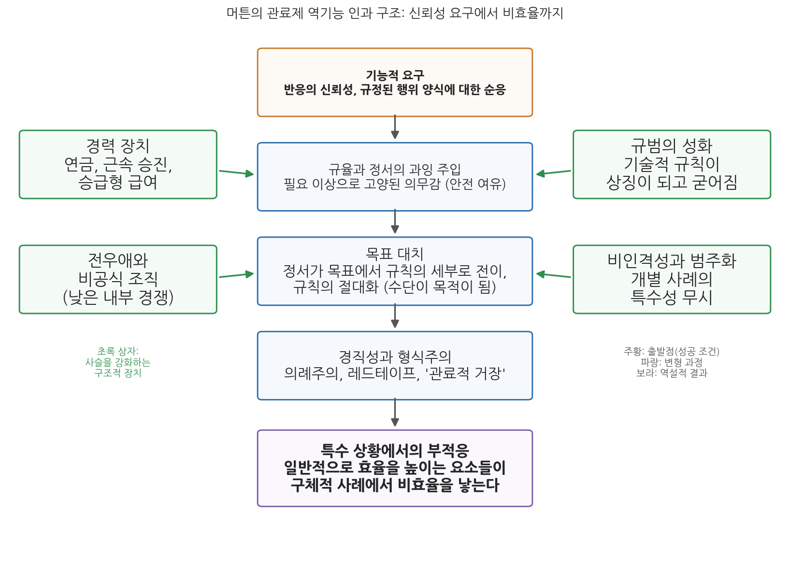

# 10주차 1차시. 관료제 다시 보기 (1): 머튼의 관료제의 구조와 성격

> 일반적으로는 효율성을 높이는 바로 그 요소들이, 구체적 사례에서는 비효율을 낳는다.
> (로버트 머튼, 「관료제의 구조와 성격」)

## 이 장에서 배우는 것

구청 민원 창구에서 이런 장면을 본 적이 있을 것이다. 민원인이 딱한 사정을 길게 설명하는데, 담당 공무원은 곤란한 얼굴로 같은 말을 반복한다. "사정은 알겠는데, 규정상 안 됩니다." 민원인은 융통성 없는 공무원을 탓하며 돌아서고, 공무원은 규정을 지켰을 뿐인데 왜 욕을 먹어야 하는지 억울해한다. 누가 잘못한 것일까.

7주차에서 읽은 막스 베버를 떠올려 보자. 베버는 규칙, 위계, 비인격성으로 짜인 관료제를 기술적으로 가장 우월한 조직 형태라고 분석했다. 그 분석이 옳다면, 규정을 충실히 지키는 저 공무원은 관료제가 길러 낸 모범적인 구성원이다. 그런데 바로 그 모범적인 태도가 민원인 앞에서는 문제가 된다. 이 역설을 정면으로 파고든 사람이 사회학자 로버트 머튼(Robert K. Merton)이다. 머튼은 1940년의 논문 「관료제의 구조와 성격(Bureaucratic Structure and Personality)」에서, 관료제의 경직성과 형식주의가 게으르거나 무능한 개인의 일탈이 아니라 관료제라는 구조 자체가 만들어 내는 산물임을 보였다. 관료제를 잘 작동하게 만드는 바로 그 장치들이 관료제를 망가뜨리기도 한다는 것이다.

이 장은 3부 "후기 고전이론과 이론적 전환"의 첫 장이기도 하다. 구체적으로 다음을 배운다.

- 고전적 행정이론(2부)이 어떤 전제 위에 서 있었고, 10주차 이후의 이론들이 그 전제를 어떻게 문제 삼는지
- 머튼이 누구이며, 중범위이론과 역기능 개념이 무엇인지
- 원전 강독: 베버 이념형의 요약, 훈련된 무능, 규율의 정서화, 목표 대치, 비인격성과 민원인의 충돌
- 관료제 역기능이 발생하는 구조적 경로 (신뢰성 요구에서 비효율까지의 네 단계)
- 현대 행정의 레드테이프와 규정 만능주의에 이 분석이 주는 함의

<strong>이 장의 로드맵</strong> 
이 장은 하나의 질문을 따라 전개된다. <em>"성실하게 규칙을 지키는 관료들이 모인 조직이 왜 경직되고 비효율적으로 변하는가?"</em>  
<strong>1.1</strong> 고전이론에서 전환으로: 3부가 다루는 이론적 국면을 조망한다 →
<strong>1.2</strong> 머튼과 중범위이론을 소개한다 →
<strong>1.3</strong> 원전을 읽는다 (베버 요약 → 훈련된 무능 → 규율의 정서화와 목표 대치 → 발첸 사례 → 구조적 원인 → 비인격성) →
<strong>1.4</strong> 역기능의 구조적 원인을 개념과 그림으로 정리한다 →
<strong>1.5</strong> 레드테이프와 규정 만능주의라는 현대적 함의를 짚는다.

## 1.1 고전이론에서 전환으로: 3부를 시작하며

지금까지 다룬 내용을 잠시 돌아보자. 1부(1-5주)에서는 행정의 오랜 기원과 행정학의 탄생을 보았다. 공자와 키케로가 통치자의 자격을 물었고, 우드로 윌슨과 프랭크 굿나우가 정치에서 분리된 행정 연구를 선언했다. 2부(6-9주)에서는 고전적 행정이론의 전성기를 보았다. 프레더릭 테일러는 "유일 최선의 방법"을 찾는 과학적 관리를 제창했고, 막스 베버는 관료제를 기술적으로 가장 효율적인 지배 구조로 분석했으며, 루서 귤릭은 분업과 조정의 원리를 POSDCORB로 집대성했다.

이 고전이론들은 서로 다르지만 하나의 전제를 공유한다. 조직의 구조를 올바르게 설계하면 능률이 따라온다는 믿음이다. 규칙을 명확히 하고, 위계를 세우고, 분업과 통솔범위를 원리에 맞게 배치하면 조직은 설계한 대로 정확하게 작동한다. 사람은 그 조직의 구성 요소로서, 주어진 규칙과 유인에 따라 움직이는 존재로 가정되었다.

3부(10-14주)가 다루는 것은 이 전제가 무너지는 과정이다. 이 전환은 한 문장으로 요약할 수 있다. 행정조직을 "규칙과 구조의 산물이 아니라 인간행동과 동기가 작동하는 사회적 체계"로 다시 인식하는 흐름이 나타났다는 것이다. 규칙은 문서에 쓰인 대로 작동하지 않는다. 규칙 아래에서 살아가는 사람들은 정서를 갖고, 습관을 만들고, 자기들끼리 뭉치고, 규칙 그 자체에 애착을 갖게 된다. 그 순간 구조는 설계자가 의도하지 않은 결과를 낳기 시작한다.

10주차의 두 텍스트는 이 전환의 출발점에 있다. 이번 차시의 머튼은 베버가 그린 관료제 이념형의 이면, 곧 역기능을 드러낸다. 다음 차시의 허버트 사이먼은 귤릭이 집대성한 행정 원리들이 과학이 아니라 격언에 불과하다고 논파한다. 이어서 11주차의 드와이트 왈도는 고전 행정학 전체의 이념적 기반을 분석하고, 12주차의 찰스 린드블롬은 합리적 결정이라는 이상 자체를 의심한다. 3부의 이론들은 저마다 관심사가 다르지만, 모두 고전이론이 당연하게 여긴 것을 문제 삼는다는 점에서 하나의 계보를 이룬다.

## 1.2 로버트 머튼과 중범위이론

<strong>인물 · 로버트 K. 머튼(Robert K. Merton, 1910-2003)</strong> 
미국의 사회학자로, 1910년 필라델피아의 유대계 이민 가정에서 마이어 로버트 슈콜닉이라는 이름으로 태어났다. 십대에 마술 공연의 예명으로 쓰던 로버트 머튼을 평생의 이름으로 삼았고, 장학금을 받아 진학한 템플대학교에서 사회학을 접했다. 1931년 하버드대학교로 옮겨 피티림 소로킨의 연구조수로 일하며 1936년 석박사 학위를 받았고, 학위논문을 발전시킨 저작으로 과학사회학의 출발점을 놓았다. 1938년 툴레인대학교 사회학과 학과장을 맡았고, 1941년 컬럼비아대학교로 옮겨 반세기를 그곳에서 보냈다. 1942년부터 1971년까지 응용사회연구소 부소장으로 폴 라자스펠드와 함께 일했고, 1963년 기딩스 석좌교수, 1974년 유니버시티 프로페서에 올랐다. 1957년 미국사회학회 회장을 지냈고 1994년 사회학자로는 처음으로 국가과학메달을 받았으며, 2003년 맨해튼에서 92세로 사망했다. 
대표 저술: 『17세기 잉글랜드의 과학, 기술, 사회(Science, Technology and Society in Seventeenth-Century England)』(1938), 「관료제의 구조와 성격」(1940), 『사회이론과 사회구조』(1949), 『과학사회학(The Sociology of Science)』(1973) 
사진: 1965년 레이던대학 명예박사 수여식, Eric Koch / Anefo, 위키미디어 공용 (CC0)

로버트 머튼(1910-2003)은 행정학자가 아니라 사회학자다. 그런데도 행정사의 정전에 그의 이름이 오르는 이유는, 관료제라는 행정학의 핵심 대상을 누구보다 깊이 분석했기 때문이다. 머튼은 20세기 사회학을 대표하는 학자로, 컬럼비아 대학의 응용사회연구소(BASR)를 축으로 이론과 실증 조사를 결합하는 연구 전통을 세웠고 과학사회학이라는 분야를 대중화했다. 역기능, 자기실현적 예언, 준거집단, 역할갈등처럼 오늘날 사회과학의 일상어가 된 개념들 다수를 그가 다듬어 냈다.

머튼의 학문적 기획을 한마디로 요약하는 말이 중범위이론(middle-range theory)이다. 그가 보기에 당시 사회과학은 두 극단 사이에서 갈라져 있었다. 한쪽에는 사회 전체를 한 번에 설명하려는 거대이론이 있었는데, 웅장하지만 검증할 방법이 없었다. 다른 쪽에는 개별 사실을 조사해 쌓기만 하는 단편적 경험주의가 있었는데, 착실하지만 이론으로 이어지지 못했다. 중범위이론은 그 사이의 대안이다. 사회 전체가 아니라 준거집단, 역할갈등, 관료제 같은 구체적 사회현상을 대상으로, 경험적으로 검증할 수 있는 중간 수준의 명제를 세우고, 그런 명제들을 누적시켜 지식을 넓혀 가자는 구상이다.

<strong>정의 · 중범위이론과 역기능</strong> 
<strong>중범위이론</strong>(middle-range theory)은 모든 것을 설명하려는 거대이론과 이론 없는 자료 수집 사이에서, 구체적 사회현상에 대한 검증 가능한 중간 수준의 명제를 세워 지식을 누적하려는 이론화 전략이다. 
<strong>역기능</strong>(dysfunction)은 어떤 구조나 관행이 체계의 적응과 목표 달성을 오히려 저해하는 결과를 가리킨다. 머튼은 제도의 명시적 기능과 잠재적 기능을 구분하고, 순기능만 보던 기존 기능주의에 역기능이라는 관점을 추가했다.

머튼의 기능분석에서 행정학이 특히 주목할 것은 두 가지다. 첫째, 그는 행위의 의도와 결과를 구분했다. 좋은 의도로 설계된 제도가 나쁜 결과를 낳을 수 있고, 그 결과는 우연한 사고가 아니라 구조가 체계적으로 만들어 내는 것일 수 있다. 머튼이 "예상하지 않은 결과"라 부른 이 메커니즘은 오늘날 정책 부작용 분석의 원형이 되었다. 둘째, 그는 관찰된 병리를 개인의 문제로 돌리지 않고 구조의 산물로 설명하려 했다. 경직되고 형식적인 관료는 성격이 나쁜 사람이 아니라, 관료제가 요구하는 대로 충실히 적응한 사람이라는 것이다.

「관료제의 구조와 성격」은 이 기획이 관료제에 적용된 사례이자, 중범위이론의 모범 답안이다. 머튼은 베버의 이념형이라는 기존 이론에서 출발해, 그 이론이 보지 못한 면을 드러내는 검증 가능한 명제들을 끌어내고, 마지막에는 후속 실증 연구를 위한 질문 목록까지 제시한다. 이제 원전을 직접 읽어 보자.

## 1.3 원전 강독: 관료제의 구조와 성격

### 강독 1. 출발점: 베버가 그린 이념형

머튼은 논문의 앞부분에서 베버의 관료제 분석을 충실하게 요약한다. 비판을 위해서라도 먼저 상대의 주장을 가장 강한 형태로 세워 두는 것이다.

<strong>원전 읽기 · 로버트 머튼, 「관료제의 구조와 성격」(1940)</strong> 
"이러한 형식조직의 이상형이 관료제이며, 관료제에 대한 고전적 분석은 여러 면에서 막스 베버의 것이다. 베버가 지적했듯 관료제에는 명확한 분업이 있고, 통합된 활동들은 직위에 딸린 의무로 간주된다. 역할은 시험처럼 형식화되고 비인격적인 절차로 확인되는 기술적 자격에 근거해 배정된다. 위계적으로 배열된 권한 구조 안에서 '훈련되고 급여를 받는 전문가들'의 활동은 일반적이고 추상적이며 명확히 규정된 규칙의 지배를 받는다. 규칙이 일반적이므로 끊임없는 범주화가 필요하다. 개별 문제와 사례는 지정된 기준에 따라 분류되고 그에 맞게 처리된다. (…) 신분 보장, 연금, 승급형 급여, 정형화된 승진 절차는 외부 압력에 흔들리지 않고 공적 의무를 헌신적으로 수행하도록 보장하는 장치다. 관료제의 주요 장점은 기술적 효율성이다. 관료제는 정밀성, 신속성, 전문적 통제, 지속성, 재량, 투입 대비 최적의 산출에 높은 가치를 둔다. 이 구조는 개인화된 관계와 비합리적 고려, 곧 적대감이나 불안이나 감정적 개입을 거의 완전히 제거하는 데 다가간 구조다."

무슨 말인가. 7주차에서 배운 베버 이념형의 핵심을 압축한 대목이다. 분업, 위계, 규칙 지배, 자격 기반 임용, 경력 보장이라는 요소들이 결합하여 정밀성과 예측 가능성을 만들어 낸다. 특히 눈여겨볼 표현이 "범주화"다. 규칙은 일반적이므로, 관료는 눈앞의 사례를 개별 인간의 사연이 아니라 규칙이 정한 범주 중 하나로 분류해 처리한다. 베버의 관점에서 이것은 장점이다. 누구든 같은 범주면 같은 처리를 받으니 공평하고 예측 가능하다.

왜 중요한가. 머튼이 이후에 펼칠 모든 역기능 분석은 이 요약에 들어 있는 요소들, 곧 규칙 지배, 범주화, 경력 보장, 비인격성에서 하나씩 도출된다. 머튼은 베버가 틀렸다고 말하려는 것이 아니다. 베버가 본 것이 전부가 아니라고 말하려는 것이다.

### 강독 2. 시선의 전환: 훈련된 무능

요약을 마친 머튼은 곧바로 방향을 바꾼다. 이 대목이 논문 전체의 전환점이다.

<strong>원전 읽기 · 로버트 머튼, 「관료제의 구조와 성격」(1940)</strong> 
"이러한 대담한 개괄에서는 관료 조직의 긍정적 성취와 기능만 강조되고, 그 구조의 내부적 긴장과 갈등은 거의 전적으로 간과된다. 그러나 일반 사회는 관료제의 결함을 분명히 알고 있다. '관료'라는 말이 독일어에서 경멸어(Schimpfwort)가 되었다는 사실이 이를 잘 보여 준다. 관료제의 부정적 측면으로 연구의 방향을 돌리려면 베블런의 '훈련된 무능(trained incapacity)', 듀이의 '직업적 정신증(occupational psychosis)' 같은 개념을 빌려 오면 된다. 훈련된 무능이란 가진 능력이 오히려 부족함이나 맹점으로 작동하는 상태를 가리킨다. 과거에 성공적으로 통했던 훈련과 기술에 근거한 행위가, 조건이 변하면 부적절한 반응이 될 수 있다. (…) 버크의 농장 비유를 빌리면, 닭은 종소리를 먹이 신호로 쉽게 조건화될 수 있다. 바로 그 종소리가 이번에는 '훈련된 닭들'을 불러 모아 참수의 운명으로 데려가는 데 쓰일 수도 있다. 일반적으로 사람은 과거의 훈련에 부합하게 행동하며, 새로운 조건이 뚜렷이 다르다는 것을 알아차리지 못하면 바로 그 훈련이 건전했기 때문에 오히려 잘못된 절차를 택하게 된다."

무슨 말인가. 훈련된 무능은 무능해서 생기는 문제가 아니라 유능해서 생기는 문제다. 닭의 비유가 정확히 그 구조를 보여 준다. 종소리에 모이도록 학습된 닭은 학습에 실패한 것이 아니다. 학습에 성공했기 때문에, 종소리의 의미가 바뀐 날에 도살장으로 달려간다. 마찬가지로 관료의 훈련이 충실할수록, 훈련이 상정하지 않은 새로운 상황에서는 그 훈련이 정확하게 틀린 행동을 지시한다. 머튼은 이를 근본적 양가성이라 부른다. 그가 인용하는 버크의 말대로, 무언가를 보는 방식은 동시에 보지 않는 방식이기도 하다. 베버는 관료제가 달성하는 것(정밀성, 신뢰성, 효율성)에 초점을 맞추었고, 머튼은 같은 구조를 반대편에서 본다. 이 목표를 이루도록 설계된 조직의 한계는 무엇인가.

왜 중요한가. 이 개념 덕분에 관료제 비판은 "공무원이 게으르다"는 수준의 도덕적 비난에서 벗어난다. 문제는 사람의 자질이 아니라 훈련과 환경 변화 사이의 구조적 어긋남이다. 그렇다면 처방도 사람을 교체하는 것이 아니라 구조를 고치는 쪽에서 찾아야 한다.

### 강독 3. 규율의 정서화와 목표 대치

그렇다면 그 어긋남은 어떤 경로로 만들어지는가. 머튼의 대답은 규율에 대한 분석에서 나온다.

<strong>원전 읽기 · 로버트 머튼, 「관료제의 구조와 성격」(1940)</strong> 
"관료제가 성공적으로 작동하려면 행동의 높은 신뢰성과 규정된 행위 양식에 대한 비범한 순응을 달성해야 한다. (…) 규율은 의무에 대한 헌신, 권한과 역량의 한계에 대한 예리한 인식, 일상 활동의 체계적 수행이라는 강한 정서가 뒷받침될 때만 효과를 낸다. (…) 그런데 규율을 확실히 보장하려다 보니, 이러한 정서는 기술적으로 필요한 수준 이상으로 고양되곤 한다. 교량 지지대를 설계하는 공학자가 여유 계수를 두듯, 규범적 의무를 지키라는 압력에도 이른바 안전 여유가 붙는 것이다. 그러나 바로 이 강조 때문에 정서는 조직의 목표에서 규칙이 요구하는 세부 행위로 옮겨 간다. 원래 수단이었던 규칙 준수가 그 자체로 목적이 된다. '수단적 가치가 종국적 가치로 바뀌는' 친숙한 목표 전치 과정이 일어나는 것이다. (…) 형식주의, 심지어 의례주의가 나타나고, 형식화된 절차를 세세하게 지키라는 도전받지 않는 집착이 뒤따른다. 규칙에 대한 순응 그 자체에 매달리는 관심이 조직 목적의 달성을 방해하는 지경에 이르면, 우리는 공무원의 기술주의, 곧 관료적 절차(레드 테이프)라는 익숙한 현상과 마주하게 된다."

무슨 말인가. 이 대목은 세 단계로 읽으면 선명해진다. 첫째, 관료제는 신뢰성을 위해 규율을 요구하고, 규율은 냉정한 계산이 아니라 정서, 곧 의무감과 규칙에 대한 애착으로 유지된다. 둘째, 조직은 만일에 대비해 그 정서를 필요 이상으로 강하게 주입한다. 다리를 설계할 때 예상 하중보다 튼튼하게 짓는 것과 같은 안전 여유다. 셋째, 과잉 주입된 정서는 원래 목표(조직의 목적 달성)에서 수단(규칙의 세부)으로 옮겨 간다. 이렇게 수단이 목적의 자리를 차지하는 현상이 목표 대치(goal displacement)다. 규칙은 더 이상 "무엇을 위한" 규칙이 아니라 그 자체로 지켜야 할 신성한 것이 된다.

왜 중요한가. 목표 대치는 이 논문이 행정학에 남긴 가장 유명한 개념이다. 주목할 점은 그 원인이 관료제의 실패가 아니라 성공 조건 그 자체라는 것이다. 안전 여유는 어리석은 과잉이 아니라 신뢰성을 보장하기 위한 합리적 장치인데, 바로 그 장치가 경직성을 낳는다. 머튼은 뒤이어 이 정서를 강화하는 구조적 장치들도 지목한다. 연금과 근속 승진 같은 경력 장치는 순응을 유도하는 동시에 소심함과 보수성과 기술주의를 낳고, 경쟁이 적은 조직에서 자라나는 전우애(esprit de corps)는 응집력을 주는 동시에 구성원들이 기득 이익을 지키느라 민원인이나 선출직 상급자를 돕지 않게 만들기도 한다. 처음에는 기술적 이유로 도입된 규범이 시간이 지나며 경직되고 성스러워지는 성화(聖化) 경향까지 나타난다.

### 강독 4. 목표 대치의 극단: 관료적 거장과 발첸 사례

머튼은 목표 대치가 극단에 이른 모습을 하나의 실화로 보여 준다.

<strong>원전 읽기 · 로버트 머튼, 「관료제의 구조와 성격」(1940)</strong> 
"목표 전치의 극단적 산물은, 자기 행동을 구속하는 규칙을 단 하나도 잊지 않기에 많은 민원인을 도울 수 없게 되는 '관료적 거장(virtuoso)'이다. 권한의 한계를 엄격히 지키고 규칙을 문자 그대로 준수한 결과가 어떤 사태를 낳는지는, 버드 제독의 남극점 비행에서 조종사였던 번트 발첸의 안타까운 곤경이 보여 준다. 노동부의 판정에 따르면 발첸은 시민권 서류를 받을 수 없었다. 노르웨이 출신인 발첸은 1927년에 귀화 의사를 밝혔으나, 미국 내 5년 연속 거주 요건을 채우지 못했다고 판단되었다. 그는 미국 국기를 게양한 선박에 있었고, 미국 원정대의 대체 불가능한 일원이었으며, 미국인들의 탐사와 점유를 근거로 미국이 권원을 주장하는 지역('리틀 아메리카')에 있었다. 그런데도 버드의 남극 항해가 그를 국외로 데려갔다는 것이다. 귀화 당국은 리틀 아메리카가 미국 영토라는 가정 위에서 절차를 진행할 수 없다고 설명했다. 그것은 국제 문제에 대한 권한 없는 월권이 되기 때문이다. 당국의 관점에서 발첸은 국외에 있었고, 형식적으로 귀화법을 지키지 못했다."

무슨 말인가. 발첸은 미국의 국가적 영웅 원정에 참여했다가, 바로 그 원정 때문에 "미국을 떠나 있었다"는 판정을 받고 시민권을 거부당했다. 담당 공무원들의 논리는 흠잡을 데 없다. 리틀 아메리카가 미국 영토인지는 외교 문제이니 귀화 당국이 판단할 수 없고, 판단할 수 없다면 발첸은 국외에 있었던 것이며, 국외에 있었다면 거주 요건 미달이다. 각 단계는 권한의 한계에 대한 엄격한 존중, 곧 관료의 미덕이다. 그 미덕들이 이어져 상식적으로 보면 명백히 부조리한 결론에 도달한다.

왜 중요한가. "관료적 거장"이라는 반어가 핵심을 정확히 드러낸다. 거장은 규칙을 누구보다 정확하게 적용하는 사람이다. 규칙을 어겨서가 아니라 완벽하게 지켜서 본래 목적을 이루지 못하게 만든다. 이 사례는 앞의 강독 3에서 본 이론적 명제(수단의 목적화)가 현실에서 어떤 모습으로 나타나는지 보여 주는 표본이며, 오늘날에도 "규정상 안 됩니다"라는 말이 만들어 내는 수많은 사례들의 원형이다.

### 강독 5. 역기능의 구조적 원인: 네 단계의 요약

머튼은 여기까지의 분석을 네 단계의 인과 사슬로 압축한다. 이 논문에서 시험에 가장 자주 나오는 대목이다.

<strong>원전 읽기 · 로버트 머튼, 「관료제의 구조와 성격」(1940)</strong> 
"'훈련된 무능'을 낳는 이러한 지향의 결함은 명백히 구조적 원천에서 비롯된다. 그 과정을 간추리면 다음과 같다. (1) 효과적인 관료제는 반응의 신뢰성과 규정에 대한 엄격한 헌신을 요구한다. (2) 규칙에 대한 그런 헌신은 규칙을 절대적인 것으로 바꾸어 놓는다. 규칙은 더 이상 특정한 목적에 상대적인 것으로 여겨지지 않는다. (3) 그 결과, 일반 규칙을 만든 사람들이 미처 상정하지 못한 특수한 조건에서 신속하게 적응하기가 어려워진다. (4) 이렇게 하여, 일반적으로는 효율성을 높이는 바로 그 요소들이 구체적 사례에서는 비효율을 낳는다. 규칙이 자신들에게 갖는 '의미'에서 스스로를 떼어 내지 못하는 집단 구성원들이 이 부적합성을 온전히 인식하는 일은 드물다. 시간이 지나면 규칙은 엄밀히 실용적이라기보다 상징적인 성격을 띠게 된다."

무슨 말인가. (1)은 요구, (2)는 그 요구가 낳는 심리적 변형, (3)은 변형이 낳는 행동의 경직, (4)는 그 결과인 역설이다. 출발점인 (1)이 관료제의 결함이 아니라 성공 조건이라는 점을 다시 확인하자. 신뢰성을 요구하지 않는 관료제는 애초에 관료제가 아니다. 그런데 그 요구가 (2)와 (3)을 거치며 비효율로 전화된다. 역기능은 관료제에 우연히 끼어든 예외가 아니라 관료제 자체에서 생겨나는 내생적 산물이다.

왜 중요한가. 마지막 두 문장이 처방의 어려움을 예고한다. 규칙과 자신을 동일시하는 구성원들은 이 부적합성을 스스로 알아차리기 어렵고, 상징이 된 규칙은 "이 규칙이 원래 무엇을 위한 것이었나"라는 질문 자체를 하지 못하게 만든다. 규칙 하나를 고치는 것보다 규칙을 대하는 조직의 태도를 바꾸는 것이 훨씬 어려운 이유다.

### 강독 6. 비인격성의 두 얼굴: 민원인과의 충돌

마지막으로 머튼은 관료제와 시민이 만나는 접점, 곧 민원 창구로 시선을 옮긴다.

<strong>원전 읽기 · 로버트 머튼, 「관료제의 구조와 성격」(1940)</strong> 
"공무원은 개인적 관계를 최소화하고 범주화에 의존하기 때문에 개별 사례의 특수성이 종종 무시된다. 그러나 자기 문제의 '특별한 특징'을 확신하는 민원인은, 이해할 만하게도, 그러한 범주적 처리에 반발하곤 한다. 정형화된 행동은 개별 문제의 절박함에 들어맞지 않는다. 당사자에게는 더없이 중요한 사안을 비인격적으로 처리하는 태도는 '관료의 오만함'과 '거만함'이라는 비난을 부른다. (…) 민간 기업에서라면 고객은 경쟁하는 다른 회사로 거래를 옮기는 방식으로 효과적으로 항의할 수 있다. 그러나 공공조직은 독점적이어서 그런 대안이 없다. 게다가 이념과 사실의 불일치가 긴장을 키운다. 정부 인력은 '국민의 하인'으로 여겨지지만, 실제로는 대체로 우위에 서 있기 때문이다."

무슨 말인가. 비인격성과 범주화는 강독 1에서 보았듯 공평성과 예측 가능성을 보장하는 장치다. 그런데 민원인의 눈에 자기 사정은 결코 "그런 사례들 중 하나"가 아니다. 여기서 구조적 충돌이 생긴다. 관료는 개인화된 배려를 원하는 민원인에게 형식적이고 비인격적인 처리를 강제해야 하는 압력 아래 있다. 흥미롭게도 머튼은 정반대 방향의 충돌도 함께 짚는다. 비인격적 처리가 요구되는 자리에 개인적 관계가 끼어들면, 그것은 뇌물수수, 편파주의, 연줄주의로 낙인찍혀 격렬한 비난을 받는다. 그 분개는 관료제의 형식적 규범을 지켜 내는 방어 장치로 기능한다. 관료제는 특혜를 베풀어도 비난받고 베풀지 않아도 비난받는데, 머튼이 보기에 이는 모순이 아니라 2차집단의 형식적 규범 위에 세워진 구조가 치르는 일관된 비용이다.

왜 중요한가. 이 장 서두의 민원 창구 장면이 바로 이 대목의 예다. 공공서비스는 독점이므로 시민은 "다른 가게"로 갈 수 없고, 국민의 하인이라는 이념과 창구에서의 실제 지위 사이의 간극이 분노를 증폭시킨다. 친절 교육만으로 민원 갈등이 해소되지 않는 이유를 이 구조가 설명해 준다.

## 1.4 역기능의 구조적 원인: 개념 정리

원전에서 읽은 내용을 개념과 그림으로 정리하자. 먼저 이 장의 두 핵심 개념이다.

<strong>정의 · 훈련된 무능과 목표 대치</strong> 
<strong>훈련된 무능</strong>(trained incapacity)은 과거에 유효했던 훈련과 기술이 변화된 조건에서 오히려 부적절한 반응을 낳아, 능력이 맹점으로 작동하는 상태다 (베블런의 개념을 머튼이 관료제에 적용). 
<strong>목표 대치</strong>(goal displacement)는 목적을 이루기 위한 수단이었던 규칙 준수가 그 자체로 목적이 되어, 수단적 가치가 종국적 가치의 자리를 차지하는 과정이다. 형식주의와 레드테이프의 발생 메커니즘이다.

두 개념을 잇는 인과의 사슬을 그림으로 보면 다음과 같다.

그림 10-1을 읽는 법. 가운데 세로줄이 강독 5에서 본 네 단계의 인과 사슬이다. 신뢰성이라는 기능적 요구에서 출발해, 규율과 정서의 과잉 주입(안전 여유), 정서의 전이와 규칙의 절대화(목표 대치)를 거쳐, 경직성과 형식주의, 그리고 특수 상황에서의 비효율에 이른다. 왼쪽과 오른쪽의 상자들은 이 사슬을 바깥에서 뒷받침하는 구조적 장치들이다. 연금과 근속 승진 같은 경력 장치, 전우애와 비공식 조직, 규범의 성화가 각각 규칙에 대한 애착을 강화한다. 이 그림에서 알 수 있는 것은 두 가지다. 첫째, 출발점(신뢰성 요구)은 제거할 수 없다. 그것을 없애면 관료제 자체가 무너진다. 둘째, 따라서 개입 지점은 사슬의 중간, 곧 정서가 규칙 세부로 옮겨 가는 단계와 규칙이 절대화되는 단계일 수밖에 없다.

베버가 본 것과 머튼이 본 것을 나란히 놓으면 표 10-1과 같다. 같은 구조적 특징이 어떻게 두 얼굴을 갖는지 확인하자.

**표 10-1. 같은 구조, 두 개의 얼굴: 베버의 시선과 머튼의 시선**

| 관료제의 구조적 특징 | 베버가 본 기능 | 머튼이 본 역기능 |
|---|---|---|
| 일반 규칙의 지배와 범주화 | 예측 가능성, 공평한 처리 | 개별 사례의 특수성 무시, 민원인과의 갈등 |
| 규율과 순응의 요구 | 행동의 신뢰성 | 규칙의 절대화, 목표 대치, 형식주의 |
| 경력 보장 (연금, 근속 승진) | 외부 압력에 흔들리지 않는 헌신 | 소심함, 보수성, 기술주의 |
| 낮은 내부 경쟁과 전우애 | 마찰 최소화, 응집력 | 기득 이익 방어, 변화에 대한 저항 |
| 비인격성 | 객관성, 감정 개입의 배제 | "오만함"이라는 비난, 시민과의 구조적 긴장 |

<strong>왜 "구조적 설명"이 중요한가?</strong> 
경직된 공무원을 보면 우리는 본능적으로 사람을 탓한다. 그러나 머튼의 분석이 옳다면, 그 자리에 누구를 앉혀도 같은 훈련과 같은 유인 구조가 같은 행동을 길러 낸다. 실제로 머튼은 논문 말미에서 "관료제가 특정한 성격 유형을 선발하고 수정하는가", "근속 승진은 경쟁 불안을 줄이고 행정 효율을 높이는가" 같은 실증 연구 질문들을 제안한다. 병리의 원인을 구조에서 찾으면 처방도 달라진다. 정신교육과 친절 캠페인이 아니라, 규칙과 재량의 배분, 평가와 승진의 유인 설계를 바꾸는 것이 개입 지점이 된다. 개인 비난에서 구조 분석으로 옮겨 가는 이 관점이야말로 사회학이 행정학에 준 기여다.

한 가지 유의할 점이 있다.

<strong>유의 · 머튼은 관료제 폐지론자가 아니다</strong> 
머튼은 관료제를 "일차집단의 기준으로는 만족스럽게 수행될 수 없는 활동을 수행하도록 고안된 2차집단 메커니즘"이라고 본다. 대규모 사회에 관료제는 필요하며, 역기능을 낳는 장치들조차 대부분 기능적 이유로 존재한다. 머튼의 논문은 관료제를 없애자는 선동이 아니라, 관료제의 순기능과 역기능을 함께 보는 균형 잡힌 분석 틀의 제안이며, 결론도 규탄이 아니라 후속 연구를 위한 질문 목록이다. "관료제는 악하다"는 요약은 이 논문에 대한 오독이다.

## 1.5 현대적 함의: 레드테이프와 규정 만능주의

머튼이 이 논문을 쓴 지 80년이 넘었지만, 그가 지목한 현상들은 이름만 바꾸어 오늘의 행정에도 그대로 나타난다.

첫째, 레드테이프(red tape)다. 원래 영국에서 공문서를 묶던 붉은 끈에서 나온 이 말은, 목적에 봉사하지 않으면서 사람들의 시간과 에너지를 소모하게 하는 과잉 절차를 가리키는 행정학 용어가 되었다. 머튼의 기여는 레드테이프를 한탄의 대상에서 설명의 대상으로 바꾼 것이다. 절차가 쌓이는 이유는 담당자가 게을러서가 아니다. 신뢰성을 요구하는 구조가 규칙에 대한 과잉 애착을 낳고, 문제가 생길 때마다 "재발 방지"를 위한 절차가 하나씩 추가되며, 추가된 절차는 누구도 책임지고 없애려 하지 않기 때문이다. 절차를 없앤 사람은 훗날 사고가 나면 책임을 지지만, 절차를 지킨 사람은 결과가 나빠도 면책된다. 규칙 준수가 곧 안전인 구조에서 레드테이프는 합리적 적응의 산물이다.

둘째, 규정 만능주의와 소극행정이다. "규정에 없어서 안 됩니다"와 "선례가 없어서 곤란합니다"는 목표 대치의 일상적 표현이다. 규정은 원래 공익이라는 목적을 위한 수단인데, 어느새 규정에 맞느냐가 공익에 맞느냐를 대신하는 판단 기준이 된다. 한국 정부가 적극행정 제도를 두어, 공익을 위해 능동적으로 일하다 생긴 결과에 대해 징계 면책을 보장하려는 것은 바로 이 구조를 겨냥한 처방이다. 머튼의 틀로 읽으면 이 제도의 논리가 선명해진다. 소극행정은 나쁜 개인의 문제가 아니라 유인 구조의 산물이므로, 훈계가 아니라 면책이라는 유인의 재설계로 대응한다는 것이다.

셋째, 성과지표의 목표 대치다. 목표 대치는 낡은 규칙에서만 일어나지 않는다. 관료제 개혁의 도구로 도입된 성과관리조차 같은 문제에 빠질 수 있다. 지표는 성과라는 목적을 재는 수단인데, 평가와 보상이 지표에 걸리는 순간 조직의 주의와 노력은 측정 가능한 항목으로 쏠리고, 지표를 채우는 일이 성과를 내는 일을 대체한다. 처리 건수를 지표로 삼으면 쉬운 사건부터 처리하고, 민원 처리 기한을 지표로 삼으면 기한 직전의 형식적 답변이 늘어난다. 6주차에서 본 테일러식 측정을 이어받은 현대 성과관리도 머튼의 분석에서 자유롭지 않은 셈이다.

이 함의들은 하나의 실천적 질문으로 모인다. 신뢰성과 적응성을 어떻게 함께 확보할 것인가. 머튼의 분석은 규칙의 강도, 재량의 폭, 예외의 처리 절차를 함께 설계해야 한다는 방향을 가리킨다. 규칙을 지키는 것이 기본이되, 규칙이 목적에 어긋나는 특수 상황을 알아차리고 예외를 다룰 수 있는 통로가 제도 안에 마련되어 있어야 한다는 것이다. 발첸 사례에서 필요했던 것은 규칙을 무시하는 공무원이 아니라, "이 사안은 규칙이 상정하지 못한 경우"라고 판단해 상위 결정으로 넘길 수 있는 제도적 장치였다.

## 요약

이 장은 3부 "후기 고전이론과 이론적 전환"의 첫 장으로, 고전이론이 공유한 전제(구조를 잘 설계하면 능률이 따라온다)가 흔들리기 시작하는 지점에서 출발했다. 사회학자 로버트 머튼은 거대이론과 단편적 경험주의 사이에서 검증 가능한 명제를 세우는 중범위이론을 제창했고, 기능주의에 역기능이라는 관점을 더했다. 「관료제의 구조와 성격」(1940)에서 머튼은 먼저 베버의 이념형(분업, 위계, 규칙 지배, 경력 보장, 비인격성)을 요약한 뒤 관점을 바꾼다. 무언가를 보는 방식은 보지 않는 방식이기도 하며, 베버가 본 효율의 구조는 동시에 역기능의 구조다. 관료의 훈련은 조건이 변하면 훈련된 무능으로 전화하고, 신뢰성을 보장하려고 필요 이상으로 주입된 규율의 정서(안전 여유)는 조직의 목표에서 규칙의 세부로 옮겨 가 수단을 목적으로 만드는 목표 대치를 낳는다. 그 결과가 형식주의, 의례주의, 레드테이프이며, 극단에는 규칙을 완벽히 지켜 본래 목적을 이루지 못하게 하는 관료적 거장(발첸 사례)이 있다. 머튼은 이 과정을 네 단계 인과 사슬(신뢰성 요구, 규칙의 절대화, 적응 실패, 구체적 사례의 비효율)로 요약했고, 경력 장치와 전우애와 규범의 성화가 이를 강화하며, 비인격성과 범주화는 민원인과의 구조적 갈등을 낳는다고 분석했다. 이 구조적 설명은 오늘날의 레드테이프, 규정 만능주의와 소극행정, 성과지표의 목표 대치를 이해하고 적극행정 같은 처방을 설계하는 틀이 된다.

## 토론·복습 문제

**10-1. (서술형 연습)** 머튼이 제시한 관료제 역기능의 구조적 원인을 네 단계 인과 사슬에 따라 설명하고, 이 분석이 "공무원 개인의 자질을 탓하는 관료제 비판"과 어떻게 다른지, 처방의 차이를 중심으로 논의하시오.

**10-2. (원전 구절 해석)** 다음 구절을 읽고 물음에 답하시오. "닭은 종소리를 먹이 신호로 쉽게 조건화될 수 있다. 바로 그 종소리가 이번에는 '훈련된 닭들'을 불러 모아 참수의 운명으로 데려가는 데 쓰일 수도 있다." 이 비유에서 종소리, 조건화, 참수가 관료제의 무엇에 대응하는지 밝히고, "훈련이 건전했기 때문에 오히려 잘못된 절차를 택하게 된다"는 역설의 의미를 설명하시오.

**10-3. (사례 적용)** 발첸 사례에서 귀화 당국 공무원들의 판단을 옹호하는 논변과 비판하는 논변을 각각 구성해 보시오. 그런 다음, 이런 사례의 재발을 막기 위한 제도적 장치를 하나 제안하고, 그 장치가 다시 목표 대치에 빠질 위험은 없는지 검토하시오.

**10-4. (개념 연결)** 여러분이 겪었거나 들어 본 "규정상 안 됩니다" 사례를 하나 골라, 이 장의 개념(훈련된 무능, 안전 여유, 목표 대치, 범주화와 비인격성) 중 어느 것으로 가장 잘 설명되는지 논하시오. 아울러 그 사례에서 담당자가 규정을 어기는 것이 더 나은 대안이었는지도 따져 보시오.
