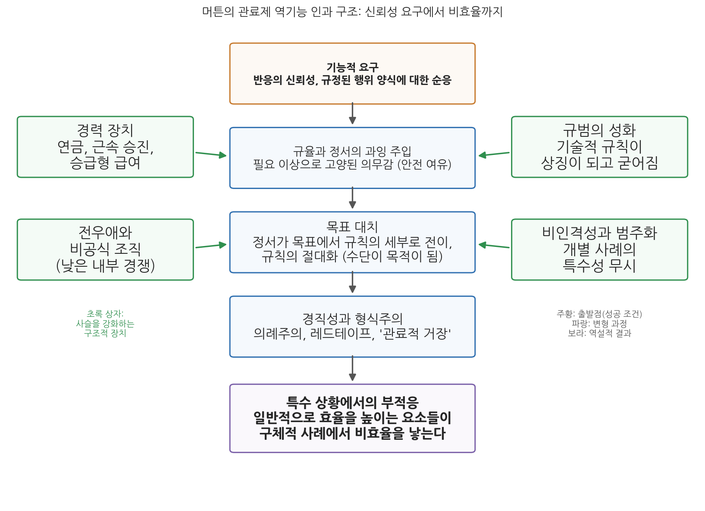

# 10주차 1차시. 관료제 다시 보기 (1): 머튼의 관료제의 구조와 성격

> 일반적으로는 효율성을 높이는 바로 그 요소들이, 구체적 사례에서는 비효율을 낳는다.
> (로버트 머튼, 「관료제의 구조와 성격」)

## 이 장에서 배우는 것

구청 민원 창구에서 이런 장면을 본 적이 있을 것이다. 민원인이 딱한 사정을 길게 설명하는데, 담당 공무원은 곤란한 얼굴로 같은 말을 반복한다. "사정은 알겠는데, 규정상 안 됩니다." 민원인은 융통성 없는 공무원을 탓하며 돌아서고, 공무원은 규정을 지켰을 뿐인데 왜 욕을 먹어야 하는지 억울해한다. 누가 잘못한 것일까.

7주차에서 읽은 막스 베버를 떠올려 보자. 베버는 규칙, 위계, 비인격성으로 짜인 관료제를 기술적으로 가장 우월한 조직 형태라고 분석했다. 그 분석이 옳다면, 규정을 충실히 지키는 저 공무원은 관료제가 길러 낸 모범적인 구성원이다. 그런데 바로 그 모범적인 태도가 민원인 앞에서는 문제가 된다. 이 역설을 정면으로 파고든 사람이 사회학자 로버트 머튼(Robert K. Merton)이다. 머튼은 1940년의 논문 「관료제의 구조와 성격(Bureaucratic Structure and Personality)」에서, 관료제의 경직성과 형식주의가 게으르거나 무능한 개인의 일탈이 아니라 관료제라는 구조 자체가 만들어 내는 산물임을 보였다. 관료제를 잘 작동하게 만드는 바로 그 장치들이 관료제를 망가뜨리기도 한다는 것이다.

이 장은 3부 "후기 고전이론과 이론적 전환"의 첫 장이기도 하다. 구체적으로 다음을 배운다.

- 고전적 행정이론(2부)이 어떤 전제 위에 서 있었고, 10주차 이후의 이론들이 그 전제를 어떻게 문제 삼는지
- 머튼이 누구이며, 1930년대의 어떤 연구 흐름 속에서 이 논문을 썼는지, 중범위이론과 역기능 개념이 무엇인지
- 원전 강독: 베버 이념형의 요약, 훈련된 무능, 규율의 정서화, 목표 대치, 발첸 사례, 경력 장치와 전우애, 규범의 성화, 비인격성과 민원인의 충돌
- 관료제 역기능이 발생하는 구조적 경로 (신뢰성 요구에서 비효율까지의 네 단계)와 머튼 이후 관료제 연구의 전개
- 현대 행정의 레드테이프, 소극행정과 적극행정, 복지 사각지대, 성과지표의 왜곡 사례에 이 분석이 주는 함의

<strong>이 장의 로드맵</strong> 
이 장은 하나의 질문을 따라 전개된다. <em>"성실하게 규칙을 지키는 관료들이 모인 조직이 왜 경직되고 비효율적으로 변하는가?"</em>  
<strong>1.1</strong> 고전이론에서 전환으로: 3부가 다루는 이론적 국면을 조망한다 →
<strong>1.2</strong> 머튼과 중범위이론, 그리고 1930년대 그의 문제의식을 소개한다 →
<strong>1.3</strong> 원전을 읽는다 (베버 요약 → 훈련된 무능 → 규율의 정서화와 목표 대치 → 발첸 사례 → 구조적 원인 → 경력 장치와 전우애 → 규범의 성화 → 비인격성) →
<strong>1.4</strong> 역기능의 구조적 원인을 개념과 그림으로 정리하고 머튼 이후의 연구를 살핀다 →
<strong>1.5</strong> 레드테이프, 소극행정과 적극행정, 범주화의 한계, 성과지표의 목표 대치라는 현대적 함의를 사례로 짚는다.

## 1.1 고전이론에서 전환으로: 3부를 시작하며

지금까지 다룬 내용을 잠시 돌아보자. 1부(1-5주)에서는 행정의 오랜 기원과 행정학의 탄생을 보았다. 공자와 키케로가 통치자의 자격을 물었고, 우드로 윌슨과 프랭크 굿나우가 정치에서 분리된 행정 연구를 선언했다. 2부(6-9주)에서는 고전적 행정이론의 전성기를 보았다. 프레더릭 테일러는 "유일 최선의 방법"을 찾는 과학적 관리를 제창했고, 막스 베버는 관료제를 기술적으로 가장 효율적인 지배 구조로 분석했으며, 루서 귤릭은 분업과 조정의 원리를 POSDCORB로 집대성했다.

이 고전이론들은 서로 다르지만 하나의 전제를 공유한다. 조직의 구조를 올바르게 설계하면 능률이 따라온다는 믿음이다. 규칙을 명확히 하고, 위계를 세우고, 분업과 통솔범위를 원리에 맞게 배치하면 조직은 설계한 대로 정확하게 작동한다. 사람은 그 조직의 구성 요소로서, 주어진 규칙과 유인에 따라 움직이는 존재로 가정되었다.

3부(10-14주)가 다루는 것은 이 전제가 무너지는 과정이다. 이 전환은 한 문장으로 요약할 수 있다. 행정조직을 "규칙과 구조의 산물이 아니라 인간행동과 동기가 작동하는 사회적 체계"로 다시 인식하는 흐름이 나타났다는 것이다. 규칙은 문서에 쓰인 대로 작동하지 않는다. 규칙 아래에서 살아가는 사람들은 정서를 갖고, 습관을 만들고, 자기들끼리 뭉치고, 규칙 그 자체에 애착을 갖게 된다. 그 순간 구조는 설계자가 의도하지 않은 결과를 낳기 시작한다.

이 전환은 행정 현실의 변화와도 맞물려 있었다. 9주차에서 보았듯 1930년대 미국은 대공황과 뉴딜을 거치며 연방정부의 기능과 조직이 크게 늘어난 행정국가가 되었다. 펜들턴 해링은 그 거대해진 행정이 공익을 어떻게 해석하는지 물었고, 루서 귤릭은 브라운로 위원회에서 그 행정을 어떻게 설계하고 조정할지 처방했다. 관료제는 이제 일부 정부 부처의 문제가 아니라 시민 대부분이 일상에서 마주치는 조직이 되었다. 실업 급여를 받으러 가는 노동자, 귀화를 신청하는 이민자, 보조금을 신청하는 농민이 모두 관료제의 창구 앞에 섰다. 관료제가 커질수록 "관료제는 시민에게 실제로 어떻게 경험되는가", "관료제 안에서 일하는 사람은 어떻게 변하는가"라는 질문이 중요해졌고, 이 질문은 조직 설계의 원리만으로는 답할 수 없었다.

10주차의 두 텍스트는 이 전환의 출발점에 있다. 이번 차시의 머튼은 베버가 그린 관료제 이념형의 이면, 곧 역기능을 드러낸다. 다음 차시의 허버트 사이먼은 귤릭이 집대성한 행정 원리들이 과학이 아니라 격언에 불과하다고 논파한다. 이어서 11주차의 드와이트 왈도는 고전 행정학 전체의 이념적 기반을 분석하고, 12주차의 찰스 린드블롬은 합리적 결정이라는 이상 자체를 의심한다. 3부의 이론들은 저마다 관심사가 다르지만, 모두 고전이론이 당연하게 여긴 것을 문제 삼는다는 점에서 하나의 계보를 이룬다.

## 1.2 로버트 머튼과 중범위이론

<strong>인물 · 로버트 K. 머튼(Robert K. Merton, 1910-2003)</strong> 
미국의 사회학자로, 1910년 필라델피아의 유대계 이민 가정에서 마이어 로버트 슈콜닉이라는 이름으로 태어났다. 십대에 마술 공연의 예명으로 쓰던 로버트 머튼을 평생의 이름으로 삼았고, 장학금을 받아 진학한 템플대학교에서 사회학을 접했다. 1931년 하버드대학교로 옮겨 피티림 소로킨의 연구조수로 일하며 1936년 석박사 학위를 받았고, 학위논문을 발전시킨 저작으로 과학사회학의 출발점을 놓았다. 1938년 툴레인대학교 사회학과 학과장을 맡았고, 1941년 컬럼비아대학교로 옮겨 반세기를 그곳에서 보냈다. 1942년부터 1971년까지 응용사회연구소 부소장으로 폴 라자스펠드와 함께 일했고, 1963년 기딩스 석좌교수, 1974년 유니버시티 프로페서에 올랐다. 1957년 미국사회학회 회장을 지냈고 1994년 사회학자로는 처음으로 국가과학메달을 받았으며, 2003년 맨해튼에서 92세로 사망했다. 
대표 저술: 『17세기 잉글랜드의 과학, 기술, 사회(Science, Technology and Society in Seventeenth-Century England)』(1938), 「관료제의 구조와 성격」(1940), 『사회이론과 사회구조』(1949), 『과학사회학(The Sociology of Science)』(1973) 
사진: 1965년 레이던대학 명예박사 수여식, Eric Koch / Anefo, 위키미디어 공용 (CC0)

로버트 머튼(1910-2003)은 행정학자가 아니라 사회학자다. 그런데도 행정사의 정전에 그의 이름이 오르는 이유는, 관료제라는 행정학의 핵심 대상을 누구보다 깊이 분석했기 때문이다. 머튼은 20세기 사회학을 대표하는 학자로, 컬럼비아 대학의 응용사회연구소(BASR)를 축으로 이론과 실증 조사를 결합하는 연구 전통을 세웠고 과학사회학이라는 분야를 대중화했다. 역기능, 자기실현적 예언, 준거집단, 역할갈등처럼 오늘날 사회과학의 일상어가 된 개념들 다수를 그가 다듬어 냈다.

머튼의 학문적 기획을 한마디로 요약하는 말이 중범위이론(middle-range theory)이다. 그가 보기에 당시 사회과학은 두 극단 사이에서 갈라져 있었다. 한쪽에는 사회 전체를 한 번에 설명하려는 거대이론이 있었는데, 웅장하지만 검증할 방법이 없었다. 다른 쪽에는 개별 사실을 조사해 쌓기만 하는 단편적 경험주의가 있었는데, 착실하지만 이론으로 이어지지 못했다. 중범위이론은 그 사이의 대안이다. 사회 전체가 아니라 준거집단, 역할갈등, 관료제 같은 구체적 사회현상을 대상으로, 경험적으로 검증할 수 있는 중간 수준의 명제를 세우고, 그런 명제들을 누적시켜 지식을 넓혀 가자는 구상이다.

<strong>정의 · 중범위이론과 역기능</strong> 
<strong>중범위이론</strong>(middle-range theory)은 모든 것을 설명하려는 거대이론과 이론 없는 자료 수집 사이에서, 구체적 사회현상에 대한 검증 가능한 중간 수준의 명제를 세워 지식을 누적하려는 이론화 전략이다. 
<strong>역기능</strong>(dysfunction)은 어떤 구조나 관행이 체계의 적응과 목표 달성을 오히려 저해하는 결과를 가리킨다. 머튼은 제도의 명시적 기능과 잠재적 기능을 구분하고, 순기능만 보던 기존 기능주의에 역기능이라는 관점을 추가했다.

머튼의 기능분석에서 행정학이 특히 주목할 것은 두 가지다. 첫째, 그는 행위의 의도와 결과를 구분했다. 좋은 의도로 설계된 제도가 나쁜 결과를 낳을 수 있고, 그 결과는 우연한 사고가 아니라 구조가 체계적으로 만들어 내는 것일 수 있다. 머튼이 "예상하지 않은 결과"라 부른 이 메커니즘은 오늘날 정책 부작용 분석의 원형이 되었다. 둘째, 그는 관찰된 병리를 개인의 문제로 돌리지 않고 구조의 산물로 설명하려 했다. 경직되고 형식적인 관료는 성격이 나쁜 사람이 아니라, 관료제가 요구하는 대로 충실히 적응한 사람이라는 것이다.

### 1930년대 머튼의 문제의식: 의도와 결과의 어긋남

「관료제의 구조와 성격」은 머튼이 1930년대 후반에 잇달아 발표한 논문들과 같은 문제의식 위에 서 있다. 이 연결을 알면 관료제 논문이 왜 그런 방식으로 논증하는지 이해하기 쉽다.

첫 번째 논문은 1936년 『미국사회학리뷰(American Sociological Review)』에 실린 「목적적 사회 행위의 예상하지 않은 결과(The Unanticipated Consequences of Purposive Social Action)」다. 머튼은 여기서 사람들이 목적을 갖고 한 행위가 왜 의도하지 않은 결과를 낳는지 그 원천을 다섯 가지로 정리했다. 가장 흔한 원천은 무지와 오류다. 행위자는 상황에 대한 지식이 부족하거나, 과거에 통했던 방식을 그대로 적용하다가 판단을 그르친다. 세 번째 원천은 당장의 이익에 대한 집착이다. 원하는 결과에 몰두한 나머지 다른 결과를 고려하지 않는 경우다. 네 번째는 기본 가치다. 어떤 가치가 특정 행위를 명령하면 사람들은 그 결과를 따지지 않고 행동한다. 다섯 번째는 예측이 공표되면서 사람들의 행동을 바꾸어 예측 자체가 빗나가는 경우다. 이 가운데 "과거에 통했던 방식을 그대로 적용하는 오류"는 4년 뒤 관료제 논문에서 훈련된 무능이라는 이름으로 다시 등장한다.

두 번째 논문은 1938년의 「사회구조와 아노미(Social Structure and Anomie)」다. 이 논문은 오늘날 일탈 연구의 고전으로 더 유명하지만, 행정학에도 중요한 개념 하나를 남겼다. 머튼은 사회가 제시하는 문화적 목표(예컨대 경제적 성공)와 그 목표에 이르는 제도화된 수단 사이에 어긋남이 생길 때, 사람들이 다섯 가지 방식으로 적응한다고 보았다. 목표와 수단을 모두 받아들이는 동조, 목표는 받아들이되 수단을 거부하는 혁신, 목표를 사실상 포기하고 수단만 충실히 지키는 의례주의, 둘 다 포기하는 은둔, 둘 다 거부하고 새로운 목표와 수단을 내세우는 반역이다. 이 가운데 의례주의의 전형으로 머튼이 든 인물이 승진의 포부를 내려놓고 "규정대로" 처리하는 일에만 몰두하는 관료적 사무원이다. 관료제 논문에서 말하는 의례주의는 바로 이 적응 유형과 이어져 있다.

<strong>왜 관료제 논문에 "의례주의"라는 말이 나오는가?</strong> 
아노미 논문에서 의례주의는 목표를 놓아 버리고 수단에만 매달리는 적응 방식이다. 머튼은 이런 태도를 겉으로는 규범을 완벽하게 지키므로 일탈로 보이지 않지만, 사회가 기대한 목표에서는 이미 벗어난 상태로 보았다. 관료제 논문의 목표 대치는 같은 현상을 조직 차원에서 설명한 것이다. 아노미 논문이 "사회구조가 어떤 사람들에게 의례주의를 강요하는가"를 물었다면, 관료제 논문은 "관료제라는 조직구조가 어떻게 구성원 다수를 의례주의 쪽으로 기울게 하는가"를 묻는다. 두 논문을 함께 읽으면, 머튼에게 관료의 형식주의는 개인의 성격 결함이 아니라 목표와 수단의 관계를 구조가 어떻게 배열하느냐의 문제였다는 점이 분명해진다.

관료제 논문은 머튼이 툴레인대학교 사회학과 학과장으로 있던 1940년 5월 『소셜 포시스(Social Forces)』 18권 4호에 실렸다. 아홉 쪽 분량의 짧은 논문이지만, 1949년 『사회이론과 사회구조』에 수록되면서 사회학과 행정학 양쪽에서 널리 읽혔다. 같은 시기의 다른 개념들도 이 논문을 이해하는 데 도움이 된다. 머튼은 1948년 「자기실현적 예언(The Self-Fulfilling Prophecy)」에서, 은행이 곧 파산한다는 소문이 돌면 예금주들이 한꺼번에 예금을 인출해 재무 상태가 비교적 건전하던 은행이 실제로 파산하는 과정을 분석했다. 이는 1928년 윌리엄 토머스와 도러시 토머스가 제시한 명제, 곧 "사람들이 어떤 상황을 실재한다고 정의하면 그 상황은 결과에서 실재하게 된다"는 명제를 발전시킨 것이다. 상황에 대한 사람들의 정의와 정서가 객관적 구조만큼 결과를 좌우한다는 관점은 관료제 논문에서 규칙에 대한 정서가 조직의 성과를 바꾸어 놓는다는 분석으로 나타난다.

「관료제의 구조와 성격」은 중범위이론이라는 기획이 관료제에 적용된 사례이자, 중범위이론의 모범 답안이다. 머튼은 베버의 이념형이라는 기존 이론에서 출발해, 그 이론이 보지 못한 면을 드러내는 검증 가능한 명제들을 끌어내고, 마지막에는 후속 실증 연구를 위한 질문 목록까지 제시한다. 이제 원전을 직접 읽어 보자.

## 1.3 원전 강독: 관료제의 구조와 성격

### 강독 1. 출발점: 베버가 그린 이념형

머튼은 논문의 앞부분에서 베버의 관료제 분석을 충실하게 요약한다. 비판을 위해서라도 먼저 상대의 주장을 가장 강한 형태로 세워 두는 것이다.

<strong>원전 읽기 · 로버트 머튼, 「관료제의 구조와 성격」(1940)</strong> 
"이러한 형식조직의 이상형이 관료제이며, 관료제에 대한 고전적 분석은 여러 면에서 막스 베버의 것이다. 베버가 지적했듯 관료제에는 명확한 분업이 있고, 통합된 활동들은 직위에 딸린 의무로 간주된다. 역할은 시험처럼 형식화되고 비인격적인 절차로 확인되는 기술적 자격에 근거해 배정된다. 위계적으로 배열된 권한 구조 안에서 '훈련되고 급여를 받는 전문가들'의 활동은 일반적이고 추상적이며 명확히 규정된 규칙의 지배를 받는다. 규칙이 일반적이므로 끊임없는 범주화가 필요하다. 개별 문제와 사례는 지정된 기준에 따라 분류되고 그에 맞게 처리된다. (…) 신분 보장, 연금, 승급형 급여, 정형화된 승진 절차는 외부 압력에 흔들리지 않고 공적 의무를 헌신적으로 수행하도록 보장하는 장치다. 관료제의 주요 장점은 기술적 효율성이다. 관료제는 정밀성, 신속성, 전문적 통제, 지속성, 재량, 투입 대비 최적의 산출에 높은 가치를 둔다. 이 구조는 개인화된 관계와 비합리적 고려, 곧 적대감이나 불안이나 감정적 개입을 거의 완전히 제거하는 데 다가간 구조다."

무슨 말인가. 7주차에서 배운 베버 이념형의 핵심을 압축한 대목이다. 분업, 위계, 규칙 지배, 자격 기반 임용, 경력 보장이라는 요소들이 결합하여 정밀성과 예측 가능성을 만들어 낸다. 특히 눈여겨볼 표현이 "범주화"다. 규칙은 일반적이므로, 관료는 눈앞의 사례를 개별 인간의 사연이 아니라 규칙이 정한 범주 중 하나로 분류해 처리한다. 베버의 관점에서 이것은 장점이다. 누구든 같은 범주면 같은 처리를 받으니 공평하고 예측 가능하다.

범주화가 실제로 어떻게 작동하는지 기초생활보장 급여 신청을 예로 들어 보자. 담당 공무원은 신청인의 사연을 듣고 감정에 따라 급여 여부를 정하지 않는다. 소득인정액이 기준 이하인가, 부양 의무를 질 가족이 있는가, 재산은 얼마인가 같은 항목을 차례로 확인하고, 그 결과에 따라 신청인을 "수급 대상"이나 "비대상"이라는 범주에 넣는다. 이 방식 덕분에 담당자가 바뀌어도, 신청인이 담당자와 친분이 있든 없든 같은 결과가 나온다. 베버가 강조한 예측 가능성과 공평성은 이렇게 범주화를 통해 확보된다.

머튼의 요약에는 이 밖에도 눈여겨볼 내용이 있다. 그는 관료가 선거가 아니라 상급자의 임명이나 비인격적 경쟁을 통해 선발된다는 점, 그리고 조직의 목적은 선출된 상급자가 정하되 그 목적을 이루는 기술적 절차는 연속성을 지닌 관료 인력이 수행한다는 점을 짚는다. 또한 관료제는 정책에 대해서는 공적 논의가 있을 수 있어도 그 기법에 대해서는 공적 논의를 거의 피하는 행정이며, 이 "관료적 비밀주의"는 경제적 경쟁자나 적대적인 외국 정치집단으로부터 정보를 지키기 위해 필요하다고 여겨진다고 덧붙인다. 정책을 정하는 선출직과 정책을 집행하는 직업 관료의 분업, 그리고 집행 기법의 비공개라는 두 특징은 뒤에서 보듯 관료 집단이 선출된 상급자에게 저항하는 장면을 이해하는 데도 쓰인다.

왜 중요한가. 머튼이 이후에 펼칠 모든 역기능 분석은 이 요약에 들어 있는 요소들, 곧 규칙 지배, 범주화, 경력 보장, 비인격성에서 하나씩 도출된다. 머튼은 베버가 틀렸다고 말하려는 것이 아니다. 베버가 본 것이 전부가 아니라고 말하려는 것이다.

이렇게 상대의 논리를 먼저 정확히 정리한 뒤 그 논리 안에서 문제를 찾아내는 방식은 이 논문 전체의 논증 전략이다. 머튼은 관료제 바깥에서 들어온 요인, 예컨대 정치적 간섭이나 부패나 무능한 인사를 탓하지 않는다. 그런 요인이 하나도 없는 이상적인 관료제를 가정하더라도 역기능이 생긴다는 것을 보이려 한다. 베버의 이념형을 출발점으로 삼은 이유가 여기에 있다. 가장 잘 설계된 관료제에서도 같은 문제가 나타난다면, 그 문제는 운영의 실패가 아니라 구조의 속성이라고 말할 수 있기 때문이다.

### 강독 2. 시선의 전환: 훈련된 무능

요약을 마친 머튼은 곧바로 방향을 바꾼다. 이 대목이 논문 전체의 전환점이다.

<strong>원전 읽기 · 로버트 머튼, 「관료제의 구조와 성격」(1940)</strong> 
"이러한 대담한 개괄에서는 관료 조직의 긍정적 성취와 기능만 강조되고, 그 구조의 내부적 긴장과 갈등은 거의 전적으로 간과된다. 그러나 일반 사회는 관료제의 결함을 분명히 알고 있다. '관료'라는 말이 독일어에서 경멸어(Schimpfwort)가 되었다는 사실이 이를 잘 보여 준다. 관료제의 부정적 측면으로 연구의 방향을 돌리려면 베블런의 '훈련된 무능(trained incapacity)', 듀이의 '직업적 정신증(occupational psychosis)' 같은 개념을 빌려 오면 된다. 훈련된 무능이란 가진 능력이 오히려 부족함이나 맹점으로 작동하는 상태를 가리킨다. 과거에 성공적으로 통했던 훈련과 기술에 근거한 행위가, 조건이 변하면 부적절한 반응이 될 수 있다. (…) 버크의 농장 비유를 빌리면, 닭은 종소리를 먹이 신호로 쉽게 조건화될 수 있다. 바로 그 종소리가 이번에는 '훈련된 닭들'을 불러 모아 참수의 운명으로 데려가는 데 쓰일 수도 있다. 일반적으로 사람은 과거의 훈련에 부합하게 행동하며, 새로운 조건이 뚜렷이 다르다는 것을 알아차리지 못하면 바로 그 훈련이 건전했기 때문에 오히려 잘못된 절차를 택하게 된다."

무슨 말인가. 훈련된 무능은 무능해서 생기는 문제가 아니라 유능해서 생기는 문제다. 닭의 비유가 정확히 그 구조를 보여 준다. 종소리에 모이도록 학습된 닭은 학습에 실패한 것이 아니다. 학습에 성공했기 때문에, 종소리의 의미가 바뀐 날에 도살장으로 달려간다. 마찬가지로 관료의 훈련이 충실할수록, 훈련이 상정하지 않은 새로운 상황에서는 그 훈련이 정확하게 틀린 행동을 지시한다. 머튼은 이를 근본적 양가성이라 부른다. 그가 인용하는 버크의 말대로, 무언가를 보는 방식은 동시에 보지 않는 방식이기도 하다. 베버는 관료제가 달성하는 것(정밀성, 신뢰성, 효율성)에 초점을 맞추었고, 머튼은 같은 구조를 반대편에서 본다. 이 목표를 이루도록 설계된 조직의 한계는 무엇인가.

왜 중요한가. 이 개념 덕분에 관료제 비판은 "공무원이 게으르다"는 수준의 도덕적 비난에서 벗어난다. 문제는 사람의 자질이 아니라 훈련과 환경 변화 사이의 구조적 어긋남이다. 그렇다면 처방도 사람을 교체하는 것이 아니라 구조를 고치는 쪽에서 찾아야 한다.

이 대목에 나오는 개념들의 출처도 짚어 두자. 훈련된 무능은 미국의 경제학자 소스타인 베블런(Thorstein Veblen)이 1914년 『장인 본능과 산업 기술의 상태(The Instinct of Workmanship and the State of the Industrial Arts)』에서 쓴 표현이고, 문학평론가 케네스 버크(Kenneth Burke)가 1935년 『영속과 변화(Permanence and Change)』에서 이를 확장해 논의했다. 닭의 비유도 버크의 것이다. 머튼은 여기에 철학자 존 듀이의 "직업적 정신증", 와르노트의 "직업적 변형"이라는 개념을 나란히 놓는다. 듀이의 직업적 정신증은 매일 반복하는 일과의 결과로 사람들이 특별한 선호와 반감, 구별 방식과 강조점을 갖게 된다는 뜻이다. 머튼은 듀이가 이 말을 "정신의 두드러진 성격"이라는 뜻으로 썼다고 밝힌다. 세 개념은 모두 한 가지 관찰을 공유한다. 직업이 요구하는 역할을 오래 수행하면, 그 역할이 사람의 지각과 판단 방식 자체를 형성한다는 것이다.

인용 앞부분에 나오는 "관료"라는 말의 경멸적 쓰임에도 역사가 있다. 관료제(bureaucratie)라는 단어는 18세기 중엽 프랑스의 경제학자 뱅상 드 구르네(Vincent de Gournay)가 만든 말로 알려져 있다. 사무실 또는 책상을 뜻하는 뷔로(bureau)에 민주정(démocratie)이나 귀족정(aristocratie)처럼 "지배"를 뜻하는 어미를 붙인 것으로, 구르네는 상업을 옥죄는 세관과 징세, 단속 관청이 늘어나는 현상을 비판하려고 이 말을 썼다. 곧 이 단어는 처음부터 "관청이 지배하는 체제"를 꼬집는 비판의 용어로 태어났다. 머튼이 독일어에서 관료가 경멸어가 되었다고 지적한 것은 이런 일반 사회의 오래된 불만을 가리킨다. 머튼의 작업은 이 불만을 감정적 비난으로 남겨 두지 않고, 그 불만이 생겨나는 구조적 원인을 분석의 대상으로 삼은 데 의의가 있다.

훈련된 무능을 행정 현장에서 찾아보면 다음과 같은 장면이 있다. 오랫동안 종이 서류를 꼼꼼히 대조해 위조를 잡아내던 숙련된 심사 담당자는, 업무가 전자 시스템으로 바뀐 뒤에도 출력한 서류에 직인이 있는지부터 확인하려 할 수 있다. 서류 대조라는 기술은 과거 환경에서 정확성을 보장하던 유능함이었지만, 위변조의 방식과 확인 수단이 바뀐 환경에서는 처리를 늦추고 정작 확인해야 할 전산 기록을 놓치게 만든다. 문제는 그 담당자의 성실성이 아니라, 훈련이 전제한 환경과 현재 환경 사이의 차이를 알아차리기 어렵다는 데 있다. 머튼의 표현대로, 새로운 조건이 "뚜렷이 다르다는 것을 알아차리지 못하면" 훈련이 건전했기 때문에 오히려 잘못된 절차를 택하게 된다.

### 강독 3. 규율의 정서화와 목표 대치

그렇다면 그 어긋남은 어떤 경로로 만들어지는가. 머튼의 대답은 규율에 대한 분석에서 나온다.

<strong>원전 읽기 · 로버트 머튼, 「관료제의 구조와 성격」(1940)</strong> 
"관료제가 성공적으로 작동하려면 행동의 높은 신뢰성과 규정된 행위 양식에 대한 비범한 순응을 달성해야 한다. (…) 규율은 의무에 대한 헌신, 권한과 역량의 한계에 대한 예리한 인식, 일상 활동의 체계적 수행이라는 강한 정서가 뒷받침될 때만 효과를 낸다. (…) 그런데 규율을 확실히 보장하려다 보니, 이러한 정서는 기술적으로 필요한 수준 이상으로 고양되곤 한다. 교량 지지대를 설계하는 공학자가 여유 계수를 두듯, 규범적 의무를 지키라는 압력에도 이른바 안전 여유가 붙는 것이다. 그러나 바로 이 강조 때문에 정서는 조직의 목표에서 규칙이 요구하는 세부 행위로 옮겨 간다. 원래 수단이었던 규칙 준수가 그 자체로 목적이 된다. '수단적 가치가 종국적 가치로 바뀌는' 친숙한 목표 전치 과정이 일어나는 것이다. (…) 형식주의, 심지어 의례주의가 나타나고, 형식화된 절차를 세세하게 지키라는 도전받지 않는 집착이 뒤따른다. 규칙에 대한 순응 그 자체에 매달리는 관심이 조직 목적의 달성을 방해하는 지경에 이르면, 우리는 공무원의 기술주의, 곧 관료적 절차(레드 테이프)라는 익숙한 현상과 마주하게 된다."

무슨 말인가. 이 대목은 세 단계로 읽으면 선명해진다. 첫째, 관료제는 신뢰성을 위해 규율을 요구하고, 규율은 냉정한 계산이 아니라 정서, 곧 의무감과 규칙에 대한 애착으로 유지된다. 둘째, 조직은 만일에 대비해 그 정서를 필요 이상으로 강하게 주입한다. 다리를 설계할 때 예상 하중보다 튼튼하게 짓는 것과 같은 안전 여유다. 셋째, 과잉 주입된 정서는 원래 목표(조직의 목적 달성)에서 수단(규칙의 세부)으로 옮겨 간다. 이렇게 수단이 목적의 자리를 차지하는 현상이 목표 대치(goal displacement)다. 규칙은 더 이상 "무엇을 위한" 규칙이 아니라 그 자체로 지켜야 할 신성한 것이 된다.

세 단계를 일상적인 예로 따라가 보자. 보조금 지급 업무를 맡은 부서가 있다고 하자. 이 부서의 목적은 보조금이 필요한 사람에게 정확하게 전달되는 것이고, 증빙 서류 제출 규정은 부정 수급을 막기 위한 수단이다. 부정 수급 사건이 한 번 문제가 되면 조직은 담당자들에게 서류 확인을 철저히 하라고 거듭 강조하고, 서류 미비를 놓친 직원을 문책한다. 이 강조는 필요한 수준보다 강하게 전달되기 쉽다. 담당자 입장에서는 보조금이 제때 전달되지 않아 생기는 문제보다 서류 하나를 놓쳐 생기는 문제가 자신에게 훨씬 큰 책임으로 돌아오기 때문이다. 이런 상황이 반복되면 담당자의 관심은 "필요한 사람이 보조금을 받았는가"에서 "서류가 빠짐없이 갖추어졌는가"로 옮겨 간다. 결국 서류 한 장이 늦게 도착했다는 이유로 긴급한 지원이 몇 주씩 미루어지고, 담당자는 그것을 규정을 지킨 정상적인 처리로 여긴다. 원래 목적을 위한 수단이었던 서류 규정이 목적의 자리를 차지한 것이다.

이 예에서 중요한 것은 어느 단계에서도 누군가 악의를 품거나 게으름을 피우지 않았다는 점이다. 조직은 부정 수급을 막으려 했고, 담당자는 규정을 성실히 지켰다. 머튼이 말하는 목표 대치는 이처럼 각자의 합리적 판단이 모여 생기는 결과다. 그래서 목표 대치를 발견하려면 개인의 동기를 캐묻기보다 "이 규칙은 원래 무엇을 위해 만들어졌는가", "지금 이 규칙을 지키는 것이 그 목적에 도움이 되는가"를 주기적으로 묻는 장치가 필요하다.

왜 중요한가. 목표 대치는 이 논문이 행정학에 남긴 가장 유명한 개념이다. 주목할 점은 그 원인이 관료제의 실패가 아니라 성공 조건 그 자체라는 것이다. 안전 여유는 어리석은 과잉이 아니라 신뢰성을 보장하기 위한 합리적 장치인데, 바로 그 장치가 경직성을 낳는다. 머튼은 뒤이어 이 정서를 강화하는 구조적 장치들도 지목한다. 연금과 근속 승진 같은 경력 장치는 순응을 유도하는 동시에 소심함과 보수성과 기술주의를 낳고, 경쟁이 적은 조직에서 자라나는 전우애(esprit de corps)는 응집력을 주는 동시에 구성원들이 기득 이익을 지키느라 민원인이나 선출직 상급자를 돕지 않게 만들기도 한다. 처음에는 기술적 이유로 도입된 규범이 시간이 지나며 경직되고 성스러워지는 성화(聖化) 경향까지 나타난다. 이 장치들은 강독 6과 강독 7에서 원문으로 직접 읽는다.

"안전 여유"라는 표현은 머튼 자신의 비유이지만, 그 논리는 정확히 따져 볼 만하다. 공학자가 교량 지지대에 여유 계수를 두는 것은 예상하지 못한 하중이 걸려도 다리가 무너지지 않게 하려는 것이다. 조직이 규율의 정서를 필요 이상으로 강하게 심는 것도 예외적인 압력이나 유혹이 있어도 관료가 규칙을 벗어나지 않게 하려는 것이다. 그런데 교량의 여유 계수는 비용만 늘릴 뿐 다리의 기능을 해치지 않지만, 정서의 과잉은 기능 자체를 바꾸어 놓는다. 규칙에 대한 애착이 강해질수록 관료는 규칙이 목적에 어긋나는 상황에서도 규칙을 놓지 못하게 되기 때문이다. 머튼의 분석에서 신뢰성과 경직성은 별개의 두 성질이 아니라 같은 정서가 낳는 두 결과다.

### 강독 4. 목표 대치의 극단: 관료적 거장과 발첸 사례

머튼은 목표 대치가 극단에 이른 모습을 하나의 실화로 보여 준다.

<strong>원전 읽기 · 로버트 머튼, 「관료제의 구조와 성격」(1940)</strong> 
"목표 전치의 극단적 산물은, 자기 행동을 구속하는 규칙을 단 하나도 잊지 않기에 많은 민원인을 도울 수 없게 되는 '관료적 거장(virtuoso)'이다. 권한의 한계를 엄격히 지키고 규칙을 문자 그대로 준수한 결과가 어떤 사태를 낳는지는, 버드 제독의 남극점 비행에서 조종사였던 번트 발첸의 안타까운 곤경이 보여 준다. 노동부의 판정에 따르면 발첸은 시민권 서류를 받을 수 없었다. 노르웨이 출신인 발첸은 1927년에 귀화 의사를 밝혔으나, 미국 내 5년 연속 거주 요건을 채우지 못했다고 판단되었다. 그는 미국 국기를 게양한 선박에 있었고, 미국 원정대의 대체 불가능한 일원이었으며, 미국인들의 탐사와 점유를 근거로 미국이 권원을 주장하는 지역('리틀 아메리카')에 있었다. 그런데도 버드의 남극 항해가 그를 국외로 데려갔다는 것이다. 귀화 당국은 리틀 아메리카가 미국 영토라는 가정 위에서 절차를 진행할 수 없다고 설명했다. 그것은 국제 문제에 대한 권한 없는 월권이 되기 때문이다. 당국의 관점에서 발첸은 국외에 있었고, 형식적으로 귀화법을 지키지 못했다."

무슨 말인가. 발첸은 미국의 국가적 영웅 원정에 참여했다가, 바로 그 원정 때문에 "미국을 떠나 있었다"는 판정을 받고 시민권을 거부당했다. 담당 공무원들의 논리는 흠잡을 데 없다. 리틀 아메리카가 미국 영토인지는 외교 문제이니 귀화 당국이 판단할 수 없고, 판단할 수 없다면 발첸은 국외에 있었던 것이며, 국외에 있었다면 거주 요건 미달이다. 각 단계는 권한의 한계에 대한 엄격한 존중, 곧 관료의 미덕이다. 그 미덕들이 이어져 상식적으로 보면 명백히 부조리한 결론에 도달한다.

사건의 배경을 조금 더 알면 이 부조리가 더 분명해진다. 번트 발첸(Bernt Balchen, 1899-1973)은 노르웨이 크리스티안산 출신의 비행사로, 리처드 버드(Richard E. Byrd)가 이끈 미국 남극 원정대의 조종사였다. 원정대는 남극 로스 빙붕 위에 "리틀 아메리카"라는 기지를 세웠고, 1929년 11월 28일 발첸이 조종하고 버드가 탑승한 포드 3발기 "플로이드 베넷"호가 이 기지를 출발해 다음 날 새벽 남극점 상공에 도달했다. 이 비행은 남극점 상공을 비행한 첫 기록이 되었다. 그런데 귀화 절차가 진행 중이던 발첸은 바로 이 원정 때문에 미국 거주 요건을 채우지 못한 사람이 되었다.

이 사건은 행정 절차 안에서는 해결되지 않았다. 피오렐로 라과디아(Fiorello La Guardia) 하원의원 등이 발첸에게 시민권을 주는 법안을 의회에 내었고, 이 법안이 통과되어 허버트 후버 대통령이 서명함으로써 발첸은 1931년 미국 시민이 되었다. 곧 귀화 당국이 규칙의 문언 때문에 내릴 수 없던 결정을 입법부가 특별법이라는 형식으로 대신 내린 것이다. 발첸은 이후 1941년 미 육군 항공대에 대령으로 들어가 그린란드의 극지 기지 건설 등을 맡았고, 사후 알링턴 국립묘지에 안장되었다. 이 결말은 두 가지를 보여 준다. 첫째, 규칙이 상정하지 못한 사례는 결국 규칙 바깥의 더 높은 결정으로만 풀릴 수 있었다. 둘째, 그런 결정에 이르기까지 의회 입법이라는 무겁고 예외적인 경로가 필요했다. 규칙을 집행하는 조직 안에 "이 사안은 규칙이 예상하지 못한 경우"라고 판단하고 처리할 통로가 없었기 때문이다.

왜 중요한가. "관료적 거장"이라는 반어가 핵심을 정확히 드러낸다. 거장은 규칙을 누구보다 정확하게 적용하는 사람이다. 규칙을 어겨서가 아니라 완벽하게 지켜서 본래 목적을 이루지 못하게 만든다. 이 사례는 앞의 강독 3에서 본 이론적 명제(수단의 목적화)가 현실에서 어떤 모습으로 나타나는지 보여 주는 표본이며, 오늘날에도 "규정상 안 됩니다"라는 말이 만들어 내는 수많은 사례들의 원형이다.

### 강독 5. 역기능의 구조적 원인: 네 단계의 요약

머튼은 여기까지의 분석을 네 단계의 인과 사슬로 압축한다. 이 논문에서 시험에 가장 자주 나오는 대목이다.

<strong>원전 읽기 · 로버트 머튼, 「관료제의 구조와 성격」(1940)</strong> 
"'훈련된 무능'을 낳는 이러한 지향의 결함은 명백히 구조적 원천에서 비롯된다. 그 과정을 간추리면 다음과 같다. (1) 효과적인 관료제는 반응의 신뢰성과 규정에 대한 엄격한 헌신을 요구한다. (2) 규칙에 대한 그런 헌신은 규칙을 절대적인 것으로 바꾸어 놓는다. 규칙은 더 이상 특정한 목적에 상대적인 것으로 여겨지지 않는다. (3) 그 결과, 일반 규칙을 만든 사람들이 미처 상정하지 못한 특수한 조건에서 신속하게 적응하기가 어려워진다. (4) 이렇게 하여, 일반적으로는 효율성을 높이는 바로 그 요소들이 구체적 사례에서는 비효율을 낳는다. 규칙이 자신들에게 갖는 '의미'에서 스스로를 떼어 내지 못하는 집단 구성원들이 이 부적합성을 온전히 인식하는 일은 드물다. 시간이 지나면 규칙은 엄밀히 실용적이라기보다 상징적인 성격을 띠게 된다."

무슨 말인가. (1)은 요구, (2)는 그 요구가 낳는 심리적 변형, (3)은 변형이 낳는 행동의 경직, (4)는 그 결과인 역설이다. 출발점인 (1)이 관료제의 결함이 아니라 성공 조건이라는 점을 다시 확인하자. 신뢰성을 요구하지 않는 관료제는 애초에 관료제가 아니다. 그런데 그 요구가 (2)와 (3)을 거치며 비효율로 전화된다. 역기능은 관료제에 우연히 끼어든 예외가 아니라 관료제 자체에서 생겨나는 내생적 산물이다.

왜 중요한가. 마지막 두 문장이 처방의 어려움을 예고한다. 규칙과 자신을 동일시하는 구성원들은 이 부적합성을 스스로 알아차리기 어렵고, 상징이 된 규칙은 "이 규칙이 원래 무엇을 위한 것이었나"라는 질문 자체를 하지 못하게 만든다. 규칙 하나를 고치는 것보다 규칙을 대하는 조직의 태도를 바꾸는 것이 훨씬 어려운 이유다.

이 네 단계는 머튼이 중범위이론으로 무엇을 의도했는지도 보여 준다. 각 단계는 경험적으로 확인할 수 있는 명제로 바꾸어 쓸 수 있다. 예컨대 (1)과 (2)를 결합하면 "규정 준수를 강하게 요구받는 조직일수록 구성원이 규칙을 목적과 분리해 인식하는 경향이 강하다"는 가설이 되고, (3)은 "그런 조직일수록 규칙이 예상하지 못한 사례를 처리하는 데 시간이 더 걸린다"는 가설이 된다. 이 가설들은 조직 간 비교나 사례 조사로 검토할 수 있다. 머튼의 논문이 철학적 비판에 머물지 않고 이후 수많은 조직 실증 연구를 낳은 이유가 여기에 있다.

(4)의 "일반적으로는"과 "구체적 사례에서는"이라는 대비도 정확히 읽어야 한다. 머튼은 규칙이 평균적으로는 효율을 높인다는 점을 부정하지 않는다. 같은 유형의 사건이 대량으로 반복되는 한, 일반 규칙을 따르는 처리가 사안마다 새로 판단하는 처리보다 빠르고 공정하다. 문제는 규칙 제정자가 상정하지 않은 사례가 들어왔을 때다. 이런 사례는 전체에서 차지하는 비율이 작더라도, 발첸 사례처럼 당사자에게는 결정적이며 조직의 정당성에도 큰 손상을 준다. 그러므로 머튼의 분석에서 나오는 실천적 과제는 규칙을 없애는 것이 아니라, 규칙이 잘 작동하는 다수의 정형 사례와 규칙이 맞지 않는 소수의 예외 사례를 구분해 다룰 수 있게 만드는 것이다.

### 강독 6. 정서를 기르는 장치: 경력 구조와 전우애

강독 3에서 머튼은 규율의 정서가 필요 이상으로 강해진다고 했지만, 그 정서가 어디서 오는지는 일단 미루어 두었다. 이제 그는 관료제 구조의 어떤 특징들이 그 정서를 길러 내는지 밝힌다.

<strong>원전 읽기 · 로버트 머튼, 「관료제의 구조와 성격」(1940)</strong> 
"지금까지 우리는 엄격한 규율을 낳는 뿌리 깊은 정서를 주어진 것으로만 다루었다. 그러나 관료제 구조의 뚜렷한 특징들이 이 정서를 길러 낸다는 것을 알 수 있다. 관료의 공직 생활은 근속 승진, 연금, 승급형 급여 같은 조직 장치를 통해 단계적인 경력으로 계획되며, 이 장치들은 모두 규율 있는 행동과 공식 규정에 대한 순응을 이끌어 내도록 설계되어 있다. 공무원은 암묵적으로, 그리고 대개는 실제로, 자신의 생각과 감정과 행동을 이 경력의 전망에 맞추어 간다. 그러나 순응의 가능성을 높이는 바로 그 장치들이 규정을 엄격히 지키는 일에 지나치게 매달리게 만들어, 소심함과 보수성과 기술주의를 낳기도 한다. (…) 직원들은 함께 일하는 모든 사람과 운명을 같이한다는 의식을 갖는다. 특히 승진이 근속에 따라 이루어지는 한 서로 경쟁할 일이 비교적 적으므로 이해관계를 공유한다. (…) 그러나 이런 상황에서 전형적으로 자라나는 전우애(esprit de corps)와 비공식 사회조직은 종종 구성원들이 자기들의 기득 이익을 지키게 만들고, 민원인이나 선출된 상급자를 돕지 않게 만들기도 한다. 로웰 총장의 보고에 따르면, 관료들은 새로 취임한 선출직 고위자가 자신들의 지위를 제대로 인정하지 않는다고 믿으면 그에게 중요한 정보를 숨겨, 그가 책임져야 할 실수를 저지르게 만든다. 또 그가 모든 것을 장악하려 들어 관료들의 자존 의식을 건드리면, 그에게 올리는 문서를 감당할 수 없을 만큼, 읽기는커녕 서명조차 하기 어려울 만큼 늘려 버리기도 한다."

무슨 말인가. 앞부분은 경력 구조에 관한 이야기다. 관료는 한 직장에서 오래 일하며 근속에 따라 승진하고 급여가 오르며, 퇴직 후에는 연금을 받는다. 이 구조에서 관료가 가장 피해야 할 일은 큰 실수로 경력이 끊기는 것이다. 새로운 시도를 해서 성공해도 얻는 것은 크지 않지만, 규정을 벗어났다가 문제가 생기면 경력 전체를 잃을 수 있다. 그러니 합리적인 관료라면 규정을 넘어서는 판단을 피하고, 규정에 적힌 대로만 처리하는 쪽을 택한다. 머튼이 말하는 소심함과 보수성은 이렇게 경력 구조가 보상과 처벌을 배치한 방식에서 나온다. 뒷부분은 동료 집단에 관한 이야기다. 근속 승진 체계에서는 동료끼리 경쟁할 일이 적으므로 서로를 같은 처지의 사람으로 여기는 연대 의식이 생긴다. 이 연대는 조직 내부의 갈등을 줄이지만, 외부에서 변화를 요구할 때는 집단 전체가 함께 저항하는 기반이 된다.

머튼이 인용한 로웰은 하버드대학교 총장을 지낸 정치학자 애벗 로런스 로웰이다. 그의 관찰은 관료 집단이 선출된 상급자를 상대로 쓸 수 있는 두 가지 방법을 보여 준다. 하나는 정보를 주지 않는 것이고, 다른 하나는 정보를 지나치게 많이 주는 것이다. 두 방법은 정반대로 보이지만 효과는 같다. 상급자가 실제로 판단하는 데 필요한 정보를 얻지 못하게 만든다. 강독 1에서 본 관료적 비밀주의, 곧 집행 기법이 바깥에 공개되지 않는다는 특징이 이런 저항을 가능하게 한다. 선출된 상급자는 정책의 방향을 정할 권한은 있지만, 그 정책을 집행하는 데 필요한 세부 지식은 관료 집단이 갖고 있기 때문이다.

왜 중요한가. 이 대목은 관료제 개혁이 왜 자주 실패하는지 설명해 준다. 개혁을 내건 새 장관이나 단체장이 취임해도, 관료 집단이 정보를 통제하고 협조하지 않으면 개혁은 실제 집행으로 이어지지 못한다. 한국에서도 "공직사회의 복지부동"이나 "관료의 저항"은 정부 개혁 논의에서 자주 거론되는 주제다. 머튼의 분석에서 중요한 점은 이 저항을 관료 개인의 이기심만으로 설명하지 않는다는 것이다. 근속 승진과 신분 보장은 원래 정치적 압력에 흔들리지 않는 공정한 행정을 위해 도입된 장치다. 4주차에서 본 펜들턴법 이후의 실적제 개혁이 바로 그것을 목표로 했다. 그런데 엽관제의 폐해를 막으려고 만든 바로 그 장치가 관료 집단에게 선출된 지도자의 개혁 요구에 저항할 수 있는 자원도 준다. 머튼의 표현을 빌리면, 순응을 끌어내는 장치와 경직성을 낳는 장치는 같은 것이다.

### 강독 7. 장인의 자부심과 규범의 성화

그렇다면 관료들의 변화 저항은 결국 기득권 지키기에 불과한가. 머튼은 그렇게 단순하게 보지 않는다.

<strong>원전 읽기 · 로버트 머튼, 「관료제의 구조와 성격」(1940)</strong> 
"관료들의 이러한 저항을 기득권 탓으로만 돌리는 것은 지나치게 단순할 뿐 아니라 부분적으로는 틀린 설명이다. 기득권은 현재의 배열에서 나오는 차별적 이점을 없애거나 적어도 불확실하게 만드는 새로운 질서에 반대한다. 이것이 관료의 변화 저항에 부분적으로 개입되어 있는 것은 틀림없지만, 아마도 더 중요한 또 다른 과정이 있다. 앞서 보았듯 관료적 공무원들은 자기 삶의 방식과 정서적으로 동일시한다. 그들은 장인의 자부심을 지니며, 확립된 관행의 변화, 적어도 내부 동료 집단 바깥의 사람들이 강요한다고 느끼는 변화에 저항하는 경향이 있다. (…) 특정 직업과 특정 조직 유형에서는 성화(聖化)의 과정이 뒤따를 수 있다. 관료적 상징과 지위에 정서적으로 의존하고 자기 권한과 능력의 영역에 감정적으로 몰입하게 되면서, 관리를 신속하게 하려는 기술적 수단에 불과했던 규범들이 그 자체로 고유한 가치를 지닌 것으로 자리 잡고, 도덕적 정당성을 내세우는 특권으로 발전한다. 처음에는 기술적 이유로 도입된 일부 관료 규범들이 굳어지고 성스러워지는 경향을 관찰할 수 있는데, 뒤르켐의 말대로 그것들은 '겉보기에만 세속적(laïque en apparence)'이다."

무슨 말인가. 머튼은 관료의 저항을 두 겹으로 나누어 설명한다. 첫째 겹은 기득권이다. 새 제도가 자신에게 불리하면 반대하는 것은 누구에게나 있는 일이다. 둘째 겹이 머튼이 더 중요하게 보는 정서적 동일시다. 오래 같은 방식으로 일해 온 관료는 그 방식을 단순한 업무 절차가 아니라 자기 직업적 정체성의 일부로 여긴다. 그 방식을 잘 해낸다는 것이 곧 자신이 유능한 공무원이라는 증거이기 때문이다. 이때 바깥에서 "그 방식은 낡았다"고 요구하면, 관료는 이를 업무 개선 제안이 아니라 자신의 직업적 능력과 자존에 대한 부정으로 받아들인다. 머튼은 이런 장인적 자부심이 얼마나 보편적인지 보이려고, 서덜랜드의 『전문적 도둑(The Professional Thief)』에 나오는 소매치기들까지 예로 든다. 그들조차 위험을 무릅쓰고 동료들 사이에서 위신을 주는 어려운 기술을 익히는 데서 기쁨을 느낀다는 것이다.

성화는 이 과정이 더 진행된 단계다. 머튼은 사회학자 휴즈(Hughes)가 여러 유형의 분업을 분석하면서 쓴 "세속적"과 "성스러운"이라는 구분을 가져온다. 근대 사회에서 직업은 대체로 세속화되어, 누구나 바꿀 수 있는 기능적 역할로 여겨진다. 그런데 관료제 같은 조직에서는 거꾸로 일부 규범이 성스러운 것으로 바뀌는 과정이 일어날 수 있다. 원래는 업무를 빨리 처리하려고 만든 절차였는데, 시간이 지나며 "원래 그렇게 하는 것"이 되고, 나중에는 그 절차를 바꾸자는 말 자체가 원칙을 훼손하는 일처럼 받아들여진다. 겉으로는 합리적이고 세속적인 업무 규정이지만, 그 규정을 대하는 태도는 종교적 금기를 대하는 태도에 가까워지는 것이다. 뒤르켐의 "겉보기에만 세속적"이라는 말은 이 이중성을 가리킨다.

왜 중요한가. 이 대목은 개혁의 방식에 관한 함의를 준다. 관료의 저항이 기득권 때문이라면 처방은 이익을 보상하거나 압박하는 것이다. 그러나 저항이 정서적 동일시와 성화 때문이라면, 외부에서 일방적으로 강요하는 개혁일수록 저항이 커진다. 머튼이 "내부 동료 집단 바깥의 사람들이 강요한다고 느끼는 변화"를 특별히 짚은 이유다. 이 분석은 오늘날 정부 혁신 논의에서 현장 공무원의 참여와 내부 제안을 강조하는 접근과 통한다. 규칙을 바꾸려면 그 규칙에 정서적으로 묶여 있는 사람들이 그 규칙의 원래 목적을 다시 확인하는 과정을 함께 거쳐야 한다는 것이다. 또한 성화 개념은 "관행"이라는 말이 왜 행정 현장에서 그렇게 큰 힘을 갖는지도 설명한다. 법령 어디에도 근거가 없는 절차가 "원래 그렇게 해 왔다"는 이유만으로 유지되는 경우, 그 절차는 이미 기술적 수단이 아니라 상징이 된 것이다.

### 강독 8. 비인격성의 두 얼굴: 민원인과의 충돌

마지막으로 머튼은 관료제와 시민이 만나는 접점, 곧 민원 창구로 시선을 옮긴다.

<strong>원전 읽기 · 로버트 머튼, 「관료제의 구조와 성격」(1940)</strong> 
"공무원은 개인적 관계를 최소화하고 범주화에 의존하기 때문에 개별 사례의 특수성이 종종 무시된다. 그러나 자기 문제의 '특별한 특징'을 확신하는 민원인은, 이해할 만하게도, 그러한 범주적 처리에 반발하곤 한다. 정형화된 행동은 개별 문제의 절박함에 들어맞지 않는다. 당사자에게는 더없이 중요한 사안을 비인격적으로 처리하는 태도는 '관료의 오만함'과 '거만함'이라는 비난을 부른다. (…) 민간 기업에서라면 고객은 경쟁하는 다른 회사로 거래를 옮기는 방식으로 효과적으로 항의할 수 있다. 그러나 공공조직은 독점적이어서 그런 대안이 없다. 게다가 이념과 사실의 불일치가 긴장을 키운다. 정부 인력은 '국민의 하인'으로 여겨지지만, 실제로는 대체로 우위에 서 있기 때문이다."

무슨 말인가. 비인격성과 범주화는 강독 1에서 보았듯 공평성과 예측 가능성을 보장하는 장치다. 그런데 민원인의 눈에 자기 사정은 결코 "그런 사례들 중 하나"가 아니다. 여기서 구조적 충돌이 생긴다. 관료는 개인화된 배려를 원하는 민원인에게 형식적이고 비인격적인 처리를 강제해야 하는 압력 아래 있다. 흥미롭게도 머튼은 정반대 방향의 충돌도 함께 짚는다. 비인격적 처리가 요구되는 자리에 개인적 관계가 끼어들면, 그것은 뇌물수수, 편파주의, 연줄주의로 낙인찍혀 격렬한 비난을 받는다. 그 분개는 관료제의 형식적 규범을 지켜 내는 방어 장치로 기능한다. 관료제는 특혜를 베풀어도 비난받고 베풀지 않아도 비난받는데, 머튼이 보기에 이는 모순이 아니라 2차집단의 형식적 규범 위에 세워진 구조가 치르는 일관된 비용이다.

왜 중요한가. 이 장 서두의 민원 창구 장면이 바로 이 대목의 예다. 공공서비스는 독점이므로 시민은 "다른 가게"로 갈 수 없고, 국민의 하인이라는 이념과 창구에서의 실제 지위 사이의 간극이 분노를 증폭시킨다. 친절 교육만으로 민원 갈등이 해소되지 않는 이유를 이 구조가 설명해 준다.

머튼은 이 대목에서 영국 그리니치의 고용교환소에서 실업 급여를 받는 노동자들의 불만을 사례로 든다. 노동자들은 서기들의 "비인격적이고 때로는 퉁명스럽고 거칠어 보이는 대우"에 분개했고, 일부는 서기들이 우월감을 갖고 있다고 불평했다. 실업 급여를 받으러 온 노동자에게 그 창구는 생계가 걸린 자리이지만, 하루에 수많은 신청자를 처리하는 서기에게는 정해진 서식에 따라 처리해야 할 여러 건 가운데 하나다. 양쪽 모두 자기 입장에서는 정상적으로 행동하지만, 바로 그 차이가 갈등을 만든다.

머튼은 갈등의 또 다른 원천으로 지위의 혼란을 든다. 관료는 위계 안에서 낮은 자리에 있더라도 창구에서는 조직 전체의 권한과 위신을 대표한다. 민원인은 사회적으로는 자신이 그 관료보다 높은 지위에 있다고 여길 수 있지만, 창구에서 결정권을 쥔 사람은 관료다. 그래서 민원인이 다른 공무원에게 항의하거나 구제를 요청해도, 강독 6에서 본 전우애 때문에 효과를 보기 어려운 경우가 많다. 독점이라는 구조, 국민의 하인이라는 이념과 실제 지위의 차이, 지위의 혼란, 동료 집단의 연대가 겹쳐 민원 창구의 긴장을 키운다는 것이 머튼의 분석이다.

이 분석은 40년 뒤 마이클 립스키(Michael Lipsky)가 1980년 『일선관료제(Street-Level Bureaucracy: Dilemmas of the Individual in Public Services)』에서 체계화한 문제의식과 이어진다. 립스키는 경찰관, 교사, 사회복지 담당자처럼 시민을 직접 만나는 공무원이 부족한 자원 속에서 많은 사례를 처리하기 위해 단순화된 업무 처리 방식을 만들어 낸다고 보았고, 정책은 결국 이들의 일상적 판단을 통해 실현된다고 주장했다. 머튼이 범주화를 관료제의 일반 규칙에서 나오는 특징으로 보았다면, 립스키는 일선 공무원이 업무 부담에 대처하려고 스스로 만들어 내는 범주화도 있음을 보여 준 셈이다. 두 시각을 합치면, 창구에서의 범주적 처리는 규칙이 요구하기 때문이기도 하고, 제한된 시간과 인력으로 일을 해내야 하기 때문이기도 하다.

## 1.4 역기능의 구조적 원인: 개념 정리

원전에서 읽은 내용을 개념과 그림으로 정리하자. 먼저 이 장의 두 핵심 개념이다.

<strong>정의 · 훈련된 무능과 목표 대치</strong> 
<strong>훈련된 무능</strong>(trained incapacity)은 과거에 유효했던 훈련과 기술이 변화된 조건에서 오히려 부적절한 반응을 낳아, 능력이 맹점으로 작동하는 상태다 (베블런의 개념을 머튼이 관료제에 적용). 
<strong>목표 대치</strong>(goal displacement)는 목적을 이루기 위한 수단이었던 규칙 준수가 그 자체로 목적이 되어, 수단적 가치가 종국적 가치의 자리를 차지하는 과정이다. 형식주의와 레드테이프의 발생 메커니즘이다.

두 개념을 잇는 인과의 사슬을 그림으로 보면 다음과 같다.

그림 10-1을 읽는 법. 가운데 세로줄이 강독 5에서 본 네 단계의 인과 사슬이다. 신뢰성이라는 기능적 요구에서 출발해, 규율과 정서의 과잉 주입(안전 여유), 정서의 전이와 규칙의 절대화(목표 대치)를 거쳐, 경직성과 형식주의, 그리고 특수 상황에서의 비효율에 이른다. 왼쪽과 오른쪽의 상자들은 이 사슬을 바깥에서 뒷받침하는 구조적 장치들이다. 연금과 근속 승진 같은 경력 장치, 전우애와 비공식 조직, 규범의 성화가 각각 규칙에 대한 애착을 강화한다. 이 그림에서 알 수 있는 것은 두 가지다. 첫째, 출발점(신뢰성 요구)은 제거할 수 없다. 그것을 없애면 관료제 자체가 무너진다. 둘째, 따라서 개입 지점은 사슬의 중간, 곧 정서가 규칙 세부로 옮겨 가는 단계와 규칙이 절대화되는 단계일 수밖에 없다.

베버가 본 것과 머튼이 본 것을 나란히 놓으면 표 10-1과 같다. 같은 구조적 특징이 어떻게 두 얼굴을 갖는지 확인하자.

**표 10-1. 같은 구조, 두 개의 얼굴: 베버의 시선과 머튼의 시선**

| 관료제의 구조적 특징 | 베버가 본 기능 | 머튼이 본 역기능 |
|---|---|---|
| 일반 규칙의 지배와 범주화 | 예측 가능성, 공평한 처리 | 개별 사례의 특수성 무시, 민원인과의 갈등 |
| 규율과 순응의 요구 | 행동의 신뢰성 | 규칙의 절대화, 목표 대치, 형식주의 |
| 경력 보장 (연금, 근속 승진) | 외부 압력에 흔들리지 않는 헌신 | 소심함, 보수성, 기술주의 |
| 낮은 내부 경쟁과 전우애 | 마찰 최소화, 응집력 | 기득 이익 방어, 변화에 대한 저항 |
| 비인격성 | 객관성, 감정 개입의 배제 | "오만함"이라는 비난, 시민과의 구조적 긴장 |

<strong>왜 "구조적 설명"이 중요한가?</strong> 
경직된 공무원을 보면 우리는 본능적으로 사람을 탓한다. 그러나 머튼의 분석이 옳다면, 그 자리에 누구를 앉혀도 같은 훈련과 같은 유인 구조가 같은 행동을 길러 낸다. 실제로 머튼은 논문 말미에서 "관료제가 특정한 성격 유형을 선발하고 수정하는가", "근속 승진은 경쟁 불안을 줄이고 행정 효율을 높이는가" 같은 실증 연구 질문들을 제안한다. 병리의 원인을 구조에서 찾으면 처방도 달라진다. 정신교육과 친절 캠페인이 아니라, 규칙과 재량의 배분, 평가와 승진의 유인 설계를 바꾸는 것이 개입 지점이 된다. 개인 비난에서 구조 분석으로 옮겨 가는 이 관점이야말로 사회학이 행정학에 준 기여다.

한 가지 유의할 점이 있다.

<strong>유의 · 머튼은 관료제 폐지론자가 아니다</strong> 
머튼은 관료제를 "일차집단의 기준으로는 만족스럽게 수행될 수 없는 활동을 수행하도록 고안된 2차집단 메커니즘"이라고 본다. 대규모 사회에 관료제는 필요하며, 역기능을 낳는 장치들조차 대부분 기능적 이유로 존재한다. 머튼의 논문은 관료제를 없애자는 선동이 아니라, 관료제의 순기능과 역기능을 함께 보는 균형 잡힌 분석 틀의 제안이며, 결론도 규탄이 아니라 후속 연구를 위한 질문 목록이다. "관료제는 악하다"는 요약은 이 논문에 대한 오독이다.

### 머튼 이후: 관료제 역기능 연구의 전개

머튼이 논문 말미에 던진 질문들은 실제로 후속 연구로 이어졌다. 1941년 컬럼비아대학교로 옮긴 머튼의 지도 아래 여러 제자가 실제 조직을 현장 조사하며 관료제의 작동을 연구했고, 이 연구들은 오늘날 조직사회학의 고전이 되었다. 세 사람을 짚어 두자.

첫째, 필립 셀즈닉(Philip Selznick)은 1947년 머튼의 지도로 컬럼비아대학교에서 박사 학위를 받았고, 학위논문을 1949년 『TVA와 풀뿌리(TVA and the Grass Roots)』로 펴냈다. 뉴딜의 대표 사업인 테네시강 유역 개발공사(TVA)를 연구한 이 책은 포섭(co-optation) 개념으로 유명하다. 조직이 외부의 지지를 얻고 위협을 줄이려고 지역의 이해관계자를 의사결정 구조에 끌어들이면, 그 과정에서 조직의 목표가 그 이해관계자의 이익 쪽으로 바뀔 수 있다는 것이다. 머튼이 조직 내부의 정서에서 목표 대치를 찾았다면, 셀즈닉은 조직과 환경의 관계에서도 목표가 바뀔 수 있음을 보였다.

둘째, 앨빈 굴드너(Alvin Gouldner)는 머튼의 지도로 1953년 컬럼비아대학교에서 박사 학위를 받았고, 1954년 『산업 관료제의 유형(Patterns of Industrial Bureaucracy)』을 펴냈다. 그는 뉴욕주 북부의 한 석고 공장을 조사해, 같은 규칙이라도 누가 만들고 누가 받아들이느냐에 따라 작동 방식이 다르다는 점을 보였다. 외부에서 부과되어 경영진과 노동자 모두 무시하는 "모의 관료제", 양측이 함께 지지하는 "대표 관료제", 한쪽이 강요하고 다른 쪽이 저항하는 "징벌 중심 관료제"가 그의 세 유형이다. 이 구분은 강독 7에서 본 머튼의 관찰, 곧 바깥에서 강요되는 변화일수록 저항이 크다는 관찰을 경험적으로 정교하게 만든 것으로 읽을 수 있다.

셋째, 피터 블라우(Peter Blau)는 머튼의 지도로 1952년 컬럼비아대학교에서 박사 학위를 받았고, 이를 바탕으로 1955년 『관료제의 동학(The Dynamics of Bureaucracy)』을 펴냈다. 블라우는 두 정부기관의 공무원들을 현장에서 관찰하며 직업 상담원들 사이의 협력과 경쟁 같은 대인 관계를 분석했다. 문서에 적힌 공식 규칙만이 아니라 공무원들이 실제로 일하면서 만들어 내는 비공식 관행을 관찰 대상으로 삼았다는 점에서, 머튼이 제안한 "관료제와 성격의 상호작용에 대한 실증 연구"를 실행한 작업이다.

이 연구들은 공통적으로 베버의 이념형을 출발점으로 삼되, 실제 조직에서는 공식 구조가 의도한 대로만 작동하지 않는다는 점을 확인했다. 다음 차시에서 읽을 허버트 사이먼이 행정 원리의 논리적 공허함을 비판한 것과 함께, 이 흐름은 행정학이 "어떻게 조직을 설계해야 하는가"라는 처방의 질문에서 "조직 안에서 실제로 무슨 일이 일어나는가"라는 설명의 질문으로 옮겨 가는 계기가 되었다.

## 1.5 현대적 함의: 레드테이프와 규정 만능주의

머튼이 이 논문을 쓴 지 80년이 넘었지만, 그가 지목한 현상들은 이름만 바꾸어 오늘의 행정에도 그대로 나타난다. 이 절에서는 네 가지 주제를 실제 사례와 함께 살펴본다. 레드테이프, 소극행정과 적극행정, 범주화의 한계, 성과지표의 목표 대치다.

### 레드테이프: 오래된 불만, 새로운 설명

첫째, 레드테이프(red tape)다. 이 말은 공문서를 붉은 끈으로 묶던 관행에서 나왔다. 16세기 스페인의 카를 5세가 국무회의에서 곧바로 다룰 긴급 문서를 붉은 끈으로 묶어 일반 문서와 구별하게 했다는 설명이 있고, 이후 영국을 비롯한 여러 나라 관청에서 공문서를 붉은 끈으로 묶는 관행이 이어지면서, 19세기에는 관청의 번거로운 절차 자체를 가리키는 말로 널리 쓰였다. 오늘날에는 목적에 봉사하지 않으면서 사람들의 시간과 에너지를 소모하게 하는 과잉 절차를 가리키는 행정학 용어가 되었다. 머튼의 기여는 레드테이프를 한탄의 대상에서 설명의 대상으로 바꾼 것이다. 절차가 쌓이는 이유는 담당자가 게을러서가 아니다. 신뢰성을 요구하는 구조가 규칙에 대한 과잉 애착을 낳고, 문제가 생길 때마다 "재발 방지"를 위한 절차가 하나씩 추가되며, 추가된 절차는 누구도 책임지고 없애려 하지 않기 때문이다. 절차를 없앤 사람은 훗날 사고가 나면 책임을 지지만, 절차를 지킨 사람은 결과가 나빠도 면책된다. 규칙 준수가 곧 안전인 구조에서 레드테이프는 합리적 적응의 산물이다.

레드테이프에 대한 불만은 머튼보다 훨씬 오래되었다. 영국의 소설가 찰스 디킨스는 1855년 12월부터 1857년 6월까지 연재한 『리틀 도릿(Little Dorrit)』에서 "빙 둘러 말하는 관청"이라는 뜻의 "서컴로큐션 오피스(Circumlocution Office)"라는 가상의 관청을 그렸다. 이 관청이 가장 잘하는 일은 "일을 하지 않는 방법(How not to do it)"이며, 관청의 요직은 바너클이라는 한 가문 사람들이 차지하고 있다. 이 관청은 영국 재무부를 겨냥한 것으로 읽히며, 크림 전쟁 시기 영국 정부의 실책이 그 배경으로 거론된다. 디킨스의 풍자와 머튼의 분석은 같은 현상을 다루지만 접근이 다르다. 디킨스는 관청 사람들의 무관심과 연고주의를 고발했고, 머튼은 무관심하지도 부패하지도 않은 성실한 관료들이 모인 조직에서도 같은 현상이 생긴다는 점을 설명했다.

레드테이프를 줄이려는 정부 개혁도 여러 차례 시도되었다. 대표적인 예가 1993년 미국 클린턴 행정부의 국가성과평가(National Performance Review)다. 클린턴 대통령은 1993년 3월 앨 고어 부통령에게 연방정부 전반을 6개월간 검토하도록 맡겼고, 고어는 그해 9월 7일 『레드테이프에서 성과로(From Red Tape to Results)』라는 보고서를 발표했다. 이 보고서의 부제는 "더 잘 일하고 비용은 덜 드는 정부 만들기"였고, 본문에는 "레드테이프 줄이기", "고객 우선", "결과를 내도록 공무원에게 권한 주기" 같은 장이 담겼다. 보고서의 제목 자체가 머튼의 분석과 맞닿아 있다. 절차 준수(레드테이프)에서 목적 달성(성과)으로 관료제의 관심을 되돌리자는 것이다. 다만 뒤에서 보듯, 성과를 앞세운 관리 역시 새로운 형태의 목표 대치를 낳을 수 있다.

### 규정 만능주의, 소극행정, 그리고 적극행정

둘째, 규정 만능주의와 소극행정이다. "규정에 없어서 안 됩니다"와 "선례가 없어서 곤란합니다"는 목표 대치의 일상적 표현이다. 규정은 원래 공익이라는 목적을 위한 수단인데, 어느새 규정에 맞느냐가 공익에 맞느냐를 대신하는 판단 기준이 된다. 한국 정부가 적극행정 제도를 두어, 공익을 위해 능동적으로 일하다 생긴 결과에 대해 징계 면책을 보장하려는 것은 바로 이 구조를 겨냥한 처방이다. 머튼의 틀로 읽으면 이 제도의 논리가 선명해진다. 소극행정은 나쁜 개인의 문제가 아니라 유인 구조의 산물이므로, 훈계가 아니라 면책이라는 유인의 재설계로 대응한다는 것이다.

한국 정부의 공식 정의를 보면 이 연결이 더 분명하다. 인사혁신처는 소극행정을 "공무원이 부작위 또는 직무태만 등 소극적 업무행태로 국민의 권익을 침해하거나 국가 재정상 손실을 발생하게 하는 행위"로 정의하고, 그 유형을 넷으로 나눈다. 문제 해결을 위해 노력하지 않고 형식만 갖추어 부실하게 처리하는 적당편의, 합리적 이유 없이 주어진 업무를 게을리하거나 이행하지 않는 업무해태, 과거 규정에 따라 업무를 처리하거나 불합리한 업무 관행을 답습하는 탁상행정, 국민 편익보다 자기 조직의 이익을 중시해 자의적으로 처리하는 관 중심 행정이다. 이 네 유형을 이 장의 개념과 나란히 놓아 보면, 적당편의는 형식주의와 의례주의에, 탁상행정은 훈련된 무능과 규범의 성화에, 관 중심 행정은 전우애와 기득 이익 방어에 대응한다. 머튼이 80여 년 전에 분석한 역기능의 목록이 오늘날 한국 정부의 공식 문서에 거의 그대로 나타나는 셈이다.

소극행정이 구조의 산물이라는 점을 보여 주는 대표적인 논의가 이른바 "변양호 신드롬"이다. 변양호 전 재정경제부 금융정책국장은 2003년 외환은행을 미국계 사모펀드 론스타에 매각하는 과정에 관여했다가, 2006년 외환은행을 헐값에 매각했다는 혐의로 구속 기소되었다. 2008년 11월 1심 법원은 매각이 헐값이었는지는 정책 판단과 선택의 문제라는 취지로 이 혐의에 무죄를 선고했고, 이 부분은 이후 상급심에서도 무죄로 유지되었다. 그러나 무죄 판결과는 별개로, 이 사건 이후 관가에서는 "소신 있게 정책을 결정했다가 훗날 감사나 수사로 책임을 지게 될 수 있다"는 인식이 퍼졌고, 언론과 경제계는 공무원들이 책임질 결정을 피하는 현상을 이 사건의 이름을 따 변양호 신드롬이라 불렀다. 머튼의 용어로 옮기면, 결정의 결과에 대한 사후 책임이 무겁게 지워지는 구조는 강독 6에서 본 경력 장치의 효과, 곧 소심함과 보수성을 더욱 강화한다. 규정을 넘어서는 판단으로 얻을 것은 적고 잃을 것은 크기 때문이다.

이 구조를 바꾸려는 제도들이 단계적으로 도입되었다. 감사원은 2009년 훈령으로 적극행정 면책제도를 도입해, 공무원이 적극적으로 업무를 처리하다 생긴 잘못에 고의나 중대한 과실이 없으면 책임을 묻지 않도록 했고, 이후 이 면책의 근거를 감사원법에 명시했다. 경기도는 2014년 4월 사전컨설팅 감사를 도입했다. 인허가처럼 규정 해석이 모호한 업무를 처리하기 전에 담당 공무원이 감사 부서에 의견을 구하면, 감사 부서가 미리 판단을 내려 주고 그에 따라 처리한 업무는 나중에 문제 삼지 않는 방식이다. 감사를 사후 적발 중심에서 사전 예방 중심으로 바꾼 이 제도는 이후 전국으로 확대되었다. 2019년 8월에는 대통령령으로 적극행정 운영규정이 제정·시행되었고, 국가공무원법 제50조의2는 각 기관의 장이 적극행정을 장려하기 위해 인사상 우대와 교육 등에 관한 계획을 수립·시행할 수 있도록 규정한다. 9주차 1차시에서 해링의 재량론과 연결해 본 바로 그 제도다.

이 제도들을 머튼의 인과 사슬에 비추어 보면 개입 지점이 서로 다르다는 것을 알 수 있다. 적극행정 면책은 규정을 벗어난 판단에 따르는 처벌 위험을 줄여, 규율의 정서가 필요 이상으로 강해지는 단계, 곧 안전 여유의 과잉을 완화하려 한다. 사전컨설팅 감사는 규칙이 상정하지 못한 사례가 생겼을 때 그것을 판단할 권한 있는 통로를 조직 안에 만든다. 발첸 사례에서 의회 입법이 맡았던 역할을 일상적인 행정 절차 안으로 들여온 것이다. 인사상 우대는 경력 장치가 순응만이 아니라 문제 해결에도 보상하도록 유인을 바꾸려 한다. 다만 이 제도들도 머튼의 분석에서 자유롭지 않다. 면책을 받으려면 정해진 요건과 절차를 갖추어야 하고, 사전컨설팅도 결국 서면 신청과 검토라는 절차를 거친다. 적극행정을 장려하는 제도 자체가 새로운 서류와 형식 요건이 되어, 실적을 채우기 위한 "적극행정 사례 제출"로 변질될 가능성도 늘 있다. 목표 대치는 특정 규칙의 결함이 아니라 규칙을 다루는 조직의 일반적 경향이기 때문이다.

### 범주화의 한계: 신청주의와 복지 사각지대

셋째, 범주화의 한계다. 강독 1과 강독 8에서 보았듯, 관료제는 일반 규칙에 따라 사례를 범주로 나누어 처리하며, 이 방식은 공평성과 예측 가능성을 준다. 그러나 범주의 경계 밖에 있는 사람, 또는 범주에 들어가기 위한 절차를 밟지 않은 사람은 규칙이 다루는 대상에서 빠진다. 한국 복지행정에서 이 문제를 드러낸 사건이 2014년의 이른바 송파 세 모녀 사건이다.

2014년 2월 서울 송파구 석촌동의 한 반지하 주택에서 60대 어머니와 30대 두 딸이 숨진 채 발견되었다. 현장에는 현금 70만 원이 든 봉투와 함께 마지막 집세와 공과금이라며 미안하다는 내용의 메모가 남아 있었다. 어머니는 식당 일로 생계를 꾸려 왔고, 큰딸은 고혈압과 당뇨를 앓고 있었으며, 두 딸은 카드 빚으로 신용불량 상태였던 것으로 알려졌다. 이 사건은 생계가 어려운 가구가 공적 지원의 범주 밖에 놓여 있었다는 점에서 복지 사각지대 문제를 상징하는 사건이 되었다.

제도의 대응은 범주화 방식 자체를 보완하는 방향으로 이루어졌다. 국민기초생활보장법과 긴급복지지원법이 개정되었고, 2014년 12월 30일 「사회보장급여의 이용·제공 및 수급권자 발굴에 관한 법률」(사회보장급여법)이 제정되어 2015년 7월 1일부터 시행되었다. 이 법은 단전, 단수, 단가스, 건강보험료 체납 같은 정보를 활용해 위기 가구를 찾아내는 역할을 행정에 부여했다. 시민이 스스로 신청해야 지원 여부를 판단하는 신청주의 방식에, 행정이 먼저 위기 가구를 찾아 나서는 발굴주의 방식을 더한 것이다.

이 변화를 머튼의 틀로 읽어 보자. 신청주의는 그 자체로 합리적인 규칙이다. 행정은 신청서를 통해 대상자의 상황을 확인하고, 정해진 기준에 따라 판단한다. 그러나 이 규칙은 도움이 가장 절실한 사람이 신청할 수 있다는 가정 위에 서 있다. 그 가정이 맞지 않는 사람들, 예컨대 제도를 모르거나 신청 절차를 밟을 여력이 없는 사람들에게는 규칙은 아무런 지원으로도 이어지지 않는다. 강독 5의 (3)단계, 곧 "일반 규칙을 만든 사람들이 미처 상정하지 못한 특수한 조건"이 바로 이것이다. 담당 공무원이 규정대로 신청을 기다렸다면 그는 규칙을 어기지 않았다. 그러나 복지행정의 목적이 생계가 어려운 사람을 돕는 것이라면, 규칙을 지키는 것만으로는 그 목적에 이르지 못한다. 발굴주의는 규칙의 목적을 다시 확인하고 규칙의 범위를 넓히려는 시도로 이해할 수 있다. 다만 발굴 역시 단전이나 체납 같은 정해진 지표에 의존하는 새로운 범주화이므로, 그 지표에 잡히지 않는 위기는 여전히 남는다. 범주화의 한계는 범주를 더 정교하게 만드는 것만으로는 완전히 해소되지 않으며, 범주 밖의 사례를 알아차리는 일선 공무원의 판단이 함께 필요하다.

### 예외의 통로를 제도로 만들기

이 장에서 거듭 확인했듯, 머튼의 분석에서 나오는 핵심 처방은 규칙을 없애는 것이 아니라 규칙이 상정하지 못한 사례를 다룰 통로를 제도 안에 마련하는 것이다. 한국 행정에서 이 통로가 실제로 작동한 사례를 두 가지 들어 보자.

하나는 규제 샌드박스다. 2019년 1월 17일 정보통신융합법과 산업융합촉진법이 개정·시행되면서 도입된 이 제도는 세 가지 장치로 이루어진다. 기업이 새로운 제품이나 서비스에 규제가 적용되는지 빠르게 확인받는 규제 신속확인, 기존 규제를 적용하지 않고 제한된 조건에서 시험해 볼 수 있게 하는 실증특례, 일시적으로 시장 출시를 허용하는 임시허가다. 기존 법령은 새로운 기술과 사업 모델이 나오기 전에 만들어졌으므로, 그 법령의 범주에 들어맞지 않는 사업은 "근거 규정이 없다"는 이유로 시작조차 하지 못하는 경우가 있었다. 규제 샌드박스는 이런 사례를 판단할 공식 절차를 만들어, 담당 공무원이 규칙의 문언만으로 거절하지 않고 규칙의 목적, 예컨대 안전과 소비자 보호가 다른 방식으로 확보되는지를 따질 수 있게 했다.

다른 하나는 2020년 코로나19 초기의 진단시약 긴급사용승인이다. 2020년 2월 4일 질병관리본부와 식품의약품안전처는 국내 업체가 개발한 신종 코로나바이러스 유전자 검사 시약에 대해 긴급사용승인을 결정했고, 이 시약은 2월 7일부터 50여 개 민간 의료기관에서 쓰이기 시작했다. 평상시라면 진단시약은 정식 허가 절차를 거쳐야 하지만, 감염병 확산이라는 예외적 상황에서 정식 허가를 기다리면 검사 역량을 제때 확보할 수 없다. 긴급사용승인은 이런 상황을 위해 미리 마련해 둔 예외의 통로였다. 이 사례에서 중요한 것은 담당 공무원이 규칙을 무시했다는 점이 아니라, 규칙 체계 안에 예외를 판단하는 절차가 이미 있었고 그 절차가 신속하게 작동했다는 점이다.

두 사례는 발첸 사례와 좋은 대비를 이룬다. 1930년대 미국의 귀화 당국에는 규칙이 상정하지 못한 사례를 판단할 통로가 없었기 때문에, 의회가 특별법을 만들어야 했다. 규제 샌드박스와 긴급사용승인은 그런 판단을 일상적인 행정 절차 안에서 내릴 수 있게 만든 장치다. 물론 이런 통로가 있다는 것만으로 충분하지는 않다. 예외 절차가 지나치게 까다롭거나, 예외를 승인한 공무원이 나중에 책임을 지게 된다면, 통로는 있어도 쓰이지 않는다. 예외의 통로와 앞에서 본 적극행정 면책이 함께 설계되어야 하는 이유다.

### 성과지표의 목표 대치

넷째, 성과지표의 목표 대치다. 목표 대치는 낡은 규칙에서만 일어나지 않는다. 관료제 개혁의 도구로 도입된 성과관리조차 같은 문제에 빠질 수 있다. 지표는 성과라는 목적을 재는 수단인데, 평가와 보상이 지표에 걸리는 순간 조직의 주의와 노력은 측정 가능한 항목으로 쏠리고, 지표를 채우는 일이 성과를 내는 일을 대체한다. 처리 건수를 지표로 삼으면 쉬운 사건부터 처리하고, 민원 처리 기한을 지표로 삼으면 기한 직전의 형식적 답변이 늘어난다. 6주차에서 본 테일러식 측정을 이어받은 현대 성과관리도 머튼의 분석에서 자유롭지 않은 셈이다.

이 현상은 사회과학에서 여러 이름으로 정식화되었다. 영국의 경제학자 찰스 굿하트(Charles Goodhart)는 1975년 영국의 통화정책을 다루며 "관찰된 통계적 규칙성은 통제의 목적으로 압력을 받는 순간 무너지는 경향이 있다"고 지적했고, 이 명제는 이후 인류학자 메릴린 스트래선(Marilyn Strathern)이 1997년에 쓴 "어떤 측정치가 목표가 되면, 그것은 더 이상 좋은 측정치가 아니다"라는 표현으로 널리 알려졌다. 미국의 사회과학자 도널드 캠벨(Donald T. Campbell)도 1979년 논문 「계획된 사회 변화의 영향 평가(Assessing the Impact of Planned Social Change)」에서 "어떤 계량적 사회 지표가 사회적 의사결정에 많이 쓰일수록, 그 지표는 부패 압력을 더 많이 받게 되고, 그 지표가 감시하려는 사회 과정을 더 많이 왜곡하고 타락시키게 된다"고 썼다. 이 명제들은 머튼의 목표 대치를 측정과 평가의 영역으로 옮겨 놓은 것이라 할 수 있다. 수단(지표)이 목적(성과)의 자리를 차지하는 순간, 수단은 목적을 재는 기능도 잃는다.

이 문제가 실제로 어떤 결과를 낳는지 보여 준 사례가 2014년 미국 보훈부 산하 보훈보건청(Veterans Health Administration)의 진료 대기 기록 조작 사건이다. 보훈보건청은 2011 회계연도에 일차진료와 전문진료 모두 14일 안에 진료 예약을 잡는다는 목표를 세웠다. 그런데 2014년 4월 애리조나주 피닉스의 보훈 의료시설에서, 워싱턴에 보고되는 "공식" 대기자 명단과 실제로 환자들이 기다리는 "비공식" 명단이 따로 관리되었다는 사실이 내부 고발과 언론 보도로 드러났다. 피닉스의 공식 자료에서는 평균 대기 기간이 24일이었지만 실제 평균 대기 기간은 115일이었고, 직원들은 전산 기록의 대기 기간을 조작해 지연을 감추었다. 보훈부 감사관은 2014년 8월 보고서에서 진료가 임상적으로 의미 있는 수준으로 지연된 상태에서 사망한 사례들을 확인했다. 다만 감사관은 진료 지연이 사망의 원인이었다고 단정할 수는 없다고 밝혔다. 에릭 신세키 보훈부 장관은 2014년 5월 30일 사임했고, 같은 해 8월 7일 진료 접근성 개선을 위한 「보훈 접근·선택·책임법(Veterans Access, Choice, and Accountability Act)」이 서명되었다.

이 사건은 머튼의 분석을 성과관리의 시대에 다시 확인해 준다. 14일 목표는 원래 퇴역 군인이 제때 진료를 받게 하려는 수단이었다. 그러나 목표 달성 여부가 워싱턴 본부에 보고되는 지표가 되면서, 조직의 관심은 환자를 제때 진료하는 일에서 기록상의 대기 기간을 14일 안에 맞추는 일로 옮겨 갔다. 강독 3에서 본 정서의 전이, 곧 조직의 목표에서 규칙이 요구하는 세부 행위로 관심이 옮겨 가는 과정이 성과지표를 매개로 일어난 것이다. 이 사례는 레드테이프를 없애고 성과를 측정하자는 개혁이 목표 대치를 끝내는 것이 아니라 그 형태를 바꿀 수 있음을 보여 준다. 그래서 성과관리를 설계할 때는 하나의 지표에 평가를 집중하지 않고, 지표가 원래 목적을 잘 반영하는지 주기적으로 점검하며, 지표 밖의 정보, 예컨대 이용자의 목소리와 현장 관찰을 함께 활용하는 것이 중요하다.

### 신뢰성과 적응성을 함께 확보하기

이 함의들은 하나의 실천적 질문으로 모인다. 신뢰성과 적응성을 어떻게 함께 확보할 것인가. 머튼의 분석은 규칙의 강도, 재량의 폭, 예외의 처리 절차를 함께 설계해야 한다는 방향을 가리킨다. 규칙을 지키는 것이 기본이되, 규칙이 목적에 어긋나는 특수 상황을 알아차리고 예외를 다룰 수 있는 통로가 제도 안에 마련되어 있어야 한다는 것이다. 발첸 사례에서 필요했던 것은 규칙을 무시하는 공무원이 아니라, "이 사안은 규칙이 상정하지 못한 경우"라고 판단해 상위 결정으로 넘길 수 있는 제도적 장치였다.

여기에 한 가지를 덧붙일 수 있다. 머튼의 분석에 따르면 규칙의 부적합성은 규칙과 자신을 동일시하는 구성원 스스로는 잘 알아차리지 못한다. 그러므로 예외의 통로만큼 중요한 것이 규칙의 목적을 주기적으로 되묻는 장치다. 규제를 일정 기간이 지나면 다시 심사하게 하는 제도, 민원인의 불만과 재심 요청을 체계적으로 분석해 규칙 개선으로 연결하는 절차, 현장 공무원이 불합리한 규정을 제안할 수 있는 통로가 그런 장치다. 이 장치들은 모두 "이 규칙은 무엇을 위해 있는가"라는 질문을 조직의 일상 업무 안에 넣어 두려는 시도라는 점에서, 머튼이 진단한 목표 대치에 대한 구조적 대응이라 할 수 있다.

## 요약

이 장은 3부 "후기 고전이론과 이론적 전환"의 첫 장으로, 고전이론이 공유한 전제(구조를 잘 설계하면 능률이 따라온다)가 흔들리기 시작하는 지점에서 출발했다. 뉴딜 이후 관료제가 시민의 일상 속으로 들어오면서, 관료제가 실제로 어떻게 경험되고 그 안의 사람이 어떻게 변하는지가 새로운 질문이 되었다. 사회학자 로버트 머튼은 거대이론과 단편적 경험주의 사이에서 검증 가능한 명제를 세우는 중범위이론을 제창했고, 기능주의에 역기능이라는 관점을 더했다. 1936년의 예상하지 않은 결과 논문과 1938년의 아노미 논문에서 다듬은 문제의식, 곧 의도와 결과의 어긋남, 그리고 목표를 잃고 수단에만 매달리는 의례주의는 1940년의 관료제 논문으로 이어졌다.

「관료제의 구조와 성격」(1940)에서 머튼은 먼저 베버의 이념형(분업, 위계, 규칙 지배, 범주화, 경력 보장, 비인격성, 관료적 비밀주의)을 요약한 뒤 관점을 바꾼다. 무언가를 보는 방식은 보지 않는 방식이기도 하며, 베버가 본 효율의 구조는 동시에 역기능의 구조다. 관료의 훈련은 조건이 변하면 훈련된 무능으로 전화하고, 신뢰성을 보장하려고 필요 이상으로 주입된 규율의 정서(안전 여유)는 조직의 목표에서 규칙의 세부로 옮겨 가 수단을 목적으로 만드는 목표 대치를 낳는다. 그 결과가 형식주의, 의례주의, 레드테이프이며, 극단에는 규칙을 완벽히 지켜 본래 목적을 이루지 못하게 하는 관료적 거장이 있다. 남극점 비행의 조종사 발첸이 바로 그 원정 때문에 귀화를 거부당하고 결국 의회의 특별법으로 시민권을 얻은 사례가 이를 보여 준다. 머튼은 이 과정을 네 단계 인과 사슬(신뢰성 요구, 규칙의 절대화, 적응 실패, 구체적 사례의 비효율)로 요약했다. 근속 승진과 연금 같은 경력 장치는 순응과 함께 소심함과 보수성을 낳고, 경쟁이 적은 조직의 전우애는 선출된 상급자와 민원인에 대한 집단적 저항의 기반이 되며, 장인의 자부심과 규범의 성화는 기술적 절차를 도덕적 금기처럼 만든다. 비인격성과 범주화는 공공서비스의 독점성, 국민의 하인이라는 이념과 실제 지위의 차이와 겹쳐 민원인과의 구조적 갈등을 낳는다. 머튼의 제자인 셀즈닉, 굴드너, 블라우는 이 문제의식을 현장 조사로 발전시켰다.

이 구조적 설명은 오늘날의 행정을 이해하는 틀이 된다. 레드테이프는 디킨스의 풍자에서 1993년 미국의 국가성과평가에 이르기까지 오랜 개혁 대상이었고, 한국 정부가 정의한 소극행정의 유형들은 머튼이 분석한 역기능의 목록과 겹친다. 변양호 신드롬이 보여 주듯 사후 책임의 위험은 소극행정을 강화하며, 감사원의 적극행정 면책, 사전컨설팅 감사, 적극행정 운영규정은 그 유인 구조를 바꾸려는 시도다. 송파 세 모녀 사건 이후의 발굴주의 도입은 범주화의 한계를 보완하려는 대응이고, 규제 샌드박스와 코로나19 진단시약 긴급사용승인은 규칙이 상정하지 못한 사례를 다룰 예외의 통로를 제도화한 사례다. 한편 2014년 미국 보훈보건청의 대기 기록 조작 사건은 성과지표 역시 목표 대치에 빠질 수 있음을 보여 준다. 머튼의 분석이 가리키는 과제는 규칙을 없애는 것이 아니라, 규칙의 강도와 재량의 폭과 예외의 통로를 함께 설계하고 규칙의 목적을 주기적으로 되묻는 장치를 조직 안에 두는 것이다.

## 토론·복습 문제

**10-1. (서술형 연습)** 머튼이 제시한 관료제 역기능의 구조적 원인을 네 단계 인과 사슬에 따라 설명하고, 이 분석이 "공무원 개인의 자질을 탓하는 관료제 비판"과 어떻게 다른지, 처방의 차이를 중심으로 논의하시오.

**10-2. (원전 구절 해석)** 다음 구절을 읽고 물음에 답하시오. "닭은 종소리를 먹이 신호로 쉽게 조건화될 수 있다. 바로 그 종소리가 이번에는 '훈련된 닭들'을 불러 모아 참수의 운명으로 데려가는 데 쓰일 수도 있다." 이 비유에서 종소리, 조건화, 참수가 관료제의 무엇에 대응하는지 밝히고, "훈련이 건전했기 때문에 오히려 잘못된 절차를 택하게 된다"는 역설의 의미를 설명하시오.

**10-3. (사례 적용)** 발첸 사례에서 귀화 당국 공무원들의 판단을 옹호하는 논변과 비판하는 논변을 각각 구성해 보시오. 그런 다음, 이런 사례의 재발을 막기 위한 제도적 장치를 하나 제안하고, 그 장치가 다시 목표 대치에 빠질 위험은 없는지 검토하시오.

**10-4. (개념 연결)** 여러분이 겪었거나 들어 본 "규정상 안 됩니다" 사례를 하나 골라, 이 장의 개념(훈련된 무능, 안전 여유, 목표 대치, 범주화와 비인격성) 중 어느 것으로 가장 잘 설명되는지 논하시오. 아울러 그 사례에서 담당자가 규정을 어기는 것이 더 나은 대안이었는지도 따져 보시오.
