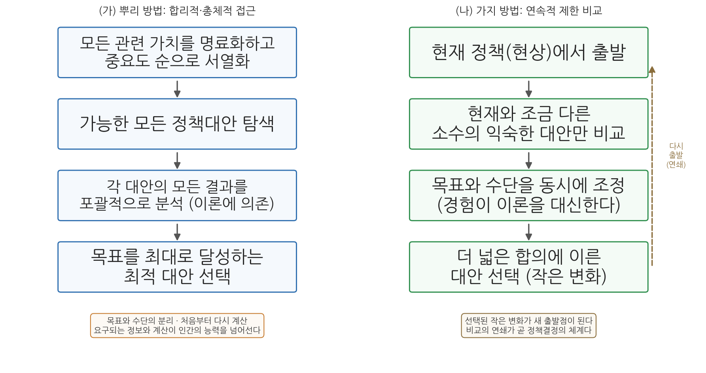
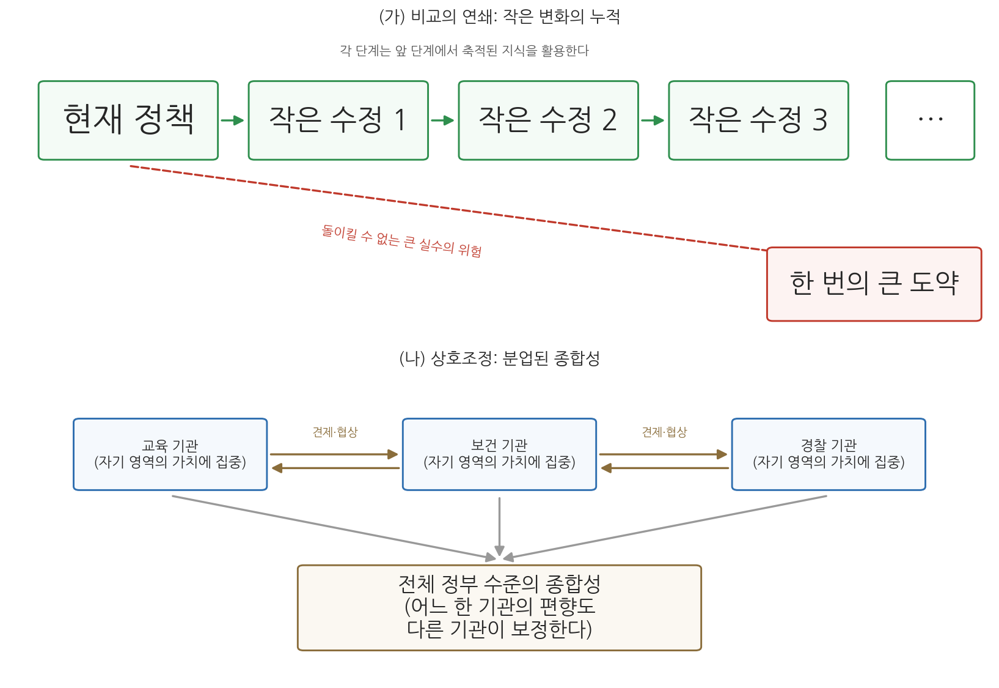

# 12주차 1차시. 점증주의: 린드블롬의 우왕좌왕하기의 과학

> "우왕좌왕(muddling through)"이라는 가벼운 표현 아래에는, 사실 고도로 세련된 문제해결의 논리가 숨어 있다.
> (찰스 린드블롬, 「우왕좌왕하기의 과학」)

## 이 장에서 배우는 것

어느 시청의 예산 담당 주무관을 상상해 보자. 새로 취임한 시장이 지시한다. "관행에 얽매이지 말고, 백지에서 시작해 우리 시의 모든 사업을 원점 재검토하세요. 시민의 모든 가치를 고려한 최적의 예산을 만들어 봅시다." 담당자는 책상 앞에서 막막해진다. 시민의 "모든 가치"가 무엇인지 어떻게 다 알아내는가. 수백 개 사업의 "모든 대안"과 "모든 결과"를 몇 달 안에 어떻게 다 계산하는가. 결국 그가 실제로 하는 일은 다르다. 작년 예산서를 펴 놓고, 문제가 드러난 사업을 조금 줄이고, 민원이 많았던 분야를 조금 늘리고, 새 시장의 공약 사업을 몇 개 끼워 넣는다. 이 담당자는 게으르거나 무능한가.

찰스 린드블롬은 1959년의 짧은 논문에서 정반대의 답을 내놓았다. 그 담당자가 하는 일이야말로 복잡한 공공문제에서 인간이 실제로 할 수 있는, 그리고 흔히 더 나은 결과를 내는 방법이라는 것이다. 그는 "모든 것을 고려해 최선을 고른다"는 교과서의 이상을 뿌리 방법이라 부르고, "현재에서 조금씩 고쳐 나간다"는 현실의 방법을 가지 방법이라 부른 뒤, 당당하게 후자를 변호했다. 10주차에서 읽은 허버트 사이먼이 "행정의 원리는 격언에 불과하다"며 고전 이론의 논리를 무너뜨렸다면, 린드블롬은 "합리적 결정"이라는 이상 자체가 현실에서 작동 불가능함을 보이고 그 자리에 점증주의를 세웠다.

이 장에서는 다음을 배운다.

- 린드블롬이 살았던 1950년대, 합리적 분석에 대한 낙관의 시대적 배경
- 뿌리 방법(합리적 총체주의)과 가지 방법(연속적 제한 비교)의 대비
- 가치와 분석이 왜 분리될 수 없는지, 좋은 정책의 기준이 왜 합의인지
- 지분적 비교의 연쇄와 상호조정이 만드는 "분업된 종합성"
- 점증주의의 현대적 유산: 예산 점증주의, 그리고 점증주의를 향한 비판

<strong>이 장의 로드맵</strong> 
이 장은 하나의 질문을 따라 전개된다. <em>"인간의 능력으로 감당할 수 없는 '완전한 합리성' 대신, 현실의 행정가는 무엇을 하고 있으며 그것은 변호될 수 있는가?"</em>  
<strong>1.1</strong> 린드블롬과 합리적 분석의 시대를 만난다 →
<strong>1.2</strong> 원전에서 두 방법(뿌리와 가지)의 대비를 읽는다 →
<strong>1.3</strong> 뿌리 방법이 왜 무너지는지, 가치와 분석이 어떻게 얽히는지 읽는다 →
<strong>1.4</strong> 좋은 정책의 기준이 왜 합의인지 읽는다 →
<strong>1.5</strong> 지분적 비교의 연쇄와 상호조정을 이해한다 →
<strong>1.6</strong> 예산 점증주의와 점증주의 비판까지, 현대적 함의를 정리한다.

## 1.1 찰스 린드블롬과 합리적 분석의 시대

<strong>인물 · 찰스 린드블롬(Charles E. Lindblom, 1917-2018)</strong> 
미국의 정치학자이자 경제학자로, 1917년 캘리포니아주 털록에서 태어나 그곳에서 자랐다. 1933년 스탠퍼드대학교에 들어가 경제학을 전공해 1936년 졸업한 뒤 시카고대학교 대학원에 진학했고, 생활비를 벌기 위해 미네소타대학교에서 경제학을 가르쳤다. 1945년 프랭크 나이트의 지도 아래 노동경제학 논문으로 박사학위를 받았으며, 1949년부터 1987년까지 예일대학교에서 경제학과 정치학을 함께 가르쳤다. 1963년부터 1965년까지는 미국 국제개발처(USAID) 사업으로 인도에 머물며 농업 정책에 관여했다. 예일에서 정치학과장(1972-74)과 사회정책연구소(ISPS) 소장(1974-80)을 지냈고, 대학 최고의 영예인 스털링 석좌교수에 올랐다. 1980-81년 미국정치학회 회장과 비교경제학회 회장을 맡았으며, 2002년 뉴멕시코주 샌타페이로 옮겨 2018년 100세로 사망했다. 
대표 저술: 『정치, 경제, 그리고 복지』(1953, 달과 공저), 「우왕좌왕하기의 과학」(1959), 『민주주의의 지성(The Intelligence of Democracy)』(1965), 『정치와 시장』(1977)

### 예일의 경제학자, 정치의 세계로

찰스 린드블롬(Charles E. Lindblom, 1917-2018)은 미국의 정치학자이자 경제학자로, 예일 대학교에서 오래 가르쳤다. 경제학자로 출발한 그는 시장 분석의 관점을 정치와 정책 연구에 적용한 학자였다. 동료였던 정치학자 로버트 달(Robert A. Dahl)과 함께 쓴 『정치, 경제, 그리고 복지』(1953)에서 그는 사회가 문제를 푸는 방식으로 시장의 가격기구와 정부의 위계 조직, 그리고 협상과 설득 같은 여러 조정 장치를 나란히 놓고 비교했다. 이런 배경이 그의 관점을 특별하게 만들었다. 그는 정책결정을 한 사람의 머릿속 계산 문제가 아니라, 수많은 참여자가 밀고 당기는 사회적 과정으로 보았다.

린드블롬은 로버트 달과 함께 다원주의(pluralism)의 대표적 이론가로 꼽힌다. 다원주의란 사회의 권력이 하나의 지배 엘리트에 집중되어 있지 않고 여러 전문화된 집단에 나뉘어 있으며, 이들 사이의 경쟁과 타협 속에서 자유민주주의가 작동한다고 보는 관점이다. 이 장에서 읽을 점증주의는 이 다원주의적 정치관과 밀접하게 연결되어 있다. 정책이 조금씩만 움직이는 이유, 그리고 그것이 나쁘지 않은 이유가 모두 여러 집단 사이의 상호 견제와 조정에서 나오기 때문이다. 다만 훗날의 린드블롬은 『정치와 시장』(1977)에서 기업이 다른 집단과 대등하지 않은 특권적 지위를 누린다고 지적하며 자신이 옹호했던 다원주의 그림을 스스로 수정하기도 했다. 사상가가 자기 이론의 약점을 평생에 걸쳐 고쳐 나간 드문 사례다.

### 1950년대: 합리적 분석에 대한 낙관

린드블롬이 논문을 쓴 1950년대 미국은 "과학적 분석으로 더 나은 결정을 내릴 수 있다"는 낙관이 번지던 시대였다. 제2차 세계대전에서 군수 물자의 수송과 폭격 목표 선정 같은 문제를 수학적으로 풀어낸 운영연구(operations research)가 명성을 얻었고, 랜드연구소(RAND Corporation) 같은 싱크탱크가 국방 문제에 체계분석(systems analysis)을 적용하고 있었다. 통계적 의사결정이론이 발전하면서, 목표를 세우고 대안을 나열하고 결과를 계산해 최적을 고른다는 합리적 결정의 절차가 교과서의 표준이 되어 갔다. 이 흐름은 13주차에서 볼 기획예산제도(PPBS)로 이어진다.

바로 이 지점에서 린드블롬은 「우왕좌왕하기의 과학(The Science of "Muddling Through")」(1959)을 미국 행정학회지(Public Administration Review)에 발표했다. 제목부터 도발적이다. "우왕좌왕한다(muddle through)"는 표현은 원래 뚜렷한 계획 없이 그럭저럭 헤쳐 나간다는 조롱 섞인 말인데, 린드블롬은 거기에 "과학"이라는 단어를 붙였다. 겉보기에 우왕좌왕처럼 보이는 현실의 정책결정이 사실은 일관된 논리를 가진 방법임을 보이겠다는 선언이다. 20년 뒤 그는 「여전히 우왕좌왕, 아직 끝나지 않았다(Still Muddling, Not Yet Through)」(1979)라는 후속 논문으로 자신의 주장을 가다듬었다. 두 논문은 정책결정 연구에서 가장 많이 읽히는 고전이 되었다.

10주차의 사이먼을 떠올려 보자. 사이먼은 인간의 인지 능력에 한계가 있어 완전한 합리성이 불가능하다는 제한된 합리성 개념을 제시했다. 린드블롬의 작업은 그 통찰을 개인 차원에서 정책과정 전체로 확장한 것으로 읽을 수 있다. 제한된 합리성을 가진 인간들이 모여 정책을 만들 때, 그 과정 전체는 어떤 모습을 띠는가. 린드블롬의 답이 점증주의다.

## 1.2 원전 강독 (1): 두 방법의 대비

논문은 한 편의 사고실험으로 시작한다. 인플레이션 대책을 맡은 행정가가 취할 수 있는 두 갈래 길이다.

<strong>원전 읽기 · 린드블롬, 「우왕좌왕하기의 과학」(1959)</strong> 
"어떤 행정가가 인플레이션에 관한 정책을 세울 책임을 맡았다고 하자. 그는 먼저 관련된 모든 가치를 중요한 순서대로 나열해 볼 수 있다. 완전고용, 적정한 기업이윤, 소액 저축의 보호, 주식시장 폭락의 방지 같은 것들이다. 그런 다음 가능한 모든 정책의 결과가 이 가치들을 얼마나 잘 달성하는지 평가할 수 있을 것이다. 물론 그러려면 사회 구성원이 지닌 모든 가치를 엄청난 규모로 목록화해야 하고, 각 정책이 각 가치에 미치는 영향을 똑같이 엄청난 규모로 분석해야 한다. 각 가치가 얼마나 중요한지, 하나의 정책이 여러 가치에 상반된 영향을 줄 때 그 상쇄관계를 어떻게 평가할지에 관한 방대한 계산과 판단이 뒤따라야 한다."

무슨 말인가. 이것이 교과서가 가르치는 합리적 결정의 절차다. 목표(가치)를 먼저 확정하고, 대안을 모두 찾고, 각 대안이 각 목표에 미치는 영향을 전부 계산한 뒤 최적을 고른다. 린드블롬은 이 절차를 충실히 따를 때 요구되는 작업량을 담담하게 나열하는 것만으로 그 규모를 실감하게 만든다. "모든 가치의 엄청난 목록화"와 "똑같이 엄청난 분석"이라는 표현에 이미 비판이 예고되어 있다.

왜 중요한가. 린드블롬은 허수아비를 공격하지 않는다. 그는 상대방의 방법을 가장 정직한 형태로 먼저 제시한다. 그래야 그 방법이 무너지는 지점이 어디인지 정확히 보일 수 있기 때문이다. 이어서 그는 같은 행정가가 실제로 택하는 다른 길을 보여 준다.

<strong>원전 읽기 · 린드블롬, 「우왕좌왕하기의 과학」(1959)</strong> 
"이와는 다른 접근법도 있다. 그는 가격을 안정시킨다는 비교적 단순한 목표를 자신의 주된 목표로 삼을 수 있다. 지금의 관심을 넘어서는 다른 사회적 가치들은 일단 제쳐 두고, 여러 가치의 상대적 중요도를 당장 서열화하려 들지 않을 것이다. 대신 그가 중요하다고 여기는 제한된 가치들에서 의미 있는 변화를 가져올 수 있다고 판단되는 몇몇 정책대안만을 간추릴 것이다. (…) 이 접근에서 정책결정은 기본 전제와 세부 내용을 조금씩 바꾸어 가는, 연속된 작은 단계들로 진행된다. 요컨대 그는 많은 목표를 미리 분명하게 세워 놓고 그에 맞는 최적의 수단을 찾는 것이 아니라, 경험과 점진적 비교를 통해 '덜 나쁜' 대안을 찾아가며, 필요하면 목표 자체도 조금씩 고쳐 나간다."

무슨 말인가. 둘째 길의 행정가는 처음부터 검토 범위를 좁힌다. 모든 가치가 아니라 몇 개의 가치, 모든 대안이 아니라 현재와 크게 다르지 않은 몇 개의 대안만 본다. 그리고 "최선"이 아니라 "덜 나쁜" 것을 고르며, 그 과정에서 목표 자체가 수정되는 것도 허용한다. 주목할 단어는 "연속된 작은 단계들"이다. 결정은 한 번의 큰 도약이 아니라 잇따르는 작은 변화다.

린드블롬은 이 두 접근에 기억하기 쉬운 이름을 붙인다. 첫째는 뿌리 방법(root method)이다. 매번 땅속 뿌리부터, 곧 근본 목표부터 새로 시작하기 때문이다. 둘째는 가지 방법(branch method)이다. 이미 서 있는 나무의 가지 끝에서, 곧 현재 상황에서 출발해 조금씩 뻗어 나가기 때문이다. 그는 뿌리 방법을 합리적 총체적(rational-comprehensive) 방법, 가지 방법을 연속적 제한 비교(successive limited comparisons)라고도 부른다. 그리고 논문의 목적을 분명히 밝힌다. 이 글은 둘째 접근, 곧 점진적 비교의 방법을 "변호"하고자 한다고.

그림 12-1을 읽는 법. 왼쪽(가)의 뿌리 방법은 가치의 명료화에서 최적 대안 선택까지 한 방향으로 내려가는 일직선 절차다. 매번 이 전체를 처음부터 다시 밟아야 한다. 오른쪽(나)의 가지 방법은 현재 정책에서 출발해 소수의 대안만 비교하고 작은 변화를 선택하는데, 오른쪽의 점선 화살표가 보여 주듯 선택된 결과가 다시 새로운 출발점이 된다. 여기서 알 수 있는 것은 두 방법의 차이가 단지 "분석의 양"이 아니라 구조 자체라는 점이다. 뿌리 방법은 일회성 계산이고, 가지 방법은 끝없이 이어지는 순환이다.

<strong>정의 · 점증주의</strong> 
<strong>점증주의</strong>(incrementalism)는 정책결정이 근본적 재설계가 아니라 현재 정책에서 조금씩 달라지는 대안들 사이의 제한된 비교, 곧 작은 변화(increment)의 연쇄로 이루어진다고 보는 관점이다. 린드블롬 자신의 용어로는 <strong>연속적 제한 비교</strong>(successive limited comparisons), 별칭으로는 <strong>가지 방법</strong>(branch method)이다. 반대편에 있는 것이 모든 가치·대안·결과를 포괄적으로 분석해 최적을 고르려는 <strong>합리적 총체주의</strong>, 곧 <strong>뿌리 방법</strong>(root method)이다.

## 1.3 원전 강독 (2): 뿌리 방법은 왜 무너지는가

### 감당할 수 없는 요구

이름을 붙였으니 이제 본격적인 논증이다. 린드블롬은 뿌리 방법이 복잡한 문제 앞에서 왜 작동하지 않는지를 간명하게 정리한다.

<strong>원전 읽기 · 린드블롬, 「우왕좌왕하기의 과학」(1959)</strong> 
"복잡한 문제에서 첫째 접근, 곧 뿌리 방식을 따르는 것은 사실상 불가능하다. 그 접근은 말로 묘사할 수는 있으나, 실제로는 비교적 단순한 문제에만, 그것도 다소 수정된 형태로만 적용될 수 있다. 인간의 지적 능력과 정보의 원천은 그 접근이 요구하는 바를 감당하지 못하며, 공공정책에서 늘 그렇듯 시간과 돈이 제한되어 있기에 그런 접근은 더더욱 비현실적이다. 행정가에게 중요한 점이 하나 더 있다. 공공기관의 규정된 기능과 제약, 곧 법률로 정해진 임무와 정치적으로 허용되는 범위 자체가 사실상 그를 둘째 접근으로 몰아간다는 사실이다. 그가 실제로 할 수 있는 것은 부분적인 가치와 부분적인 경험 분석에 기댄 제한적 비교뿐이며, 그 밖의 방식은 거의 상상하기도 어렵다."

무슨 말인가. 뿌리 방법이 무너지는 이유는 세 가지다. 첫째, 인지의 한계다. 인간의 머리는 모든 가치와 모든 결과를 담을 수 없다. 둘째, 자원의 한계다. 분석에는 시간과 돈이 들고, 정책은 분석이 끝날 때까지 미룰 수 없다. 셋째, 제도의 한계다. 행정기관은 법률이 정한 임무와 정치적으로 허용된 범위 안에서만 움직일 수 있으므로, 애초에 "모든 대안"을 검토할 권한 자체가 없다. 첫째와 둘째가 사이먼의 제한된 합리성과 겹치는 논거라면, 셋째는 린드블롬이 더한 정치적·제도적 논거다.

왜 중요한가. 이 대목에서 뿌리 방법은 "이상적이지만 어려운 방법"이 아니라 "기술할 수는 있으나 수행할 수는 없는 방법"으로 격하된다. 흥미롭게도 린드블롬은 당시 문헌들이 말로는 포괄적 분석의 엄정함을 찬양하면서, 실무 절차를 기술하는 대목에 이르면 자기도 모르게 둘째 접근을 묘사하고 있었다고 꼬집는다. 이론과 실천이 이미 어긋나 있었다는 것이다.

### 가치와 분석의 얽힘

뿌리 방법의 첫 단계는 "가치를 먼저 명료화하라"는 것이었다. 린드블롬은 이 첫 단계부터 성립하지 않음을 보인다. 그는 공공주택 정책의 예를 든다. 낡은 공공주택을 정비하려는 행정가는 "얼마나 빨리 비울 것인가", "퇴거하는 주민에게 어떤 대체 거주지를 얼마나 제공할 것인가", "이주를 받아들일 다른 지역 주민들의 수용 수준은 어디까지인가"라는, 서로 부딪히는 목표들을 동시에 다뤄야 한다. 신속한 정비를 앞세우면 주민 보호가 밀리고, 주민 보호를 앞세우면 정비가 늦어진다. 어느 가치가 우선인지는 추상적 서열표가 아니라 구체적 상황 속에서만 정해진다.

<strong>원전 읽기 · 린드블롬, 「우왕좌왕하기의 과학」(1959)</strong> 
"행정가는 자신이 실제로 선택해야 하는 것이, 그리고 선택할 수밖에 없는 것이, 서로 다른 가치들이 서로 다르게 묶인 꾸러미들 사이의 선택임을 곧 깨닫는다. (…) 결국 그는 '관련 가치 전체를 먼저 정식화하고, 그다음 그것을 달성할 정책을 고른다'는 절차가 실제로는 불가능함을 알게 된다. 실제로 가능한 유일한 절차는, 구체적인 대안들을 비교하면서 자신이 중요하게 여기는 가치들의 대략적인 모습을 그 선택을 통해 함께 드러내는 것이다. 목표의 명료화는 대안 비교의 결과이자 부산물이지, 그에 앞서는 단계가 아니다."

무슨 말인가. 마지막 문장이 이 논문에서 가장 급진적인 문장 가운데 하나다. 상식적 순서는 "목표를 정한다, 그다음 수단을 고른다"이다. 린드블롬은 이 순서를 뒤집는다. 우리는 대안 X와 대안 Y를 놓고 저울질하는 과정에서야 비로소 자신이 무엇을 얼마나 원하는지 알게 된다는 것이다. 목표는 선택에 앞서 존재하는 것이 아니라 선택 속에서 모습을 드러낸다. 수단과 목표는 분리되어 순서대로 처리되는 것이 아니라 동시에 선택된다.

왜 중요한가. 이 통찰은 행정 현장의 경험과 놀랄 만큼 부합한다. "우리 시의 교통 정책 목표가 무엇입니까"라고 물으면 담당자는 "원활한 소통과 안전"이라는 추상어밖에 내놓지 못한다. 그러나 "버스전용차로를 한 개 차선 늘리는 안과 주차요금을 올리는 안 중 무엇이 낫습니까"라고 물으면, 그는 두 안을 비교하는 가운데 자기 조직이 승용차 이용자의 불만과 대중교통 이용자의 편익 사이에서 실제로 어떤 균형을 원하는지 구체적으로 말하기 시작한다. 가치는 구체적인 대안과 함께 제시될 때에야 분명해진다.

## 1.4 원전 강독 (3): 좋은 정책의 기준은 합의

목표를 먼저 확정할 수 없다면 곤란한 문제가 생긴다. 뿌리 방법에서 "좋은 정책"이란 목표를 가장 잘 달성하는 정책이었다. 그런데 목표가 사전에 확정되지 않는다면, 어떤 정책이 좋은 정책인지 무엇으로 판별하는가.

<strong>원전 읽기 · 린드블롬, 「우왕좌왕하기의 과학」(1959)</strong> 
"뿌리 방식에서는 어떤 정책이 미리 명시된 목표에 더 잘 부합한다는 증거가 있으면 그 정책을 옳다거나 좋다거나 합리적이라고 말한다. 반면 가지 방식에서는 목표 자체가 추상적이거나 여러 개이며 수시로 바뀌기 때문에, 합의 그 자체가 주된 시험 기준이 된다. 정책이 목표에 논리적으로 들어맞는가 하는 '정확성'보다, 의견을 달리하는 참여자들이 어느 정도로 합의에 이르렀는가가 의사결정을 정당화하는 구심점이 되는 것이다. (…) 물론 이 합의가 좋은 정책의 결정적 증거가 되는 것은 아니다. 다만 현실의 정책선택에서는 완전하게 명시된 목표가 없어도 합의에 이르면 정책이 추진되며, 그 과정에서 목표와 수단이 함께 조정되고 변형된다."

무슨 말인가. 가지 방식에서 좋은 정책의 기준은 목표 적합성이 아니라 합의(agreement)다. 서로 다른 이유에서라도 여러 참여자가 "이 안이라면 받아들일 수 있다"고 모이면 그 정책은 정당성을 얻는다. 어떤 의원은 지역 경제 때문에, 어떤 시민단체는 환경 때문에, 어떤 부처는 예산 절감 때문에 같은 안을 지지할 수 있다. 목표에 대한 합의 없이 정책에 대한 합의가 성립하는 것이며, 린드블롬은 이것이 결함이 아니라 다원 사회에서 결정이 가능해지는 조건이라고 본다.

왜 중요한가. 이 기준은 정책의 정당성이 놓이는 자리를 분석에서 협의로 옮겨 놓는다. "계산이 맞다"가 아니라 "당사자들이 받아들였다"가 결정을 지탱한다는 것이다. 이는 5주차의 윌슨 이래 행정학이 애써 분리해 온 정치와 행정을 정책결정의 핵심에서 다시 결합시키는 주장이기도 하다. 다만 린드블롬 스스로 "합의가 좋은 정책의 결정적 증거는 아니다"라고 단서를 달았음에 유의하자. 합의는 현실적으로 작동하는 기준이지, 오류 불가능한 기준이 아니다. 이 단서는 1.6절의 비판, 그리고 다음 차시에 볼 프레드릭슨의 비판과 연결된다.

<strong>왜 사이먼과 린드블롬은 같으면서 다른가?</strong> 
두 사람 모두 완전한 합리성이 불가능하다는 데서 출발한다. 그러나 처방이 다르다. 사이먼의 <strong>만족화</strong>(satisficing)는 개인 결정자가 "충분히 좋은" 대안에서 탐색을 멈추는 심리적 전략이다. 린드블롬의 <strong>점증주의</strong>는 여러 참여자가 작은 변화를 놓고 협상하는 사회적·정치적 과정이다. 사이먼이 결정자의 사고 과정을 다시 설명했다면, 린드블롬은 결정이 이루어지는 정치의 장 전체를 다시 설명했다. 또한 사이먼은 제한된 합리성을 보완할 조직 설계와 (훗날의) 인공지능에 기대를 걸었지만, 린드블롬은 분석의 개선보다 상호조정이라는 정치적 메커니즘에서 답을 찾았다.

## 1.5 지분적 비교의 연쇄와 상호조정

### 비포괄성의 제도화

가지 방법은 많은 것을 생략한다. 검토하는 대안도 소수, 고려하는 가치도 일부, 예측하는 결과도 일부다. 뿌리 방법의 기준으로 보면 이는 부실 분석이다. 린드블롬의 응답은 뜻밖이다. 그는 생략을 감추기는커녕, 연속적 제한 비교가 이 비포괄성을 "체계적으로 제도화"한 방법이라고 말한다. 어차피 인간의 분석은 단순화될 수밖에 없다. 그렇다면 아무렇게나 단순화할 것이 아니라, 현명하게 단순화하는 규칙을 갖추자는 것이다. 그 규칙이 두 가지다. 첫째, 과거 정책과 조금 다른 대안들만 비교한다(증분적 비교). 낯익은 범위 안의 변화는 경험이라는 증거를 활용할 수 있기 때문이다. 둘째, 고려하는 가치의 범위를 의도적으로 좁힌다. 내가 놓친 가치는 그 가치를 지키는 다른 누군가가 챙길 것이기 때문이다.

이 둘째 규칙이 성립하려면 조건이 필요하다. 바로 "다른 누군가"가 실제로 존재해야 한다는 것이다. 여기서 점증주의는 다원주의 정치 이론과 연결된다.

<strong>원전 읽기 · 린드블롬, 「우왕좌왕하기의 과학」(1959)</strong> 
"연속적 제한 비교의 마지막 특징은, 비교가 시간 순서의 연쇄로 이루어진다는 점이다. 정책은 한 번에 만들어지지 않으며, 연속된 의사결정이 쌓이는 가운데 형성된다. 정책결정자는 각 단계에서 이전 단계들이 쌓아 놓은 지식을 활용해 다음의 작은 변화를 모색한다. 이 과정은 큰 실수를 피하는 데 특히 유리하다. 갑작스러운 큰 변화를 밀어붙일 때 생길 수 있는 돌이킬 수 없는 오류를, 작은 변화의 누적으로 나누어 완화할 수 있기 때문이다. (…) 연속적 제한 비교는 실패를 얼버무리는 미봉책이 아니며, 변명해야 할 접근도 아니다. 그것은 정책결정의 보편적 체계다. 물론 결함이 없지는 않다. 그러나 그것은 '비과학'도 '무계획'도 아니며, 오히려 인간의 인지적 한계와 민주정치의 구조를 현실적으로 반영한, 가장 실천 가능한 방법이다."

무슨 말인가. 앞부분은 지분적 비교의 연쇄, 곧 가지에서 가지로 이어지는 비교의 시간적 축적을 말한다. 각 단계의 작은 선택은 그 자체로는 보잘것없어 보여도, 앞 단계의 경험이라는 지식에 기대고 있으며 뒤 단계의 수정 가능성을 열어 둔다. 방향이 틀렸음이 드러나면 다음 단계에서 고치면 된다. 반면 한 번의 큰 도약은 틀렸을 때 되돌릴 수 없다. 뒷부분은 논문 전체의 결론이다. 우왕좌왕은 실패의 고백이 아니라 정책결정의 보편적 체계라는 당당한 재규정이다.

왜 중요한가. 점증주의를 "큰 실수 회피의 장치"로 읽는 이 대목은 점증주의 옹호의 핵심 논거다. 정책은 실험실의 가설과 달리 실패의 비용을 시민이 치른다. 작은 변화의 연쇄는 정책 전체를 일종의 신중한 연속 실험으로 만들어, 오류를 조기에 발견하고 저렴하게 교정할 수 있게 한다.

### 상호조정: 흩어진 결정들이 서로를 보정한다

그렇다면 각자가 좁은 가치만 챙기는데 전체는 누가 챙기는가. 린드블롬의 답은 "아무도 챙기지 않지만, 모두가 함께 챙기게 된다"는 것이다. 그는 교육·보건·경찰처럼 서로 다른 기관들이 각자의 전문 영역에 집중할 때, 전체 정부가 분업된 종합성에 이른다고 말한다. 어느 한 기관도 모든 가치를 반영할 수 없지만, 각 기관이 자기 가치를 지키며 서로 견제하고 협상하는 가운데 한쪽의 편향이 다른 쪽에 의해 보정된다는 것이다. 그는 이 메커니즘을 당파적 상호조정(partisan mutual adjustment)이라 불렀고, 이후의 저작에서 이 개념을 정교하게 발전시켰다. 물론 원전은 이 상호조정이 완전하지 않으며 때로는 갈등을 키운다는 점도 인정한다. 그럼에도 실제의 민주정치에서는 이것이 "가능한 최선의 종합성"이라는 것이 린드블롬의 판단이다.

그림 12-2를 읽는 법. 위쪽(가)은 시간 축 위의 연쇄다. 현재 정책에서 작은 수정이 잇따라 이어지며, 각 단계는 앞 단계에서 축적된 지식을 사용한다. 아래로 뻗은 붉은 점선은 이 연쇄를 건너뛰는 "한 번의 큰 도약"이며, 돌이킬 수 없는 실수의 위험을 안고 있다. 아래쪽(나)은 같은 시점의 공간적 분업이다. 각 기관은 자기 영역의 가치에만 집중하지만, 기관 사이의 견제와 협상(갈색 화살표)을 거쳐 전체 수준의 종합성이 만들어진다. 여기서 알 수 있는 것은 점증주의가 시간 차원(연쇄)과 공간 차원(상호조정)의 두 축으로 완성된다는 점이다. 개별 결정은 비포괄적이어도, 체계 전체는 시간과 공간에 걸쳐 포괄성을 회복한다.

<strong>정의 · 당파적 상호조정</strong> 
<strong>당파적 상호조정</strong>(partisan mutual adjustment)은 중앙의 종합 계획자 없이, 서로 다른 이해와 가치를 가진 다수의 참여자(기관, 정당, 집단)가 협상·설득·견제를 주고받는 가운데 사회 전체 수준의 조정이 이루어지는 메커니즘이다. 시장에서 중앙의 가격 결정자 없이 수요와 공급이 조정되는 것에 비견되는, 정치 영역의 분권적 조정 장치다.

<strong>유의 · "우왕좌왕"은 자조가 아니다</strong> 
muddling through를 "우왕좌왕하기"로 옮기면 무능과 혼란의 어감이 앞선다. 그러나 린드블롬의 용법은 반어에 가깝다. 그는 세간에서 조롱의 뜻으로 쓰이던 말을 일부러 제목에 올려놓고, 그 안에 "고도로 세련된 문제해결의 논리"가 있음을 논증했다. 이 논문을 "행정가는 대충 해도 된다"는 면죄부로 읽는 것은 정반대의 오독이다. 린드블롬이 옹호한 것은 분석의 포기가 아니라, 인간이 실제로 감당할 수 있는 자리에 분석을 배치하는 전략이다.

## 1.6 현대적 함의: 예산 점증주의와 점증주의 비판

### 예산 점증주의

점증주의가 가장 강력한 설명력을 보인 영역은 예산이다. 정치학자 아론 윌다브스키(Aaron Wildavsky)는 『예산과정의 정치』(1964)에서 미국 연방예산이 실제로 어떻게 편성되는지를 분석해, 각 기관 예산의 가장 강력한 예측 변수가 "작년 예산"임을 보였다. 예산 심의는 사업 전체의 타당성을 매년 원점에서 따지는 것이 아니라, 기존 규모(base)를 대체로 인정한 채 올해의 증감분(increment)에 논의를 집중한다는 것이다. 이를 예산 점증주의라 부른다. 한국의 예산 과정을 관찰해도 비슷한 모습이 보인다. 각 부처의 다음 해 예산요구는 통상 전년도 예산을 기준선으로 삼아 작성되고, 국회 심의에서도 쟁점은 전체가 아니라 증액·감액 대상 사업에 몰린다. 린드블롬의 관점에서 보면 이는 태만이 아니라 합리적 단순화다. 수백조 원 규모의 예산 전체를 매년 백지에서 재검토하는 일은 어떤 조직의 분석 능력으로도 감당할 수 없기 때문이다.

이 지점은 다음 주에 다룰 주제와 정면으로 대립한다. 13주차에서 읽을 앨런 쉬크(Allen Schick)의 기획예산제도(PPBS) 논의는 바로 이 점증주의적 예산을 합리적 분석으로 대체하려 한 야심찬 개혁의 기록이다. 점증주의와 합리주의 예산개혁의 대결은 행정학에서 가장 오래된 논쟁 축 가운데 하나이며, 그 대결의 결말은 13주차에서 확인하게 된다.

### 점증주의를 향한 비판

점증주의는 발표 직후부터 강한 반론을 불렀다. 비판은 크게 세 가지다.

첫째, 보수성이다. 현재에서 조금씩만 움직이는 방법은 현재의 배분 상태, 곧 기득권을 사실상 정당화한다. 협상과 합의가 기준이라면, 협상 테이블에 앉을 힘조차 없는 집단의 이익은 누가 대변하는가. 이 비판은 다음 차시의 프레드릭슨에서 정면으로 제기된다. 그는 다원주의 정부가 조직화된 집단에게 유리하도록 "체계적으로 차별"한다고 주장하며, 상호조정이 만드는 균형이 결코 중립적이지 않음을 지적했다.

둘째, 큰 문제 앞에서의 무력함이다. 위기 대응이나 근본적 전환이 필요한 문제, 예컨대 전쟁 수행이나 구조적 불평등 같은 사안에서 작은 변화의 누적은 답이 되지 못할 수 있다. 예헤츠켈 드로어(Yehezkel Dror)는 점증주의가 안정된 사회, 만족스러운 기존 정책이라는 특수한 조건에서만 타당하며, 그 밖에서는 타성의 옹호가 된다고 비판했다. 아미타이 에치오니(Amitai Etzioni)는 절충안으로 혼합탐사모형(mixed scanning)을 제안했다. 평소에는 점증적으로 움직이되, 중요한 갈림길에서는 시야를 넓혀 근본적 방향을 훑어보자는 것이다.

셋째, 방향 상실의 위험이다. 작은 변화가 쌓인다고 저절로 좋은 결과에 이르지는 않는다. 단계마다 "덜 나쁜" 쪽을 골라도, 전체 방향은 아무도 의도하지 않은 곳으로 흘러갈 수 있다. 린드블롬은 1979년의 후속 논문에서 이런 비판들에 답하면서도 기본 입장을 굽히지 않았다. 큰 문제일수록 큰 도약의 오류 비용도 크므로, 필요한 것은 점증주의의 포기가 아니라 더 기민하고 전략적인 점증주의라는 것이다.

오늘의 행정에서 점증주의는 기술(記述) 이론으로서는 굳건히 살아 있다. 각국의 정책 변화 대부분이 점증적이라는 관찰은 이후 정책과정 연구에서 거듭 확인되었다. 반면 규범 이론으로서는 여전히 논쟁 중이다. 기후위기처럼 작은 변화만으로는 시한을 맞출 수 없어 보이는 문제들이, "가장 실천 가능한 방법"과 "필요한 만큼 큰 변화" 사이의 긴장을 오늘도 되살리고 있기 때문이다.

## 요약

찰스 린드블롬(1917-2018)은 예일 대학교의 정치학자·경제학자로, 로버트 달과 함께 다원주의를 대표하는 이론가였다. 합리적 분석에 대한 낙관이 번지던 1950년대 말, 그는 「우왕좌왕하기의 과학」(1959)에서 두 가지 정책결정 방법을 대비시켰다. 뿌리 방법(합리적 총체주의)은 모든 가치를 명료화하고 모든 대안과 결과를 분석해 최적을 고르는 절차이지만, 인지·자원·제도의 삼중 한계 때문에 복잡한 문제에서는 수행 불가능하다. 가지 방법(연속적 제한 비교)은 현재 정책에서 조금 다른 소수의 대안만 비교해 덜 나쁜 것을 고르는 절차로, 현실의 행정가가 실제로 쓰는 방법이다. 가지 방법에서 가치와 분석은 얽혀 있어 목표의 명료화는 대안 비교의 부산물이며, 수단과 목표는 동시에 선택되고, 좋은 정책의 기준은 목표 적합성이 아니라 참여자들의 합의다. 개별 결정의 비포괄성은 시간 축의 비교의 연쇄와 공간 축의 당파적 상호조정을 통해 보완되어, 정부 전체는 분업된 종합성에 이른다. 점증주의는 예산 연구(윌다브스키)에서 강력한 설명력을 입증했으나, 기득권을 정당화하는 보수성, 큰 문제 앞의 무력함, 방향 상실의 위험이라는 비판(드로어, 에치오니)을 받았다. 그 첫째 비판을 정면으로 밀고 나간 것이 다음 차시의 신행정학이다.

## 토론·복습 문제

**12-1. (서술형, 기말 대비)** 린드블롬이 말한 뿌리 방법과 가지 방법을 각각의 특징(가치의 처리, 수단과 목표의 관계, 분석의 범위, 이론 의존)에 따라 대비하여 설명하고, 그가 가지 방법을 "정책결정의 보편적 체계"로 변호한 근거를 논의하시오.

**12-2. (원전 해석형)** 다음 구절을 읽고 물음에 답하라. "목표의 명료화는 대안 비교의 결과이자 부산물이지, 그에 앞서는 단계가 아니다." 이 문장이 뒤집고 있는 상식적 절차는 무엇인가. 또한 이 주장이 옳다면, "정책 목표를 먼저 명확히 하라"는 흔한 실무 지침은 어떤 의미에서 재해석되어야 하는지 자신의 견해를 밝히시오.

**12-3. (적용형)** 우리나라의 국가 예산 과정(부처의 예산요구, 기획재정부의 심사, 국회 심의)에서 점증주의적이라 할 만한 특징을 두 가지 찾고, 각각이 린드블롬의 어떤 개념(증분적 비교, 합의 기준, 상호조정 등)에 대응하는지 설명해 보라.

**12-4. (비판형)** "기후위기 대응처럼 큰 전환이 필요한 문제에 점증주의는 무책임하다"는 비판이 있다. 이 비판의 논거를 정리한 뒤, 1979년의 린드블롬이라면 어떻게 응답했을지 원전의 논리(큰 실수의 회피, 비교의 연쇄)를 활용해 재구성해 보라.
