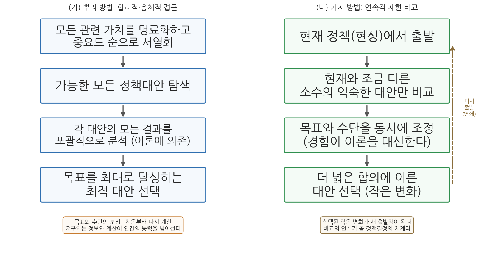
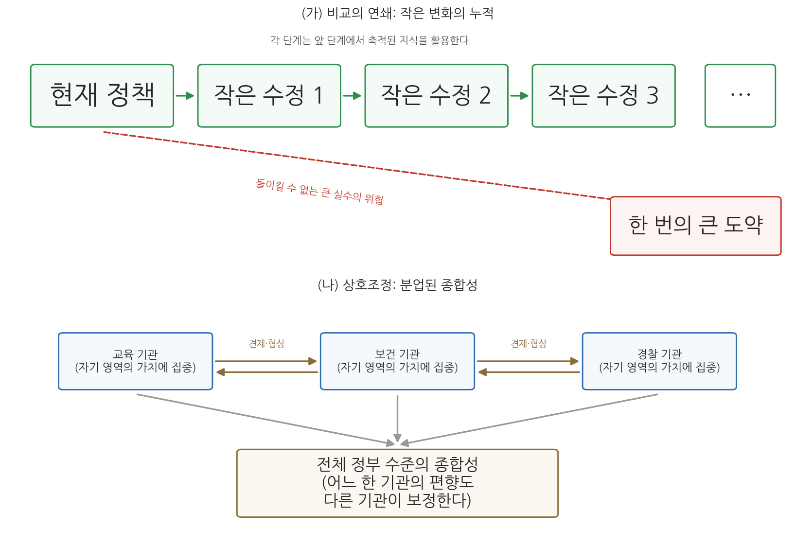

# 12주차 1차시. 점증주의: 린드블롬의 우왕좌왕하기의 과학

> "우왕좌왕(muddling through)"이라는 가벼운 표현 아래에는, 사실 고도로 세련된 문제해결의 논리가 숨어 있다.
> (찰스 린드블롬, 「우왕좌왕하기의 과학」)

## 이 장에서 배우는 것

어느 시청의 예산 담당 주무관을 상상해 보자. 새로 취임한 시장이 지시한다. "관행에 얽매이지 말고, 백지에서 시작해 우리 시의 모든 사업을 원점 재검토하세요. 시민의 모든 가치를 고려한 최적의 예산을 만들어 봅시다." 담당자는 책상 앞에서 막막해진다. 시민의 "모든 가치"가 무엇인지 어떻게 다 알아내는가. 수백 개 사업의 "모든 대안"과 "모든 결과"를 몇 달 안에 어떻게 다 계산하는가. 결국 그가 실제로 하는 일은 다르다. 작년 예산서를 펴 놓고, 문제가 드러난 사업을 조금 줄이고, 민원이 많았던 분야를 조금 늘리고, 새 시장의 공약 사업을 몇 개 끼워 넣는다. 이 담당자는 게으르거나 무능한가.

찰스 린드블롬은 1959년의 짧은 논문에서 정반대의 답을 내놓았다. 그 담당자가 하는 일이야말로 복잡한 공공문제에서 인간이 실제로 할 수 있는, 그리고 흔히 더 나은 결과를 내는 방법이라는 것이다. 그는 "모든 것을 고려해 최선을 고른다"는 교과서의 이상을 뿌리 방법이라 부르고, "현재에서 조금씩 고쳐 나간다"는 현실의 방법을 가지 방법이라 부른 뒤, 당당하게 후자를 변호했다. 10주차에서 읽은 허버트 사이먼이 "행정의 원리는 격언에 불과하다"며 고전 이론의 논리를 무너뜨렸다면, 린드블롬은 "합리적 결정"이라는 이상 자체가 현실에서 작동 불가능함을 보이고 그 자리에 점증주의를 세웠다.

이 장에서는 다음을 배운다.

- 린드블롬이 살았던 1950년대, 합리적 분석에 대한 낙관의 시대적 배경
- 뿌리 방법(합리적 총체주의)과 가지 방법(연속적 제한 비교)의 대비
- 가치와 분석이 왜 분리될 수 없는지, 좋은 정책의 기준이 왜 합의인지
- 지분적 비교의 연쇄와 상호조정이 만드는 "분업된 종합성", 그리고 이론 대신 비교의 축적에 기대는 실무가의 판단
- 점증주의의 현대적 유산: 예산 점증주의, 국내외의 점증적 개혁과 총체적 개혁 사례, 그리고 점증주의를 향한 비판

<strong>이 장의 로드맵</strong> 
이 장은 하나의 질문을 따라 전개된다. <em>"인간의 능력으로 감당할 수 없는 '완전한 합리성' 대신, 현실의 행정가는 무엇을 하고 있으며 그것은 변호될 수 있는가?"</em>  
<strong>1.1</strong> 린드블롬과 합리적 분석의 시대를 만난다 →
<strong>1.2</strong> 원전에서 두 방법(뿌리와 가지)의 대비를 읽는다 →
<strong>1.3</strong> 뿌리 방법이 왜 무너지는지, 가치와 분석이 어떻게 얽히는지 읽는다 →
<strong>1.4</strong> 좋은 정책의 기준이 왜 합의인지 읽는다 →
<strong>1.5</strong> 지분적 비교의 연쇄와 상호조정, 국지적 이론의 의미를 이해한다 →
<strong>1.6</strong> 예산과 연금 개혁 등 국내외 사례, 그리고 점증주의 비판까지 현대적 함의를 정리한다.

## 1.1 찰스 린드블롬과 합리적 분석의 시대

<strong>인물 · 찰스 린드블롬(Charles E. Lindblom, 1917-2018)</strong> 
미국의 정치학자이자 경제학자로, 1917년 캘리포니아주 털록에서 태어나 그곳에서 자랐다. 1933년 스탠퍼드대학교에 들어가 경제학을 전공해 1936년 졸업한 뒤 시카고대학교 대학원에 진학했고, 생활비를 벌기 위해 미네소타대학교에서 경제학을 가르쳤다. 1945년 프랭크 나이트의 지도 아래 노동경제학 논문으로 박사학위를 받았으며, 1949년부터 1987년까지 예일대학교에서 경제학과 정치학을 함께 가르쳤다. 1963년부터 1965년까지는 미국 국제개발처(USAID) 사업으로 인도에 머물며 농업 정책에 관여했다. 예일에서 정치학과장(1972-74)과 사회정책연구소(ISPS) 소장(1974-80)을 지냈고, 대학 최고의 영예인 스털링 석좌교수에 올랐다. 1980-81년 미국정치학회 회장과 비교경제학회 회장을 맡았으며, 2002년 뉴멕시코주 샌타페이로 옮겨 2018년 100세로 사망했다. 
대표 저술: 『정치, 경제, 그리고 복지』(1953, 달과 공저), 「우왕좌왕하기의 과학」(1959), 『민주주의의 지성(The Intelligence of Democracy)』(1965), 『정치와 시장』(1977)

### 예일의 경제학자, 정치의 세계로

찰스 린드블롬(Charles E. Lindblom, 1917-2018)은 미국의 정치학자이자 경제학자로, 예일 대학교에서 오래 가르쳤다. 경제학자로 출발한 그는 시장 분석의 관점을 정치와 정책 연구에 적용한 학자였다. 동료였던 정치학자 로버트 달(Robert A. Dahl)과 함께 쓴 『정치, 경제, 그리고 복지』(1953)에서 그는 사회가 문제를 푸는 방식으로 시장의 가격기구와 정부의 위계 조직, 그리고 협상과 설득 같은 여러 조정 장치를 나란히 놓고 비교했다. 이런 배경이 그의 관점을 특별하게 만들었다. 그는 정책결정을 한 사람의 머릿속 계산 문제가 아니라, 수많은 참여자가 밀고 당기는 사회적 과정으로 보았다.

린드블롬은 로버트 달과 함께 다원주의(pluralism)의 대표적 이론가로 꼽힌다. 다원주의란 사회의 권력이 하나의 지배 엘리트에 집중되어 있지 않고 여러 전문화된 집단에 나뉘어 있으며, 이들 사이의 경쟁과 타협 속에서 자유민주주의가 작동한다고 보는 관점이다. 이 장에서 읽을 점증주의는 이 다원주의적 정치관과 밀접하게 연결되어 있다. 정책이 조금씩만 움직이는 이유, 그리고 그것이 나쁘지 않은 이유가 모두 여러 집단 사이의 상호 견제와 조정에서 나오기 때문이다. 다만 훗날의 린드블롬은 『정치와 시장』(1977)에서 기업이 다른 집단과 대등하지 않은 특권적 지위를 누린다고 지적하며 자신이 옹호했던 다원주의 그림을 스스로 수정하기도 했다. 사상가가 자기 이론의 약점을 평생에 걸쳐 고쳐 나간 드문 사례다.

### 1950년대: 합리적 분석에 대한 낙관

린드블롬이 논문을 쓴 1950년대 미국은 "과학적 분석으로 더 나은 결정을 내릴 수 있다"는 낙관이 번지던 시대였다. 제2차 세계대전에서 군수 물자의 수송과 폭격 목표 선정 같은 문제를 수학적으로 풀어낸 운영연구(operations research)가 명성을 얻었고, 랜드연구소(RAND Corporation) 같은 싱크탱크가 국방 문제에 체계분석(systems analysis)을 적용하고 있었다. 통계적 의사결정이론이 발전하면서, 목표를 세우고 대안을 나열하고 결과를 계산해 최적을 고른다는 합리적 결정의 절차가 교과서의 표준이 되어 갔다. 이 흐름은 13주차에서 볼 기획예산제도(PPBS)로 이어진다.

이 시대의 분위기를 보여 주는 인물이 경제학자 찰스 히치(Charles J. Hitch)다. 히치는 1950년대 랜드연구소의 경제 부문을 이끌며 무기체계의 비용과 효과를 비교 평가하는 체계분석 작업을 주도했다. 린드블롬은 이 논문에서 히치를 이 분야의 지도적 연구자로 직접 거론하는데, 흥미롭게도 히치 자신이 실제 운영연구는 하위 수준의 문제를 적정한 수준에서 푸는 "준최적화(suboptimization)"의 성격을 띤다고 인정했다는 점을 짚는다. 합리적 분석의 대표자조차 현실에서는 문제를 잘게 나누어 부분적으로 풀고 있었다는 것이다. 히치는 논문이 나온 지 2년 뒤인 1961년 로버트 맥나마라 국방장관에 의해 국방부 감사관(Comptroller)으로 임명되었고, 그곳에서 전략과 병력과 예산을 연결하는 기획예산제도와 5개년 국방계획을 만들었다. 린드블롬이 점증주의를 변호하던 바로 그 시기에, 그가 비판한 합리적 분석은 미국 정부의 중심부로 들어가고 있었던 셈이다. 13주차에서 읽을 쉬크의 논문은 이 흐름이 연방정부 전체로 확산되던 국면의 기록이다.

바로 이 지점에서 린드블롬은 「우왕좌왕하기의 과학(The Science of "Muddling Through")」(1959)을 미국 행정학회지(Public Administration Review)에 발표했다. 제목부터 도발적이다. "우왕좌왕한다(muddle through)"는 표현은 원래 뚜렷한 계획 없이 그럭저럭 헤쳐 나간다는 조롱 섞인 말인데, 린드블롬은 거기에 "과학"이라는 단어를 붙였다. 겉보기에 우왕좌왕처럼 보이는 현실의 정책결정이 사실은 일관된 논리를 가진 방법임을 보이겠다는 선언이다. 20년 뒤 그는 「여전히 우왕좌왕, 아직 끝나지 않았다(Still Muddling, Not Yet Through)」(1979)라는 후속 논문으로 자신의 주장을 가다듬었다. 두 논문은 정책결정 연구에서 가장 많이 읽히는 고전이 되었다.

1959년 논문은 미국 행정학회지 제19권 2호에 열 쪽 남짓한 분량으로 실렸다. 짧은 글이지만 린드블롬은 이후 20년 동안 이 주제를 여러 저작으로 넓혀 갔다. 1963년에는 정치철학자 데이비드 브레이브루크(David Braybrooke)와 함께 『결정의 전략(A Strategy of Decision)』을 펴내 정책 평가를 하나의 사회적 과정으로 다루었고, 1965년의 『민주주의의 지성』에서는 이 장의 1.5절에서 볼 당파적 상호조정 개념을 본격적으로 전개했다. 1979년의 후속 논문에서는 점증주의를 세 층위로 나누어 다시 정리했다. 현 상태에서 조금 벗어난 대안만 검토하는 단순 점증적 분석(simple incremental analysis), 분석을 의도적으로 불완전하게 설계하는 분절적 점증주의(disjointed incrementalism), 그리고 가능한 범위에서 문제를 넓게 살피되 완전한 분석을 고집하지 않는 전략적 분석(strategic analysis)이다. 이 구분은 점증주의가 "조금만 바꾸라"는 단순한 처방이 아니라, 분석을 어디까지 하고 어디서 멈출지를 정하는 방법론이라는 점을 보여 준다.

10주차의 사이먼을 떠올려 보자. 사이먼은 인간의 인지 능력에 한계가 있어 완전한 합리성이 불가능하다는 제한된 합리성 개념을 제시했다. 린드블롬의 작업은 그 통찰을 개인 차원에서 정책과정 전체로 확장한 것으로 읽을 수 있다. 제한된 합리성을 가진 인간들이 모여 정책을 만들 때, 그 과정 전체는 어떤 모습을 띠는가. 린드블롬의 답이 점증주의다.

11주차의 드와이트 왈도와 비교해 보는 것도 도움이 된다. 왈도는 행정이론이 곧 정치이론이며 행정가는 가치판단을 피할 수 없다고 보았다. 린드블롬도 행정가의 결정이 가치 판단과 떼어 낼 수 없다고 본다는 점에서 같은 방향에 서 있다. 다만 왈도가 행정학이 어떤 가치를 추구해야 하는가를 물었다면, 린드블롬은 가치가 서로 다투는 상황에서 결정이 실제로 어떻게 내려지는가를 물었다. 앞의 질문이 규범의 질문이라면 뒤의 질문은 절차와 과정의 질문이다. 이 장을 읽을 때는 린드블롬이 "점증주의가 좋다"는 규범적 주장과 "정책결정은 실제로 점증적이다"라는 기술적 주장을 함께 펼치고 있다는 점을 기억해 두는 것이 좋다. 두 주장은 서로 기대고 있지만, 1.6절에서 보듯 비판자들은 주로 앞의 주장을 겨냥했다.

## 1.2 원전 강독 (1): 두 방법의 대비

논문은 한 편의 사고실험으로 시작한다. 인플레이션 대책을 맡은 행정가가 취할 수 있는 두 갈래 길이다.

<strong>원전 읽기 · 린드블롬, 「우왕좌왕하기의 과학」(1959)</strong> 
"어떤 행정가가 인플레이션에 관한 정책을 세울 책임을 맡았다고 하자. 그는 먼저 관련된 모든 가치를 중요한 순서대로 나열해 볼 수 있다. 완전고용, 적정한 기업이윤, 소액 저축의 보호, 주식시장 폭락의 방지 같은 것들이다. 그런 다음 가능한 모든 정책의 결과가 이 가치들을 얼마나 잘 달성하는지 평가할 수 있을 것이다. 물론 그러려면 사회 구성원이 지닌 모든 가치를 엄청난 규모로 목록화해야 하고, 각 정책이 각 가치에 미치는 영향을 똑같이 엄청난 규모로 분석해야 한다. 각 가치가 얼마나 중요한지, 하나의 정책이 여러 가치에 상반된 영향을 줄 때 그 상쇄관계를 어떻게 평가할지에 관한 방대한 계산과 판단이 뒤따라야 한다."

무슨 말인가. 이것이 교과서가 가르치는 합리적 결정의 절차다. 목표(가치)를 먼저 확정하고, 대안을 모두 찾고, 각 대안이 각 목표에 미치는 영향을 전부 계산한 뒤 최적을 고른다. 린드블롬은 이 절차를 충실히 따를 때 요구되는 작업량을 담담하게 나열하는 것만으로 그 규모를 실감하게 만든다. "모든 가치의 엄청난 목록화"와 "똑같이 엄청난 분석"이라는 표현에 이미 비판이 예고되어 있다.

이 작업량을 간단한 계산으로 짐작해 보자. 인플레이션 정책에서 고려할 가치가 10개이고 검토할 정책대안이 20개라고만 해도, 행정가는 각 대안이 각 가치에 주는 영향을 200번 추정해야 한다. 여기에 가치마다 가중치를 매기는 판단이 10번, 한 대안이 어떤 가치는 높이고 다른 가치는 낮출 때 그 득실을 맞바꾸는 판단이 대안마다 따로 필요하다. 게다가 린드블롬은 원문에서 이 모든 분석에 앞서 "완전고용"처럼 익숙한 가치조차 구체적으로 무엇을 뜻하는지, 어떤 상태를 그 가치의 달성으로 볼지 미리 정해 두어야 한다고 덧붙인다. 실업률이 몇 퍼센트 이하면 완전고용인가, 단기 일자리도 고용으로 셀 것인가 같은 질문에 먼저 답해야 한다는 것이다. 가치와 대안의 수가 늘어날수록 필요한 판단의 수는 곱절로 불어난다. 현실의 경제정책에서 가치가 10개, 대안이 20개에 그칠 리 없다는 점을 생각하면, 뿌리 방법이 요구하는 분석이 어떤 규모인지 짐작할 수 있다.

왜 중요한가. 린드블롬은 허수아비를 공격하지 않는다. 그는 상대방의 방법을 가장 정직한 형태로 먼저 제시한다. 그래야 그 방법이 무너지는 지점이 어디인지 정확히 보일 수 있기 때문이다. 이어서 그는 같은 행정가가 실제로 택하는 다른 길을 보여 준다.

<strong>원전 읽기 · 린드블롬, 「우왕좌왕하기의 과학」(1959)</strong> 
"이와는 다른 접근법도 있다. 그는 가격을 안정시킨다는 비교적 단순한 목표를 자신의 주된 목표로 삼을 수 있다. 지금의 관심을 넘어서는 다른 사회적 가치들은 일단 제쳐 두고, 여러 가치의 상대적 중요도를 당장 서열화하려 들지 않을 것이다. 대신 그가 중요하다고 여기는 제한된 가치들에서 의미 있는 변화를 가져올 수 있다고 판단되는 몇몇 정책대안만을 간추릴 것이다. (…) 이 접근에서 정책결정은 기본 전제와 세부 내용을 조금씩 바꾸어 가는, 연속된 작은 단계들로 진행된다. 요컨대 그는 많은 목표를 미리 분명하게 세워 놓고 그에 맞는 최적의 수단을 찾는 것이 아니라, 경험과 점진적 비교를 통해 '덜 나쁜' 대안을 찾아가며, 필요하면 목표 자체도 조금씩 고쳐 나간다."

무슨 말인가. 둘째 길의 행정가는 처음부터 검토 범위를 좁힌다. 모든 가치가 아니라 몇 개의 가치, 모든 대안이 아니라 현재와 크게 다르지 않은 몇 개의 대안만 본다. 그리고 "최선"이 아니라 "덜 나쁜" 것을 고르며, 그 과정에서 목표 자체가 수정되는 것도 허용한다. 주목할 단어는 "연속된 작은 단계들"이다. 결정은 한 번의 큰 도약이 아니라 잇따르는 작은 변화다.

원문은 둘째 길의 진행을 조금 더 자세히 묘사한다. 행정가는 간추린 몇 개의 대안에 대해 장단점을 개괄하고 예상 결과를 비교하는데, 이때 그가 기대는 근거는 거창한 경제 이론이 아니라 과거에 비슷한 정책을 폈을 때의 경험이다. 비슷한 조치가 다른 맥락에서 어떤 결과를 냈는지에 대한 기록이 예측의 근거가 된다. 또한 그는 서로 다른 목표들이 서로 다른 방식으로 결합된다는 사실을 알고 있다. 어떤 정책은 실업을 약간 늘리는 대가로 물가를 더 잘 안정시키고, 다른 정책은 그 반대일 수 있다. 그래서 그는 "물가 안정과 완전고용 가운데 무엇이 더 중요한가"라는 추상적 질문에 답하는 대신, "실업이 이만큼 늘고 물가가 이만큼 안정되는 안"과 "실업은 덜 늘고 물가는 덜 안정되는 안" 가운데 어느 쪽이 나은지를 묻는다.

이 묘사는 오늘날 물가 정책의 실무와도 가깝다. 한국은행의 기준금리 변경 이력을 보면 조정 폭은 대부분 0.25퍼센트포인트 단위였고, 2008년 10월 금융위기 때의 0.75퍼센트포인트 인하나 2022년 7월의 0.5퍼센트포인트 인상 같은 큰 폭의 조정은 예외적인 상황에서 나타났다. 금리를 한 번에 크게 바꾸기보다 작은 폭으로 조정하고, 그 결과를 지켜본 뒤 다음 조정을 정하는 방식이 기본인 것이다. 정책 담당자는 경제 전체의 완전한 모형을 가지고 최적 금리를 계산해 한 번에 옮겨 가는 것이 아니라, 지난번 조정이 물가와 고용에 준 영향을 확인하며 한 걸음씩 움직인다. 린드블롬이 1959년에 묘사한 인플레이션 담당 행정가의 둘째 길이 거의 그대로 제도화되어 있는 셈이다.

린드블롬은 이 두 접근에 기억하기 쉬운 이름을 붙인다. 첫째는 뿌리 방법(root method)이다. 매번 땅속 뿌리부터, 곧 근본 목표부터 새로 시작하기 때문이다. 둘째는 가지 방법(branch method)이다. 이미 서 있는 나무의 가지 끝에서, 곧 현재 상황에서 출발해 조금씩 뻗어 나가기 때문이다. 그는 뿌리 방법을 합리적 총체적(rational-comprehensive) 방법, 가지 방법을 연속적 제한 비교(successive limited comparisons)라고도 부른다. 그리고 논문의 목적을 분명히 밝힌다. 이 글은 둘째 접근, 곧 점진적 비교의 방법을 "변호"하고자 한다고.

그림 12-1을 읽는 법. 왼쪽(가)의 뿌리 방법은 가치의 명료화에서 최적 대안 선택까지 한 방향으로 내려가는 일직선 절차다. 매번 이 전체를 처음부터 다시 밟아야 한다. 오른쪽(나)의 가지 방법은 현재 정책에서 출발해 소수의 대안만 비교하고 작은 변화를 선택하는데, 오른쪽의 점선 화살표가 보여 주듯 선택된 결과가 다시 새로운 출발점이 된다. 여기서 알 수 있는 것은 두 방법의 차이가 단지 "분석의 양"이 아니라 구조 자체라는 점이다. 뿌리 방법은 일회성 계산이고, 가지 방법은 끝없이 이어지는 순환이다.

<strong>정의 · 점증주의</strong> 
<strong>점증주의</strong>(incrementalism)는 정책결정이 근본적 재설계가 아니라 현재 정책에서 조금씩 달라지는 대안들 사이의 제한된 비교, 곧 작은 변화(increment)의 연쇄로 이루어진다고 보는 관점이다. 린드블롬 자신의 용어로는 <strong>연속적 제한 비교</strong>(successive limited comparisons), 별칭으로는 <strong>가지 방법</strong>(branch method)이다. 반대편에 있는 것이 모든 가치·대안·결과를 포괄적으로 분석해 최적을 고르려는 <strong>합리적 총체주의</strong>, 곧 <strong>뿌리 방법</strong>(root method)이다.

린드블롬은 두 방법의 차이를 네 가지 특징의 쌍으로 요약한다. 뿌리 방법은 모든 관련 가치의 명료화, 목표와 수단의 분리, 분석의 포괄성, 이론에의 의존을 특징으로 한다. 가지 방법은 가치 선정과 경험 분석의 상호의존, 목표와 수단의 동시 선택, 분석의 비포괄성, 이론 의존의 축소를 특징으로 한다. 여기에 좋은 정책의 판단 기준과 비교의 시간적 연쇄를 더하면 원전의 논증 구조가 한눈에 들어온다. 표 12-1은 이를 정리한 것이다.

**표 12-1. 뿌리 방법과 가지 방법의 특징 비교**

| 비교 항목 | 뿌리 방법(합리적 총체주의) | 가지 방법(연속적 제한 비교) |
|------|------|------|
| 가치의 처리 | 대안 분석에 앞서 모든 관련 가치를 명료화한다 | 가치 선정과 경험 분석이 서로 얽혀 함께 진행된다 |
| 목표와 수단 | 목표를 먼저 정하고 그에 맞는 수단을 찾는다 | 목표와 수단을 동시에 선택한다 |
| 좋은 정책의 기준 | 명시된 목표에 가장 잘 부합하는 정책 | 참여자들이 합의에 이른 정책 |
| 분석의 범위 | 모든 대안과 모든 결과를 분석한다 | 현재와 조금 다른 소수의 대안과 일부 결과만 분석한다 |
| 이론의 역할 | 포괄적 이론에 크게 의존한다 | 과거 정책의 비교 경험과 국지적 이론에 기댄다 |
| 시간 구조 | 매번 근본에서 새로 출발하는 일회적 계산 | 앞선 결정을 출발점으로 삼는 연속된 비교 |

표 12-1을 읽는 법은 이렇다. 각 행은 같은 질문에 대한 두 방법의 답이다. 위의 네 행은 린드블롬이 직접 요약한 네 쌍의 특징이고, 아래 두 행은 논문 후반부의 "좋은 정책의 기준"과 "비교의 연쇄" 논의를 같은 형식으로 옮긴 것이다. 여기서 알 수 있는 것은 가지 방법의 특징들이 따로 떨어진 목록이 아니라 서로를 전제한다는 점이다. 목표를 먼저 확정할 수 없으니(둘째 행) 목표 적합성 대신 합의가 기준이 되고(셋째 행), 분석이 비포괄적이니(넷째 행) 놓친 부분을 다음 단계에서 고칠 수 있도록 결정이 연쇄를 이룬다(여섯째 행). 이 장의 1.3절부터 1.5절은 이 표의 행을 차례로 따라간다.

## 1.3 원전 강독 (2): 뿌리 방법은 왜 무너지는가

### 감당할 수 없는 요구

이름을 붙였으니 이제 본격적인 논증이다. 린드블롬은 뿌리 방법이 복잡한 문제 앞에서 왜 작동하지 않는지를 간명하게 정리한다.

<strong>원전 읽기 · 린드블롬, 「우왕좌왕하기의 과학」(1959)</strong> 
"복잡한 문제에서 첫째 접근, 곧 뿌리 방식을 따르는 것은 사실상 불가능하다. 그 접근은 말로 묘사할 수는 있으나, 실제로는 비교적 단순한 문제에만, 그것도 다소 수정된 형태로만 적용될 수 있다. 인간의 지적 능력과 정보의 원천은 그 접근이 요구하는 바를 감당하지 못하며, 공공정책에서 늘 그렇듯 시간과 돈이 제한되어 있기에 그런 접근은 더더욱 비현실적이다. 행정가에게 중요한 점이 하나 더 있다. 공공기관의 규정된 기능과 제약, 곧 법률로 정해진 임무와 정치적으로 허용되는 범위 자체가 사실상 그를 둘째 접근으로 몰아간다는 사실이다. 그가 실제로 할 수 있는 것은 부분적인 가치와 부분적인 경험 분석에 기댄 제한적 비교뿐이며, 그 밖의 방식은 거의 상상하기도 어렵다."

무슨 말인가. 뿌리 방법이 무너지는 이유는 세 가지다. 첫째, 인지의 한계다. 인간의 머리는 모든 가치와 모든 결과를 담을 수 없다. 둘째, 자원의 한계다. 분석에는 시간과 돈이 들고, 정책은 분석이 끝날 때까지 미룰 수 없다. 셋째, 제도의 한계다. 행정기관은 법률이 정한 임무와 정치적으로 허용된 범위 안에서만 움직일 수 있으므로, 애초에 "모든 대안"을 검토할 권한 자체가 없다. 첫째와 둘째가 사이먼의 제한된 합리성과 겹치는 논거라면, 셋째는 린드블롬이 더한 정치적·제도적 논거다.

왜 중요한가. 이 대목에서 뿌리 방법은 "이상적이지만 어려운 방법"이 아니라 "기술할 수는 있으나 수행할 수는 없는 방법"으로 격하된다. 흥미롭게도 린드블롬은 당시 문헌들이 말로는 포괄적 분석의 엄정함을 찬양하면서, 실무 절차를 기술하는 대목에 이르면 자기도 모르게 둘째 접근을 묘사하고 있었다고 꼬집는다. 이론과 실천이 이미 어긋나 있었다는 것이다.

세 가지 한계를 하나씩 조금 더 따져 보자. 인지의 한계는 10주차의 사이먼에게서 이미 보았다. 인간은 모든 대안을 알지 못하고, 아는 대안의 결과도 다 예측하지 못하며, 예측한 결과의 가치도 일관되게 매기지 못한다. 자원의 한계는 정책 현장에서 더 구체적이다. 국회 예산 심의는 법정 기한 안에 끝나야 하고, 감염병이나 재난에 대한 대응은 몇 주, 때로는 며칠 안에 결정되어야 한다. 완전한 분석을 기다리는 동안 문제는 계속 진행된다. 결정을 미루는 것 역시 하나의 결정이며, 대개 현 상태를 유지하는 결정이 된다.

셋째의 제도적 한계는 린드블롬이 행정가에게 "중요한 점"이라고 따로 강조한 대목이다. 행정기관은 자기 소관 법률이 정한 범위 안에서만 대안을 만들 수 있다. 예를 들어 고용 정책을 맡은 부처의 담당자가 인플레이션 대책을 고민한다고 해도, 그가 금리를 정하거나 세율을 바꿀 수는 없다. 그가 실제로 손댈 수 있는 수단은 자기 부처의 사업과 예산뿐이다. 정치적으로 허용되는 범위도 대안을 좁힌다. 이론적으로 가장 효과적인 안이라도 국회와 여론이 받아들일 수 없다면, 그 안은 행정가에게 현실적인 선택지가 되지 못한다. 뿌리 방법은 결정자가 모든 대안을 고를 수 있는 위치에 있다고 가정하지만, 현실의 행정가는 처음부터 좁혀진 선택지 안에서 일한다.

이 대목에서 린드블롬이 1.1절에서 본 히치의 "준최적화"를 언급하는 이유도 드러난다. 체계분석의 대표 연구자조차 실제 작업에서는 문제 전체를 한 번에 최적화하지 않고, 하위 문제를 적정한 수준에서 푼 뒤 진전이 쌓이면 세부 분석의 필요를 줄여 갔다. 린드블롬의 눈에 이는 뿌리 방법을 표방하는 분석가들도 실제로는 가지 방법에 가까운 일을 하고 있다는 증거였다. 오늘날에도 비슷한 모습을 쉽게 찾을 수 있다. 중앙부처와 지방자치단체가 만드는 중장기 종합계획 문서는 대개 비전과 목표 체계, 전략과 과제를 위에서 아래로 정연하게 나열한다. 그러나 그 계획의 사업이 실제로 예산을 얻는 과정은 해마다 전년도 예산을 기준으로 증감을 다투는 심의를 거친다. 문서의 형식은 뿌리 방법을 따르고, 결정의 과정은 가지 방법을 따르는 것이다.

### 가치와 분석의 얽힘

뿌리 방법의 첫 단계는 "가치를 먼저 명료화하라"는 것이었다. 린드블롬은 이 첫 단계부터 성립하지 않음을 보인다. 그는 공공주택 정책의 예를 든다. 낡은 공공주택을 정비하려는 행정가는 "얼마나 빨리 비울 것인가", "퇴거하는 주민에게 어떤 대체 거주지를 얼마나 제공할 것인가", "이주를 받아들일 다른 지역 주민들의 수용 수준은 어디까지인가"라는, 서로 부딪히는 목표들을 동시에 다뤄야 한다. 신속한 정비를 앞세우면 주민 보호가 밀리고, 주민 보호를 앞세우면 정비가 늦어진다. 어느 가치가 우선인지는 추상적 서열표가 아니라 구체적 상황 속에서만 정해진다.

<strong>원전 읽기 · 린드블롬, 「우왕좌왕하기의 과학」(1959)</strong> 
"행정가는 자신이 실제로 선택해야 하는 것이, 그리고 선택할 수밖에 없는 것이, 서로 다른 가치들이 서로 다르게 묶인 꾸러미들 사이의 선택임을 곧 깨닫는다. (…) 결국 그는 '관련 가치 전체를 먼저 정식화하고, 그다음 그것을 달성할 정책을 고른다'는 절차가 실제로는 불가능함을 알게 된다. 실제로 가능한 유일한 절차는, 구체적인 대안들을 비교하면서 자신이 중요하게 여기는 가치들의 대략적인 모습을 그 선택을 통해 함께 드러내는 것이다. 목표의 명료화는 대안 비교의 결과이자 부산물이지, 그에 앞서는 단계가 아니다."

무슨 말인가. 마지막 문장이 이 논문에서 가장 급진적인 문장 가운데 하나다. 상식적 순서는 "목표를 정한다, 그다음 수단을 고른다"이다. 린드블롬은 이 순서를 뒤집는다. 우리는 대안 X와 대안 Y를 놓고 저울질하는 과정에서야 비로소 자신이 무엇을 얼마나 원하는지 알게 된다는 것이다. 목표는 선택에 앞서 존재하는 것이 아니라 선택 속에서 모습을 드러낸다. 수단과 목표는 분리되어 순서대로 처리되는 것이 아니라 동시에 선택된다.

왜 중요한가. 이 통찰은 행정 현장의 경험과 놀랄 만큼 부합한다. "우리 시의 교통 정책 목표가 무엇입니까"라고 물으면 담당자는 "원활한 소통과 안전"이라는 추상어밖에 내놓지 못한다. 그러나 "버스전용차로를 한 개 차선 늘리는 안과 주차요금을 올리는 안 중 무엇이 낫습니까"라고 물으면, 그는 두 안을 비교하는 가운데 자기 조직이 승용차 이용자의 불만과 대중교통 이용자의 편익 사이에서 실제로 어떤 균형을 원하는지 구체적으로 말하기 시작한다. 가치는 구체적인 대안과 함께 제시될 때에야 분명해진다.

린드블롬이 든 공공주택의 예로 돌아가 보면 이 점이 더 분명해진다. 그는 원문에서 사회적 목표는 추상적·일반적인 수준에서 늘 같은 무게를 갖는다고 말할 수 없다고 강조한다. 어떤 상황에서는 분배의 형평이 더 높이 평가되고, 다른 상황에서는 생활의 안전이 우선한다. 노후 주택을 정비하는 사업을 생각해 보자. 건물 붕괴 위험이 임박한 경우라면 "얼마나 빨리 비울 것인가"가 다른 모든 가치를 앞선다. 반면 건물이 낡았을 뿐 당장 위험하지는 않다면, 거주민에게 적절한 대체 주거를 마련해 주는 일이 더 무겁게 다루어진다. 같은 행정가, 같은 가치 목록이라도 상황에 따라 우선순위가 달라진다. 그러니 상황과 무관하게 미리 작성한 가치 서열표는 실제 결정에 쓸모가 없다는 것이 린드블롬의 논점이다.

### 수단과 목표의 동시 선택

가치와 분석이 얽혀 있다는 주장은 곧바로 둘째 특징, 곧 수단과 목표의 동시 선택으로 이어진다. 린드블롬은 의사결정이 흔히 "목표를 위한 수단"의 관계로 형식화되지만, 실제 정책 상황에서는 수단과 목표가 분명히 구분되는 경우가 드물다고 지적한다. 목표들 사이의 타협과 조정이 어떤 수단을 고를지를 좌우하고, 거꾸로 수단이 지닌 현실적 제약이 목표의 내용 자체를 바꾸어 놓는다는 것이다.

구체적인 예로 생각해 보자. 어느 도시가 "대기질 개선"을 목표로 내걸었다고 하자. 노후 경유차 운행 제한이라는 수단을 검토하는 순간, 목표는 더 이상 추상적인 "대기질 개선"이 아니다. 생계형 차량 소유자의 부담을 얼마나 감수할 것인지, 제한 지역을 도심에 국한할 것인지 시 전역으로 넓힐 것인지에 따라 "어느 정도의 대기질 개선을 누구의 부담으로 이룰 것인가"라는 구체적인 목표가 새로 정해진다. 수단을 고르는 일이 곧 목표를 다시 정하는 일이 되는 것이다. 이 관계는 10주차의 사이먼이 타자수의 예로 보여 준 논점과 비교해 볼 만하다. 사이먼은 같은 활동이 위에서 보면 과정이고 아래에서 보면 목적이므로, 목적과 과정은 별개의 실체가 아니라 수단-목표 위계의 상대적 위치일 뿐이라고 지적했다. 린드블롬은 여기서 한 걸음 더 나아가, 정책결정에서 목표를 먼저 정하고 수단을 나중에 고르는 순서 자체가 성립하지 않는다고 본다.

린드블롬은 그럼에도 "수단과 목표의 분리"라는 전제가 끈질기게 유지되는 이유도 설명한다. 그 전제가 있어야만 "어떤 정책이 더 낫다"는 판단이 가능해 보이기 때문이다. 목표가 고정되어 있어야 그 목표에 비추어 수단의 우열을 잴 수 있다. 목표와 수단이 함께 움직인다면 무엇을 기준으로 좋은 정책을 판별하는가. 이 질문에 대한 린드블롬의 답이 다음 절의 주제다.

## 1.4 원전 강독 (3): 좋은 정책의 기준은 합의

목표를 먼저 확정할 수 없다면 곤란한 문제가 생긴다. 뿌리 방법에서 "좋은 정책"이란 목표를 가장 잘 달성하는 정책이었다. 그런데 목표가 사전에 확정되지 않는다면, 어떤 정책이 좋은 정책인지 무엇으로 판별하는가.

<strong>원전 읽기 · 린드블롬, 「우왕좌왕하기의 과학」(1959)</strong> 
"뿌리 방식에서는 어떤 정책이 미리 명시된 목표에 더 잘 부합한다는 증거가 있으면 그 정책을 옳다거나 좋다거나 합리적이라고 말한다. 반면 가지 방식에서는 목표 자체가 추상적이거나 여러 개이며 수시로 바뀌기 때문에, 합의 그 자체가 주된 시험 기준이 된다. 정책이 목표에 논리적으로 들어맞는가 하는 '정확성'보다, 의견을 달리하는 참여자들이 어느 정도로 합의에 이르렀는가가 의사결정을 정당화하는 구심점이 되는 것이다. (…) 물론 이 합의가 좋은 정책의 결정적 증거가 되는 것은 아니다. 다만 현실의 정책선택에서는 완전하게 명시된 목표가 없어도 합의에 이르면 정책이 추진되며, 그 과정에서 목표와 수단이 함께 조정되고 변형된다."

무슨 말인가. 가지 방식에서 좋은 정책의 기준은 목표 적합성이 아니라 합의(agreement)다. 서로 다른 이유에서라도 여러 참여자가 "이 안이라면 받아들일 수 있다"고 모이면 그 정책은 정당성을 얻는다. 어떤 의원은 지역 경제 때문에, 어떤 시민단체는 환경 때문에, 어떤 부처는 예산 절감 때문에 같은 안을 지지할 수 있다. 목표에 대한 합의 없이 정책에 대한 합의가 성립하는 것이며, 린드블롬은 이것이 결함이 아니라 다원 사회에서 결정이 가능해지는 조건이라고 본다.

왜 중요한가. 이 기준은 정책의 정당성이 놓이는 자리를 분석에서 협의로 옮겨 놓는다. "계산이 맞다"가 아니라 "당사자들이 받아들였다"가 결정을 지탱한다는 것이다. 이는 5주차의 윌슨 이래 행정학이 애써 분리해 온 정치와 행정을 정책결정의 핵심에서 다시 결합시키는 주장이기도 하다. 다만 린드블롬 스스로 "합의가 좋은 정책의 결정적 증거는 아니다"라고 단서를 달았음에 유의하자. 합의는 현실적으로 작동하는 기준이지, 오류 불가능한 기준이 아니다. 이 단서는 1.6절의 비판, 그리고 다음 차시에 볼 프레드릭슨의 비판과 연결된다.

### 합의 기준이 작동하는 모습

합의가 기준이 된다는 말은 정책의 내용이 아니라 정책이 만들어지는 절차에 무게를 둔다는 뜻이기도 하다. 원전은 연속적 제한 비교가 바로 목표 없이도 합의에 이르러 정책을 추진하고, 그 과정에서 목표와 수단을 함께 조정하는 과정을 "제도화한 것"이라고 말한다. 한국 행정에서 이 논리를 비교적 선명하게 보여 준 사례가 2017년 신고리 5·6호기 공론화다. 건설 중이던 원자력발전소의 공사를 계속할 것인가를 두고 사회적 갈등이 커지자, 정부는 공론화위원회를 구성해 시민참여단의 숙의를 거친 판단을 구했다. 471명의 시민참여단이 학습과 토론을 거친 뒤 실시한 최종 조사에서 건설 재개가 59.5퍼센트, 건설 중단이 40.5퍼센트로 나왔고, 위원회는 2017년 10월 20일 건설 재개를 정부에 권고했다. 같은 조사에서 원자력발전을 축소해야 한다는 응답이 53.2퍼센트로 나와, 위원회는 원전 축소 방향의 에너지 정책 결정도 함께 권고했다.

이 사례를 린드블롬의 눈으로 읽으면 두 가지가 보인다. 첫째, 참여자들은 "에너지 정책의 궁극 목표가 무엇인가"에 합의하지 않았다. 그들이 합의한 것은 "이미 공사가 진행된 두 기는 마저 짓되, 장기적으로는 원전을 줄인다"라는 구체적인 정책 조합이었다. 목표에 대한 합의 없이 정책에 대한 합의가 이루어진 것이다. 둘째, 결정의 정당성은 분석 보고서의 정확성보다 "숙의를 거친 시민들이 이렇게 판단했다"는 절차에서 나왔다. 다만 린드블롬 스스로 말했듯 합의는 좋은 정책의 결정적 증거가 아니다. 합의 기준은 결정을 가능하게 하지만, 그 합의에 누가 참여했고 누구의 목소리가 빠졌는가라는 질문을 남긴다. 숙의에 참여한 시민이 전체 시민을 얼마나 대표하는지, 숙의의 결론이 어디까지 구속력을 가져야 하는지는 이런 절차를 설계할 때마다 따져야 할 문제다.

법률 개정에서도 같은 구조를 볼 수 있다. 연금 개혁 논의에서는 기금의 재정 안정을 앞세우는 주장과 노후 소득 보장을 앞세우는 주장이 오랫동안 맞서 왔다. 1.6절에서 자세히 볼 2025년 국민연금 개혁에서도 두 목표 가운데 무엇이 우선인가에 대한 합의가 먼저 이루어진 것은 아니다. 합의는 보험료율과 소득대체율이라는 두 숫자의 조합, 곧 "더 내고 더 받는" 구체적인 안에 대해 이루어졌고, 그 조합이 법률이 되었다. 린드블롬의 표현을 빌리면, 의견을 달리하는 참여자들이 서로 다른 이유에서 같은 안을 받아들인 것이다.

<strong>왜 사이먼과 린드블롬은 같으면서 다른가?</strong> 
두 사람 모두 완전한 합리성이 불가능하다는 데서 출발한다. 그러나 처방이 다르다. 사이먼의 <strong>만족화</strong>(satisficing)는 개인 결정자가 "충분히 좋은" 대안에서 탐색을 멈추는 심리적 전략이다. 린드블롬의 <strong>점증주의</strong>는 여러 참여자가 작은 변화를 놓고 협상하는 사회적·정치적 과정이다. 사이먼이 결정자의 사고 과정을 다시 설명했다면, 린드블롬은 결정이 이루어지는 정치의 장 전체를 다시 설명했다. 또한 사이먼은 제한된 합리성을 보완할 조직 설계와 (훗날의) 인공지능에 기대를 걸었지만, 린드블롬은 분석의 개선보다 상호조정이라는 정치적 메커니즘에서 답을 찾았다.

## 1.5 지분적 비교의 연쇄와 상호조정

### 비포괄성의 제도화

가지 방법은 많은 것을 생략한다. 검토하는 대안도 소수, 고려하는 가치도 일부, 예측하는 결과도 일부다. 뿌리 방법의 기준으로 보면 이는 부실 분석이다. 린드블롬의 응답은 뜻밖이다. 그는 생략을 감추기는커녕, 연속적 제한 비교가 이 비포괄성을 "체계적으로 제도화"한 방법이라고 말한다. 어차피 인간의 분석은 단순화될 수밖에 없다. 그렇다면 아무렇게나 단순화할 것이 아니라, 현명하게 단순화하는 규칙을 갖추자는 것이다. 그 규칙이 두 가지다. 첫째, 과거 정책과 조금 다른 대안들만 비교한다(증분적 비교). 낯익은 범위 안의 변화는 경험이라는 증거를 활용할 수 있기 때문이다. 둘째, 고려하는 가치의 범위를 의도적으로 좁힌다. 내가 놓친 가치는 그 가치를 지키는 다른 누군가가 챙길 것이기 때문이다.

이 둘째 규칙이 성립하려면 조건이 필요하다. 바로 "다른 누군가"가 실제로 존재해야 한다는 것이다. 여기서 점증주의는 다원주의 정치 이론과 연결된다. 린드블롬은 가지 방법이 현실에서 쓰인다는 사실을 넘어, 그것이 민주정치의 구조와 맞물려 있다는 점을 논증한다. 원전의 소제목은 "현실성만이 아니라 관련성"이다.

<strong>원전 읽기 · 린드블롬, 「우왕좌왕하기의 과학」(1959)</strong> 
"서구 민주정치의 경험에서 보듯, 주요 정당들이 같은 유권자층을 놓고 경쟁할 때 그들 사이의 정책 차이는 대체로 점진적이다. 급격한 변화를 약속하면 유권자 다수가 불안을 느끼기 때문에, 정당들은 공통분모가 큰 범위 안에서 구체적인 차별점을 내세운다. 행정가 역시 지식과 자료가 한정된 조건에서, 지금 알려진 사실에 기초해 작은 변화들을 설계한다."

무슨 말인가. 린드블롬은 점증주의가 행정가의 인지적 한계에서만 나오는 것이 아니라, 민주정치의 경쟁 구조에서도 나온다고 본다. 같은 유권자를 놓고 경쟁하는 정당들은 유권자 다수가 불안해할 급격한 변화를 약속하기 어렵다. 그래서 정당들의 공약은 공통의 기반 위에서 "조금 더" 또는 "조금 덜"의 차이로 경쟁하게 된다. 선거를 통해 정권이 바뀌어도 정책이 하루아침에 뒤집히지 않고, 앞 정부의 정책에서 일부를 고치는 방식으로 이어지는 경우가 많은 이유가 여기에 있다. 행정가는 이렇게 정치가 정해 준 좁은 범위 안에서, 그리고 자신이 가진 제한된 지식 안에서 작은 변화를 설계한다. 정치의 점증성과 행정의 점증성이 서로 맞물리는 것이다.

왜 중요한가. 이 대목에서 점증주의는 "어쩔 수 없는 차선책"이 아니라 "민주정치와 잘 맞는 방법"으로 재평가된다. 만약 정책결정이 뿌리 방법을 따른다면, 정권이 바뀔 때마다 근본 목표부터 다시 세우고 정책 전체를 새로 설계해야 할 것이다. 그런 체제에서 시민은 몇 년마다 제도 전체가 바뀌는 불확실성을 감당해야 한다. 가지 방법은 정치적 경쟁이 있어도 정책이 연속성을 유지하게 해 준다. 다만 이 논리는 정당들이 같은 유권자층을 놓고 중간 지대에서 경쟁한다는 조건을 전제하고 있다. 정치적 양극화가 깊어져 정당들이 서로 다른 지지층을 동원하는 데 집중하는 상황이라면, 이 전제가 얼마나 유지되는지는 따로 따져 보아야 한다.

### 비교의 연쇄: 큰 실수를 피하는 장치

민주정치의 구조가 변화의 폭을 좁힌다면, 그 좁은 변화들이 어떻게 쌓이는가가 다음 질문이 된다. 원전은 이를 연속적 제한 비교의 마지막 특징으로 설명한다.

<strong>원전 읽기 · 린드블롬, 「우왕좌왕하기의 과학」(1959)</strong> 
"연속적 제한 비교의 마지막 특징은, 비교가 시간 순서의 연쇄로 이루어진다는 점이다. 정책은 한 번에 만들어지지 않으며, 연속된 의사결정이 쌓이는 가운데 형성된다. 정책결정자는 각 단계에서 이전 단계들이 쌓아 놓은 지식을 활용해 다음의 작은 변화를 모색한다. 이 과정은 큰 실수를 피하는 데 특히 유리하다. 갑작스러운 큰 변화를 밀어붙일 때 생길 수 있는 돌이킬 수 없는 오류를, 작은 변화의 누적으로 나누어 완화할 수 있기 때문이다. (…) 연속적 제한 비교는 실패를 얼버무리는 미봉책이 아니며, 변명해야 할 접근도 아니다. 그것은 정책결정의 보편적 체계다. 물론 결함이 없지는 않다. 그러나 그것은 '비과학'도 '무계획'도 아니며, 오히려 인간의 인지적 한계와 민주정치의 구조를 현실적으로 반영한, 가장 실천 가능한 방법이다."

무슨 말인가. 앞부분은 지분적 비교의 연쇄, 곧 가지에서 가지로 이어지는 비교의 시간적 축적을 말한다. 각 단계의 작은 선택은 그 자체로는 보잘것없어 보여도, 앞 단계의 경험이라는 지식에 기대고 있으며 뒤 단계의 수정 가능성을 열어 둔다. 방향이 틀렸음이 드러나면 다음 단계에서 고치면 된다. 반면 한 번의 큰 도약은 틀렸을 때 되돌릴 수 없다. 뒷부분은 논문 전체의 결론이다. 우왕좌왕은 실패의 고백이 아니라 정책결정의 보편적 체계라는 당당한 재규정이다.

왜 중요한가. 점증주의를 "큰 실수 회피의 장치"로 읽는 이 대목은 점증주의 옹호의 핵심 논거다. 정책은 실험실의 가설과 달리 실패의 비용을 시민이 치른다. 작은 변화의 연쇄는 정책 전체를 일종의 신중한 연속 실험으로 만들어, 오류를 조기에 발견하고 저렴하게 교정할 수 있게 한다.

한국 행정의 제도 가운데 이 논리를 의식적으로 설계에 담은 예로 시범사업과 규제 샌드박스를 들 수 있다. 정부는 새 제도를 전국에 한 번에 도입하기 전에 일부 지역이나 일부 대상에 먼저 시행해 보고, 그 결과를 보아 확대 여부와 방식을 정하는 시범사업을 자주 활용한다. 2019년 1월 17일 시행된 규제 샌드박스는 같은 생각을 신산업 규제에 적용한 제도다. 기존 규제 때문에 출시가 막힌 제품이나 서비스에 대해, 규제를 그대로 적용하지 않고 제한된 범위에서 시험해 볼 수 있게 하는 실증특례와, 일시적으로 시장 출시를 허용하는 임시허가를 둔다. 규제를 전면적으로 폐지하거나 그대로 유지하는 두 극단 대신, 작은 범위에서 먼저 허용해 보고 그 경험을 근거로 다음 단계의 규제 개선을 결정하는 방식이다. 린드블롬의 용어로 말하면, 앞 단계에서 쌓인 지식을 활용해 다음의 작은 변화를 모색하는 비교의 연쇄를 제도로 만든 것이다.

<strong>왜 작은 변화가 큰 변화보다 더 많이 배우게 해 주는가?</strong> 
정책의 효과를 알려면 원인과 결과를 연결할 수 있어야 한다. 한 번에 수십 가지 제도를 동시에 바꾸면 이후에 나타난 변화가 어느 조치 때문인지 가려내기 어렵다. 반대로 한 가지 요소를 조금 바꾸고 결과를 관찰하면, 그 변화와 결과 사이의 관계를 비교적 분명하게 확인할 수 있다. 또한 작은 변화는 실패하더라도 되돌리는 비용이 작다. 이미 철거한 건물이나 폐지한 기관, 수십 년 단위로 약속한 연금 급여는 되돌리기 어렵지만, 한 해 예산의 증감분이나 시범 지역의 운영 방식은 다음 해에 고칠 수 있다. 린드블롬이 비교의 연쇄를 "큰 실수"를 피하는 장치로 본 것은 이 두 가지 이유, 곧 원인을 식별하기 쉽고 되돌리기 쉽다는 점 때문이다.

### 상호조정: 흩어진 결정들이 서로를 보정한다

그렇다면 각자가 좁은 가치만 챙기는데 전체는 누가 챙기는가. 린드블롬의 답은 "아무도 챙기지 않지만, 모두가 함께 챙기게 된다"는 것이다. 그는 교육·보건·경찰처럼 서로 다른 기관들이 각자의 전문 영역에 집중할 때, 전체 정부가 분업된 종합성에 이른다고 말한다. 어느 한 기관도 모든 가치를 반영할 수 없지만, 각 기관이 자기 가치를 지키며 서로 견제하고 협상하는 가운데 한쪽의 편향이 다른 쪽에 의해 보정된다는 것이다. 그는 이 메커니즘을 당파적 상호조정(partisan mutual adjustment)이라 불렀고, 이후의 저작에서 이 개념을 정교하게 발전시켰다. 물론 원전은 이 상호조정이 완전하지 않으며 때로는 갈등을 키운다는 점도 인정한다. 그럼에도 실제의 민주정치에서는 이것이 "가능한 최선의 종합성"이라는 것이 린드블롬의 판단이다.

그림 12-2를 읽는 법. 위쪽(가)은 시간 축 위의 연쇄다. 현재 정책에서 작은 수정이 잇따라 이어지며, 각 단계는 앞 단계에서 축적된 지식을 사용한다. 아래로 뻗은 붉은 점선은 이 연쇄를 건너뛰는 "한 번의 큰 도약"이며, 돌이킬 수 없는 실수의 위험을 안고 있다. 아래쪽(나)은 같은 시점의 공간적 분업이다. 각 기관은 자기 영역의 가치에만 집중하지만, 기관 사이의 견제와 협상(갈색 화살표)을 거쳐 전체 수준의 종합성이 만들어진다. 여기서 알 수 있는 것은 점증주의가 시간 차원(연쇄)과 공간 차원(상호조정)의 두 축으로 완성된다는 점이다. 개별 결정은 비포괄적이어도, 체계 전체는 시간과 공간에 걸쳐 포괄성을 회복한다.

<strong>정의 · 당파적 상호조정</strong> 
<strong>당파적 상호조정</strong>(partisan mutual adjustment)은 중앙의 종합 계획자 없이, 서로 다른 이해와 가치를 가진 다수의 참여자(기관, 정당, 집단)가 협상·설득·견제를 주고받는 가운데 사회 전체 수준의 조정이 이루어지는 메커니즘이다. 시장에서 중앙의 가격 결정자 없이 수요와 공급이 조정되는 것에 비견되는, 정치 영역의 분권적 조정 장치다.

<strong>유의 · "우왕좌왕"은 자조가 아니다</strong> 
muddling through를 "우왕좌왕하기"로 옮기면 무능과 혼란의 어감이 앞선다. 그러나 린드블롬의 용법은 반어에 가깝다. 그는 세간에서 조롱의 뜻으로 쓰이던 말을 일부러 제목에 올려놓고, 그 안에 "고도로 세련된 문제해결의 논리"가 있음을 논증했다. 이 논문을 "행정가는 대충 해도 된다"는 면죄부로 읽는 것은 정반대의 오독이다. 린드블롬이 옹호한 것은 분석의 포기가 아니라, 인간이 실제로 감당할 수 있는 자리에 분석을 배치하는 전략이다.

### 이론 대신 비교의 축적: 국지적 이론과 실무가의 판단

표 12-1의 다섯째 행, 곧 이론의 역할이 아직 남아 있다. 뿌리 방법은 모든 대안의 결과를 예측해야 하므로 그 영역 전체를 설명하는 포괄적 이론이 필요하다. 가지 방법에서는 사정이 다르다. 린드블롬은 비교의 연쇄가 이론의 필요 자체를 줄인다고 말하고, 여기서 이론가와 실무가 사이의 오래된 거리감을 설명한다.

<strong>원전 읽기 · 린드블롬, 「우왕좌왕하기의 과학」(1959)</strong> 
"이러한 절차는 또한 이론의 필요를 줄인다. 뿌리 방식에는 포괄적인 이론 틀이 필요하다. 반면 가지 방식에서 요구되는 이론은, 필요하다면, 각 정책 영역의 국지적 이론(local theory)이다. 예컨대 청소년 비행에 관한 포괄적 이론이 없더라도, 과거의 비슷한 정책들을 비교 분석해 어떤 조치가 어떤 결과를 냈는지를 쌓아 두면 다음 단계의 작은 선택을 도울 수 있다. (…) 이 차이는 실무가가 외부의 이론가에게서 때때로 별 도움을 느끼지 못하는 이유를 설명해 준다. 이론가는 흔히 '먼 길을 돌아가라'고 조언하지만, 행정가는 '지금 달리는 길에서 안전하게 방향을 잡는 것'이 더 유용하다고 느낀다. 실무가가 '감(感)에 의존해 비행한다'고 말할 때조차, 사실 그는 과거 비교의 축적에 근거한 점진적 판단을 하고 있다."

무슨 말인가. 청소년 비행의 예가 논점을 잘 보여 준다. 청소년이 왜 비행을 저지르는지에 대해서는 가정환경, 또래 집단, 학교, 지역 사회, 개인의 심리 등 여러 설명이 경쟁하고 있으며, 이를 하나로 묶은 완결된 이론은 없다. 뿌리 방법을 따르는 행정가라면 이 이론이 완성될 때까지 정책을 설계할 수 없다. 그러나 가지 방법의 행정가는 다른 질문을 던진다. "작년에 방과 후 프로그램을 늘린 지역과 늘리지 않은 지역에서 비행 건수가 어떻게 달라졌는가." 이런 비교가 쌓이면 청소년 비행의 근본 원인을 완전히 알지 못해도 다음 해에 어느 사업을 조금 늘리고 어느 사업을 조금 줄일지 판단할 근거가 생긴다. 이것이 린드블롬이 말하는 국지적 이론이다. 특정 정책 영역에서, 특정 조치와 결과의 관계에 대해 경험으로 쌓인 지식이다.

뒷부분은 이론가와 실무가의 관계를 다룬다. 실무가가 "감으로 한다"고 말할 때, 외부의 이론가는 그것을 체계 없는 직관으로 여기기 쉽다. 린드블롬은 그 감이 사실 과거의 수많은 비교가 쌓인 결과라고 본다. 비슷한 민원을 수백 건 처리해 본 담당자가 새 민원을 보자마자 어떻게 처리할지 아는 것은, 그가 머릿속에서 과거 사례와 지금 사례를 빠르게 비교하고 있기 때문이다. 연속적 제한 비교는 체계가 없는 임기응변이 아니라 실무가들이 실제로 쓰는 일관된 방법이라는 것이 린드블롬의 결론이다.

왜 중요한가. 이 대목은 이 교재가 지금까지 읽어 온 흐름과도 연결된다. 6주차의 테일러는 작업을 과학적으로 분석하면 "유일 최선의 방법"을 찾을 수 있다고 믿었고, 9주차의 귤릭은 통솔범위나 명령 일원화 같은 조직 설계의 원리들을 정리했다. 10주차의 사이먼은 그 원리들이 서로 충돌하는 격언에 불과하다고 비판하면서도 행정의 과학을 새로 세우려 했다. 린드블롬은 다른 방향을 택했다. 정책 영역 전체를 설명하는 보편 이론을 기다리기보다, 영역마다 쌓이는 비교의 경험을 존중하자는 것이다. 이는 오늘날 증거기반 정책(evidence-based policy)의 문제의식과도 닿아 있다. 무엇이 효과가 있었는가를 과거 정책의 비교로 확인하고, 그 증거를 다음 결정에 쓰자는 생각이다. 다만 린드블롬의 논리를 따르면 그런 증거도 언제나 부분적인 경험 분석일 뿐이며, 그 증거를 놓고 무엇을 택할지는 여전히 참여자들의 합의로 정해진다.

원전의 마지막 문단은 이 방법을 이해하는 일이 행정가에게 무엇을 주는지로 끝난다. 행정가와 정책분석가가 자기 방법의 성격을 자각할수록, 어디까지 포괄할 수 있고 어디서부터 포기해야 하는지, 어떤 합의와 단순화가 필요한지를 더 분명히 알게 된다는 것이다. 린드블롬은 이런 이해가 행정가로 하여금 최근 경험과 다른 정책을 과감히 모색하도록 자극할 것이라고도 덧붙인다. 점증주의를 자각한다는 것이 현 상태에 안주한다는 뜻이 아님을 저자 스스로 밝혀 둔 대목이다.

## 1.6 현대적 함의: 예산 점증주의와 점증주의 비판

### 예산 점증주의

점증주의가 가장 강력한 설명력을 보인 영역은 예산이다. 정치학자 아론 윌다브스키(Aaron Wildavsky)는 『예산과정의 정치』(1964)에서 미국 연방예산이 실제로 어떻게 편성되는지를 분석해, 각 기관 예산의 가장 강력한 예측 변수가 "작년 예산"임을 보였다. 예산 심의는 사업 전체의 타당성을 매년 원점에서 따지는 것이 아니라, 기존 규모(base)를 대체로 인정한 채 올해의 증감분(increment)에 논의를 집중한다는 것이다. 이를 예산 점증주의라 부른다. 한국의 예산 과정을 관찰해도 비슷한 모습이 보인다. 각 부처의 다음 해 예산요구는 통상 전년도 예산을 기준선으로 삼아 작성되고, 국회 심의에서도 쟁점은 전체가 아니라 증액·감액 대상 사업에 몰린다. 린드블롬의 관점에서 보면 이는 태만이 아니라 합리적 단순화다. 수백조 원 규모의 예산 전체를 매년 백지에서 재검토하는 일은 어떤 조직의 분석 능력으로도 감당할 수 없기 때문이다.

윌다브스키가 예산 연구에 들여온 두 단어가 이 구조를 잘 요약한다. 하나는 기준선(base)이다. 각 기관의 기존 사업과 그 규모는 매년 다시 정당화할 필요 없이 대체로 이어진다는 참여자들 사이의 기대를 말한다. 다른 하나는 공정한 몫(fair share)이다. 예산이 늘거나 줄 때 각 기관이 그 증감을 대체로 비슷한 비율로 나누어 가진다는 기대를 말한다. 윌다브스키는 희소한 자원의 배분이 산술이나 계산의 문제가 아니라 권력의 문제라고 보았고, 예산 과정에 참여하는 부처, 예산 당국, 의회가 이런 상호 기대와 규칙과 전략을 공유하기 때문에, 중앙에서 지휘하는 사람 없이도 분권적인 과정이 질서 있는 결과를 낸다고 설명했다. 이는 린드블롬의 당파적 상호조정을 예산이라는 구체적인 영역에서 확인한 작업으로 읽을 수 있다. 『예산과정의 정치』는 훗날 미국 행정학회(ASPA)가 지난 50년 동안 행정학에서 가장 영향력 있는 저작의 하나로 꼽을 만큼 고전의 지위를 얻었다.

### 한국 예산 과정에서 보는 점증주의와 그 보완

한국 정부는 점증적 예산 편성의 약점을 보완하려는 제도 개혁을 여러 차례 시도했다. 대표적인 것이 2004년에 도입된 총액배분 자율편성 제도, 흔히 하향식(top-down) 예산 편성이라 부르는 방식이다. 정부는 2004년 국가재정운용계획, 총액배분 자율편성, 성과관리제도, 디지털 예산회계시스템 구축을 4대 재정개혁 과제로 정하고, 2005년도 예산안부터 새 방식으로 편성했다. 그 이전에는 각 부처가 사업별로 예산을 요구하고 예산 당국이 이를 깎는 상향식 방식이 중심이었는데, 부처들은 삭감을 예상하고 필요한 것보다 많이 요구하는 경향이 있었다. 새 방식은 먼저 국가재정운용계획에 따라 분야별·부처별 지출 한도를 정해 주고, 그 한도 안에서 부처가 사업별 배분을 자율적으로 정하게 한다.

이 개혁을 린드블롬의 눈으로 보면 흥미롭다. 총액배분 자율편성은 위에서 큰 틀을 정한다는 점에서 뿌리 방법의 요소를 들여온 것이다. 그러나 한도 안의 배분은 사업을 가장 잘 아는 부처가 맡는다. 전체 방향은 위에서 정하되 세부 결정은 분권화한 것이다. 교육 분야 예산을 분석한 한 연구는 이 제도가 시행된 2005년 이후 해당 분야 사업들의 점증적 편성 관행이 전반적으로 개선되었다고 보고했다. 점증주의와 총체적 기획이 양자택일이 아니라 결합될 수 있다는 점을 보여 주는 사례다.

반대로, 점증적 관행에서 갑자기 벗어난 결정이 어떤 반응을 불렀는지 보여 주는 사례도 있다. 2024년도 정부 연구개발(R&D) 예산이다. 정부는 연구개발 사업 전반을 원점에서 재검토한다는 방침 아래, 2023년 31조 원 규모였던 연구개발 예산을 25.9조 원으로 줄인 예산안을 제출했다. 과학기술계의 강한 반발 속에 국회 심의에서 일부가 증액되어 최종 26.5조 원으로 확정되었는데, 이는 전년보다 약 15퍼센트 줄어든 규모로 33년 만의 첫 연구개발 예산 감액이었다. 정부는 이듬해인 2025년도 연구개발 예산을 약 29.7조 원 규모로 다시 늘리는 배분안을 내놓았다. 이 사례에 대한 평가는 이 장의 몫이 아니다. 다만 린드블롬의 관점에서 보면 두 가지를 확인할 수 있다. 하나는 기준선을 크게 벗어난 변화가 기준선에 기대어 계획을 세워 온 수많은 참여자, 곧 연구기관과 연구자들의 강한 저항을 부른다는 점이다. 다른 하나는 그런 변화가 정치적 상호조정을 거치면서 다시 기준선 쪽으로 조정되는 경향이 있다는 점이다.

이 지점은 다음 주에 다룰 주제와 정면으로 대립한다. 13주차에서 읽을 앨런 쉬크(Allen Schick)의 기획예산제도(PPBS) 논의는 바로 이 점증주의적 예산을 합리적 분석으로 대체하려 한 야심찬 개혁의 기록이다. 점증주의와 합리주의 예산개혁의 대결은 행정학에서 가장 오래된 논쟁 축 가운데 하나이며, 그 대결의 결말은 13주차에서 확인하게 된다.

### 총체적 개혁의 시도와 그 결과: 영기준예산과 영국의 인두세

PPBS 이후에도 예산을 원점에서 다시 짜려는 시도는 계속되었다. 대표적인 것이 영기준예산(zero-based budgeting, ZBB)이다. 이름 그대로 기준선을 0에 두고, 기존 사업까지 포함한 모든 지출을 매년 처음부터 정당화하게 하는 방식이다. 지미 카터는 조지아 주지사 시절 1973 회계연도 예산 편성에 이 방식을 적용했고, 대통령이 된 뒤인 1977년 2월 연방정부 전체에 영기준예산을 도입하겠다고 밝혔다. 그러나 연방 차원의 영기준예산은 오래가지 못했다. 레이건 행정부는 1981년 8월 이 제도를 공식 폐지했고, 당시 예산국장 데이비드 스톡먼은 이 방식이 번거롭기만 하고 지출 통제에 도움이 되지 않았다고 평가했다.

린드블롬의 논리는 이 결과를 예상하게 해 준다. 모든 사업을 매년 0에서 정당화하라는 요구는 뿌리 방법이 요구하는 "엄청난 분석"을 예산 과정 전체에 부과하는 일이다. 기관들은 그 분석을 실제로 수행하기보다 형식적인 서류를 채우는 쪽으로 대응하기 쉽고, 실제 결정은 여전히 기준선과 증감분을 중심으로 이루어진다. 13주차에서 볼 PPBS의 좌초 원인과 거의 같은 구조다. 원점 재검토라는 생각 자체가 쓸모없다는 뜻은 아니다. 모든 사업을 한꺼번에 0에서 따지는 일은 감당할 수 없지만, 문제가 드러난 일부 사업을 골라 근본부터 다시 따져 보는 일은 가능하다. 이는 뿌리 방법이 "비교적 단순한 문제에, 다소 수정된 형태로만" 적용될 수 있다는 린드블롬의 말과 맞아떨어진다.

예산 밖에서 총체적 개혁이 큰 비용을 치른 사례로는 영국의 인두세(Community Charge, 흔히 poll tax)가 자주 거론된다. 영국 정부는 주택 가치에 따라 부과하던 기존의 지방 재산세(rates)를 폐지하고, 성인 한 사람마다 지방정부가 정한 정액을 부과하는 새 지방세를 1989년 스코틀랜드에, 1990년 잉글랜드와 웨일스에 도입했다. 지방 재정의 구조를 한 번에 바꾼 이 개혁은 큰 반발을 불렀다. 작은 집에 사는 대가족처럼 부담이 크게 늘어난 가구가 생겼고, 세금이 부유층의 부담을 덜어 서민에게 옮긴다는 비판이 제기되었다. 1990년 3월 31일 런던 트래펄가 광장 일대에서 열린 반대 시위는 대규모 충돌로 번져 113명이 다치고 339명이 체포되었다. 결국 인두세는 존 메이저 정부에서 1993년 주택 가치를 기준으로 하는 카운슬세(Council Tax)로 대체되었다. 불과 몇 년 만에 원래 방식과 비슷한 체계로 돌아간 것이다.

이 사례는 린드블롬이 경고한 큰 변화의 비용을 보여 준다. 인두세는 결국 되돌려졌지만, 그 과정에서 대규모 사회적 갈등이 따랐다. 지방세 체계의 기본 원리를 한 번에 바꾸는 결정은 각 가구의 부담이 실제로 어떻게 달라질지를 사전에 다 예측하기 어렵고, 예측이 틀렸을 때의 비용은 사회 전체가 치르게 된다. 기존 체계에서 조금씩 조정해 가는 방식이었다면 부담이 크게 늘어나는 가구가 생기는 문제를 더 이른 단계에서 확인하고 고칠 여지가 컸을 것이라는 점이 린드블롬의 논리에서 나오는 교훈이다.

### 점증적 개혁의 누적: 미국 사회보장과 한국 국민연금

점증주의의 장점을 보여 주는 대표적 역사 사례는 미국 사회보장제도의 확대 과정이다. 1935년 사회보장법은 출발 당시 범위가 좁았다. 65세 이후 은퇴한 노동자에게 노령 급여를 지급하고, 노동자가 사망하면 유족에게 납부액을 일시금으로 돌려주는 정도였다. 이후 제도는 수십 년에 걸쳐 한 걸음씩 넓어졌다. 1939년 개정은 급여를 노동자의 피부양자와 유족에게까지 넓혀 제도의 초점을 개인에서 가족으로 옮겼다. 1950년 개정은 처음에 제외되었던 농업 노동자와 가사 노동자를 적용 대상에 넣었고, 1950년대의 잇따른 개정으로 자영업자와 일부 공공부문 종사자 등이 차례로 편입되었다. 1956년에는 장애보험이 더해져 제도의 이름이 노령·유족·장애보험이 되었다.

이 과정은 린드블롬이 말한 비교의 연쇄와 상호조정을 잘 보여 준다. 1935년의 입법자들이 처음부터 오늘날과 같은 포괄적 사회보험을 설계한 것이 아니다. 각 단계의 개정은 앞 단계 제도의 운영 경험을 바탕으로, 그 시점의 의회에서 합의할 수 있는 범위만큼 대상을 넓혔다. 결과적으로 작은 개정들의 누적이 큰 제도를 만들었다. 동시에 이 사례는 점증주의의 한계도 보여 준다. 1935년 법에서 농업 노동자와 가사 노동자가 제외된 것은 당시 이 직종에 많이 종사하던 흑인 노동자를 사실상 배제하는 효과를 낳았고, 그 배제가 고쳐지기 시작한 것은 15년 뒤인 1950년이었다. 협상 테이블에 앉지 못한 집단의 이익은 점증적 과정에서 늦게 반영된다는, 이 절 뒤에서 볼 보수성 비판이 바로 이 지점을 겨냥한다.

한국의 국민연금도 점증적 개혁의 연속으로 읽을 수 있다. 1988년 도입된 국민연금은 소득대체율 70퍼센트로 출발했다. 1998년 1차 개혁으로 소득대체율이 60퍼센트로 낮아졌고, 2007년 2차 개혁은 이를 2008년 50퍼센트로 낮춘 뒤 매년 0.5퍼센트포인트씩 줄여 2028년 40퍼센트에 이르도록 했다. 그리고 2025년 3월 20일 국회는 18년 만의 개혁안을 통과시켰다. 보험료율을 9퍼센트에서 2026년부터 매년 0.5퍼센트포인트씩 올려 2033년 13퍼센트에 이르게 하고, 소득대체율은 2026년부터 43퍼센트로 정했다. 국가가 연금의 안정적·지속적 지급을 보장한다는 내용도 법에 명시했다. 기초연금, 퇴직연금 등 다른 노후 소득 제도와의 관계를 함께 다시 짜는 이른바 구조개혁은 이번 개혁에 담기지 않았고, 국회에 연금개혁특별위원회를 두어 계속 논의하기로 했다.

이 과정은 린드블롬의 개념들로 하나씩 읽힌다. 세 차례의 개혁은 모두 제도의 틀을 유지한 채 보험료율과 소득대체율이라는 몇 개의 수치를 조정한 모수개혁(parametric reform)이었다. 현재 제도에서 조금 다른 대안들 사이의 비교, 곧 증분적 비교다. 각 개혁은 앞선 개혁 이후의 재정 전망과 운영 경험을 출발점으로 삼았다는 점에서 비교의 연쇄다. 그리고 2025년 개혁은 재정 안정과 소득 보장 가운데 무엇이 우선인가에 대한 합의가 아니라 숫자의 조합에 대한 합의로 성립했다는 점에서, 1.4절에서 본 합의 기준의 사례다. 구조개혁을 다음 단계로 미룬 것도 가지 방법의 특징이다. 지금 합의할 수 있는 것을 먼저 결정하고, 합의하기 어려운 근본 문제는 다음 결정으로 넘긴 것이다. 이를 두고 근본 문제를 미룬 미봉책이라는 비판과, 합의 가능한 범위에서 한 걸음이라도 나아간 현실적 개혁이라는 평가가 함께 나온다. 두 평가는 각각 점증주의 비판과 점증주의 옹호의 논리를 그대로 담고 있다.

<strong>유의 · 점증적 변화가 곧 작은 변화는 아니다</strong> 
점증주의를 "아무것도 크게 바뀌지 않는 것"으로 이해하면 곤란하다. 한 번의 변화는 작아도 그 누적은 클 수 있다. 국민연금의 소득대체율은 1988년 70퍼센트에서 2007년 개혁이 정한 일정대로라면 2028년 40퍼센트까지 내려가도록 되어 있었다. 매년 0.5퍼센트포인트라는 작은 조정이 20년 동안 쌓여 급여 수준을 크게 바꾸는 설계였다. 미국 사회보장제도도 1935년의 좁은 노령 급여에서 20여 년 만에 유족·장애까지 포괄하는 제도로 바뀌었다. 점증주의를 평가할 때는 한 번의 변화 폭과 변화의 누적 방향을 구별해야 한다. 점증주의에 대한 비판이 겨냥하는 것도 변화의 폭 자체보다, 작은 변화들이 누구의 이익을 향해 누적되는가라는 방향의 문제인 경우가 많다.

### 큰 계획도 가지 방법으로 고쳐진다: 제1차 경제개발 5개년계획

한국 행정사에서 총체적 계획의 상징은 1962년에 시작된 경제개발 5개년계획이다. 제1차 계획은 연평균 7.1퍼센트 성장이라는 목표를 내걸었는데, 이는 1959년에 완성된 경제개발 3개년계획의 목표 5.2퍼센트나 민주당 정부가 수립한 5개년계획의 목표 5.6퍼센트보다 높은 수준이었다. 국가 경제 전체의 목표를 세우고 부문별 투자를 배분하는 이 계획은 형식으로 보면 뿌리 방법에 가깝다.

그러나 계획은 시행되자마자 수정에 들어갔다. 계획의 수정 작업은 1962년 11월부터 시작되었고, 1964년 2월 「제1차 경제개발 5개년계획 보완계획」으로 공표되었다. 보완계획의 가장 중요한 특징은 목표 성장률을 7.1퍼센트에서 5퍼센트로 낮추고 그에 따라 투자 규모를 크게 줄인 것이었다. 처음의 목표가 실제 집행의 경험에 비추어 조정된 것이다. 이 사례는 종합계획과 점증주의가 서로를 배제하지 않는다는 점을 보여 준다. 국가가 장기 목표를 담은 큰 계획을 세우더라도, 그 계획이 실제로 작동하는 방식은 집행 경험을 바탕으로 목표와 수단을 함께 고쳐 나가는 과정이다. 린드블롬의 표현대로, 목표는 선택에 앞서 고정되는 것이 아니라 선택과 경험 속에서 다시 정해진다.

### 점증주의를 향한 비판

점증주의는 발표 직후부터 강한 반론을 불렀다. 비판은 크게 세 가지다.

첫째, 보수성이다. 현재에서 조금씩만 움직이는 방법은 현재의 배분 상태, 곧 기득권을 사실상 정당화한다. 협상과 합의가 기준이라면, 협상 테이블에 앉을 힘조차 없는 집단의 이익은 누가 대변하는가. 이 비판은 다음 차시의 프레드릭슨에서 정면으로 제기된다. 그는 다원주의 정부가 조직화된 집단에게 유리하도록 "체계적으로 차별"한다고 주장하며, 상호조정이 만드는 균형이 결코 중립적이지 않음을 지적했다.

둘째, 큰 문제 앞에서의 무력함이다. 위기 대응이나 근본적 전환이 필요한 문제, 예컨대 전쟁 수행이나 구조적 불평등 같은 사안에서 작은 변화의 누적은 답이 되지 못할 수 있다. 예헤츠켈 드로어(Yehezkel Dror)는 점증주의가 안정된 사회, 만족스러운 기존 정책이라는 특수한 조건에서만 타당하며, 그 밖에서는 타성의 옹호가 된다고 비판했다. 그가 1964년 같은 미국 행정학회지에 실은 반론의 제목은 「우왕좌왕하기: '과학'인가 타성인가(Muddling Through: 'Science' or Inertia?)」였다. 제목 자체가 린드블롬의 "과학"이라는 단어에 따옴표를 쳐서 되묻고 있다. 어제의 정책이 대체로 옳았을 때는 어제에서 조금씩 움직이는 것이 안전하지만, 어제의 정책이 잘못되었거나 환경이 급변했을 때는 어제를 출발점으로 삼는 것 자체가 문제라는 것이다. 드로어의 대안은 13주차 2차시에서 자세히 읽는다. 아미타이 에치오니(Amitai Etzioni)는 1967년 역시 같은 학회지에 「혼합탐사: 의사결정의 '제3의' 접근」을 발표해 절충안으로 혼합탐사모형(mixed scanning)을 제안했다. 평소에는 점증적으로 움직이되, 중요한 갈림길에서는 시야를 넓혀 근본적 방향을 훑어보자는 것이다. 에치오니의 모형은 총체적 합리주의와 점증주의 사이의 중간 지대를 차지하는 대표적 시도로 평가된다.

셋째, 방향 상실의 위험이다. 작은 변화가 쌓인다고 저절로 좋은 결과에 이르지는 않는다. 단계마다 "덜 나쁜" 쪽을 골라도, 전체 방향은 아무도 의도하지 않은 곳으로 흘러갈 수 있다. 린드블롬은 1979년의 후속 논문에서 이런 비판들에 답하면서도 기본 입장을 굽히지 않았다. 큰 문제일수록 큰 도약의 오류 비용도 크므로, 필요한 것은 점증주의의 포기가 아니라 더 기민하고 전략적인 점증주의라는 것이다.

### 점증주의 이후: 단절적 균형과 합의에 의한 큰 개혁

점증주의를 기술 이론으로 받아들이면서도 그 한계를 짚은 이론이 이후에 나왔다. 프랭크 바움가트너(Frank R. Baumgartner)와 브라이언 존스(Bryan D. Jones)는 『미국 정치의 의제와 불안정성(Agendas and Instability in American Politics)』(1993)에서 단절적 균형(punctuated equilibrium) 이론을 제시했다. 이들은 원자력 발전, 도시 문제, 흡연, 자동차 안전 같은 정책 영역을 긴 기간에 걸쳐 추적하고, 정책이 오랫동안 안정된 상태에서 작은 변화만 겪다가 짧은 기간에 급격하게 바뀌는 양상이 번갈아 나타난다는 점을 보였다. 이 이름은 생물의 진화가 긴 정체와 짧은 급변을 오간다고 본 고생물학자 스티븐 제이 굴드와 나일스 엘드리지의 이론에서 빌려 온 것이다. 평상시에는 소수의 이해관계자로 이루어진 정책 공동체 안에서 점증적 조정이 이루어지지만, 새로운 문제 인식이 확산되고 다른 참여자들이 들어오면 정책이 급변한다는 것이다. 단절적 균형 이론은 린드블롬이 묘사한 점증적 과정이 정책 변화의 대부분을 설명한다는 점을 인정하면서도, 그것이 전부는 아니라는 점을 체계적으로 보여 주었다.

또 하나 흥미로운 사례는 스웨덴의 연금 개혁이다. 스웨덴 의회는 1994년 6월 기존의 확정급여형 공적연금을, 각자가 낸 보험료를 장부상의 계정에 쌓아 급여를 정하는 명목 확정기여(notional defined contribution) 방식과 개인 적립 계정을 결합한 새 체계로 바꾸는 법안을 통과시켰다. 새 제도의 법률 대부분은 1998년에 마련되었고, 경제 상황에 따라 급여를 자동으로 조정하는 장치는 2001년 5월에 최종 입법되었다. 이 개혁은 1960년 이래의 제도를 근본부터 바꾼 구조개혁이었는데, 의석의 약 85퍼센트를 차지하는 5개 정당의 합의로 이루어졌고, 이 정당들은 이후의 조정을 협의하는 연금 그룹을 따로 두었다.

이 사례는 린드블롬의 이론에 두 방향의 질문을 던진다. 한편으로 스웨덴 개혁은 큰 변화가 가능하다는 것, 곧 점증주의가 유일한 길은 아니라는 것을 보여 준다. 다른 한편으로 그 큰 변화를 가능하게 한 것은 바로 린드블롬이 좋은 정책의 기준으로 꼽은 폭넓은 합의였다. 입법이 1994년, 1998년, 2001년에 걸쳐 단계적으로 이루어졌다는 점도 눈여겨볼 만하다. 큰 방향은 한 번에 정했지만, 그 구체화는 여러 단계를 거쳤다. 린드블롬의 1979년 구분을 빌리면, 완전한 분석을 고집하지 않으면서도 문제를 넓게 살피는 전략적 분석에 가까운 사례로 읽을 수 있다.

오늘의 행정에서 점증주의는 기술(記述) 이론으로서는 굳건히 살아 있다. 각국의 정책 변화 대부분이 점증적이라는 관찰은 이후 정책과정 연구에서 거듭 확인되었다. 반면 규범 이론으로서는 여전히 논쟁 중이다. 기후위기처럼 작은 변화만으로는 시한을 맞출 수 없어 보이는 문제들이, "가장 실천 가능한 방법"과 "필요한 만큼 큰 변화" 사이의 긴장을 오늘도 되살리고 있기 때문이다.

## 요약

찰스 린드블롬(1917-2018)은 예일 대학교의 정치학자·경제학자로, 로버트 달과 함께 다원주의를 대표하는 이론가였다. 합리적 분석에 대한 낙관이 번지던 1950년대 말, 그는 「우왕좌왕하기의 과학」(1959)에서 두 가지 정책결정 방법을 대비시켰다. 뿌리 방법(합리적 총체주의)은 모든 가치를 명료화하고 모든 대안과 결과를 분석해 최적을 고르는 절차이지만, 인지·자원·제도의 삼중 한계 때문에 복잡한 문제에서는 수행 불가능하다. 가지 방법(연속적 제한 비교)은 현재 정책에서 조금 다른 소수의 대안만 비교해 덜 나쁜 것을 고르는 절차로, 현실의 행정가가 실제로 쓰는 방법이다. 가지 방법에서 가치와 분석은 얽혀 있어 목표의 명료화는 대안 비교의 부산물이며, 수단과 목표는 동시에 선택되고, 좋은 정책의 기준은 목표 적합성이 아니라 참여자들의 합의다. 개별 결정의 비포괄성은 시간 축의 비교의 연쇄와 공간 축의 당파적 상호조정을 통해 보완되어, 정부 전체는 분업된 종합성에 이른다. 린드블롬은 여기에 두 가지 논거를 더했다. 같은 유권자층을 놓고 경쟁하는 정당들의 정책 차이가 점진적이라는 점에서 점증주의는 민주정치의 구조와 맞물려 있으며, 가지 방법은 포괄적 이론 대신 과거 정책의 비교로 쌓인 국지적 이론에 기대므로 실무가의 "감"도 실은 비교의 축적이라는 것이다. 점증주의는 예산 연구(윌다브스키의 기준선과 공정한 몫)에서 강력한 설명력을 입증했다. 한국의 총액배분 자율편성 제도는 점증적 편성에 하향식 한도를 결합한 시도였고, 2024년 연구개발 예산의 급격한 감액과 이듬해의 회복은 기준선을 크게 벗어난 변화가 상호조정을 거쳐 다시 조정되는 모습을 보여 주었다. 미국 연방정부의 영기준예산(1977-1981)과 영국의 인두세(1989-1993)는 총체적 개혁이 치른 비용을, 미국 사회보장제도의 단계적 확대와 한국 국민연금의 세 차례 모수개혁(1998, 2007, 2025)은 작은 변화의 누적이 큰 변화를 만든다는 점을 보여 준다. 제1차 경제개발 5개년계획이 1964년 보완계획으로 목표 성장률을 낮춘 데서 보듯, 큰 계획도 실제로는 경험에 비추어 목표와 수단을 함께 고쳐 가는 방식으로 작동한다. 점증주의는 기득권을 정당화하는 보수성, 큰 문제 앞의 무력함, 방향 상실의 위험이라는 비판(드로어, 에치오니)을 받았고, 이후 단절적 균형 이론은 긴 점증적 안정과 짧은 급변이 번갈아 나타난다는 점을 보였다. 스웨덴의 연금 개혁은 폭넓은 합의가 큰 구조개혁을 가능하게 할 수도 있음을 보여 준다. 보수성 비판을 정면으로 밀고 나간 것이 다음 차시의 신행정학이다.

## 토론·복습 문제

**12-1. (서술형, 기말 대비)** 린드블롬이 말한 뿌리 방법과 가지 방법을 각각의 특징(가치의 처리, 수단과 목표의 관계, 분석의 범위, 이론 의존)에 따라 대비하여 설명하고, 그가 가지 방법을 "정책결정의 보편적 체계"로 변호한 근거를 논의하시오.

**12-2. (원전 해석형)** 다음 구절을 읽고 물음에 답하라. "목표의 명료화는 대안 비교의 결과이자 부산물이지, 그에 앞서는 단계가 아니다." 이 문장이 뒤집고 있는 상식적 절차는 무엇인가. 또한 이 주장이 옳다면, "정책 목표를 먼저 명확히 하라"는 흔한 실무 지침은 어떤 의미에서 재해석되어야 하는지 자신의 견해를 밝히시오.

**12-3. (적용형)** 우리나라의 국가 예산 과정(부처의 예산요구, 기획재정부의 심사, 국회 심의)에서 점증주의적이라 할 만한 특징을 두 가지 찾고, 각각이 린드블롬의 어떤 개념(증분적 비교, 합의 기준, 상호조정 등)에 대응하는지 설명해 보라.

**12-4. (비판형)** "기후위기 대응처럼 큰 전환이 필요한 문제에 점증주의는 무책임하다"는 비판이 있다. 이 비판의 논거를 정리한 뒤, 1979년의 린드블롬이라면 어떻게 응답했을지 원전의 논리(큰 실수의 회피, 비교의 연쇄)를 활용해 재구성해 보라.

**12-5. (사례 분석형)** 2025년 국민연금 개혁(보험료율과 소득대체율 조정, 구조개혁의 연기)과 1990년대 스웨덴의 연금 개혁을 비교하시오. 각 개혁을 린드블롬의 개념(증분적 비교, 합의 기준, 비교의 연쇄)으로 설명하고, "폭넓은 합의는 작은 변화만 낳는가"라는 질문에 대한 자신의 견해를 밝히시오.
