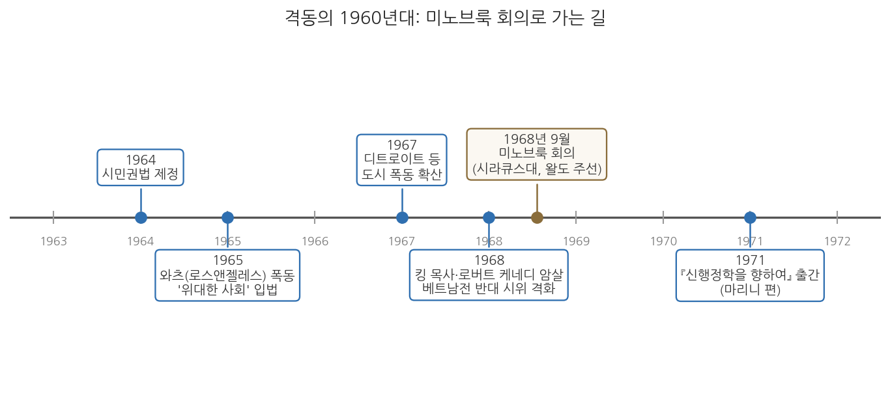
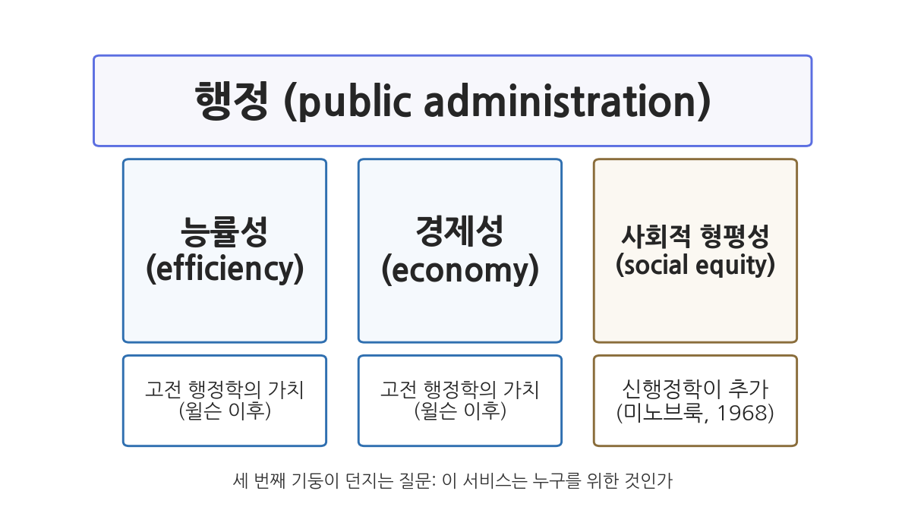

# 12주차 2차시. 신행정학: 프레드릭슨과 사회적 형평성

> 신행정학은 여기에 질문 하나를 보탠다. 이 서비스가 사회적 형평성을 증진하는가?
> (조지 프레드릭슨, 「신행정학을 향하여」)

## 이 장에서 배우는 것

1968년의 미국을 떠올려 보자. 4월에 마틴 루서 킹 목사가, 6월에 로버트 케네디 상원의원이 암살당했다. 여러 해째 여름마다 대도시의 흑인 거주 지역에서 폭동이 일어나 도시가 불탔고, 베트남전 반대 시위가 대학 곳곳에서 이어졌다. 정부는 역사상 가장 큰 복지 프로그램인 "위대한 사회"를 가동하고 있었지만, 거리의 분노는 가라앉지 않았다. 그런데 이 시대의 행정학 교과서를 펴면 무엇이 있었는가. 조직 구조, 인사 관리, 예산 기법, 그리고 능률. 대학원생들은 물었다. 도시가 불타고 있는데, 우리 학문은 왜 이 현실에 대해 할 말이 없는가.

그 물음을 품은 젊은 학자들이 1968년 9월, 시라큐스 대학교의 산속 회의장 미노브룩에 모였다. 이 모임을 주선한 사람이 바로 지난주에 읽은 드와이트 왈도다. 그리고 이 모임에서 형성된 흐름, 곧 신행정학(New Public Administration)을 이론적으로 대표하게 된 사람이 이 장에서 다루는 조지 프레드릭슨이다. 그는 행정학이 윌슨 이래 신봉해 온 능률성과 경제성이라는 두 가치에 세 번째 기둥을 세우자고 제안했다. 사회적 형평성이다. 좋은 행정의 질문이 "얼마나 싸고 빠르게"에서 "누구를 위하여"로 확장되는 순간이었다.

이 장에서는 다음을 배운다.

- 격동의 1960년대가 행정학에 던진 도전과 미노브룩 회의(1968)의 배경
- 조지 프레드릭슨의 생애와 학문적 위치
- 원전 강독: 신행정학의 문제의식 (새로움의 의미, 형평성의 추가, 다원주의 비판, 이분법 거부, 변화 지향)
- 사회적 형평성이 왜 능률·경제에 이은 "제3의 기둥"인지
- 형평을 실천하는 통로: 조직 설계의 수정과 2세대 행태주의
- 현대적 함의: 대표관료제와 적극적 평등 정책

<strong>이 장의 로드맵</strong> 
이 장은 하나의 질문을 따라 전개된다. <em>"능률적인 행정이 특정한 사람들만 계속 이롭게 한다면, 그 행정은 좋은 행정인가?"</em>  
<strong>2.1</strong> 격동의 1960년대와 미노브룩 회의를 살펴본다 →
<strong>2.2</strong> 프레드릭슨이라는 학자를 소개한다 →
<strong>2.3</strong> 원전에서 신행정학의 문제의식을 읽는다 →
<strong>2.4</strong> 사회적 형평성을 제3의 기둥으로 정리한다 →
<strong>2.5</strong> 대표관료제와 적극적 평등이라는 현대적 유산을 살핀다.

## 2.1 격동의 1960년대와 미노브룩 회의

### 도시 폭동과 당시의 행정학 교과서

1960년대의 미국은 겉으로는 풍요의 절정이었다. 경제는 성장했고, 존슨 행정부의 "위대한 사회(Great Society)" 프로그램은 빈곤과의 전쟁을 선포하며 교육·의료·주거에 막대한 연방 자금을 투입하고 있었다. 그러나 같은 시기의 거리 사정은 전혀 달랐다. 1964년 시민권법이 제정되어 법 앞의 인종차별은 금지되었지만, 현실의 격차는 쉽게 줄어들지 않았다. 1965년 로스앤젤레스 와츠 지역의 폭동을 시작으로 1967년 디트로이트와 뉴어크 등에서 대규모 도시 폭동이 잇달았고, 1968년에는 킹 목사와 로버트 케네디의 암살이 겹치면서 사회 전체의 혼란이 커졌다. 베트남전은 정부에 대한 신뢰 자체를 무너뜨리고 있었다.

이러한 격동 앞에서 행정학은 곤혹스러운 질문에 답해야 했다. 폭동 진압에 나선 경찰도, 빈곤 프로그램을 집행하는 복지 기관도, 징집 업무를 수행하는 병무 행정도 모두 "행정"이었다. 그런데 당시의 행정학은 이 현실을 다룰 언어를 갖고 있지 않았다. 주류 학계는 행태주의의 영향 아래 가치중립적 과학을 지향하며 "무엇이 옳은가"라는 질문을 학문의 영역에서 배제했고, 실무 지향의 교육은 여전히 조직·인사·예산의 관리 기술을 가르치고 있었다. 사회가 "행정은 누구 편인가"를 묻는데, 학문은 "어떻게 하면 능률적인가"만 답하고 있었던 셈이다.

### 미노브룩: 젊은 세대의 문제 제기

이 간극을 심각하게 받아들인 사람이 드와이트 왈도였다. 11주차에서 보았듯 왈도는 일찍이 『행정국가』(1948)에서 행정학의 "능률" 신조가 사실은 하나의 정치이론임을 밝히고, 행정학이 민주주의라는 가치 문제를 정면으로 다루어야 한다고 주장한 학자다. 1960년대 후반 시라큐스 대학교에 있던 왈도는 격동의 시대에 행정학이 응답하지 못하고 있다는 문제의식에서, 기성 학자들이 아니라 젊은 세대의 목소리를 모으는 자리를 만들었다. 1968년 9월, 시라큐스 대학교가 애디론댁 산지에 보유한 미노브룩 회의장(Minnowbrook Conference Center)에 30대 중심의 젊은 행정학자 수십 명이 모였다. 행정학의 역사에서 미노브룩 회의(Minnowbrook Conference)라 불리는 모임이다.

회의는 격렬했다. 참석자들은 기존 행정학이 현실적합성(relevance)을 잃었다고 진단했고, 가치중립을 표방하는 학문이 실제로는 현상 유지에 봉사한다고 비판했으며, 행정이 사회적 약자를 위한 변화의 주체가 되어야 한다고 주장했다. 그 결과물이 프랭크 마리니(Frank Marini)가 엮은 논문집 『신행정학을 향하여: 미노브룩의 관점』(1971)이며, 이 흐름 전체가 신행정학이라는 이름을 얻었다. 미노브룩 회의는 이후 행정학의 세대 의식이 되어, 20년 주기로 미노브룩 II(1988)와 미노브룩 III(2008)가 이어졌다.

그림 12-4를 읽는 법. 가로축은 1963년에서 1972년까지의 시간이다. 파란 상자들은 시대의 사건들(시민권법, 도시 폭동, 암살, 전쟁 반대 시위)이고, 갈색 상자가 1968년 9월의 미노브룩 회의, 오른쪽 끝이 1971년의 논문집 출간이다. 여기서 알 수 있는 것은 신행정학이 추상적 사고에서만 나온 이론이 아니라는 점이다. 그것은 연표의 왼쪽을 가득 채운 사회적 격동에 대한 학문의 응답이었고, 미노브룩은 그 응답이 형태를 갖춘 장소였다.

<strong>왜 왈도가 제기한 문제를 프레드릭슨이 이어받았다고 하는가?</strong> 
왈도의 『행정국가』는 "능률은 가치중립적 기준이 아니다"라는 비판을 제기했지만, 능률을 대신할 적극적 가치가 무엇인지는 열어 두었다. 20년 뒤 왈도가 마련한 미노브룩 회의에서, 프레드릭슨은 그 빈자리에 들어갈 가치를 제시했다. <strong>사회적 형평성</strong>이다. 11주차의 왈도가 정통 교리의 해체(비판)였다면, 이번 주의 프레드릭슨은 새 기둥의 건립(구성)이다. 두 장을 이어서 읽으면 비판이 어떻게 대안으로 이어지는지를 볼 수 있다.

## 2.2 조지 프레드릭슨: 행정학의 일반주의자

<strong>인물 · 조지 프레드릭슨(H. George Frederickson, 1934-2020)</strong> 
미국의 행정학자로, 1934년 아이다호주 트윈폴스에서 태어났다. 1959년 브리검영대학교를 졸업하고 1961년 캘리포니아대학교 로스앤젤레스에서 행정학 석사를, 1967년 남캘리포니아대학교에서 박사학위를 받았다. 1967년 시러큐스대학교 맥스웰스쿨 조교수로 부임해 이듬해 왈도가 연 미노브룩 회의에 참여했고, 인디애나대학교와 미주리대학교를 거쳐 1977년부터 1987년까지 이스턴워싱턴대학교 총장을 지냈다. 1977-78년 미국행정학회(ASPA) 회장을 맡았으며, 1987년 캔자스대학교로 옮겨 에드윈 스텐 석좌교수로 재직했다. 1988년에는 두 번째 미노브룩 회의를 주관했고, 1991년 창간된 JPART의 초대 편집장을 맡았다. 미국정치학회 가우스상과 미국행정학회 왈도상을 받았고 1980년 동국대학교에서 명예 법학박사 학위를 받았으며, 2020년 캔자스주 로렌스에서 86세로 사망했다. 
대표 저술: 「신행정학을 향하여」(1971), 『신행정학』(1980), 『행정의 정신』(1997), 『행정이론 입문(The Public Administration Theory Primer)』(2003, 스미스와 공저)

조지 프레드릭슨(H. George Frederickson, 1934-2020)은 미노브룩 세대를 대표하는 미국의 행정학자다. 시라큐스 대학교와 캔자스 대학교 등에서 가르쳤고, 이스턴워싱턴 대학교 총장을 지냈으며, 미국행정학회(ASPA) 회장을 역임했다. 행정학 연구의 대표적 학술지 가운데 하나인 JPART(Journal of Public Administration Research and Theory)의 창립 편집장이기도 하다. 그는 스스로를 "행정학 일반주의자"라 불렀다. 조직론이든 예산이든 윤리든 한 분과에 갇히지 않고, 행정이라는 활동 전체의 성격과 목적을 묻는 학자이고자 했다는 뜻이다.

그의 이름을 행정학사에 남긴 작업이 미노브룩 논문집에 실린 「신행정학을 향하여(Toward a New Public Administration)」(1971)다. 이 글에서 그는 신행정학의 문제의식을 체계적으로 정리하고 사회적 형평성을 행정의 세 번째 기둥으로 정립했다. 그는 이후 『신행정학』(1980), 『행정의 정신』(1997) 등의 저작을 통해 이 주장을 평생에 걸쳐 다듬었다. 젊은 날의 선언으로 그치지 않고 사회적 형평성의 측정과 제도화까지 밀고 나간 것이 프레드릭슨의 특징이다.

한 가지 미리 말해 둘 것이 있다. 프레드릭슨은 능률성을 부정한 학자가 아니었다. 그가 문제 삼은 것은 능률성 그 자체가 아니라, 능률성"만"을 묻는 행정학이었다. 더 적은 비용으로 더 많은 서비스를 내는 것은 여전히 중요하다. 다만 그 서비스가 누구에게 돌아가는지를 묻지 않는 한, 능률적인 행정은 능률적으로 불평등을 재생산할 수 있다는 것이 그의 통찰이었다.

## 2.3 원전 강독: 신행정학의 문제의식

이제 「신행정학을 향하여」를 직접 읽어 보자. 첫 발췌는 "새롭다"는 말에 대한 그의 신중한 태도다.

<strong>원전 읽기 · 프레드릭슨, 「신행정학을 향하여」(1971)</strong> 
"어떤 것에든 '새롭다'는 꼬리표를 붙이는 일은 위험하다. (…) 신행정학의 일부는 플라톤, 홉스, 마키아벨리, 해밀턴, 제퍼슨뿐 아니라 많은 현대 행태주의 이론가들도 알아볼 수 있을 것이다. (…) 우리는 가치들에 대한 반란과 함께, 새로운 대표성의 양식을 찾는 현상을 목격하고 있다."

무슨 말인가. 프레드릭슨은 신행정학이 전혀 새로운 발명품이 아님을 스스로 인정하며 시작한다. 행정이 정의로워야 한다는 생각은 플라톤 이래의 정치철학에 늘 있었다. 새로운 것은 생각의 내용이 아니라 상황이다. 전문성의 이름으로 대표성을 잃어버린 행정에 맞서, 낡은 가치 물음을 지금의 현실로 다시 불러오는 것이 신행정학의 "새로움"이라는 것이다. 이 교재의 흐름으로 말하면, 2주차의 공자와 키케로가 물었던 "통치는 누구를 위한 것인가"라는 질문이 2천 년 뒤 1968년의 미국에서 다시 제기된 셈이다.

왜 중요한가. 이 겸손한 서두는 수사가 아니라 방법이다. 자신의 주장을 지적 유행이 아니라 정치철학의 오랜 전통 위에 세움으로써, "젊은 학자들의 한때의 반란"이라는 예상 가능한 비판을 미리 차단하는 것이다. 다음 발췌가 그 유명한 핵심 선언이다.

<strong>원전 읽기 · 프레드릭슨, 「신행정학을 향하여」(1971)</strong> 
"행정학이 내세우는 존재 이유는 거의 언제나 더 나은 관리, 곧 더 능률적이거나 더 경제적인 관리였다. 신행정학은 이 고전적인 목표와 근거에 사회적 형평성을 추가한다. 전통적인 행정학은 다음 두 질문 가운데 하나에 답하고자 한다. 가용한 자원으로 어떻게 더 많은, 더 나은 서비스를 제공할 수 있는가(능률성)? 어떻게 돈을 덜 쓰면서 지금의 서비스 수준을 유지할 수 있는가(경제성)? 신행정학은 여기에 질문 하나를 보탠다. 이 서비스가 사회적 형평성을 증진하는가?"

무슨 말인가. 전통 행정학의 두 질문은 모두 관리의 질문이다. 신행정학은 이 둘을 폐기하지 않는다. 다만 세 번째 질문을 나란히 세운다. 이 서비스는 사회적 형평성을 높이는가. 질문 하나가 늘어난 것뿐이지만, 그 함의는 크다. 앞의 두 질문은 서비스의 총량만 보므로 그 분배를 묻지 않는다. 셋째 질문이 들어오는 순간, 같은 총량이라도 누구에게 어떻게 배분되는지가 행정 평가의 정식 항목이 된다.

왜 중요한가. 이것은 행정을 평가하는 기준에 새 항목을 추가하는 일이었다. 능률성이 아무리 높아도 형평성 항목에서 낮은 평가를 받은 행정은 좋은 행정이 아니게 된다. 그렇다면 왜 이런 항목이 필요한가. 중립적으로 관리만 잘하면 형평은 저절로 달성되지 않는가. 프레드릭슨의 대답이 다음 발췌다. 신행정학 문헌에서 가장 자주 인용되는 대목이다.

<strong>원전 읽기 · 프레드릭슨, 「신행정학을 향하여」(1971)</strong> 
"다원주의 정부는 확고히 자리 잡은 안정된 관료제와 그들의 전문화된 소수 고객에게 유리하도록 체계적으로 차별한다. 농무부와 대규모 농장주의 관계가 그 예다. 반면 정치적·경제적 자원이 부족한 소수자, 이를테면 이주 노동이든 상주 노동이든 농장 노동자에게는 불리하게 작용한다. 그러므로 사회적 형평성은 이런 소수자들의 정치적 힘과 경제적 복리를 끌어올리려는 활동을 포함한다. (…) 소수자들이 겪는 박탈을 바로잡으려는 변화에 힘쓰지 않는 행정은, 결국 그 소수자들을 억압하는 데 쓰이고 말 것이다."

무슨 말인가. "체계적으로 차별한다"는 표현에 주의하자. 프레드릭슨이 고발하는 것은 어느 악의적인 공무원의 일탈이 아니다. 제도가 정상적으로 작동한 결과가 차별이라는 것이다. 관료제는 조직화된 고객과 오래 관계를 맺으며 그들의 요구에 맞게 정교해진다. 농무부의 정책은 목소리가 크고 조직된 대규모 농장주에게 맞춰지고, 같은 농업 부문 안에 있으면서도 조직도 자원도 없는 농장 노동자의 필요는 어느 기관의 업무 목록에도 오르지 못한다. 각 기관이 자기 고객에게 충실할수록, 전체적으로는 힘 있는 집단에게 유리해진다.

왜 중요한가. 이 대목은 지난 차시의 린드블롬을 정면으로 비판한 것으로 읽을 수 있다. 린드블롬은 각 기관이 자기 가치에 집중해도 상호조정이 편향을 보정해 "분업된 종합성"에 이른다고 낙관했다. 프레드릭슨의 반문은 이렇다. 협상 테이블에 앉지 못한 사람들의 가치는 누가 조정해 주는가. 상호조정은 조직된 이익들 사이의 균형일 뿐이며, 조직되지 못한 약자에게 그 균형은 "체계적 차별"로 나타난다는 것이다. 점증주의가 전제하는 다원주의의 구도 바깥에, 그 구도에 포함되지 못한 사람들이 있었던 셈이다. 마지막 문장의 함의는 더 크다. 불평등을 방관하는 행정은 중립이 아니라 억압의 도구가 된다. 중립이라는 제3의 자리는 없다는 것이다.

이 논리 위에서 프레드릭슨은 행정가의 역할을 다시 정의한다.

<strong>원전 읽기 · 프레드릭슨, 「신행정학을 향하여」(1971)</strong> 
"정책과 행정을 나누는 이분법은 경험적 근거가 부족하다. 행정가들이 정책을 집행하는 동시에 수립한다는 사실이 너무나 분명하기 때문이다. (…) 행정가들은 중립적이지 않다. 그들은 달성해야 할 가치이자 존재 이유로서, 좋은 관리와 사회적 형평성 모두에 헌신해야 한다."

무슨 말인가. 5주차 윌슨과 굿나우의 정치·행정 이원론, 곧 "정치가 결정하고 행정은 집행한다"는 구도를 프레드릭슨은 사실의 차원에서 기각한다. 현실의 행정가는 재량을 행사하고 규칙을 만들며 사업의 우선순위를 정한다. 곧 이미 정책을 만들고 있다. 9주차의 해링이 뉴딜의 현실 속에서 관찰했던 이원론의 붕괴를, 프레드릭슨은 규범의 언어로 완성한다. 행정가가 어차피 가치를 선택하고 있다면, 어떤 가치에 헌신할지를 공개적으로 정하는 것이 정직하다. 그 답이 좋은 관리와 사회적 형평성의 동시 헌신이다.

왜 중요한가. "행정가는 중립적이지 않다"는 문장은 신행정학의 가장 논쟁적인 유산이다. 이 문장은 행정가를 현상 유지의 관리인에서 변화의 주창자(change agent)로 격상시키지만, 동시에 위험한 질문을 제기한다. 선출되지 않은 행정가가 무엇이 형평인지 스스로 판단해 행동하는 것은 민주주의와 충돌하지 않는가. 이 긴장은 2.5절에서 다시 다룬다.

행정가가 어차피 중립일 수 없다면, 행정이라는 활동 전체의 지향도 달리 정의되어야 한다. 프레드릭슨의 답은 한 문장으로 요약된다.

<strong>원전 읽기 · 프레드릭슨, 「신행정학을 향하여」(1971)</strong> 
"신행정학은 사회적 형평성을 체계적으로 가로막는 정책과 구조를 바꾸고자 한다."

무슨 말인가. 프레드릭슨은 사회적 형평성에 근본적으로 헌신한다는 것이 곧 변화에 헌신한다는 뜻이라고 말한다. 논리는 앞의 발췌들에서 곧장 따라 나온다. 다원주의 정부의 차별이 "체계적"이라면, 그 교정도 공무원 개개인의 선의에 기댈 일이 아니라 차별을 낳는 정책과 구조 자체를 겨냥해야 한다. 앞 발췌의 변화의 주창자가 무엇을 바꾸려 하는지가 여기서 구체화된다. 그 대상은 악인이 아니라, 정상적으로 작동하면서 불평등을 재생산하는 제도다.

왜 중요한가. 이 선언은 행정을 안정과 계속성의 영역으로 보는 오랜 통념에 대한 정면 도전이다. 7주차에서 본 베버의 관료제가 그렇듯, 관료제는 본래 변화를 흡수하고 늦추는 장치에 가깝다. 그런 조직에게 변화의 주체가 되라고 요구하는 것은 일하는 방식과 조직의 형태 자체를 다시 설계해야 가능한 일이다. 다음 절에서 프레드릭슨이 조직 설계의 세부까지 파고드는 이유가 바로 여기에 있다.

## 2.4 사회적 형평성: 제3의 기둥

### 개념의 정리

원전의 논지를 개념으로 정리하자. 프레드릭슨이 말하는 사회적 형평성은 산술적 균등 배분이 아니다. 모두에게 똑같이 나누어 주는 것은 출발선이 다른 사람들 사이의 격차를 그대로 보존한다. 사회적 형평성은 행정 서비스의 결과가 사회적 약자에게 불리하게 쌓이지 않도록, 필요하다면 불리한 처지의 집단에 더 많은 자원과 관심을 배분하는 적극적 개념이다. 기회의 평등을 넘어 결과의 공정성을 따진다는 점에서, 그리고 현재의 불평등을 교정할 행정의 책무를 인정한다는 점에서 그렇다.

<strong>정의 · 사회적 형평성</strong> 
<strong>사회적 형평성</strong>(social equity)은 행정 서비스의 설계·집행·평가에서 그 혜택과 부담이 사회 집단들 사이에 공정하게 배분되는가를 묻는 가치다. 형식적으로 동일한 대우(평등)에 머무르지 않고, 정치적·경제적 자원이 부족한 소수자와 약자의 처지를 개선하는 방향의 배분(형평)을 요구한다. 프레드릭슨은 이를 능률성·경제성에 이은 행정의 <strong>제3의 기둥</strong>(third pillar)으로 정립했다.

그림 12-3을 읽는 법. 위의 지붕이 행정이라는 활동 전체이고, 그것을 받치는 기둥이 행정이 추구하는 가치들이다. 왼쪽의 두 기둥(능률성, 경제성)은 윌슨 이래 고전 행정학이 세운 것이고, 오른쪽의 갈색 기둥(사회적 형평성)이 1968년 미노브룩에서 추가된 세 번째 기둥이다. 여기서 알 수 있는 것은 신행정학의 성격이다. 기존의 두 기둥을 허물자는 것이 아니라, 두 기둥만으로는 지붕이 기운다는 것, 곧 "얼마나 잘하는가"만으로는 "누구를 위해 하는가"를 답할 수 없다는 것이다.

### 형평을 어떻게 실천하는가

선언만으로 형평이 실현되지는 않는다. 「신행정학을 향하여」의 후반부는 형평을 행정의 일상에 정착시키는 구체적 통로들을 논한다. 흥미로운 것은 그가 능률의 도구로 개발된 분석 기법들을 형평의 도구로 재해석한다는 점이다. 비용편익분석은 본래 사업의 경제적 타당성을 따지는 기법이지만, 프레드릭슨은 그것이 "혜택이 누구에게 가는가"를 드러내는 데 쓰일 수 있다고 본다. 어느 사업의 편익이 부유한 지역에 집중된다는 사실이 숫자로 입증되면, 기관은 자신의 분배 결정을 공개적으로 방어해야 하는 처지에 놓인다. 분석이 기득권 옹호의 도구가 아니라 불평등을 고발하는 수단이 되는 것이다.

조직의 차원에서도 그는 구체적이다. 원전은 관료제의 핵심 구조인 계층제를 직접 문제 삼는다.

<strong>원전 읽기 · 프레드릭슨, 「신행정학을 향하여」(1971)</strong> 
"계층제가 낳는 역효과는 이제 잘 알려져 있다. 신행정학은 수정된 계층제를 옹호하는 입장이라고 이해하는 편이 아마 가장 정확할 것이다. 전통적인 계층제를 수정하는 수단은 이론과 실무 양쪽에서 여럿 쓰이고 있다. 첫째이자 아마 가장 잘 알려진 것이 프로젝트 또는 매트릭스 기법이다. 프로젝트는 정의상 한시적이다. 관료제는 해체되거나 스스로 소멸하는 법이 없지만, 프로젝트는 그렇게 한다. (…) 덜 구조화되고, 덜 공식적이며, 덜 권위적인 통합 기법을 찾으려는 탐색은 이제 막 시작되었다. 이런 조직 양식을 선호한다는 것은 무엇보다 변이를 너그럽게 받아들인다는 뜻이다. 여기에는 행정 수행의 변이, 그리고 고객과 고객 집단의 차이에 따른 절차와 적용의 변이가 포함된다."

무슨 말인가. 비판의 대상은 관료제의 생존 지향이다. 상설 조직은 시간이 지나면 문제 해결보다 조직의 존속 자체를 목적으로 삼기 쉽다. 문제가 사라져도 조직은 남아 새 일거리를 찾는다. 프로젝트 조직은 이 경향에 대한 구조적 처방이다. 풀어야 할 문제와 함께 만들어지고 문제가 풀리면 해체되므로, 존속하기 위해 문제를 붙들고 있을 이유가 없다. 뒷부분의 "변이"도 같은 문제의식의 연장이다. 모든 고객에게 같은 절차를 적용하는 획일성은 관리하는 쪽에는 편리하지만, 처지가 다른 고객에게는 다른 대접이 필요하다. 규칙 앞의 형식적 평등이 아니라 필요에 따른 변용이 형평이라는 것이다.

왜 중요한가. 7주차에서 읽은 베버의 이념형 관료제는 영속성과 몰인격적 규칙 적용을 미덕으로 삼았다. 프레드릭슨은 그 두 미덕이 뒤집힐 수 있음을 지적한다. 영속성은 생존 지향으로, 몰인격적 획일성은 조직된 강자에게 유리한 편향으로 굳을 수 있다는 것이다. 사회적 형평성이 가치 선언에 그치지 않으려면 조직 구조 자체를 손봐야 한다는 이 발상은, 신행정학이 왜 가치론인 동시에 조직 설계론인지를 보여 준다.

참여의 차원에서는 무엇보다 그동안 배제되어 온 사람들의 몫을 제도화하자고 제안한다.

<strong>원전 읽기 · 프레드릭슨, 「신행정학을 향하여」(1971)</strong> 
"지금까지 참여하지 못했던 소수 집단들의 훨씬 더 높은 참여가 필요하다. (…) 소외된 소수자의 참여로서 바람직한 형태는, 그들의 이익을 지원하는 분배 결정을 내릴 수 있는 분권화된 조직과 일상적으로 소통하는 방식일 것이다."

무슨 말인가. 여기서 참여는 공청회에 한 번 초대받는 의례가 아니다. 분배를 실제로 결정할 권한이 있는 조직, 그것도 지역 사회 가까이 내려온 분권화된 조직(학교, 경찰서 등)과 소수자가 일상적으로 소통하는 구조를 말한다. 참여가 결정과 연결되지 않으면 형평은 구호로 남는다는 문제의식이다.

왜 중요한가. 이 대목은 신행정학이 단순한 가치 선언이 아니라 조직 설계론이기도 했음을 보여 준다. 분권화, 참여, 반응성 같은 오늘날 행정 개혁의 상투어들이 여기서는 뚜렷한 목적, 곧 배제된 사람들의 몫을 회복한다는 목적에 묶여 있었다.

### 과학을 버리지 않는다: 2세대 행태주의

형평이라는 가치를 앞세운다고 해서 신행정학이 과학적 연구를 버린 것은 아니다. 프레드릭슨은 신행정학의 연구 태도에 이름을 하나 붙인다.

<strong>원전 읽기 · 프레드릭슨, 「신행정학을 향하여」(1971)</strong> 
"신행정학은 '2세대 행태주의'라고 부르는 것이 가장 알맞을 태도를 옹호한다. (…) 2세대 행태주의자는 자신의 행태주의를 이른바 중립성의 겉치장으로 쓰려 하지도 않는다. 그는 앞 세대보다 덜 '일반적'이고 더 '공공적'이며, 덜 '기술(記述)적'이고 더 '처방적'이며, 덜 '제도 중심적'이고 더 '고객 영향 중심적'이며, 덜 '중립적'이고 더 '규범적'이다. 그러면서도, 바라건대, 과학성에서는 조금도 덜하지 않다."

무슨 말인가. 신행정학이 바꾸려는 것은 과학적 방법이 아니라 과학의 용도다. 1세대 행태주의가 공공이든 민간이든 조직 일반에 두루 통하는 법칙을 찾아 제도의 내부 작동을 중립적으로 묘사했다면, 2세대는 공공 조직에 초점을 맞추고, 제도가 고객의 삶에 미치는 영향을 측정하며, 무엇이 옳은지를 처방하는 데 같은 방법을 쓴다. 연구의 출발점도 기관이 아니라 문제다. 조직도의 내부를 그리는 대신, 이 기관의 서비스가 누구에게 돌아가고 누구에게는 돌아가지 않는지를 묻는 것이다.

왜 중요한가. 10주차의 사이먼과 견주면 이 대목의 위치가 선명해진다. 사이먼의 행태주의 혁명은 가치와 사실을 갈라 사실의 과학을 세웠고, 그 과학은 가치 물음에 답하지 않았다. 프레드릭슨은 방법은 잇고 목적은 뒤집는다. 검증 가능한 연구라는 기준은 유지하되, 그 연구를 형평이라는 가치의 실현에 복무시키는 것이다. 앞에서 본 비용편익분석의 재해석이 이 태도의 실례다. 왈도가 행태주의의 가치 배제를 비판하는 데 무게를 두었다면, 프레드릭슨은 과학과 가치를 다시 묶는 작업 방식까지 제시한 셈이다.

마지막 발췌는 이 모든 논의가 향하는 곳이다.

<strong>원전 읽기 · 프레드릭슨, 「신행정학을 향하여」(1971)</strong> 
"사회적 형평성의 추구는 행정학에 진정한 규범적 토대를 제공한다. (…) 신행정학은 입법부가 위임한 일을 가능한 한 능률적이고 경제적으로 수행하는 데 그치지 않고, 모든 사람의 삶의 질을 더 보편적으로 끌어올리는 정책에 영향을 미치며 그것을 집행하고자 한다."

무슨 말인가. "규범적 토대"라는 말에서 왈도의 영향이 뚜렷하다. 왈도가 보여 주었듯 가치중립을 표방한 행정학도 실은 능률이라는 규범 위에 서 있었다. 프레드릭슨은 숨겨진 규범을 걷어내는 데서 멈추지 않고, 행정학이 떳떳하게 내걸 수 있는 규범을 새로 제시한다. 능률적 집행"뿐 아니라" 삶의 질의 보편적 향상이라는 문구가 신행정학의 균형 감각을 압축한다. 능률의 부정이 아니라 능률의 목적을 묻는 것이다.

## 2.5 현대적 함의: 대표관료제와 적극적 평등

### 대표관료제

"다원주의 정부는 체계적으로 차별한다"는 진단에서 자연스럽게 따라 나오는 처방 하나가 관료제의 구성 자체를 바꾸는 것이다. 관료제가 특정 집단의 이익에 기울어지는 이유 중 하나가 관료 집단의 인적 구성이 사회를 닮지 않았기 때문이라면, 사회의 다양한 집단이 인구 비례에 가깝게 공직에 들어오도록 하자는 발상이 가능하다. 이를 대표관료제(representative bureaucracy)라 한다. 관료제의 인적 구성이 사회의 축소판을 닮을 때(소극적 대표), 관료들이 자기 출신 집단의 이해와 관점을 정책에 반영하게 되어(적극적 대표) 행정의 대응성과 형평성이 높아진다는 이론이다. 신행정학이 말한 "새로운 대표성의 양식"에 정확히 부합하는 제도적 답안이다.

한국의 균형인사 제도들은 이 발상의 실제 사례다. 공무원 채용에서 어느 한쪽 성별의 합격자가 일정 비율에 못 미치면 추가 합격시키는 양성평등채용목표제, 장애인 의무고용, 지역인재 채용, 저소득층 구분모집 등이 운영되어 왔다. 이런 제도는 시험 점수만으로 뽑는 것이 가장 "능률적"이라는 관점에서 보면 예외 조치이지만, 형평성의 기둥에서 보면 관료제가 사회 전체를 대표하게 만드는 투자다. 두 기둥이 실제 제도 앞에서 어떻게 긴장하는지 보여 주는 좋은 예다.

### 적극적 평등과 그 논쟁

형평의 논리를 채용을 넘어 배분 일반으로 확장하면 적극적 평등실현조치(affirmative action)에 닿는다. 역사적으로 불리한 처지에 놓여 온 집단에 교육·고용 등의 기회를 우선 배분하여 실질적 평등에 다가가려는 정책이다. 프레드릭슨의 언어로 말하면, 소수자의 박탈을 바로잡으려는 변화에 행정이 적극적으로 나서는 것이다. 그러나 이 정책은 태생적으로 논쟁을 안고 있다. 우대받지 못하는 쪽에서 보면 역차별의 문제가 제기되고, 형평의 이름으로 행해지는 우대가 언제까지 어느 정도로 정당한지에 대한 사회적 합의는 늘 유동적이다. 미국에서 대학 입학의 소수인종 우대를 둘러싸고 수십 년간 이어진 법정 공방이 보여 주듯, 제3의 기둥은 세워진 뒤에도 끊임없이 논란을 겪으며 조정되고 있다.

신행정학 자체를 향한 비판도 기억해 둘 필요가 있다. 가장 근본적인 것은 민주적 정당성의 문제다. 선출되지 않은 행정가가 "무엇이 형평인가"를 스스로 정의하고 변화의 주창자로 나선다면, 그것은 선출된 대표의 권한을 잠식하는 일이 아닌가. 신행정학이 등장한 직후부터 제기된 이 비판은, 행정가의 가치 헌신을 강조할수록 그 가치 선택을 통제할 민주적 장치가 함께 필요하다는 과제를 남겼다. 또한 사회적 형평성은 능률성처럼 깔끔하게 측정되지 않는다는 실무적 난점도 있다. 무엇이 공정한 배분인지는 결국 정치적 판단을 요구하기 때문이다. 그럼에도 사회적 형평성은 이후 행정학 교과서에서 행정 가치의 목록에 확고히 자리 잡았고, 미국행정학계에서는 형평성을 행정의 기둥 가운데 하나로 공인하는 흐름이 이어졌다. "누구를 위한 행정인가"라는 질문 자체를 되돌릴 수는 없게 된 것이다.

<strong>유의 · 형평성은 능률성의 반대말이 아니다</strong> 
신행정학을 "능률 반대, 형평 찬성"의 구도로 요약하면 오해가 생긴다. 프레드릭슨은 능률성과 경제성을 행정의 정당한 가치로 인정한 위에 형평성을 <strong>추가</strong>했다. 세 기둥은 자주 긴장하지만(균형인사와 시험 성적주의의 긴장처럼), 어느 하나가 다른 하나를 대체하는 관계는 아니다. 시험에서 "신행정학은 능률성을 부정했다"고 쓰면 원전을 잘못 읽은 것이다.

## 요약

1960년대의 미국은 시민권 운동, 도시 폭동, 베트남전, 암살로 이어진 격동의 시대였으나, 당시의 행정학은 가치중립적 과학과 관리 기술에 머물러 이 현실에 답하지 못했다. 1968년 드와이트 왈도의 주선으로 시라큐스 대학교 미노브룩 회의장에 모인 젊은 학자들은 행정학의 현실적합성과 가치 문제를 정면으로 제기했고, 이 흐름이 신행정학이 되었다. 그 이론적 중심인 조지 프레드릭슨(1934-2020)은 「신행정학을 향하여」(1971)에서 능률성·경제성이라는 고전적 두 가치에 사회적 형평성을 제3의 기둥으로 추가했다. 그 근거는 다원주의 정부가 조직화된 이익에 유리하도록 체계적으로 차별하며, 불평등을 방관하는 행정은 억압의 도구가 된다는 진단이다. 이는 지난 차시 린드블롬의 상호조정 낙관론에 대한 정면 반론이기도 하다. 행정가는 중립적이지 않으며 좋은 관리와 사회적 형평성 모두에 헌신해야 한다는 주장은 정치·행정 이원론의 규범적 종언을 뜻한다. 신행정학은 선언에 그치지 않았다. 사회적 형평성을 체계적으로 가로막는 정책과 구조를 바꾸는 것을 목표로 삼고, 문제가 풀리면 해체되는 프로젝트 조직으로 관료제의 생존 지향을 견제하며, 고객의 처지에 따른 변용과 소수자의 실질적 참여를 제도화하고, 과학적 방법을 처방과 고객 영향 분석에 쓰는 2세대 행태주의를 제안했다. 신행정학의 유산은 대표관료제와 균형인사, 적극적 평등실현조치 같은 제도로 이어졌으나, 선출되지 않은 행정가의 가치 판단이라는 민주적 정당성 문제와 역차별 논쟁도 함께 남겼다.

## 토론·복습 문제

**12-5. (서술형, 기말 대비)** 미노브룩 회의(1968)의 시대적 배경을 서술하고, 프레드릭슨이 사회적 형평성을 행정의 "제3의 기둥"으로 정립한 논리를 다원주의 정부에 대한 그의 진단과 연결하여 설명하시오. 아울러 이 주장에 제기될 수 있는 민주적 정당성 차원의 비판을 논의하시오.

**12-6. (원전 해석형)** 다음 구절을 읽고 물음에 답하라. "소수자들이 겪는 박탈을 바로잡으려는 변화에 힘쓰지 않는 행정은, 결국 그 소수자들을 억압하는 데 쓰이고 말 것이다." 이 문장에서 프레드릭슨이 "중립적 행정"의 가능성을 부정하는 논리를 재구성하고, 이에 동의하는지 자신의 견해를 근거와 함께 밝히시오.

**12-7. (연결형)** 린드블롬은 각 기관의 편향이 상호조정으로 보정되어 "분업된 종합성"에 이른다고 보았고, 프레드릭슨은 다원주의 정부가 "체계적으로 차별한다"고 보았다. 두 주장이 충돌하는 지점을 정확히 짚고, 두 사람이 각각 옳을 수 있는 조건이 무엇인지 토론해 보라.

**12-8. (적용형)** 우리나라의 균형인사 제도(양성평등채용목표제, 장애인 의무고용, 지역인재 채용 등) 가운데 하나를 골라, 능률성의 기둥과 형평성의 기둥이 그 제도 안에서 어떻게 긴장하는지 분석하고, 프레드릭슨이라면 이 제도를 어떻게 평가할지 원전의 논리로 서술해 보라.

**12-9. (원전 해석형)** 다음 구절을 읽고 물음에 답하라. "2세대 행태주의자는 앞 세대보다 덜 '기술적'이고 더 '처방적'이며, 덜 '제도 중심적'이고 더 '고객 영향 중심적'이며, 덜 '중립적'이고 더 '규범적'이다. 그러면서도, 바라건대, 과학성에서는 조금도 덜하지 않다." 이 구절을 근거로 신행정학이 10주차 사이먼의 행태주의에서 무엇을 계승하고 무엇을 뒤집었는지 설명하고, 가치에 헌신하는 연구가 과학적 엄밀성을 유지할 수 있는지 자신의 견해를 밝히시오.
