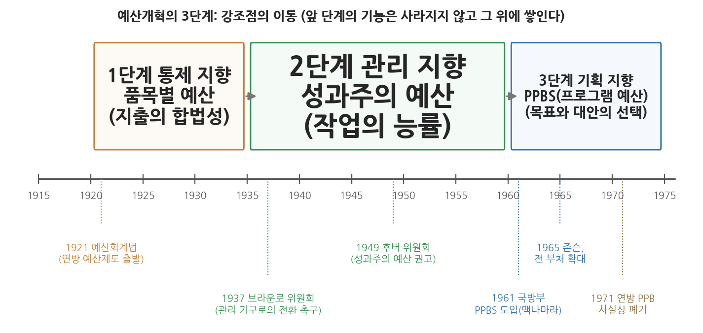

# 13주차 1차시. 예산개혁: 쉬크의 PPB로 가는 길: 통제·관리·기획

> 모든 차이점은 결국 한 문장으로 요약할 수 있다. 예산 편성의 정신이 정당화에서 분석으로 옮겨 갈 것이라는 문장이다.
> (앨런 쉬크, 「PPB로 가는 길」)

## 이 장에서 배우는 것

정부의 예산서를 처음 펼쳐 본 사람은 대개 실망한다. 나라의 한 해 살림을 담은 문서인데, 내용은 끝없이 이어지는 항목과 숫자의 나열처럼 보이기 때문이다. 그런데 그 지루해 보이는 분류 방식이야말로 이 장에서 다루는 핵심 주제다. 예산을 "볼펜 몇 자루, 인건비 얼마"로 적을 것인가, "도로 포장 1킬로미터당 비용"으로 적을 것인가, 아니면 "교통사고 사망자를 줄이는 프로그램에 얼마"로 적을 것인가. 이 세 가지 적는 방식은 각각 다른 질문에 답하도록 설계된 것이고, 그 질문들은 각각 다른 시대가 정부에 던진 질문이었다.

행정이론은 교과서 속에만 머물지 않는다. 이론은 제도가 되어 현실을 움직이는데, 그 이론이 가장 구체적인 제도로 구현되는 영역이 바로 예산이다. 부패를 막자는 진보주의 시대의 개혁론은 품목별 예산이 되었고, 능률적 관리를 내세운 행정국가의 이론은 성과주의 예산이 되었으며, 합리적 의사결정의 이상은 기획예산제도(PPBS)가 되었다. 그래서 예산의 역사를 읽는 일은 곧 행정이론의 역사를 제도의 언어로 다시 읽는 일이다. 이 각축의 전개 과정을 한 편의 논문으로 정리한 사람이 앨런 쉬크다.

이 장에서 배우는 것은 다음과 같다.

- 예산이 왜 "이론의 각축장"인지, 예산제도와 행정이론이 어떻게 맞물리는지
- 예산의 세 가지 기능, 곧 통제·관리·기획의 뜻과 상호 관계
- 예산개혁의 3단계: 품목별 예산(통제), 성과주의 예산(관리), PPBS(기획)
- PPBS의 이상은 무엇이었고 왜 현실에서 좌초했는지
- 쉬크의 분석 틀로 오늘의 한국 예산제도를 읽는 법

<strong>이 장의 로드맵</strong> 
이 장은 하나의 질문을 따라간다. <em>"예산서의 생김새는 왜 시대마다 달라졌는가?"</em>  
<strong>1.1</strong> 예산이 이론의 각축장인 이유와 쉬크라는 사상가를 살펴본다 →
<strong>1.2</strong> 원전 강독 I: 예산의 세 가지 기능(기획·관리·통제)을 읽는다 →
<strong>1.3</strong> 원전 강독 II: 개혁의 3단계(통제 → 관리 → 기획)를 읽는다 →
<strong>1.4</strong> 원전 강독 III: PPB가 바꾸려 한 것, 곧 "정당화에서 분석으로"를 읽는다 →
<strong>1.5</strong> PPBS의 이상과 현실, 그리고 한국의 프로그램 예산제도를 본다.

## 1.1 예산은 이론의 각축장이다

<strong>인물 · 앨런 쉬크(Allen Schick, 1934년생)</strong> 
미국의 행정학자이자 예산이론가로, 1934년 뉴욕에서 태어나 브루클린 보로파크에서 자랐다. 1956년 브루클린칼리지를 졸업하고 예일대학교에서 1959년 석사, 1966년 정치학 박사학위를 받았으며 대학원 시절 찰스 린드블롬에게 배웠다. 1961년부터 1968년까지 터프츠대학교에서 가르쳤고, 브루킹스연구소와 의회조사국(CRS)에서 연구하며 1974년 의회예산법 전후의 연방 예산과정 개편을 가까이에서 지켜보았다. 1981년 메릴랜드대학교 공공정책대학원의 창립 교수진으로 합류해 2019년 은퇴할 때까지 가르쳤다. 같은 1981년 학술지 『공공예산과 재정(Public Budgeting and Finance)』을 창간했으며, 『의회와 돈』(1980)으로 1982년 하드먼상을 받았다. 미국행정학회 왈도상과 브라운로상, 미국정치학회 메리엄상, 구겐하임 펠로십을 받았고 국가행정아카데미 회원으로 활동했다. 
대표 저술: 「PPB로 가는 길」(1966), 『주정부의 예산혁신(Budget Innovation in the States)』(1971), 『의회와 돈(Congress and Money)』(1980), 『연방 예산(The Federal Budget)』(1995)

### 예산서의 생김새가 곧 이론이다

12주차에서 우리는 린드블롬의 점증주의를 읽었다. 정책은 백지 상태에서 새로 만들어지는 것이 아니라 작년의 정책에서 조금씩 움직인다는 통찰이었는데, 린드블롬이 그 대표 사례로 늘 들었던 것이 바로 예산이다. 올해 예산은 작년 예산에서 크게 벗어나지 않는다. 그렇다면 예산은 영원히 점증적으로만 편성되는가. 1960년대 미국에서는 정반대의 야심이 나타났다. 예산 편성 자체를 합리적 분석의 과정으로 바꾸어, 모든 지출을 국가 목표에 비추어 원점에서 따져 보자는 시도였다. 이 시도가 기획예산제도, 곧 PPBS(Planning-Programming-Budgeting System)다.

예산이 이런 논쟁의 대상이 되는 이유는 단순하다. 어떤 행정이론이든 결국 돈의 흐름을 바꾸지 못하면 현실을 바꾸지 못하기 때문이다. 거꾸로 말하면, 예산제도의 설계에는 그 시대가 믿었던 행정이론이 고스란히 반영된다. 4주차에서 본 엽관제 개혁과 진보주의 운동은 "공무원을 믿지 말고 지출을 묶어 두라"는 품목별 예산으로, 9주차에서 본 뉴딜 행정국가와 귤릭의 관리론은 "일 잘하는 정부를 만들라"는 성과주의 예산으로, 10주차에서 본 사이먼 이후의 합리적 의사결정론은 "목표에서 출발해 대안을 비교하라"는 PPBS로 각각 구현되었다. 예산개혁의 역사는 행정이론들이 제도의 자리를 놓고 겨루어 온 각축의 역사다.

### 앨런 쉬크: 예산개혁의 역사를 정리한 사람

이 흐름을 체계적으로 정리한 사람이 앨런 쉬크(Allen Schick, 1934-)다. 쉬크는 미국 메릴랜드 대학교 공공정책대학원 교수로 재직하며 의회조사국 선임연구원과 브루킹스 연구소 연구원을 지낸, 20세기 후반 공공예산 연구를 대표하는 학자다. 그는 예산을 단순한 회계 기술로 보지 않고, 예산의 정치적·행정적 기능을 통합해 분석한 것으로 평가받는다.

우리가 읽을 「PPB로 가는 길: 예산개혁의 단계들(The Road to PPB: The Stages of Budget Reform)」은 1966년 『행정학보(Public Administration Review)』에 실렸다. 발표 시점에 주목할 필요가 있다. 국방장관 로버트 맥나마라가 1961년 국방부에 PPBS를 도입해 성공 사례로 이름을 얻었고, 존슨 대통령이 1965년 여름 이 제도를 연방정부 전체로 확대하라고 지시한 직후였다. 워싱턴은 "정부 관리의 혁명"이라는 흥분과 "새로울 것 하나 없다"는 냉소로 갈라져 있었다. 쉬크는 이 논문에서 양쪽 모두와 거리를 두고, 반세기에 걸친 예산개혁의 역사 속에 PPB를 자리매김한다. 그 결과가 예산개혁의 3단계, 곧 통제 지향 → 관리 지향 → 기획 지향이라는, 오늘날까지 예산론 교과서의 기본 구성을 이루는 분석 틀이다.

## 1.2 원전 강독 I: 예산의 세 가지 기능

### 혁명도 아니고 재탕도 아니다

쉬크는 당시 워싱턴의 두 목소리를 소개하며 논문을 시작한다. PPB 참모진의 신참들은 "정부 관리 역사상 혁명적 발전"이라며 들떠 있었다. 반면 예산 실무의 중심에 있던 고참들은 "PPB에 새로울 것이 없다. 우리가 해 오던 일과 다르지 않다"고 심드렁했다. 쉬크는 제3의 길을 택한다.

<strong>원전 읽기 · 앨런 쉬크, 「PPB로 가는 길」(1966)</strong> 
"전통적인 예산 담당자들의 미덥지 않은 항변과 전위파의 들뜬 기대 사이에 세 번째 견해가 있다. 지금 개발되고 있는 PPB 시스템은 예산 편성의 중심 기능에 급진적인 변화를 예고하지만, 그 뿌리는 반세기에 걸친 전통과 진화에 닿아 있다. 미래의 예산 시스템은 과거의 발전과 새로 등장하는 발전이 함께 빚어낼 산물이다. 곧 예산개혁의 초기 단계에서 도입된 기능들에 더해, PPB가 강조하는 기획 기능까지 끌어안을 것이다. PPB는 예산 편성의 여러 기능을 두루 담도록 설계된 최초의 예산 시스템이다."

무슨 말인가. PPB는 갑자기 등장한 혁명이 아니라 50년 진화의 산물이며, 그렇다고 재탕도 아니다. 이전의 어떤 예산제도도 하지 못했던 일, 곧 예산의 여러 기능을 한 시스템 안에 담으려는 최초의 시도라는 것이다. 왜 중요한가. 이 한 문단이 논문 전체의 구성을 미리 보여 주기 때문이다. "예산의 여러 기능"이 무엇인지 밝히고, 그 기능들이 시대에 따라 어떻게 주도권을 주고받았는지 추적하면, PPB가 어디서 와서 어디로 가는지가 보인다는 전략이다.

### 기획, 관리, 통제

그렇다면 예산의 기능이란 무엇인가. 쉬크는 경영학자 로버트 앤서니(Robert Anthony)의 구분을 빌려 세 가지를 제시한다.

<strong>원전 읽기 · 앨런 쉬크, 「PPB로 가는 길」(1966)</strong> 
"아무리 초보적인 예산 시스템이라도 그 안에는 기획, 관리, 통제의 과정이 모두 들어 있다. 실제 운영에서 이 과정들은 나누기 어려울 때가 많지만, 분석을 위해 여기서는 구분한다. 예산 편성의 맥락에서 기획은 목표를 정하고, 대안이 되는 행동 경로들을 평가하고, 선정된 프로그램을 승인하는 일을 포함한다. (…) 관리는 승인된 목표를 구체적인 사업과 활동으로 짜 넣고, 그 프로그램을 수행할 조직 단위를 설계하며, 거기에 인력을 배치하고 필요한 자원을 조달하는 일을 포함한다. (…) 통제는 일선의 운영 관리자들이 상급자가 정한 정책과 계획에서 벗어나지 않도록 묶어 두는 과정을 뜻한다. (…) 통제 지향이라는 말은 기획과 관리 기능이 없다는 뜻이 아니라 그 기능들이 통제에 종속되어 있다는 뜻이다. 지향의 문제에서 우리가 다루는 것은 순수한 이분법이 아니라 상대적인 강조점이다."

세 기능을 학생의 눈높이로 옮겨 보자. 학과 학생회가 축제 예산을 짠다고 하자. "올해 축제의 목표는 무엇이고, 공연에 쓸까 부스에 쓸까"를 정하는 일이 기획이다. "공연을 하기로 했으니 무대 설치, 섭외, 홍보에 각각 얼마와 몇 명을 배정할까"를 정하는 일이 관리다. "회식비로 쓰라고 준 돈을 정말 회식에만 썼는지 영수증을 맞춰 보는" 일이 통제다. 어느 조직의 예산이든 세 가지가 다 필요하다.

문제는 세 기능이 나란히 공존하기 어렵다는 데 있다. 쉬크는 세 기능이 서로 경쟁하는 과정이라고 말한다. 중앙예산기관의 시간과 인력은 한정되어 있으므로, 영수증을 맞추는 데 몰두하면 장기 목표를 궁리할 시간이 사라진다. 게다가 세 기능은 요구하는 기술도 다르다. 쉬크는 예산 담당 인력의 변천을 한 줄로 요약한다. 통제의 시대에는 회계사가, 관리의 시대에는 행정가가 채용되었고, 기획의 시대에는 경제학자로의 전환이 일어나리라는 것이다. 정보의 요구도 다르다. 통제는 품목 단위의 세밀한 투입 정보를, 관리는 활동 단위의 비용 정보를, 기획은 목표 단위의 대안 비교 정보를 원한다. 역사적으로 정보 시스템은 대부분 통제의 목적에 맞추어 설계되었고, 그 결과 다목적 예산 시스템은 계속 미루어져 왔다.

<strong>정의 · 예산의 세 기능과 지향성</strong> 
<strong>통제(control)</strong>는 지출이 입법부와 상급자가 정한 한도와 용도를 지키도록 묶어 두는 기능이다(합법성·책임성). 
<strong>관리(management)</strong>는 승인된 목표를 사업과 활동으로 조직하고 자원을 능률적으로 쓰도록 하는 기능이다(능률성). 
<strong>기획(planning)</strong>은 목표 자체를 정하고 대안을 비교해 자원 배분을 결정하는 기능이다(효과성). 
<strong>지향성(orientation)</strong>은 한 예산 시스템에서 세 기능 중 어느 것이 우위에 서는가를 가리킨다. 세 기능은 어느 시스템에나 다 있으며, 문제는 상대적 강조점이다.

## 1.3 원전 강독 II: 예산개혁의 3단계

### 세 개의 단계

세 기능의 균형은 고정되어 있지 않다. 모든 개혁은 그 균형을 바꾸며, 그래서 예산개혁의 역사를 단계로 나눌 수 있다는 것이 쉬크의 중심 논지다.

<strong>원전 읽기 · 앨런 쉬크, 「PPB로 가는 길」(1966)</strong> 
"모든 개혁은, 때로는 의도치 않게 그러나 대개는 의도적으로, 기획-관리-통제 사이의 균형을 바꾸어 놓는다. 그래서 세 개의 연속된 개혁 단계를 가려낼 수 있다. 대략 1920년부터 1935년에 이르는 첫 번째 단계에서는 믿을 만한 지출 통제 시스템을 세우는 일이 무엇보다 강조되었다. (…) 두 번째 단계는 뉴딜 기간에 모습을 드러냈고 10여 년 뒤 성과주의 예산 운동으로 절정에 이르렀다. 이 시기를 지배한 관리 지향은 세출 구조의 개혁, 관리 개선과 작업 측정 프로그램의 개발, 그리고 기관의 업무와 활동에 초점을 맞춘 예산 편성에 흔적을 남겼다. 세 번째 단계는 PPB의 제도화와 함께 본격화될 터인데, 기획과 예산 편성을 연결하려던 초기의 노력들과 후생경제학의 분석 기준에 연원을 두지만, 최근의 발전은 국방부에서 개척된 현대의 정보·의사결정 기술이 낳은 산물이다."

그림 13-1이 이 구절을 연표로 옮긴 것이다. 위쪽의 세 상자가 세 단계와 각 단계의 대표 예산 형식(품목별 → 성과주의 → 프로그램)을 보여 주고, 아래쪽의 눈금이 각 단계를 대표하는 사건들을 표시한다. 이 그림에서 두 가지를 읽을 수 있다. 첫째, 단계마다 강조점이 이동하지만 앞 단계의 기능이 사라지지는 않는다. 새 기능이 그 위에 쌓인다. 둘째, 세 번째 단계의 출발점에는 학문(케인즈 경제학, 후생경제학)과 기술(운영 연구, 비용편익분석, 시스템 분석)의 발전이 있다. 예산개혁은 예산 바깥에서 온 것이다.

### 1단계, 통제: 공무원을 믿을 수 없던 시대의 예산

첫 단계는 왜 통제였는가. 쉬크는 역사가 찰스 비어드의 말을 빌려 답한다.

<strong>원전 읽기 · 앨런 쉬크, 「PPB로 가는 길」(1966)</strong> 
"찰스 비어드(Charles Beard)는 일찍이 '예산개혁은 그것이 태어난 시대의 흔적을 지닌다'고 썼다. 인사와 구매에 대한 통제를 믿을 수 없던 시대에 첫 번째로 고려할 일은 행정의 부정행위를 막는 방법이었다. (…) 첫 번째 개혁 물결에서 확립된 지출 분류는 지출 대상(objects-of-expenditure)에 바탕을 두었고, 행정 단위를 꾸리는 데 필요한 무수한 항목들, 곧 인력, 연료, 임차료, 사무용품 같은 투입물의 상세한 목록을 담았다. 이 '품목별 세분화(line-itemization)' 위에 추계를 편성하고 검토하며 자금을 지출하는 기술적 일상 업무가 세워졌다."

무슨 말인가. 4주차에서 본 것처럼 20세기 초 미국 행정은 엽관제의 부패와 낭비로 신뢰를 잃은 상태였다. 공무원의 재량을 믿을 수 없으니, 예산을 "무슨 일을 하는 데 쓰는 돈"이 아니라 "무엇을 사는 돈"으로 잘게 쪼개어 항목마다 사용처를 묶어 둔 것이다. 이것이 품목별 예산(line-item budget)이다. 볼펜 살 돈으로 회식을 할 수 없게 만드는 데는 탁월했지만, 그 돈이 어떤 목적에 봉사하는지는 전혀 보여 주지 못했다.

흥미로운 것은, 초기 개혁가들이 이 한계를 몰랐던 것이 아니라는 점이다. 쉬크가 복원하는 뉴욕시립연구국(New York Bureau of Municipal Research)의 일화가 이를 보여 준다. 연구국은 1907년에 이미 기능별 분류를 담은 "프로그램 각서"를 만들었고, 세출은 통제용으로, 예산은 기획용으로, 작업 프로그램은 관리용으로 쓰는 세 문서 체계까지 구상했다. 쉬크는 이를 두고 용어만 없었을 뿐 PPB와 크게 다르지 않은 다목적 예산 시스템이었다고 평가한다. 그러나 이 구상은 실패했다. 1913년 뉴욕시 세출 법안에는 별개의 세출 항목이 3,992개나 생겨 행정이 제대로 작동하기 어려운 지경이 되었고, 연구국은 결국 기능별 분류를 포기하고 품목별 통제를 택했다. 부패 방지가 너무 시급해서, 알면서도 기획을 미룬 것이다. "예산개혁은 시대의 흔적을 지닌다"는 비어드의 문장은 이 선택에 대한 가장 압축적인 설명이다.

### 2단계, 관리: 커진 정부를 운영하는 예산

뉴딜은 상황을 바꾸었다. 연방 지출은 1932년 42억 달러에서 1940년 100억 달러로 늘었고, 정부 지출을 "필요악"으로 보던 시각은 대공황 극복의 "편익"으로 보는 시각으로 바뀌었다. 지출을 억누르는 것이 아니라 커진 사업을 능률적으로 운영하는 것이 과제가 되자, 예산의 강조점도 통제에서 관리로 옮겨 갔다. 1937년 대통령 직속 행정관리위원회(브라운로 위원회)는 예산국의 통제 일변도를 강하게 비판했고, 1939년 예산국은 재무부에서 대통령 직속으로 이관되어 관리 기구로 개편되었다. 9주차에서 읽은 귤릭의 POSDCoRB, 곧 관리 중심 행정학이 예산제도로 구현된 것이 이 시기다. 이 흐름은 1949년 후버 위원회가 "기능, 활동, 프로젝트에 기반한 예산"을 권고하면서 절정에 달했다. 위원회는 여기에 성과주의 예산(performance budgeting)이라는 새 이름을 붙였다. 도로 1킬로미터 포장에 얼마, 환자 1명 진료에 얼마 하는 식으로 단위 원가와 업무량을 재어 예산을 짜는 방식이다.

그런데 성과주의 예산에는 뚜렷한 한계가 있었다. 쉬크는 그 한계를 한 쌍의 대비로 보여 준다.

<strong>원전 읽기 · 앨런 쉬크, 「PPB로 가는 길」(1966)</strong> 
"세탁물 1파운드를 빠는 데 0.07달러가 든다거나 우체국 직원 한 사람이 평균 시간당 289건의 우편물을 처리한다는 사실을 안다고 해서, 그것이 최고위층에게 정말 도움이 되겠는가. 이런 것들이 성과 측정의 주요 결실이고 조직 관리에서는 중요한 자리를 차지한다. 정해진 일을 해내는 것이 임무인 운영 관리자에게는 큰 가치가 있지만, 미래의 행동 방침을 계획하는 것이 임무인 정책 결정자에게는 감당하기 힘든 짐이 될 것이다. (…) 일반적인 규칙으로 말하면, 성과주의 예산 편성은 작업의 과정, 곧 어떤 방법을 써야 하는가와 관련되고, 프로그램 예산 편성은 작업의 목적, 곧 어떤 활동이 승인되어야 하는가와 관련된다."

무슨 말인가. 성과주의 예산은 "일을 싸고 능률적으로 하고 있는가"에는 답하지만, "이 일을 계속해야 하는가"에는 답하지 못한다. 세탁 단가를 아무리 정밀하게 재도, 그 세탁소를 운영하는 것이 옳은 배분인지는 알 수 없다. 왜 중요한가. 이 대비가 성과주의 예산과 프로그램 예산(PPB)의 경계선이자, 관리 지향과 기획 지향의 경계선이기 때문이다. 당시 문헌에서는 두 용어가 뒤섞여 쓰였지만, 쉬크는 기능의 차이를 기준으로 둘을 갈라놓았다. 성과주의는 과정(process)의 예산이고, 프로그램 예산은 목적(purpose)의 예산이다.

### 3단계, 기획: 목표에서 출발하는 예산

세 번째 단계는 예산 바깥의 세 흐름이 합쳐지며 시작되었다. 첫째는 경제학이다. 케인즈 경제학은 예산을 나라 경제를 조절하는 재정 도구로 다시 보게 했고, 후생경제학은 "활동 B 대신 활동 A에 얼마를 배분해야 하는가"라는 배분 이론의 질문(V. O. 키가 1940년 "예산 이론의 부재"에서 던진 그 질문)을 예산에 도입했다. 둘째는 새로운 의사결정 기술이다. 2차 대전이 낳은 운영 연구(operations research), 1950년대 수자원 투자에 적용된 비용편익분석, 그리고 이들을 아우르는 시스템 분석이 대안 비교라는 기획의 부담을 감당할 계산 능력을 제공했다. 쉬크는 이 기술들이 없었다면 PPB가 예산 기구의 일부가 될 수 있었을지 의심스럽다고 쓴다. 셋째는 기획과 예산의 결합이다. 오랫동안 기획은 팽창적이고 예산은 보수적이어서 서로 맞물리지 못했는데, 다년도 예측이 도입되고 정부 활동이 커지면서 둘을 잇는 장치가 필요해졌다. 국방부에서 맥나마라가 시스템 분석으로 무기체계를 선택한 "성공 사례"는 이 합류를 몇 년 이상 앞당겼다.

**표 13-1. 예산개혁 3단계의 비교 (쉬크의 논의를 정리)**

| 구분 | 1단계: 통제 지향 | 2단계: 관리 지향 | 3단계: 기획 지향 |
|------|------|------|------|
| 시기 | 대략 1920-1935년 | 뉴딜 이후-1950년대 | 1960년대 이후 |
| 대표 예산 형식 | 품목별 예산 | 성과주의 예산 | 프로그램 예산(PPBS) |
| 중심 질문 | 돈이 정한 항목대로 쓰였는가 | 일을 능률적으로 하는가 | 어떤 목표에 얼마를 배분할 것인가 |
| 정보의 초점 | 투입(품목) | 활동(단위 비용·업무량) | 목적(대안의 비용과 편익) |
| 요구되는 전문성 | 회계사 | 행정가 | 경제학자 |
| 사상적 배경 | 진보주의 개혁, 부패 방지 | 과학적 관리, 행정국가 | 케인즈·후생경제학, 시스템 분석 |
| 대표 사건 | 1921년 예산회계법 | 1949년 후버 위원회 | 1965년 PPBS 전면 도입 |

<strong>왜 "단계"인데 앞 단계가 사라지지 않는가?</strong> 
쉬크의 3단계는 대체가 아니라 누적에 가깝다. 새 시대는 앞 시대를 지우는 것이 아니라 그 위에 쌓인다. 통제의 시대가 끝나도 품목별 회계는 남았고(2차 대전 종전 무렵까지도 지출 분류만은 통제 시대의 것이 유지되었다고 쉬크는 지적한다), 관리의 시대가 지나도 작업 측정은 남았다. 그래서 쉬크가 그리는 미래의 예산 시스템은 세 기능의 "화합물"이다. 기획을 중앙에 두되, 관리 책임은 감독 수준에, 통제 책임은 운영 수준에 위임하는 다목적 시스템이 그의 이상형이었다. 어느 한 기능만 남기는 개혁은 그의 틀에서는 애초에 성립하지 않는다.

## 1.4 원전 강독 III: 정당화에서 분석으로

그렇다면 기획 지향의 예산은 구체적으로 무엇을 바꾸는가. 쉬크는 논문의 마지막에서 "무슨 차이가 있는가"라는 질문을 정면으로 던지고, 세 가지 전환으로 답한다.

<strong>원전 읽기 · 앨런 쉬크, 「PPB로 가는 길」(1966)</strong> 
"전통적으로 예산 편성은 기존의 기준선(base)과 거기서 벗어나는 제안들을 확인하는 일로 자기 임무를 정의해 왔다. '우리는 지금 여기에 있다. 여기서 어디로 갈 것인가?' PPB는 예산의 목표와 목적의 관점에서 임무를 정의한다. '우리는 어디로 가고 싶은가? 거기에 이르려면 무엇을 해야 하는가?' 전통적 조건에서 선택의 환경은 점증적이다. PPB에서 그것은 목적 지향적(teletic)이다. (…) PPB는 정보와 의사결정의 흐름을 뒤집는다. 추계 요구가 내려가기 전에 최고 수준의 정책이 먼저 서야 하고, 그 정책이 아래에서 준비되는 추계를 제약한다. 목적과 계획을 정하는 결정적인 의사결정 과정은 하향식 흐름을 갖는다. (…) 모든 차이점은 결국 예산 편성의 정신(ethos)이 정당화(justification)에서 분석(analysis)으로 옮겨 갈 것이라는 한 문장으로 요약할 수 있다."

무슨 말인가. 첫째, 선택의 출발점이 바뀐다. 전통 예산은 작년 예산(기준선)을 전제로 증감분만 논의한다. PPB는 목표에서 출발해 기존 사업도 신규 제안과 같은 자격으로 경쟁시키려 한다. 둘째, 결정의 흐름이 바뀐다. 각 부서의 요구를 아래에서 위로 쌓아 올려 합산하는 상향식 대신, 국가 목표와 정책 지침을 위에서 먼저 내리고 그 틀 안에서 사업을 짜는 하향식이 된다. 셋째, 예산 담당자의 일이 바뀐다. 자기 부처 요구를 방어하고 합리화하는 정당화의 기술 대신, 대안의 비용과 편익을 따지는 분석의 기술이 예산의 정신이 된다.

왜 중요한가. 이 구절은 12주차와 정확히 맞물리기 때문이다. 린드블롬이 기술하고 옹호했던 점증주의 예산이 바로 쉬크가 말하는 "전통적 조건"이고, PPB는 그에 대한 정면 도전이다. 즉 1960년대의 예산개혁 논쟁은 사이먼 이래의 합리성 논쟁이 제도의 영역으로 옮겨 온 것이다. 총체적·합리적 분석은 가능한가, 아니면 지분적 조정이 최선인가라는 질문이, 여기서는 "예산을 목표에서 시작할 수 있는가, 기준선에서 시작할 수밖에 없는가"라는 질문이 된다.

주목할 것은 쉬크 자신이 이 도전의 성공을 장담하지 않았다는 점이다. 그는 PPB의 논거가 "형식이 행동을 바꾼다"는 가정 위에 서 있음을 짚고, 그 가정이 지나치게 기계론적일 수 있다고 경고한다. PPB는 모든 참여자가 효율성 규칙에 헌신하는 일종의 "예산적 인간(Budgetary Man)"처럼 행동하리라 가정하는데(10주차에서 읽은 사이먼의 "행정적 인간"에 빗댄 표현이다), 현실의 참여자들은 형식이 바뀌면 행동을 바꾸는 대신 자기 선호에 맞는 데이터를 찾아 쓸 가능성이 크다. 게다가 매몰 비용의 정치적 표현인 기득권은 급진적 이탈을 막는 쪽으로 결정을 편향시킬 것이므로, 정치 시스템의 보수성이 전통 예산과 PPB의 차이를 최소화하는 방향으로 작동하리라고 그는 내다보았다. 논문 곳곳의 이런 유보는 몇 년 뒤 벌어질 일을 미리 지적한 것으로 읽힌다.

## 1.5 PPBS의 이상과 현실, 그리고 한국

### 존슨의 야심과 좌초

PPBS의 제도적 이력은 짧았다. 1961년 국방부에 도입되어 성공 사례로 칭송받았고, 1965년 8월 존슨 대통령의 지시로 연방정부 전체에 확대되었다. 예산국은 고시 66-3을 내려 각 부처에 프로그램 구조와 분석 문서를 요구했다. 쉬크의 논문은 바로 이 확산 국면에서 쓰였는데, 그는 이미 "우리는 예산 편성의 새 시대의 여명기에 있으며, 정오는 아직 한참 멀었다"고 신중하게 적었다. 결과는 그 신중함마저 넘어섰다. 연방 차원의 PPBS는 1971년 관리예산처(OMB)가 부처들에 PPB 문서 제출 의무를 거두어들이면서 사실상 폐기되었다. 6년 만의 좌초였다. 쉬크는 1973년 「관료제 안에서의 죽음: 연방 PPB의 종언(A Death in the Bureaucracy: The Demise of Federal PPB)」이라는 논문으로 그 종말을 직접 기록했다.

왜 좌초했는가. 되짚어 보면 원인의 상당수는 1966년 논문이 이미 짚은 것들이다. 첫째, 형식은 바뀌었지만 행동은 바뀌지 않았다. 부처들은 프로그램 구조를 만들어 제출했지만, 실제 결정은 여전히 기준선과 증감분을 둘러싸고 이루어졌다. 분석 문서는 결정에 쓰이기보다 형식적인 문서로 남았다. 둘째, 정보의 부담이 감당할 수 없이 컸다. 모든 사업의 목표를 명시하고 대안의 비용과 편익을 계량화하는 일은 분석 인력이 충분한 국방부에서도 벅찼는데, 하물며 목표가 다투어지고 산출을 재기 어려운 복지·교육 부처에서는 서류 작업만 크게 늘었다. 셋째, 정치적 저항이 있었다. 목표에서 출발하는 하향식·분해적 결정은 의회의 세출 심의 구조나 부처의 기득권과 정면으로 부딪혔고, 기득권은 쉬크의 예측대로 급진적 이탈을 봉쇄했다. 시스템 분석이라는 도구 자체에 어떤 한계가 있었는지는 다음 차시에서 드로어의 논문으로 읽는다.

<strong>유의 · "실패한 제도"와 "실패한 분석"을 구별하라</strong> 
PPBS의 좌초를 쉬크 분석 틀의 실패로 읽으면 곤란하다. 오히려 반대다. 통제·관리·기획의 3단계론과 "형식이 행동을 바꾸리라는 가정은 위험하다"는 경고는 PPBS가 무너진 뒤에 더 높이 평가받았고, 이후 영기준예산(ZBB), 성과주의 재정개혁 등 후속 개혁들을 평가하는 표준 분석 틀이 되었다. 제도는 6년 만에 폐기되었지만 논문은 60년째 읽힌다. 원전을 읽는 이유가 여기에 있다.

### 한국의 프로그램 예산과 성과계획서

쉬크의 분석 틀은 한국 예산제도를 읽는 데도 그대로 쓸 수 있다. 한국은 2007년 국가재정법 시행과 함께 프로그램 예산제도를 도입했다. 예산을 품목이 아니라 "분야-부문-프로그램-단위사업"의 계층으로 편성해, 정책 목표 단위로 재원 배분을 결정하자는 설계다. 같은 법은 성과 중심의 재정 운용을 법제화하여, 각 부처가 성과 목표와 지표를 담은 성과계획서를 예산안과 함께 국회에 내고 결산 때 성과보고서로 그 달성도를 보고하게 했다. PPBS가 지향하던 "목표와 예산의 연결"이 40년의 시차를 두고 한국의 제도로 구현된 셈이다.

그러나 쉬크를 읽은 눈에는 다른 것도 보인다. 프로그램 구조 아래에는 여전히 인건비·물건비 같은 품목 분류(통제)가 살아 있고, 부처와 기획재정부 사이의 심의는 상당 부분 기준선과 증감분을 둘러싸고 움직이며(점증), 성과지표는 달성하기 쉬운 것으로 채워진다는 비판(성과주의 예산이 받았던 바로 그 비판)이 반복된다. 쉬크의 표현을 빌리면, 한국의 예산 시스템 역시 세 기능이 쌓인 화합물이며, 개혁의 성패는 서식의 교체가 아니라 참여자의 행동에 달려 있다. "예산개혁은 그것이 태어난 시대의 흔적을 지닌다"는 비어드의 문장은 2000년대 한국의 재정개혁에도 그대로 적용된다. 그것은 외환위기 이후 재정의 성과와 책임성을 요구한 시대의 산물이었다.

## 요약

예산은 행정이론이 제도로 구현되는 각축장이다. 앨런 쉬크는 1966년 「PPB로 가는 길」에서 예산의 세 기능(통제·관리·기획)을 구분하고, 어느 기능이 우위에 서는가(지향성)를 기준으로 예산개혁의 역사를 3단계로 정리했다. 1단계(대략 1920-1935년)는 부패 방지가 급선무였던 시대의 통제 지향으로 품목별 예산을 낳았고, 2단계(뉴딜 이후-1950년대)는 커진 정부의 능률을 겨냥한 관리 지향으로 성과주의 예산을 낳았으며, 3단계(1960년대 이후)는 경제학과 시스템 분석에 힘입은 기획 지향으로 PPBS를 낳았다. 성과주의 예산이 작업의 과정(어떤 방법)을 묻는다면 프로그램 예산은 작업의 목적(어떤 활동을 승인할 것인가)을 물으며, PPB의 지향은 점증적 선택을 목적 지향적 선택으로, 상향식 흐름을 하향식 흐름으로, 정당화의 정신을 분석의 정신으로 바꾸는 것이었다. 그러나 쉬크 자신이 경고했듯 형식이 행동을 자동으로 바꾸지는 못했고, 연방 PPBS는 1965년 전면 도입 후 1971년 좌초했다. 세 기능이 누적된 화합물로서의 예산이라는 그의 통찰은 2007년 프로그램 예산제도와 성과계획서를 도입한 한국 재정제도를 읽는 분석 틀로도 유효하다.

## 토론·복습 문제

**13-1. (서술형 연습)** 쉬크가 제시한 예산개혁의 3단계를 각 단계의 시대적 배경, 대표적 예산 형식, 우위에 선 기능과 함께 설명하고, 세 단계가 "대체"가 아니라 "누적"의 관계에 있다는 것이 무슨 뜻인지 논의하시오.

**13-2. (원전 구절 해석)** 쉬크는 비어드를 빌려 "예산개혁은 그것이 태어난 시대의 흔적을 지닌다"고 썼다. 뉴욕시립연구국이 기능별 분류의 장점을 알면서도 품목별 통제를 선택한 일화를 이 구절로 해석하고, 품목별 예산이 당대에는 왜 합리적인 선택이었는지 설명하시오.

**13-3. (앞 주차와의 연결)** 12주차에서 읽은 린드블롬이 쉬크의 이 논문을 읽었다면, "점증적 선택에서 목적 지향적 선택으로"라는 PPB의 전망에 어떻게 반박했을지 점증주의의 논리로 구성해 보시오. 그리고 1971년 PPBS의 좌초가 그 반박을 얼마나 뒷받침하는지 평가하시오.

**13-4. (현재로 잇기)** 한국의 프로그램 예산제도에서 통제·관리·기획의 세 기능이 각각 어떤 제도적 장치(예: 품목 분류, 성과지표, 국가재정운용계획 등)에 남아 있는지 찾아보고, 쉬크의 "다목적 예산 시스템" 이상에 비추어 평가해 보시오.
