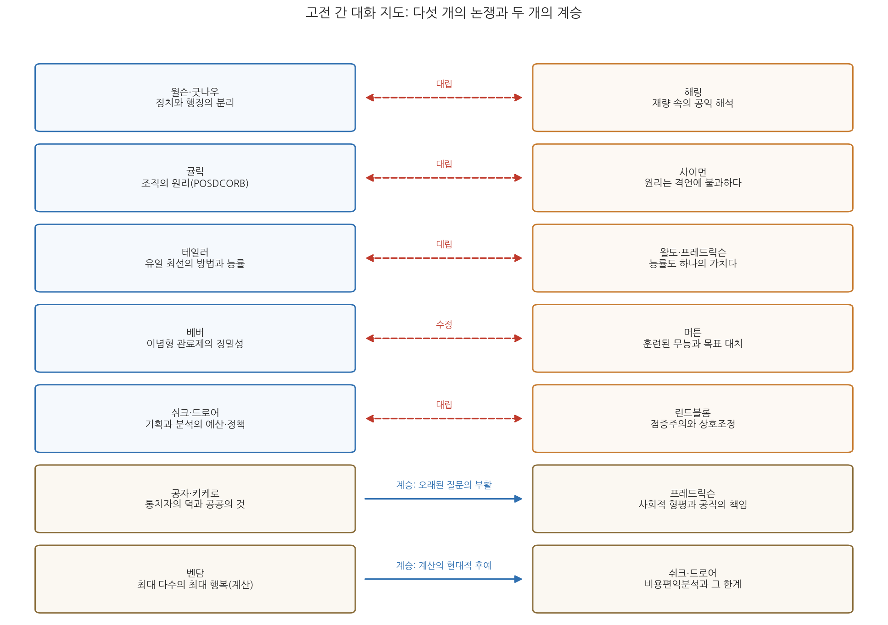
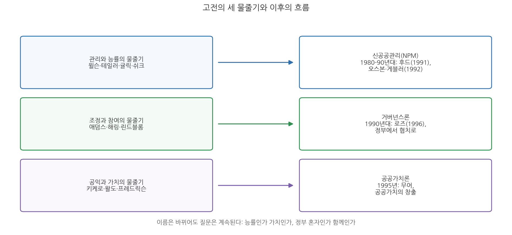

# 13주차 2차시. 고전을 다시 읽는 이유: 텍스트로 본 행정의 현재와 미래

> 우리 자신만 알고 있는 한, 우리는 우리 자신에 관해 아무것도 모른다.
> (우드로 윌슨, 「행정학 연구」, 1887)

## 이 장에서 배우는 것

지난 차시에서 우리는 열여덟 사상가를 시간의 순서대로 다시 걸었다. 이번 차시에서는 시간의 줄을 끊고, 그들을 한 방에 모아 서로 이야기하게 한다. 고전을 읽는 두 번째 방법이다. 연표 위의 고전은 각자 자기 시대에 묶여 있지만, 대화 속의 고전은 시대를 넘어 논쟁한다. 윌슨과 해링이 재량을 두고 맞서고, 귤릭과 사이먼이 원리를 두고 맞서고, 테일러와 왈도가 능률을 두고 맞선다. 그리고 그 논쟁들의 밑바닥에는 몇 개의 오래된 질문이 놓여 있다. 공익이란 무엇인가. 재량은 어디까지 허용되는가. 행정은 누구를 위해 존재하는가. 능률과 민주주의는 화해할 수 있는가.

이 질문들은 학기가 끝나도 닫히지 않는다. 신공공관리, 거버넌스, 공공가치론 같은 이후의 이론들은 모두 이 질문들에 대한 새로운 답안이다. 그래서 이 장의 마지막 절은 고전 읽기를 어떻게 계속할 것인가에 바친다. 구체적으로 다음을 배운다.

- 고전 텍스트들을 대립과 계승의 관계로 연결해 읽는 법
- 행정학의 오래된 질문 네 가지와 각 질문을 둘러싼 고전의 답변들
- 신공공관리, 거버넌스, 공공가치론이 고전의 어떤 물줄기를 잇는지
- 참고문헌을 길잡이 삼아 스스로 고전 읽기를 이어 가는 방법

<strong>이 장의 로드맵</strong> 
이 장은 하나의 질문을 따라 전개된다. <em>"수십 년, 수천 년 전의 텍스트가 왜 지금의 행정을 이해하는 데 필요한가?"</em>  
<strong>2.1</strong> 열여덟 개의 목소리를 대립과 계승의 대화로 재구성한다 →
<strong>2.2</strong> 그 대화들이 맴도는 오래된 질문 네 가지를 정리한다 →
<strong>2.3</strong> 이후의 흐름(신공공관리·거버넌스·공공가치)을 예고편으로 살핀다 →
<strong>2.4</strong> 고전 읽기를 계속하는 법과 참고문헌을 안내한다.

## 2.1 열여덟 개의 목소리: 고전들이 서로 대화하게 하기

한 학기 동안 읽은 원전 선집에는 열여덟 사람의 목소리가 담겨 있었다. 여기에 11주차 2차시에서 발췌로 만난 프레드릭슨의 목소리를 더하면, 우리의 세미나실에는 열아홉 명이 앉아 있는 셈이다. 이들을 시대순이 아니라 쟁점별로 마주 앉히면 무슨 일이 벌어지는가. 그림 13-3이 그 좌석 배치도다.

그림 13-3을 읽는 법은 이렇다. 붉은 점선의 양방향 화살표는 대립, 곧 같은 쟁점에 반대 방향으로 답한 관계다. 파란 실선의 화살표는 계승, 곧 오래된 질문이나 방법이 후대에 되살아난 관계다. 이 그림에서 알 수 있는 것은, 행정학의 발전이 합의의 축적이 아니라 논쟁의 연쇄였다는 점이다. 다섯 개의 논쟁을 차례로 들어 보자.

### 대화 1. 윌슨의 이원론 대 해링의 재량

첫 번째 논쟁은 행정학의 출생증명서를 둘러싼 것이다. 윌슨은 행정을 정치에서 떼어 냄으로써 학문을 세웠다.

<strong>원전 읽기 · 우드로 윌슨, 「행정학 연구」(1887)</strong> 
"무엇보다 중요한 사실은, 행정은 정치의 적절한 영역 밖에 놓여 있다는 점이다. 행정적 질문들은 정치적 질문이 아니다. 정치는 행정에게 과업을 부여하지만, 그 직무들을 좌지우지하도록 허용되어서는 안 된다."

반세기 뒤 해링은 뉴딜의 행정 현장에서 정반대의 사실을 보고했다.

<strong>원전 읽기 · 펜들턴 해링, 『공공행정과 공익』(1936)</strong> 
"공무원이 눈앞의 상충하는 집단들의 이해를 균형 있게 살펴야 한다는 점은 분명하다. 그러나 그는 어떤 기준으로 그들의 요구를 저울질해야 하는가? 공익을 기준으로 내세우는 것은 측량할 수 없는 것을 제시하는 일이다. … 실천에서는 불가피하게 공익 개념이 특정 집단의 이익과 동일시됨으로써 실체를 갖게 된다."

관료가 상충하는 이익들 사이에서 공익을 해석하고 선택한다면, 그 행위는 이미 정치다. 이 논쟁은 해링의 판정승으로 끝난 듯 보였고, 프레드릭슨은 한 걸음 더 나아가 "행정가들은 정책을 집행하는 동시에 수립하고 있으므로 이분법은 경험적 근거가 부족하다"고 못 박았다. 그러나 윌슨이 완전히 진 것은 아니다. 그가 지키려던 것, 곧 행정의 전문성을 당파적 개입에서 보호해야 한다는 요청은 지금도 유효하다. 이원론은 사실의 기술로는 무너졌지만, 규범적 방어선으로는 살아 있다.

### 대화 2. 귤릭의 원리 대 사이먼의 격언

두 번째 논쟁은 행정학이 과학일 수 있는가를 둘러싼 것이다. 8주차 2차시에서 읽었듯 귤릭은 명령통일의 원리를 이렇게 옹호했다.

<strong>원전 읽기 · 루서 귤릭, 「조직이론에 관한 노트」(1937)</strong> 
"여러 관계를 가진 일을 하는 사람에게 둘 이상의 상관을 두고 싶은 유혹은 종종 생긴다. 심지어 경영의 위대한 사상가 테일러조차 기계, 자재, 속도 각각에 대해 개별 작업자에게 직접 명령을 내릴 감독자를 따로 세우는 오류에 빠졌다. 명령통일의 원리를 엄격히 고수하는 데 어떤 우스꽝스러움이 따를 수는 있지만, 그것은 이 원리를 어길 때 생기는 혼란과 비효율, 책임회피의 확실성에 비하면 중요하지 않다."

사이먼은 바로 이 문장을 과녁 한가운데 놓았다.

<strong>원전 읽기 · 허버트 사이먼, 「행정의 격언들」(1946)</strong> 
"이 원리의 진짜 결함은 전문화의 원리와 양립할 수 없다는 점이다. … 문제를 결정하는 데 필요한 것은 두 노선의 상대적 이점을 저울질할 수 있게 해 주는 행정의 원리다. 하지만 명령통일도 전문화도 이 쟁점을 판정하는 데 도움이 되지 않는다. 둘은 서로 모순될 뿐이고, 그 모순을 푸는 절차를 제시하지 않는다."

명령통일을 지키면 전문 지식이 결정에 반영되지 못하고, 전문화를 밀고 나가면 명령 계통이 여러 갈래가 된다. 두 원리가 반대 방향을 가리키는데 어느 쪽을 따를지 알려 주는 것이 이론에 없다면, 그 원리들은 이미 내린 결정을 정당화하는 격언일 뿐이라는 것이다. 흥미로운 점은 귤릭 자신이 이 긴장을 몰랐던 것이 아니라는 사실이다. 그는 통솔범위의 적정 숫자가 상황에 따라 다르다는 것을 인정했고, 원리들 사이의 절충을 실무 감각으로 처리했다. 사이먼이 요구한 것은 그 감각을 검증 가능한 이론으로 바꾸라는 것이었다. 이 논쟁에서 행정학의 행태주의 혁명이 시작되었고, 의사결정 연구라는 새 영토가 열렸다.

### 대화 3. 테일러의 능률 대 왈도와 프레드릭슨의 가치

세 번째 논쟁은 능률의 지위를 둘러싼 것이다. 테일러에게 능률은 과학이 발견하는 사실이자 노사가 함께 이익을 보는 조화의 원천이었다. 유일 최선의 방법이 발견되면 그것을 따르는 것이 모두에게 좋다. 왈도는 이 확신의 밑바닥을 파헤쳤다. 능률은 언제나 "무엇을 위한 능률인가"라는 물음을 전제하며, 그 물음에 답하는 순간 우리는 이미 가치와 정치의 영역에 들어선다는 것이다. 그는 만년에 이 논점이 어디까지 왔는지 이렇게 정리했다.

<strong>원전 읽기 · 드와이트 왈도, 「행정국가 다시 보기」(1965)</strong> 
"우리는 여전히 경제와 능률을 강조하고, 성과를 개선하며, 그것들을 측정하는 방법을 정교화한다. 그러나 이는 주로 행정의 하위 수준에서 이루어진다. 상위 수준에서는 사회적 능률로의 확장이 이어진다. … 오늘날 이 수준의 사유에서 능률은 자주 쓰이는 용어가 아니다. 우리는 좋은, 지혜로운, 아니면 그저 작동 가능한 결정을 추구한다."

프레드릭슨은 이 비판을 적극적 규범으로 바꾸었다. 능률을 부정하는 것이 아니라, 능률이 사회적 정의를 침해해서는 안 된다는 상위 가치를 세운 것이다. "이 서비스가 사회적 형평성을 증진하는가"라는 그의 질문은, 테일러의 초시계가 결코 측정할 수 없는 것을 측정하라는 요구였다. 이 대화의 교훈은 능률과 가치가 양자택일이 아니라는 점이다. 능률은 필요하되 충분하지 않다. 무엇을 위한, 누구를 위한 능률인지 답할 때만 능률은 좋은 행정의 언어가 된다.

### 대화 4. 베버의 이념형 대 머튼의 역기능

네 번째 대화는 대립이라기보다 수정이다. 베버는 관료제가 정밀성과 신뢰성, 효율성에서 다른 어떤 조직 형태보다 우월하다는 점을 개념적으로 정리했다. 머튼은 같은 구조를 반대편 조명 아래 세웠다. 신뢰성을 확보하려는 규율이 규칙의 절대화를 낳고, 규칙의 절대화가 훈련된 무능과 목표 대치를 낳는다. 9주차 1차시에서 본 발첸의 사례를 기억할 것이다. 남극의 미국 원정대에 있었다는 이유로 미국 내 연속 거주 요건을 채우지 못했다고 판정받은 조종사의 이야기 말이다. 규칙을 문자 그대로 지킨 결과가 규칙의 목적을 배반했다.

이 대화가 보여 주는 것은 고전 읽기의 중요한 기술이다. 머튼은 베버를 반박한 것이 아니라 베버의 분석에 "양가성"이라는 렌즈를 하나 더 얹었다. 무언가를 보는 방식은 동시에 보지 않는 방식이기도 하다. 베버가 관료제가 이루는 것에 집중했다면, 머튼은 같은 장치가 잃게 만드는 것을 물었다. 고전을 잇는 후속 연구는 이렇게 전면 부정이 아니라 시야의 보완으로 이루어지는 경우가 많다.

### 대화 5. 쉬크와 드로어의 분석 대 린드블롬의 점증

다섯 번째 논쟁은 결정의 방법을 둘러싼 것이다. 쉬크가 기록한 PPBS는 목표를 먼저 세우고 대안들의 비용과 편익을 비교해 예산을 배분하려는, 기획 지향의 야심이었다. 린드블롬은 그런 총체적 접근이 복잡한 문제에서는 "사실상 불가능하며", 실제의 결정은 기존 정책에서 조금씩 바꾸어 가는 제한적 비교의 연쇄로 이루어진다고 맞섰다. 좋은 정책의 시험 기준도 목표 적합성이 아니라 참여자들의 합의라는 것이다.

드로어의 자리는 그 중간이면서 양쪽 모두에 비판적이다. 그는 점증주의가 보수적이고 혁신이 부족하다고 비판하는 동시에, 시스템 분석이 계량화에 집착하고 정치를 무시한다고 비판했다. 그의 정책분석은 분석의 엄밀함과 정치의 현실, 그리고 창의성과 직관 같은 초합리적(extra-rational) 요소를 한데 엮으려는 시도였다. 이 삼자 대화는 아직 끝나지 않았다. 오늘날의 증거기반 정책 논쟁, 예비타당성조사의 존폐 논쟁은 모두 이 대화의 연장전이다.

### 두 개의 계승

대립만 있는 것은 아니다. 그림 13-3 아래쪽의 두 계승선을 보자. 첫째, 공자와 키케로가 물었던 통치자의 덕과 공공의 것이라는 질문은, 2천 년을 건너 프레드릭슨의 사회적 형평과 공직의 책임에서 부활했다. "누구를 위한 행정인가"는 신행정학의 발명품이 아니라 행정 사유의 원점이다. 둘째, 벤담의 쾌락과 고통의 계산은 비용편익분석이라는 이름으로 쉬크와 드로어의 시대에 제도가 되었다. 다만 후예들은 조상보다 겸손해졌다. 드로어의 시스템 분석 비판은, 계산이 다룰 수 없는 가치의 영역이 있다는 자기 한계의 고백이기도 하다.

## 2.2 고전이 던진 오래된 질문들

다섯 개의 대화를 가로지르면 네 개의 질문이 남는다. 행정학의 이론들은 바뀌어 왔지만 질문은 바뀌지 않았다. 이 질문들을 정리해 두면, 여러분은 앞으로 어떤 새 이론을 만나도 그것이 어느 질문에 대한 답인지 자리매김할 수 있다.

**질문 1. 공익이란 무엇인가.** 키케로는 공화국의 경영이 "후견인에게 유익한 바가 아니라 보호받는 자들에게 유익한 바"를 향해야 한다고 답했다. 벤담은 더 조작 가능한 답을 시도했다.

<strong>원전 읽기 · 벤담, 『도덕과 입법의 원리 서론』(1789)</strong> 
"공동체란 그 구성원인 개인들로 이루어진 하나의 허구적 집단이다. 따라서 공동체의 이익이란 여러 구성원의 이익의 총합이다. 개인의 이익을 이해하지 않고 공동체의 이익을 말하는 것은 헛되다."

공익을 개인 이익의 총합으로 환원하면 계산이 가능해지지만, 해링이 보여 주었듯 현장의 관료에게 공익은 여전히 "측량할 수 없는" 상징이며, 프레드릭슨이 보여 주었듯 총합의 논리는 소수자의 몫을 지워 버릴 수 있다. 공익은 정의되는 개념이 아니라 계속 다투어지는 개념이다. 바로 그렇기 때문에 그것을 해석하는 행정가의 자질과 절차가 중요해진다.

**질문 2. 재량은 어디까지 허용되는가.** 이원론은 재량을 최소화하려는 기획이었고, 해링은 재량의 불가피성을 보여 주었다. 그런데 뜻밖에도 재량의 가장 강력한 옹호자는 윌슨 자신이었다.

<strong>원전 읽기 · 우드로 윌슨, 「행정학 연구」(1887)</strong> 
"나는 큰 권한과 제약받지 않은 재량이 책임의 필수 조건이라고 확신한다. … 권력이 위험한 것은 오직 그것이 책임지지 않을 때뿐이다. 권력이 쪼개져 여럿에게 분배되면 권력은 가려지고, 가려지면 책임을 물을 수 없게 된다. 반대로 권력이 복무의 수장에게 집중되면, 그 권력은 쉽게 감시되고 책임을 물을 수 있다."

재량을 없애는 것이 아니라, 재량을 준 만큼 책임의 소재를 분명히 하라는 것이다. 베버의 규칙과 계층은 재량을 길들이는 장치였고, 머튼은 그 장치가 과도하면 재량이 사라진 자리에 형식주의가 들어선다는 것을 보여 주었다. 재량과 책임, 규칙과 유연성 사이의 적정선 찾기는 행정 제도 설계의 영원한 과제다.

**질문 3. 행정은 누구를 위해 존재하는가.** 애덤스는 이 질문을 가장 낮은 곳에서 던졌다.

<strong>원전 읽기 · 제인 애덤스, 「도시 행정의 문제」(1905)</strong> 
"정부는 이 투쟁에서 패배한 수많은 사람들도 고려해야만 한다. 그 투쟁과 패배가 그들에게 미친 영향까지도 말이다. 결국 언제나 사회의 대다수를 차지하는 것은 바로 그들이며, 다른 정부는 어떨지 몰라도 자치 정부는 궁극적으로 이 다수와 함께 가야 하기 때문이다."

행정이 규제와 단속의 대상, 구호의 대상으로만 시민을 만난다면, 그 행정은 시민의 것이 아니다. 60여 년 뒤 프레드릭슨은 같은 질문에 분석의 도구를 붙였다. 이 서비스의 혜택이 누구에게 가는지 데이터로 따지라는 것이다. 도덕적 직관이 분석 기법을 만난 지점에서 사회적 형평성이라는 개념이 태어났다.

**질문 4. 능률과 민주주의는 화해할 수 있는가.** 윌슨은 유럽의 능률적 행정을 부러워하면서도 "훈련받지 않았더라도 자유로운 편이, 예속되어 체계적인 편보다 낫다"고 썼고, 곧바로 "영혼은 자유롭고 실무는 능숙한 편이 더 낫다"고 덧붙였다. 행정학은 그 두 마리 토끼를 쫓는 학문으로 태어났다. 귤릭은 전문가를 두되 "수중(on tap)에 두지 정상(on top)에 두지 말라"고 했고, 왈도는 민주주의가 행정의 외부 조건이 아니라 행정 안에서 실현되어야 할 가치라고 주장했다. 이 질문은 전문가의 판단과 시민의 선호가 부딪히는 모든 현장에서, 이를테면 방역과 입지 갈등과 재정 배분에서 오늘도 되풀이된다.

<strong>정의 · 오래된 질문(perennial questions)</strong> 
시대와 이론이 바뀌어도 형태를 달리하며 반복되는 근본 질문을 말한다. 행정학에서는 공익의 내용, 재량과 책임, 행정의 수혜자, 능률과 민주주의의 관계가 대표적이다. 오래된 질문은 최종 답이 없다는 점에서 미해결이지만, 답들의 역사가 축적된다는 점에서 진보한다.

## 2.3 이후의 흐름: 신공공관리, 거버넌스, 공공가치

이 강의는 1960-70년대에서 멈추었지만 행정학의 이야기는 계속되었다. 예고편 삼아 세 흐름만 짧게 소개한다. 중요한 것은 각 흐름이 우리가 읽은 고전의 어느 물줄기를 잇는가다.

그림 13-4를 읽는 법은 이렇다. 왼쪽은 이 강의에서 읽은 고전의 세 물줄기이고, 오른쪽은 그 물줄기가 흘러든 이후의 이론이다. 이 그림에서 알 수 있는 것은, 새 이론이 무에서 창조된 것이 아니라 고전의 질문을 새 환경에서 다시 푼 것이라는 점이다.

**신공공관리(New Public Management, NPM).** 1980년대 이후 영국과 뉴질랜드 등에서 시작된 정부 개혁의 흐름으로, 시장 원리와 민간 관리 기법을 정부에 들여왔다. 성과 계약, 경쟁과 민간위탁, 고객 지향이 그 언어다. 후드(Christopher Hood)가 1991년의 논문에서 이 흐름에 이름을 붙였고, 오스본(David Osborne)과 게블러(Ted Gaebler)의 『정부 재창조』(1992)가 대중화했다. 계보로 보면 신공공관리는 윌슨의 "정부를 사업처럼", 테일러의 측정과 성과, 쉬크의 결과 지향 예산이라는 관리와 능률의 물줄기를 잇는다. 그래서 그 비판도 고전의 비판을 되풀이한다. 시민을 고객으로 축소한다는 비판은 애덤스와 신행정학의 참여 요구를, 성과지표가 목표를 대치한다는 비판은 머튼의 목표 대치를, 능률이 다시 절대화된다는 비판은 왈도의 능률 이데올로기 비판을 잇는 것이다.

**거버넌스(governance).** 1990년대 이후, 정부 혼자 통치하는 것이 아니라 정부와 시장과 시민사회가 그물망처럼 얽혀 공적 문제를 함께 푼다는 인식이 확산되었다. 로즈(R. A. W. Rhodes)의 1996년 논문이 "정부 없는 통치(governing without government)"라는 표현으로 이 전환을 요약했다. 계보로 보면 거버넌스론은 해링이 그린 이익집단의 거미줄 속 행정가, 린드블롬의 당사자 간 상호조정, 애덤스의 시민 참여라는 조정과 참여의 물줄기를 잇는다. 관료제 홀로 공익을 결정할 수 없다면 함께 결정하는 구조를 만들자는 것이 그 답안이다.

**공공가치론(public value).** 무어(Mark H. Moore)의 『공공가치의 창출』(1995)은 공공관리자를 규칙의 집행자가 아니라 공공가치를 창출하는 전략가로 그렸고, 이후 공공가치는 신공공관리의 성과 개념을 넘어서는 평가 언어로 발전했다. 계보로 보면 이것은 키케로의 공공의 것(res publica), 해링의 공익, 왈도와 프레드릭슨의 가치 복원이라는 물줄기의 연장이다. 능률로 잴 수 없는 정부 활동의 가치를 어떻게 개념화하고 측정할 것인가라는, 오래된 질문의 최신 답안인 셈이다.

<strong>유의 · 새 이론을 만나면 계보부터 물어라</strong> 
앞으로 여러분은 수업과 논문과 보도자료에서 수많은 새 행정 이론과 개혁 구호를 만날 것이다. 그때마다 두 가지를 물어 보라. 이 주장은 네 가지 오래된 질문 가운데 어디에 답하고 있는가. 그리고 고전의 어느 답을 계승하거나 반복하고 있는가. 이 두 질문에 답할 수 있으면 유행에 휩쓸리지 않고 이론을 평가할 수 있다. 그것이 행정사를 배운 사람의 이점이다.

## 2.4 고전 읽기를 계속하는 법

1주차에 우리는 고전 읽기의 세 단계를 약속했었다. 시대 맥락을 살피고, 논지를 따라가고, 현대적으로 번역한다는 것이다. 학기를 마치는 지금, 여기에 두 가지를 더할 수 있다.

**넷째, 고전끼리 대화시켜라.** 이 장에서 연습한 방법이다. 한 텍스트를 읽을 때 "이 주장에 가장 강하게 반대할 사람은 누구인가"를 함께 떠올리면, 텍스트의 논지가 훨씬 선명해진다. 사이먼을 읽으면 귤릭이, 해링을 읽으면 윌슨이 옆에 있어야 한다.

**다섯째, 지금의 문제를 들고 가라.** 고전은 문제를 가진 독자에게 가장 많이 말해 준다. 성과지표를 설계하다 막히면 머튼을, 위원회가 공전하면 린드블롬을, 공공기관의 존재 이유를 물어야 하면 왈도를 다시 펴 보라. 고전이 답을 주지는 않는다. 그러나 질문을 정확하게 만들어 준다.

이어서, 스스로 읽기를 계속할 사람을 위한 안내다. 표 13-1은 우리가 읽은 원전들의 목록이다. 이 교재의 발췌는 어디까지나 발췌이므로, 관심이 생긴 텍스트는 전문으로 읽기를 권한다.

**표 13-1. 이 강의에서 읽은 원전 목록**

| 사상가 | 원전 | 연도 | 주차 |
|---|---|---|---|
| 공자 | 『논어』 (안연·자로·요왈편) | 기원전 5세기경 편찬 | 2주차 1차시 |
| 키케로 | 『의무론』 | 기원전 44 | 2주차 2차시 |
| 벤담 | 『도덕과 입법의 원리 서론』 중 「공리의 원리」 | 1789 | 3주차 1차시 |
| 클라우제비츠 | 『전쟁론』 중 「정보」·「마찰」 | 1832 | 3주차 2차시 |
| 우드로 윌슨 | 「행정학 연구」 | 1887 | 4주차 2차시, 5주차 1차시 |
| 프랭크 굿나우 | 『정치와 행정』 | 1900 | 5주차 2차시 |
| 제인 애덤스 | 「도시 행정의 문제」 | 1905 | 6주차 1차시 |
| 프레더릭 테일러 | 『과학적 관리의 원칙』과 1912년 하원 증언 | 1911-1912 | 6주차 2차시 |
| 막스 베버 | 「관료제」 (『경제와 사회』 중) | 1922(사후) | 7주차 1차시 |
| 레너드 화이트 | 『행정학 입문』 | 1926 | 7주차 2차시 |
| 펜들턴 해링 | 『공공행정과 공익』 | 1936 | 8주차 1차시 |
| 루서 귤릭 | 「조직이론에 관한 노트」 | 1937 | 8주차 2차시 |
| 로버트 머튼 | 「관료제의 구조와 성격」 | 1940 | 9주차 1차시 |
| 허버트 사이먼 | 「행정의 격언들」 | 1946 | 9주차 2차시 |
| 드와이트 왈도 | 『행정국가』, 「행정국가 다시 보기」 | 1948, 1965 | 10주차 1·2차시 |
| 찰스 린드블롬 | 「'우왕좌왕하기'의 과학」 | 1959 | 11주차 1차시 |
| 조지 프레드릭슨 | 「신행정학을 향하여」 (강의 발췌) | 1971 | 11주차 2차시 |
| 앨런 쉬크 | 「PPB로 가는 길: 예산개혁의 단계」 | 1966 | 12주차 1차시 |
| 예헤츠켈 드로어 | 「정책분석가: 새로운 전문직 역할」 | 1967 | 12주차 2차시 |

더 넓게 읽고 싶다면 세 갈래의 길이 있다. 첫째, 이런 원전들을 모아 놓은 선집이 있다. 샤프리츠와 하이드(Shafritz & Hyde)가 엮은 『행정학 고전(Classics of Public Administration)』 계열의 선집이 대표적이며, 이 강의의 원전 구성도 그 전통을 따랐다. 둘째, 저작권이 만료된 원전 다수는 인터넷에서 원문을 무료로 읽을 수 있다. 구텐베르크 프로젝트와 위키소스에서 벤담, 클라우제비츠, 테일러 등의 원문을 찾을 수 있고, 윌슨의 논문을 비롯한 초기 학술지 논문들도 공개 아카이브로 접근할 수 있다. 번역문이 어색하게 느껴지던 대목을 원문과 대조해 보는 것은 그 자체로 훌륭한 공부다. 셋째, 발췌로 읽은 책의 전체를 읽는 것이다. 특히 왈도의 『행정국가』(1948)와 굿나우의 『정치와 행정』(1900)은 발췌와 전문의 인상이 사뭇 다른 책들이다.

마지막으로 한 가지. 고전을 읽는 최종 목적은 과거를 아는 것이 아니라 현재를 낯설게 보는 것이다. 윌슨은 외국의 행정을 연구하는 이유를 "선입견 없이 우리를 바라볼 외국인의 눈"을 얻기 위해서라고 했다. 고전은 시간 속의 외국이다. 2,500년 전의 공자와 90년 전의 해링의 눈을 빌릴 때, 우리는 오늘의 행정이 자연스럽지도 필연적이지도 않으며, 물려받은 답들의 잠정적 집합이라는 것을 보게 된다. 그것을 보는 사람만이 다음 답을 쓸 수 있다.

## 요약

고전은 연표로도 읽을 수 있지만 대화로도 읽을 수 있다. 윌슨과 해링은 정치와 행정의 분리를 두고, 귤릭과 사이먼은 원리의 과학성을 두고, 테일러와 왈도·프레드릭슨은 능률의 지위를 두고, 베버와 머튼은 관료제의 명암을 두고, 쉬크·드로어와 린드블롬은 결정의 방법을 두고 시대를 넘어 논쟁한다. 한편 공자와 키케로의 덕과 공익은 프레드릭슨의 형평으로, 벤담의 계산은 비용편익분석으로 계승되었다. 이 대화들의 밑바닥에는 네 개의 오래된 질문이 있다. 공익이란 무엇인가, 재량은 어디까지인가, 행정은 누구를 위해 존재하는가, 능률과 민주주의는 화해할 수 있는가. 이후의 흐름인 신공공관리(관리·능률의 물줄기), 거버넌스(조정·참여의 물줄기), 공공가치론(공익·가치의 물줄기)은 모두 이 질문들에 대한 새 답안이다. 고전 읽기를 계속하는 법은 다섯 가지로 요약된다. 시대 맥락을 살피고, 논지를 따라가고, 현대적으로 번역하고, 고전끼리 대화시키고, 지금의 문제를 들고 갈 것. 고전은 답이 아니라 질문을 정확하게 만드는 도구이며, 시간 속의 외국으로서 현재를 낯설게 보는 눈을 빌려준다.

## 토론·복습 문제

**13-5. (원전 구절 해석형)** 다음은 사이먼의 「행정의 격언들」(1946)의 한 구절이다. "격언의 인용 가능성을 크게 높여주는 사실 하나는, 격언이 거의 언제나 서로 모순되는 짝으로 존재한다는 점이다. … 격언은 설득과 정치적 논쟁, 모든 수사의 형식에서 큰 도움이 된다. 그러나 격언을 과학적 이론의 토대로 삼고자 할 때 상황은 그리 즐겁지 않다. 격언이 표현하는 명제가 부족해서가 아니라, 너무나 많은 것을 증명해 버리기 때문이다. 과학적 이론은 무엇이 참인지뿐 아니라 무엇이 거짓인지도 말해 주어야 한다." (가) 글쓴이가 격언의 결함으로 지적하는 것이 무엇인지 설명하시오. (나) 이 비판이 귤릭의 조직 원리들에 어떻게 적용되는지, 명령통일과 전문화의 충돌을 예로 들어 서술하시오. (다) "행정은 기껏해야 기술(art)일 뿐"이라는 반론에 대해 사이먼이 어떻게 답했는지 밝히시오.

**13-6. (기말 대비 종합 서술형)** "정치행정 이원론은 성립하고, 붕괴하고, 변형되어 살아남았다." 이 명제를 윌슨(1887), 굿나우(1900), 해링(1936), 프레드릭슨(1971)의 원전 논지를 각각 인용하거나 요약하면서 시대순으로 설명하고, 이원론이 오늘날에도 규범적으로 옹호될 수 있는 지점이 있는지 논의하시오.

**13-7. (기말 대비 종합 서술형)** 신공공관리, 거버넌스, 공공가치론 가운데 하나를 골라, 그것이 계승하는 고전의 물줄기(사상가와 원전)를 밝히고, 그 고전에 제기되었던 비판이 새 이론에도 적용될 수 있는지 검토하시오.

**13-8. (적용·토론)** 최근 한국 사회에서 논쟁이 된 행정 사안 하나를 고르라(예: 대형 국책사업의 타당성 논쟁, 재난 대응의 형평성 논쟁, 공공기관의 성과평가 논쟁). 이 장에서 정리한 네 가지 오래된 질문 가운데 그 사안이 건드리는 질문이 무엇인지 밝히고, 서로 다른 답을 내놓을 고전 두 편을 골라 두 사상가의 가상 대담을 대화체로 구성해 보시오.
