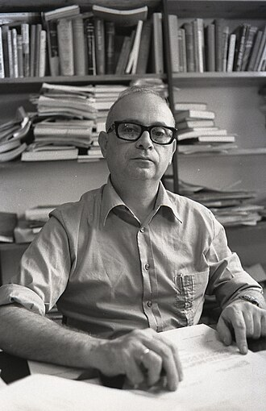
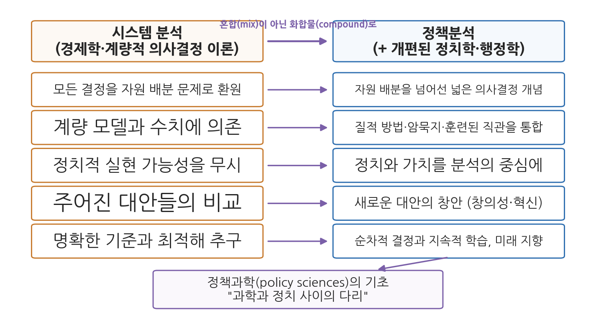

# 13주차 2차시. 정책분석: 드로어의 정책분석가: 새로운 전문직

> 정책분석은 과학과 정치 사이에 놓인 다리의 하나다. 그러나 그것이 정치와 조직 행동의 기본 성격을 바꾸어 놓지는 않는다.
> (예헤츠켈 드로어, 「정책분석가」)

## 이 장에서 배우는 것

1960년대 중반의 워싱턴을 상상해 보자. 앞 차시에서 본 것처럼 PPBS가 연방정부 전체로 확대되면서, 국방부에서 무기체계를 골라내던 시스템 분석가들이 이제 교육부와 보건부에서 일하게 되었다. 그들의 도구는 계량 모델과 비용편익분석이었고, 그들의 자신감은 국방부에서의 성공 사례로 뒷받침되어 있었다. 그런데 빈곤 퇴치 프로그램의 편익은 몇 달러인가. 인종 차별을 줄이는 정책의 비용과 편익은 어느 눈금으로 재는가. 숫자로 잴 수 없는 것들 앞에서, 숫자의 전문가들은 무엇을 하게 될 것인가.

이 물음에 가장 예리하게 답한 사람이 이스라엘의 정치학자 예헤츠켈 드로어다. 그는 1967년의 짧은 논문에서 경제학이 공공 의사결정을 "침공"하고 있다고 진단하고, 시스템 분석이 그대로 정부 전반에 도입되면 오히려 개혁 전체가 반발에 부딪히리라고 경고했다. 그리고 대안으로 새로운 전문직 하나를 설계해 내놓았다. 계량 분석에 정치와 가치의 이해를 결합한 전문가, 곧 정책분석가(policy analyst)다. 오늘날 세계의 정책대학원들이 길러 내는 바로 그 직업의 출발점에 해당하는 문헌을 이번 차시에 읽는다.

이 장에서 배우는 것은 다음과 같다.

- 드로어가 말한 "경제학에 의한 공공 의사결정의 침공"이 무엇인지
- 시스템 분석의 일곱 가지 약점: 계량화 집착, 가치의 통약 불가능성, 정치 무시 등
- 부메랑 효과: 과잉 기대가 어떻게 개혁 자체를 무너뜨리는지
- 정책분석이라는 새 전문직의 요건: 혼합이 아닌 화합물
- 사이먼-린드블롬-드로어로 이어지는 합리성 논쟁의 계보와 정책학의 탄생

<strong>이 장의 로드맵</strong> 
이 장은 하나의 질문을 따라간다. <em>"계량 분석이 잴 수 없는 것을 다루려면, 분석은 무엇이 되어야 하는가?"</em>  
<strong>2.1</strong> 드로어라는 사상가와 "경제학의 침공"이라는 시대 진단을 살펴본다 →
<strong>2.2</strong> 원전 강독 I: 시스템 분석의 약점과 부메랑 효과를 읽는다 →
<strong>2.3</strong> 원전 강독 II: 정책분석이라는 새 전문직의 설계도를 읽는다 →
<strong>2.4</strong> 사이먼·린드블롬과 이어 보며 합리성 논쟁의 계보를 정리한다 →
<strong>2.5</strong> 정책학의 탄생과 현대의 정책분석 전문직을 본다.

## 2.1 드로어와 시대: 경제학의 침공

<strong>인물 · 예헤츠켈 드로어(Yehezkel Dror, 1928-2026)</strong> 
이스라엘의 정책학자로, 1928년 오스트리아 빈에서 태어나 1938년 가족과 함께 팔레스타인으로 이주했다. 1946년 하이파의 레알리 학교를 마친 뒤 히브리대학교에서 학사와 법학 석사 학위를, 하버드대학교에서 법학 석사와 법학 박사(SJD) 학위를 받았다. 1957년 히브리대학교 정치학과에 부임했고 1964년부터 행정학 부문을 이끌었다. 1968년부터 1970년까지 미국 랜드연구소 선임연구원으로 일하며 『광기의 국가들』(1971)로 이어지는 구상을 얻었다. 이스라엘 정부의 정책 자문을 오래 맡았고, 2002년 유대민족정책기획연구소(JPPI)를 세웠으며, 2006년 레바논 전쟁을 조사한 위노그라드 위원회의 위원으로 참여했다. 1965년 로솔리오상을, 2005년에는 전략기획과 정책결정에 기여한 공로로 이스라엘상을 받았다. 2026년 1월 1일 97세로 사망했다. 
대표 저술: 「정책분석가: 정부 서비스에서의 새로운 전문직 역할」(1967), 『공공정책결정의 재검토(Public Policymaking Reexamined)』(1968), 『정책과학을 위한 설계(Design for Policy Sciences)』(1971), 『통치 능력(The Capacity to Govern)』(2001) 
사진: 보리스 카르미 촬영, 위키미디어 공용 (CC BY 4.0)

### 경제학자들이 온다

앞 차시의 쉬크는 기획 지향의 시대가 오면 예산 인력이 "행정가에서 경제학자로" 바뀔 것이라고 썼다. 1960년대 중반 그 예측은 눈앞의 현실이 되고 있었다. 랜드 연구소(RAND Corporation) 출신의 경제학자와 시스템 분석가들이 국방부를 거쳐 연방정부 곳곳의 PPBS 부서로 퍼져 나갔다. 이들은 행정을 배운 적이 없는 대신, 미시경제학과 계량적 의사결정 이론이라는 정교하게 발달한 도구를 들고 왔다. 그 도구로 보면 정부의 모든 결정은 하나의 형태, 곧 "한정된 자원을 대안들 사이에 어떻게 배분할 것인가"라는 경제 문제였다.

드로어의 논문 「정책분석가: 정부 서비스에서의 새로운 전문직 역할(Policy Analysts: A New Professional Role in Government Service)」은 이러한 상황에 대한 응답으로, 1967년 『행정학보(Public Administration Review)』에 실렸다. 쉬크의 논문 바로 이듬해, 같은 지면이다. 두 논문은 같은 현상(PPBS의 확산)을 다른 각도에서 본다. 쉬크가 예산제도의 역사 속에서 PPB의 자리를 물었다면, 드로어는 PPB를 움직이는 분석 도구 자체의 성격을 검토한다.

### 예헤츠켈 드로어: 정책과학의 설계자

예헤츠켈 드로어(Yehezkel Dror, 1928-2026)는 오스트리아 빈에서 태어나 1938년 나치의 박해를 피해 가족과 함께 팔레스타인으로 이주했고, 히브리 대학교에서 공부한 뒤 하버드 대학교에서 법학 박사학위를 받았다. 1957년부터 예루살렘 히브리 대학교 정치학과에서 가르쳤고, 미국 랜드 연구소에서 일하며 시스템 분석의 본거지를 안에서 관찰할 기회를 가졌다. 그는 해럴드 라스웰(Harold Lasswell)과 더불어 정책과학(policy sciences)을 독자적 학문 분과로 세운 창시자의 한 사람으로 꼽히며, "정책분석가"라는 직업의 정체성을 확립한 인물로 평가된다.

드로어의 학문적 위치는 두 방향의 비판으로 요약된다. 한쪽으로 그는 12주차에서 읽은 린드블롬의 점증주의가 지나치게 보수적이고 혁신을 가로막는다고 비판했다. 다른 쪽으로는 순수한 합리모형이 인간의 인지적 한계와 정치 현실을 무시한다고 비판했다. 그가 제시한 대안은 최적모형(optimal model), 곧 경제적 분석 같은 합리적 요소에 직관·창의성·판단 같은 초합리적(extra-rational) 요소를 결합하는 제3의 길이었다. 점증주의보다는 혁신적이고, 순수 합리주의보다는 현실적인 길이다. 이번에 읽는 논문은 이 구도가 PPBS라는 구체적 제도 앞에서 어떻게 적용되는지 보여 준다.

## 2.2 원전 강독 I: 시스템 분석의 침공과 그 한계

### 피할 수 없고, 유익하며, 위험하다

드로어는 논문 첫머리에서 당대의 개혁 운동을 한 단어로 진단한다. 침공(invasion)이다.

<strong>원전 읽기 · 예헤츠켈 드로어, 「정책분석가」(1967)</strong> 
"본질적으로 이 개혁은 경제학이 공공 의사결정을 '침공'하고 있음을 뜻한다. 경제정책 결정의 영역을 훨씬 넘어서, 경제학적 접근은 모든 결정을 대안들 사이의 자원 배분, 곧 경제 문제로 본다. (…) 경제학에 의한 공공 의사결정의 침공은 피할 수 없고 유익하지만, 동시에 위험을 품고 있다. 의사결정 과정의 개선을 위한 고도로 발달한 이론적 기초를 제공하는 학문이 경제학뿐이기에 이 침공은 피할 수 없다. 시스템 분석과 PPBS 형태의 경제학적 접근을 신중하게 쓴다면 공공 의사결정의 개선에 기여할 수 있기에 유익하다. 그러나 공공 정책 결정의 많은 핵심 요소들을 제대로 다루지 못해 의사결정을 왜곡할 수 있기에 위험하다."

무슨 말인가. 드로어는 반(反)계량주의자가 아니다. 그는 경제학의 침공이 "피할 수 없고 유익하다"고 두 번 인정한다. 주먹구구 행정에 비하면 체계적 분석은 진보다. 문제는 이 접근이 다루지 못하는 영역이다. 모든 결정을 자원 배분으로 환원하는 순간, 자원 배분이 아닌 결정들(외교 각서의 문안을 정하는 일, 징병 방식을 추첨제로 바꾸는 일 같은)은 분석의 시야에서 사라지거나 억지로 변형된다. 왜 중요한가. 이 3중 판정(불가피하다, 유익하다, 위험하다)이 논문 전체의 균형 감각을 결정하기 때문이다. 드로어의 목표는 침공을 막아 내는 것이 아니라, 그 이점을 살리면서 위험을 피하는 방법을 설계하는 것이다.

### 일곱 가지 약점

그 위험은 어디에 있는가. 드로어는 시스템 분석이라는 전문 분야의 본질에서 비롯되는 약점들을 목록으로 제시한다. 개척자 몇 사람의 개인적 역량이 아니라 분야 자체의 성질을 보아야 한다는 단서와 함께다. 국방부에서의 성공은 상당 부분 몇 안 되는 탁월한 실무자들의 지혜와 개방성 덕분이었는데, 시스템 분석이 정부 전반의 정규 직무가 되면 더는 그런 예외적 개인들에게 기댈 수 없기 때문이다.

<strong>원전 읽기 · 예헤츠켈 드로어, 「정책분석가」(1967)</strong> 
"공공 의사결정의 관점에서 본 시스템 분석의 중요한 약점 몇 가지는 다음과 같이 간추릴 수 있다. (1) 계량화에 대한 강한 집착과 의존. (2) 서로 충돌하고 통약 불가능한(non-commensurate) 가치들을 다루는 능력의 부재. (3) 명확한 의사결정 기준과 잘 정의된 임무에 대한 요구. (4) 정치적 실현 가능성의 문제와 정치적 자원의 특수성에 대한 무시. (5) 창의성, 암묵적 지식, 판단력 같은 본질적인 초합리적(extra-rational) 결정 요소들을 의미 있게 다루지 못함. (6) 하위 최적화(sub-optimization)를 거치지 않고는 크고 복잡한 시스템을 다룰 수 없는 무능력. 그런데 하위 최적화는 더 어렵고 복잡한 문제들의 전체적인 '게슈탈트(Gestalt)'를 부순다. (7) 개인의 동기, 비합리적 행동, 인간의 특이성을 담아낼 도구의 부족."

목록의 앞 세 항목은 하나의 원인에서 나온다. 숫자로 잴 수 없는 것은 모델에 들어가지 못한다는 것이다. 정치적 지지, 사회적 정의, 국민의 자긍심은 계량화되지 않으므로 분석에서 빠지고, 빠진 것은 없는 것처럼 취급된다. 특히 두 번째 항목이 중요하다. "경제 성장"과 "환경 보전"처럼 서로 다른 자로 재는 가치들은 하나의 눈금(대개 화폐)으로 환산할 수 없는데, 시스템 분석은 환산을 강행하거나 문제를 회피할 수밖에 없다. 네 번째 항목은 행정학도에게 가장 익숙한 비판이다. 경제적으로 비효율이어도 정치적 지지를 얻어 더 큰 개혁의 발판이 되는 정책이 있는데, 시스템 분석의 모델에는 그런 정치적 동학이 들어설 자리가 없다. 여섯 번째의 하위 최적화는 부분의 최적이 전체의 최적을 보장하지 않는다는 문제다. 다리 건설 비용을 아끼는 최적화가 도시 전체의 교통 비용을 키울 수 있다. 복잡한 사회 문제는 전체의 형상, 곧 게슈탈트로 보아야 하는데 분석은 문제를 자꾸 쪼갠다.

<strong>정의 · 시스템 분석과 통약 불가능성</strong> 
<strong>시스템 분석</strong>(systems analysis)은 서로 연결된 목표들의 달성에 관련된 주요 요인들을 계량 모델로 분석해 최적 대안을 찾는 기법으로, 2차 대전기의 운영 연구에서 발전해 1960년대 미국 국방부의 무기체계 선택 등에 적용되었다. 
<strong>통약 불가능성</strong>(incommensurability)은 두 가치를 공통의 척도로 잴 수 없는 상태를 말한다. 통약 불가능한 가치들 사이의 선택은 계산이 아니라 판단의 문제가 되며, 이것이 드로어가 계량 분석의 한계를 그은 지점이다.

### 부메랑 효과: 과잉 기대가 개혁을 무너뜨린다

약점이 있어도 안 쓰는 것보다는 낫지 않은가. 드로어는 이 상식적 반론을 정면으로 받아, 논문에서 가장 독창적인 경고를 내놓는다.

<strong>원전 읽기 · 예헤츠켈 드로어, 「정책분석가」(1967)</strong> 
"이런 주장들이 성립하려면 한 가지 조건이 필요하다. 전문 시스템 분석가들과 그들이 일하는 기관의 고위 참모·실무진 모두가 시스템 분석의 가능성과 한계를 매우 정교하게 이해하고 있어야 한다는 조건이다. 그러나 이것은 전혀 현실적이지 않은 요구다. 국방부 일부 영역에서 거둔 성공, 초기 개척자들의 탁월함, 그리고 일부 옹호자들의 과장된 주장이 겹쳐 비현실적인 기대 수준을 만들어 낸다. 그 비현실적인 기대에 비추어 평가받을 것이므로, 시스템 분석과 PPBS는 종종 실패로 판정될 것이다. 그 결과 강력한 반혁신 세력들이 자신의 정당성을 확인받고 더 굳건히 자리 잡아, 미래의 중대한 개혁에 더 잘 맞설 수 있게 될 위험이 크다."

무슨 말인가. 도구의 성능을 과장해 내세우면, 도구가 감당 못 할 문제에 투입되고, 예정된 실패가 "거 봐라, 분석이란 다 쓸모없다"는 반동을 낳는다. 개혁을 위해 내세운 기대가 개혁 자체를 무너뜨리는 결과다. 왜 중요한가. 이 경고가 논문이 쓰인 지 몇 년 만에 그대로 실현되었기 때문이다. 앞 차시에서 본 대로 연방 PPBS는 1971년 좌초했고, 그 좌초는 실제로 오랫동안 "합리적 분석은 정부에서 통하지 않는다"는 회의론의 근거로 쓰였다. 드로어의 논문은 실패의 원인을 실패가 일어나기 전에 미리 짚어 둔 셈이다. 그리고 이 경고는 기술에 대한 열광이 반복될 때마다(전자정부, 빅데이터, 그리고 AI까지) 다시 꺼내 읽을 가치가 있다.

## 2.3 원전 강독 II: 정책분석이라는 새로운 전문직

### 혼합이 아니라 화합물

그렇다면 무엇이 필요한가. 드로어의 답은 시스템 분석의 폐기가 아니라 승급이다. 시스템 분석의 도구에 정치와 가치를 다루는 능력을 결합한, 더 발전된 전문 지식이 필요하며, 그 이름은 정책분석(policy analysis)이 되어야 한다는 것이다.

<strong>원전 읽기 · 예헤츠켈 드로어, 「정책분석가」(1967)</strong> 
"더욱이, 그리고 이것이 더 중요하고 더 어려운 점인데, 정치와 정치 현상이 분석의 초점에 놓여야 한다. '정책분석'이라는 용어는 시스템 분석과의 친연성을 넓고 정치적인 의미의 정책 개념과 결합하기에, 제안하는 전문 분야의 이름으로 알맞아 보인다. 본질적으로 요구되는 것은 한편의 개편된 정치학·행정학과, 다른 한편의 시스템 분석·의사결정 이론·경제 이론 사이의 통합이다. 이 결합은 서로 무관한 항목들의 절충적 집합이 아니라 더 발전된 형태의 지식이 되도록, 단순한 혼합(mix)이 아니라 화합물(compound)의 형태여야 한다. 정치의 특수한 성격이 사라져 버리도록 정치적인 것을 경제 모델에 무비판적으로 종속시킬 것이 아니라, 진정한 종합에 이르도록 주의를 기울여야 한다. 정치와 정치적 행위의 고유한 특징들을 온전히 담아내는 이론과 모델이 필요하며, 그것들을 경제적 용어와 이론이라는 프로크루스테스의 침대(procrustean bed)에 억지로 눕혀서는 안 된다."

무슨 말인가. 혼합과 화합물의 구분은 화학의 비유다. 모래와 설탕을 섞으면(혼합) 각 알갱이는 그대로다. 경제학자 옆자리에 정치학자를 앉히는 것이 혼합이다. 반면 수소와 산소가 결합해 물이 되면(화합물) 원래 성분에 없던 새로운 성질이 생긴다. 드로어가 원하는 것은 경제학적 정밀함과 정치학적 현실 감각이 화학적으로 결합해, 정치적 실현 가능성과 가치 갈등을 분석의 핵심 변수로 다루는 새로운 지식이다. 프로크루스테스는 나그네를 침대 길이에 맞춰 자르거나 늘였다는 그리스 신화의 강도다. 정치 현실을 경제 모델의 침대에 맞춰 자르는 순간, 잘려 나간 부분(지지, 타협, 권력)이 바로 정책의 성패를 가르는 부분이라는 것이 드로어의 요점이다.

이어서 드로어는 정책분석이 시스템 분석과 어디가 다른지를 조목조목 밝힌다. 첫째, 정치적 측면을 분석의 중심에 둔다. 정치적 실현 가능성, 지지의 확보, 상충하는 목표의 조정, 가치의 다양성이 정면으로 다루어진다. 둘째, 의사결정을 자원 배분보다 넓게 본다. 셋째, 기존 대안의 비교를 넘어 새로운 대안의 창안을 강조한다. 그가 드는 예가 금연 정책이다. 이 문제의 핵심은 어느 것도 신통치 않은 기존 대안들을 비용편익분석으로 순위를 매기는 것이 아니라, 유망한 새 대안을 고안해 내는 것이다. 넷째, 명시적 지식과 계량 모델만이 아니라 암묵적 이해, 게슈탈트 이미지, 질적 모델과 질적 방법(델파이 기법을 통한 훈련된 직관의 통합, 시나리오, 은유의 구축 같은)에 폭넓게 기댄다. 다섯째, 장기 예측과 미래에 대한 사변적 사고를 필수 배경으로 삼는 미래 지향성을 갖는다. 여섯째, 명확한 기준과 지배적 해답을 얻으려 애쓰는 대신, 분석이란 부분적이고 잠정적이라는 것을 인정하고 순차적 결정과 지속적 학습을 기본 자세로 삼는다.

그림 13-2가 이 대비를 한눈에 정리한 것이다. 왼쪽 기둥이 시스템 분석의 성향, 오른쪽 기둥이 정책분석의 성향이며, 가운데 화살표가 드로어의 처방(폐기가 아니라 화합물로의 승급)을 나타낸다. 이 그림에서 알 수 있는 것은 오른쪽 기둥이 왼쪽 기둥의 부정이 아니라 확장이라는 점이다. 정책분석은 계량 분석을 버리지 않는다. 계량 분석이 다루지 못하는 것(정치, 가치, 창의성, 미래)을 분석의 안으로 끌어들일 뿐이다.

### 정부 안의 정책분석가: 겸손한 설계

새 전문직은 정부 어디에, 어떤 기대 수준으로 배치되어야 하는가. 드로어의 답은 매우 절제되어 있다.

<strong>원전 읽기 · 예헤츠켈 드로어, 「정책분석가」(1967)</strong> 
"정책분석 참모 직위는 모든 주요 행정 기관과 조직에, 고위 정책 결정 직위 가까이에 설치되어야 한다. (…) 정책분석이 정책 결정에 급진적인 변화를 가져오리라고 가정하지는 않는다. (…) 좋은 정책분석은 기껏해야 총합적인 정책 결정 과정에 하나의 구성 요소를 더해, 그 과정에 약간 더 나은 분석, 몇 가지 새로운 아이디어, 약간의 미래 지향성, 약간의 체계적 사고를 보탤 수 있을 뿐이다. 정책분석은 과학과 정치 사이에 놓인 다리의 하나이지만, 정치와 조직 행동의 기본 성격을 바꾸어 놓지는 않는다. (…) 정책분석가들은 정부 서비스의 고위층 전반에, 나아가 사회의 지도적 집단 전반에 분산 배치되어야 한다. 그런 중복은 훈련된 무능력, 일방적인 가치 편향, 전문직업적 편견에 대한 안전장치가 되는 동시에, 정책 결정에 미치는 정책분석의 총합적 효과를 키울 것이다. (…) 복잡한 공공 의사결정과 정책 결정에서 가령 10에서 15퍼센트 정도의 개선은 이룰 수 있으며, 그것은 결코 작은 것이 아니다."

무슨 말인가. 세 가지 설계 원칙이 담겨 있다. 첫째, 위치는 권력의 근처다. 정책분석가는 예산 부서의 계산 담당이 아니라 장관과 최고 결정권자 곁의 자문 참모여야 한다. 둘째, 배치는 분산이다. 한곳에 집중된 강력한 분석 본부가 아니라 여러 기관에 흩어진 다수의 분석가들이어야, 특정 편향이 전체를 지배하는 것을 막고(10주차 머튼에게서 배운 "훈련된 무능력"이라는 말이 여기 다시 나온다) 서로 경쟁하며 총합적 효과를 낸다. 셋째, 기대 수준은 10-15퍼센트다. 왜 중요한가. 이 숫자야말로 부메랑 효과를 막기 위한 드로어의 예방책이기 때문이다. 시스템 분석 옹호자들의 과잉 약속이 반동을 불렀다면, 정책분석은 처음부터 "약간의 개선, 그러나 결코 작지 않은 개선"만을 약속함으로써 과잉 기대에 따른 실망을 피한다. 새 전문직의 요건에 겸손한 기대 수준이 포함되어 있는 셈이다.

**표 13-2. 시스템 분석과 정책분석의 대비 (드로어의 논의를 정리)**

| 차원 | 시스템 분석 | 정책분석 |
|------|------|------|
| 문제를 보는 눈 | 모든 결정을 자원 배분 문제로 환원 | 자원 배분을 넘어선 넓은 의사결정 개념 |
| 방법 | 계량 모델과 수치 파라미터에 의존 | 계량에 더해 질적 모델·암묵지·훈련된 직관 |
| 정치 | 무시하거나 낮추어 봄 | 정치적 실현 가능성·지지 확보를 분석의 중심에 |
| 대안 | 주어진 대안들의 비교 | 새로운 대안의 창안과 혁신적 사고 장려 |
| 해답에 대한 태도 | 명확한 기준과 최적해 추구 | 부분적·잠정적 분석, 순차적 결정과 학습 |
| 시간 지평 | 임무 중심의 현재 | 장기 예측과 미래 지향적 사고 |
| 지식 기반 | 경제학·계량적 의사결정 이론 | 위의 것에 개편된 정치학·행정학을 화합 |

## 2.4 계량을 넘어: 합리성 논쟁의 연장

드로어의 논문은 홀로 읽으면 시스템 분석 비판서지만, 이 강의의 흐름 속에서 읽으면 3부 전체에 걸쳐 이어져 온 합리성 논쟁의 세 번째 입장이다.

계보를 정리해 보자. 10주차의 사이먼은 고전 행정학의 "원리"들이 격언에 불과함을 보이고, 인간의 인지 능력에는 한계가 있어 완전한 합리성은 불가능하다는 제한된 합리성의 통찰로 나아갔다. 12주차의 린드블롬은 그 한계를 받아들인다면 총체적·합리적 분석을 포기하고, 기준선에서 조금씩 움직이며 상호 조정하는 점증주의가 실제이자 최선이라고 주장했다. 그런데 1960년대의 PPBS 운동은 사실상 린드블롬에 대한 제도적 반론이었다. 앞 차시에서 본 쉬크의 표현대로, 점증적 선택을 목적 지향적 선택으로 바꾸겠다는 야심이었기 때문이다.

드로어는 이 대립 구도에서 독특한 제3의 자리에 선다. 그는 린드블롬의 점증주의를 관성의 정당화라고 비판한다. 조금씩 움직이는 정책은 어제의 정책이 대체로 옳았을 때나 통하는 전략이며, 급변하는 사회에서는 혁신을 가로막는 보수주의가 된다는 것이다. 그러나 그는 PPBS식 순수 합리주의에도 가담하지 않는다. 이번 원전에서 읽었듯, 계량 모델에 의존한 합리적 분석은 정치와 가치와 창의성 앞에서 무력하기 때문이다. 그의 답은 합리적 분석의 범위를 넓히되(시스템 분석을 포함한 정책분석), 그 안에 초합리적 요소(직관, 판단, 창의성)의 자리를 명시적으로 마련하는 것이다. 사이먼이 "완전한 합리성은 불가능하다"는 진단을 내렸다면, 린드블롬은 "그러니 합리성의 야심을 줄이자"고 했고, 드로어는 "그러니 합리성의 정의를 넓히자"고 한 셈이다.

<strong>왜 "초합리성"인가?</strong> 
드로어가 말하는 초합리적(extra-rational) 요소는 비합리(irrational)와 다르다. 비합리가 합리성의 실패(충동, 편견)라면, 초합리는 명시적 계산의 바깥에서 작동하지만 좋은 결정에 실제로 기여하는 능력, 곧 숙련된 직관, 암묵적 지식, 창의적 발상, 판단력을 가리킨다. 노련한 외교관이 협상장의 분위기를 파악하는 능력은 수식으로 표현되지 않지만 무작위 감(感)도 아니다. 오랜 경험으로 훈련된 인지다. 드로어의 정책분석은 이런 능력을 분석에서 추방하는 대신, 델파이 기법처럼 체계적으로 통합할 방법을 찾는다. 합리 모형과 점증주의 사이에서 그가 낸 최적모형의 고유한 특징이 바로 이 초합리성의 명시적 수용이다.

## 2.5 정책학의 탄생과 현대적 함의

### 새 학문의 출발

드로어는 논문의 끝에서 대학으로 논의를 옮긴다. 경제학의 일방적 침공이 가능했던 것은, 정치학과 행정학이 정부의 의사결정에 의미 있는 기여를 하지 못했기 때문이라는 냉정한 자기 진단과 함께다. 경제학이 행동 지향적 이론을 만들어 정책의 시험대에 올리는 동안, 정치학과 행정학은 가치 중립을 내세운 행태주의 연구로 도피하거나 기술적 개선안에 스스로를 소진시켰다는 것이다(11주차에서 왈도가 행정학에 던진 비판과 겹치는 대목이다). 드로어는 이 경향을 바로잡을 새로운 접근과 함께, 정책분석 지식과 전문가를 위한 이론적·제도적 기반으로서 "정책과학(policy sciences)"이라는 새 학제간 분야가 필요하다고 썼다.

이 제안은 실현되었다. 드로어는 라스웰과 더불어 정책과학을 독자 학문으로 세우는 작업을 이끌었고, 1970년대 이후 미국 대학들에는 정책대학원이 세워져 정책분석 석사(MPP)라는 학위가 표준이 되었으며, "정책분석가"는 정부와 싱크탱크의 정식 직명이 되었다. 오늘날 행정학과에서 정책학개론과 정책분석론을 배우는 것 자체가 이 논문이 제시한 구상의 결과다.

### 증거기반 정책 시대에 드로어 다시 읽기

드로어의 경고는 반세기가 지난 지금 더 자주 인용된다. 오늘의 정부는 증거기반 정책(evidence-based policy)의 이름 아래 그 어느 때보다 많은 데이터와 분석을 쓴다. 한국의 예를 들면, 1999년 도입된 예비타당성조사는 대규모 재정사업을 비용편익분석으로 검증하는 제도인데, 흥미롭게도 경제성 분석만으로 결론을 내리지 않고 정책성·지역균형발전 같은 계량화하기 어려운 요소를 함께 평가해 종합 판단을 내리도록 설계되어 있다. 계량 분석을 기본으로 삼되 통약 불가능한 가치들을 판단의 자리에 복원시킨 이 구조는, 화합물을 요구한 드로어의 문제의식이 제도의 형태로 구현된 사례로 읽을 수 있다. 동시에 "경제성 점수에 못 미치는 사업이 정책적 판단으로 통과되었다"는 논쟁이 되풀이되는 현실은, 계량과 가치의 결합이 얼마나 어려운 일인지도 함께 보여 준다.

<strong>유의 · 드로어를 "계량 무용론"으로 읽지 말 것</strong> 
드로어는 시스템 분석을 버리라고 하지 않았다. 그는 침공이 "피할 수 없고 유익하다"고 인정했고, 정책분석의 기반 중 하나로 시스템 분석을 명시했다. 그가 문제 삼은 것은 도구가 아니라 도구에 대한 과신, 곧 잴 수 없는 것을 없는 것으로 취급하는 태도와 모든 문제를 풀 수 있다는 과잉 약속이다. 이 구도는 오늘의 AI 기반 정책 분석에도 그대로 옮겨 쓸 수 있다. 강력한 새 분석 도구가 등장할 때마다 물어야 할 드로어의 질문은 같다. 이 도구가 다루지 못하는 것은 무엇이고, 그것을 누가 어떻게 판단에 복원할 것인가.

## 요약

1960년대 중반 PPBS의 확산과 함께 경제학적 접근이 공공 의사결정을 "침공"했다. 예헤츠켈 드로어는 1967년 「정책분석가」에서 이 침공이 피할 수 없고 유익하지만 위험하다고 진단하고, 시스템 분석의 구조적 약점(계량화 집착, 통약 불가능한 가치를 다루지 못함, 정치적 실현 가능성의 무시, 초합리적 요소의 배제, 하위 최적화, 인간 동기를 담을 도구의 부족)을 짚었다. 특히 과잉 기대에 비추어 평가받은 분석이 실패로 판정되면 반혁신 세력이 강화되는 부메랑 효과를 경고했는데, 1971년 PPBS의 좌초로 이 경고는 현실이 되었다. 그의 대안은 시스템 분석과 개편된 정치학·행정학을 단순 혼합이 아닌 화합물로 결합한 새 전문직, 곧 정책분석가다. 정책분석은 정치를 분석의 중심에 두고, 새 대안의 창안과 질적 방법과 미래 지향을 포괄하며, 급진적 변혁이 아니라 10-15퍼센트의 개선을 약속하는 겸손한 설계로 정부 고위층 전반에 분산 배치된다. 이는 사이먼(제한된 합리성)과 린드블롬(점증주의)으로 이어져 온 합리성 논쟁에서 합리성의 정의를 넓히는 제3의 길이었고, 라스웰과 함께 연 정책과학이라는 학문과 오늘날의 정책분석 전문직으로 이어졌다. 계량 분석이 어느 때보다 강력해진 증거기반 정책의 시대에, 잴 수 없는 것을 판단에 복원하라는 드로어의 요구는 여전히 유효하다.

## 토론·복습 문제

**13-5. (서술형 연습)** 드로어가 지적한 시스템 분석의 약점들을 세 가지 이상 설명하고, 그가 제안한 정책분석이 각 약점을 어떤 방식으로 보완하고자 했는지 논의하시오.

**13-6. (원전 구절 해석)** 드로어는 새 전문 지식이 "단순한 혼합(mix)이 아니라 화합물(compound)의 형태여야 하며", 정치를 "경제적 용어와 이론이라는 프로크루스테스의 침대에 억지로 눕혀서는 안 된다"고 썼다. 두 비유가 각각 무엇을 겨냥하는지 밝히고, "경제학자 팀에 정치학자 한 명을 충원하는 것"이 왜 이 요구를 충족하지 못하는지 설명하시오.

**13-7. (앞 주차와의 연결)** 사이먼의 제한된 합리성(10주차), 린드블롬의 점증주의(12주차), 드로어의 정책분석을 "합리적 분석은 어디까지 가능한가"라는 하나의 질문에 대한 세 가지 답으로 정리하고, 세 입장이 서로 무엇을 계승하고 무엇을 거부하는지 비교하시오.

**13-8. (현재로 잇기)** 한국의 예비타당성조사는 비용편익분석(경제성)과 함께 정책성·지역균형발전 요소를 종합해 판단한다. 이 설계를 드로어의 관점에서 옹호하는 논거와, "정치적 판단이 계량 분석을 무력화하는 뒷문이 된다"는 관점에서 비판하는 논거를 각각 구성하고 자신의 입장을 밝히시오.
