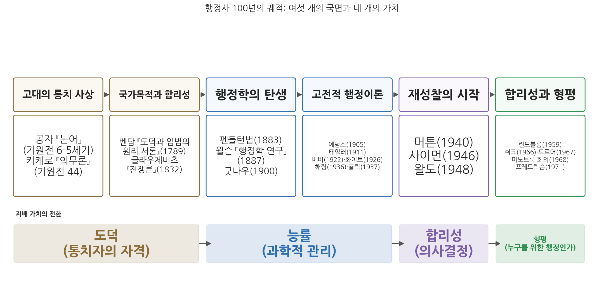
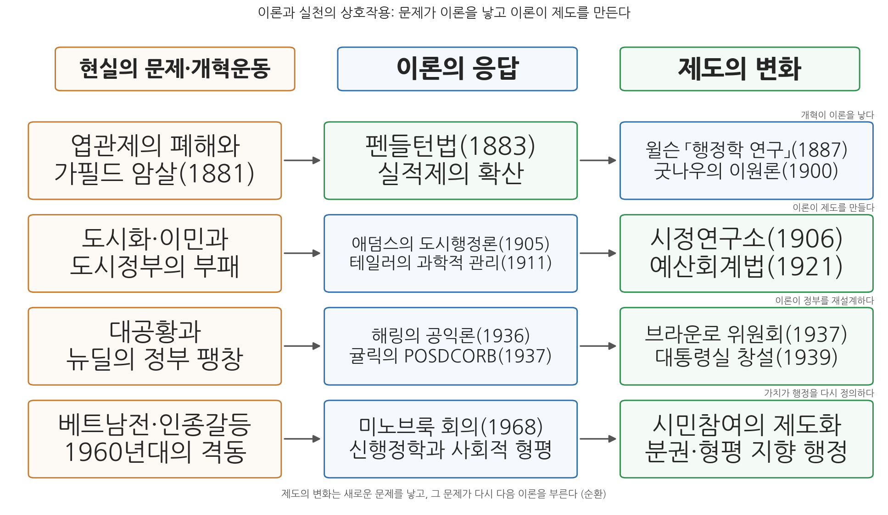

# 14주차 1차시. 행정의 발전과 시사점: 행정사 100년의 궤적

> 이제는 헌법을 만드는 것보다 그것을 운영하는 것이 더 어려워지고 있다.
> (우드로 윌슨, 「행정학 연구」, 1887)

## 이 장에서 배우는 것

한 학기 동안 우리는 열여덟 편의 텍스트를 읽었다. 기원전 5세기의 공자에서 시작해 1967년의 드로어까지, 시간으로는 2,500년이지만 그 가운데 행정학이라는 학문이 걸어온 길은 1887년 윌슨의 논문에서 1968년 미노브룩 회의까지 대략 100년이다. 매주 한 사람씩 만나며 걸어온 길이라, 지금쯤 여러분의 머릿속에는 사상가들이 각자 흩어져 있을 가능성이 크다. 공자는 공자대로, 테일러는 테일러대로, 사이먼은 사이먼대로 서랍에 따로 들어 있는 상태다.

이 장의 목표는 그 서랍들을 열어 하나의 지도 위에 다시 배열하는 것이다. 지도를 그려 놓고 보면 두 가지가 보인다. 첫째, 각 사상가는 외따로 등장한 것이 아니라 앞 시대가 남긴 문제에 답하면서 등장했다. 둘째, 그 답들의 밑바탕에 놓인 가치가 시대에 따라 도덕에서 능률로, 능률에서 합리성으로, 합리성에서 형평으로 옮겨 갔다. 이 장을 마치면 여러분은 어떤 사상가의 이름을 들어도 "그는 어떤 문제에, 어떤 가치로 답했는가"를 말할 수 있게 된다. 그것이 기말고사 대비이기도 하고, 기말고사보다 오래 남을 공부이기도 하다.

구체적으로 다음을 배운다.

- 1주차부터 13주차까지 읽은 원전들을 시대순 서사로 다시 연결하기
- 시대별 지배 가치의 전환(도덕, 능률, 합리성, 형평)을 설명하기
- 개혁운동이 이론을 낳고 이론이 제도를 만든 상호작용의 사례들
- 이 궤적이 한국 행정에 던지는 시사점

<strong>이 장의 로드맵</strong> 
이 장은 하나의 질문을 따라 전개된다. <em>"열여덟 개의 텍스트는 어떻게 하나의 이야기가 되는가?"</em>  
<strong>1.1</strong> 기원에서 전환까지, 전체 지도를 시대순으로 다시 걷는다 →
<strong>1.2</strong> 그 길에서 지배 가치가 도덕 → 능률 → 합리성 → 형평으로 바뀌는 과정을 본다 →
<strong>1.3</strong> 이론과 실천이 서로를 만들어 온 상호작용을 확인한다 →
<strong>1.4</strong> 한국 행정에의 시사점을 정리한다.

## 1.1 기원에서 전환까지: 전체 지도 다시 보기

그림 14-1이 이 장 전체의 지도다. 읽는 법은 이렇다. 위쪽 여섯 개의 상자는 우리가 한 학기 동안 지나온 여섯 국면이고, 각 상자 아래에는 그 국면을 대표하는 사상가와 원전의 연도가 적혀 있다. 아래쪽 띠는 각 국면을 지배한 가치다. 이 그림에서 알 수 있는 것은 두 가지다. 첫째, 행정학의 탄생(1887) 이전에도 통치와 행정에 관한 사유는 이미 2천 년 넘게 쌓여 있었다. 둘째, 1887년 이후 100년 사이에 지배 가치가 세 번 바뀌었다. 능률에서 합리성으로, 합리성에서 형평으로다. 이제 이 지도를 왼쪽부터 차례로 걸어 보자. 각 사상가의 목소리를 원전 그대로 한 번씩 다시 듣는 것이 이 절의 방식이다.

### 고대의 통치 사상: 다스릴 자격을 묻다

1주차 2차시에서 보았듯, 세계사는 행정 제도의 흥망사로도 읽을 수 있다. 용감한 병사는 어느 사회에나 있었지만, 그들을 먹이고 급여를 줄 행정관이 없으면 제국은 유지되지 않았다. 최초의 고전적 행정국가는 중국이었고, 최초의 행정 제국은 로마였다. 그리고 그 두 문명은 각각 한 사람의 목소리를 남겼다.

2주차 1차시에서 읽은 공자(孔子, 기원전 551-479)를 떠올려 보자. 제나라 경공이 정치를 묻자 공자는 "임금은 임금답고 신하는 신하다워야 한다"고 답했고, 계강자가 정치를 묻자 이렇게 답했다.

<strong>원전 읽기 · 공자, 『논어』 안연편·자로편</strong> 
"정치란 바르게 한다는 것입니다(政者, 正也). 선생께서 바른 도리로써 이끌어 주신다면 누가 감히 바르지 않은 일을 하겠습니까?" 
"자기 자신이 올바르면 백성들은 명령을 내리지 않아도 자발적으로 행하고, 자기 자신이 올바르지 않으면 명령을 내려도 따르지 않는다(其身正, 不令而行, 其身不正, 雖令不從)."

무슨 말인가. 통치의 성패는 제도나 기술이 아니라 다스리는 사람의 도덕적 자격에 달려 있다는 것이다. 왜 중요한가. 여기에서 "공직은 아무나 맡는 자리가 아니라 자격을 갖춘 사람이 맡는 자리"라는 생각이 출발하기 때문이다. 뒤에서 보겠지만 이 생각은 2천 년 뒤 실적주의라는 제도의 씨앗이 된다.

2주차 2차시의 키케로(Marcus Tullius Cicero, 기원전 106-43)는 같은 질문에 로마 공화정의 언어로 답했다. 그는 생애 마지막 해에 아들에게 보내는 편지 형식으로 『의무론』(기원전 44)을 썼다.

<strong>원전 읽기 · 키케로, 『의무론』(기원전 44)</strong> 
"공적 사무를 맡으려는 사람은 플라톤이 남긴 두 가지 조언을 굳게 지켜야 한다. 첫째, 시민에게 유익한 바에 시선을 굳게 고정하여 무엇을 하든 그것을 염두에 두고, 자신의 이익은 잊어야 한다. 둘째, 공화국의 몸 전체를 돌보아야 하며, 한 부분을 보호하느라 나머지를 소홀히 해서는 안 된다. 공화국의 경영은 후견과 같아서, 후견인에게 유익한 바가 아니라 보호받는 자들에게 유익한 바에 비추어 수행되어야 한다."

공직은 사익 추구의 수단이 아니라 맡겨진 신탁이라는 것, 그리고 공직자는 특정 집단이 아니라 전체를 섬겨야 한다는 것이다. 공자가 통치자의 내면(수신)을 물었다면, 키케로는 공직자의 책무(의무)를 물었다. 방향은 다르지만 두 사람 모두 행정을 도덕의 문제로 보았다는 점에서 같은 시대에 속한다.

### 국가목적과 합리성: 계산하는 정부의 예고

3주차에서 우리는 근대로 건너뛰어 두 사람을 만났다. 먼저 벤담(Jeremy Bentham, 1748-1832)이다. 그는 정부가 무엇을 해야 하는지, 그 판단 기준을 도덕적 직관이 아닌 계산에서 찾았다.

<strong>원전 읽기 · 벤담, 『도덕과 입법의 원리 서론』(1789)</strong> 
"자연은 인류를 두 주권자, 곧 고통과 쾌락의 지배 아래 두었다. 우리가 무엇을 해야 하는지, 그리고 실제로 무엇을 하게 될지는 오직 이 두 주인이 가리킨다. … 공리의 원리란, 모든 행위를 승인하거나 부인하는 근거를 그 행위가 당사자의 행복을 늘리는 경향이 있는지 줄이는 경향이 있는지에 두는 원리다. 여기서 모든 행위라 함은 개인의 행위만이 아니라 정부의 모든 조치를 포함한다."

정부의 조치를 "최대 다수의 최대 행복"이라는 잣대로, 곧 효과의 측정으로 판정하자는 주장이다. 3주차 1차시에서 보았듯 이것이 오늘날 비용편익분석의 사상적 뿌리이고, 13주차에서 만난 예산개혁과 정책분석의 먼 조상이다.

클라우제비츠(Carl von Clausewitz, 1780-1831)는 정반대편에서 근대 국가의 합리성에 경고를 남겼다. 그는 전쟁이 정치의 연장선이라는 명제로 유명하지만, 우리가 3주차 2차시에서 읽은 대목은 계획과 실행 사이의 간극에 관한 것이었다.

<strong>원전 읽기 · 클라우제비츠, 『전쟁론』(1832)</strong> 
"전쟁에서 모든 것은 매우 단순하다. 그러나 가장 단순한 것조차도 어렵다. 이 어려움들이 누적되어 일종의 마찰을 만들어 내는데, 전쟁을 직접 본 적 없는 사람은 결코 그것을 정확히 상상할 수 없다. … 전쟁에서 얻어지는 정보의 상당 부분은 서로 모순되며, 그보다 더 많은 부분은 거짓이고, 의심스러운 것이 압도적으로 많다."

책상 위의 완벽한 계획은 현장의 무수한 작은 사정들에 부딪혀 어긋난다. 정보는 늘 불완전하고, 실행에는 늘 마찰이 있다. 이 통찰은 100여 년 뒤 사이먼의 제한된 합리성과 린드블롬의 점증주의에서 행정학의 언어로 되살아난다. 벤담이 "계산하라"고 말했다면 클라우제비츠는 "계산은 반드시 어긋난다는 것도 계산하라"고 말한 셈이다. 이 두 목소리의 긴장은 학기 내내 반복되었다.

### 행정학의 탄생: 엽관제의 폐허 위에서

4주차 1차시에서 보았듯, 미국의 19세기는 엽관제(spoils system)의 시대였다. 선거에서 이긴 정당이 공직을 전리품처럼 나누어 가졌고, 그 폐해는 1881년 가필드 대통령이 낙심한 구직자에게 암살당하는 사건에서 극에 달했다. 1883년 펜들턴법이 공개경쟁시험과 실적에 기반한 공무원제를 만들었다. 주목할 점은 순서다. 제도 개혁(1883)이 먼저였고, 이론(1887)이 그 뒤를 따랐다.

그 이론이 우드로 윌슨(Woodrow Wilson, 1856-1924)의 「행정학 연구」다. 당시 무명의 젊은 강사였던 윌슨은 임용 개혁에서 멈추지 말고 정부의 조직과 운영 방법 전체를 연구하자고 제안했다.

<strong>원전 읽기 · 우드로 윌슨, 「행정학 연구」(1887)</strong> 
"행정 연구의 목적은 첫째, 정부가 적절하고도 성공적으로 할 수 있는 일이 무엇인지 발견하고, 둘째, 그런 일들을 어떻게 하면 가능한 한 최고의 효율로, 그리고 돈이든 에너지든 가능한 한 최소의 비용으로 수행할 수 있는지를 밝혀내는 데 있다. … 이제는 헌법을 만드는 것보다 그것을 운영하는 것이 더 어려워지고 있다. … 행정의 영역은 사업의 영역이다. 행정적 질문들은 정치적 질문이 아니다. 정치는 행정에게 과업을 부여하지만, 그 직무들을 좌지우지하도록 허용되어서는 안 된다."

이 짧은 논문에 행정학의 출생신고서가 들어 있다. 연구 대상(정부가 할 일과 그것을 잘하는 방법), 지향 가치(효율과 경제), 그리고 전략(행정을 당파 정치에서 떼어 내기)이다. 마지막 항목이 훗날 정치행정 이원론(politics-administration dichotomy)이라 불리게 되는데, 4-5주차에서 보았듯 이는 실적제를 지키기 위한 개혁운동의 정치 전략이기도 했다. 공직 임용에서 정치를 몰아내려면 "행정은 정치가 아니다"라는 명제가 필요했던 것이다.

5주차 2차시의 프랭크 굿나우(Frank J. Goodnow, 1859-1939)는 이 구분을 정부 기능의 이론으로 정교화했다.

<strong>원전 읽기 · 프랭크 굿나우, 『정치와 행정』(1900)</strong> 
"모든 정부 체제에는 두 가지 궁극적인 기능이 있다. 국가 의지의 표명과 그 의지의 집행이 그것이다. 앞의 기능이 정치이고, 뒤의 기능이 행정이다. … 그러나 이 두 기능의 분화가 명확하더라도, 그 기능들을 서로 분리된 기관에 배타적으로 배정하는 것은 불가능하다."

굿나우를 읽을 때 놓치기 쉬운 대목이 뒷문장이다. 그는 기능은 구분했지만, 그 기능이 기관 단위로 깨끗이 나뉜다고는 보지 않았다. 미국 입법부는 특별법으로 행정 기능을 수행하고, 행정부는 거부권으로 정치 기능에 개입한다. 이원론은 탄생하는 순간부터 이미 단서 조항을 달고 있었던 셈이다.

### 과학적 관리와 관료제: 능률의 복음

6주차 1차시에서 우리는 행정학이 자라난 토양인 도시를 보았다. 산업화와 이민으로 폭발하는 도시, 부패한 정치 기계, 그리고 그에 맞선 진보주의 개혁운동이다. 이 국면에서 제인 애덤스(Jane Addams, 1860-1935)의 목소리는 특별하다. 시카고 헐 하우스에서 빈민과 함께 살았던 그는 1905년의 연설에서 미국 도시행정 실패의 뿌리를 건국자들의 인간관에서 찾았다.

<strong>원전 읽기 · 제인 애덤스, 「도시 행정의 문제」(1905)</strong> 
"우리 도시 행정의 수많은 문제점들은 바로 이러한 과거의 유물, 곧 우리의 초기 민주주의가 시민 사회의 역량과 민의의 힘에 대한 깊은 믿음에서 출발한 것이 아니라 그저 막연한 도덕적 낭만주의에 불과했다는 사실에서 비롯되는지도 모른다. … 사실 시민들에게는 정책의 혜택보다 그 과정에 참여할 권리가 더 중요했다."

행정의 실패는 기술 부족이 아니라 시민을 통치의 대상으로만 본 데서 온다는 진단이다. 이 목소리는 당시 주류가 되지 못했지만, 60여 년 뒤 신행정학의 참여 요구에서 되살아난다.

같은 시기 주류가 된 것은 프레더릭 테일러(Frederick W. Taylor, 1856-1915)의 과학적 관리였다. 6주차 2차시에서 읽은 1912년 하원 증언에서 그는 관리의 네 가지 새 의무를 설명했다.

<strong>원전 읽기 · 프레더릭 테일러, 「과학적 관리」(1912년 하원 증언)</strong> 
"첫 번째 의무는, 과거에는 노동자들의 머릿속에 들어 있던 방대한 전통 지식을 경영 측이 의도적으로 수집하는 것입니다. 이 지식 전체를 모으고 기록하고 표로 만들어, 많은 경우 마침내 법칙과 규칙, 수학 공식으로까지 환원하는 것입니다. … 과학적 관리는 불화가 아니라 조화가 규칙인 관리라고 정당하게, 그리고 진실하게 말할 수 있습니다."

일하는 방법에는 유일 최선의 방법(one best way)이 있고, 그것은 과학적 관찰로 발견할 수 있으며, 발견되면 모두에게 적용해야 한다는 것이다. 20세기 전반기에 과학적 관리는 복음처럼 퍼졌고, 능률은 행정 개혁의 절대 언어가 되었다. 인간을 생산 기계의 부품으로 본다는 비판은 그때도 있었고 지금도 유효하지만, 측정하고 표준화하고 개선한다는 발상 자체는 오늘날의 성과관리에까지 이어지고 있다.

7주차 1차시의 막스 베버(Max Weber, 1864-1920)는 이 능률의 조직적 형태를 이념형(ideal type)으로 그려 냈다.

<strong>원전 읽기 · 막스 베버, 「관료제」(1922, 사후 출판)</strong> 
"확고한 규칙을 통해 확립된 공적 의무의 원칙이 존재하며, 이는 일반적으로 법률이나 행정 명령에 의해 규정된다. … 직무 계층과 권위의 단계 원칙이 존재한다. 상급과 하급의 체계적 질서가 있고, 하급 기관은 상급 기관의 감독을 받는다. … 직위 취임은 직위의 목적에 충실하겠다는 의무를 받아들이는 것이며, 근대적 충성은 개인적 관계가 아니라 비인격적이고 기능적인 목적에 복무하는 것이다."

규칙, 계층, 문서, 전문 훈련, 전임성, 비인격성. 베버가 추출한 이 특징들은 관료제를 찬양하려는 것도 비난하려는 것도 아니었다. 가장 완전하게 발달한 관료제의 모습을 개념으로 정리한 것이다. 그 덕분에 이후의 모든 관료제 논의는, 옹호든 비판이든, 베버를 출발점으로 삼게 되었다.

7주차 2차시의 레너드 화이트(Leonard D. White, 1891-1958)는 이렇게 쌓인 지식을 최초의 교과서로 묶었다. 1926년의 『행정학 입문』 서문에서 그는 신생 학문의 좌표를 네 문장으로 선언했다.

<strong>원전 읽기 · 레너드 화이트, 『행정학 입문』(1926)</strong> 
"이 책은 네 가지 가정을 전제로 한다. 첫째, 행정은 단일한 과정이며, 시 정부에서 관찰되든 주나 연방 정부에서 관찰되든 본질적 특성은 거의 동일하다. 둘째, 행정 연구는 법이 아니라 관리의 기반에서 출발해야 한다. 셋째, 행정은 여전히 주로 예술이지만, 이를 과학으로 전환하려는 이상은 실현 가능하며 가치가 있다. 넷째, 행정은 이미, 그리고 앞으로도 계속해서 현대 정부 문제의 핵심이 될 것이다."

교과서가 나왔다는 것은 학문이 제도화되었다는 뜻이다. 윌슨의 제안(1887)에서 화이트의 교과서(1926)까지 40년 만에, 행정학은 대학의 강좌와 전공과 교재를 갖춘 분과가 되었다.

### 행정국가: 재량의 발견과 이원론의 붕괴

1930년대의 대공황과 뉴딜은 정부의 기능을 폭발적으로 확장시켰다. 알파벳 약칭으로 불리는 기관들이 쏟아졌고, 의회는 일반 원칙만 정한 법률을 만들고 세부는 행정에 맡겼다. 이 현실 앞에서 "행정은 정치가 아니다"라는 교리는 유지되기 어려웠다. 9주차 1차시의 펜들턴 해링(E. Pendleton Herring, 1903-2004)이 그 붕괴를 정면으로 이론화했다.

<strong>원전 읽기 · 펜들턴 해링, 『공공행정과 공익』(1936)</strong> 
"의회는 일반 원칙을 천명한 법률을 제정한다. 세부 사항은 추가 규정으로 메워져야 하고, 그 법의 적용을 요구하는 조건을 판단하는 일은 관료에게 맡겨진다. … 법률의 문구가 그의 범위를 한정하지만, 그 재량의 여지 안에서 그는 국가 목적에 대한 자신의 해석을 기록해야 한다. … 공익은 법을 집행하는 행정가를 인도하는 기준이다. 그것은 행정에 통일성과 질서, 객관성을 들여오기 위해 고안된 언어적 상징이며, 관료제에게는 사법부의 적법절차 조항과 같은 역할을 한다."

관료는 법을 기계적으로 집행하는 존재가 아니라, 재량의 공간 안에서 공익을 해석하는 존재라는 것이다. 이 순간 행정은 다시 정치적인 것이 되었다. 다만 해링은 그 해석의 기준인 공익이 측량할 수 없는 심리적 개념이라는 것도 정직하게 인정했다. 관료는 "눈앞의 함정을 밝혀 줄 빛이 거의 없는 채로 자신의 별을 따라가야" 한다.

한편 확장된 정부를 어떻게 조직할 것인가라는 실무 문제에는 9주차 2차시의 루서 귤릭(Luther Gulick, 1892-1993)이 답했다. 그는 브라운로 위원회에 참여해 대통령의 관리 기구를 설계한 인물이기도 하다.

<strong>원전 읽기 · 루서 귤릭, 「조직이론에 관한 노트」(1937)</strong> 
"조직 이론은 한 사업의 분업 단위들 위에 부과되는 조정(co-ordination)의 구조에 관한 것이다. 분업은 조직의 토대이며, 실은 조직이 존재하는 이유 그 자체다. … 최고책임자는 무슨 일을 하는가? POSDCORB가 그 답이다. 기획, 조직화, 인사, 지휘, 조정, 보고, 예산이 그것이다."

분업과 조정, 명령통일, 통솔범위. 귤릭은 조직 설계의 원리들을 정리해 고전적 조직이론의 정점을 이루었다. 그러나 바로 그 "원리"라는 말이 다음 시대의 표적이 된다.

### 행태주의와 재성찰: 정통 교리가 흔들리다

1940년대에 들어서면 고전기의 확신들이 안팎에서 검증대에 오른다. 먼저 10주차 1차시의 로버트 머튼(Robert K. Merton, 1910-2003)이 베버의 관료제를 뒤집어 보았다. 베버가 관료제가 이루는 것(정밀성, 신뢰성, 효율성)을 보았다면, 머튼은 같은 구조가 만들어 내는 병리를 보았다.

<strong>원전 읽기 · 로버트 머튼, 「관료제의 구조와 성격」(1940)</strong> 
"과거에 성공적으로 적용되었던 훈련과 기술에 근거한 행위가 변화된 조건에서는 부적절한 반응을 초래할 수 있다. … 그들의 훈련이 무능이 될 수 있다. … 원래는 수단으로 여겨졌던 규칙 준수가 그 자체로 목적으로 변형된다. 수단적 가치가 종국적 가치로 전치되는 익숙한 목표 대치의 과정이 일어나는 것이다."

훈련된 무능(trained incapacity)과 목표 대치(goal displacement). 관료제의 경직과 형식주의는 나쁜 개인의 일탈이 아니라, 신뢰성을 확보하려는 바로 그 장치들이 낳는 구조적 결과라는 것이다. 규정만 따지느라 민원인을 돕지 못하는 창구의 풍경은 규칙을 절대화하도록 훈련된 조직의 정상 작동일 수 있다.

10주차 2차시의 허버트 사이먼(Herbert A. Simon, 1916-2001)은 더 근본적인 도전장을 냈다. 귤릭이 정리한 행정의 원리들이 과학의 자격을 갖추지 못했다는 것이다.

<strong>원전 읽기 · 허버트 사이먼, 「행정의 격언들」(1946)</strong> 
"격언은 거의 언제나 서로 모순되는 짝으로 존재한다. '돌다리도 두들겨 보고 건너라.' 그런데 '망설이는 자는 실패한다.' … 과학적 이론은 무엇이 참인지뿐 아니라 무엇이 거짓인지도 말해 주어야 한다. 오늘날 행정이론을 구성하는 명제들의 대부분은 안타깝게도 격언의 이러한 결함을 공유한다. 거의 모든 원리마다 똑같이 그럴듯하고 수용 가능한 모순 원리를 하나씩 찾을 수 있다."

전문화의 원리는 명령통일의 원리와 충돌하고, 통솔범위 축소의 원리는 결재 단계 축소의 원리와 충돌한다. 원리들끼리 반대 방향을 가리키는데 어느 쪽을 따를지 알려 주는 이론이 없다면, 그것은 과학이 아니라 수사에 쓰이는 격언일 뿐이다. 사이먼은 이 비판 위에서 의사결정을 행정학의 새 중심 개념으로 세우고, 완전한 합리성 대신 제한된 합리성(bounded rationality) 아래에서 만족화(satisficing)하는 행정인의 모습을 그렸다. 클라우제비츠가 전장에서 본 것을 사이먼은 사무실에서 다시 본 셈이다.

11주차의 드와이트 왈도(Dwight Waldo, 1913-2000)는 또 다른 방향에서 정통 교리를 해부했다. 정치이론가였던 그는 『행정국가』(1948)에서, 스스로 사실만 다룬다고 믿었던 행정학이 실은 하나의 정치이론이었음을 폭로했다. 특히 능률이라는 최고 가치가 실은 특정한 시대의 신념이라는 것이다. 그는 1965년의 회고 논문에서 이 논점을 더 밀고 나갔다.

<strong>원전 읽기 · 드와이트 왈도, 「행정국가 다시 보기」(1965)</strong> 
"능률이 그 자체로 가치일 수 없다는 나의 주장은, 분석의 수준에서는 옳았지만 심리적·사회적 현상을 간과한 것이었다. 어떤 사회가 능률을 그 수단적 가치 때문에 열심히 배양하다 보면, 시간이 흐르면서 그것은 가치 그 자체가 될 수 있다. 위생상의 이유로 먼저 가치 있던 청결이 마침내 경건 바로 옆에 놓이게 되는 것처럼 말이다."

능률은 "무엇을 위한 능률인가"라는 질문 없이는 성립하지 않는 상대적 개념인데, 미국 행정학은 그것을 신앙처럼 절대화해 왔다는 것이다. 민주주의와 행정을 화해시켜야 한다는 왈도의 문제의식은 그가 후원한 1968년 미노브룩 회의를 거쳐 신행정학으로 이어진다.

### 신행정학, 점증주의, 정책분석: 세 갈래의 전환

1950-60년대의 마지막 국면에서 행정학은 세 갈래로 갈라지며 확장된다.

첫째 갈래는 의사결정의 현실주의다. 12주차 1차시의 찰스 린드블롬(Charles E. Lindblom, 1917-2018)은 합리적·총체적 결정 모형이 복잡한 정책 문제에서는 아예 작동할 수 없다고 논증했다.

<strong>원전 읽기 · 찰스 린드블롬, 「'우왕좌왕하기'의 과학」(1959)</strong> 
"그는 많은 목표를 미리 분명히 세워 두고 그에 맞는 최적의 수단을 찾는 것이 아니라, 경험과 점진적 비교를 통해 덜 나쁜 대안을 찾아가며, 필요에 따라 목표 자체를 조금씩 수정해 나간다. … 좋은 정책의 기준은 목표에 대한 논리적 적합성보다는, 의견을 달리하는 참여자들 사이의 합의의 정도가 주된 시험 기준이 된다."

기본 전제에서 조금씩 바꾸어 가는 연속적 제한 비교, 곧 점증주의(incrementalism)는 실패의 미봉책이 아니라 인간의 인지적 한계와 민주정치의 구조를 반영한 실천 가능한 방법이라는 것이다.

둘째 갈래는 합리적 분석의 제도화다. 13주차 1차시의 앨런 쉬크(Allen Schick)는 예산개혁의 역사를 세 단계로 정리했다. 통제(1920-30년대의 품목별 예산), 관리(뉴딜 이후의 성과주의 예산), 그리고 기획(1960년대의 PPBS)이다.

<strong>원전 읽기 · 앨런 쉬크, 「PPB로 가는 길」(1966)</strong> 
"모든 예산 시스템은, 초보적인 것일지라도 기획, 관리, 통제의 과정을 포함한다. 모든 개혁은 이 셋 사이의 균형을 변화시킨다. … 모든 차이점들은 하나의 진술로 요약될 수 있다. 예산 편성의 정신이 정당화에서 분석으로 이동한다는 것이다."

셋째 갈래는 그 분석에 대한 비판적 종합이다. 13주차 2차시의 예헤츠켈 드로어(Yehezkel Dror, 1928-2026)는 시스템 분석이 계량화에 집착하고 정치적 실현 가능성을 무시한다고 비판하면서, 정치와 가치를 분석의 중심에 되돌려 놓는 새 전문직을 제안했다.

<strong>원전 읽기 · 예헤츠켈 드로어, 「정책분석가: 정부 서비스의 새로운 전문직 역할」(1967)</strong> 
"정치와 정치 현상들이 분석의 초점에 놓여야 한다. 정치적인 것을 경제 이론이라는 프로크루스테스의 침대에 억지로 끼워 맞추려 해서는 안 된다. … 정책분석의 도움으로 복잡한 공공 의사결정과 정책 결정에서 가령 10에서 15퍼센트 정도의 개선은 달성될 수 있으며, 이것은 많은 것이다."

그리고 이 모든 갈래 위에서 규범의 전환이 왔다. 1968년, 왈도가 후원한 미노브룩 회의에 모인 젊은 학자들은 베트남 전쟁, 인종 갈등, 빈곤이라는 시대의 문제에 행정학이 답하지 못한다고 반성했다. 12주차 2차시에서 만난 조지 프레드릭슨(H. George Frederickson, 1934-2020)이 그 문제의식을 정식화했다.

<strong>원전 읽기 · 조지 프레드릭슨, 「신행정학을 향하여」(1971)</strong> 
"행정학의 논리적 근거는 거의 항상 더 나은, 곧 더 능률적이거나 경제적인 관리였다. 신행정학은 이 고전적인 목표와 근거에 사회적 형평성을 추가한다. 이 서비스가 사회적 형평성을 증진하는가라는 질문을 더하는 것이다. … 소수자들의 박탈을 바로잡으려는 변화를 위해 노력하지 않는 행정은 결국 그 소수자들을 억압하는 데 사용될 것이다."

능률성과 경제성이라는 두 기둥 옆에 사회적 형평성(social equity)이라는 제3의 기둥을 세운 것이다. 흥미로운 것은 이 "새로운" 행정학이 스스로 인정했듯 아주 오래된 질문의 부활이라는 점이다. 행정은 누구를 위해 존재하는가. 공자와 키케로가 물었던 바로 그 질문이다.

## 1.2 시대별 가치의 전환: 도덕에서 형평으로

이제 같은 길을 가치의 관점에서 다시 요약해 보자. 그림 14-1의 아래쪽 띠가 보여 주듯, 행정을 판단하는 지배 가치는 네 번 옷을 갈아입었다.

<strong>정의 · 지배 가치(dominant value)</strong> 
한 시대의 행정 담론에서 "좋은 행정"을 판별하는 기준으로 널리 받아들여진 가치를 말한다. 지배 가치는 다른 가치들을 배제한다는 뜻이 아니라, 논쟁이 벌어질 때 최종 근거로 호출되는 가치라는 뜻이다.

**도덕의 시대.** 공자와 키케로에게 좋은 행정이란 좋은 사람의 행정이었다. 통치자의 수신과 공직자의 의무가 판단 기준이었고, 제도는 그 도덕을 담는 그릇이었다. 이 전통은 결코 낡은 것이 아니다. 엽관제 개혁운동이 "공직은 공적 신탁"이라는 도덕적 언어로 국민을 설득했다는 것을 기억하자. 4주차에서 본 이튼의 말대로, 개혁운동의 도덕적 외피는 그 사회적 정당성의 원천이었다.

**능률의 시대.** 윌슨에서 귤릭까지, 1887년에서 1937년까지의 반세기는 능률이 지배했다. 정부가 하는 일을 최소 비용으로 잘 해내는 것이 좋은 행정이었고, 그 방법은 과학적 관찰과 원리의 발견이었다. 도덕에서 능률로의 전환은 판단의 초점이 사람의 자격에서 일의 방법으로 옮겨 간 것이라 말할 수 있다. 좋은 사람을 뽑는 문제(실적제)가 해결의 궤도에 오르자, 뽑힌 사람들이 일하는 방식(조직과 관리)이 문제로 떠올랐던 것이다.

**합리성의 시대.** 사이먼 이후의 20년은 합리성이 지배했다. 다만 이 합리성은 이중적이다. 한편으로 사이먼과 린드블롬은 인간 합리성의 한계를 밝혔고, 다른 한편으로 쉬크가 기록한 PPBS와 드로어의 정책분석은 그 한계 안에서 가능한 최대의 분석적 합리성을 제도화하려 했다. 능률에서 합리성으로의 전환은 초점이 집행의 방법에서 결정의 질로 옮겨 간 것이다. 무엇을 어떻게 잘할까에서, 애초에 무엇을 할지 어떻게 정할까로 질문이 깊어졌다.

**형평의 시대.** 그리고 1968년 이후, 신행정학은 "누구를 위하여"라는 질문을 전면에 세웠다. 능률적이고 합리적인 행정이 체계적으로 특정 집단에게 유리하고 힘없는 이들에게 불리하다면, 그것은 좋은 행정인가. 프레드릭슨의 답은 아니라는 것이었다. 합리성에서 형평으로의 전환은 초점이 결정의 질에서 결과의 분배로 옮겨 간 것이다.

<strong>왜 가치는 "교체"가 아니라 "축적"인가?</strong> 
새 가치가 등장했다고 옛 가치가 폐기된 적은 없다. 오늘의 행정은 여전히 공직 윤리(도덕)를 요구받고, 성과와 비용(능률)으로 평가받으며, 근거에 기반한 결정(합리성)을 요구받고, 그 결과의 공정성(형평)을 검증받는다. 행정사의 가치 전환은 지층이 쌓이는 과정에 가깝다. 새 지층이 위에 놓일 뿐 아래 지층은 그대로 남아 힘을 발휘한다. 그래서 현대 행정가는 네 가치의 긴장을 동시에 관리해야 하는 사람이 되었다. 왈도가 말한 대로, 능률의 질문은 민망해졌어도 사라지지 않았다. "어떤 버전의 개념으로든 능률 없이 우리가 하는 많은 일을 어떻게 이해할 수 있겠는가."

## 1.3 이론과 실천의 상호작용: 개혁이 이론을 낳고 이론이 제도를 만든다

행정학의 역사에서 이론은 서재에서 태어나지 않았다. 윌슨은 「행정학 연구」에서 헤겔을 인용하며 이렇게 말했다. 어느 시대의 철학이란 "그 시대의 정신이 추상적 사유 속에 표현된 것에 불과"하다고. 행정이론도 마찬가지다. 시대의 문제가 이론을 부르고, 이론이 다시 제도를 바꾸고, 바뀐 제도가 새로운 문제를 낳는 순환이 행정사의 기본 리듬이다.

그림 14-2를 읽는 법은 이렇다. 각 줄은 하나의 순환 사례이고, 상자의 색이 그 성격을 나타낸다. 주황색은 현실의 문제, 파란색은 이론의 응답, 초록색은 제도의 변화다. 이 그림에서 알 수 있는 것은 문제, 이론, 제도의 등장 순서가 매번 같지 않다는 점이다. 첫째 줄에서는 제도가 이론보다 먼저 왔고, 둘째와 셋째 줄에서는 이론이 제도를 이끌었다.

**사례 1: 개혁이 이론을 낳다.** 엽관제의 폐해와 가필드 암살(1881)이라는 충격이 펜들턴법(1883)이라는 제도를 만들었고, 그 제도의 성공을 이어 가려는 고민 속에서 윌슨의 논문(1887)과 굿나우의 이론(1900)이 나왔다. 윌슨 스스로 공무원제도 개혁을 "보다 포괄적인 행정 개혁을 향한 서곡"이자 "도덕적 준비"라고 불렀다. 행정학은 개혁운동의 자식이다.

**사례 2: 이론이 제도를 만들다.** 시정연구소 운동과 테일러의 과학적 관리는 측정과 표준화의 언어를 제공했고, 그 언어가 예산이라는 제도에 스며들었다. 13주차에서 보았듯 1907년 뉴욕시정연구국은 이미 기능별 분류의 프로그램 각서를 실험했고, 이 흐름은 1921년 예산회계법으로 결실을 맺었다. 쉬크의 표현을 빌리면 "예산 개혁은 그것이 유래한 시대의 흔적"을 지닌다.

**사례 3: 이론이 정부를 재설계하다.** 뉴딜로 팽창한 정부 앞에서 해링은 공익과 재량의 이론을, 귤릭은 조직과 조정의 이론을 내놓았다. 귤릭이 참여한 브라운로 위원회(1937)의 권고는 1939년 대통령실(Executive Office of the President) 창설로 이어졌다. "대통령에게는 도움이 필요하다"는 이론적 진단이 정부의 실제 구조를 바꾼 것이다.

**사례 4: 가치가 행정을 다시 정의하다.** 1960년대의 격동은 미노브룩 회의(1968)를 낳았고, 신행정학의 형평과 참여의 언어는 이후 시민참여의 제도화와 분권 개혁의 규범적 기초가 되었다. 프레드릭슨이 보여 주었듯, 비용편익분석이라는 능률의 도구조차 "이 사업의 혜택이 누구에게 가는가"를 따지는 형평의 도구로 다시 벼려질 수 있었다.

<strong>유의 · 이론은 시대의 거울이지만, 거울은 시대보다 오래 남는다</strong> 
이론이 시대의 산물이라는 말은 이론이 시대와 함께 소멸한다는 뜻이 아니다. 정치행정 이원론은 엽관제라는 특정한 문제의 산물이었지만, "행정의 전문성을 정치적 개입에서 어떻게 보호할 것인가"라는 그 핵심 질문은 오늘날의 인사 개입 논란에서도 되살아난다. 고전을 읽을 때는 두 가지를 함께 물어야 한다. 이 이론은 어떤 시대의 어떤 문제에 답한 것인가(맥락), 그리고 그 답에서 시대를 넘어 남는 것은 무엇인가(유산).

## 1.4 한국 행정에의 시사점

이 궤적은 미국사의 일부이지만, 그로부터 배울 것은 미국에 국한되지 않는다. 윌슨 자신이 프로이센과 프랑스의 행정을 연구하며 "우리 자신만 알고 있는 한, 우리는 우리 자신에 관해 아무것도 모른다"고 썼다. 그가 유럽의 행정 기술을 미국의 헌정 원리로 걸러 내어 "미국화"하자고 제안했듯, 우리는 이 100년의 궤적을 한국의 맥락으로 걸러 읽을 수 있다. 네 가지 시사점을 정리한다.

**첫째, 도덕의 유산은 한국 행정의 오래된 자산이자 숙제다.** 유교적 통치 전통 위에서 과거제를 운영해 온 한국은, 공자가 말한 "다스릴 자격"의 심사를 제도화한 오랜 경험을 가지고 있다. 오늘날 헌법 제7조가 "공무원은 국민 전체에 대한 봉사자"라고 선언할 때, 그 문장 속에는 공자의 덕치와 키케로의 공익 우선이 함께 울린다. 그러나 도덕의 언어가 실제 행위를 보장하지 않는다는 것 역시 행정사의 교훈이다. 부정청탁금지법(2016년 시행)과 공직자의 이해충돌 방지법(2022년 시행) 같은 최근의 제도들은, 키케로가 말한 의무를 개인의 수양에 맡기지 않고 규칙으로 옮기려는 시도로 읽을 수 있다.

**둘째, 능률의 시대는 한국에서 압축적으로, 그리고 강력하게 진행되었다.** 1960-70년대의 발전행정은 국가 주도의 산업화를 뒷받침하는 능률의 행정이었다. 미국이 반세기에 걸쳐 겪은 관리 중심 행정학의 형성과 그 그늘(인간의 도구화, 목표 대치)을 한국은 훨씬 짧은 기간에 겪었다. 테일러를 읽으며 성과관리의 원형을, 머튼을 읽으며 그 병리의 구조를 이해하는 일은 그래서 한국 독자에게 더 실감 나는 공부다.

**셋째, 합리성의 제도들은 이미 우리 곁에 있다.** 1999년에 도입된 예비타당성조사는 벤담의 계산과 PPBS의 분석 정신을 잇는 한국의 제도다. 국가재정운용계획과 프로그램 예산, 각종 영향평가도 마찬가지다. 그러나 쉬크가 경고했듯 형식의 변화가 저절로 행동의 변화를 낳지는 않으며, 드로어가 경고했듯 계량화에 대한 집착은 정치적 실현 가능성과 가치의 문제를 가릴 수 있다. 분석 제도가 정착한 나라일수록 "분석이 답하지 못하는 것"에 대한 감각이 필요하다.

**넷째, 형평의 질문은 지금 한국 행정의 최전선에 있다.** 수도권과 비수도권의 격차, 복지 전달체계의 사각지대, 재난 피해의 불평등한 분포까지, "이 행정의 결과가 누구에게 유리하고 누구에게 불리한가"라는 프레드릭슨의 질문은 한국의 정책 논쟁 어디에나 들어 있다. 신행정학이 가르쳐 준 것은, 이 질문이 능률의 질문을 대체하는 것이 아니라 능률의 질문에 방향을 부여한다는 점이다.

마지막으로, 이론과 실천의 상호작용이라는 관점은 한국 행정학에 특별한 과제를 남긴다. 한국의 행정 제도들 가운데 상당수는 외국에서 들여온 것이다. 윌슨이 유럽의 행정학을 두고 한 말을 우리 자신에게 되돌려 볼 수 있다. 빌려 온 지식은 "언어만"이 아니라 "사상과 원리와 목표에서 근본적으로" 우리 것으로 만들어야 한다. 그 작업은 한국의 문제가 무엇인지 정확히 아는 데서 시작하고, 그 앎은 결국 우리 시대의 텍스트를 쓰는 일로 완성된다. 여러분이 고전을 읽는 이유가 거기에 있다. 이 이야기는 다음 차시에서 이어 간다.

## 요약

한 학기의 여정은 하나의 지도로 정리된다. 고대의 통치 사상(공자의 덕치, 키케로의 의무)은 행정을 도덕의 문제로 보았다. 근대의 벤담은 정부 판단의 기준을 계산으로 바꾸었고, 클라우제비츠는 그 계산이 현실의 마찰과 불확실한 정보 앞에서 어긋난다는 것을 보여 주었다. 엽관제 개혁(펜들턴법, 1883)의 토양 위에서 윌슨(1887)이 행정학의 출생신고를 했고, 굿나우가 정치행정 이원론을 정교화했다. 애덤스가 도시의 실패를 고발하고 테일러가 능률의 복음을 전파하는 동안, 베버는 관료제의 이념형을 그렸고 화이트는 최초의 교과서로 학문을 제도화했다. 뉴딜의 행정국가는 해링의 재량과 공익, 귤릭의 조정과 POSDCORB를 낳았다. 이어진 재성찰의 시대에 머튼은 관료제의 역기능을, 사이먼은 원리의 격언성을, 왈도는 능률 이데올로기의 정치성을 폭로했다. 마지막 전환기에 린드블롬의 점증주의, 쉬크의 예산개혁 3단계, 드로어의 정책분석이 결정의 합리성을 둘러싸고 경합했으며, 미노브룩 회의(1968)와 프레드릭슨의 신행정학이 사회적 형평을 제3의 기둥으로 세웠다. 이 과정에서 지배 가치는 도덕에서 능률로, 합리성으로, 형평으로 전환했으되 축적되었고, 이론과 실천은 문제가 이론을 낳고 이론이 제도를 만드는 순환으로 얽혀 왔다. 한국 행정은 이 궤적을 압축적으로 경험했으며, 네 가치의 긴장을 동시에 관리해야 하는 오늘의 과제 앞에 서 있다.

## 토론·복습 문제

**14-1. (기말 대비 서술형)** 행정사에서 지배 가치는 도덕에서 능률로, 능률에서 합리성으로, 합리성에서 형평으로 전환해 왔다. 각 가치를 대표하는 사상가와 원전을 하나씩 들어 이 전환 과정을 설명하고, "새 가치는 옛 가치를 대체하는가, 아니면 그 위에 쌓이는가"라는 물음에 대해 자신의 견해를 논의하시오.

**14-2. (원전 구절 해석형)** 다음은 해링의 『공공행정과 공익』(1936)의 한 구절이다. "법률의 문구가 그의 범위를 한정하지만, 그 재량의 여지 안에서 그는 국가 목적에 대한 자신의 해석을 기록해야 한다." 이 구절이 윌슨과 굿나우의 정치행정 이원론에 대해 갖는 함의를 설명하고, 관료의 재량이 불가피하다면 그 재량을 통제할 수 있는 방법에는 무엇이 있을지 논하시오.

**14-3. (이론과 실천의 상호작용)** 그림 14-2의 네 사례 가운데 하나를 골라, 문제와 이론과 제도가 어떤 순서로 서로를 낳았는지 구체적으로 서술하시오. 그리고 오늘날 한국에서 진행 중인 행정 개혁 하나를 골라, 그것이 어떤 문제에서 출발했고 어떤 이론적 언어로 정당화되고 있는지 같은 틀로 분석해 보시오.

**14-4. (적용)** 여러분이 어느 지방자치단체의 신규 사업 담당자라고 하자. 이 사업을 (가) 테일러라면, (나) 린드블롬이라면, (다) 프레드릭슨이라면 각각 어떤 기준으로 설계하고 평가하려 할지 한 문단씩 써 보시오. 세 기준이 충돌하는 지점이 있다면 어디인지도 밝히시오.
